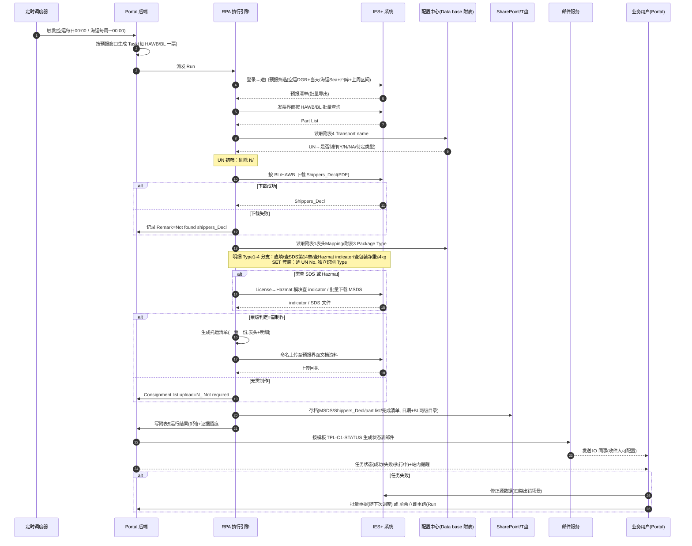

# UC34 Case 1 · 危险品托运清单自动生成 — 产品需求文档

## 文档信息

| 项目 | 内容 |
|------|------|
| **文档名称** | UC34 Case 1 · 危险品托运清单自动生成 PRD |
| **版本** | v1.0.0 |
| **创建日期** | 2026-09-24 |
| **最后更新** | 2026-09-28 |
| **负责人** | BA（德勤 MBPTS 项目组） |
| **审核人** | 待审核（Dev Lead / 业务老师） |
| **密级** | 内部 |

**文档用途**：定义 UC34 Case 1（道路运输危险货物托运清单自动生成）的完整产品需求，覆盖 Portal 前台、后台 RPA 执行链、配置与治理，供开发、测试与业务验收使用。

**关联文档**：
- [需求澄清文档](./Case1_危险品托运清单_需求澄清文档.md)
- [需求阶段 Plan](./requirements_plan.md) / [设计阶段 Plan](./design_plan.md)
- [原型导航](../../prototypes/index.html)
- 输入素材：BRD（`【MBPTS-UC34】Case1：危险品托运清单自动生成_BRD_0921 final.docx`）、业务流程图 V5、交互原型（`Case1_Demo_Final 2\页面demo`）

---

## 版本历史

| 版本号 | 修订日期 | 修订人 | 修订内容 | 状态 |
|--------|---------|--------|---------|------|
| v1.0.0 | 2026-09-24 | BA + AI 辅助 | 初版（基于 BRD 0921 final + 流程图 V5 + 原型 demo） | 待评审 |
| v1.1.0 | 2026-09-28 | BA + AI 辅助 | 基于 `Data base update 20260909.xlsx` 补充附录C（附表1-5 字段级规格）；新增 R4.2、R5.7 规则 | 待评审 |

---

# 第一部分：产品概述

## 1.1 产品定义

**产品名称**：UC34 Case 1 · 危险品托运清单自动生成

**所属系统**：MBPTS 智能作业平台（Portal 前台 + 后台 RPA 执行引擎）

**功能定位**：替代人工在 IES+ 中完成"筛选预报 → 导出 part list → UN 初筛 → 下载 Shippers_Decl → 填写托运清单（表头+危险货物明细）→ 命名上传 IES → 邮件通知 IO → 存档留痕"的全流程自动化；以**一个 HAWB/BL 为一票任务**，一票对应**一份**托运清单。

**使用端**：PC Web Portal（业务用户）+ 后台 RPA 无人值守执行

**交付版本**：v1.0.0

## 1.2 产品愿景

让危险品托运清单的制作从"人工逐票、跨表核对、手工上传"变为"定时自动、规则驱动、全程留痕"，业务人员只需处理异常。

## 1.3 核心价值

| 价值维度 | 价值描述 | 受益人群 |
|---------|--------|---------|
| 效率 | 每日/每周定时自动完成制单与上传，消除人工逐票操作 | IO 同事 |
| 合规 | 危险品道路运输托运清单合规出具，Type1-4/SET 规则统一执行，全程留痕可审计 | 业务/合规 |
| 透明 | Portal 实时状态、失败可追踪可重提、运行结果邮件通达 | 业务主管 |
| 韧性 | 配置化（附表/收件人/模板/路径）适应人员、供应商、主数据变动 | 平台运营 |

## 1.4 产品范围

### 包含范围

| 模块 | 功能描述 |
|------|--------|
| 任务触发与调度 | 空运每日 00:00、海运每周一 00:00（取上周一~周日）自动触发；手动触发入口；运行时间可配置 |
| 数据获取与初筛 | RPA 登录 IES+ 筛选导出预报清单与 part list；UN No. 匹配附表4 写回 AR 列；剔除 N/#N/A |
| Shippers_Decl 获取 | 按 BL/HAWB 下载 PDF，成功/失败均记录（Not found shippers_Decl） |
| 托运清单生成 | 表头三键 Mapping（附表1）；明细 Type1-4 分支（SDS 第14章 / Hazmat indicator / ≤4kg 排除）；SET 套装逐 UN 核验；票级判定 N_ Not required |
| 清单上传与通知 | 固定前缀命名上传 IES 文档资料；附表5 运行结果汇总；邮件模板自动发送 IO 同事 |
| 任务监控与异常 | 工作台空运/海运汇总、任务中心、任务详情（Task/Run 两层）、字段修正留痕、批量重提+单票重跑、长时执行停止 |
| 配置管理 | 清单模板 + 附表1/3/4 + 邮件记录表上传与版本管理；邮件模板与收件人配置 |
| 存档与审计 | 日期/BL 两级目录存档四类文件；年度操作记录；证据 WORM 留痕；审计日志；RBAC 只读展示 |

### 不包含范围（后续迭代）

- IES+ 系统本身的功能改造
- 邮件监听触发（Case1 为定时触发，邮件监听模块本期为空）
- 上传中心手工数据补充（Case1 无需上传文件，系统自动从 IES+ 取数）
- UC26 / UC64 / UC34 Case 2-5
- 存档存储路径的最终技术选型（T盘/SharePoint，TBD）
- IES+ 交互的批量/逐票策略细化（TBD 待 vendor 评估）

---

# 第二部分：业务背景与目标

## 2.1 业务问题

1. **人工流程长、跨系统多**：业务老师需登录 IES+ 筛选预报、导出 part list、对照 Data base 多张附表逐票判断、下载 Shippers_Decl 与 MSDS、手工填写清单、命名上传、汇总发邮件，全程 10+ 步骤。
2. **判断规则复杂易错**：UN No. 存在空/SET/Y/N/待定多种情况；待定需分别查 SDS 第14章、Hazmat indicator、包装净重（≤4kg/5L/5KG 阈值）；SET 套装一对多需逐 UN 核验。
3. **留痕与合规压力**：每步操作需记录（附表5 运行结果）、文件需按日期/BL 存档、年度操作记录需累积，人工执行难以保证完整性。
4. **异常恢复成本高**：数据出错（document 缺失、UN 标识改变、主数据变化、运单号改变）后需人工定位并重新处理。

## 2.2 业务目标与成功指标

| 目标 | 描述 | 优先级 |
|------|------|--------|
| 全自动制单 | 定时任务无人值守完成筛选→制单→上传→通知 | P0 |
| 异常可恢复 | 失败任务可查询、IES 修正数据后可重提/重跑 | P0 |
| 全程留痕 | 每步运行结果、文件、操作均有记录且防篡改 | P0 |

| 指标 | 目标值 | 测量方法 |
|------|-------|---------|
| 定时任务成功率 | ≥ 95%（剔除源数据问题） | 治理台失败率统计 |
| 单票处理时长 | 显著低于人工基线（基线待测定） | Run 耗时统计 |
| 清单上传状态邮件触达 | 每次运行 1 封，100% 发送（失败自动重试） | 邮件外发审计 |
| 留痕完整率 | 100%（附表5 行 + 存档文件 + 证据链） | 审计抽查 |

---

# 第三部分：用户角色与权限

> 身份与授权由 **Alice**（身份系统）管理，平台只读展示；UI 显隐不替代服务端授权。职责分离：主管无字段修正权，操作员无对外动作确认权。

| 功能 | OPERATOR 业务操作员 | MANAGER 业务主管 | ADMIN 平台管理员 | AUDITOR 审计员 |
|------|---------------------|------------------|------------------|----------------|
| 工作台/任务查看 task.read | 本人相关 | 团队范围 | 全部 | 只读全部 |
| 手动新建/触发任务 task.create | 允许 | 允许 | 允许 | — |
| 字段修正 task.field.correct | 允许 | — | — | — |
| 安全重跑（整单/节点/批量重提） run.rerun.safe | 允许 | 允许 | 允许 | — |
| 停止长时执行 run.stop | 允许（授权范围内） | 允许 | 允许 | — |
| 不可逆重跑 run.rerun.irreversible | — | 允许 | — | — |
| 对外动作确认 run.approve.external | — | 允许 | — | — |
| 配置表/邮件模板发布 config.publish | — | — | 允许 | — |
| 审计日志/证据链 audit.read | — | — | 允许 | 允许（只读） |
| 治理 KPI / 分析导出 | — | 允许 | 允许 | — |

**系统 Actor**：定时调度器、RPA 执行引擎、IES+ 系统、邮件服务（SMTP）、Alice 身份系统、SharePoint/T盘存档。

---

# 第四部分：术语定义

| 术语 | 说明 |
|------|------|
| IES+ | 进出口业务系统，RPA 操作对象（进口预报/发票/License-Hazmat 模块） |
| HAWB/BL No. | 分单号/提单号；一票任务的业务键，一个号对应一份托运清单 |
| Pre-alert creation date | 预报创建日期；空运=运行当日，海运=上周一~周日区间 |
| PDC | 库房代码；海运筛选限定四个 Hazmat 库房（South/West/North/East 3PL） |
| Invoice Type | 发票类型；空运筛选=DGR，海运筛选=Sea |
| Terminal WH | 终端仓库；表头三键之一 |
| Part List | 发票界面按 HAWB/BL 批量导出的零件清单（AN 列=UN No.，AJ 列=Unit N.W，AR 列=初筛结果） |
| Shippers_Decl | 托运人危险品申报单（PDF），按 BL/HAWB 从 IES+ 下载 |
| MSDS / SDS | 化学品安全技术说明书；第14部分含"联合国运输名称/道路运输 (JT/T 617)" |
| UN No. | 联合国危险货物编号；空=NA 无需制作；SET=套装，按 Y 逻辑且走套装核验 |
| 附表1 表头 Mapping list | Data base 中托运清单表头对应关系表（PDC+Invoice Type+Terminal WH 三键） |
| 附表2 | 托运清单与 Shippers_Decl 字段对应关系 |
| 附表3 Package Type | 包装类型对应关系表（新增包装类型需配置） |
| 附表4 Transport name | UN No. → 是否需要制作托运清单（I 列：Y / N / Y,查SDS第14章 / 待定,查Hazmat / 待定,查包装净重） |
| 附表5 运行结果 | 每次运行的结果记录表（8 列 + Process date） |
| Type 1-4 | 附表4 I 列四种判定类型对应的明细处理分支（见 7.2 R5） |
| Hazmat indicator | IES+ License→Hazmat 模块的危险品标识（Y/N） |
| Task / Run | 任务=业务单据（一票）；Run=一次执行实例；任务状态由最新 Run 推导，历史 Run 只读 |
| N_ Not required | 票级判定"无需制作"的状态值，写入 Consignment list upload 列 |
| WORM | Write Once Read Many，证据防篡改留痕机制 |
| Alice | 身份与权限系统，平台 RBAC 的授权来源 |

---

# 第五部分：用户故事

### US-001：系统自动执行空运每日定时任务

**作为** 业务操作员
**在** 每个自然日 00:00
**于** MBPTS 平台（无需登录操作）
**我想要** 系统自动筛选当天 DGR 空运预报并完成制单、上传、邮件通知
**以便于** 早上到岗即可看到处理结果，无需人工操作

**验收标准**：
- AC1: 系统每日 00:00 自动触发空运任务，筛选条件为 Invoice Type=DGR + Pre-alert creation=当天
- AC2: 命中的每个 HAWB/BL 生成一票独立任务（Task）并生成执行实例 Run#1
- AC3: 每票任务按七节点链路执行（触发→下载登记→UN 初筛→OCR→清单写入→IES 导入→邮件发送）
- AC4: 运行时间支持配置调整，调整后按新时间执行
- AC5: 定时来源任务的开始时间统一显示为当天 00:00

**异常/边缘场景**：
- E1: IES+ 登录失败 → 任务标记失败（E3001），生成站内提醒，可修正后重跑
- E2: 当天无 DGR 预报 → 本次运行结果为空，不产生任务，运行记录标记"无数据"
- E3: 调度时间冲突（上次未执行完） → 跳过本次触发并记录，禁止并发执行同范围任务
- E4: 手动触发与定时触发同时发生 → 已有执行中实例时拒绝新触发（E1002）

### US-002：系统自动执行海运每周定时任务

**作为** 业务操作员
**在** 每周一 00:00
**于** MBPTS 平台
**我想要** 系统自动筛选上周一~上周日的海运 Hazmat 库房预报并完成制单全流程
**以便于** 海运周度批量处理无需人工干预

**验收标准**：
- AC1: 系统每周一 00:00 触发海运任务，筛选条件为 Invoice Type=Sea + PDC∈{South/West/North/East 3PL} + Pre-alert creation=上周一~上周日
- AC2: 运行结果中 Pre-alert creation date 显示为区间格式（如 `2026/09/07~2026/09/13`）
- AC3: 保留手动触发入口，手动触发时可指定数据窗口
- AC4: 海运与空运任务互不影响，各自独立汇总

**异常/边缘场景**：
- E1: 跨周窗口内有重复分单 → 同一 HAWB/BL 在窗口内去重，仅生成一票任务
- E2: 上周窗口数据被后续修改 → 以运行时 IES+ 当前数据为准，差异在 Remark 体现
- E3: 周一 00:00 IES+ 维护不可用 → 任务失败并提醒，支持手动补触发

### US-003：业务操作员手动新建/触发任务

**作为** 业务操作员
**在** 需要临时处理或补跑时
**于** 任务中心
**我想要** 手动新建空运/海运任务并立即执行
**以便于** 灵活处理定时任务之外的需求

**验收标准**：
- AC1: 任务中心提供"新建任务"入口，弹窗选择运输方式（空运/海运 · C01 危险品托运清单）
- AC2: 创建后立即生成 Run#1 进入执行中状态
- AC3: 手动来源任务显示实际触发时间（区别于定时来源 00:00）
- AC4: 手动触发与定时触发享有相同执行链路与留痕

**异常/边缘场景**：
- E1: 同一分单已有执行中任务 → 拒绝并提示（E1002）
- E2: 无新建权限角色访问 → 按钮隐藏且服务端拒绝（E1004）

### US-004：业务操作员查看工作台汇总

**作为** 业务操作员 / 业务主管
**在** 每日开始工作时
**于** 工作台
**我想要** 按空运/海运查看任务总量、完成、邮件、执行中、待人工处理五类指标
**以便于** 快速掌握处理进度并穿透到明细

**验收标准**：
- AC1: 工作台按"Case1-空运任务总结""Case1-海运任务总结"两区块各展示 5 张统计卡
- AC2: 总任务数以一个 HAWB/BL No. 为单位计量（带"?"说明），不可点击
- AC3: 已完成/执行中/待人工处理卡片点击跳转任务中心并带对应筛选；已发送邮件卡片跳转邮件中心已发送列表
- AC4: 统计口径=范围内全部任务按最新 Run 状态聚合

**异常/边缘场景**：
- E1: 无任务数据 → 卡片显示 0，不报错
- E2: 越权访问 → 按数据范围过滤（操作员仅本人相关）

### US-005：业务操作员在任务中心筛选与跟踪任务

**作为** 业务操作员
**在** 处理日常任务时
**于** 任务中心
**我想要** 按状态/来源/关键词筛选任务，查看状态与当前环节，导出列表
**以便于** 快速定位需要关注的票

**验收标准**：
- AC1: 状态 chips 含全部/执行中/待人工处理/待上传/有差异/失败/已完成
- AC2: 支持来源下拉（含手动触发）与搜索（任务编号/运单号/case/用例）
- AC3: 表格列：任务编号（副行 HAWB/BL）、case、用例、触发来源、状态（当前执行）、执行次数、最近执行开始、当前环节
- AC4: 任务状态一律由最新 Run 推导；整行点击进详情
- AC5: 支持导出列表 CSV；从工作台跳入时显示来源横幅且可一键清除筛选

**异常/边缘场景**：
- E1: 筛选无结果 → 空状态提示
- E2: 非法 URL 筛选参数 → 忽略并回退默认筛选

### US-006：业务操作员查看任务详情与执行轨迹

**作为** 业务操作员
**在** 需要核查某一票的处理过程时
**于** 任务详情页
**我想要** 查看七节点执行轨迹、字段识别结果（含置信度与原文定位）、证据附件与操作日志
**以便于** 确认处理正确性或定位问题环节

**验收标准**：
- AC1: 头部显示任务 ID、case、空运/海运、BL/HAWB、触发来源、规则、当前状态/当前执行/执行次数
- AC2: 节点轨道展示七节点状态（ok/run/fail/review/queued）；解析节点内联字段面板（字段/值/来源/置信度/质量等级）
- AC3: 字段支持"定位"跳转原文对应页高亮（规则推导字段显示"无定位"+原因）
- AC4: 非解析节点展示证据截图卡片与附件，标注 WORM 留痕
- AC5: 提供两层历史：L1 触发历史（同 Case 兄弟任务+成功率/平均耗时/热力点阵）与 L2 本任务 Run 切换；历史 Run 只读且有"切回当前执行"入口

**异常/边缘场景**：
- E1: 访问不存在的任务 → 提示"任务不存在"并引导返回列表（E1001）
- E2: 查看历史 Run 时尝试编辑 → 禁止并提示只读（E1003）

### US-007：业务操作员修正字段并留痕

**作为** 业务操作员
**在** 识别数据有误时
**于** 任务详情字段面板
**我想要** 修正字段值并留痕，使修正自下次执行生效
**以便于** 纠正数据且全程可追溯（无人工审批）

**验收标准**：
- AC1: 仅最新 Run 且非执行中状态的字段可编辑
- AC2: 保存后记录 `delta={old, tm, runNo}`，写操作日志+证据 EV-O+审计
- AC3: 重跑生成的新 Run 通过 `carried.fromRun` 继承修正值
- AC4: UC34 场景修正无需审批，仅作留痕

**异常/边缘场景**：
- E1: 主管角色尝试修正 → 服务端拒绝（职责分离，E1004）
- E2: 执行中任务尝试修正 → 编辑入口禁用

### US-008：失败任务批量重提与单票重跑

**作为** 业务操作员
**在** 任务失败并已在 IES 修正源数据后
**于** 任务中心/任务详情
**我想要** 按分单号或 Pre-alert creation date 批量查询重提（随下次定时任务运行），或对单票立即整单重跑
**以便于** 灵活恢复失败任务

**验收标准**：
- AC1: 批量重提支持按分单号或 Pre-alert creation date 查询筛选失败任务，提交后标记"随下次定时任务运行"
- AC2: 任务详情提供"↻ 整单重跑（生成新执行）"，生成 R#n+1；历史 R#n 保持只读归档
- AC3: 支持从失败节点起重跑，前置节点结果继承
- AC4: 已知出错场景（document 缺失、UN 标识改变、主数据变化、运单号改变）在失败原因中明确展示

**异常/边缘场景**：
- E1: 已有执行中实例时重跑 → 拒绝（E1002）
- E2: 批量重提包含非失败任务 → 自动过滤并提示
- E3: 重跑仍失败 → 状态保持失败，可再次修正重提，执行次数累加

### US-009：停止长时间执行中的任务

**作为** 被授权的业务操作员 / 业务主管
**在** 任务长时间处于执行中状态时
**于** 任务详情
**我想要** 停止该执行并手工重新触发
**以便于** 解除卡死任务

**验收标准**：
- AC1: 执行中任务对授权角色显示"停止并重新触发"操作
- AC2: 停止后任务状态可重新触发新 Run；停止动作写审计
- AC3: 未授权角色不可见且服务端拒绝（E1004）

**异常/边缘场景**：
- E1: 停止瞬间任务恰好完成 → 提示任务已完成，停止不生效
- E2: 停止后底层 RPA 仍在执行 → 强制执行终止指令并记录

### US-010：系统生成并上传托运清单（Type1-4 / SET / 票级判定）

**作为** 系统（RPA 执行引擎）
**在** 每票任务执行时
**于** 后台执行链
**我想要** 按附表规则自动完成初筛、明细分支判断、清单生成、命名与上传
**以便于** 一票一份合规清单自动进入 IES+ 文档资料

**验收标准**：
- AC1: UN 初筛：空→NA 无需制作；SET→Y 且走套装核验；剔除附表4 I 列为 N/#N/A 的行；结果写回 part list AR 列
- AC2: 表头按 PDC+Invoice Type+Terminal WH 三键查附表1 填写
- AC3: 明细按 Type1-4 分支执行（Type1 直填；Type2 查 SDS 第14章，"公路运输"分类优先；Type3 查 Hazmat indicator，N 不纳入/Y 纳入并查 SDS；Type4 ≤4kg 排除、＞4kg 纳入）
- AC4: SET 套装内每个 UN No. 独立识别 Type 并分别得出结论；套装 MSDS 按 UN No. 选行下载
- AC5: 票级判定：全票无纳入明细→"N_ Not required"不生成清单；否则生成清单并按 `道路运输危险货物托运清单_BL/HAWB` 命名上传至 IES 预报界面文档资料，记录上传状态

**异常/边缘场景**：
- E1: Shippers_Decl 未下载到 → Remark="Not found shippers_Decl"，Type4＞4kg 时另记"含UN3082/UN3077，需进一步核查包装规格是否大于5L/5KG"
- E2: 无 SDS → 邮件状态表 Remark 记录，不阻断其他明细
- E3: SDS 第14部分存在多种格式 → 解析规则需覆盖"联合国运输名称"/"道路运输 (JT/T 617)"等格式
- E4: 混合待定（Type3+Type4）确认后均无需 → 整票 N_ Not required

### US-011：系统发送运行结果邮件给 IO 同事

**作为** IO 同事
**在** 每次运行完成后
**于** 邮箱
**我想要** 收到本次运行的托运清单上传状态表邮件
**以便于** 掌握每票处理结果与异常

**验收标准**：
- AC1: 邮件按模板 TPL-C1-STATUS 生成，正文含固定引导语+状态表
- AC2: 状态表 9 列：Pre-alert creation date / PDC / BL/HAWB / Invoice Type / Terminal WH / Shippers_Decl uploaded(Y/N) / Consignment list upload（Y/N）/ Remark / Process date
- AC3: 收件人为可配置的 IO 邮箱清单；邮件副本（.eml）留存并写外发审计

**异常/边缘场景**：
- E1: SMTP 发送失败 → 自动重试 3 次，仍失败记审计并生成提醒（E4001）
- E2: 收件人清单为空 → 阻断发送并提示管理员补配置

### US-012：管理员维护配置表与邮件模板

**作为** 平台管理员
**在** 人员/供应商/包装类型/主数据变动时
**于** 配置中心/邮件中心
**我想要** 上传更新四张配置（清单模板、附表1/3/4、邮件记录表）并维护邮件模板与收件人
**以便于** 业务规则随变动及时生效且版本可溯

**验收标准**：
- AC1: 清单模板上传校验：文件名前缀"道路运输危险货物托运清单_"+运单号（≤100 字符、禁非法字符）、.xlsx、非空、≤20MB
- AC2: 每次上传生成新版本（v+1），历史版本可查看/下载，生效版本=最新
- AC3: 邮件模板支持编辑收件人（checkbox 多选/全选/清空）、主题、正文，保存校验非空并写审计
- AC4: 配置变更对后续运行生效，运行记录引用当时生效版本

**异常/边缘场景**：
- E1: 文件名校验失败 → 提示规则（E2001），状态"未配置"
- E2: 配置表缺必需列 → 状态"解析失败"（E2003），不影响上一生效版本

### US-013：系统自动存档与年度记录

**作为** 系统
**在** 每日处理完成后
**于** 存档存储（T盘/SharePoint，路径配置化）
**我想要** 按操作日期+BL/HAWB 两级目录存档全部过程文件并累积年度操作记录
**以便于** 满足合规与追溯要求

**验收标准**：
- AC1: 存档内容含 MSDS、Shippers_Decl、part list、完成版托运清单
- AC2: 目录结构：一级=操作日期，二级=BL/HAWB；路径配置化，迁移时仅需改配置
- AC3: 每日操作记录按固定列（Pre-alert creation date/Warehouse name/DG Terminal WH/Invoice Type/BL/HAWB/Shippers_Decl related/Consignment list upload/Remark/RPA process date）累积
- AC4: 以 12 月 31 日为截止，每年存为一个表格并按年份命名

**异常/边缘场景**：
- E1: 存档路径不可用 → 告警并生成补偿任务（E5001），业务主流程不阻断
- E2: 跨年运行 → 记录归入 Process date 所属年份

### US-014：审计员查看证据链与审计日志

**作为** 审计员
**在** 合规审查时
**于** 权限中心/治理运营台/任务详情
**我想要** 只读查看证据链（WORM）、审计日志与授权决策记录
**以便于** 完成审计且不影响业务操作

**验收标准**：
- AC1: 审计员全部页面只读，无任何写操作入口
- AC2: 证据含 trigger/process/operation 三类，ID 前缀 EV-T/EV-P/EV-O，带 hash 防篡改
- AC3: 审计日志含时间/操作人/动作/对象/入口，可搜索
- AC4: 授权决策记录含主体/动作/资源/允许|拒绝/策略版本

**异常/边缘场景**：
- E1: 审计员尝试调用写接口 → 服务端拒绝并记录决策（E1004）

---

# 第六部分：业务流程

## 6.1 整体流程（To-Be）— 跨职能泳道流程图

> **源文件**：[Case1_危险品托运清单_业务流程图.drawio](./Case1_危险品托运清单_业务流程图.drawio)（可用 draw.io 打开编辑）

**流程说明（按泳道）**：

- **01 业务用户 / Portal**：P1 任务触发（定时/手动）→ P2 看板与任务状态（执行中/成功/失败）→ P3 异常修正后重提（IES 修正数据→重新提交）。
- **02 后台 RPA + 数据逻辑**：
  - 阶段 1（数据准备、UN 初筛与 Shippers_Decl 获取）：R1 筛选导出预报（空运 DGR+当天 / 海运 Sea+四库+上周区间）→ R2 导出 Part List → R3 UN 匹配初筛（附表4）→ AR 判断【Y/SET/候选→R5；N/#N/A→R4 排除（仍参与票级汇总）】→ R5 下载 Shippers_Decl →【失败→R6 记录缺失】。
  - 阶段 2（表头填写与明细路径识别）：R7 表头三键 Mapping → R8 Type 分支判断 →【UN=SET → S1-S4 套装逐 UN 核验；非 SET → B1-B4 按 Type1-4 处理】→ 明细汇聚 → 票级判断【有纳入→R9 生成清单→R10 命名上传；无纳入→R11 N_ Not required】→ R12 汇总运行结果（附表5）。
  - 实时运行记录贯穿全部后台步骤。
- **03 业务输出**：O1 持续记录 → O2 生成托运清单（一票一份）→ O3 回传 IES+ 文档资料 → O4 邮件发送 IO 同事。
- **反馈环（虚线）**：R12→P2 状态反馈；失败任务经 P3 修正后回到 P1 重新提交。

## 6.2 系统交互时序

---

# 第七部分：功能设计

## 7.1 功能清单

| 编号 | 功能 | 优先级 | 原型 |
|------|------|--------|------|
| F001 | 定时调度触发（空运每日/海运每周一） | P0 | 无 UI（执行链节点1） |
| F002 | 手动新建任务 | P0 | [tasks](../../Case1_Demo_Final 2/页面demo/tasks.html) |
| F003 | IES 预报筛选导出 | P0 | 无 UI（节点2） |
| F004 | Part List 导出与 AR 列标注 | P0 | 无 UI（节点2-3） |
| F005 | UN 匹配初筛（附表4） | P0 | 无 UI（节点3） |
| F006 | Shippers_Decl 下载与缺失记录 | P0 | 无 UI（节点2/4） |
| F007 | 表头自动填写（附表1 三键） | P0 | 无 UI（节点5） |
| F008 | 明细 Type1-4 分支 | P0 | 无 UI（节点5，**原型缺口**） |
| F009 | SET 套装特殊核验 | P0 | 无 UI（节点5，**原型缺口**） |
| F010 | 票级判定与清单生成 | P0 | 无 UI（节点5） |
| F011 | 命名与上传 IES 文档资料 | P0 | 无 UI（节点6） |
| F012 | 运行结果记录（附表5） | P0 | 无 UI（节点7 数据源） |
| F013 | 邮件自动通知（模板 TPL-C1-STATUS） | P0 | [rules](../../Case1_Demo_Final 2/页面demo/rules.html) |
| F014 | 工作台看板（空运/海运 5 卡） | P0 | [index](../../Case1_Demo_Final 2/页面demo/index.html) |
| F015 | 任务中心与任务详情（Task/Run 两层） | P0 | [tasks](../../Case1_Demo_Final 2/页面demo/tasks.html) / [task-detail](../../Case1_Demo_Final 2/页面demo/task-detail.html) |
| F016 | 失败任务批量重提 + 单票立即重跑 | P0 | task-detail |
| F016b | 长时执行中任务停止并重新触发 | P1 | task-detail |
| F017 | 配置中心（5 项配置+版本管理） | P1 | [config](../../Case1_Demo_Final 2/页面demo/config.html) |
| F018 | 邮件模板与收件人配置 | P1 | rules |
| F019 | 存档管理（日期/BL 两级目录） | P1 | 无 UI |
| F020 | 年度操作记录 | P1 | 无 UI |
| F021 | 提醒与审计留痕 | P1 | [notify](../../Case1_Demo_Final 2/页面demo/notify.html) / [govern](../../Case1_Demo_Final 2/页面demo/govern.html) |
| F022 | RBAC 只读展示 | P2 | [rbac](../../Case1_Demo_Final 2/页面demo/rbac.html) |

## 7.2 核心业务规则

### R1 触发与调度
- **R1.1** 空运：**每日 00:00** 自动运行；筛选 Invoice Type=DGR，Pre-alert creation=当天
- **R1.2** 海运：**每周一 00:00** 自动运行；筛选 Invoice Type=Sea，PDC=四个 Hazmat 库房（South/West/North/East 3PL），Pre-alert creation=上周一~上周日
- **R1.3** 空运/海运均保留**手动触发**入口
- **R1.4** 运行时间可配置（Portal 可按实际运行时长调整）
- **R1.5** 一票任务 = **一个 HAWB/BL**；对应**一份**托运清单

### R2 UN 初筛
- **R2.1** UN No. 为空 → 匹配结果 NA → **无需制作**
- **R2.2** UN No.=SET → 结果为 Y → 按 Y 逻辑制作且**必须走套装核验路径**
- **R2.3** 剔除附表4 I 列为 **N 和 #N/A** 的行；其余进入后续
- **R2.4** 初筛结果写回 part list 最后一列（AR 列"核查是否需要制作托运清单"）

### R3 Shippers_Decl 获取
- **R3.1** 每票必须尝试下载并记录 **Y/N**（能否下载均记录）
- **R3.2** 未下载到 → Remark=**"Not found shippers_Decl"**
- **R3.3** 文件命名 `shippers_Decl_HAWB/BL`
- **R3.4** Pre-alert creation date 显示口径：空运=运行当日；海运=区间（如 `2026/09/07~2026/09/13`）

### R4 表头填写
- **R4.1** 按 BL/HAWB 取 PDC + Invoice Type + Terminal WH **三键**，查附表1 Mapping list 填写表头 10 个字段（字段级规格见**附录C.1**）；Mapping 需配置化（人员/供应商变动）
- **R4.2** 三键匹配前需做**归一化**（去首尾空格/换行、Invoice Type 大小写归一）；**无命中 → 该票任务失败**，Remark 记录"表头 Mapping 无匹配"，生成站内提醒由管理员维护附表1 后重跑

### R5 明细填写（Type1-4）
- **R5.1 Type1（Y）**：单个 UN No. 一一对应，按附表2/3/4 匹配关系直接填写
- **R5.2 Type2（Y，查 SDS 第14章）**：下载 MSDS → 取第14部分"联合国运输名称"或"道路运输 (JT/T 617)"填入运输名称列；**有"公路运输"分类时优先选用**；第14部分多格式需兼容；**无 SDS → 邮件状态表 Remark 记录**；其他字段同 Type1
- **R5.3 Type3（待定，查 IES+ Hazmat indicator）**：N→普通货物**不纳入**；Y→危险品纳入并**查 SDS 第14章**（同 R5.2）
- **R5.4 Type4（待定，查包装规格/净重）**：part list AJ 列 Unit N.W **≤4kg 不纳入**；**＞4kg** 有 Shippers_Decl 则纳入；无则记录 Remark=**"含UN3082/UN3077，需进一步核查包装规格是否大于5L/5KG"**
- **R5.5 SET 套装**：套装内**每个 UN No. 独立识别 Type** 并分别得出"是否制作/如何制作"结论；套装 MSDS 下载需结合 UN No. 选取对应行；SET 涉及的危险品 UN No. 在明细单中**逐一列明**
- **R5.6 混合待定**：一票中 Type3 与 Type4 并存且确认后均无需 → 整票 N_ Not required
- **R5.7 明细填充细则**（源自附表2/附表4，列级 Mapping 见**附录C.2**）：
  - 包装类别：Shippers_Decl "Packing Group" 为空或为"-"时填 **"-"**
  - 备注列：涉及 L/ML 等**体积单位需注明**（如 `1.28L`）
  - 满足附表4 中 **JT/T 617 特殊规定豁免条件**的 UN No. **不在明细单体现**（附表4 I 列已为 N/豁免备注）；其余涉及的 UN No. 全部写上
  - 附表4 中 **SP274=Y** 的 5 个 UN（1760/1987/1993/3175/3259）即 Type2，运输名称必须取自该 PN 中文 SDS 第14部分

### R6 票级判定与清单生成
- **R6.1** 全票无纳入明细 → Consignment list upload=**"N_ Not required"**，不生成清单
- **R6.2** 存在纳入明细 → 生成清单（一票一份，表头+危险货物明细）
- **R6.3** 清单命名：**`道路运输危险货物托运清单_BL/HAWB`**

### R7 上传与通知
- **R7.1** 清单上传至 IES+ 预报界面**文档资料**下；记录上传状态 Y/N
- **R7.2** 邮件发送 **IO 同事**（收件邮箱清单**可配置**），正文固定引导语+状态表
- **R7.3** 状态表 9 列 = 附表5 八列 + **Process date**；由系统按运行结果自动生成

### R8 存档
- **R8.1** 按**操作日期一级目录 + BL/HAWB 二级目录**存档：MSDS、Shippers_Decl、part list、完成版托运清单
- **R8.2** 每日操作记录累积存档；以 **12月31日** 为截止按年命名
- **R8.3** 路径 TBD（T盘/SharePoint，迁移时同步更新）→ **地址配置化**

### R9 任务治理
- **R9.1** Task/Run 分层：任务状态由最新 Run 推导；**历史 Run 不可变只读**；重跑生成新 Run
- **R9.2** UC34 **无人工审批**；字段修正仅留痕、自下次执行携带
- **R9.3** 失败任务：IES 修正数据后可**按分单号或 Pre-alert creation date 批量查询重提**（随下次定时任务运行）；**单票可立即整单重跑**
- **R9.4** 长时间"执行中"：**可停止并手工重新触发**（限授权角色，本期实现）
- **R9.5** 已知出错场景四类：**document 缺失、UN 标识改变、主数据变化、运单号改变**

### R10 配置与权限
- **R10.1** 四张配置（清单模板/附表1/附表3/附表4/邮件记录表）均**配置化+版本管理**
- **R10.2** IO 收件人清单**可配置**
- **R10.3** RBAC 由 **Alice** 管理；平台只读；职责分离（主管无字段修正权、操作员无对外动作确认权）

---

## 7.3 原型及交互规则说明

> 原型复用 `Case1_Demo_Final 2\页面demo`（12 页），截图位于 `prototypes/images/`；导航见 [prototypes/index.html](../../prototypes/index.html)。

### 7.3.1 工作台

#### 用户故事
US-004（查看工作台汇总）。

**页面名称**：工作台（index.html）
**用户角色**：OPERATOR / MANAGER
**功能说明**：Case1 空运/海运两区块任务汇总看板，支持点击穿透到任务中心与邮件中心。
**前置条件**：已登录且拥有 task.read 权限。

**功能原型图**

**页面操作说明**

| # | 功能点 | 功能描述&操作说明 |
|---|--------|----------------|
| 1 | 总任务数 | 不可点击；以 HAWB/BL No. 为单位计量，"?"tooltip 说明 |
| 2 | 已完成数 | 点击 → 任务中心（mode=air\|sea, status=completed） |
| 3 | 已发送邮件数 | 点击 → 邮件中心已发送列表（status=sent） |
| 4 | 执行中 | 点击 → 任务中心（status=running） |
| 5 | 待人工处理 | 点击 → 任务中心（status=manual，含失败/有差异/待上传） |

**页面显示字段说明**

| 字段 | 类型 | 必填 | 可编辑 | 填写方式 | 备注 |
|------|------|------|--------|---------|------|
| 总任务数（票） | 数值 | — | 否 | 系统聚合 | 不可点击 |
| 已完成数（份） | 数值 | — | 否 | 系统聚合 | 链接任务中心 |
| 已发送邮件数（封） | 数值 | — | 否 | 系统聚合 | 链接邮件中心 |
| 执行中（票） | 数值 | — | 否 | 系统聚合 | 链接任务中心 |
| 待人工处理（票） | 数值 | — | 否 | 系统聚合 | 链接任务中心 |

**备注**：统计口径为范围内全部任务按最新 Run 状态聚合；演示数据按运输方式分组。

### 7.3.2 任务中心

#### 用户故事
US-003（手动新建）、US-005（筛选跟踪）、US-008（批量重提）。

**页面名称**：任务中心（tasks.html）
**用户角色**：OPERATOR / MANAGER / ADMIN
**功能说明**：业务单据粒度的任务列表，状态取自最新执行实例；支持筛选、搜索、新建、导出与批量重提。

**功能原型图**

**页面操作说明**

| # | 功能点 | 功能描述&操作说明 |
|---|--------|----------------|
| 1 | 状态 chips | 全部/执行中/待人工处理/待上传/有差异/失败/已完成 |
| 2 | 来源下拉+搜索 | 来源含"手动触发"；搜索任务编号/运单号/case/用例 |
| 3 | 新建任务 | 弹窗选运输方式（空运/海运）→ 创建并生成 Run#1 |
| 4 | 导出列表 | 导出当前筛选结果 CSV |
| 5 | 批量重提 | 按分单号或 Pre-alert creation date 查询失败任务→重新提交→随下次定时任务运行 |
| 6 | 行点击 | 进入任务详情 |
| 7 | 工作台来源横幅 | 显示来源范围+"清除工作台筛选" |

**页面显示字段说明**

| 字段 | 类型 | 必填 | 可编辑 | 填写方式 | 备注 |
|------|------|------|--------|---------|------|
| 任务编号 | 文本 | — | 否 | 系统生成 | 副行 HAWB/BL |
| case / 用例 | 文本 | — | 否 | 系统 | case1 tag；C01-空运/海运 |
| 触发来源 | 枚举 | — | 否 | 系统 | 定时调度/手动创建/手动触发/重跑 |
| 状态（当前执行） | 枚举 | — | 否 | 推导 | CREATED/DISPATCHED/RUNNING/WAIT_INPUT/DIFF_PENDING/FAILED/SUCCEEDED |
| 执行次数 | 数值 | — | 否 | 系统 | =Run 数量 |
| 最近执行开始 | 时间 | — | 否 | 系统 | 定时来源显示当天 00:00 |
| 当前环节 | 文本 | — | 否 | 系统 | 最新 Run 当前节点 |

### 7.3.3 任务详情

#### 用户故事
US-006（执行轨迹）、US-007（字段修正）、US-008（单票重跑）、US-009（停止长时执行）。

**页面名称**：任务详情（task-detail.html?id=…）
**用户角色**：OPERATOR / MANAGER / AUDITOR（只读）
**功能说明**：单票任务的全景视图：两层执行历史、七节点轨迹工作台、字段识别与原文定位、证据附件、操作日志与重跑操作。

**功能原型图**

**页面操作说明**

| # | 功能点 | 功能描述&操作说明 |
|---|--------|----------------|
| 1 | 头部信息条 | 任务 ID/case/运输方式/BL·HAWB/触发来源/规则 + 当前状态/当前执行/执行次数 |
| 2 | 主操作按钮 | FAILED→整单重跑（红）；DIFF_PENDING→上传文件/整单重跑（Case1 上传区禁用）；RUNNING 长时→停止并重新触发（限授权） |
| 3 | 异常横幅 | WAIT_INPUT 琥珀/DIFF_PENDING 金/FAILED 红；UC34 无人工审批提示 |
| 4 | 节点轨道 | 七节点状态点+子步骤；失败/差异节点显示"从此节点重跑" |
| 5 | 字段面板 | 字段/值/来源 tag/置信度+质量等级；定位（跳原文页高亮）与修正（留痕，下次携带） |
| 6 | 原文预览 | 文件 tabs/翻页/缩放 60-160%；定位来源 document_id+page+bbox |
| 7 | 证据与附件 | 九类证据缩略图+节点附件，WORM 标注 |
| 8 | 两层历史 | L1 触发历史（兄弟任务/成功率/热力点阵）；L2 Run chips 切换（历史只读，可切回当前） |
| 9 | 操作日志 | ops 折叠面板 |

**页面显示字段说明**

| 字段 | 类型 | 必填 | 可编辑 | 填写方式 | 备注 |
|------|------|------|--------|---------|------|
| 字段名/值 | 文本 | — | 条件可编辑 | 识别/修正 | 仅最新 Run 非执行中可改 |
| 来源 tag | 枚举 | — | 否 | 系统 | 模型/OCR/规则/系统 |
| 置信度/质量等级 | 数值/枚举 | — | 否 | 识别返回 | 高/中/低/规则确定 |
| delta 留痕 | 对象 | — | 否 | 系统 | {old, tm, runNo} |
| Run 编号/原因/状态/耗时 | 混合 | — | 否 | 系统 | R#n；历史只读 |

**备注**：差异处理弹窗中 Case 1 上传区为禁用态："Case 1 无需上传文件，系统自动从 IES+ 获取数据"。

### 7.3.4 邮件中心

#### 用户故事
US-011（运行结果邮件）、US-012（模板与收件人配置）。

**页面名称**：邮件中心（rules.html）
**用户角色**：ADMIN（配置）/ OPERATOR·MANAGER（查看）
**功能说明**：Case1 邮件模板（上传状态通知）的展示与编辑；已发送邮件列表；邮件监听模块本期为空。

**功能原型图**

**页面操作说明**

| # | 功能点 | 功能描述&操作说明 |
|---|--------|----------------|
| 1 | 邮件监听表 | Case1 不涉及，空列表保留表头 |
| 2 | 模板样张 | 收件人/主题/正文/上传状态表格（系统按运行结果自动生成） |
| 3 | 可用参数 | 9 个参数 chips（见字段表） |
| 4 | 编辑邮件模板 | 弹窗：收件人 checkbox 多选（全选/清空/计数）+主题+正文；保存校验非空+写审计 |
| 5 | 已发送列表 | 编号/主题/运输方式/发送日期/状态 |

**页面显示字段说明**

| 字段 | 类型 | 必填 | 可编辑 | 填写方式 | 备注 |
|------|------|------|--------|---------|------|
| 收件人 | 邮箱列表 | 是 | 是 | checkbox 多选 | IO 同事清单，可配置 |
| 主题 | 文本 | 是 | 是 | 手填 | — |
| 正文 | 文本 | 是 | 是 | textarea | 固定引导语可改 |
| 模板参数 | 参数 | — | 否 | 系统注入 | `{{Pre-alert creation date}}` `{{PDC}}` `{{BL/HAWB}}` `{{Invoice Type}}` `{{Terminal WH}}` `{{Shippers_Decl uploaded(Y/N)}}` `{{Consignment list upload（Y/N）}}` `{{Remark}}` `{{Process date}}` |

### 7.3.5 配置中心

#### 用户故事
US-012（配置维护）。

**页面名称**：配置中心（config.html）
**用户角色**：ADMIN
**功能说明**：清单模板与四张 Data base 配置表的上传、校验与版本管理；共享盘监听只读展示。

**功能原型图**

**页面操作说明**

| # | 功能点 | 功能描述&操作说明 |
|---|--------|----------------|
| 1 | 托运清单模板上传 | 校验文件名前缀+运单号（≤100字符/禁非法字符）+.xlsx+非空+≤20MB；通过→"已配置"，失败→"解析失败/未配置" |
| 2 | 附表1/3/4/邮件记录表上传 | key: header-mapping / package-type / transport-name / mail-record |
| 3 | 版本管理 | 每次上传 v+1；历史版本可查看/下载；生效=最新 |
| 4 | 共享盘监听 | 只读：监听目录/触发模板/轮询 5 分钟/文件指纹去重 |

**页面显示字段说明**

| 字段 | 类型 | 必填 | 可编辑 | 填写方式 | 备注 |
|------|------|------|--------|---------|------|
| 配置项名称 | 文本 | — | 否 | 系统 | 5 行固定 |
| 文件名 | 文本 | 是 | 上传决定 | 文件选择 | 校验规则见上 |
| 版本号 | 数值 | — | 否 | 系统 | v 递增 |
| 状态 | 枚举 | — | 否 | 系统 | 已配置/未配置/解析失败 |
| 上传人/时间 | 文本/时间 | — | 否 | 系统 | 写审计 |

### 7.3.6 提醒中心

#### 用户故事
US-014 之外的异常感知入口（支撑 US-001/002/008）。

**页面名称**：提醒中心（notify.html）
**用户角色**：全部（本人范围）
**功能说明**：任务异常自动生成的站内提醒；外发审计入口；邮件模板管理入口。

**功能原型图**

**页面操作说明**

| # | 功能点 | 功能描述&操作说明 |
|---|--------|----------------|
| 1 | 提醒列表 | 图标（异常红/信息蓝/成功绿）+标题+内容+时间；点击置已读并跳任务详情 |
| 2 | 全部已读 | 一键置读，顶栏红点清零 |
| 3 | 外发审计 | 弹窗列出已发送邮件记录 |
| 4 | 邮件模板管理 | 跳转邮件中心 |

### 7.3.7 权限中心（只读）

#### 用户故事
US-014（审计只读）及全员权限自查。

**页面名称**：权限中心（rbac.html）
**用户角色**：全部（只读）
**功能说明**：我的权限/权限矩阵/数据范围/决策记录四 Tab；授权由 Alice 管理，本页无编辑入口。

**功能原型图**

**页面操作说明**

| # | 功能点 | 功能描述&操作说明 |
|---|--------|----------------|
| 1 | 我的权限 | 身份卡+角色能力+动作权限+"MAINTAINER 不是超管"提示 |
| 2 | 权限矩阵 | 角色×动作表格+职责分离说明 |
| 3 | 数据范围 | 行级/场景/供应商/字段掩码+授权 JSON 示例 |
| 4 | 决策记录 | 时间/主体/动作/资源/允许\|拒绝/策略版本 |

### 7.3.8 后台 RPA 执行链（无 UI · 原型缺口）

#### 用户故事
US-001/002（定时执行）、US-010（清单生成上传）、US-011（邮件）、US-013（存档）。

**功能说明**：七节点自动执行链，无前台页面；节点状态在任务详情可视化（见 7.3.3）。

| # | 节点 | 输入 | 处理 | 输出/证据 |
|---|------|------|------|----------|
| 1 | 定时任务触发 | 调度配置 | 空运每晚 00:00；海运每周一跑上周一~周日；支持手动 | 触发证据 EV-T |
| 2 | 附件下载与登记 | IES+ 筛选条件 | 子步骤：IES导出预报清单 / IES导出 Part list / IES导出 Shipper | 导出文件+登记记录 |
| 3 | 按 UN No. 匹配初筛 | Part List(AN列)+附表4 | 写 AR 列；空=NA；SET=Y；剔除 N/#N/A | 初筛结果表 |
| 4 | OCR 识别 Shipper | Shippers_Decl PDF | 字段 18 项抽取+置信度 | 字段识别结果+定位 |
| 5 | 托运清单写入 | 附表1/3+识别值 | 表头三键 Mapping；表体按 Type1-4/SET 结论；固定前缀命名 | 清单 xlsx |
| 6 | IES 导入 | 清单文件 | 上传预报界面文档资料+回执 | 回执+上传状态 |
| 7 | 邮件发送 | 附表5 运行结果 | 按模板生成状态表发 IO 同事 | .eml 副本+外发审计 |

> **原型缺口**：Type1-4 分支判断、SET 套装逐 UN 核验、SDS 第14章解析、Hazmat indicator 查询在 demo 中无专门 UI，需求以 7.2 R5 为准。

### 7.3.9 其他存档页面

治理运营台（govern.png：KPI/审计/运行监控/模型调用归集）、规则编辑（rule-edit.png：邮件规则三段式表单+dry-run，Case1 监听为空但作为平台能力保留）、上传中心（dim-tables.png：Case1 范围为空）、UC26 分析工作台（uc26-query.png：Case1 范围外，仅存档）。

---

# 第八部分：数据需求

## 8.1 数据模型（逻辑实体）

> Task/Run 严格分层；任务状态不落库，由最新 Run 推导；历史 Run 只读。

### E1 Task 任务（新增）
| 字段名 | 类型 | 说明 |
|--------|------|------|
| id | string | `T-MMDD-####`（演示 `T-DEMO-A###` 空 / `T-DEMO-S###` 海） |
| uc / caseId / case | string | UC34 / case-1 / C01 危险品托运清单 |
| mode | enum | air / sea |
| waybill | string | HAWB/BL No.（一票一任务） |
| src | enum | 定时调度/手动创建/手动触发/重跑 |
| rule | string | 关联规则（如 R-DG-CN） |
| waitState | object? | 缺件待上传状态（Case1 一般为空） |
| ops | array | 操作日志 [{tm, txt}] |
| runs | array\<Run\> | 执行实例集合，最末为当前执行 |

### E2 Run 执行实例（新增）
| 字段名 | 类型 | 说明 |
|--------|------|------|
| no | int | R#n 递增 |
| cause | string | 初次执行/节点重跑/整单重跑/批量重提 |
| st | enum | RUNNING/SUCCEEDED/FAILED/DIFF_PENDING |
| start / dur | string | 开始时间 / 耗时 |
| nodes | array | 七节点 NodeExecution |
| fields | array | 解析节点 FieldExtraction |
| files | array | 原文文件 [{name, pages}] |
| carried | object? | {fromRun} 继承修正值标记 |

### E3 NodeExecution / E4 FieldExtraction（新增）
- 节点执行：`{n, st(ok/run/fail/review/queued), d, subs[], err?, ev[], evFiles[]}`
- 字段识别：`{k, v, src(模型/OCR/规则/系统), conf, quality, locator:{docId,page,bbox}|false, locatorReason?, delta?:{old,tm,runNo}, carried?:{fromRun}}`

### E5 RunResult 运行结果行（附表5，新增）
`{preAlertDate(单日|区间), pdc, waybill, invoiceType, terminalWH, shippersDeclUploaded(Y/N), consignmentListUpload(Y/N/N_ Not required), remark, processDate}`

### E6 ConfigTable 配置表（新增）
`{key(header-mapping/package-type/transport-name/mail-record/consignment-template), name, currentVersion, versions:[{v, fileName, uploadedBy, uploadedAt, status, contentRef}]}`

> 各配置表的**字段级结构**（列定义、枚举值、匹配键）见**附录C**；当前基线版本 = `Data base update 20260909.xlsx`。

### E7 MailTemplate / MailRecord（新增）
- 模板：`{id:'TPL-C1-STATUS', name, subject, body, recipients[], params[9], status, updatedBy/At}`
- 外发记录：`{id, tplId, subject, mode, sentAt, status, emlRef}`

### E8 ArchiveRecord / E9 YearlyOpLog（新增）
- 存档索引：`{processDate, waybill, basePath(配置化), files:{msds[], shippersDecl, partList, consignmentList}}`
- 年度记录：`{year, rows:[{preAlertDate, warehouseName, dgTerminalWH, invoiceType, waybill, shippersDeclRelated, consignmentListUpload, remark, rpaProcessDate}]}`

### E10 Evidence / Notification / AuditLog / RoleRef（新增/引用）
- 证据：`{id(EV-T/EV-P/EV-O-####), task, what, time, hash, uc}`，WORM
- 提醒：`{type, title, content, tm, read, link}`；审计：`{tm, who, act, obj, src}`
- 角色引用（Alice 只读）：`{userId, role, dataScope, policyVersion}`

**关系**：Task 1—n Run；Run 1—n NodeExecution/FieldExtraction；Run 运行结束写 RunResult（附表5）；Run 按版本锁定引用 ConfigTable/MailTemplate；Run 1—n Evidence。

## 8.2 API 接口

| 接口 | 方法 | 说明 |
|------|------|------|
| `/api/v1/workbench/summary` | GET | 工作台空运/海运 5 指标汇总 |
| `/api/v1/tasks` | GET | 任务列表（status/mode/src/keyword/日期筛选） |
| `/api/v1/tasks` | POST | 新建任务（手动触发，body: {mode}） |
| `/api/v1/tasks/{id}` | GET | 任务详情（含 runs/ops） |
| `/api/v1/tasks/{id}/runs/{no}` | GET | 指定执行（历史只读） |
| `/api/v1/tasks/{id}/rerun` | POST | 重跑（scope: all\|fromNode）→ R#n+1 |
| `/api/v1/tasks/{id}/stop` | POST | 停止长时执行（限授权） |
| `/api/v1/tasks/resubmit` | POST | 批量重提（waybills[] 或日期区间，随下次调度） |
| `/api/v1/tasks/{id}/runs/current/fields/{k}` | PATCH | 字段修正留痕 |
| `/api/v1/config/tables` | GET | 配置表列表+状态 |
| `/api/v1/config/tables/{key}/versions` | POST | 上传配置新版本 |
| `/api/v1/mail/templates/TPL-C1-STATUS` | GET/PUT | 邮件模板读写 |
| `/api/v1/mail/records` | GET | 已发送邮件/外发审计 |
| `/api/v1/notifications` | GET/POST | 提醒列表 / read-all |
| `/api/v1/audit/logs` | GET | 审计日志搜索 |
| `/api/v1/govern/kpi` | GET | 治理 KPI |
| `/api/v1/scheduler/trigger` | POST | 手动触发定时任务 |

### 附录 A：IES+ 页面级 RPA 操作清单

| 步骤 | IES+ 页面 | 操作 | 数据 |
|------|----------|------|------|
| A1 | 登录 | 账号登录 IES+ | 凭据（密钥托管） |
| A2 | 进口管理→进口预报 | 输入筛选条件→确定→导出→批量导出 | 空运：DGR+当天；海运：Sea+四 Hazmat 库+上周区间 |
| A3 | 发票界面 | 批量输入 HAWB/BL→确定→导出 part list | 追加 AR 列写初筛结果 |
| A4 | 预报界面 | 按 BL/HAWB 搜索→下载 Shippers_Decl(PDF) | 命名 shippers_Decl_HAWB/BL；失败记录 |
| A5 | License→Hazmat 模块 | 输入配件号查询 hazmat indicator | Type3 判定（Y/N） |
| A6 | License→Hazmat 模块 | 批量下载附件→选 SDS→批量下载 | Type2/3 取 SDS 第14部分；套装按 UN No. 选行 |
| A7 | 预报界面→文档资料 | 上传托运清单附件 | 命名 `道路运输危险货物托运清单_BL/HAWB`；取回执 |

> 批量/逐票处理策略：**TBD 待 vendor 评估**（BRD 原注）。

## 8.3 错误码

| 错误码 | 含义 |
|--------|------|
| E1001 | 任务不存在/不在权限范围 |
| E1002 | 已有执行中实例，禁止重复触发 |
| E1003 | 历史执行只读 |
| E1004 | 无操作权限（服务端拒绝） |
| E2001 | 清单模板文件名校验失败 |
| E2002 | 文件超限制（>20MB 或非 .xlsx） |
| E2003 | 配置表格式错误（缺必需列） |
| E3001 | IES+ 登录失败 |
| E3002 | IES+ 页面元素定位失败（页面结构变更） |
| E3003 | Shippers_Decl 下载失败（记 Remark，流程继续） |
| E3004 | 清单上传 IES 失败 |
| E4001 | 邮件发送失败（自动重试 3 次后告警） |
| E5001 | 存档写入失败（告警+补偿任务） |

---

# 第九部分：非功能性需求

| 类别 | 指标 | 要求 |
|------|------|------|
| 性能 | 单票端到端时长 | 显著低于人工基线（基线待测定） |
| 性能 | 调度延迟 / 页面加载 | P95 ≤ 60s / P95 ≤ 2s |
| 可靠性 | 定时任务成功率 | ≥95%（剔除源数据问题）；失败 100% 可追踪可重提 |
| 可靠性 | 邮件外发 | 失败自动重试 3 次，100% 可达或有告警 |
| 安全 | 认证授权 | Alice SSO + 动作级服务端授权；UI 显隐不替代授权 |
| 安全 | 凭据与数据 | IES+ 凭据密钥托管；敏感字段掩码（如适用） |
| 合规 | 留痕 | 证据 WORM 防篡改；历史 Run 只读；操作记录按年存档 |
| 兼容性 | 浏览器 | Chrome / Edge 最新两个大版本（PC Web） |
| 可配置 | 配置化范围 | 调度时间、四张配置表、收件人清单、存档路径，均版本化管理 |
| 可维护 | RPA 健壮性 | IES+ 页面变更（E3002）可快速定位修复；RPA 步骤与业务规则解耦 |

---

# 第十部分：约束与假设

| 约束 | 说明 |
|------|------|
| IES+ 集成方式 | RPA UI 自动化；批量/逐票处理待 vendor 评估（TBD） |
| 调度口径 | 空运每日 00:00；海运每周一 00:00 取上周一~周日；均保留手动触发；运行时间可配置 |
| 任务粒度 | 一票 = 一个 HAWB/BL = 一份托运清单 |
| 审批口径 | UC34 全场景无人工审批，修正仅留痕 |
| 权限来源 | RBAC 由 Alice 管理，平台只读 |
| 原型口径 | Type1-4/SET 无前台 UI（后台 RPA 逻辑），PRD 标注原型缺口 |

| 假设 | 说明 |
|------|------|
| 数据出错场景 | 已知四类：document 缺失、UN 标识改变、主数据变化、运单号改变 |
| UN 匹配 | 空→NA 无需制作；SET→Y 且走套装核验 |
| 阈值规则 | Type4 ≤4kg 排除；UN3082/UN3077 需核查包装规格是否＞5L/5KG |
| 存档 | 路径 TBD（T盘/SharePoint），地址配置化，迁移时同步更新 |
| 演示口径 | 定时来源任务时间统一显示当天 00:00，正式以调度配置为准 |

---

# 第十一部分：风险与待确认

## 风险

| 编号 | 风险 | 等级 | 应对 |
|------|------|------|------|
| RSK-1 | IES+ 页面结构变更导致 RPA 失效 | 高 | E3002 监控告警+快速修复机制；选择器集中管理 |
| RSK-2 | Data base 附表版本与业务实际不一致 | 中 | 配置版本管理+变更审计；运行引用当时生效版本 |
| RSK-3 | SDS 第14部分格式多样导致解析失败 | 中 | 解析规则覆盖多格式（BRD 已列示例）；失败记 Remark 不阻断 |
| RSK-4 | 存档路径因公司政策迁移 | 低 | 地址配置化，迁移仅改配置 |
| RSK-5 | 定时窗口数据被后续修改（海运周窗口） | 低 | 以运行时 IES+ 当前数据为准，差异记 Remark |

## 待确认

| 编号 | 问题 | 影响 | 状态 |
|------|------|------|------|
| TBD-1 | IES+ 批量/逐票处理策略 | RPA 执行效率与稳定性设计 | 待 vendor 评估（BRD 原注） |
| TBD-2 | 存档最终路径（T盘/SharePoint） | 存档模块落地 | 待技术开发确认，先配置化 |
| TBD-3 | 人工单票处理时长基线 | 效率提升指标量化 | 待业务测定 |
| TBD-4 | 平台侧 PRD v1.0 基线文档 | 术语/模块对齐 | 待获取（原型侧栏引用，未提供） |
| TBD-5 | 附表1 数据质量：`BJ PDC+AF+BGS` 的 Invoice Type `AF` 与空运 `DGR` 的关系 | 表头三键匹配准确性（附录C.1） | 待业务确认，确认前按归一化规则+无匹配失败处理（R4.2） |

---

# 附录

## 附录A：原型文件清单

| 文件 | 页面 |
|------|------|
| [prototypes/index.html](../../prototypes/index.html) | 原型导航首页 |
| [home.png](../../prototypes/images/home.png) | 工作台截图 |
| [tasks.png](../../prototypes/images/tasks.png) | 任务中心截图 |
| [task-detail.png](../../prototypes/images/task-detail.png) | 任务详情截图 |
| [mail-center.png](../../prototypes/images/mail-center.png) | 邮件中心截图 |
| [rule-edit.png](../../prototypes/images/rule-edit.png) | 规则编辑截图 |
| [dim-tables.png](../../prototypes/images/dim-tables.png) | 上传中心截图 |
| [config.png](../../prototypes/images/config.png) | 配置中心截图 |
| [notify.png](../../prototypes/images/notify.png) | 提醒中心截图 |
| [rbac.png](../../prototypes/images/rbac.png) | 权限中心截图 |
| [govern.png](../../prototypes/images/govern.png) | 治理运营台截图 |
| [uc26-query.png](../../prototypes/images/uc26-query.png) | UC26 工作台截图（存档） |
| [业务流程图.png](../../prototypes/images/业务流程图.png) | 业务流程图 |
| 交互原型（HTML） | `Case1_Demo_Final 2\页面demo\`（12 页，工作区内） |

## 附录B：相关文档

| 文档 | 说明 |
|------|------|
| BRD 0921 final | `【MBPTS-UC34】Case1：危险品托运清单自动生成_BRD_0921 final.docx`（需求来源） |
| 业务流程图 V5 | `UC34_Case1_危险品托运清单_业务流程图_0924.html`（已确认为 PRD 流程图） |
| [需求澄清文档](./Case1_危险品托运清单_需求澄清文档.md) | Q1-Q11 全部已澄清 |
| [requirements_plan.md](./requirements_plan.md) / [design_plan.md](./design_plan.md) | 阶段 Plan（均已审批） |
| [Case1_危险品托运清单_架构图.md](./Case1_危险品托运清单_架构图.md) | C4 架构图（Context/Container/Component，Stage 4） |
| [Case1_危险品托运清单_任务清单.md](./Case1_危险品托运清单_任务清单.md) | 开发任务拆解（25 任务/8 批并行/关键路径 29 人天，Stage 5） |
| Data base.xlsx / 示例数据源×2 | BRD 附件（附表1-5 与示例数据，业务方提供） |
| **Data base update 20260909.xlsx** | 附表1-5 当前基线版本（2026-09-09 更新），附录C 依据此文件解析 |

---

## 附录C：Data base 字段级规格（基线：Data base update 20260909.xlsx）

> 本附录为开发直接可用的字段级规格。附表通过配置中心上传维护（R10.1），结构变更需版本升级；数据行变更仅需上传新版本。

### C.1 附表1：托运清单表头 Mapping list

**匹配键（三键，AND 关系，归一化后精确匹配，见 R4.2）**：

| 键 | 来源 | 说明 |
|----|------|------|
| PDC | 预报导出清单 | 枚举：`South 3PL` / `West 3PL` / `East 3PL` / `North 3PL` / `Shang Hai Branch` / `GZ PDC` / `BJ PDC` |
| Invoice Type | 预报导出清单 | 枚举：`DGR`（空运）/ `Sea`（海运）；源数据存在 `SEA`、`AF` 变体，需归一化 |
| Terminal WH | 预报导出清单 | 如：南航危险品库 / 国航危险品库 / 中航货站 / 洋山危库 / 东航西区 / 货站一期 / 货站三期 / 东航102 / BGS / 国航 / 芦潮港危库 等 |

**输出字段（10 个，写入清单表头）**：

| # | 输出字段 | 对应清单位置（附表2 模板） |
|---|---------|--------------------------|
| 1 | 托运人联系人/电话 | 托运人联系人/电话（多人用"；"分隔） |
| 2 | 托运人第一紧急联系人/电话 | 托运人第一紧急联系人/电话 |
| 3 | 托运人第二紧急联系人/电话 | 托运人第二紧急联系人/电话 |
| 4 | 收货地址 | 收货地址（目的地） |
| 5 | 收货人联系人/电话 | 收货人联系人/电话 |
| 6 | 运输企业名称 | 运输企业名称（基线数据均为"上海密尔克卫化工物流有限公司"） |
| 7 | 运输企业联系人/电话 | 运输企业联系人/电话 |
| 8 | 装货单位名称 | 装货单位名称 |
| 9 | 装货单位地址 | 装货单位地址 |
| 10 | 实际装货地 | 实际装货地（始发地） |

**基线数据**：19 组三键组合（含人员/电话/地址明细，存于源文件，PRD 不转载个人联系信息）。

**数据质量注意（配置中心上传校验与匹配归一化需覆盖）**：
- 单元格存在**首尾空格与换行**（如 `货站一期 / `、` 国航`）→ 匹配前必须 trim
- Terminal WH 笔误已确认：`南危险品库`（GZ PDC 行）系打错字，正确值为 `南航危险品库`（2026-09-28 业务确认）→ **源数据需修正**；修正前匹配逻辑可按归一化容错兼容该变体
- `BJ PDC + AF + BGS` 组合的 Invoice Type 为 `AF`，与空运 `DGR` 的关系待业务确认（是否归一为空运场景）

### C.2 附表2：托运清单模板结构与列级 Mapping

**表头固定文案**：
- 托运人：梅赛德斯一奔驰（北京）零部件贸易服务有限公司 / Consignor: Mercedes-Benz (Beijing) Parts Trading and Services Co.,Ltd.
- 地址：北京市朝阳区望京街8号院1号楼7层701 / Address: 7F, Tower A, LSH Plaza, No. 8 Wangjing Street, Chaoyang District, Beijing 100102
- 收货人：梅赛德斯一奔驰（北京）零部件贸易服务有限公司 - **XX 库房**（按票替换为对应 Terminal WH）

**表头可变字段**：托运人联系人/第一紧急/第二紧急、收货地址、收货人联系人、运输企业名称/联系人、装货单位名称/地址、实际装货地 → 全部取自**附表1 三键匹配结果**（C.1）。

**危险货物明细单（列级数据源 Mapping）**：

| # | 清单列 | 数据源与填充规则 |
|---|--------|----------------|
| 1 | 序号 No. | 系统自增（1..n） |
| 2 | 提单号 | 步骤一确定的 BL/HAWB |
| 3 | UN编码 | Shippers_Decl "**UN or ID No.**" 列 |
| 4 | 运输名称 | Type1：Shippers_Decl "**Proper Shipping Name**"（英文）+ 附表4 对应**中文运输名称**；Type2/3（SP274=Y 或 Hazmat=Y）：取该 PN 中文 **SDS 第14部分**运输名称（"公路运输"分类优先，R5.2） |
| 5 | 危险货物类别 | Shippers_Decl "**Class or Division (Subsidiary Hazard)**" 列 |
| 6 | 包装类别 | Shippers_Decl "**Packing Group**"；为空或"-" → 填 **"-"**（R5.7） |
| 7 | 包装规格 | Shippers_Decl "**Quantity and type of packing**"（英文描述）→ 按**附表3** 映射为中文包装规格（木托/木箱/纸箱/塑料桶） |
| 8 | 包装数量 | Shippers_Decl "**Quantity and type of packing**" 列的数量部分（如"5件"） |
| 9 | 备注 | 体积单位（L/ML）需注明（如 `1.28L`）；豁免 UN 不体现（R5.7） |

**明细行规则**：满足附表4 JT/T 617 特殊规定豁免条件的 UN No. 不体现；其余全部列明；SET 套装涉及的危险品 UN No. **逐一列明**（R5.5/R5.7）。

### C.3 附表3：Package Type 映射表（25 条）

**结构**：`# | Description in invoice（英文包装描述） | 包装规格（中文）`

**中文包装规格枚举**：`木托` / `木箱` / `纸箱` / `塑料桶`

| 英文描述 | 中文 | 英文描述 | 中文 |
|---------|------|---------|------|
| DISPOSABLE PALLET | 木托 | FIBREBOARD BOX | 纸箱 |
| WOODEN PALLET (ONEWAY) | 木托 | FIBREBOARD BOX (BIG) | 木托 |
| CASE | 木箱 | PLYWOOD BOX | 木箱 |
| WOODEN BOX | 木箱 | BUNDLE | 纸箱 |
| CARDBOARD BOX | 纸箱 | SMALL PARCEL | 纸箱 |
| CARD TUBE | 纸箱 | BAG | 纸箱 |
| CARTON ON PALLET | 木托 | CRATE PACKING | 木箱 |
| CARTON ON WOODEN PALLET | 木托 | WOODEN CRATE | 木箱 |
| CARDBOARD BOX WITH GLASS | 木托 | FIBREBOARD BOX ON PALLET | 木托 |
| RETURNABLE PALLET | 木托 | LIGHT PACKING | 纸箱 |
| WOODEN PALLET (RETURNABLE) | 木托 | CASE WITH GLASS | 木箱 |
| PALLET | 木托 | WOODEN CAGE | 木箱 |
| Plastic jerrican | 塑料桶 | — | — |

**匹配规则**：trim + 大小写不敏感精确匹配；**未命中 → 记录异常**（新增包装类型需管理员更新附表3，R10.1），该明细行包装规格留空并在 Remark 提示。

### C.4 附表4：Transport name（UN 判定主表，35 条）

**结构**：`# | UN编码 | 危险品类别 | 运输名称 | 申报名称 | SP274(Y/N) | 危险性识别号 | 备注 | 是否需要制作托运清单（I列）`

**I 列五值枚举 → Type 映射**：

| I 列值 | Type | 处理路径 |
|--------|------|---------|
| Y | Type1 | 直填（R5.1） |
| Y，查SDS第14章 | Type2 | 查 SDS 第14部分（R5.2），SP274=Y |
| 待定，查IES+ Hazmat function | Type3 | 查 Hazmat indicator（R5.3） |
| 待定，查包装规格/净重 | Type4 | 查 Unit N.W ≤4kg 排除（R5.4） |
| N | — | 剔除（R2.3），豁免不体现 |
| （Set 行）Y | 套装 | 走 SET 特殊核验路径（R5.5） |

**全量数据（基线 20260909）**：

| UN编码 | 类别 | 运输名称 | 申报名称 | SP274 | I 列判定 | 关键备注 |
|--------|------|---------|---------|-------|---------|---------|
| 1002 | 2.2 | 空气，压缩的 | 储压罐 | N | Y | |
| 1066 | 2.2 | 氮气，压缩的 | 储压罐 | N | Y | |
| 1428 | 4.3 | 钠 | 含钠排气门 | N | Y | |
| 2794 | 8 | 蓄电池，湿的，装有酸液 | 铅酸蓄电池 | N | Y | |
| 3091 | 9 | 装在设备中的锂金属电池组或同设备包装在一起的锂金属电池组 | 汽车模型 | N | **Type3** | Y→危险品并查 SDS 第14部分；N→普通货物 |
| 3268 | 9 | 安全装置 | 安全带/安全气囊 | N | Y | |
| 3480 | 9 | 锂离子电池 | 锂电池 | N | Y | |
| 3481 | 9 | 设备中含有的锂离子电池或与设备合装在一起的锂离子电池 | 智能手表/无线耳机 | N | **Type3** | 同 3091 |
| 1133 | 3 | 胶黏剂类 | 胶粘剂 | N | Y | 识别号按包装类别/闪点分档 |
| 1139 | 3 | 涂料溶液 | 密封胶 | N | Y | 同上 |
| 1170 | 3 | 乙醇溶液 | 汽油添加剂 | N | Y | |
| 1173 | 3 | 乙酸乙酯 | 双组分粘合剂套件 | N | Y | |
| 1206 | 3 | 庚烷 | 双组分粘合剂套件 | N | Y | |
| 1219 | 3 | 异丙醇 | 清洁剂 | N | Y | |
| 1263 | 3 | 涂料 | 补漆笔 | N | Y | |
| 1760 | 8 | 腐蚀性液体，未另作规定的 | 双组分粘合剂 | **Y** | **Type2** | 运输名称取 SDS 第14部分 |
| 1805 | 8 | 磷酸溶液 | 除尘剂 | N | Y | |
| 1814 | 8 | 氢氧化钾溶液 | 清洁剂 | N | Y | |
| 1866 | 3 | 树脂溶液 | 粘合剂 | N | Y | |
| 1950 | 2.1/2.2 | 气雾剂 | 清洁剂/润滑油脂 | N | Y | 双类别 |
| 1987 | 3 | 醇类，未另作规定的 | 玻璃清洗剂 | **Y** | **Type2** | 同 1760 |
| 1993 | 3 | 易燃液体，未另作规定的 | 清洗剂 | **Y** | **Type2** | 同 1760 |
| 3175 | 4.1 | 含易燃液体的固体，未另作规定的 | 密封胶 | **Y** | **Type2** | 同 1760 |
| 3259 | 8 | 聚胺类，固体的，腐蚀的，未另作规定的 | 双组分粘合剂 | **Y** | **Type2** | 同 1760 |
| 3295 | 3 | 烃类，液体的，未另作规定的 | 去污剂 | N | Y | |
| 2800 | 8 | 蓄电池，湿的，不溢出的 | 铅酸蓄电池 | 豁免 | N | 满足 SP238，道路运输按普通货物 |
| 2807 | 9 | 磁化材料 | 防盗磁扣解锁器 | 豁免 | N | 直接豁免 |
| 3090 | 9 | 锂金属电池组 | 钮扣锂电池 | 豁免 | N | 满足 SP188 |
| 3164 | 2.2 | 气压或液压物品 | 减震器 | 豁免 | N | 满足 SP283/594；**2025-12-15 起 shelf life>360天或=0天的 PN 发 Hazmat WH** |
| 3363 | 9 | 仪器中的危险货物 | 燃油泵 | 豁免 | N | 直接豁免；同上 shelf life 规则 |
| 3528 | 9 | 发动机、内燃机或易燃液体驱动 | 发动机 | 豁免 | N | 直接豁免 |
| 3077 | 9 | 对环境有害的物质，固体的，未另作规定的 | 制动片 | 豁免 | **Type4** | SP335/375：内包装净容量固体 ≤5KG 豁免；否则按危险品，识别号 90 |
| 3082 | 9 | 对环境有害的物质，液体的，未另作规定的 | 齿轮油 | 豁免 | **Type4** | SP335/375：内包装净容量液体 ≤5L 豁免；否则按危险品，识别号 90 |
| 3334 | 9 | 空运受管制的液体，未另作规定的 | 粘合剂 | 豁免 | N | 直接豁免 |
| Set | — | — | — | — | **Y（套装）** | 走 S1-S4 套装核验路径 |

**匹配规则**：part list AN 列 UN No. 转**数值格式**后与 UN编码 精确匹配（R2.4）；`Set` 为特殊行；未命中（#N/A）按 R2.3 剔除。

**注意**：Type4 的 BRD 初判阈值为 Unit N.W **≤4kg 排除**；附表4 豁免法定阈值为**内包装净容量 5KG/5L**（SP335/375）。>4kg 且无法确认 ≤5KG/5L 时按 R5.4 记录"含UN3082/UN3077，需进一步核查包装规格是否大于5L/5KG"。

### C.5 附表5：运行结果（输出结构）

**列定义（9 列，与邮件状态表一致，R7.3）**：

| # | 列 | 取值 |
|---|----|------|
| 1 | Pre-alert creation date | 空运=运行当日（YYYY/MM/DD）；海运=区间（YYYY/MM/DD~YYYY/MM/DD）（R3.4） |
| 2 | PDC | 预报导出清单值 |
| 3 | BL/HAWB | 分单号 |
| 4 | Invoice Type | DGR / Sea |
| 5 | Terminal WH | 预报导出清单值 |
| 6 | Shippers_Decl uploaded(Y/N) | Y / N（未下载到时 N，R3.1） |
| 7 | Consignment list upload（Y/N） | Y / N / **N_ Not required**（R6.1） |
| 8 | Remark | Not found shippers_Decl / 无SDS / 含UN3082/UN3077需进一步核查 / 表头Mapping无匹配 等 |
| 9 | Process date | 运行处理日期 |

---

**文档版本**：V1.0.0 | **编写日期**：2026-09-24 | **审核人**：待审核
