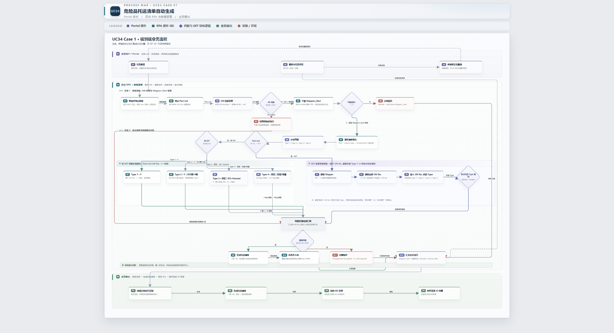
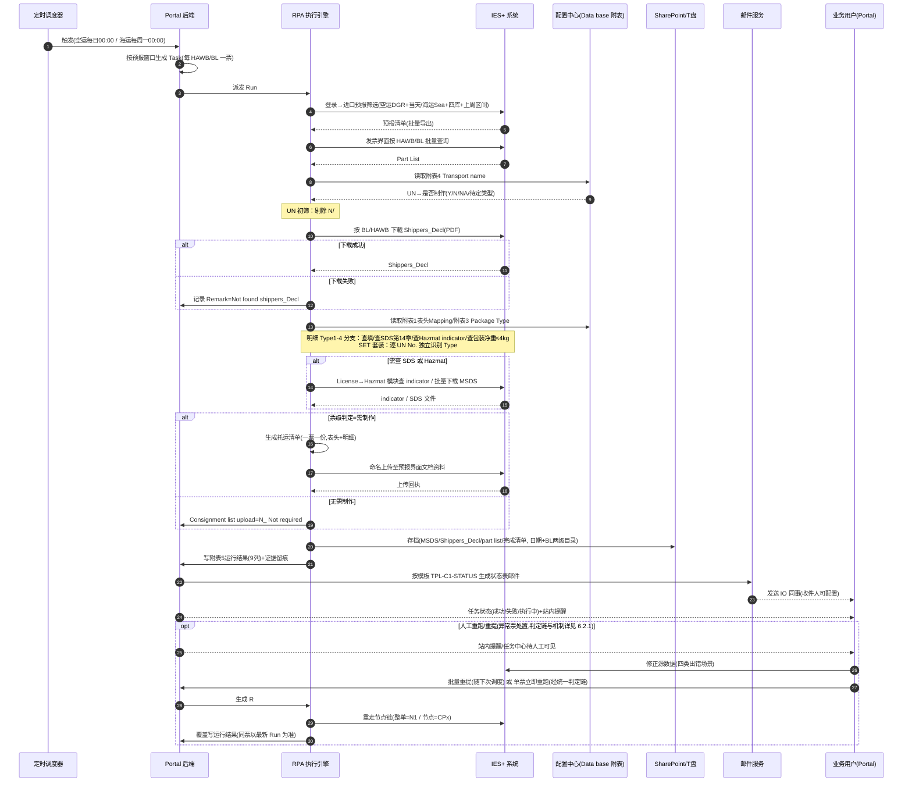
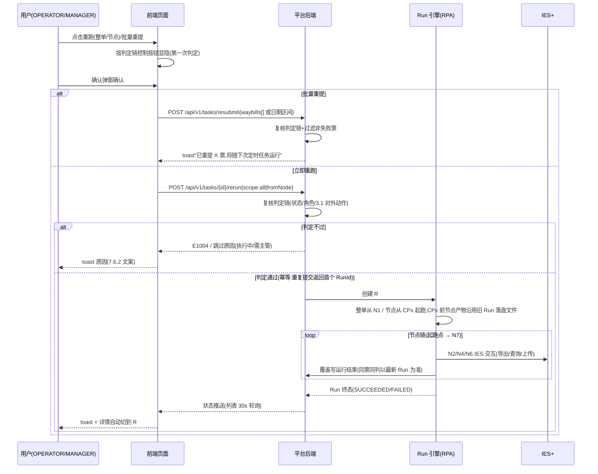
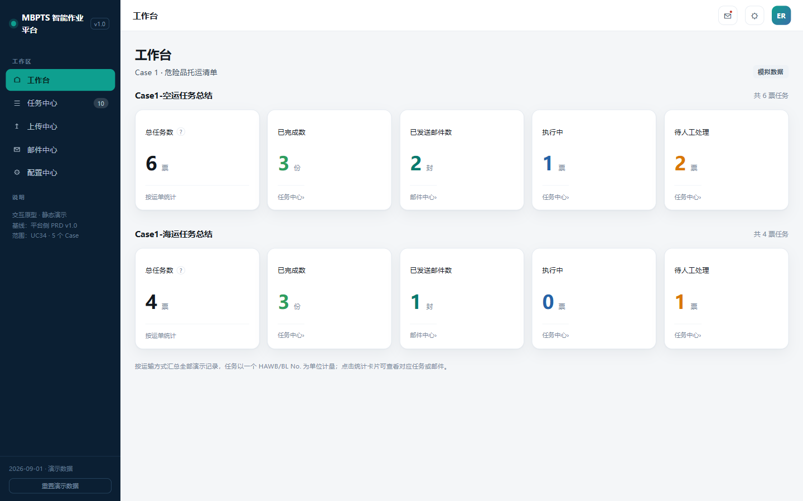
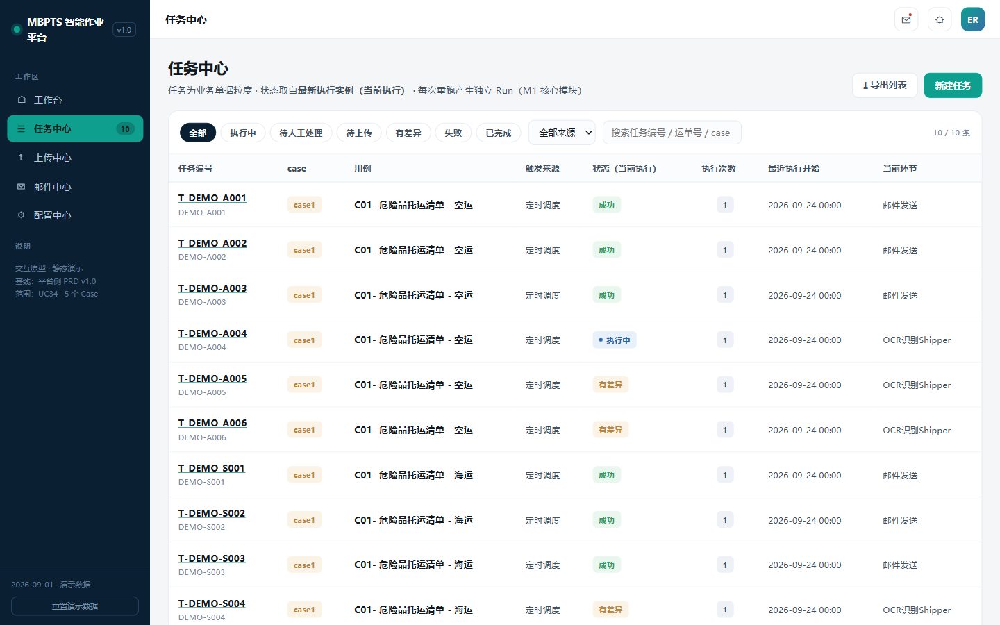
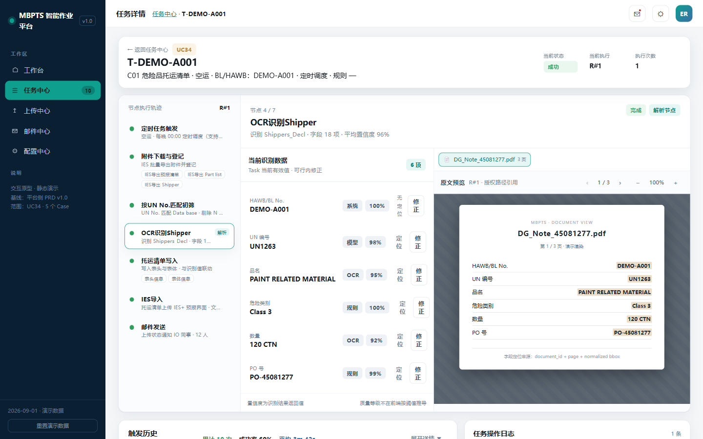
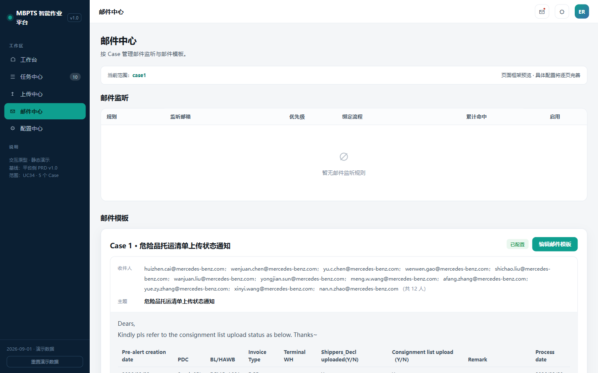
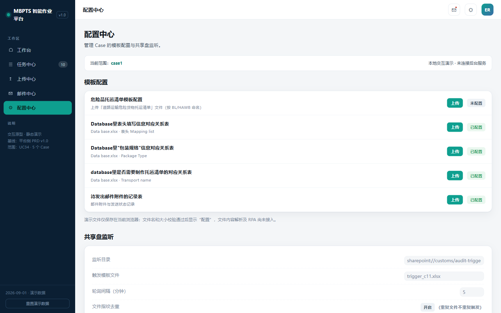
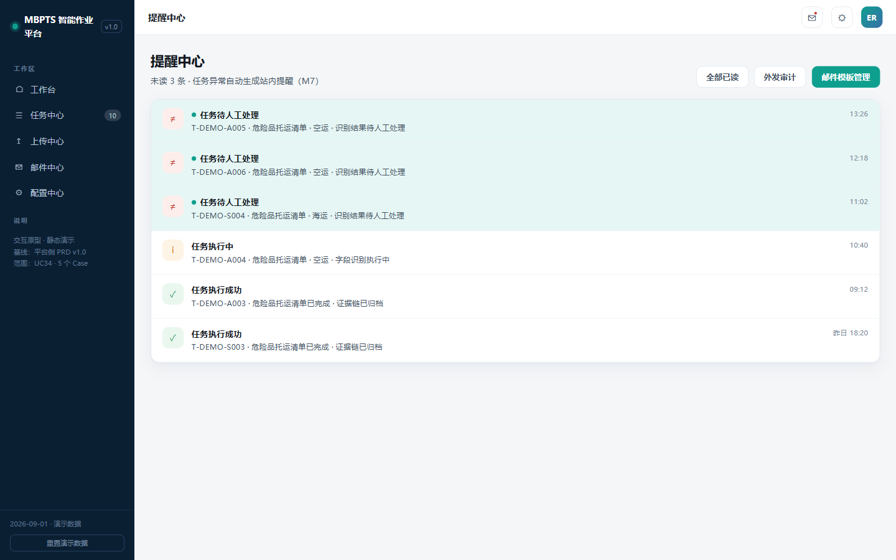
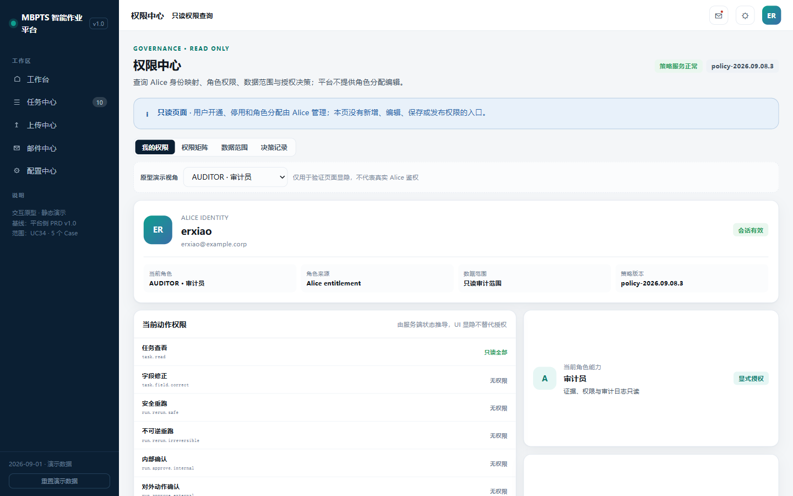

# MBPTS UC34 Case 1 · 危险品托运清单自动生成 — 产品需求文档

## 文档信息

| 项目 | 内容 |
|------|------|
| **文档名称** | UC34 Case 1 · 危险品托运清单自动生成 PRD |
| **版本** | v2.0.0（GLC 终态框架对齐版） |
| **创建日期** | 2026-09-24 |
| **最后更新** | 2026-10-08 |
| **负责人** | BA（德勤 MBPTS 项目组） |
| **审核人** | 待审核（Dev Lead / 业务老师） |
| **密级** | 内部 |

**文档用途**：定义 UC34 Case 1（道路运输危险货物托运清单自动生成）的完整产品需求，覆盖 Portal 前台、后台 RPA 执行链、配置与治理，供开发、测试与业务验收使用。本版为框架对齐版：章节结构与《UC34-Case2-GLC_PRD_修订版》v1.2.4 终态框架一致，业务规则、页面口径与 Case1 demo 实况保持不变。

**关联文档**：
- [原 PRD v1.1.0](./Case1_危险品托运清单_PRD.md)（本文件为其框架对齐修订版，原文保留）
- [需求澄清文档](./Case1_危险品托运清单_需求澄清文档.md)（Q1-Q11 全部已澄清）
- [需求阶段 Plan](./requirements_plan.md) / [设计阶段 Plan](./design_plan.md)
- [架构图](./Case1_危险品托运清单_架构图.md) / [任务清单](./Case1_危险品托运清单_任务清单.md)
- 原型基线：`C:\MBPTS\Case1_Demo_Final 2\页面demo\`（12 页）；导航 [prototypes/index.html](../../prototypes/index.html)
- 业务依据：BRD（`【MBPTS-UC34】Case1：危险品托运清单自动生成_BRD_0921 final.docx`）、业务流程图 V5、`Data base update 20260909.xlsx`

---

## 版本历史

| 版本号 | 修订日期 | 修订人 | 修订内容 | 状态 |
|--------|---------|--------|---------|------|
| v1.0.0 | 2026-09-24 | BA + AI 辅助 | 初版（基于 BRD 0921 final + 流程图 V5 + 原型 demo） | 待评审 |
| v1.1.0 | 2026-09-28 | BA + AI 辅助 | 基于 `Data base update 20260909.xlsx` 补充附录C（附表1-5 字段级规格）；新增 R4.2、R5.7 规则 | 待评审 |
| v2.0.0 | 2026-10-08 | BA + AI 辅助 | **按 GLC 终态框架（v1.2.4）一次性对齐**：新增 3.1 对外/不可逆动作清单、6.2.1 重跑判定链与时序、6.3 页面跳转闭环、7.4 节点实现规格（7 节点×输入/子步骤/输出/检查点/失败处理+3 道闸口）、7.5 性能与数据量级预期、7.6 页面设计通用规格、8.0 字段级设计（原附录C 附表1-5 移入 8.0.2~8.0.6）、第九部分平台能力分析、概要设计 3 项技术决策 D1-D3、附录 A-1 Demo 偏差对照表；待确认项改 OPEN-C 编号（14 项）；**业务规则 R1-R10 与用户故事口径不变** | 草稿（含 14 项 OPEN 待确认） |

---

# 第一部分：产品概述

## 1.1 产品定义

**产品名称**：MBPTS UC34 Case 1 · 危险品托运清单自动生成

**所属系统**：MBPTS AI Quick Win 平台（UC34，Portal 前台 + 后台 RPA 执行引擎）

**功能定位**：替代人工在 IES+ 中完成"筛选预报 → 导出 part list → UN 初筛 → 下载 Shippers_Decl → 填写托运清单（表头+危险货物明细）→ 命名上传 IES → 邮件通知 IO → 存档留痕"的全流程自动化；以**一个 HAWB/BL 为一票任务**，一票对应**一份**托运清单。

**使用端**：PC Web Portal（业务用户）+ 后台 RPA 无人值守执行

**交付版本**：v2.0.0

## 1.2 产品愿景

让危险品托运清单的制作从"人工逐票、跨表核对、手工上传"变为"定时自动、规则驱动、全程留痕"，业务人员只需处理异常。

## 1.3 核心价值

| 价值维度 | 价值描述 | 受益人群 |
|---------|--------|---------|
| 效率 | 每日/每周定时自动完成制单与上传，消除人工逐票操作 | IO 同事 |
| 合规 | 危险品道路运输托运清单合规出具，Type1-4/SET 规则统一执行，全程留痕可审计 | 业务/合规 |
| 透明 | Portal 实时状态、失败可追踪可重提、运行结果邮件通达 | 业务主管 |
| 韧性 | 配置化（附表/收件人/模板/路径）适应人员、供应商、主数据变动 | 平台运营 |

## 1.4 产品范围

### 包含范围

| 模块 | 功能描述 |
|------|--------|
| 任务触发与调度 | 空运每日 00:00、海运每周一 00:00（取上周一~周日）自动触发；手动触发入口；运行时间可配置 |
| 数据获取与初筛 | RPA 登录 IES+ 筛选导出预报清单与 part list；UN No. 匹配附表4 写回 AR 列；剔除 N/#N/A |
| Shippers_Decl 获取 | 按 BL/HAWB 下载 PDF，成功/失败均记录（Not found shippers_Decl） |
| 托运清单生成 | 表头三键 Mapping（附表1）；明细 Type1-4 分支（SDS 第14章 / Hazmat indicator / ≤4kg 排除）；SET 套装逐 UN 核验；票级判定 N_ Not required |
| 清单上传与通知 | 固定前缀命名上传 IES 文档资料；附表5 运行结果汇总；邮件模板自动发送 IO 同事 |
| 任务监控与异常 | 工作台空运/海运汇总、任务中心、任务详情（Task/Run 两层）、字段修正留痕、批量重提+单票重跑、长时执行停止 |
| 配置管理 | 清单模板 + 附表1/3/4 + 邮件记录表上传与版本管理；邮件模板与收件人配置 |
| 存档与审计 | 日期/BL 两级目录存档四类文件；年度操作记录；证据 WORM 留痕；审计日志；RBAC 只读展示 |

### 不包含范围（后续迭代 / 其他文档）

- IES+ 系统本身的功能改造
- 邮件监听触发（Case1 为定时触发，邮件监听模块本期为空）
- 上传中心手工数据补充（Case1 无需上传文件，系统自动从 IES+ 取数）
- UC26 / UC64 / UC34 Case 2-5（Case 2 见独立文档）
- 存档存储路径的最终技术选型（T盘/SharePoint，并入 D2）
- IES+ 交互的技术实现选型（UI 自动化或接口通道，并入 D1）

---

# 第二部分：业务背景与目标

## 2.1 业务问题

1. **人工流程长、跨系统多**：业务老师需登录 IES+ 筛选预报、导出 part list、对照 Data base 多张附表逐票判断、下载 Shippers_Decl 与 MSDS、手工填写清单、命名上传、汇总发邮件，全程 10+ 步骤。
2. **判断规则复杂易错**：UN No. 存在空/SET/Y/N/待定多种情况；待定需分别查 SDS 第14章、Hazmat indicator、包装净重（≤4kg/5L/5KG 阈值）；SET 套装一对多需逐 UN 核验。
3. **留痕与合规压力**：每步操作需记录（附表5 运行结果）、文件需按日期/BL 存档、年度操作记录需累积，人工执行难以保证完整性。
4. **异常恢复成本高**：数据出错（document 缺失、UN 标识改变、主数据变化、运单号改变）后需人工定位并重新处理。

## 2.2 业务目标与成功指标

| 目标 | 描述 | 优先级 |
|------|------|--------|
| 全自动制单 | 定时任务无人值守完成筛选→制单→上传→通知 | P0 |
| 异常可恢复 | 失败任务可查询、IES 修正数据后可重提/重跑 | P0 |
| 全程留痕 | 每步运行结果、文件、操作均有记录且防篡改 | P0 |

| 指标 | 目标值 | 测量方法 |
|------|-------|---------|
| 定时任务成功率 | ≥ 95%（剔除源数据问题） | 治理台失败率统计 |
| 单票处理时长 | 显著低于人工基线（基线待测定，OPEN-C3） | Run 耗时统计 |
| 清单上传状态邮件触达 | 每次运行 1 封，100% 发送（失败自动重试） | 邮件外发审计 |
| 留痕完整率 | 100%（附表5 行 + 存档文件 + 证据链） | 审计抽查 |
| 定时批量完成时间 | 空运每日批次到岗前完成（窗口约 8 小时）；海运周批次 <4 小时（建议值，量级依据 OPEN-C7，测算见 7.5.3） | 调度起止时间 |

---

# 第三部分：用户角色与权限

> 身份与授权由 **Alice**（身份系统）管理，平台只读展示；UI 显隐不替代服务端授权。职责分离：主管无字段修正权，操作员无对外动作确认权。

| 功能 | OPERATOR 业务操作员 | MANAGER 业务主管 | ADMIN 平台管理员 | AUDITOR 审计员 |
|------|:---:|:---:|:---:|:---:|
| 工作台/任务查看 task.read | 本人相关 | 团队范围 | 全部 | 只读全部 |
| 手动新建/触发任务 task.create | ✓ | ✓ | ✓ | — |
| 字段修正 task.field.correct | ✓ | — | — | — |
| 安全重跑（整单/节点） run.rerun.safe | ✓ | ✓ | ✓ | — |
| 对外动作后整单重跑（见 3.1 清单） | — | ✓ | — | — |
| 批量重提（随下次调度） run.resubmit | ✓ | ✓ | — | — |
| 停止长时执行 run.stop | ✓（授权范围内） | ✓ | ✓ | — |
| 列表导出 | ✓ | ✓ | — | — |
| 配置表/邮件模板发布 config.publish | — | — | ✓ | — |
| 审计日志/证据链 audit.read | — | — | ✓ | ✓（只读） |
| 治理 KPI / 分析导出 | — | ✓ | ✓ | — |

**系统 Actor**：定时调度器、RPA 执行引擎、IES+ 系统、邮件服务（SMTP）、Alice 身份系统、SharePoint/T盘存档。

> 注：本矩阵权限点需同步 Alice 登记【待确认 OPEN-C12】。

## 3.1 Case1 对外/不可逆动作清单

以下动作发生后，**整单重跑**视为"不可逆重跑"，仅 MANAGER 可触发，触发前弹确认（说明已发生的对外后果）：

| # | 对外动作 | 发生节点 | 之后再整单重跑的后果 |
|---|---------|---------|---------------------|
| 1 | 托运清单上传 IES+ 预报界面文档资料并保存 | 节点 6 | IES 中可能产生重复清单附件，需人工核查旧件处理 |
| 2 | 运行结果邮件外发 IO 同事 | 节点 7 | IO 已收到本批次状态邮件；重跑后是否补发新状态邮件按 OPEN-C11 口径 |

**节点级重跑不受此限**（OPERATOR 可发起）；尚未发生上述动作的整单重跑按"安全重跑"处理（OPERATOR/MANAGER/ADMIN 均可）。N_ Not required 票未发生动作 1，但若已随批次外发邮件（动作 2），整单重跑同样仅 MANAGER。

---

# 第四部分：术语定义

| 术语 | 说明 |
|------|------|
| IES+ | 进出口业务系统，RPA 操作对象（进口预报/发票/License-Hazmat 模块） |
| HAWB/BL No. | 分单号/提单号；一票任务的业务键，一个号对应一份托运清单 |
| Pre-alert creation date | 预报创建日期；空运=运行当日，海运=上周一~周日区间 |
| PDC | 库房代码；海运筛选限定四个 Hazmat 库房（South/West/North/East 3PL） |
| Invoice Type | 发票类型；空运筛选=DGR，海运筛选=Sea |
| Terminal WH | 终端仓库；表头三键之一 |
| Part List | 发票界面按 HAWB/BL 批量导出的零件清单（AN 列=UN No.，AJ 列=Unit N.W，AR 列=初筛结果） |
| Shippers_Decl | 托运人危险品申报单（PDF），按 BL/HAWB 从 IES+ 下载 |
| MSDS / SDS | 化学品安全技术说明书；第14部分含"联合国运输名称/道路运输 (JT/T 617)" |
| UN No. | 联合国危险货物编号；空=NA 无需制作；SET=套装，按 Y 逻辑且走套装核验 |
| 附表1 表头 Mapping list | Data base 中托运清单表头对应关系表（PDC+Invoice Type+Terminal WH 三键） |
| 附表2 | 托运清单与 Shippers_Decl 字段对应关系 |
| 附表3 Package Type | 包装类型对应关系表（新增包装类型需配置） |
| 附表4 Transport name | UN No. → 是否需要制作托运清单（I 列：Y / N / Y,查SDS第14章 / 待定,查Hazmat / 待定,查包装净重） |
| 附表5 运行结果 | 每次运行的结果记录表（8 列 + Process date） |
| Type 1-4 | 附表4 I 列四种判定类型对应的明细处理分支（见 7.2 R5） |
| Hazmat indicator | IES+ License→Hazmat 模块的危险品标识（Y/N） |
| Task / Run | 任务=业务单据（一票）；Run=一次执行实例；任务状态由最新 Run 推导，历史 Run 只读 |
| 重跑 / 重提 / 补跑 | 重跑=生成 R#N+1（整单/节点）；重提=失败票登记后**随下次定时任务运行**；补跑=手动触发整个批次 |
| N_ Not required | 票级判定"无需制作"的状态值，写入 Consignment list upload 列 |
| WORM | Write Once Read Many，证据防篡改留痕机制 |
| Alice | 身份与权限系统，平台 RBAC 的授权来源 |

---

# 第五部分：用户故事

### US-C01：系统自动执行空运每日定时任务

**作为** 业务操作员
**在** 每个自然日 00:00
**于** MBPTS 平台（无需登录操作）
**我想要** 系统自动筛选当天 DGR 空运预报并完成制单、上传、邮件通知
**以便于** 早上到岗即可看到处理结果，无需人工操作

**验收标准**：
- AC1: 系统每日 00:00 自动触发空运任务，筛选条件为 Invoice Type=DGR + Pre-alert creation=当天
- AC2: 命中的每个 HAWB/BL 生成一票独立任务（Task）并生成执行实例 Run#1
- AC3: 每票任务按七节点链路执行（触发→下载登记→UN 初筛→OCR→清单写入→IES 导入→邮件发送）
- AC4: 运行时间支持配置调整，调整后按新时间执行
- AC5: 定时来源任务的开始时间统一显示为当天 00:00

**异常/边缘场景**：
- E1: IES+ 登录失败 → 任务标记失败（E3001），生成站内提醒，可修正后重跑
- E2: 当天无 DGR 预报 → 本次运行结果为空，不产生任务，运行记录标记"无数据"
- E3: 调度时间冲突（上次未执行完） → 跳过本次触发并记录，禁止并发执行同范围任务
- E4: 手动触发与定时触发同时发生 → 已有执行中实例时拒绝新触发（E1002）

### US-C02：系统自动执行海运每周定时任务

**作为** 业务操作员
**在** 每周一 00:00
**于** MBPTS 平台
**我想要** 系统自动筛选上周一~上周日的海运 Hazmat 库房预报并完成制单全流程
**以便于** 海运周度批量处理无需人工干预

**验收标准**：
- AC1: 系统每周一 00:00 触发海运任务，筛选条件为 Invoice Type=Sea + PDC∈{South/West/North/East 3PL} + Pre-alert creation=上周一~上周日
- AC2: 运行结果中 Pre-alert creation date 显示为区间格式（如 `2026/09/07~2026/09/13`）
- AC3: 保留手动触发入口，手动触发时可指定数据窗口
- AC4: 海运与空运任务互不影响，各自独立汇总

**异常/边缘场景**：
- E1: 跨周窗口内有重复分单 → 同一 HAWB/BL 在窗口内去重，仅生成一票任务
- E2: 上周窗口数据被后续修改 → 以运行时 IES+ 当前数据为准，差异在 Remark 体现
- E3: 周一 00:00 IES+ 维护不可用 → 任务失败并提醒，支持手动补触发

### US-C03：业务操作员手动新建/触发任务

**作为** 业务操作员
**在** 需要临时处理或补跑时
**于** 任务中心
**我想要** 手动新建空运/海运任务并立即执行
**以便于** 灵活处理定时任务之外的需求

**验收标准**：
- AC1: 任务中心提供"新建任务"入口，弹窗选择运输方式（空运/海运 · C01 危险品托运清单）
- AC2: 创建后立即生成 Run#1 进入执行中状态
- AC3: 手动来源任务显示实际触发时间（区别于定时来源 00:00）
- AC4: 手动触发与定时触发享有相同执行链路与留痕

**异常/边缘场景**：
- E1: 同一分单已有执行中任务 → 拒绝并提示（E1002）
- E2: 无新建权限角色访问 → 按钮隐藏且服务端拒绝（E1004）

### US-C04：业务操作员查看工作台汇总

**作为** 业务操作员 / 业务主管
**在** 每日开始工作时
**于** 工作台
**我想要** 按空运/海运查看任务总量、完成、邮件、执行中、待人工处理五类指标
**以便于** 快速掌握处理进度并穿透到明细

**验收标准**：
- AC1: 工作台按"Case1-空运任务总结""Case1-海运任务总结"两区块各展示 5 张统计卡
- AC2: 总任务数以一个 HAWB/BL No. 为单位计量（带"?"说明），不可点击
- AC3: 已完成/执行中/待人工处理卡片点击跳转任务中心并带对应筛选；已发送邮件卡片跳转邮件中心已发送列表
- AC4: 统计口径=范围内全部任务按最新 Run 状态聚合；**待人工处理 = 待上传 ∪ 有差异 ∪ 失败（聚合快捷口径，不互斥）**

**异常/边缘场景**：
- E1: 无任务数据 → 卡片显示 0，不报错
- E2: 越权访问 → 按数据范围过滤（操作员仅本人相关）

### US-C05：业务操作员在任务中心筛选与跟踪任务

**作为** 业务操作员
**在** 处理日常任务时
**于** 任务中心
**我想要** 按状态/来源/关键词筛选任务，查看状态与当前环节，导出列表
**以便于** 快速定位需要关注的票

**验收标准**：
- AC1: 状态 chips 含全部/执行中/待人工处理/待上传/有差异/失败/已完成
- AC2: 支持来源下拉（含手动触发）与搜索（任务编号/运单号/case/用例）
- AC3: 表格列：任务编号（副行 HAWB/BL）、case、用例、触发来源、状态（当前执行）、执行次数、最近执行开始、当前环节
- AC4: 任务状态一律由最新 Run 推导；整行点击进详情
- AC5: 支持导出列表 CSV；从工作台跳入时显示来源横幅且可一键清除筛选

**异常/边缘场景**：
- E1: 筛选无结果 → 空状态提示
- E2: 非法 URL 筛选参数 → 忽略并回退默认筛选

### US-C06：业务操作员查看任务详情与执行轨迹

**作为** 业务操作员
**在** 需要核查某一票的处理过程时
**于** 任务详情页
**我想要** 查看七节点执行轨迹、字段识别结果（含置信度与原文定位）、证据附件与操作日志
**以便于** 确认处理正确性或定位问题环节

**验收标准**：
- AC1: 头部显示任务 ID、case、空运/海运、BL/HAWB、触发来源、规则、当前状态/当前执行/执行次数
- AC2: 节点轨道展示七节点状态（ok/run/fail/review/queued）；解析节点内联字段面板（字段/值/来源/置信度/质量等级）
- AC3: 字段支持"定位"跳转原文对应页高亮（规则推导字段显示"无定位"+原因）
- AC4: 非解析节点展示证据截图卡片与附件，标注 WORM 留痕
- AC5: 提供两层历史：L1 触发历史（同 Case 兄弟任务+成功率/平均耗时/热力点阵）与 L2 本任务 Run 切换；历史 Run 只读且有"切回当前执行"入口

**异常/边缘场景**：
- E1: 访问不存在的任务 → 提示"任务不存在"并引导返回列表（E1001）
- E2: 查看历史 Run 时尝试编辑 → 禁止并提示只读（E1003）

### US-C07：业务操作员修正字段并留痕

**作为** 业务操作员
**在** 识别数据有误时
**于** 任务详情字段面板
**我想要** 修正字段值并留痕，使修正自下次执行生效
**以便于** 纠正数据且全程可追溯（无人工审批）

**验收标准**：
- AC1: 仅最新 Run 且非执行中状态的字段可编辑
- AC2: 保存后记录 `delta={old, tm, runNo}`，写操作日志+证据 EV-O+审计
- AC3: 重跑生成的新 Run 通过 `carried.fromRun` 继承修正值
- AC4: UC34 场景修正无需审批，仅作留痕

**异常/边缘场景**：
- E1: 主管角色尝试修正 → 服务端拒绝（职责分离，E1004）
- E2: 执行中任务尝试修正 → 编辑入口禁用

### US-C08：失败任务批量重提与单票重跑

**作为** 业务操作员
**在** 任务失败并已在 IES 修正源数据后
**于** 任务中心/任务详情
**我想要** 按分单号或 Pre-alert creation date 批量查询重提（随下次定时任务运行），或对单票立即整单重跑
**以便于** 灵活恢复失败任务

**验收标准**：
- AC1: 批量重提支持按分单号或 Pre-alert creation date 查询筛选失败任务，提交后标记"随下次定时任务运行"（与当次窗口合并去重口径见 OPEN-C8）
- AC2: 任务详情提供"↻ 整单重跑（生成新执行）"，生成 R#n+1；历史 R#n 保持只读归档
- AC3: 支持从失败节点起重跑，前置节点结果继承
- AC4: 已知出错场景（document 缺失、UN 标识改变、主数据变化、运单号改变）在失败原因中明确展示

**异常/边缘场景**：
- E1: 已有执行中实例时重跑 → 拒绝（E1002）
- E2: 批量重提包含非失败任务 → 自动过滤并提示
- E3: 重跑仍失败 → 状态保持失败，可再次修正重提，执行次数累加

### US-C09：停止长时间执行中的任务

**作为** 被授权的业务操作员 / 业务主管
**在** 任务长时间处于执行中状态时
**于** 任务详情
**我想要** 停止该执行并手工重新触发
**以便于** 解除卡死任务

**验收标准**：
- AC1: 执行中任务对授权角色显示"停止并重新触发"操作（"长时"判定阈值建议 >30 分钟或 >2×单票预算，OPEN-C9）
- AC2: 停止后任务状态可重新触发新 Run；停止动作写审计
- AC3: 未授权角色不可见且服务端拒绝（E1004）

**异常/边缘场景**：
- E1: 停止瞬间任务恰好完成 → 提示任务已完成，停止不生效
- E2: 停止后底层 RPA 仍在执行 → 强制执行终止指令并记录

### US-C10：系统生成并上传托运清单（Type1-4 / SET / 票级判定）

**作为** 系统（RPA 执行引擎）
**在** 每票任务执行时
**于** 后台执行链
**我想要** 按附表规则自动完成初筛、明细分支判断、清单生成、命名与上传
**以便于** 一票一份合规清单自动进入 IES+ 文档资料

**验收标准**：
- AC1: UN 初筛：空→NA 无需制作；SET→Y 且走套装核验；剔除附表4 I 列为 N/#N/A 的行；结果写回 part list AR 列
- AC2: 表头按 PDC+Invoice Type+Terminal WH 三键查附表1 填写
- AC3: 明细按 Type1-4 分支执行（Type1 直填；Type2 查 SDS 第14章，"公路运输"分类优先；Type3 查 Hazmat indicator，N 不纳入/Y 纳入并查 SDS；Type4 ≤4kg 排除、＞4kg 纳入）
- AC4: SET 套装内每个 UN No. 独立识别 Type 并分别得出结论；套装 MSDS 按 UN No. 选行下载
- AC5: 票级判定：全票无纳入明细→"N_ Not required"不生成清单；否则生成清单并按 `道路运输危险货物托运清单_BL/HAWB` 命名上传至 IES 预报界面文档资料，记录上传状态

**异常/边缘场景**：
- E1: Shippers_Decl 未下载到 → Remark="Not found shippers_Decl"，Type4＞4kg 时另记"含UN3082/UN3077，需进一步核查包装规格是否大于5L/5KG"
- E2: 无 SDS → 邮件状态表 Remark 记录，不阻断其他明细
- E3: SDS 第14部分存在多种格式 → 解析规则需覆盖"联合国运输名称"/"道路运输 (JT/T 617)"等格式
- E4: 混合待定（Type3+Type4）确认后均无需 → 整票 N_ Not required

### US-C11：系统发送运行结果邮件给 IO 同事

**作为** IO 同事
**在** 每次运行完成后
**于** 邮箱
**我想要** 收到本次运行的托运清单上传状态表邮件
**以便于** 掌握每票处理结果与异常

**验收标准**：
- AC1: 邮件按模板 TPL-C1-STATUS 生成，正文含固定引导语+状态表
- AC2: 状态表 9 列：Pre-alert creation date / PDC / BL/HAWB / Invoice Type / Terminal WH / Shippers_Decl uploaded(Y/N) / Consignment list upload（Y/N）/ Remark / Process date
- AC3: 收件人为可配置的 IO 邮箱清单；邮件副本（.eml）留存并写外发审计

**异常/边缘场景**：
- E1: SMTP 发送失败 → 自动重试 3 次，仍失败记审计并生成提醒（E4001）
- E2: 收件人清单为空 → 阻断发送并提示管理员补配置

### US-C12：管理员维护配置表与邮件模板

**作为** 平台管理员
**在** 人员/供应商/包装类型/主数据变动时
**于** 配置中心/邮件中心
**我想要** 上传更新四张配置（清单模板、附表1/3/4、邮件记录表）并维护邮件模板与收件人
**以便于** 业务规则随变动及时生效且版本可溯

**验收标准**：
- AC1: 清单模板上传校验：文件名前缀"道路运输危险货物托运清单_"+运单号（≤100 字符、禁非法字符）、.xlsx、非空、≤20MB
- AC2: 每次上传生成新版本（v+1），历史版本可查看/下载，生效版本=最新
- AC3: 邮件模板支持编辑收件人（checkbox 多选/全选/清空）、主题、正文，保存校验非空并写审计
- AC4: 配置变更对后续运行生效，运行记录引用当时生效版本（Run 启动快照，R10.4）

**异常/边缘场景**：
- E1: 文件名校验失败 → 提示规则（E2001），状态"未配置"
- E2: 配置表缺必需列 → 状态"解析失败"（E2003），不影响上一生效版本

### US-C13：系统自动存档与年度记录

**作为** 系统
**在** 每日处理完成后
**于** 存档存储（T盘/SharePoint，路径配置化）
**我想要** 按操作日期+BL/HAWB 两级目录存档全部过程文件并累积年度操作记录
**以便于** 满足合规与追溯要求

**验收标准**：
- AC1: 存档内容含 MSDS、Shippers_Decl、part list、完成版托运清单
- AC2: 目录结构：一级=操作日期，二级=BL/HAWB；路径配置化，迁移时仅需改配置
- AC3: 每日操作记录按固定列（Pre-alert creation date/Warehouse name/DG Terminal WH/Invoice Type/BL/HAWB/Shippers_Decl related/Consignment list upload/Remark/RPA process date）累积
- AC4: 以 12 月 31 日为截止，每年存为一个表格并按年份命名

**异常/边缘场景**：
- E1: 存档路径不可用 → 告警并生成补偿任务（E5001），业务主流程不阻断
- E2: 跨年运行 → 记录归入 Process date 所属年份

### US-C14：审计员查看证据链与审计日志

**作为** 审计员
**在** 合规审查时
**于** 权限中心/治理运营台/任务详情
**我想要** 只读查看证据链（WORM）、审计日志与授权决策记录
**以便于** 完成审计且不影响业务操作

**验收标准**：
- AC1: 审计员全部页面只读，无任何写操作入口
- AC2: 证据含 trigger/process/operation 三类，ID 前缀 EV-T/EV-P/EV-O，带 hash 防篡改
- AC3: 审计日志含时间/操作人/动作/对象/入口，可搜索
- AC4: 授权决策记录含主体/动作/资源/允许|拒绝/策略版本

**异常/边缘场景**：
- E1: 审计员尝试调用写接口 → 服务端拒绝并记录决策（E1004）

---

# 第六部分：业务流程

## 6.1 整体流程（To-Be）— 跨职能泳道流程图

泳道：01 业务用户/Portal、02 后台 RPA+数据逻辑、03 业务输出。节点编号与业务流程图 V5 一致。



> **源文件**：[Case1_危险品托运清单_业务流程图.drawio](./Case1_危险品托运清单_业务流程图.drawio)（可用 draw.io 打开编辑）

### 分阶段说明

| 阶段 | 节点 | 说明 |
|------|------|------|
| 触发 | P1 | 空运每日 00:00（DGR+当天）；海运每周一 00:00（Sea+四库+上周一~周日）；保留手动触发（R1） |
| 数据准备与初筛 | R1→R4 | 筛选导出预报 → 导出 Part List → UN 匹配初筛（附表4）→ AR 判断【Y/SET/候选→R5；N/#N/A→R4 排除（仍参与票级汇总）】 |
| Shippers_Decl 获取 | R5→R6 | 按 BL/HAWB 下载；失败→R6 记录"Not found shippers_Decl"，**不阻断**（R3） |
| 表头与明细 | R7→R8 | 表头三键 Mapping（附表1，无命中该票失败 R4.2）→ Type 分支判断【UN=SET→S1-S4 套装逐 UN 核验；非 SET→B1-B4 按 Type1-4 处理】 |
| 票级判定与生成 | R9/R11 | 明细汇聚→票级判断【有纳入→R9 生成清单→R10 命名上传；无纳入→R11 N_ Not required】 |
| 汇总与输出 | R12→O1-O4 | 附表5 运行结果汇总（O1 持续记录）→ O2 一票一份清单 → O3 回传 IES+ 文档资料 → O4 邮件发送 IO 同事 |
| 反馈环 | R12→P2/P3 | 状态反馈工作台；失败任务经 P3（IES 修正数据）后回到 P1 批量重提（随下次调度）或单票立即重跑 |

### 存档结构（Case1）

```
<存档根（配置化，T盘/SharePoint，D2）>
└─ <操作日期 YYYY-MM-DD>
   └─ <BL/HAWB>
      ├─ MSDS（如涉及，按 PN/UN 多份）
      ├─ shippers_Decl_<BL/HAWB>.pdf
      ├─ part list（含 AR 列初筛结果）
      └─ 道路运输危险货物托运清单_<BL/HAWB>.xlsx
```

> 年度操作记录独立成表，以 12 月 31 日为截止按年份命名（R8.2）。

## 6.2 系统交互时序



## 6.2.1 重跑交互时序与判定流程（整单/节点/批量重提）

> 三个人工恢复入口（任务详情「整单重跑」/「从节点重跑」、任务中心「批量重提」）**统一走同一条判定链**；前端按判定链控制按钮显隐，后端在提交时复核（防状态在点击后已变化）。**批量重提不立即执行**，登记后随下次定时任务运行（R9.3）。

### 判定流程

```mermaid
flowchart TD
    A[触发:整单重跑/节点重跑/批量重提] --> B{最新 Run 执行中?}
    B -- 是 --> Z1[跳过:toast 执行中不可重跑 E1002]
    B -- 否 --> C{恢复类型}
    C -- 节点重跑 --> D{OPERATOR/MANAGER/ADMIN?}
    D -- 否 --> Z2[阻断 E1004+审计]
    D -- 是 --> F[确认弹窗:选择起始节点 CPx]
    C -- 整单 --> E{已发生 3.1 对外动作?}
    E -- 否 --> G{OPERATOR/MANAGER/ADMIN?}
    G -- 否 --> Z2
    G -- 是 --> H[确认弹窗:安全重跑]
    E -- 是 --> I{MANAGER?}
    I -- 否 --> Z3[按钮置灰/提交阻断:需主管操作]
    I -- 是 --> J[确认弹窗:逐项列对外后果+勾选知悉]
    C -- 批量重提 --> D2{OPERATOR/MANAGER?}
    D2 -- 否 --> Z2
    D2 -- 是 --> T[确认弹窗:逐行标注可重提性<br/>登记"随下次定时任务运行"]
    F --> K[生成 R#N+1]
    H --> K
    J --> K
    K --> L[固化配置快照:模板/附表1/3/4 最新版 R10.4]
    K --> M[携带当前生效修正值 carried.fromRun]
    K --> N[同票互斥锁:Task 置执行中]
    L --> O[起跑:整单=N1 / 节点=指定 CPx,前置节点输出沿用]
    M --> O
    N --> O
    T --> P[并入下次调度批次,与窗口票按分单号去重 OPEN-C8]
```

### 时序图



### 时序关键点（开发实现基准）

| # | 时点/机制 | 规则 |
|---|----------|------|
| 1 | 双重判定时点 | 按钮显隐在**页面渲染时**按判定链计算；提交时后端**复核同一判定链**（两时点间状态可能已变，如他人已重跑） |
| 2 | 配置快照时点 | R#N+1 创建瞬间固化清单模板/附表1/3/4 版本（R10.4），Run 内不变；因此"补配置后重跑生效"（J7 闭环） |
| 3 | 修正值携带 | 创建 R#N+1 时读取该票**当前生效修正版本**写入新 Run（carried.fromRun）；历史 Run 的修正记录只读留存，不重复累计 |
| 4 | 检查点输出沿用 | 从 CPx 起跑时，CPx 之前节点的产物（导出文件、初筛结果、识别结果）沿用旧 Run 落盘文件，不重新生成；CPx 及之后节点全部重算 |
| 5 | 同票互斥与幂等 | 同 HAWB/BL 同一时刻只允许一个执行中 Run；执行中到达的请求：批量=跳过计数，接口重复提交=返回首个 RunId；不产生重复清单上传/附表5 行 |
| 6 | 批量重提 | 逐票独立走判定链（仅失败票可重提，非失败自动过滤并提示）；登记后不立即执行，**随下次同运输方式定时批次运行**，与该批窗口票按分单号去重【口径待确认 OPEN-C8】 |
| 7 | 终态重置 | 新 Run 终态按本次执行重新判定（G1~G3）；原失败票重跑成功→SUCCEEDED，任务离开待人工聚合口径 |
| 8 | 结果覆盖边界 | 附表5/年度记录同票以最新 Run 覆盖写；**已外发邮件不回溯修改**，重跑后新状态是否补发邮件【待确认 OPEN-C11】 |

## 6.3 页面跳转与业务闭环

| 编号 | 从 | 操作 | 到 | 携带数据 | 状态/权限变化 | 用户下一步 |
|------|----|------|----|---------|--------------|-----------|
| J1 | 工作台 | 点"已完成/执行中/待人工处理"卡 | 任务中心 | `mode=air\|sea&status=…` | 无 | 浏览/处置对应票 |
| J2 | 工作台 | 点"已发送邮件"卡 | 邮件中心已发送列表 | `status=sent` | 无 | 核查外发结果 |
| J3 | 任务中心 | 行点击 | 任务详情 | taskId（默认当前生效 Run） | 无 | 核对/修正/重跑 |
| J4 | 任务详情 | 整单/节点重跑 | 任务详情 | 新 R#N+1 | 异常态→执行中；历史 Run 只读 | 观察新 Run |
| J5 | 提醒中心 | 点提醒 | 任务详情 | taskId + RunId | 提醒置已读 | 处置异常 |
| J6 | 任务详情 | 失败原因"表头 Mapping 无匹配"→去维护 | 配置中心 | 定位附表1 | 无 | 补三键 Mapping 后重跑 |
| J7 | 配置中心 | 上传附表/模板新版本 | 配置中心 | 版本+1 | 对后续新建 Run 生效（快照 R10.4） | 回任务详情重跑（J4） |
| J8 | 任务中心 | 批量重提提交 | 任务中心 | 重提登记 | 票标记"随下次定时任务运行" | 等下次批次结果 |
| J9 | 邮件中心 | 编辑模板保存 | 邮件中心 | 模板版本更新 | 对下次外发生效；写审计 | — |
| J10 | 任务中心 | 新建任务提交成功 | 任务详情 | 新 taskId（R#1） | 无 | 观察执行 |
| J11 | 任务详情 | 停止并重新触发 | 任务详情 | 终止指令+新 R#N+1 | 执行中→新 Run | 观察新 Run |
| J12 | 任务详情 | 查看归档 | 存档目录（只读） | 票存档路径 | 无 | 取证/核对 |

**闭环验证**：调度触发 → 任务中心出现新票 →（异常）提醒 → J5 任务详情 → J4/J8 处置 → 新 Run 或下次批次 → 已完成 → J12 存档可查 → 附表5+邮件通达。配置类异常由 J6→J7→J4 根治，无断点；失败票批量恢复由 J8 承载；卡死票由 J11 兜底。

---

# 第七部分：功能设计

## 7.1 功能清单

| 编号 | 功能 | 优先级 | 原型/截图 |
|------|------|--------|----------|
| F001 | 定时调度触发（空运每日/海运每周一） | P0 | 无 UI（执行链节点1） |
| F002 | 手动新建任务 | P0 | [tasks](../../Case1_Demo_Final 2/页面demo/tasks.html) / [tasks.png](../../prototypes/images/tasks.png) |
| F003 | IES 预报筛选导出 | P0 | 无 UI（节点2） |
| F004 | Part List 导出与 AR 列标注 | P0 | 无 UI（节点2-3） |
| F005 | UN 匹配初筛（附表4） | P0 | 无 UI（节点3） |
| F006 | Shippers_Decl 下载与缺失记录 | P0 | 无 UI（节点2/4） |
| F007 | 表头自动填写（附表1 三键） | P0 | 无 UI（节点5） |
| F008 | 明细 Type1-4 分支 | P0 | 无 UI（节点5，**原型缺口**） |
| F009 | SET 套装特殊核验 | P0 | 无 UI（节点5，**原型缺口**） |
| F010 | 票级判定与清单生成 | P0 | 无 UI（节点5） |
| F011 | 命名与上传 IES 文档资料 | P0 | 无 UI（节点6） |
| F012 | 运行结果记录（附表5） | P0 | 无 UI（节点7 数据源） |
| F013 | 邮件自动通知（模板 TPL-C1-STATUS） | P0 | [rules](../../Case1_Demo_Final 2/页面demo/rules.html) / [mail-center.png](../../prototypes/images/mail-center.png) |
| F014 | 工作台看板（空运/海运 5 卡） | P0 | [index](../../Case1_Demo_Final 2/页面demo/index.html) / [home.png](../../prototypes/images/home.png) |
| F015 | 任务中心与任务详情（Task/Run 两层） | P0 | [tasks](../../Case1_Demo_Final 2/页面demo/tasks.html) / [task-detail](../../Case1_Demo_Final 2/页面demo/task-detail.html) |
| F016 | 失败任务批量重提（随下次调度） | P0 | **原型缺口**（需在 tasks 补查询+登记弹窗） |
| F016b | 单票立即重跑（整单/节点） | P0 | task-detail |
| F016c | 长时执行中任务停止并重新触发 | P1 | **原型缺口**（需在 task-detail 补按钮态） |
| F017 | 配置中心（5 项配置+版本管理） | P1 | [config](../../Case1_Demo_Final 2/页面demo/config.html) / [config.png](../../prototypes/images/config.png) |
| F018 | 邮件模板与收件人配置 | P1 | rules |
| F019 | 存档管理（日期/BL 两级目录） | P1 | 无 UI |
| F020 | 年度操作记录 | P1 | 无 UI |
| F021 | 提醒与审计留痕 | P1 | [notify](../../Case1_Demo_Final 2/页面demo/notify.html) / [govern](../../Case1_Demo_Final 2/页面demo/govern.html) |
| F022 | RBAC 只读展示 | P2 | [rbac](../../Case1_Demo_Final 2/页面demo/rbac.html) |

## 7.2 核心业务规则

### R1 触发与调度
- **R1.1** 空运：**每日 00:00** 自动运行；筛选 Invoice Type=DGR，Pre-alert creation=当天
- **R1.2** 海运：**每周一 00:00** 自动运行；筛选 Invoice Type=Sea，PDC=四个 Hazmat 库房（South/West/North/East 3PL），Pre-alert creation=上周一~上周日
- **R1.3** 空运/海运均保留**手动触发**入口
- **R1.4** 运行时间可配置（Portal 可按实际运行时长调整）
- **R1.5** 一票任务 = **一个 HAWB/BL**；对应**一份**托运清单

### R2 UN 初筛
- **R2.1** UN No. 为空 → 匹配结果 NA → **无需制作**
- **R2.2** UN No.=SET → 结果为 Y → 按 Y 逻辑制作且**必须走套装核验路径**
- **R2.3** 剔除附表4 I 列为 **N 和 #N/A** 的行；其余进入后续
- **R2.4** 初筛结果写回 part list 最后一列（AR 列"核查是否需要制作托运清单"）

### R3 Shippers_Decl 获取
- **R3.1** 每票必须尝试下载并记录 **Y/N**（能否下载均记录）
- **R3.2** 未下载到 → Remark=**"Not found shippers_Decl"**，**流程不阻断**
- **R3.3** 文件命名 `shippers_Decl_HAWB/BL`
- **R3.4** Pre-alert creation date 显示口径：空运=运行当日；海运=区间（如 `2026/09/07~2026/09/13`）

### R4 表头填写
- **R4.1** 按 BL/HAWB 取 PDC + Invoice Type + Terminal WH **三键**，查附表1 Mapping list 填写表头 10 个字段（字段级规格见 **8.0.2**）；Mapping 需配置化（人员/供应商变动）
- **R4.2** 三键匹配前需做**归一化**（去首尾空格/换行、Invoice Type 大小写归一）；**无命中 → 该票任务失败**，Remark 记录"表头 Mapping 无匹配"，生成站内提醒由管理员维护附表1 后重跑（J6→J7→J4 闭环）

### R5 明细填写（Type1-4）
- **R5.1 Type1（Y）**：单个 UN No. 一一对应，按附表2/3/4 匹配关系直接填写
- **R5.2 Type2（Y，查 SDS 第14章）**：下载 MSDS → 取第14部分"联合国运输名称"或"道路运输 (JT/T 617)"填入运输名称列；**有"公路运输"分类时优先选用**；第14部分多格式需兼容；**无 SDS → 邮件状态表 Remark 记录，不阻断其他明细**；其他字段同 Type1
- **R5.3 Type3（待定，查 IES+ Hazmat indicator）**：N→普通货物**不纳入**；Y→危险品纳入并**查 SDS 第14章**（同 R5.2）
- **R5.4 Type4（待定，查包装规格/净重）**：part list AJ 列 Unit N.W **≤4kg 不纳入**；**＞4kg** 有 Shippers_Decl 则纳入；无则记录 Remark=**"含UN3082/UN3077，需进一步核查包装规格是否大于5L/5KG"**
- **R5.5 SET 套装**：套装内**每个 UN No. 独立识别 Type** 并分别得出"是否制作/如何制作"结论；套装 MSDS 下载需结合 UN No. 选取对应行；SET 涉及的危险品 UN No. 在明细单中**逐一列明**
- **R5.6 混合待定**：一票中 Type3 与 Type4 并存且确认后均无需 → 整票 N_ Not required
- **R5.7 明细填充细则**（源自附表2/附表4，列级 Mapping 见 **8.0.3**）：
  - 包装类别：Shippers_Decl "Packing Group" 为空或为"-"时填 **"-"**
  - 备注列：涉及 L/ML 等**体积单位需注明**（如 `1.28L`）
  - 满足附表4 中 **JT/T 617 特殊规定豁免条件**的 UN No. **不在明细单体现**（附表4 I 列已为 N/豁免备注）；其余涉及的 UN No. 全部写上
  - 附表4 中 **SP274=Y** 的 5 个 UN（1760/1987/1993/3175/3259）即 Type2，运输名称必须取自该 PN 中文 SDS 第14部分

### R6 票级判定与清单生成
- **R6.1** 全票无纳入明细 → Consignment list upload=**"N_ Not required"**，不生成清单
- **R6.2** 存在纳入明细 → 生成清单（一票一份，表头+危险货物明细）
- **R6.3** 清单命名：**`道路运输危险货物托运清单_BL/HAWB`**

### R7 上传与通知
- **R7.1** 清单上传至 IES+ 预报界面**文档资料**下；记录上传状态 Y/N
- **R7.2** 邮件发送 **IO 同事**（收件邮箱清单**可配置**），正文固定引导语+状态表
- **R7.3** 状态表 9 列 = 附表5 八列 + **Process date**；由系统按运行结果自动生成

### R8 存档
- **R8.1** 按**操作日期一级目录 + BL/HAWB 二级目录**存档：MSDS、Shippers_Decl、part list、完成版托运清单
- **R8.2** 每日操作记录累积存档；以 **12月31日** 为截止按年命名
- **R8.3** 路径配置化（T盘/SharePoint，选型并入 D2；迁移时同步更新配置）

### R9 任务治理与重跑
- **R9.1** Task/Run 分层：任务状态由最新 Run 推导；**历史 Run 不可变只读**；重跑生成新 Run
- **R9.2** UC34 **无人工审批**；字段修正仅留痕、自下次执行携带
- **R9.3** 失败任务：IES 修正数据后可**按分单号或 Pre-alert creation date 批量查询重提**（**随下次定时任务运行**，OPEN-C8）；**单票可立即整单重跑**；支持从失败节点起重跑
- **R9.4** 长时间"执行中"：**可停止并手工重新触发**（限授权角色，本期实现；阈值 OPEN-C9）
- **R9.5** 已知出错场景四类：**document 缺失、UN 标识改变、主数据变化、运单号改变**
- **R9.6** 重跑**不得产生重复**清单上传/附表5 行/存档目录；同票互斥幂等；统一判定链、时序与机制见 6.2.1
- **R9.7** 发生对外动作（3.1 清单）后的**整单重跑**仅 MANAGER 可触发，弹确认提示已发生的对外后果；节点级重跑不受限

### R10 配置与权限
- **R10.1** 四张配置（清单模板/附表1/附表3/附表4/邮件记录表）均**配置化+版本管理**
- **R10.2** IO 收件人清单**可配置**
- **R10.3** RBAC 由 **Alice** 管理；平台只读；职责分离（主管无字段修正权、操作员无对外动作确认权）
- **R10.4** 配置生效语义：**Run 启动时快照**本次执行所用模板与附表版本，Run 内不变；新 Run 用最新版【待确认 OPEN-C14】
- **R10.5** 路径/收件人/重试/等待时间**不得硬编码**；IES+ 凭据密钥托管且不入日志

---

## 7.3 原型及交互规则说明

> 原型复用 `Case1_Demo_Final 2\页面demo`（12 页），截图位于 `prototypes/images/`；导航见 [prototypes/index.html](../../prototypes/index.html)。**Demo 仅作形态参照，行为以本节与 7.6 通用规格为准**；Demo 与最终设计偏差见附录 A-1。

### 7.3.1 工作台（F014）

**页面名称**：工作台（index.html） | **用户角色**：全部角色（AUDITOR 只读） | **进入条件**：登录后默认落地页

**页面目标**：异常分拣入口——让业务 10 秒内判断"今天/本周 Case1 有没有要我处理的票"，分空运/海运两区块呈现。

**功能说明**：Case1 空运/海运两区块任务汇总看板，支持点击穿透到任务中心与邮件中心；不提供票级操作。



**展示字段**（每个字段须回答"为什么存在、来源、谁用、影响什么"）：

| # | 字段 | 口径/取值 | 数据来源 | 为什么需要（业务原因） |
|---|------|----------|---------|---------------------|
| 1 | 区块标题 | "Case1-空运任务总结" / "Case1-海运任务总结" | 调度配置 | 空运日批与海运周批节奏不同（R1.1/R1.2），业务分开关注 |
| 2 | 总任务数（票） | 范围内去重 HAWB/BL 数（按最新 Run 计数）；"?"tooltip 说明票粒度 | GET /api/v1/workbench/summary | 与附表5 对总数；**不可点击**（避免与"已完成"口径混淆） |
| 3 | 已完成数（份） | 最新 Run = SUCCEEDED 的票数 | 同上 | 自动化成果口径 |
| 4 | 已发送邮件数（封） | 本范围已外发状态邮件数 | 邮件外发审计 | IO 触达确认入口（R7.2） |
| 5 | 执行中（票） | 最新 Run = CREATED/DISPATCHED/RUNNING | 同上 | 判断"批次还在跑，先别介入" |
| 6 | 待人工处理（票） | 待上传 ∪ 有差异 ∪ 失败（聚合快捷口径，不互斥） | 同上 | **核心分拣口径**：业务每日第一件事看这张卡 |

**按钮与操作**：

| 按钮/操作 | 显示条件 | 点击触发 | 系统处理 | 结果与反馈 |
|----------|---------|---------|---------|-----------|
| 已完成/执行中/待人工处理卡 | 恒可用 | 带参跳任务中心（J1：`mode=air\|sea&status=completed\|running\|manual`） | — | 任务中心按筛选展示，顶部显示来源 banner +「清除工作台筛选」 |
| 已发送邮件卡 | 恒可用 | 跳邮件中心已发送列表（J2，`status=sent`） | — | — |
| 总任务数卡 | 恒展示 | 不可点击，hover 显示票粒度 tooltip | — | — |

**空态与异常**：
- 无任务数据（US-C01 E2）：5 卡显示 0，不报错、不产生告警。
- 统计接口失败：卡片显示 "--" + 重试图标，点击重试仅刷新统计区，不阻断导航。

### 7.3.2 任务中心（F002/F015/F016）

**页面名称**：任务中心（tasks.html） | **用户角色**：全部角色（操作按角色控制） | **进入条件**：侧栏直达，或工作台/提醒带参跳入（J1/J5/J8）

**页面目标**：Case1 票统一台账视图（状态取最新 Run）+ 失败票批量恢复入口。



**查询与筛选区**（每个筛选条件=业务实际查票习惯的一种入口）：

| # | 控件 | 取值/输入规则 | 为什么需要（业务原因） |
|---|------|--------------|---------------------|
| 1 | 状态 chip ×7 | 全部/执行中/**待人工处理（聚合：待上传∪有差异∪失败，不互斥）**/待上传/有差异/失败/已完成 | 异常分拣主路径；"失败"专盯需重提的票（US-C08）；Case1 业务上"待上传"基本不适用（无需上传文件，见附录 A-1），chip 为平台统一能力保留 |
| 2 | 来源下拉 | 全部/定时调度/手动创建/手动触发/重跑 | 区分系统自动产出票与人工干预票 |
| 3 | 关键词搜索 | 任务编号/运单号（HAWB/BL）/case/用例 模糊匹配 | 业务跨系统对单时手里通常只有运单号 |

**列表字段**（列|含义|来源|为什么展示）：

| 列 | 含义 | 数据来源 | 为什么展示 |
|----|------|---------|-----------|
| 任务编号 | T-编号，副行显示 HAWB/BL No. | Task | 票唯一锚点 |
| case / 用例 | case1 tag；C01-空运/海运 | Task | 多 Case 平台下区分流程归属与运输方式 |
| 触发来源 | 定时调度/手动创建/手动触发/重跑 | Task | 自动化率口径 |
| 状态（当前执行） | 最新 Run 状态映射（8.1 状态机） | Run | 异常分拣核心 |
| 执行次数 | Run 数量 | Task | ≥3 次=反复失败票，重点关注 |
| 最近执行开始 | 最新 Run 开始时间；定时来源显示当天 00:00 | Run | 与调度口径对齐（US-C01 AC5） |
| 当前环节 | 最新 Run 当前/失败节点名（如"N5 托运清单写入"） | NodeExecution | 不进详情即可定位卡点 |

**按钮与操作**：

| 按钮 | 显示条件 | 触发与系统处理 | 结果与反馈 |
|------|---------|---------------|-----------|
| 「新建任务」 | OPERATOR/MANAGER/ADMIN | 弹窗选运输方式（空运·C01/海运·C01）→「创建并执行」（控件规格 7.6.1a） | 建 Task+R#1 立即执行；跳任务详情（J10） |
| 「批量重提」 | OPERATOR/MANAGER（**原型缺口**，7.6.1b） | 弹窗：按分单号（多值）或 Pre-alert creation date（区间）查询失败任务 → 勾选 → 确认登记 | 票标记"随下次定时任务运行"（R9.3，OPEN-C8）；toast"已重提 X 票，将随下次定时任务运行"（J8） |
| 「导出列表」 | OPERATOR/MANAGER | GET /api/v1/tasks/export（当前筛选生效） | CSV=列表列（任务编号/HAWB-BL/运输方式/用例/case/来源/状态/执行次数/最近执行开始） |
| 行点击 | 全部角色 | 跳任务详情（J3） | — |
| 「清除工作台筛选」banner | 仅从工作台带参进入时显示 | 清除 URL 参数恢复全量列表 | — |

**空态与异常**：
- 无任务：空态+"今日暂无 Case1 任务"；筛选无结果：空态+"清除筛选"。
- 重提/新建失败：toast 错误码+原因（E1002 执行中 / E1004 权限不足 / E4002 重复分单）。
- 列表加载失败：空态+「重试」按钮，筛选条件保留不丢失。

### 7.3.3 任务详情（F015/F016b/F016c）

**页面名称**：任务详情（task-detail.html?id=…） | **用户角色**：全部角色（修正/重跑按角色控制，AUDITOR 只读） | **进入条件**：任务中心行点击（J3）/提醒点击（J5）/新建任务提交后（J10）

**页面目标**：单票全生命周期"处置台"——核对、修正、重跑、取证一页完成。



**头部信息区字段**（全部只读）：

| 字段 | 来源 | 为什么展示 |
|------|------|-----------|
| 任务 ID + 返回任务中心 | Task | 定位与返回；返回时保留任务中心筛选条件 |
| case · 空运/海运 · BL/HAWB · 触发来源 · 规则 | Task | 票身份五要素；排查触发问题时定位来源 |
| 当前状态 · 当前执行 R#n · 执行次数 | Run / Task | 状态机可视；执行次数多=反复失败预警 |

**头部操作按钮（状态 × 角色条件矩阵）**：

| 状态 | 按钮 | 显示条件 | 触发与系统处理 | 结果与反馈 |
|------|------|---------|---------------|-----------|
| 失败 FAILED | 「↻ 整单重跑（生成新执行）」 | OPERATOR/MANAGER/ADMIN（已发生 3.1 对外动作时仅 MANAGER，R9.7） | 确认弹窗（安全/对外两态，7.6.1c）；POST /api/v1/tasks/{id}/rerun{scope:all} | R#N+1 从 N1 起跑，携带当前生效修正值 |
| 失败 FAILED | 「从节点重跑」 | OPERATOR/MANAGER/ADMIN | 弹窗选择起始节点（默认=失败节点）；POST rerun{scope:fromNode} | R#N+1 从指定 CPx 起跑，前置节点产物沿用 |
| 有差异 DIFF_PENDING | 「上传文件/整单重跑」 | OPERATOR/MANAGER | 弹窗上传区**禁用态**："无需上传文件 / Case 1 由系统自动从 IES+ 获取数据"（demo 现状保留）；仅可整单重跑 | 同上 |
| 执行中 RUNNING（长时） | 「停止并重新触发」 | 授权 OPERATOR/MANAGER/ADMIN；**原型缺口**（7.6.1d；阈值 OPEN-C9） | 二次确认→发终止指令→自动触发新 R#N+1（J11） | toast"已停止并重新触发"；停止写审计 |
| 任意状态 | 「查看归档」 | 全部角色 | 跳存档目录（J12，只读） | — |
| 执行中 | —（其余操作均不可用） | — | 执行中不可重跑/修正，仅可观察 | — |

**节点轨道区（Case1 7 节点）**：
1. 定时任务触发（手动新建任务首节点显示"手动触发"）
2. 附件下载与登记（子步骤：IES导出预报清单 / IES导出 Part list / IES导出 Shipper）
3. 按 UN No. 匹配初筛
4. OCR 识别 Shipper
5. 托运清单写入（子步骤：表头信息 / 表体信息）
6. IES 导入
7. 邮件发送

节点状态点 ok/run/fail/review/queued；失败节点标红并显示"从此节点重跑"；各节点子步骤可展开。

**当前识别数据区（解析节点 N4 工作区）**：
- 字段表：字段名/值/来源 tag（模型/OCR/规则/系统）/置信度+质量等级（高=无色/中=蓝/低=金色高亮）/「定位」/「修正」。
- 「定位」：右侧原文预览自动切到对应文档 tab、跳到对应页并框选高亮；规则推导字段显示"无定位"+原因。
- 「修正」：仅 OPERATOR + 当前生效 Run + 非执行中 时可用；行内编辑→按 8.0.1"取值/校验"列实时校验→「保存并留痕」记录 `delta={old, tm, runNo}`（PATCH /api/v1/tasks/{id}/runs/current/fields/{k}）。**修正不自动生效**，保存后 toast"修正已留痕，需重跑后生效"，并引导点击「整单重跑」。

**原文预览区**：文件 tabs（Shippers_Decl/MSDS/part list 等按实有文件出 tab）/翻页/缩放 60-160%。

**证据与附件区**：证据截图卡片（ev-card）+节点附件，内联抽屉预览，标注 WORM 留痕（trigger/process/operation 三类，EV-T/EV-P/EV-O 前缀+hash）。

**两层历史**：L1 触发历史（同 Case 兄弟任务+累计/成功率/平均耗时/15 天热力点阵）；L2 本任务 Run chips（R#1、R#2…含"当前"标记），历史 Run 只读（"正在查看：R#x"指示条+「切回当前执行 →」）。

**异常横幅**：WAIT_INPUT 琥珀/DIFF_PENDING 金/FAILED 红；含"UC34 全场景无人工审批，修正仅作留痕"提示。

**操作日志**：ops 折叠卡，任务级全操作留痕（修正/重跑/重提/停止/导出）。

**异常提示**：修正格式非法→行内红字阻断；历史 Run 尝试编辑→禁止并提示只读（E1003）；访问不存在任务→提示并引导返回（E1001）。

### 7.3.4 邮件中心（F013/F018）

**页面名称**：邮件中心（rules.html） | **用户角色**：查看=全部；编辑=ADMIN | **进入条件**：侧栏"邮件中心"；工作台邮件卡跳入（J2）

**页面目标**：Case1 运行结果邮件模板（TPL-C1-STATUS）的展示与维护；已发送邮件核查；邮件监听模块本期为空（Case1 定时触发）。



**页面分区与字段**：

| 分区 | 内容 | 说明/业务原因 |
|------|------|--------------|
| 邮件监听表 | 空列表保留表头（规则/监听邮箱/优先级/绑定流程/累计命中/启用） | Case1 为定时触发不监听邮件；作为平台能力预留（R1） |
| 模板样张 | 收件人/主题/正文/上传状态表格 | 状态表由系统按运行结果自动生成（R7.3），不可手改 |
| 可用参数 | 9 个参数 chips | `{{Pre-alert creation date}}` `{{PDC}}` `{{BL/HAWB}}` `{{Invoice Type}}` `{{Terminal WH}}` `{{Shippers_Decl uploaded(Y/N)}}` `{{Consignment list upload（Y/N)}}` `{{Remark}}` `{{Process date}}` |
| 已发送列表 | 邮件编号/主题/运输方式/发送日期/状态 | 外发审计入口（J2 落点） |

**预置模板（TPL-C1-STATUS）**：主题=危险品托运清单上传状态通知；正文引导语=`Dears, Kindly pls refer to the consignment list upload status as below. Thanks~` + 状态表；收件人=IO 邮箱清单（可配置，R10.2）。

**编辑邮件模板（ADMIN，7.6.1f）**：弹窗含收件人 checkbox 多选（全选/清空/计数）+主题+正文；保存校验非空→写审计；对下次外发生效（J9）。

### 7.3.5 配置中心（F017）

**页面名称**：配置中心（config.html） | **用户角色**：查看=全部；维护=ADMIN | **进入条件**：侧栏"配置中心"；或任务详情失败原因"表头 Mapping 无匹配"→「去维护」跳入（J6，自动定位附表1）

**页面目标**：Case1 所有"会变的业务口径"配置化——清单模板、四张 Data base 附表、共享盘监听（预留），业务变更不发版。



**配置项清单**（配置项|业务用途|为什么需要它存在）：

| 配置项 | 内容 | 为什么需要（业务原因） |
|--------|------|---------------------|
| ① 危险品托运清单模板 | 清单 .xlsx 模板（表头固定文案+表体结构，8.0.3） | 清单格式调整时只换模板不改代码 |
| ② 附表1 表头 Mapping list | PDC+Invoice Type+Terminal WH 三键→表头 10 字段（8.0.2） | 人员/供应商/地址变动只需更新配置（R4.1）；**是"表头 Mapping 无匹配"失败票的根治入口**（J6） |
| ③ 附表3 Package Type | 英文包装描述→中文包装规格（8.0.4） | 新增包装类型只需加一行 |
| ④ 附表4 Transport name | UN No.→I 列判定（8.0.5） | 主数据变化（新 UN/判定调整）不发版 |
| ⑤ 邮件记录表 | 待发出邮件附件的记录表 | 附表5 汇总口径配置 |
| 共享盘监听区 | 只读：监听目录/触发模板/轮询 5 分钟/文件指纹去重 | 平台预留能力，Case1 不使用（保存按钮禁用） |

**上传校验与版本管理**（7.6.1g）：文件名前缀"道路运输危险货物托运清单_"+运单号（≤100字符/禁非法字符）+.xlsx+非空+≤20MB；通过→"已配置"，失败→"解析失败/未配置"（E2001/E2003）；每次上传版本 v+1，历史版本可查看/下载，**生效=最新**（对后续新建 Run 生效，Run 内快照 R10.4）。

### 7.3.6 提醒中心（F021）

**页面名称**：提醒中心（notify.html） | **用户角色**：全部（本人范围）

**页面目标**：Case1 任务异常自动生成的站内提醒聚合入口；外发审计入口。



**Case1 提醒类型与模板**（站内，不额外外发）：

| 触发事件 | 提醒标题模板 | 接收角色 | 点击行为 |
|---------|-------------|---------|---------|
| IES+ 登录失败（E3001） | "Case1 任务失败：IES+ 登录失败，请检查凭据" | OPERATOR/ADMIN | 跳任务详情失败节点（J5），提醒置已读 |
| 表头 Mapping 无匹配（R4.2） | "Case1 任务失败：{BL/HAWB} 表头 Mapping 无匹配，请维护附表1" | OPERATOR/ADMIN | 跳任务详情；可转配置中心（J6） |
| 清单上传失败（E3004） | "Case1 任务失败：{BL/HAWB} 清单上传 IES 失败，可重跑" | OPERATOR | 跳任务详情 |
| 邮件发送失败（E4001） | "Case1 运行结果邮件发送失败，已重试 3 次" | ADMIN | 跳治理运营台 |
| 批次完成 | "Case1 {空运/海运} 批次完成：共 X 票，待人工 Y 票" | OPERATOR/MANAGER | 跳工作台 |

操作：「全部已读」（顶栏红点清零）；「外发审计」弹窗列出已发送邮件记录；「邮件模板管理」跳邮件中心。提醒不产生票级状态变化，仅是 J5 入口。

### 7.3.7 权限中心（F022，只读）

**页面名称**：权限中心（rbac.html） | **用户角色**：全部（只读）

**页面目标**：我的权限/权限矩阵/数据范围/决策记录四 Tab；授权由 Alice 管理，本页无编辑入口。



| Tab | 内容 | 说明 |
|-----|------|------|
| 我的权限 | 身份卡+角色能力+动作权限+"MAINTAINER 不是超管"提示 | 全员权限自查 |
| 权限矩阵 | 角色×动作表格+职责分离说明 | 与第三部分矩阵一致 |
| 数据范围 | 行级/场景/供应商/字段掩码+授权 JSON 示例 | OPERATOR 仅本人相关 |
| 决策记录 | 时间/主体/动作/资源/允许\|拒绝/策略版本 | US-C14 AC4 |

### 7.3.8 平台能力引用

| 页面 | 截图 | Case1 使用方式 |
|------|------|------------|
| 治理运营台 | [govern.png](../../prototypes/images/govern.png) | DAG 监控、失败率统计（定时任务成功率指标）、证据 WORM 总量、审计日志 |
| 规则编辑器 | [rule-edit.png](../../prototypes/images/rule-edit.png) | 三段式邮件监听规则编辑器+dry-run；Case1 监听为空，作为平台能力预留 |
| 上传中心 | [dim-tables.png](../../prototypes/images/dim-tables.png) | 空态（Case1 无需上传文件，系统自动从 IES+ 取数），平台能力预留 |
| UC26 分析工作台 | [uc26-query.png](../../prototypes/images/uc26-query.png) | Case1 范围外，仅存档 |

> **原型缺口**：Type1-4 分支判断、SET 套装逐 UN 核验、SDS 第14章解析、Hazmat indicator 查询在 demo 中无专门 UI，需求以 7.2 R5 与 7.4 为准。

---

## 7.4 节点实现规格（Case1 7 节点）

> 回答"平台怎么实现"：每票在平台上的执行被拆解为 7 节点 ×（输入→子步骤→输出→检查点→失败处理），节点间设 3 道闸口。**检查点（CP）是"从节点重跑"的落点**（R9.3）。

### 7.4.1 票与任务的创建时机（先约定）

- **Task 创建时机 = 预报导出登记即建**：节点 2 预报清单导出后，每个命中的 HAWB/BL（窗口内去重后）即创建 Task+R#1；空运/海运各自成批次（BatchId）。
- 一个 Run 内节点严格按 1→7 顺序执行；任一节点失败 → Run=FAILED，可从最近检查点重跑（R9.3）。
- 配置快照（R10.4）：清单模板/附表1/3/4 版本在 Run 启动时固化。
- N_ Not required 票同样走完全链（N1→N7），仅 N6 不产生实际上传、N5 不生成清单。

### 7.4.2 节点规格表

| 节点 | 输入 | 子步骤 | 输出 | 检查点 | 失败处理 |
|------|------|--------|------|--------|---------|
| **N1 任务触发** | 调度配置（空运每日00:00/海运每周一00:00）或手动触发 | 1.1 计算数据窗口（空运=当天；海运=上周一~周日）→ 1.2 校验并发互斥（同范围已有执行中批次→跳过并记录，US-C01 E3）→ 1.3 生成 BatchId+触发证据 | 批次记录、触发证据 EV-T | CP1 触发记录+窗口快照 | 调度冲突→跳过本次并记录；配置缺失→告警 ADMIN |
| **N2 附件下载与登记** | BatchId+窗口；IES 会话 | 2.1 IES+ 登录 → 2.2 进口预报筛选导出（空运 DGR+当天/海运 Sea+四库+区间）→ 2.3 逐 HAWB/BL 建 Task+R#1（窗口内去重）→ 2.4 发票界面批量导出 Part List → 2.5 按 BL/HAWB 下载 Shippers_Decl（命名 `shippers_Decl_HAWB/BL`，Y/N 均记录，失败记 Remark 不阻断 R3.2） | 预报清单、Part List、Shippers_Decl（可缺）、登记记录 | CP2 导出文件落盘+登记完成 | IES 登录失败→E3001 整批 FAILED+提醒；页面元素定位失败→E3002 告警；单票 Shipper 下载失败→E3003 记 Remark 流程继续 |
| **N3 按 UN No. 匹配初筛** | Part List（AN 列 UN No.）；附表4 快照 | 3.1 UN No. 转数值格式精确匹配附表4 → 3.2 空=NA；SET=Y（标记套装路径）；剔除 N/#N/A（R2）→ 3.3 结果写回 Part List AR 列 | 初筛结果表（含 AR 列） | CP3 初筛结果落盘 | 附表4 版本缺失→FAILED 转配置中心；整票剔除→标记候选 N_ Not required，继续走链 |
| **N4 OCR 识别 Shipper** | Shippers_Decl PDF（N2） | 4.1 OCR 字段抽取（18 项，清单以 Schema 终稿为准 OPEN-C13）→ 4.2 置信度与质量等级评定 → 4.3 原文定位（docId+page+bbox） | FieldExtraction 集合、ocr 证据 | CP4 识别结果落盘 | OCR 服务异常→重试→FAILED；Shipper 缺失票→本子步骤跳过（沿用 N2 Remark），Type4 判定按 R5.4 兜底 |
| **N5 托运清单写入** | 初筛结果+识别值；附表1/3 快照；清单模板快照 | 5.1 表头三键 Mapping（归一化 R4.2，**无命中→该票 FAILED**，Remark+提醒 J6）→ 5.2 明细 Type1-4 分支【Type2/3 需查时：IES License→Hazmat 查 indicator / 批量下载 MSDS 取第14部分，"公路运输"优先 R5.2】→ 5.3 SET 套装逐 UN 核验（R5.5）→ 5.4 票级判定（R6.1/R6.2）→ 5.5 按模板生成清单 xlsx（命名 R6.3）或标记 N_ Not required | 清单 xlsx（或 N_ Not required 标记）、table 证据 | CP5 清单文件生成 | 附表1 无命中→FAILED（可补配置后重跑）；附表3 未命中→该行包装规格留空+Remark 记录不阻断；无 SDS→Remark 记录不阻断（R5.2）；SDS 解析失败→Remark+质量降级 |
| **N6 IES 导入** | 清单 xlsx（N_ Not required 票跳过） | 6.1 预报界面→文档资料 → 6.2 上传清单附件 → 6.3 取上传回执 → 6.4 记录 Consignment list upload=Y/N | 上传回执、screen 证据 | CP6 上传完成（**此后整单重跑=对外动作，R9.7**） | 上传失败→E3004，FAILED 可从此 CP 重跑 |
| **N7 邮件发送+存档+汇总** | 批次全部票结果 | 7.1 按日期/BL 两级目录存档四类文件（R8.1）→ 7.2 写附表5 运行结果（9 列）+年度操作记录 → 7.3 按 TPL-C1-STATUS 生成状态表邮件发 IO（.eml 副本+外发审计）→ 7.4 票终态判定+批次汇总提醒 | 存档文件包、附表5 行、邮件记录、file 证据 | CP7 邮件外发完成（对外动作 2） | 存档失败→E5001 告警+补偿任务不阻断；SMTP 失败→E4001 自动重试 3 次后告警；收件人清单为空→阻断发送提醒 ADMIN（US-C11 E2） |

### 7.4.3 节点间闸口（3 道）

| 闸口 | 位置 | 判断 | 不放行后果 |
|------|------|------|-----------|
| **G1 数据齐备闸口** | N2→N3 | 预报清单与 Part List 导出成功；Shippers_Decl Y/N 已记录（N 也放行，Remark 兜底 R3.2） | 导出失败→Run=FAILED，可 CP2 重跑 |
| **G2 质量闸口** | N4→N5 | 识别字段置信度≥阈值（建议 0.85，OPEN-C6）；Type 判定所需输入（SDS/Hazmat/净重）均可获得或已按 Remark 规则兜底 | 低置信字段→质量降级金色高亮+Run=DIFF_PENDING 待人工修正后节点重跑 |
| **G3 上传回执闸口** | N6 内 | IES 上传成功回执 | 无回执→不上报成功；E3004 FAILED 转人工 |

---

## 7.5 性能与数据量级预期（Case1）

> 本节回答"每个功能在多大数据量下、多快算达标"。分两层：**7.5.1 业务量级假设**（标【假设】，最终以 OPEN-C7 业务确认为准，确认后只改假设不改设计）与 **7.5.2~7.5.4 设计容量与性能预算**（开发/测试验收按此执行，按峰值假设设计）。

### 7.5.1 业务数据量级基线（设计输入假设）

| 对象 | 单票量级 | 批次量级【假设】 | 年累计【假设】 | 依据 |
|------|---------|----------------|--------------|------|
| 空运票（HAWB） | — | **30 票/日，峰值 100 票/日**【待确认 OPEN-C7】 | ~11,000 票（峰值 ~36,500） | DGR 空运预报经验值，待业务给实际量级 |
| 海运票（BL） | — | **50 票/周，峰值 150 票/周**【待确认 OPEN-C7】 | ~2,600 票（峰值 ~7,800） | 四 Hazmat 库房周度经验值 |
| Shippers_Decl PDF | 1 份/票，数页~数十页（实物实例可达 27 页） | 空运峰值日 ~100 份 | — | BRD 附件实例 |
| MSDS/SDS | 0..n 份/票（Type2/3 与 SET 票取高值） | — | — | R5.2/R5.5 |
| Part List 行数 | 单票数十~数百行（PN 明细） | 峰值日 ~数万行 | — | IES 导出口径 |
| 识别字段（FieldExtraction） | 18 项/票（OPEN-C13） | 峰值日 ~1,800 条 | ~66 万条 | 8.0.1 |
| 附表5 运行结果行 | 1 行/票/Run | 峰值日 ~100 行 | ~4 万行 | R7.3 |
| 存档存储 | 5~20 MB/票（Shipper+MSDS+part list+清单+证据） | ~2 GB/日峰值 | **~100~500 GB/年** | 票据 PDF 体积经验值 |
| 站内提醒 | 0~3 条/票 | 峰值日 ~300 条 | — | 7.3.6 |
| 任务中心列表 | — | — | 年 ~4 万行（含历史），三年 ~12 万行 | 列表分页设计前提 |

### 7.5.2 页面性能预期（验收口径）

| 页面/操作 | 性能指标 | 数据规模前提 |
|----------|---------|-------------|
| 工作台统计卡加载（空运+海运两区块） | ≤2s | 年累计 4 万票 |
| 任务中心列表（含筛选+搜索） | 首屏 ≤2s，翻页 ≤1s | 4 万行，20 条/页；运单号搜索走索引 |
| 任务中心导出 CSV | ≤4 万行 ≤30s；超限转异步生成+提醒下载 | 当前筛选生效 |
| 任务详情加载（Run/节点/字段/证据清单） | ≤3s | 单票字段 18 项、节点 7 个、证据 ≤50 条 |
| PDF 原文预览（单页渲染/「定位」跳转） | ≤2s/页 | Shipper 27 页大文件不整本加载，分页拉取 |
| 字段修正保存（留痕） | ≤1s | 行级写 |
| 配置中心模板/附表上传 | ≤20MB 文件 ≤10s 完成校验 | 单文件 |
| 邮件模板保存 | ≤2s | 收件人 ≤100 人 |

### 7.5.3 节点单票耗时预算与批量预算（验收口径）

> 约束：空运每日 00:00 触发，**到岗前（约 08:30）完成**，窗口 ≈8 小时；海运周一批次 <4 小时（建议值）。下表按峰值假设测算，**是 D1（IES 交互方式）选型的量化依据**。

| 节点 | 单票耗时预算 | 说明 |
|------|-------------|------|
| N1 任务触发 | 秒级（非按票） | 窗口计算+互斥校验 |
| N2 附件下载与登记 | 预报清单批量导出 ≤10 分钟（非按票）；Part List 批量导出 ≤10 分钟（非按票）；Shipper 下载 **1~2 分钟/票** | 逐票 IES 页面交互 |
| N3 UN 初筛 | ≤10 秒/票 | 纯计算（附表4 快照） |
| N4 OCR 识别 | ≤2 分钟/票 | Shipper 数页~27 页；OCR 服务可横向扩容 |
| N5 清单写入 | ≤30 秒/票；Type2/3/SET 票 +1~3 分钟（IES 查 Hazmat/下载 MSDS） | 表头 Mapping 纯计算；SDS/indicator 为 IES 交互 |
| N6 IES 导入 | **2~3 分钟/票**（UI 自动化口径） | 预报界面→文档资料上传+回执 |
| N7 邮件+存档+汇总 | 存档 1~2 分钟/票；邮件/汇总为批次级 ≤5 分钟 | 存档为文件写入 |

**批量时长测算（IES 段≈N2 票级+N5 查补+N6+N7 存档，单票合计约 5~10 分钟）**：

| 批次 | 执行方式 | IES 段总耗时 | 结论 |
|------|---------|-------------|------|
| 空运峰值 100 票（窗口 8h） | 串行（1 会话） | 100 × 5~10 分钟 ≈ **8.3~16.7 小时** | ⚠️ 串行边界不达标 |
| 空运峰值 100 票 | 并行 4 会话 | ≈ 2.1~4.2 小时 | ✅ 可达标 |
| 海运峰值 150 票（预算 4h） | 并行 4 会话 | ≈ 3.1~6.3 小时 | ⚠️ 高值不达标 |
| 海运峰值 150 票 | 并行 8 会话 | ≈ 1.6~3.1 小时 | ✅ 可达标 |

**结论（写入 D1 决策要求）**：Case1 调度窗口（空运 8h）较 GLC 宽松，**RPA+并行 4~8 会话在一期可作为可行方案**；但若 OPEN-C7 确认量级高于峰值假设（空运 >200 票/日），则与 GLC 同样必须优先 IES 接口通道。IES 并发会话上限待确认【并入 D1】。此测算随 OPEN-C7 确认后更新。

### 7.5.4 超限与降级策略

| 场景 | 策略 |
|------|------|
| 批次票量超峰值假设 | 调度按票切片执行+进度可视（任务中心"执行中"计数）；不阻断，仅告警提示评估扩容/接口通道 |
| OCR 服务排队 | N4 入队，节点面板显示"排队中"；OCR worker 水平扩展 |
| 列表/导出超阈值 | 列表强制分页（不分页接口禁出全量）；导出 >4 万行转异步 |
| 存档存储增长 | 每年 ~100~500 GB；归档根容量监控纳入治理运营台，超 80% 告警 ADMIN |
| IES 会话失效/限流 | N2/N5/N6 检查点挂起重试（E3002），并发会话数做配置项，不超 IES 允许上限【并入 D1】 |
| 批次跨窗口（空运跑到次日 00:00） | 下一批次互斥跳过并记录（US-C01 E3），告警提示评估调度时间调整（R1.4） |

---

## 7.6 页面设计通用规格（全部页面适用）

> 各页特有设计见 7.3.x；本节为横向统一规格，页面引用不重复描述。目标：开发仅凭本节+7.3.x 即可实现，无需猜测控件行为与文案。

### 7.6.1 表单控件规格

**(a) 新建任务弹窗（任务中心「新建任务」）**：

| 字段 | 控件 | 默认值/占位符 | 校验时机 | 校验规则与错误文案 | 字段联动 |
|------|------|--------------|---------|-------------------|---------|
| 用例 | 只读 | C01 危险品托运清单 | — | — | 决定 caseId |
| 运输方式 | 单选卡 | 空运·C01 / 海运·C01，默认空运 | 提交时 | 必选 | 决定筛选口径（DGR+当天 / Sea+四库+区间） |
| 提交按钮 | 主按钮 | "创建并执行" | — | 提交中禁用+loading（防重） | 成功→建 Task+R#1 立即执行，跳详情（J10） |

**(b) 批量重提弹窗（任务中心「批量重提」，原型缺口）**：查询区=分单号（多值，逗号/换行分隔）**或** Pre-alert creation date 区间（二选一，空运为单日、海运为区间）；「查询」后结果列表**仅显示失败票**（非失败票自动过滤并提示"已过滤 X 票非失败任务"）；行可移除；「确认重提」仅在剩余 ≥1 票时激活；提交中禁用；成功后 toast 见 7.6.2。

**(c) 整单重跑确认弹窗（任务详情，已发生 3.1 对外动作）**：逐项列出已发生对外动作（动作/发生节点/时间）+后果说明（IES 重复清单附件/IO 已收邮件）；须勾选"已知悉上述后果"才激活「确认重跑」；仅 MANAGER 可见此按钮（R9.7）。

**(d) 停止并重新触发确认弹窗（任务详情，原型缺口）**：显示任务已执行时长+当前节点；文案说明"将强制终止底层 RPA 执行并自动触发新 Run"；二次确认后执行；停止动作写审计。

**(e) 字段修正行内编辑（任务详情）**：按 8.0.1"取值/校验"列实时校验；非法→行内红字阻断保存；「保存并留痕」提交中禁用；重复提交幂等返回首次结果。

**(f) 邮件模板编辑弹窗（邮件中心）**：收件人 checkbox 多选（全选/清空/已选计数）；主题/正文 textarea；保存校验三项非空→阻断并红字定位；保存成功 toast"模板已保存，对下次外发生效"。

**(g) 配置上传（配置中心）**：文件选择即校验（扩展名/大小/文件名前缀）；校验失败→上传区红字规则提示（E2001）；通过后「确认上传」提交中禁用；成功→版本 v+1，状态"已配置"。

### 7.6.2 全局文案规格表

**术语约束**（全平台统一，禁止混用）：**重跑**=生成 R#N+1（整单/节点）；**重提**=失败票登记后随下次定时任务运行；**补跑**=手动触发整个批次；Case1 无"补传"（无需上传文件）。

| 场景 | 标准文案 |
|------|---------|
| 批量重提结果 | "已重提 X 票，将随下次定时任务运行" / 含过滤："已重提 X 票，过滤 Y 票（非失败/执行中）" |
| 单票重跑受理 | "已生成 R#{N+1}，正在执行" |
| 停止并重新触发 | "已停止并重新触发 R#{N+1}" |
| 修正保存 | "修正已留痕，需重跑后生效" |
| 新建任务 | "任务已创建并开始执行" |
| 模板保存 | "模板已保存，对下次外发生效" |
| 配置上传成功 | "已配置（v{n}），对后续运行生效" |
| 任务中心空态 | "今日暂无 Case1 任务" |
| 筛选无结果 | "无匹配任务，试试清除筛选" |
| 权限不足 | "当前角色无权执行此操作"（E1004） |
| 通用错误 toast 格式 | "{错误码} {一句话原因}"（技术细节折叠） |
| 重跑类确认弹窗标题 | 整单="确认整单重跑（将生成 R#{N+1}）"；节点="确认从 {节点} 重跑" |

### 7.6.3 权限 × 状态 × 操作总矩阵

> 前端按矩阵渲染按钮，后端按矩阵做接口级鉴权（越权一律 E1004+审计）。状态前提列=按钮可见的任务状态条件。

| 操作 | OPERATOR | MANAGER | ADMIN | AUDITOR | 状态前提 |
|------|:---:|:---:|:---:|:---:|---------|
| 查看（工作台/列表/详情/邮件/配置/归档） | ✓ | ✓ | ✓ | ✓ 只读 | 任意 |
| 字段修正（留痕） | ✓ | — | — | — | 非执行中 + 当前生效 Run |
| 节点重跑 | ✓ | ✓ | ✓ | — | 仅 FAILED/DIFF_PENDING |
| 整单重跑（安全） | ✓ | ✓ | ✓ | — | 非执行中且未发生 3.1 动作 |
| 整单重跑（对外动作后） | — | ✓ | — | — | 已发生 3.1（含 SUCCEEDED） |
| 批量重提 | ✓（对外票自动剔除） | ✓ | — | — | 仅失败票 |
| 停止并重新触发 | ✓（授权范围） | ✓ | ✓ | — | 执行中超阈值（OPEN-C9） |
| 新建任务 | ✓ | ✓ | ✓ | — | — |
| 导出列表 | ✓ | ✓ | — | — | — |
| 邮件模板/收件人维护 | — | — | ✓ | — | — |
| 配置表/模板上传 | — | — | ✓ | — | — |
| 执行中任务的任何写操作 | — | — | — | — | 执行中=只读（除停止） |

### 7.6.4 数据展示规范

| 项 | 规范 |
|----|------|
| 日期时间 | 页面展示 `YYYY/MM/DD HH:mm`；定时来源任务开始时间统一显示当天 00:00；**CSV 导出一律 `YYYY-MM-DD`** |
| Pre-alert creation date | 空运=单日 `YYYY/MM/DD`；海运=区间 `YYYY/MM/DD~YYYY/MM/DD`（R3.4，全局一致） |
| 数字 | 重量/体积按源数据精度展示；Unit N.W 保留源格式（kg） |
| 运单号 | 一律展示完整 HAWB/BL 号；搜索框大小写不敏感 |
| 空值 | 一律显示 "--"（不显示 null/undefined/空白） |
| 超长文本 | Remark/异常摘要等列 ≤30 字截断 + tooltip 全文 |
| 状态色 | 执行中=蓝 / 待上传=橙 / 有差异=金 / 失败=红 / 已完成=绿（全局一致） |
| 质量等级 | 高=无色 / 中=蓝 tag / 低=金色高亮（与差异定位色一致） |
| Y/N 列 | Shippers_Decl uploaded / Consignment list upload 展示 Y/N；N_ Not required 原样展示不缩写 |

### 7.6.5 边界与并发场景

| 场景 | 系统行为 |
|------|---------|
| 按钮防重 | 所有提交类按钮点击后即禁用+loading 至响应返回；后端幂等（重跑/重提/修正重复提交返回首次处理结果，不生成重复 Run/记录） |
| 并发修正同一字段 | 提交时校验该字段当前生效版本；若已被他人修正→阻断并提示"该字段已被 {人} 于 {时间} 修正，请刷新查看最新值"【策略待确认 OPEN-C10，建议版本校验】 |
| 重提与调度竞争 | 重提登记票在下次调度时与该批窗口票按分单号去重（OPEN-C8）；同票已执行中→跳过计数 |
| Session 过期 | 弹登录提示；未提交的表单内容前端本地缓存，重新登录后回填 |
| 列表状态过期 | 任务中心执行中票行每 30s 轮询刷新；其余操作后即时刷新 |
| IES 会话中断 | 用户侧可见=任务 FAILED（E3002）+失败节点红标，走检查点重跑 |
| 大 PDF 预览 | >20 页文件分页拉取，「定位」跳转只渲染目标页，不整本加载 |
| 停止瞬间任务完成 | 提示"任务已完成，停止不生效"（US-C09 E1） |

---

# 第八部分：数据需求

## 8.0 字段级设计

> 原则：每个字段都必须能回答"为什么存在、数据从哪里来、谁使用它、它影响什么"。

### 8.0.1 识别与判定字段（任务详情"当前识别数据"区）

> Shippers_Decl OCR 抽取共 18 项，明细清单以 OCR Schema 终稿确认为准【待确认 OPEN-C13】；下表为 PRD 口径的字段全集（含规则推导字段）。所有字段为 Run 级数据；修正仅 OPERATOR、仅当前生效 Run、留痕不审批。

| # | 字段 | 类型 | 必填 | 来源 | 可编辑 | 取值/校验 | 业务原因（为什么存在） | 影响（它改变什么） |
|---|------|------|:---:|------|:---:|---------|---------------------|------------------|
| F-01 | BL/HAWB No. | 文本 | 是 | 预报导出清单 | ✓ | 非空 | 票粒度主键；清单命名与存档目录 | Task 编号、去重键、命名 R6.3、存档 R8.1 |
| F-02 | PDC | 文本 | 是 | 预报导出清单 | ✓ | 附表1 键值域 | 表头三键之一；海运筛选口径 | 表头 Mapping（R4）；无命中→FAILED |
| F-03 | Invoice Type | 枚举 | 是 | 预报导出清单 | ✓ | DGR/Sea（源数据 SEA/AF 变体归一） | 表头三键之一；空海运筛选口径 | 表头 Mapping；AF 变体口径 OPEN-C5 |
| F-04 | Terminal WH | 文本 | 是 | 预报导出清单 | ✓ | 附表1 键值域 | 表头三键之一；收货人替换值（8.0.3） | 表头 Mapping |
| F-05 | Pre-alert creation date | 日期/区间 | 是 | 预报导出清单 | ✗ | 空运=当日；海运=区间（R3.4） | 附表5 第 1 列；重提查询条件 | 附表5、邮件状态表、批量重提 |
| F-06 | UN 编码（明细，1..n） | 数值 | 是 | part list AN 列 / Shippers_Decl "UN or ID No." | ✓ | 数值格式精确匹配附表4 | 初筛与明细分支的总输入 | Type 判定、豁免剔除、SET 核验 |
| F-07 | 初筛结果（AR 列） | 枚举 | 是 | 规则（F-06 查附表4，R2） | ✗ | Y/N/NA/SET/Type2-4 候选 | 写回 part list AR 列供业务核查 | 后续分支路径 |
| F-08 | Type 判定结果 | 枚举 | 是 | 规则（附表4 I 列） | ✗ | Type1/2/3/4/套装 | 明细处理分支选择（R5） | N5 子步骤路径 |
| F-09 | 运输名称（中文） | 文本 | 条件 | Type1=附表4；Type2/3=SDS 第14部分（"公路运输"优先，SP274=Y 必须取 SDS） | ✓ | 非空（纳入明细时） | 清单明细第 4 列 | 清单内容；缺失→Remark |
| F-10 | Proper Shipping Name（英文） | 文本 | 条件 | Shippers_Decl | ✓ | 非空（纳入明细时） | 清单运输名称英文部分 | 清单内容 |
| F-11 | 危险货物类别 | 文本 | 条件 | Shippers_Decl "Class or Division (Subsidiary Hazard)" | ✓ | 非空（纳入明细时） | 清单明细第 5 列 | 清单内容 |
| F-12 | 包装类别 | 文本 | 条件 | Shippers_Decl "Packing Group" | ✓ | 空或"-"→填"-"（R5.7） | 清单明细第 6 列 | 清单内容 |
| F-13 | 包装规格（中文） | 枚举 | 条件 | Shippers_Decl "Quantity and type of packing"→附表3 映射 | ✓ | 木托/木箱/纸箱/塑料桶；未命中留空+Remark | 清单明细第 7 列 | 清单内容；未命中→附表3 维护（J6 同类闭环） |
| F-14 | 包装数量 | 文本 | 条件 | Shippers_Decl "Quantity and type of packing" 数量部分 | ✓ | 如"5件" | 清单明细第 8 列 | 清单内容 |
| F-15 | 备注（体积单位） | 文本 | 条件 | Shippers_Decl / 规则 | ✓ | 涉及 L/ML 需注明（如 1.28L） | 清单明细第 9 列（R5.7） | 清单内容 |
| F-16 | Unit N.W（kg） | 数值 | 条件 | part list AJ 列 | ✓ | >0 | Type4 ≤4kg 排除判定输入（R5.4） | Type4 纳入与否 |
| F-17 | Hazmat indicator | 枚举 | 条件 | IES+ License→Hazmat 查询 | ✗ | Y/N | Type3 判定输入（R5.3） | Type3 纳入与否 |
| F-18 | Shippers_Decl 下载状态 | 枚举 | 是 | N2 下载结果 | ✗ | Y/N | 附表5 第 6 列；Type4 兜底判定输入 | Remark=Not found shippers_Decl |

**字段间依赖关系**：
- F-02/F-03/F-04 → 表头 Mapping：任一变→三键组合变→可能无命中（R4.2 失败路径）。
- F-06 → F-07 → F-08：UN 变→初筛变→分支变（主数据变化为已知出错场景 R9.5）。
- F-17=Y 或 SP274=Y → 必须取 SDS 第14部分（F-09 来源切换）。
- F-16 ≤4kg → Type4 不纳入；>4kg 且 F-18=N → Remark 兜底（R5.4）。
- 修正任一来源字段 → 重跑后按新值重走判定链（R9.2）。

### 8.0.2 附表1：托运清单表头 Mapping list（基线：Data base update 20260909.xlsx）

**匹配键（三键，AND 关系，归一化后精确匹配，见 R4.2）**：

| 键 | 来源 | 说明 |
|----|------|------|
| PDC | 预报导出清单 | 枚举：`South 3PL` / `West 3PL` / `East 3PL` / `North 3PL` / `Shang Hai Branch` / `GZ PDC` / `BJ PDC` |
| Invoice Type | 预报导出清单 | 枚举：`DGR`（空运）/ `Sea`（海运）；源数据存在 `SEA`、`AF` 变体，需归一化 |
| Terminal WH | 预报导出清单 | 如：南航危险品库 / 国航危险品库 / 中航货站 / 洋山危库 / 东航西区 / 货站一期 / 货站三期 / 东航102 / BGS / 国航 / 芦潮港危库 等 |

**输出字段（10 个，写入清单表头）**：

| # | 输出字段 | 对应清单位置（附表2 模板） |
|---|---------|--------------------------|
| 1 | 托运人联系人/电话 | 托运人联系人/电话（多人用"；"分隔） |
| 2 | 托运人第一紧急联系人/电话 | 托运人第一紧急联系人/电话 |
| 3 | 托运人第二紧急联系人/电话 | 托运人第二紧急联系人/电话 |
| 4 | 收货地址 | 收货地址（目的地） |
| 5 | 收货人联系人/电话 | 收货人联系人/电话 |
| 6 | 运输企业名称 | 运输企业名称（基线数据均为"上海密尔克卫化工物流有限公司"） |
| 7 | 运输企业联系人/电话 | 运输企业联系人/电话 |
| 8 | 装货单位名称 | 装货单位名称 |
| 9 | 装货单位地址 | 装货单位地址 |
| 10 | 实际装货地 | 实际装货地（始发地） |

**基线数据**：19 组三键组合（含人员/电话/地址明细，存于源文件，PRD 不转载个人联系信息）。

**数据质量注意（配置中心上传校验与匹配归一化需覆盖）**：
- 单元格存在**首尾空格与换行**（如 `货站一期 / `、` 国航`）→ 匹配前必须 trim
- Terminal WH 笔误已确认：`南危险品库`（GZ PDC 行）系打错字，正确值为 `南航危险品库`（2026-09-28 业务确认）→ **源数据需修正**；修正前匹配逻辑可按归一化容错兼容该变体
- `BJ PDC + AF + BGS` 组合的 Invoice Type 为 `AF`，与空运 `DGR` 的关系待业务确认（OPEN-C5）

### 8.0.3 附表2：托运清单模板结构与列级 Mapping

**表头固定文案**：
- 托运人：梅赛德斯一奔驰（北京）零部件贸易服务有限公司 / Consignor: Mercedes-Benz (Beijing) Parts Trading and Services Co.,Ltd.
- 地址：北京市朝阳区望京街8号院1号楼7层701 / Address: 7F, Tower A, LSH Plaza, No. 8 Wangjing Street, Chaoyang District, Beijing 100102
- 收货人：梅赛德斯一奔驰（北京）零部件贸易服务有限公司 - **XX 库房**（按票替换为对应 Terminal WH）

**表头可变字段**：托运人联系人/第一紧急/第二紧急、收货地址、收货人联系人、运输企业名称/联系人、装货单位名称/地址、实际装货地 → 全部取自**附表1 三键匹配结果**（8.0.2）。

**危险货物明细单（列级数据源 Mapping）**：

| # | 清单列 | 数据源与填充规则 |
|---|--------|----------------|
| 1 | 序号 No. | 系统自增（1..n） |
| 2 | 提单号 | F-01 |
| 3 | UN编码 | Shippers_Decl "**UN or ID No.**" 列（F-06） |
| 4 | 运输名称 | Type1：Shippers_Decl "**Proper Shipping Name**"（英文）+ 附表4 对应**中文运输名称**；Type2/3（SP274=Y 或 Hazmat=Y）：取该 PN 中文 **SDS 第14部分**运输名称（"公路运输"分类优先，R5.2） |
| 5 | 危险货物类别 | Shippers_Decl "**Class or Division (Subsidiary Hazard)**" 列（F-11） |
| 6 | 包装类别 | Shippers_Decl "**Packing Group**"；为空或"-" → 填 **"-"**（R5.7） |
| 7 | 包装规格 | Shippers_Decl "**Quantity and type of packing**"（英文描述）→ 按**附表3** 映射为中文包装规格（F-13） |
| 8 | 包装数量 | Shippers_Decl "**Quantity and type of packing**" 列的数量部分（如"5件"） |
| 9 | 备注 | 体积单位（L/ML）需注明（如 `1.28L`）；豁免 UN 不体现（R5.7） |

**明细行规则**：满足附表4 JT/T 617 特殊规定豁免条件的 UN No. 不体现；其余全部列明；SET 套装涉及的危险品 UN No. **逐一列明**（R5.5/R5.7）。

### 8.0.4 附表3：Package Type 映射表（25 条）

**结构**：`# | Description in invoice（英文包装描述） | 包装规格（中文）`

**中文包装规格枚举**：`木托` / `木箱` / `纸箱` / `塑料桶`

| 英文描述 | 中文 | 英文描述 | 中文 |
|---------|------|---------|------|
| DISPOSABLE PALLET | 木托 | FIBREBOARD BOX | 纸箱 |
| WOODEN PALLET (ONEWAY) | 木托 | FIBREBOARD BOX (BIG) | 木托 |
| CASE | 木箱 | PLYWOOD BOX | 木箱 |
| WOODEN BOX | 木箱 | BUNDLE | 纸箱 |
| CARDBOARD BOX | 纸箱 | SMALL PARCEL | 纸箱 |
| CARD TUBE | 纸箱 | BAG | 纸箱 |
| CARTON ON PALLET | 木托 | CRATE PACKING | 木箱 |
| CARTON ON WOODEN PALLET | 木托 | WOODEN CRATE | 木箱 |
| CARDBOARD BOX WITH GLASS | 木托 | FIBREBOARD BOX ON PALLET | 木托 |
| RETURNABLE PALLET | 木托 | LIGHT PACKING | 纸箱 |
| WOODEN PALLET (RETURNABLE) | 木托 | CASE WITH GLASS | 木箱 |
| PALLET | 木托 | WOODEN CAGE | 木箱 |
| Plastic jerrican | 塑料桶 | — | — |

**匹配规则**：trim + 大小写不敏感精确匹配；**未命中 → 记录异常**（新增包装类型需管理员更新附表3，R10.1），该明细行包装规格留空并在 Remark 提示。

### 8.0.5 附表4：Transport name（UN 判定主表，35 条）

**结构**：`# | UN编码 | 危险品类别 | 运输名称 | 申报名称 | SP274(Y/N) | 危险性识别号 | 备注 | 是否需要制作托运清单（I列）`

**I 列五值枚举 → Type 映射**：

| I 列值 | Type | 处理路径 |
|--------|------|---------|
| Y | Type1 | 直填（R5.1） |
| Y，查SDS第14章 | Type2 | 查 SDS 第14部分（R5.2），SP274=Y |
| 待定，查IES+ Hazmat function | Type3 | 查 Hazmat indicator（R5.3） |
| 待定，查包装规格/净重 | Type4 | 查 Unit N.W ≤4kg 排除（R5.4） |
| N | — | 剔除（R2.3），豁免不体现 |
| （Set 行）Y | 套装 | 走 SET 特殊核验路径（R5.5） |

**全量数据（基线 20260909）**：

| UN编码 | 类别 | 运输名称 | 申报名称 | SP274 | I 列判定 | 关键备注 |
|--------|------|---------|---------|-------|---------|---------|
| 1002 | 2.2 | 空气，压缩的 | 储压罐 | N | Y | |
| 1066 | 2.2 | 氮气，压缩的 | 储压罐 | N | Y | |
| 1428 | 4.3 | 钠 | 含钠排气门 | N | Y | |
| 2794 | 8 | 蓄电池，湿的，装有酸液 | 铅酸蓄电池 | N | Y | |
| 3091 | 9 | 装在设备中的锂金属电池组或同设备包装在一起的锂金属电池组 | 汽车模型 | N | **Type3** | Y→危险品并查 SDS 第14部分；N→普通货物 |
| 3268 | 9 | 安全装置 | 安全带/安全气囊 | N | Y | |
| 3480 | 9 | 锂离子电池 | 锂电池 | N | Y | |
| 3481 | 9 | 设备中含有的锂离子电池或与设备合装在一起的锂离子电池 | 智能手表/无线耳机 | N | **Type3** | 同 3091 |
| 1133 | 3 | 胶黏剂类 | 胶粘剂 | N | Y | 识别号按包装类别/闪点分档 |
| 1139 | 3 | 涂料溶液 | 密封胶 | N | Y | 同上 |
| 1170 | 3 | 乙醇溶液 | 汽油添加剂 | N | Y | |
| 1173 | 3 | 乙酸乙酯 | 双组分粘合剂套件 | N | Y | |
| 1206 | 3 | 庚烷 | 双组分粘合剂套件 | N | Y | |
| 1219 | 3 | 异丙醇 | 清洁剂 | N | Y | |
| 1263 | 3 | 涂料 | 补漆笔 | N | Y | |
| 1760 | 8 | 腐蚀性液体，未另作规定的 | 双组分粘合剂 | **Y** | **Type2** | 运输名称取 SDS 第14部分 |
| 1805 | 8 | 磷酸溶液 | 除尘剂 | N | Y | |
| 1814 | 8 | 氢氧化钾溶液 | 清洁剂 | N | Y | |
| 1866 | 3 | 树脂溶液 | 粘合剂 | N | Y | |
| 1950 | 2.1/2.2 | 气雾剂 | 清洁剂/润滑油脂 | N | Y | 双类别 |
| 1987 | 3 | 醇类，未另作规定的 | 玻璃清洗剂 | **Y** | **Type2** | 同 1760 |
| 1993 | 3 | 易燃液体，未另作规定的 | 清洗剂 | **Y** | **Type2** | 同 1760 |
| 3175 | 4.1 | 含易燃液体的固体，未另作规定的 | 密封胶 | **Y** | **Type2** | 同 1760 |
| 3259 | 8 | 聚胺类，固体的，腐蚀的，未另作规定的 | 双组分粘合剂 | **Y** | **Type2** | 同 1760 |
| 3295 | 3 | 烃类，液体的，未另作规定的 | 去污剂 | N | Y | |
| 2800 | 8 | 蓄电池，湿的，不溢出的 | 铅酸蓄电池 | 豁免 | N | 满足 SP238，道路运输按普通货物 |
| 2807 | 9 | 磁化材料 | 防盗磁扣解锁器 | 豁免 | N | 直接豁免 |
| 3090 | 9 | 锂金属电池组 | 钮扣锂电池 | 豁免 | N | 满足 SP188 |
| 3164 | 2.2 | 气压或液压物品 | 减震器 | 豁免 | N | 满足 SP283/594；**2025-12-15 起 shelf life>360天或=0天的 PN 发 Hazmat WH** |
| 3363 | 9 | 仪器中的危险货物 | 燃油泵 | 豁免 | N | 直接豁免；同上 shelf life 规则 |
| 3528 | 9 | 发动机、内燃机或易燃液体驱动 | 发动机 | 豁免 | N | 直接豁免 |
| 3077 | 9 | 对环境有害的物质，固体的，未另作规定的 | 制动片 | 豁免 | **Type4** | SP335/375：内包装净容量固体 ≤5KG 豁免；否则按危险品，识别号 90 |
| 3082 | 9 | 对环境有害的物质，液体的，未另作规定的 | 齿轮油 | 豁免 | **Type4** | SP335/375：内包装净容量液体 ≤5L 豁免；否则按危险品，识别号 90 |
| 3334 | 9 | 空运受管制的液体，未另作规定的 | 粘合剂 | 豁免 | N | 直接豁免 |
| Set | — | — | — | — | **Y（套装）** | 走 S1-S4 套装核验路径 |

**匹配规则**：part list AN 列 UN No. 转**数值格式**后与 UN编码 精确匹配（R2.4）；`Set` 为特殊行；未命中（#N/A）按 R2.3 剔除。

**注意**：Type4 的 BRD 初判阈值为 Unit N.W **≤4kg 排除**；附表4 豁免法定阈值为**内包装净容量 5KG/5L**（SP335/375）。>4kg 且无法确认 ≤5KG/5L 时按 R5.4 记录"含UN3082/UN3077，需进一步核查包装规格是否大于5L/5KG"。

### 8.0.6 附表5：运行结果（输出结构）

**列定义（9 列，与邮件状态表一致，R7.3）**：

| # | 列 | 取值 |
|---|----|------|
| 1 | Pre-alert creation date | 空运=运行当日（YYYY/MM/DD）；海运=区间（YYYY/MM/DD~YYYY/MM/DD）（R3.4） |
| 2 | PDC | 预报导出清单值 |
| 3 | BL/HAWB | 分单号 |
| 4 | Invoice Type | DGR / Sea |
| 5 | Terminal WH | 预报导出清单值 |
| 6 | Shippers_Decl uploaded(Y/N) | Y / N（未下载到时 N，R3.1） |
| 7 | Consignment list upload（Y/N） | Y / N / **N_ Not required**（R6.1） |
| 8 | Remark | Not found shippers_Decl / 无SDS / 含UN3082/UN3077需进一步核查 / 表头Mapping无匹配 等 |
| 9 | Process date | 运行处理日期 |

> 各配置表的**结构变更需版本升级**；数据行变更仅需上传新版本（R10.1）。当前基线版本 = `Data base update 20260909.xlsx`。

## 8.1 数据模型（逻辑实体）

> Task/Run 严格分层；任务状态不落库，由最新 Run 推导；历史 Run 只读。

| 实体 | 说明 | 关键字段 |
|------|------|---------|
| Task 任务 | 业务单据（票粒度=HAWB/BL） | id（`T-MMDD-####`）、uc=UC34、caseId=case-1、case=C01、mode（air/sea）、waybill、src（定时调度/手动创建/手动触发/重跑）、rule、ops[]、runs[] |
| Run 执行实例 | 一次执行（不可变） | no（R#n）、cause（初次/节点重跑/整单重跑/批量重提）、st、start/dur、nodes[]、fields[]、files[]、carried{fromRun}、**配置快照版本（R10.4）** |
| NodeExecution 节点执行 | Case1 7 节点轨迹 | {n, st(ok/run/fail/review/queued), d, subs[], err?, ev[], evFiles[]} |
| FieldExtraction 字段识别 | 识别+修正（8.0.1，F-01~F-18） | {k, v, src(模型/OCR/规则/系统), conf, quality, locator:{docId,page,bbox}\|false, locatorReason?, delta?:{old,tm,runNo}, carried?:{fromRun}} |
| RunResult 运行结果行 | 附表5（8.0.6） | {preAlertDate(单日\|区间), pdc, waybill, invoiceType, terminalWH, shippersDeclUploaded(Y/N), consignmentListUpload(Y/N/N_ Not required), remark, processDate} |
| ConfigTable 配置表 | 五类配置项 | {key(header-mapping/package-type/transport-name/mail-record/consignment-template), name, currentVersion, versions:[{v, fileName, uploadedBy, uploadedAt, status, contentRef}]} |
| MailTemplate / MailRecord | 邮件模板/外发记录 | 模板：{id:'TPL-C1-STATUS', name, subject, body, recipients[], params[9], status, updatedBy/At}；记录：{id, tplId, subject, mode, sentAt, status, emlRef} |
| ArchiveRecord / YearlyOpLog | 存档索引/年度记录 | 存档：{processDate, waybill, basePath(配置化), files:{msds[], shippersDecl, partList, consignmentList}}；年度：{year, rows:[9 列固定结构]} |
| Evidence / Notification / AuditLog / RoleRef | 证据/提醒/审计/角色 | 证据：{id(EV-T/EV-P/EV-O-####), task, what, time, hash, uc}，WORM；角色引用（Alice 只读）：{userId, role, dataScope, policyVersion} |

**关系**：Task 1—n Run；Run 1—n NodeExecution/FieldExtraction；Run 运行结束写 RunResult（附表5）；Run 按版本锁定引用 ConfigTable/MailTemplate（快照 R10.4）；Run 1—n Evidence。

**状态机（Task-Run 映射）**：

- Run：CREATED → DISPATCHED → RUNNING → SUCCEEDED / DIFF_PENDING / WAIT_INPUT / FAILED
- Task 状态 = 最新 Run 状态映射：

| Task 展示状态（任务中心 chip） | 最新 Run 状态 | 含义 | 允许的人工动作 |
|------------------------------|--------------|------|---------------|
| 执行中 | CREATED / DISPATCHED / RUNNING | 自动执行中 | 不可重跑；长时可停止（R9.4）；可查看 |
| 待上传 | WAIT_INPUT | 缺件待上传（Case1 业务上基本不适用，平台统一状态保留） | —（Case1 上传区禁用） |
| 有差异 | DIFF_PENDING | 低置信/质量降级待人工核对 | 字段修正+重跑（OPERATOR） |
| 失败 | FAILED | 节点失败（含 Mapping 无匹配/上传失败） | 节点重跑/整单重跑/批量重提 |
| 已完成 | SUCCEEDED | 全部完成（含 N_ Not required 票） | 整单重跑（仅 MANAGER，R9.7） |
| 待人工处理（聚合 chip） | WAIT_INPUT ∪ DIFF_PENDING ∪ FAILED | 快捷筛选口径，非独立状态 | — |

## 8.2 API 接口（平台前后端，Case1 相关）

| 接口 | 方法 | 说明 |
|------|------|------|
| `/api/v1/workbench/summary` | GET | 工作台空运/海运 5 指标汇总（含待人工处理聚合口径） |
| `/api/v1/tasks` | GET | 任务列表（status/mode/src/keyword/日期筛选；status=manual 走聚合） |
| `/api/v1/tasks` | POST | 新建任务（手动触发，body: {mode}） |
| `/api/v1/tasks/{id}` | GET | 任务详情（含 runs/ops） |
| `/api/v1/tasks/{id}/runs/{no}` | GET | 指定执行（历史只读） |
| `/api/v1/tasks/{id}/rerun` | POST | 重跑（scope: all\|fromNode）→ R#n+1；对外动作后 all 需 MANAGER（R9.7） |
| `/api/v1/tasks/{id}/stop` | POST | 停止长时执行（限授权） |
| `/api/v1/tasks/resubmit` | POST | 批量重提（waybills[] 或日期区间，随下次调度） |
| `/api/v1/tasks/{id}/runs/current/fields/{k}` | PATCH | 字段修正留痕（仅 OPERATOR） |
| `/api/v1/tasks/export` | GET | 导出列表 CSV（当前筛选生效） |
| `/api/v1/config/tables` | GET | 配置表列表+状态 |
| `/api/v1/config/tables/{key}/versions` | POST | 上传配置新版本 |
| `/api/v1/mail/templates/TPL-C1-STATUS` | GET/PUT | 邮件模板读写 |
| `/api/v1/mail/records` | GET | 已发送邮件/外发审计 |
| `/api/v1/notifications` | GET/POST | 提醒列表 / read-all |
| `/api/v1/audit/logs` | GET | 审计日志搜索 |
| `/api/v1/govern/kpi` | GET | 治理 KPI |
| `/api/v1/scheduler/trigger` | POST | 手动触发定时任务（空运/海运批次补跑） |

**页面-操作-接口映射**（开发可直接按表实现前后端联动）：

| 页面 | 用户操作 | 调用接口 | 触发时机 | 关键业务逻辑（后端） |
|------|---------|---------|---------|---------------------|
| 工作台 | 进入页面 | GET /api/v1/workbench/summary | 页面加载 | 空运/海运两区块各 5 口径统计（按最新 Run） |
| 任务中心 | 筛选/搜索/翻页 | GET /api/v1/tasks | 条件变更即查 | status=manual 走聚合口径 |
| 任务中心 | 「新建任务」提交 | POST /api/v1/tasks | 表单校验通过后 | 建 Task+R#1 立即执行；同分单执行中→E1002 |
| 任务中心 | 「批量重提」确认 | POST /api/v1/tasks/resubmit | 确认弹窗后 | 仅失败票；登记"随下次调度"（OPEN-C8） |
| 任务中心 | 「导出列表」 | GET /api/v1/tasks/export | 点击 | 当前筛选生效 |
| 任务详情 | 进入/切 Run | GET /api/v1/tasks/{id} | 页面加载、Run chip 切换 | 历史 Run 只读标记（E1003） |
| 任务详情 | 字段「修正」保存 | PATCH …/fields/{k} | 行内校验通过后 | 仅 OPERATOR+当前 Run+非执行中；留痕不审批 |
| 任务详情 | 「整单重跑」/「从节点重跑」 | POST /api/v1/tasks/{id}/rerun | 确认弹窗后 | 判定链复核；生成 R#N+1 携带修正值+新配置快照 |
| 任务详情 | 「停止并重新触发」 | POST /api/v1/tasks/{id}/stop | 二次确认后 | 发终止指令+自动新 Run；写审计 |
| 邮件中心 | 模板保存 | PUT /api/v1/mail/templates/TPL-C1-STATUS | 校验通过后 | 非空校验；写审计；对下次外发生效 |
| 配置中心 | 上传配置 | POST /api/v1/config/tables/{key}/versions | 校验通过后 | E2001/E2003；版本+1；Run 快照语义（R10.4） |
| 提醒中心 | 点击提醒 | （无新接口，前端跳 J5） | 点击 | 提醒置已读 |

**IES+ 侧能力要求**（实现不限定，页面级操作清单）：

| 步骤 | IES+ 页面 | 操作 | 数据 |
|------|----------|------|------|
| A1 | 登录 | 账号登录 IES+ | 凭据（密钥托管） |
| A2 | 进口管理→进口预报 | 输入筛选条件→确定→导出→批量导出 | 空运：DGR+当天；海运：Sea+四 Hazmat 库+上周区间 |
| A3 | 发票界面 | 批量输入 HAWB/BL→确定→导出 part list | 追加 AR 列写初筛结果 |
| A4 | 预报界面 | 按 BL/HAWB 搜索→下载 Shippers_Decl(PDF) | 命名 shippers_Decl_HAWB/BL；失败记录 |
| A5 | License→Hazmat 模块 | 输入配件号查询 hazmat indicator | Type3 判定（Y/N） |
| A6 | License→Hazmat 模块 | 批量下载附件→选 SDS→批量下载 | Type2/3 取 SDS 第14部分；套装按 UN No. 选行 |
| A7 | 预报界面→文档资料 | 上传托运清单附件 | 命名 `道路运输危险货物托运清单_BL/HAWB`；取回执 |

> 批量/逐票处理策略：**并入 D1 决策**（原 BRD 注"TBD 待 vendor 评估"）。

## 8.3 错误码

| 错误码 | 含义 | 触发入口 | 页面提示文案（建议） |
|--------|------|---------|-------------------|
| E1001 | 任务不存在/不在权限范围 | 任务详情访问 | "任务不存在或无权访问，返回任务中心" |
| E1002 | 已有执行中实例，禁止重复触发 | 新建/重跑/重提 | "该票已有执行中实例，请等待完成" |
| E1003 | 历史执行只读 | 历史 Run 编辑尝试 | "历史执行只读，请切回当前执行" |
| E1004 | 无操作权限（服务端拒绝） | 全局 | "当前角色无权执行此操作" |
| E2001 | 清单模板文件名校验失败 | 配置中心上传 | "文件名须为 道路运输危险货物托运清单_{运单号}.xlsx，≤100 字符" |
| E2002 | 文件超限制（>20MB 或非 .xlsx） | 配置中心上传 | "文件不符合要求：仅支持 .xlsx 且 ≤20MB" |
| E2003 | 配置表格式错误（缺必需列） | 配置中心上传 | "配置表解析失败：缺少必需列 {列名}，上一生效版本不受影响" |
| E3001 | IES+ 登录失败 | 节点 2 | "IES+ 登录失败，请检查凭据后重跑" |
| E3002 | IES+ 页面元素定位失败（页面结构变更）/ 会话中断 | 节点 2/5/6 | "IES 交互失败：{节点}，可从检查点重跑；已自动告警" |
| E3003 | Shippers_Decl 下载失败 | 节点 2 | 记 Remark="Not found shippers_Decl"，流程继续不阻断 |
| E3004 | 清单上传 IES 失败 | 节点 6 | "清单上传 IES 失败，可从此节点重跑" |
| E4001 | 邮件发送失败（自动重试 3 次后告警） | 节点 7 | "运行结果邮件发送失败，已重试 3 次，请管理员关注" |
| E4002 | 重复分单（去重命中），跳过并记录 | 新建/重提/窗口去重 | "分单号 {no} 已存在任务，点击跳转查看" |
| E5001 | 存档写入失败（告警+补偿任务） | 节点 7 | "存档写入失败，已生成补偿任务；业务主流程不受影响" |

---

# 第九部分：平台能力分析

| 需求 | 所需平台能力 | 现有能力 | 结论 | 差距与新增/改造 |
|------|-------------|---------|:---:|--------------|
| 空/海运定时触发+手动补跑 | 调度器（cron 可配置） | 平台调度 | 复用+配置 | 空运日批/海运周批两条调度注册；互斥跳过（US-C01 E3） |
| IES+ 交互（导出/查询/下载/上传） | UI 自动化或接口通道 | 选型留待概要设计（D1） | **新增（选型待定）** | A1~A7 操作清单；上传回执确认为硬性要求 |
| PDF 字段识别（Shippers_Decl 18 项） | OCR+字段 Schema | 平台 OCR（置信度/质量等级/原文定位） | 复用+新增配置 | **Case1 18 字段 Schema 建模（8.0.1，OPEN-C13）** |
| Type1-4/SET 判定 | 规则引擎 | 无 | **新增** | 附表4 I 列五值→分支引擎；SDS 第14章解析（多格式兼容）；SET 逐 UN 核验 |
| 附表配置化 | 配置中心版本化 | 配置中心上传+状态 | 复用+扩展 | Run 启动快照语义（R10.4，OPEN-C14）；附表1/3/4 列结构校验 |
| 邮件外发 | SMTP+模板+外发审计 | 邮件中心（模板/收件人/已发送列表） | 复用+配置 | TPL-C1-STATUS 预置；失败重试 3 次（E4001） |
| 文件存档 | SharePoint/T 盘写入 | 存档根配置项（D2） | 复用+配置 | 日期/BL 两级目录创建与命名（R8.1） |
| 证据留痕 | WORM+hash | 平台证据体系 | 复用 | Case1 各节点证据类型接入 |
| 身份与权限 | RBAC 四角色 | Alice 管理，权限中心只读 | 复用 | 权限点同步 Alice（OPEN-C12） |
| 站内提醒 | 提醒中心 | 成功/异常提醒 | 复用 | Case1 提醒模板（7.3.6） |
| 状态机与重跑 | Task/Run/检查点 | Run 不可变、R#N+1、检查点重跑 | 复用+配置 | Case1 7 节点编排注册；批量重提"随下次调度"登记通道（OPEN-C8） |
| 年度操作记录 | 定时累积写表 | 无 | **新增（小）** | 固定 9 列按年命名累积（R8.2） |

**结论**：平台底座（调度/OCR/配置/邮件/证据/提醒/RBAC/状态机）均可复用；**新增能力 3 处**：①IES+ 交互通道（A1~A7，概要设计选型）；②Type1-4/SET 判定引擎（含 SDS 第14章解析）；③年度操作记录累积（小）。**扩展 2 处**：配置快照语义、批量重提登记通道。

---

# 第十部分：非功能性需求

| 类别 | 指标 | 要求 |
|------|------|------|
| 性能 | 批量时长 | 空运日批到岗前完成（窗口 ≈8h）；海运周批 <4 小时（建议值，量级 OPEN-C7）；峰值测算与可达性结论见 7.5.3 |
| 性能 | 页面响应 | 首屏 ≤2s；任务列表万级分页流畅；分页面/操作指标见 7.5.2 |
| 性能 | 调度延迟 | P95 ≤ 60s |
| 可靠性 | 定时任务成功率 | ≥95%（剔除源数据问题）；失败 100% 可追踪可重提/重跑 |
| 可靠性 | 邮件外发 | 失败自动重试 3 次，100% 可达或有告警（E4001） |
| 安全 | 认证授权 | Alice SSO + 动作级服务端授权；UI 显隐不替代授权 |
| 安全 | 凭据与数据 | IES+ 凭据密钥托管，不出现于日志；敏感字段掩码（如适用） |
| 合规 | 留痕 | 证据 WORM 防篡改；历史 Run 只读；操作记录按年存档 |
| 兼容性 | 浏览器 | Chrome / Edge 最新两个大版本（PC Web） |
| 可配置 | 配置化范围 | 调度时间、四张配置表、收件人清单、存档路径、重试/等待时间，均不硬编码（R10.5） |
| 可维护 | RPA 健壮性 | IES+ 页面变更（E3002）可快速定位修复；RPA 步骤与业务规则解耦 |

---

# 第十一部分：约束与假设

| 约束 | 说明 |
|------|------|
| 调度口径 | 空运每日 00:00；海运每周一 00:00 取上周一~周日；均保留手动触发；运行时间可配置 |
| 任务粒度 | 一票 = 一个 HAWB/BL = 一份托运清单 |
| 审批口径 | UC34 全场景无人工审批，修正仅留痕 |
| 权限来源 | RBAC 由 Alice 管理，平台只读 |
| Shipper 缺失不阻断 | 下载失败记 Remark="Not found shippers_Decl"流程继续（R3.2 定版） |
| 表头 Mapping 无命中即失败 | 三键归一化后无命中→该票 FAILED，补配置后重跑（R4.2 定版） |
| 对外动作受控 | 3.1 清单动作后的整单重跑仅 MANAGER（R9.7） |
| IES+ 实现 | 交互方式不限定（D1）；上传回执确认与 Shippers_Decl 下载为硬性能力要求 |
| 原型口径 | Type1-4/SET 无前台 UI（后台 RPA 逻辑），PRD 标注原型缺口 |

## 概要设计必须回答的 3 项技术决策

> 以下 3 项为 PRD 范围外（概要设计/技术选型），但**直接阻塞本流程实现**，评审时须显式排期，不得视为"已包含"：

| 编号 | 技术决策 | 阻塞点 | 决策内容要求 |
|------|---------|--------|-------------|
| D1 | **IES+ 交互方式**（RPA/UI 自动化 vs 接口通道） | N2/N5/N6 全部 IES 子步骤；峰值测算（7.5.3）显示 RPA+并行 4~8 会话可满足一期窗口，但量级超假设（空运 >200 票/日）则必须接口通道；IES 并发会话上限待确认；含原 BRD"批量/逐票处理策略"评估 | 登录会话与凭据管理、导出/下载/上传确认机制、超时与重试策略、并行会话能力 |
| D2 | **存档写入通道** | N7 子步骤 7.1；存档根 T盘/SharePoint 最终选型 | 写入方式（Graph API/挂载）、目录创建与权限、E5001 补偿任务实现、迁移兼容 |
| D3 | **邮件外发通道** | N7 子步骤 7.3 | SMTP 中继/公邮发送方式、.eml 副本留存位置、E4001 重试与告警实现、外发审计写入点 |

| 假设 | 说明 |
|------|------|
| 数据出错场景 | 已知四类：document 缺失、UN 标识改变、主数据变化、运单号改变 |
| UN 匹配 | 空→NA 无需制作；SET→Y 且走套装核验 |
| 阈值规则 | Type4 ≤4kg 排除；UN3082/UN3077 需核查包装规格是否＞5L/5KG |
| 存档 | 路径并入 D2，地址配置化，迁移时同步更新 |
| 票量级 | 空运 30 票/日峰值 100、海运 50 票/周峰值 150 为设计输入假设（OPEN-C7） |
| 演示口径 | 定时来源任务时间统一显示当天 00:00，正式以调度配置为准 |
| 身份体系 | Alice 提供四角色授权与数据范围；新增权限点可登记（OPEN-C12） |

---

# 第十二部分：风险与待确认

## 风险

| 编号 | 风险 | 等级 | 应对 |
|------|------|------|------|
| RSK-C1 | IES+ 页面结构变更导致 RPA 失效 | 高 | E3002 监控告警+快速修复机制；选择器集中管理；检查点重跑 |
| RSK-C2 | Data base 附表版本与业务实际不一致 | 中 | 配置版本管理+变更审计；Run 引用启动时快照（R10.4） |
| RSK-C3 | SDS 第14部分格式多样导致解析失败 | 中 | 解析规则覆盖多格式（BRD 已列示例）；失败记 Remark 不阻断 |
| RSK-C4 | 存档路径因公司政策迁移 | 低 | 地址配置化（D2），迁移仅改配置 |
| RSK-C5 | 定时窗口数据被后续修改（海运周窗口） | 低 | 以运行时 IES+ 当前数据为准，差异记 Remark |
| RSK-C6 | 批次票量超假设导致空运 8h 窗口不达标 | 中 | 并行会话扩容+切片执行（7.5.4）；OPEN-C7 确认后评估 D1 接口通道 |

## 待确认

| 编号 | 问题 | 影响 | 状态 |
|------|------|------|------|
| OPEN-C1 | IES+ 批量/逐票处理策略（BRD 原注 TBD 待 vendor 评估） | RPA 执行效率与稳定性设计 | 待 vendor 评估，并入 D1 |
| OPEN-C2 | 存档最终路径（T盘/SharePoint） | 存档模块落地 | 待技术开发确认，先配置化，并入 D2 |
| OPEN-C3 | 人工单票处理时长基线 | 效率提升指标量化 | 待业务测定 |
| OPEN-C4 | 平台侧 PRD v1.0 基线文档 | 术语/模块对齐 | 待获取（原型侧栏引用，未提供） |
| OPEN-C5 | 附表1 数据质量：`BJ PDC+AF+BGS` 的 Invoice Type `AF` 与空运 `DGR` 的关系 | 表头三键匹配准确性（8.0.2） | 待业务确认，确认前按归一化规则+无匹配失败处理（R4.2） |
| OPEN-C6 | OCR/识别置信度"低"的阈值（G2 质量闸口触发金色高亮+DIFF_PENDING 的数值）：建议 0.85 | 质量闸口实现 | 待业务/供应商确认 |
| OPEN-C7 | 空运日票量/海运周票量及峰值（7.5.1 假设：30/日峰值 100、50/周峰值 150） | 性能指标与 D1 选型依据 | 待业务提供 |
| OPEN-C8 | 批量重提"随下次定时任务运行"的合并口径：重提票与当次窗口票是否同 BatchId、去重键=分单号、跨运输方式是否拆分 | 批量重提实现 | 待平台确认（建议：并入同运输方式下一批次，同 BatchId，按分单号去重） |
| OPEN-C9 | "长时执行"判定阈值（建议 >30 分钟或 >2×单票预算） | 停止并重新触发入口显隐 | 待业务/平台确认 |
| OPEN-C10 | 并发修正同一字段的冲突策略：建议版本校验+提示刷新（7.6.5）；备选=后写覆盖（留痕可追溯） | 修正并发 | 待平台确认 |
| OPEN-C11 | 已外发状态邮件后整单重跑，新结果是否自动补发新状态邮件（建议：不自动补发，附表5 覆盖写为准，必要时人工触发补发） | 对外动作语义 | 待业务确认 |
| OPEN-C12 | 权限点（第三部分矩阵）同步 Alice 登记 | 权限落地 | 待平台确认 |
| OPEN-C13 | Shippers_Decl OCR 18 项字段清单以供应商 OCR Schema 终稿确认 | 字段级设计（8.0.1） | 供应商待确认项 |
| OPEN-C14 | 配置生效语义：Run 启动快照（建议，R10.4）/ 实时读取 | 执行一致性 | 待平台确认 |

---

# 附录

## 附录A：原型与截图清单（Case1）

原型基线目录：`C:\MBPTS\Case1_Demo_Final 2\页面demo\`（12 页）

| 页面 | 原型文件 | 截图 |
|------|---------|------|
| 工作台 | index.html | [home.png](../../prototypes/images/home.png) |
| 任务中心 | tasks.html | [tasks.png](../../prototypes/images/tasks.png) |
| 任务详情 | task-detail.html | [task-detail.png](../../prototypes/images/task-detail.png) |
| 邮件中心 | rules.html | [mail-center.png](../../prototypes/images/mail-center.png) |
| 规则编辑器 | rule-edit.html | [rule-edit.png](../../prototypes/images/rule-edit.png) |
| 配置中心 | config.html | [config.png](../../prototypes/images/config.png) |
| 提醒中心 | notify.html | [notify.png](../../prototypes/images/notify.png) |
| 权限中心 | rbac.html | [rbac.png](../../prototypes/images/rbac.png) |
| 治理运营台 | govern.html | [govern.png](../../prototypes/images/govern.png) |
| 上传中心 | dim-tables.html | [dim-tables.png](../../prototypes/images/dim-tables.png) |
| UC26 工作台（存档） | uc26-query.html | [uc26-query.png](../../prototypes/images/uc26-query.png) |
| 业务流程图 | — | [业务流程图.png](../../prototypes/images/业务流程图.png)、[drawio 源文件](./Case1_危险品托运清单_业务流程图.drawio) |
| 原型导航 | — | [prototypes/index.html](../../prototypes/index.html) |

> 原型缺口：任务中心需补「批量重提」查询+登记弹窗（F016）；任务详情需补「停止并重新触发」按钮态（F016c）；Type1-4/SET/SDS 解析/Hazmat 查询无专门 UI（后台逻辑，见 7.2 R5、7.4）。

## 附录A-1：Demo 与最终设计偏差对照表

> 用途：UI 开发对照基准，**禁止照抄 Demo**。类型：新增=Demo 没有；差异=Demo 有但行为不同；不采用=Demo 有但 Case1 不做；一致=可直接参照。

| 页面 | 项 | Demo 形态 | 最终设计（本 PRD） | 类型 |
|------|----|----------|------------------|------|
| 任务中心 | 批量重提（按分单号/Pre-alert date 查询失败票，随下次调度） | **无**（demo 无此按钮与弹窗） | 见 7.3.2 + 7.6.1b（OPEN-C8） | 新增 |
| 任务详情 | 停止并重新触发 | **无**（demo 仅整单重跑/上传文件按钮） | 见 7.3.3 头部矩阵 + 7.6.1d（OPEN-C9） | 新增 |
| 任务详情 | 从节点重跑 | 无独立按钮（仅整单重跑） | 失败节点"从此节点重跑"，见 7.3.3 | 新增 |
| 任务详情 | 差异弹窗 Case1 上传区 | 禁用态："无需上传文件 / Case 1 由系统自动从 IES+ 获取数据" | 保留该形态（Case1 无补传） | 一致 |
| 任务详情 | 已完成态「整单重跑」 | 无按钮态 | 仅 MANAGER，对外后果确认弹窗（7.6.1c，R9.7） | 新增 |
| 任务详情 | 修正后引导 | 保存即完 | toast"需重跑后生效"+重跑引导（7.3.3） | 差异 |
| 配置中心 | 版本管理 | demo 无版本管理（仅"配置"状态） | 版本 v+1、历史可查看/下载（7.3.5，R10.1） | 差异 |
| 配置中心 | 共享盘监听区 | 只读置灰（保存按钮禁用） | 保留为平台预留，Case1 不使用 | 一致 |
| 邮件中心 | 邮件监听表 | 空列表保留表头 | Case1 定时触发，监听为空，平台能力预留 | 一致 |
| 邮件中心 | 已发送状态 | "已发送（模拟）" | 正式环境接外发审计真实状态 | 差异 |
| 上传中心 | 维度表上传 | 空态 | Case1 不涉及，平台能力预留 | 不采用 |
| 规则编辑器 | 监听规则编辑 | 有三段式表单+dry-run | Case1 监听为空，平台能力预留 | 不采用 |
| 工作台 | 定时来源任务时间 | 显示当天 00:00 | 演示口径保留，正式以调度配置为准 | 一致 |
| 全局 | 表单校验时机/防重/文案 | 演示级 | 按 7.6 通用规格执行 | 差异 |

## 附录B：数据基线与实物表单（核对依据）

| 文件 | 说明 |
|------|------|
| **Data base update 20260909.xlsx** | 附表1-5 **当前基线版本**（2026-09-09 更新），8.0.2~8.0.6 依据此文件解析 |
| Data base.xlsx / 示例数据源×2 | BRD 附件（附表1-5 与示例数据，业务方提供） |
| BRD 0921 final | `【MBPTS-UC34】Case1：危险品托运清单自动生成_BRD_0921 final.docx`（需求来源） |
| 业务流程图 V5 | `UC34_Case1_危险品托运清单_业务流程图_0924.html`（已确认为 PRD 流程图） |

## 附录C：相关文档

| 文档 | 说明 |
|------|------|
| [原 PRD v1.1.0](./Case1_危险品托运清单_PRD.md) | 框架对齐前版本（保留备查） |
| [需求澄清文档](./Case1_危险品托运清单_需求澄清文档.md) | Q1-Q11 全部已澄清 |
| [requirements_plan.md](./requirements_plan.md) / [design_plan.md](./design_plan.md) | 阶段 Plan（均已审批） |
| [Case1_危险品托运清单_架构图.md](./Case1_危险品托运清单_架构图.md) | C4 架构图（Context/Container/Component，Stage 4） |
| [Case1_危险品托运清单_任务清单.md](./Case1_危险品托运清单_任务清单.md) | 开发任务拆解（25 任务/8 批并行/关键路径 29 人天，Stage 5） |
| [UC34-Case2-GLC_PRD_修订版](../Case2_PRD/UC34-Case2-GLC_PRD_修订版.md) | UC34 系列 PRD 终态框架模板（本文件框架来源） |

---

**文档版本**：V2.0.0 | **编写日期**：2026-10-09 | **审核人**：待审核
