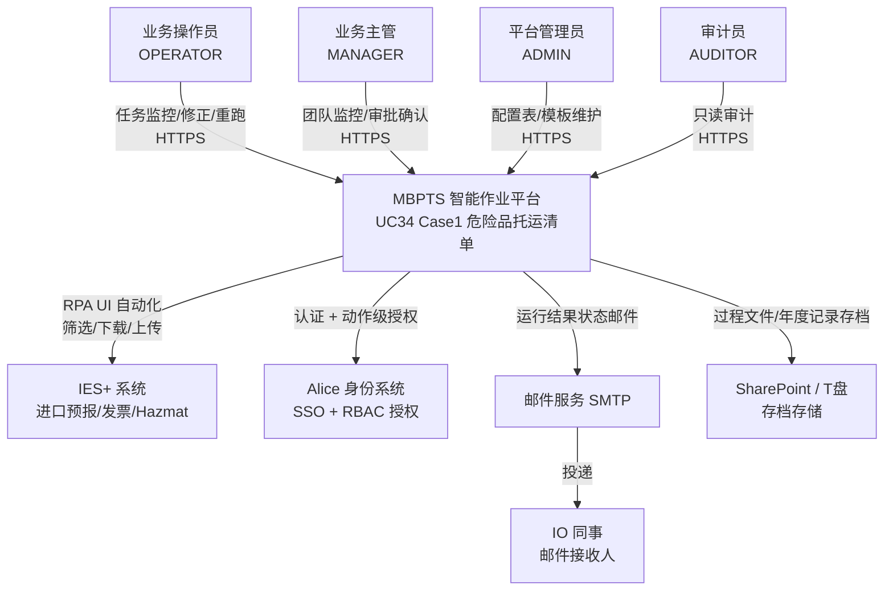
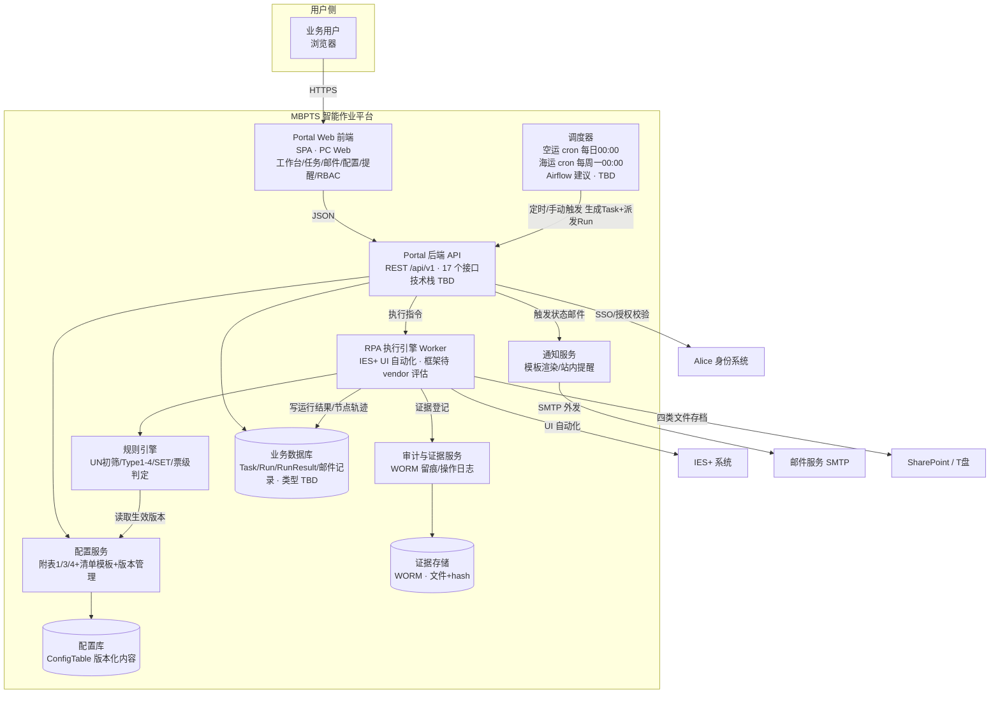
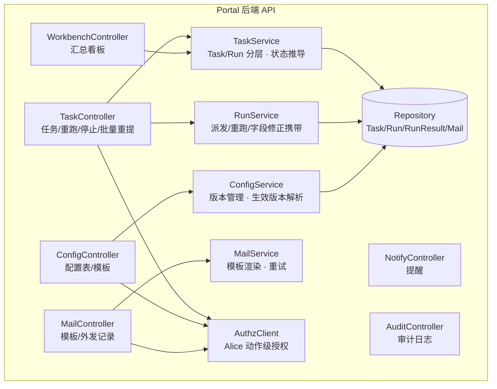
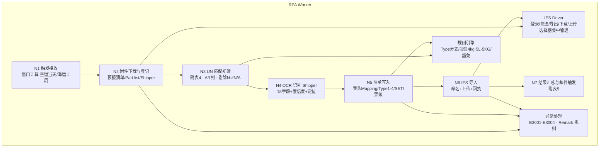
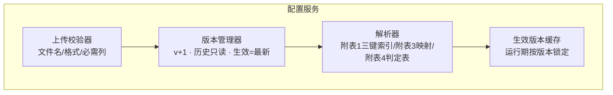

# UC34 Case 1 · 危险品托运清单自动生成 — 系统架构图（C4）

> 创建日期：2026-09-28 | 依据：`Case1_危险品托运清单_PRD.md` v1.1.0
> 说明：技术选型未有既定设计文档，图中标注 **TBD** 的选型为建议方案，需架构评审确认。

---

## 1. Context 图（系统上下文）

**要点**：
- 四类业务角色 + IO 邮件接收人均来自 PRD 第三部分；平台对全部外部系统单向发起
- IES+ 集成方式为 **RPA UI 自动化**（非 API），批量/逐票策略 TBD（PRD TBD-1）
- 存档路径 TBD（PRD TBD-2），地址配置化

---

## 2. Container 图（系统容器）

**容器职责**：

| 容器 | 职责 | 对应 PRD |
|------|------|---------|
| Portal Web 前端 | 7 个前台模块页面（工作台/任务中心/任务详情/邮件/配置/提醒/RBAC） | 7.3.1-7.3.7 |
| Portal 后端 API | 17 个 REST 接口、任务状态推导、权限校验 | 8.2 |
| 调度器 | 空运/海运 cron + 手动触发 + 批量重提队列（随下次调度） | R1、R9.3 |
| RPA Worker | IES+ 七步操作（A1-A7），七节点执行链 | 7.3.8、附录A |
| 规则引擎 | 附表4 匹配、Type1-4 分支、SET 逐 UN、票级判定 | R2/R5/R6 |
| 配置服务 | 5 项配置上传/校验/版本（生效=最新） | R10、附录C |
| 通知服务 | 模板 TPL-C1-STATUS 渲染、IO 邮件、站内提醒 | R7、F021 |
| 审计与证据 | EV-T/EV-P/EV-O 登记、WORM、审计日志 | R9.1、US-014 |

**待决策（架构评审）**：
1. 调度平台：建议 **Airflow**（原型治理台已体现 DAG 口径），或既有企业调度
2. RPA 框架与运行环境：待 vendor 评估（与批量/逐票策略一并）
3. 数据库类型：业务库建议关系型；证据存储建议对象存储+WORM 策略
4. RPA Worker 与 Portal 的部署关系：独立执行节点，任务经队列派发

---

## 3. Component 图（核心组件）

### 3.1 Portal 后端 API

### 3.2 RPA 执行引擎（七节点执行链）

### 3.3 配置服务

---

## 4. 关键数据流

1. **定时执行流**：调度器 → API 生成 Task（每 HAWB/BL 一票）→ 队列派发 RPA Worker → IES Driver 操作 IES+（A1-A7）→ 规则引擎判定 → 写 DB（Run/节点/附表5）→ 通知服务发 IO 邮件 → 存档 SP
2. **异常恢复流**：任务失败 → 站内提醒 → 用户 IES 修正 → 批量重提（入调度队列）或立即重跑（R#n+1，携带字段修正值）
3. **配置变更流**：管理员上传附表新版本 → 校验/解析/生效 → 后续 Run 按新版本执行，历史 Run 仍引用旧版本（可追溯）

---

## 5. 与非功能需求的映射

| NFR（PRD 第九部分） | 架构支撑 |
|--------------------|---------|
| 成功率 ≥95%、失败可重提 | 队列派发 + Run 分层 + 重跑/停止组件 |
| 证据 WORM、历史只读 | 独立证据存储 + 审计服务，历史 Run 不可变 |
| 配置全版本化 | 配置服务版本管理器 + 运行期版本锁定 |
| IES 页面变更可快速修复 | IES Driver 选择器集中管理 + E3002 告警 |
| Alice 授权 | AuthzClient 服务端逐动作校验，UI 显隐仅辅助 |

---

**待评审**：调度平台（Airflow 建议）、RPA 框架、数据库/对象存储类型、RPA Worker 部署拓扑。
