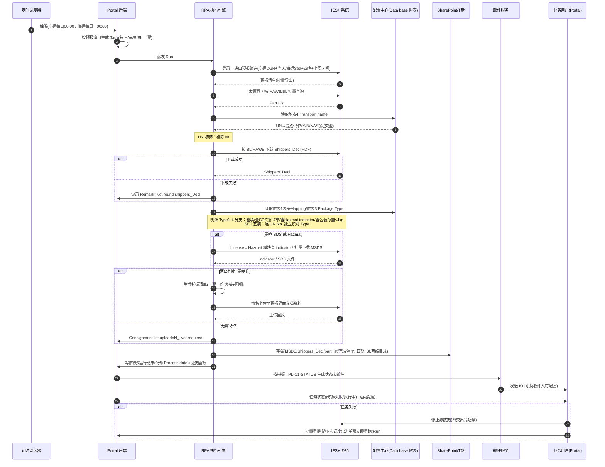

# 设计阶段 Plan — UC34 Case 1：危险品托运清单自动生成

> **创建日期**: 2026-09-24 | **状态**: 进行中 | **阶段**: Stage 2
> **已确认**：流程图 V5 直接采用；复用现有 12 页 demo 作原型；数据模型逻辑实体级；API = Portal API + IES 操作清单

---

## 步骤

- [x] 1. 设计业务流程（泳道流程图 drawio + PNG + 时序图）
- [x] 2. 按模块设计功能（逐页面：布局/交互/字段/状态）
- [x] 3. 原型确认（复用现有 demo + 11 张截图，原型缺口标注）
- [x] 4. 核心业务规则汇总
- [x] 5. 设计数据模型（逻辑实体）
- [x] 6. 设计 API 接口（Portal API + IES 操作清单）
- [x] 7. 定义错误码
- [x] 8. 非功能性需求指标
- [ ] 9. 产出设计文档，请求审批

---

## 1. 业务流程设计

### 1.1 泳道流程图（已确认采用 V5）

- drawio 源文件：`docs/prd/Case1_危险品托运清单_业务流程图.drawio`
- PNG：`prototypes/images/业务流程图.png`
- 三泳道：**01 业务用户/Portal**（P1 任务触发、P2 看板与状态、P3 异常修正重提）→ **02 后台 RPA+数据逻辑**（R1-R12、判断 d1/d2/sd/ns/d3、非 SET 分支 B1-B4、SET 分支 S1-S4、汇聚 merge）→ **03 业务输出**（O1 持续记录、O2 生成清单、O3 回传 IES、O4 邮件通知）
- 虚线反馈环：R12→P2 状态反馈 → P3 失败修正 → P1 重新提交

### 1.2 系统交互时序图

### 1.3 As-Is / To-Be

| 维度 | As-Is（人工） | To-Be（平台） |
|------|--------------|--------------|
| 触发 | 人工每日/每周登录 IES+ 筛选 | 定时调度自动触发+手动入口 |
| 初筛 | 人工 Excel VLOOKUP UN→附表4 | 系统自动匹配并写回结果 |
| 制单 | 逐票人工查 SDS/Hazmat/净重、手工填写 | Type1-4 规则引擎自动分支，SET 自动拆解 |
| 上传 | 人工命名上传 | 自动命名+自动上传+回执留痕 |
| 通知 | 人工汇总发邮件 | 模板自动生成状态表发送 |
| 存档 | 人工建目录归档 | 自动按日期/BL 归档+年度记录 |

---

## 2. 功能模块设计

### 2.1 工作台（home）

- **布局**：侧边导航 + 顶栏（标题/提醒/主题/用户）；内容区按"Case1-空运任务总结""Case1-海运任务总结"两区块，各 5 张统计卡
- **UI 元素**：总任务数(票，不可点，带"?"说明"以一个 HAWB/BL No. 为单位计量")、已完成数(份)、已发送邮件数(封)、执行中(票)、待人工处理(票)（后四张可点击）
- **交互**：点击任务类卡片 → 任务中心带筛选（`?from=workbench&mode=air|sea&status=completed|running|manual`）；点击邮件卡片 → 邮件中心已发送列表
- **字段**：统计数值 + 单位（票/份/封）+ 跳转链接；数据口径=范围内全部任务按最新 Run 状态聚合
- **空/异常态**：无任务显示 0；页脚标注"按运输方式汇总…点击统计卡片可查看对应任务或邮件"

### 2.2 任务中心（tasks）

- **布局**：页头（标题+副标题"任务为业务单据粒度 · 状态取自最新执行实例"）+ 操作行（导出 CSV、新建任务）+ 筛选行 + 表格
- **筛选**：状态 chips（全部/执行中/待人工处理/待上传/有差异/失败/已完成）、来源下拉（含"手动触发"）、搜索框（任务编号/运单号/case/用例）；工作台来源时显示来源横幅+清除按钮
- **表格列**：任务编号（副行 HAWB/BL）、case（case1 tag）、用例（C01-危险品托运清单-空运/海运）、触发来源、状态(当前执行)、执行次数、最近执行开始、当前环节；整行点击进详情
- **新建任务弹窗**：选运输方式（空运/海运）→ 创建并立即生成 Run#1
- **批量重提**（BRD 口径）：按分单号或 Pre-alert creation date 批量查询筛选失败任务 → 重新提交 → 标记"随下次定时任务运行"
- **状态流转**：CREATED→DISPATCHED→RUNNING→SUCCEEDED/FAILED；RUNNING 时禁止再触发；FAILED 可重提/重跑；DIFF_PENDING 可修正后重跑
- **字段定义**：状态枚举 `CREATED/DISPATCHED/RUNNING/WAIT_INPUT/DIFF_PENDING/FAILED/SUCCEEDED`；触发来源枚举 `定时调度/手动创建/手动触发/重跑`

### 2.3 任务详情（task-detail）

- **布局**：头部信息条（ID/case/空运·海运/BL/HAWB/触发来源/规则 + 当前状态/当前执行/执行次数 + 主操作按钮）→ 异常横幅区 → 节点执行轨迹工作台（左节点轨道 rail + 右节点工作区）→ 触发历史(Level1 规则级) + 本任务重试(Level2 Run chips) → 任务操作日志
- **两层历史**：L1 触发历史（同 Case 兄弟任务，累计次数/成功率/平均耗时/近15天热力点阵/最近8条）；L2 Run 切换（✓R#1/✕R#2…"当前"标记；历史 Run 只读+"切回当前执行"）
- **节点工作区**：
  - 解析节点：当前识别数据面板（字段名/值/来源 tag[模型|OCR|规则|系统]/置信度+质量等级/定位按钮/修正按钮）+ 原文预览（文件 tabs/翻页/缩放 60-160%/bbox 高亮）
  - 非解析节点：证据截图卡片（email/ocr/screen/api/file/table/smtp/check/rule）+ 节点附件，标注 WORM 留痕
- **主操作**：FAILED→"↻ 整单重跑（生成新执行）"；DIFF_PENDING→"上传文件/整单重跑"（Case1 上传区禁用："Case 1 无需上传文件，系统自动从 IES+ 获取数据"）；失败/差异节点→"↻ 从此节点重跑"；RUNNING 长时→"停止并重新触发"（限授权角色，本期实现）
- **字段修正**：仅最新 Run 且非执行中可编辑；保存留痕（`delta={old,tm,runNo}`），自下次执行生效（`carried.fromRun` 继承）；写 ops 日志+证据 EV-O+审计；**UC34 无人工审批**
- **弹窗**：重跑确认（"R#n 保持只读归档"）、整单重跑确认、差异处理、字段行内编辑

### 2.4 邮件中心（rules）

- **布局**：范围横幅（当前范围 case1）+ 邮件监听表（Case1 为空，保留表头）+ Case1 邮件模板卡 + （workbench 跳入时）已发送邮件列表
- **邮件模板 TPL-C1-STATUS**：名称"Case 1 · 危险品托运清单上传状态通知"、状态 tag（已配置/待配置）、编辑按钮；样张含收件人（IO 同事邮箱，分号分隔）、主题、正文（"Dears, Kindly pls refer to the consignment list upload status as below. Thanks~"）、上传状态表格（系统按运行结果自动生成）
- **模板参数（9 个）**：`{{Pre-alert creation date}} {{PDC}} {{BL/HAWB}} {{Invoice Type}} {{Terminal WH}} {{Shippers_Decl uploaded(Y/N)}} {{Consignment list upload（Y/N）}} {{Remark}} {{Process date}}`
- **编辑弹窗**：收件人 checkbox 多选（全选/清空/计数）、主题、正文 textarea；保存校验非空+写审计
- **已发送列表**：编号/主题/运输方式/发送日期/状态（"已发送"）

### 2.5 配置中心（config）

- **模板配置 5 行**（各带"上传"按钮+状态 tag）：
  1. 危险品托运清单模板（`道路运输危险货物托运清单_*.xlsx`；校验：前缀+运单号≤100字符+禁非法字符+.xlsx+非空+≤20MB）
  2. 附表1 表头 Mapping list（key: header-mapping）
  3. 附表3 Package Type（key: package-type）
  4. 附表4 Transport name（key: transport-name）
  5. 待发出邮件附件的记录表（key: mail-record）
- **版本管理**：每次上传生成新版本（v+1），保留历史版本可查看/下载；生效版本=最新；变更写审计
- **共享盘监听**（只读展示）：监听目录/触发模板/轮询间隔/文件指纹去重
- **字段**：配置项 key、文件名、版本号、上传人/时间、状态（已配置/未配置/解析失败）

### 2.6 提醒中心（notify）

- **元素**：全部已读、外发审计（弹窗列已发邮件记录）、邮件模板管理（跳邮件中心）
- **列表**：图标（异常红≠/信息蓝i/成功绿✓）、标题（任务待人工处理/执行中/执行成功）、内容（任务ID·危险品托运清单·空运/海运·说明）、时间；点击置已读并跳任务详情
- **规则**：任务异常自动生成站内提醒；未读红点同步顶栏铃铛

### 2.7 权限中心（rbac，只读）

- 4 Tab：我的权限（身份卡/角色能力/动作权限/"MAINTAINER 不是超管"提示）、权限矩阵（角色×动作+职责分离说明）、数据范围（行级/场景/供应商/字段掩码+授权 JSON 示例）、决策记录（时间/主体/动作/资源/允许|拒绝/策略版本）
- 口径：身份与授权由 **Alice** 管理，平台只读展示；UI 显隐不替代服务端授权

### 2.8 后台 RPA 执行链（无 UI，七节点）

| # | 节点 | 输入 | 处理 | 输出/证据 |
|---|------|------|------|----------|
| 1 | 定时任务触发 | 调度配置 | 空运每晚00:00；海运每周一跑上周一~周日；支持手动 | 触发证据 EV-T |
| 2 | 附件下载与登记 | IES+ 筛选条件 | 子步骤：IES导出预报清单/IES导出Part list/IES导出Shipper | 导出文件+登记记录 |
| 3 | 按 UN No. 匹配初筛 | Part List(AN列) + 附表4 | 写 AR 列；空=NA；SET=Y；剔除 N/#N/A | 初筛结果表 |
| 4 | OCR 识别 Shipper | Shippers_Decl PDF | 字段 18 项抽取+置信度 | 字段识别结果+定位 |
| 5 | 托运清单写入 | 附表1/3 + 识别值 | 表头三键 Mapping；表体按 Type1-4/SET 结论；命名`道路运输危险货物托运清单_BL/HAWB` | 清单 xlsx |
| 6 | IES 导入 | 清单文件 | 上传预报界面文档资料+回执 | 回执+上传状态 |
| 7 | 邮件发送 | 附表5运行结果 | 按模板生成状态表发 IO 同事 | .eml 副本+外发审计 |

> **原型缺口**：Type1-4 分支判断、SET 套装逐 UN 核验、SDS 第14章解析、Hazmat indicator 查询在 demo 中无专门 UI 展示（合并于节点 3-5 描述），PRD 以业务规则章节为准。

---

## 3. 原型确认清单

| 检查项 | 状态 |
|--------|------|
| 所有功能模块都有对应 HTML 原型（复用 demo 12 页） | ☑（`Case1_Demo_Final 2\页面demo\`） |
| 所有原型都已截图为 PNG | ☑（11 张，见下） |
| 原型导航首页（index.html）已创建 | ☑（`prototypes/index.html`） |
| 用户已确认原型布局和交互逻辑 | ☑（2026-09-24 确认复用） |
| 交互澄清问题已全部回答 | ☑ |

截图（`prototypes/images/`）：业务流程图.png、home.png（工作台）、tasks.png（任务中心）、task-detail.png（任务详情）、mail-center.png（邮件中心）、rule-edit.png（规则编辑）、dim-tables.png（上传中心）、config.png（配置中心）、notify.png（提醒中心）、rbac.png（权限中心）、govern.png（治理台）、uc26-query.png（UC26 工作台，Case1 范围外仅存档）

---

## 4. 核心业务规则汇总

### R1 触发与调度
- **R1.1** 空运：**每日 00:00** 自动运行；筛选 Invoice Type=DGR，Pre-alert creation=当天
- **R1.2** 海运：**每周一 00:00** 自动运行；筛选 Invoice Type=Sea，PDC=四个 Hazmat 库房（South/West/North/East 3PL），Pre-alert creation=上周一~上周日
- **R1.3** 空运/海运均保留**手动触发**入口
- **R1.4** 运行时间可配置（Portal 可按实际运行时长调整）
- **R1.5** 一票任务 = **一个 HAWB/BL**；对应**一份**托运清单

### R2 UN 初筛
- **R2.1** UN No. 为空 → 匹配结果 NA → **无需制作**
- **R2.2** UN No.=SET → 结果为 Y → 按 Y 逻辑制作且**必须走套装核验路径**
- **R2.3** 剔除附表4 I 列为 **N 和 #N/A** 的行；其余进入后续
- **R2.4** 初筛结果写回 part list 最后一列（AR 列"核查是否需要制作托运清单"）

### R3 Shippers_Decl 获取
- **R3.1** 每票必须尝试下载并记录 **Y/N**（能否下载均记录）
- **R3.2** 未下载到 → Remark=**"Not found shippers_Decl"**
- **R3.3** 文件命名 `shippers_Decl_HAWB/BL`（Avis 后缀规则按 BRD）
- **R3.4** Pre-alert creation date 显示口径：空运=运行当日；海运=区间（如 `2026/09/07~2026/09/13`）

### R4 表头填写
- **R4.1** 按 BL/HAWB 取 PDC + Invoice Type + Terminal WH **三键**，查附表1 Mapping list 填写表头；Mapping 需配置化（人员/供应商变动）

### R5 明细填写（Type1-4）
- **R5.1 Type1（Y）**：单个 UN No. 一一对应，按附表2/3/4 匹配关系直接填写
- **R5.2 Type2（Y，查 SDS 第14章）**：下载 MSDS → 取第14部分"联合国运输名称"或"道路运输 (JT/T 617)"填入运输名称列；**有"公路运输"分类时优先选用**；第14部分多格式需兼容；**无 SDS → 邮件状态表 Remark 记录**；其他字段同 Type1
- **R5.3 Type3（待定，查 IES+ Hazmat indicator）**：N→普通货物**不纳入**；Y→危险品纳入并**查 SDS 第14章**（同 R5.2）
- **R5.4 Type4（待定，查包装规格/净重）**：part list AJ 列 Unit N.W **≤4kg 不纳入**；**＞4kg** 有 Shippers_Decl 则纳入；无则记录 Remark=**"含UN3082/UN3077，需进一步核查包装规格是否大于5L/5KG"**
- **R5.5 SET 套装**：套装内**每个 UN No. 独立识别 Type** 并分别得出"是否制作/如何制作"结论；套装 MSDS 下载需结合 UN No. 选取对应行
- **R5.6 混合待定**：一票中 Type3 与 Type4 并存且确认后均无需 → 整票 N_ Not required

### R6 票级判定与清单生成
- **R6.1** 全票无纳入明细 → Consignment list upload=**"N_ Not required"**，不生成清单
- **R6.2** 存在纳入明细 → 生成清单（一票一份，表头+危险货物明细）
- **R6.3** 清单命名：**`道路运输危险货物托运清单_BL/HAWB`**

### R7 上传与通知
- **R7.1** 清单上传至 IES+ 预报界面**文档资料**下；记录上传状态 Y/N
- **R7.2** 邮件发送 **IO 同事**（收件邮箱清单**可配置**），正文固定引导语+状态表
- **R7.3** 状态表 9 列 = 附表5 八列 + **Process date**；由系统按运行结果自动生成

### R8 存档
- **R8.1** 按**操作日期一级目录 + BL/HAWB 二级目录**存档：MSDS、Shippers_Decl、part list、完成版托运清单
- **R8.2** 每日操作记录累积存档；以 **12月31日** 为截止按年命名
- **R8.3** 路径 TBD（T盘/SharePoint，迁移时同步更新）→ **地址配置化**

### R9 任务治理
- **R9.1** Task/Run 分层：任务状态由最新 Run 推导；**历史 Run 不可变只读**；重跑生成新 Run
- **R9.2** UC34 **无人工审批**；字段修正仅留痕、自下次执行携带
- **R9.3** 失败任务：IES 修正数据后可**按分单号或 Pre-alert creation date 批量查询重提**（随下次定时任务运行）；**单票可立即整单重跑**
- **R9.4** 长时间"执行中"：**可停止并手工重新触发**（限授权角色，本期实现）
- **R9.5** 已知出错场景四类：**document 缺失、UN 标识改变、主数据变化、运单号改变**

### R10 配置与权限
- **R10.1** 四张配置（清单模板/附表1/附表3/附表4/邮件记录表）均**配置化+版本管理**
- **R10.2** IO 收件人清单**可配置**
- **R10.3** RBAC 由 **Alice** 管理；平台只读；职责分离（主管无字段修正权、操作员无对外动作确认权）

---

## 5. 数据模型（逻辑实体）

> Task/Run 严格分层；任务状态不落库，由最新 Run 推导；历史 Run 只读。

### E1 Task 任务（业务单据）
| 字段 | 类型 | 说明 |
|------|------|------|
| id | string | `T-MMDD-####` / 演示 `T-DEMO-A###`(空)/`T-DEMO-S###`(海) |
| uc / caseId / case | string | UC34 / case-1 / C01 危险品托运清单 |
| mode | enum | air / sea |
| waybill | string | HAWB/BL No.（一票一任务） |
| src | enum | 定时调度/手动创建/手动触发/重跑 |
| rule | string | 关联规则（如 R-DG-CN） |
| waitState | object? | 缺件待上传状态（Case1 一般为空） |
| ops | array | 操作日志 [{tm, txt}] |
| runs | array<Run> | 执行实例集合，最末为当前执行 |

### E2 Run 执行实例
| 字段 | 类型 | 说明 |
|------|------|------|
| no | int | R#n，递增 |
| cause | string | 触发原因（初次执行/节点重跑/整单重跑/批量重提） |
| st | enum | RUNNING/SUCCEEDED/FAILED/DIFF_PENDING |
| start / dur | string | 开始时间 / 耗时 |
| nodes | array<NodeExecution> | 七节点执行轨迹 |
| fields | array<FieldExtraction> | 解析节点字段识别结果 |
| files | array | 原文文件 [{name, pages}] |
| carried | object? | `{fromRun}` 继承上次修正值标记 |

### E3 NodeExecution 节点执行
`{n, st(ok/run/fail/review/queued), d, subs[], err?, ev[证据], evFiles[附件]}`

### E4 FieldExtraction 字段识别
`{k, v, src(模型/OCR/规则/系统), conf(0-100), quality(高/中/低/规则确定), locator:{docId,page,bbox}|false, locatorReason?, delta?:{old,tm,runNo}, carried?:{fromRun}}`

### E5 RunResult 运行结果行（附表5）
`{preAlertDate(单日|区间), pdc, waybill, invoiceType, terminalWH, shippersDeclUploaded(Y/N), consignmentListUpload(Y/N/N_ Not required), remark, processDate}`

### E6 ConfigTable 配置表
`{key(header-mapping/package-type/transport-name/mail-record/consignment-template), name, currentVersion, versions:[{v, fileName, uploadedBy, uploadedAt, status, contentRef}]}`

### E7 MailTemplate / MailRecord
- 模板：`{id:'TPL-C1-STATUS', name, subject, body, recipients[], params[9], status, updatedBy/At}`
- 外发记录：`{id, tplId, subject, mode(air/sea), sentAt, status, emlRef}`

### E8 ArchiveRecord 存档索引
`{processDate, waybill, basePath(配置化), files:{msds[], shippersDecl, partList, consignmentList}}`

### E9 YearlyOpLog 年度操作记录
`{year, rows:[{preAlertDate, warehouseName, dgTerminalWH, invoiceType, waybill, shippersDeclRelated, consignmentListUpload, remark, rpaProcessDate}]}`

### E10 Evidence 证据 / Notification / AuditLog / RoleRef
- 证据：`{id(EV-T/EV-P/EV-O-####), task, what, time, hash(16hex), uc}`，WORM 防篡改
- 提醒：`{type, title, content, tm, read, link}`
- 审计：`{tm, who, act, obj, src}`
- 角色引用（Alice 只读）：`{userId, role(OPERATOR/MANAGER/ADMIN/AUDITOR), dataScope, policyVersion}`

**关系**：Task 1—n Run；Run 1—n NodeExecution/FieldExtraction；Task 1—1 RunResult（每次运行汇总一行或多行写附表5）；ConfigTable/MailTemplate 被 Run 引用（按版本锁定）；Run 1—n Evidence。

---

## 6. API 接口设计（Portal 前后端）

> 风格：REST + JSON；鉴权：Alice SSO + 服务端授权（动作级）；基础路径 `/api/v1`

| # | 方法与路径 | 说明 | 关键参数/响应 | 权限 |
|---|-----------|------|--------------|------|
| 1 | GET `/workbench/summary?caseId=case-1` | 工作台空运/海运汇总 | 返回两组 5 指标 | task.read |
| 2 | GET `/tasks` | 任务列表 | query: status/mode/src/keyword/start/end/page；返回行=任务+最新 Run 摘要 | task.read |
| 3 | POST `/tasks` | 新建任务（手动触发） | body: {mode: air\|sea} → 创建并生成 R#1 | task.create |
| 4 | GET `/tasks/{id}` | 任务详情 | 含 runs[]、ops[]、当前状态推导 | task.read |
| 5 | GET `/tasks/{id}/runs/{no}` | 指定执行（只读历史） | nodes/fields/files/evidence | task.read |
| 6 | POST `/tasks/{id}/rerun` | 重跑 | body: {scope: all\|fromNode, fromNode?} → R#n+1；RUNNING 时拒绝 E1002 | run.rerun.safe |
| 7 | POST `/tasks/{id}/stop` | 停止长时执行 | RUNNING→已停止；可再触发 | run.stop（限授权） |
| 8 | POST `/tasks/resubmit` | 批量重提 | body: {waybills[] } 或 {preAlertStart, preAlertEnd} → 标记随下次调度 | run.rerun.safe |
| 9 | PATCH `/tasks/{id}/runs/current/fields/{k}` | 字段修正留痕 | body: {value, reason} → delta 记录 | task.field.correct |
| 10 | GET `/config/tables` | 配置表列表+状态 | 5 项配置当前版本 | config.read |
| 11 | POST `/config/tables/{key}/versions` | 上传新版本 | multipart；校验规则见 2.5 | config.publish |
| 12 | GET/PUT `/mail/templates/TPL-C1-STATUS` | 邮件模板读写 | PUT 校验非空+写审计 | config.publish |
| 13 | GET `/mail/records?mode=&status=` | 已发送邮件列表 | 外发审计 | task.read |
| 14 | GET `/notifications` / POST `/notifications/read-all` | 提醒 | — | 本人 |
| 15 | GET `/audit/logs?keyword=` | 审计日志 | — | audit.read |
| 16 | GET `/govern/kpi` | 治理 KPI | DAG 次数/失败率/延迟/成本 | admin |
| 17 | POST `/scheduler/trigger` | 手动触发定时任务 | body: {mode, window?} | task.create |

### 附录 A：IES+ 页面级 RPA 操作清单（集成附件）

| 步骤 | IES+ 页面 | 操作 | 数据 |
|------|----------|------|------|
| A1 | 登录 | 账号登录 IES+ | 凭据（密钥托管） |
| A2 | 进口管理→进口预报 | 输入筛选条件→确定→导出→批量导出 | 空运：DGR+当天；海运：Sea+四 Hazmat 库+上周区间 |
| A3 | 发票界面 | 批量输入 HAWB/BL→确定→导出 part list | 追加 AR 列写初筛结果 |
| A4 | 预报界面 | 按 BL/HAWB 搜索→下载 Shippers_Decl(PDF) | 命名 shippers_Decl_HAWB/BL；失败记录 |
| A5 | License→Hazmat 模块 | 输入配件号查询 hazmat indicator | Type3 判定（Y/N） |
| A6 | License→Hazmat 模块 | 批量下载附件→选 SDS→批量下载 | Type2/3 取 SDS 第14部分；套装需按 UN No. 选行 |
| A7 | 预报界面→文档资料 | 上传托运清单附件 | 命名 `道路运输危险货物托运清单_BL/HAWB`；取回执 |

> 批量/逐票处理策略：**TBD 待 vendor 评估**（BRD 原注）。

---

## 7. 错误码

| 码 | 场景 | 用户提示 | 处理 |
|----|------|---------|------|
| E1001 | 任务不存在/不在权限范围 | 任务不存在或无权查看 | 返回列表 |
| E1002 | 已有执行中实例 | 当前任务正在执行，禁止重复触发 | 保留入口禁用 |
| E1003 | 历史执行只读 | 历史 Run 不可修改 | 引导切回当前执行 |
| E1004 | 无操作权限 | 当前角色无此操作权限 | 隐藏/禁用+服务端拒绝 |
| E2001 | 清单模板文件名校验失败 | 文件名须为"道路运输危险货物托运清单_BL/HAWB.xlsx" | 重新上传 |
| E2002 | 文件超限制 | 文件需 ≤20MB 且为 .xlsx | 重新上传 |
| E2003 | 配置表格式错误 | 缺少必需列/格式不符 | 标记"解析失败" |
| E3001 | IES+ 登录失败 | 系统登录失败，任务失败 | 记失败+提醒，可重跑 |
| E3002 | IES+ 页面元素定位失败 | 页面结构变更 | 记失败+告警管理员 |
| E3003 | Shippers_Decl 下载失败 | 记 Remark=Not found shippers_Decl | 流程继续 |
| E3004 | 清单上传 IES 失败 | 上传状态=N，任务失败 | 可重跑 |
| E4001 | 邮件发送失败 | 外发失败，自动重试 3 次 | 仍失败记审计+提醒 |
| E5001 | 存档写入失败 | 存档路径不可用 | 告警+补偿任务 |

---

## 8. 非功能性需求指标

| 类别 | 关键指标 |
|------|---------|
| 性能 | 单票端到端处理 ≤ 人工基线（待测定）；调度延迟 P95 ≤ 60s；Portal 页面加载 P95 ≤ 2s |
| 可靠性 | 定时任务成功率 ≥95%（剔除源数据问题）；失败 100% 可追踪可重提；邮件外发失败自动重试 |
| 安全 | Alice SSO + 动作级服务端授权；凭据密钥托管；字段掩码（如适用）；审计全量留痕 |
| 合规 | 证据 WORM 防篡改；历史 Run 只读；操作记录按年存档 ≥ 法规要求年限 |
| 兼容性 | PC Web：Chrome/Edge 最新两个大版本 |
| 可配置 | 调度时间、四张配置表、收件人清单、存档路径均可配置且版本化管理 |
| 可维护 | IES+ 页面变更（E3002）可快速定位修复；RPA 步骤与业务规则解耦 |

---

## 设计摘要（步骤9完成后填写）

### 业务流程
- **整体流程**: 三泳道 V5（drawio + PNG），已确认采用
- **核心时序**: 调度→RPA→IES+→配置→存档→SMTP→Portal（含失败重提环），见 1.2 Mermaid
- **As-Is / To-Be**: 见 1.3

### 功能模块清单
| 模块 | 页面数 | 核心交互 | 原型状态 |
|------|-------|---------|---------|
| 工作台 | 1 | 空运/海运 5 卡汇总、点击穿透 | 已有 demo+截图 |
| 任务中心 | 1 | 筛选/新建/导出/批量重提 | 已有 demo+截图 |
| 任务详情 | 1 | 两层历史/节点轨迹/字段修正/重跑/停止 | 已有 demo+截图 |
| 邮件中心 | 1 | 模板+收件人配置/已发送 | 已有 demo+截图 |
| 配置中心 | 1 | 5 项配置上传+版本 | 已有 demo+截图 |
| 提醒中心 | 1 | 提醒/外发审计 | 已有 demo+截图 |
| 权限中心 | 1 | RBAC 只读 4 Tab | 已有 demo+截图 |
| RPA 执行链 | 0（无 UI） | 七节点自动执行 | **原型缺口**，以规则章节为准 |

### 数据模型
- 逻辑实体: 10 个（Task/Run/NodeExecution/FieldExtraction/RunResult/ConfigTable/MailTemplate+MailRecord/ArchiveRecord+YearlyOpLog/Evidence+Notification+AuditLog+RoleRef）
- 接口: 17 个 Portal API + 7 步 IES+ RPA 操作清单（附录 A）
- 错误码: 12 个

### 非功能性需求
见第 8 节（性能/可靠性/安全/合规/兼容/可配置/可维护）。

---

**审批状态**: 已通过（2026-09-24 用户确认"继续"）
**审批人**: 用户
**审批意见**: 无修改意见，进入 Stage 3
