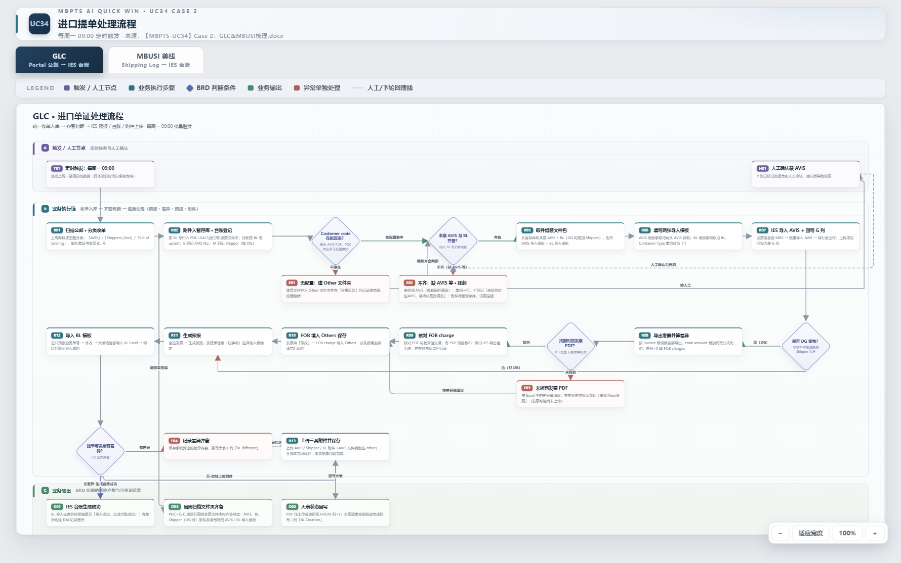
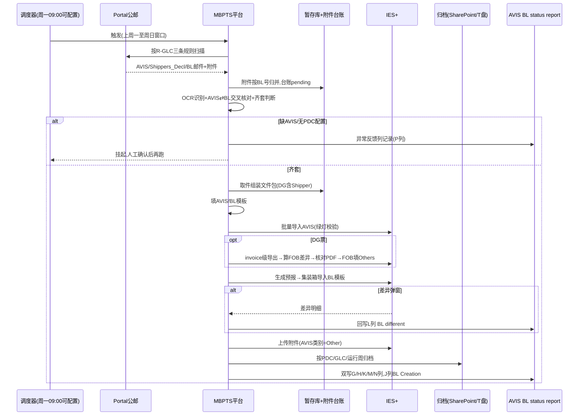
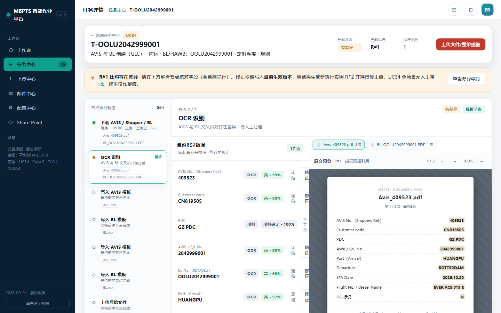

# MBPTS UC34 Case 2 · GLC 线:欧线(OOCL)AVIS / BL 自动化 — 产品需求文档

## 文档信息

| 项目 | 内容 |
|------|------|
| **文档名称** | UC34 Case 2 · GLC 线(欧线 OOCL)AVIS/BL 自动化 PRD |
| **版本** | v1.0.0 |
| **创建日期** | 2026-09-29 |
| **最后更新** | 2026-09-29 |
| **负责人** | BA(SCM-IE / Import Operations 对接) |
| **审核人** | 待审核 |
| **密级** | 内部 |

**文档用途**:定义 MBPTS 平台 UC34 Case 2 中 **GLC 欧线(船公司 OOCL)** 进口提单(AVIS/Shipper/BL)处理自动化的产品需求,作为开发与验收依据。MBUSI 美线需求见独立文档《UC34-Case2-MBUSI_PRD》。

**关联文档**:
- [需求澄清文档](./UC34-Case2_需求澄清文档.md)(Q1~Q14 全部已澄清)
- [设计说明书](./设计说明书.md)
- [MBUSI 线 PRD](./UC34-Case2-MBUSI_PRD.md)
- 原型基线:`C:\MBPTS\case2页面demo\`
- 业务依据:`【MBPTS-UC34】case 2:AVIS_BL_Automation_BRD_0920`、`【MBPTS-UC34】Case 2:GLC&MBUSI梳理.docx`、`【UC34-Case2】GLC_MBUSI_业务流程图_20260927.html`

---

## 版本历史

| 版本号 | 修订日期 | 修订人 | 修订内容 | 状态 |
|--------|---------|--------|---------|------|
| v1.0.0 | 2026-09-29 | BA | 初版(由双线版拆分为单线文档) | 草稿 |

---

# 第一部分:产品概述

## 1.1 产品定义

**产品名称**:MBPTS UC34 Case 2 · GLC 线 — 欧线(OOCL)AVIS / BL 自动化

**所属系统**:MBPTS AI Quick Win 平台(UC34)

**功能定位**:将 GLC 欧线进口提单处理——公邮收单(AVIS/Shipper/BL)、按 PDC 归档建夹、AVIS/BL 导入模板填写、IES+ 导入、DG 票 FOB Charges 处理、状态回写——从全人工转为"平台自动化 + 异常人工协同"。

**使用端**:PC Web

**交付版本**:v1.0.0

## 1.2 产品愿景

业务老师每周只处理 GLC 线的异常票(无配置/缺 AVIS/差异),其余票全部自动完成;每票全程可追溯、可审计、可受控重跑。

## 1.3 核心价值

| 价值维度 | 价值描述 | 受益人群 |
|---------|--------|---------|
| 效率 | 每周批量自动处理 GLC 提单,单票端到端自动化率 ≥80% | 进口运营 |
| 质量 | AVIS⇄BL 交叉核对 + FOB 差异公式核对,异常票 100% 识别不漏 | 进口运营/关务 |
| 合规 | 全程证据留痕(WORM)、修正留痕、审计可查 | 审计/管理层 |
| 可维护 | PDC 对应表、AVIS/BL 模板、邮件规则、调度均配置化 | 业务老师/平台管理员 |

## 1.4 产品范围

### 包含范围

| 模块 | 功能描述 |
|------|--------|
| GLC 邮件监听与统一收单 | 监听 Portal 公邮,按主题分类 AVIS / Shippers_Decl / Bill of landing;附件按 BL 号入暂存库 + 附件台账 |
| GLC 齐套与归档 | PDC 配置表映射(未命中建 Other)、跨周按 BL 号归并的齐套判断、缺 AVIS 挂起与人工确认 |
| GLC 模板与 IES 导入 | AVIS 模板(7 列)/ BL 模板(9 列)填写;IES+ 批量导入 AVIS;生成预报;集装箱信息导入 BL 模板 |
| DG 分支处理 | 以是否搜到 Shippers_Decl 判定 DG;FOB Charges 差异计算、发票 PDF 核对、FOB 填入 Others;文件夹加 DG 后缀 |
| 附件上传与回写 | IES+ 上传 AVIS(类别 Other)/Shipper/BL;回写大表 G/H/J/K/L/M/N/P 列(平台台账为主,双写) |
| 任务管理 | 工作台 GLC 统计、任务中心、任务详情(Run 切换、字段修正留痕、PDF 原文定位、证据、重跑) |
| 规则与配置 | R-GLC-AVIS / R-GLC-SHIPPER / R-GLC-BL 三条监听规则;AVIS/BL 模板与 PDC/IES Port 对应表版本管理 |

### 不包含范围(后续迭代 / 其他文档)

- MBUSI 美线(见《UC34-Case2-MBUSI_PRD》)
- 治理运营台、权限中心、提醒中心、上传中心的平台级完整需求(仅简述引用)
- 源系统改造(IES+、公邮系统);未匹配单证的线下业务处理
- IES+ 交互的技术实现选型(UI 自动化或接口通道,留待概要设计)

---

# 第二部分:业务背景与目标

## 2.1 业务问题

1. **全人工、强重复**:每周人工在 Portal 公邮分别搜索"AVIS"、"Shippers_Decl"、"Bill of landing",下载附件、按 PDC 建文件夹归档、对照 PDF 逐字段抄录 AVIS/BL 两张导入模板、登录 IES+ 逐票导入并生成预报/台账。
2. **跨周时差易漏**:BL 较 AVIS 晚 2~3 周到邮,人工跨周匹配易漏;找不到 AVIS 的提单靠人工记录与确认。
3. **DG 票处理靠经验**:需识别 Shippers_Decl 判定 DG、导出发票算 FOB 差异、逐张核对发票 PDF 后填入 Others。
4. **差异与回写靠手抄**:IES 差异弹窗靠人工抄录回写大表 L 列;G/H/J/K/M/N/P 各列人工登记。

## 2.2 业务目标与成功指标

| 目标 | 描述 | 优先级 |
|------|------|--------|
| 提效 | GLC 线提单处理自动化,业务只处理异常票 | P0 |
| 保质 | 异常票(无 PDC 配置/缺 AVIS/差异)100% 识别并转人工 | P0 |
| 可审计 | 全链路证据与操作留痕,每票可查可重跑 | P1 |

| 指标 | 目标值 | 测量方法 |
|------|-------|---------|
| 单票端到端自动化率 | ≥80%(建议值,待业务确认) | 无需人工介入完成票数 / 总票数 |
| 异常票识别率 | 100% 不漏 | 抽查运行周台账 |
| 异常票单票人工耗时 | ≤5 分钟(建议值) | 任务详情操作日志计时 |
| 每周批量运行完成时间 | <2 小时(建议值) | 调度起止时间 |

---

# 第三部分:用户角色与权限

四角色,身份与授权由 Alice 管理(权限中心只读查询)。

| 功能 | OPERATOR 业务操作员 | MANAGER 业务主管 | ADMIN 平台管理员 | AUDITOR 审计员 |
|------|:---:|:---:|:---:|:---:|
| 工作台/任务中心查看 | ✓ | ✓ | ✓ | ✓(只读) |
| 字段修正(留痕) | ✓ | — | — | — |
| 安全重跑(整单/节点/批量) | ✓ | ✓ | — | — |
| 不可逆重跑 / 对外动作确认 | — | ✓ | — | — |
| 缺件补传 | ✓ | ✓ | — | — |
| 列表导出 | — | ✓ | — | — |
| GLC 规则编辑/发布 | — | — | ✓ | — |
| GLC 模板/对应表/调度配置 | — | — | ✓ | — |
| 审计日志/证据查询 | — | — | ✓ | ✓ |

**职责分离**:主管无字段修正权,操作员无对外确认权;UC34 全场景修正仅留痕、无人工审批节点。

---

# 第四部分:术语定义

| 术语 | 说明 |
|------|------|
| AVIS | OOCL 到货通知单 PDF,含 AVIS No.(Shippers Ref)、Customer code、Arrival、ETA 等 |
| BL / 提单 | Bill of Lading;GLC 线登记时 BL 号前需加 "OOLU" 前缀 |
| Shipper / Shippers_Decl | 危险品申报单(发件人 mbox-006-gsp-lsa-vds2@mercedes-benz.com);**能否搜到该文件是 DG 判定标准**,基本与 AVIS 同天到邮 |
| DG | Dangerous Goods 危险品货物;DG 票需处理 FOB Charges,文件夹命名追加 DG 后缀 |
| PDC | 货物目的地仓,由 AVIS 中 Customer code 经可配置对应表映射 |
| 大表 / AVIS BL status report | 业务状态跟踪表;平台双写回写 E/G/H/J/K/L/M/N/P 列 |
| IES+ | 进口管理系统:发票信息、批量导入 AVIS、预报、集装箱信息、台账、文档上传 |
| 齐套 | 本票 AVIS + BL(DG 票另加 Shipper)均按 BL 号归并到手 |
| 暂存库 / 附件台账 | 命中邮件附件按 BL 号归并的暂存区及登记台账(pending/processed) |
| Task / Run | 任务(票粒度=BL 号)/ 执行实例(不可变,重跑生成 R#N+1) |
| MBZ / BOL | IES+ 发票查询单号(导入 AVIS 前查询用)/ 提单号 |
| FOB Charges | DG 票需在 IES 发票 Others 中补填的费用,差异公式见 R5.2 |
| WORM | Write Once Read Many,证据防篡改存储 |

---

# 第五部分:用户故事

### US-G01:每周定时批量自动处理(GLC)

**作为** 业务操作员
**在** 每周一 09:00(调度可配置)定时任务运行后
**于** 工作台 / 任务中心
**我想要** 查看 GLC 线上一周(周一至周日)的自动处理结果总览
**以便于** 只把注意力投向"待人工处理"的票

**验收标准**:
- AC1: 系统按可配置调度时间(默认每周一 09:00)自动触发 GLC 流程,数据窗口为上周一至周日。
- AC2: 工作台 GLC 组展示总任务数/已完成/执行中/待人工处理 4 张统计卡,以 BL No. 为票粒度;点击带参跳任务中心。
- AC3: 每票生成 Task 与 R#1,节点轨迹完整(7 节点,见 7.3.3)。

**异常/边缘场景**:
- E1: 调度时间恰逢系统维护 → 支持手动触发补跑,数据窗口不变(去重防重)。
- E2: 当周公邮无 GLC 新邮件 → 正常结束,统计卡显示 0 票,不报错。

---

### US-G02:统一收单与齐套判断

**作为** 平台(自动执行)
**在** 每周批量运行时
**于** 邮件监听 / 暂存库
**我想要** 按三条规则扫描公邮、把附件按 BL 号归并入暂存库,并判断每票是否齐套
**以便于** AVIS 与 BL 的 2~3 周到邮时差不影响后续自动处理

**验收标准**:
- AC1: 按主题「AVIS」/「Shippers_Decl」/「Bill of landing」分类收单;E 列记 AVIS No.,M 列记 Shipper(命中即判 DG)。
- AC2: 附件一律先按 BL 号入暂存库并写附件台账(pending);同 BL 重复邮件保留最新版。
- AC3: 齐套 = AVIS + BL 均归并到手(DG 票另需 Shipper),跨周归并;齐套票进入文件组装。
- AC4: Customer code 查 PDC 配置表;未命中建 Other 文件夹、异常反馈列记录,**流程不阻断**。

**异常/边缘场景**:
- E1: 缺 AVIS 的 BL → 单列一行,P 列记"未找到对应 AVIS,请确认是否漏发",该票挂起,人工确认后再跑。
- E2: 邮件附件无法解析出 BL 号 → 记异常并转人工,不入暂存库主流程。

---

### US-G03:DG 票 FOB Charges 处理

**作为** 平台(自动执行)+ 业务操作员(异常核对)
**在** AVIS 导入成功且该票判定为 DG 时
**于** IES+ 发票信息
**我想要** 系统自动导出发票、按公式计算 FOB 差异、核对发票 PDF 后把 FOB 填入 Others 保存
**以便于** DG 票费用完整、金额以系统为准

**验收标准**:
- AC1: DG 判定以收单时是否搜到 Shippers_Decl 为准;DG 票文件夹命名追加 DG 后缀,Shipper 重命名 shippers_Decl_BL 归档。
- AC2: 按 invoice 级模板全部导出,差异公式 `FOB = Total − Goods − Packing − Insurance − Freight − DGR`,差异≠0 即需处理。
- AC3: 找到发票 PDF 且金额不一致时,**以 IES 导出 FOB 值为准**并在异常反馈列记录;核对无误后将 FOB charge 填入 Others 保存。
- AC4: 未找到发票 PDF 时按 Excel 差异值填写,并在异常反馈记"未找到 xxx 发票"。

**异常/边缘场景**:
- E1: 多张发票存在差异 → 逐张处理,全部填完后保存。
- E2: 导出文件为空/格式变更 → 记异常转人工,不臆造差异值。

---

### US-G04:差异票字段修正与重跑

**作为** 业务操作员
**在** 某票 Run 状态为"有差异(DIFF_PENDING)"时
**于** 任务详情页
**我想要** 对照 PDF 原文逐字段核对识别结果,行内修正错误字段(留痕)后重跑
**以便于** 不改源文件即可让系统携带修正值完成后续节点

**验收标准**:
- AC1: 差异票在任务中心和详情页头部均有标识,横幅可一键定位差异字段(金色高亮)。
- AC2: "当前识别数据"展示字段名/值/来源(OCR/规则)/置信度/质量等级;点击"定位"跳到原文预览对应页。
- AC3: 行内修正记录修正人/时间/原值/新值,仅留痕不审批;重跑生成 R#N+1 并携带修正值,历史 Run 只读。

**异常/边缘场景**:
- E1: 修正值为空或格式非法 → 阻断保存并提示。
- E2: 非 OPERATOR 角色尝试修正 → 无入口(E5001),符合职责分离。

---

### US-G05:IES 差异弹窗捕获与回写

**作为** 平台(自动执行)
**在** 集装箱信息导入 BL 模板后出现差异弹窗时
**于** IES+ / 回写通道
**我想要** 完整捕获差异内容并回写大表 L 列「BL different」
**以便于** 业务在线下核对差异时有完整依据

**验收标准**:
- AC1: 差异弹窗内容完整捕获(字段级:接口值 vs 提单值,如 G.W/QTY/VOL),回写 L 列。
- AC2: 记录差异后流程继续:上传 AVIS(类别 Other)/Shipper(DG)/BL 附件并保存。
- AC3: 无差异时系统提示"导入成功,生成台账成功"。
- AC4: PDF 均上传成功回写 H/K/N 列 = Y;本票全部完成回写 J 列「BL Creation」;AVIS 导入成功回写 G 列。

**异常/边缘场景**:
- E1: 差异弹窗无法解析 → 截图存证据 + 记异常转人工。
- E2: 大表回写失败 → 入回写队列重试并告警(E5002)。

---

### US-G06:GLC 规则与模板维护

**作为** 平台管理员
**在** 业务调整邮件口径或 IES 模板格式时
**于** 邮件中心 / 配置中心
**我想要** 修改 GLC 三条监听规则(dry-run 验证)、上传新版 AVIS/BL 模板、维护 PDC 与 IES Port 对应表
**以便于** 业务变更无需改代码发版

**验收标准**:
- AC1: 规则支持监听邮箱、发件人白名单(`*@域名`)、主题/正文关键词、附件数量区间、附件角色(avis/shipper_decl/bl + 正则 + 必需/多份)、流程绑定(case-2-glc / case-2-glc-dg)、去重键、优先级、启停。
- AC2: dry-run 对样本邮件真实匹配并展示命中/未命中原因,不产生任务。
- AC3: AVIS 模板(7 列)/ BL 模板(9 列)上传校验扩展名 + ≤20MB,版本+1,历史可查。
- AC4: PDC-Customer Code、IES Port 对应表在线维护即时生效;调度时间可配置(默认周一 09:00)。

**异常/边缘场景**:
- E1: 规则校验失败(正则错误/必需角色缺失)→ 阻断保存(E1001)。
- E2: 模板版本与流程不兼容 → 阻断并提示回退(E2002)。

---

# 第六部分:业务流程

## 6.1 整体流程(To-Be)— 跨职能泳道流程图

泳道:触发与人工 / MBPTS 平台 / IES+ 系统 / 邮件·归档·大表。节点编号与 2026-09-27 版业务流程图一致。



> **源文件**:[UC34-Case2_业务流程图.drawio](./UC34-Case2_业务流程图.drawio)(draw.io 打开,GLC 页)

### 分阶段说明

| 阶段 | 节点 | 说明 |
|------|------|------|
| 触发 | T01 | 每周一 09:00(可配置),处理上周一至周日 |
| 统一收单 | R01→R02 | 扫描公邮按主题分类(AVIS/Shippers_Decl/Bill of landing);附件按 BL 号入暂存库+台账;E 列记 AVIS No.,M 列记 Shipper(即 DG) |
| 归档判断 | D01→E01 | Customer code 查 PDC 配置表;未命中建 Other 文件夹并记异常,流程继续 |
| 齐套判断 | D02→E02→H01 | AVIS 与 BL 按 BL 号跨周归并;不齐挂起、单列一行、P 列记"未找到对应 AVIS,请确认是否漏发",人工确认后再跑 |
| 文件准备 | R05→R06 | 取件组装文件包(DG 含 Shipper + 两模板);填 AVIS 模板(字段均取自 AVIS)与 BL 模板(Container Type 单位改 `'`) |
| IES 导入 | R07→D03 | 发票信息查 MBZ → 批量导入 AVIS → 绿灯后上传 → 回写 G 列;DG 判断以是否搜到 Shipper 为准 |
| DG 分支 | R08→D04→R09/E03→R10 | invoice 级导出算 FOB 差异;找到 PDF 核对(不一致以 IES 导出值为准并记录);未找到按差异值填并记"未找到 xxx 发票";FOB 填入 Others 保存 |
| 预报与 BL | R11→R12→D05 | 全选发票生成预报(信息取自提单,港口经 IES Port 表,船名航次直接 COPY)→ 集装箱信息导入 BL 模板 → 差异弹窗判断 |
| 差异与上传 | E04→R13 | 差异回写 L 列 BL different;上传 AVIS(类别 Other)/Shipper/BL 附件并保存 |
| 输出 | O01/O02/O03 | 生成台账成功;回写 H/K/N=Y、J 列 BL Creation;周归档文件夹齐备可查 |

### 归档结构(GLC)

```
<归档根(默认 SharePoint,可配置 T 盘)>
└─ <PDC(由 Customer code 映射;未命中为 Other)>
   └─ GLC
      └─ <运行周(按系统运行时间)>
         └─ Shippers Ref + OOLU + BL No. + ETA <YYYY.MM.DD> [+ DG]
            ├─ AVIS 原件 PDF
            ├─ BL_OOLU<BL号>.pdf
            ├─ shippers_Decl_BL(仅 DG 票)
            ├─ AVIS 导入模板(已填写)
            └─ BL 导入模板(已填写)
```

## 6.2 系统交互时序



---

# 第七部分:功能设计

## 7.1 功能清单

| 编号 | 功能 | 优先级 | 原型/截图 |
|------|------|--------|----------|
| F-G01 | 工作台 GLC 总览 | P0 | [index.png](./images/index.png) |
| F-G02 | 任务中心(GLC 筛选/批量重跑/导出/新建) | P0 | [tasks.png](./images/tasks.png) |
| F-G03 | 任务详情(Run 切换/节点轨迹,GLC 7 节点) | P0 | [task-detail.png](./images/task-detail.png) |
| F-G04 | 字段修正留痕 + PDF 原文定位 | P0 | [task-detail.png](./images/task-detail.png) |
| F-G05 | 节点证据预览(WORM) | P1 | [task-detail.png](./images/task-detail.png) |
| F-G06 | GLC 邮件监听规则(3 条) | P0 | [rules.png](./images/rules.png) |
| F-G07 | 规则编辑器(三段式 + dry-run) | P0 | [rule-edit.png](./images/rule-edit.png) |
| F-G08 | 配置中心(AVIS/BL 模板、PDC/IES Port 表、调度) | P0 | [config.png](./images/config.png) |
| F-G09 | 归档浏览(GLC 目录) | P1 | [sharepoint.png](./images/sharepoint.png) |
| F-G10 | 站内提醒(平台引用) | P1 | [notify.png](./images/notify.png) |

## 7.2 核心业务规则(GLC)

### R1 收单规则
- R1.1 邮件按主题关键词分类:「AVIS」/「Shippers_Decl」/「Bill of landing」;Shipper 发件人 mbox-006-gsp-lsa-vds2@mercedes-benz.com,基本与 AVIS 同天到邮。
- R1.2 命中附件**一律先按 BL 号入暂存库并写附件台账**(pending),匹配成功即处理;同 BL 重复邮件**保留最新版**。
- R1.3 E 列记 AVIS No.;M 列记 Shipper(**命中 Shipper 即判 DG**)。

### R2 归档规则
- R2.1 PDC 由 Customer code 查配置表;**未命中建 Other 文件夹**并在异常反馈列记录,流程继续。
- R2.2 票文件夹命名:`Shippers Ref + OOLU + BL No. + ETA <YYYY.MM.DD>`,DG 票追加 `DG`(示例:`527452 OOLU2036726960 ETA 2026.08.17 DG`)。
- R2.3 重命名:BL → `BL_OOLU<BL号>`(提单号加 "OOLU" 前缀);Shipper → `shippers_Decl_BL`。
- R2.4 归档根为配置项,默认 SharePoint,兼容 T 盘过渡。

### R3 齐套与挂起规则
- R3.1 齐套 = AVIS + BL 均按 BL 号归并(DG 票另需 Shipper);**BL 与 AVIS 有 2~3 周时差,必须跨周归并**。
- R3.2 缺 AVIS:单列一行、P 列记"未找到对应 AVIS,请确认是否漏发"、该票挂起,**人工确认后再跑**。

### R4 模板规则
- R4.1 AVIS 模板(7 列)字段**均取自 AVIS**;从 AVIS 读 "Arrival" 填大表 D 列、"Estimated date of arrival" 填 F 列。
- R4.2 BL 模板(9 列)字段取自 BL,**Container Type 单位改 `'`**。
- R4.3 预报信息取自提单;港口经 **IES Port 对应表**转换;船名航次直接 COPY。
- R4.4 模板版本化,新版上传即生效,历史可查。

### R5 IES 执行规则
- R5.1 **绿灯后方可上传**;必填校验不过不上传;MBZ 复制到查询栏(空格系统自动加)。
- R5.2 DG 票 FOB 公式:`FOB = Total − Goods − Packing − Insurance − Freight − DGR`,**差异≠0 即处理**。
- R5.3 有 PDF 但金额不一致**以 IES 导出 FOB 值为准**并记异常;未找到发票按差异值填并记"未找到 xxx 发票";全部涉及 FOB 的费用填完后保存。
- R5.4 差异弹窗**完整捕获**回写 L 列「BL different」。
- R5.5 附件类别:AVIS 选 **Other**;全部传完再保存。

### R6 回写规则(平台台账为主,双写大表)
| 列 | 内容 |
|----|------|
| D | Arrival(到港,取自 AVIS) |
| E | AVIS No. |
| F | Estimated date of arrival(取自 AVIS) |
| G | AVIS 上传成功 |
| H/K/N | 三类 PDF 上传成功 = Y |
| J | BL Creation(本票完成) |
| L | BL different(差异内容) |
| M | DG 标记(Shipper) |
| P | 异常情况反馈 |

### R7 重跑规则
- R7.1 重跑**不得产生重复**行/文件夹/上传。
- R7.2 Run 不可变;整单/节点/批量重跑生成 R#N+1,**携带人工修正值**;执行中任务跳过。
- R7.3 失败票支持从明确检查点受控续跑。

### R8 权限与审计规则
- R8.1 四角色职责分离:主管无字段修正权,操作员无对外确认权。
- R8.2 修正仅留痕不审批,写入当前生效版本。
- R8.3 全操作审计;证据(trigger/process/operation)带 hash,**WORM 防篡改**。
- R8.4 邮箱/路径/重试/等待时间**不得硬编码**;凭证安全存储且不入日志。

---

## 7.3 原型及交互规则说明

### 7.3.1 工作台 GLC 总览(F-G01)

**页面名称**:工作台 | **用户角色**:全部角色

**功能说明**:GLC 线每周处理概况入口,统计卡直达异常票列表。


| # | 功能点 | 功能描述&操作说明 |
|---|--------|----------------|
| 1 | GLC 统计卡 ×4 | 总任务数/已完成/执行中/待人工处理(BL No. 票粒度);点击带参跳任务中心(`mode=glc&status=`) |
| 2 | 侧栏导航 | 工作台→任务中心→上传中心→邮件中心→配置中心→Share Point |

---

### 7.3.2 任务中心(F-G02)

**页面名称**:任务中心 | **用户角色**:全部角色(操作按角色控制)

**功能说明**:GLC 任务统一列表,任务=业务单据(票粒度),状态取最新 Run。


| # | 功能点 | 功能描述&操作说明 |
|---|--------|----------------|
| 1 | 状态筛选 chip | 全部/执行中/待人工处理/待上传/有差异/失败/已完成 |
| 2 | 来源筛选 | 定时调度/手动创建/手动触发 |
| 3 | 导出列表 | CSV(仅 MANAGER) |
| 4 | 新建任务 | 选择 GLC 线路手动建票 |
| 5 | 批量重跑 | 勾选生成 R#N+1;执行中自动跳过 |

**字段**:任务编号(T-BL号)、case(AVIS 与 BL 创建(GLC))、触发来源、状态(当前执行)、执行次数、最近执行开始、当前环节。

---

### 7.3.3 任务详情(F-G03/G04/G05)

**页面名称**:任务详情 | **用户角色**:全部角色(修正/重跑按角色控制)

**功能说明**:单票全生命周期:Run 切换、GLC 7 节点轨迹、识别字段核对与修正、PDF 原文定位、证据预览、重跑。



**GLC 节点编排(7 节点)**:
1. 下载 AVIS / Shipper / BL(每周一 09:00,上周一至周日,Portal 公邮)
2. OCR 识别(AVIS 2 页 + BL,字段 17 项,**AVIS⇄BL 交叉核对**)
3. 写入 AVIS 模板(7 列)
4. 写入 BL 模板(9 列)
5. 导入 AVIS 模板(IES+ 批量导入 AVIS;DG 票含 FOB Charges 核对)
6. 导入 BL 模板(生成预报 + 集装箱信息导入 → 生成台账)
7. 上传原始文件(AVIS/Shipper/BL,回写大表 G/H/J/K/L/M/N/P 列)

| # | 功能点 | 功能描述&操作说明 |
|---|--------|----------------|
| 1 | 头部操作 | 失败时「整单重跑」;有差异时「上传文件/整单重跑」 |
| 2 | 三层横幅 | 待上传缺件/有差异(可定位差异字段)/失败 |
| 3 | Run 切换 | R#1、R#2…历史只读;当前生效版本可操作 |
| 4 | 当前识别数据 | 字段名/值/来源/置信度/质量等级;低置信金色高亮;行内修正留痕 |
| 5 | PDF 原文定位 | 「定位」→ 原文预览跳对应页;翻页/缩放 |
| 6 | 步骤证据 | email/ocr/screen/table/file 五类,内联预览,WORM 标注 |
| 7 | 触发历史/操作日志 | 同 Case 兄弟任务、15 天热力图;任务级全操作留痕 |

**字段表(当前识别数据区,GLC 示例)**:AVIS No.(Shippers Ref)、Customer code、PDC、AWB/B/L No.、BL No.(加 OOLU)、Port (Arrival)、Departure、ETA Date、Flight No./Vessel Name、DG 标识等 17 项;每字段含来源(OCR/规则)、置信度、质量等级、定位、修正入口。

---

### 7.3.4 GLC 邮件规则与编辑器(F-G06/G07)

**页面名称**:邮件中心 / 规则编辑器 | **用户角色**:ADMIN


**GLC 预置规则**:

| 规则 | 监听要素 | 绑定流程 | 说明 |
|------|---------|---------|------|
| R-GLC-AVIS | 主题含「AVIS」 | case-2-glc | AVIS 收单 |
| R-GLC-SHIPPER | 主题含「Shippers_Decl」,发件人 mbox-006-gsp-lsa-vds2@mercedes-benz.com | case-2-glc-dg | **DG 判定** |
| R-GLC-BL | 主题含「Bill of Landing」 | case-2-glc | BL 收单(与 AVIS 有 2~3 周时差) |

| # | 功能点 | 功能描述&操作说明 |
|---|--------|----------------|
| 1 | 规则列表 | 规则、监听邮箱、优先级、绑定流程、累计命中、启用开关 |
| 2 | 筛选条件段 | 规则名、监听邮箱、发件人白名单(`*@域名`)、To/Cc、主题/正文关键词、附件数量区间 |
| 3 | 附件要求段 | 角色 avis/shipper_decl/bl + 文件名正则 + 类型 + 必需/多份 |
| 4 | 流程绑定段 | case-2-glc / case-2-glc-dg、汇聚策略、OCR Schema、去重键(BL 号)、优先级、启停 |
| 5 | dry-run | 对样本邮件真实匹配,不产生任务 |

---

### 7.3.5 配置中心 GLC 部分(F-G08)

**页面名称**:配置中心 | **用户角色**:ADMIN


| 配置项 | 说明 |
|--------|------|
| AVIS 导入模板 | 7 列:AVIS/Shipping Log No.、MBZ/BOL、Container No.、Container Type、Seal Number、Container VOL(m³)、Container Load(KG);IES+「批量导入 AVIS」用,字段取自 AVIS PDF |
| BL 导入模板 | 9 列:No.、Shipping log No./AVIS No.、HAWB/BL No.、Container No.、Container Type、Seal No.、Package Qty、Container Load(KG)、Container VOL(m³);IES+「集装箱信息」导入用,字段取自 BL PDF |
| IES Port 对应表 | 英文港口名 ↔ IES 港口名称;生成预报时转换,业务维护 |
| PDC-Customer Code 对应表 | PDC 映射;未命中建 Other(R2.1) |
| 调度配置 | 每周一 09:00,可配置 |

操作:查看/上传(扩展名 + ≤20MB,版本+1);对应表在线维护即时生效。

---

### 7.3.6 归档浏览 GLC 目录(F-G09)

**页面名称**:Share Point | **用户角色**:全部角色


- 目录树:`<归档根>\<PDC>\GLC\<运行周>\<票文件夹>`;面包屑 + 目录内搜索。
- 文件列表:名称/修改日期/类型/大小;文件抽屉(元信息 + 下载/复制路径)。
- 票文件夹内容见 6.1 归档结构。

---

### 7.3.7 平台能力引用(F-G10)

| 页面 | 截图 | 本线使用方式 |
|------|------|------------|
| 提醒中心 | [notify.png](./images/notify.png) | GLC 任务成功/异常自动生成站内提醒,点击跳任务详情;不外发邮件 |
| 治理运营台 | [govern.png](./images/govern.png) | DAG 监控、审计日志、证据总量(WORM) |
| 权限中心 | [rbac.png](./images/rbac.png) | 四角色只读查询;身份与授权由 Alice 管理 |
| 上传中心 | [dim-tables.png](./images/dim-tables.png) | 空态(暂不涉及),平台能力预留 |

---

# 第八部分:数据需求

## 8.1 数据模型(逻辑模型,GLC 相关实体)

| 实体 | 说明 | 关键字段 |
|------|------|---------|
| MailRule 邮件规则 | GLC 三条监听规则 | id、监听邮箱、发件人白名单、主题关键词、附件区间、附件角色[]、绑定流程、去重键、优先级、启停 |
| AttachmentLedger 附件台账 | 暂存登记(key=BL号) | BL 号(归一)、角色(avis/shipper_decl/bl)、文件名、来源邮件、接收时间、状态(pending/processed)、版本 |
| StagingFile 暂存文件 | 暂存库引用 | BL 号、类型、路径、hash |
| Task 任务 | 业务单据(票粒度) | 任务号(T-BL号)、caseId(case-2-glc)、BL/HAWB、触发来源、当前状态、当前 Run 号 |
| Run 执行实例 | 一次执行(不可变) | Run 号、起因、状态、起止、耗时、携带修正版本 |
| NodeExecution 节点执行 | GLC 7 节点轨迹 | Run id、节点序号/名称、状态、起止、输出摘要 |
| FieldResult 字段结果 | 识别+修正(17 字段) | 字段名、原值、来源、置信度、质量等级、修正值/人/时间、原文定位 |
| Evidence 证据 | WORM 留痕 | 类型/子类型、路径、hash、Run/节点关联 |
| ConfigTemplate 模板配置 | AVIS/BL 模板 | 配置项、当前文件、版本、状态、列定义 |
| RefTable 对应表 | PDC / IES Port | 类型、键、值、备注、版本 |
| WritebackRecord 回写记录 | 大表双写 | BL 号、列(D/E/F/G/H/J/K/L/M/N/P)、值、时间、结果 |
| Notification / AuditLog | 提醒 / 审计 | 见平台定义 |

**状态机**:
- Task:执行中 → 已完成 / 有差异(待人工)/ 待上传(缺件)/ 失败 →(人工处理+重跑)→ 执行中
- Run:PENDING → RUNNING → SUCCEEDED / DIFF_PENDING / WAIT_INPUT / FAILED
- AttachmentLedger:pending → processed

## 8.2 API 接口(平台前后端,GLC 相关)

| 接口 | 方法 | 说明 |
|------|------|------|
| /api/workbench/summary?line=glc | GET | GLC 统计卡 |
| /api/tasks | GET/POST | 任务列表(line=glc)/ 新建 GLC 任务 |
| /api/tasks/{id} | GET | 任务详情(Runs/节点/字段/证据) |
| /api/tasks/{id}/rerun | POST | 重跑(full/node/batch) |
| /api/runs/{runId}/fields/{fieldId}/correct | POST | 字段修正留痕 |
| /api/tasks/{id}/attachments | POST | 缺件补传(解除 WAIT_INPUT) |
| /api/rules、/api/rules/{id}、/toggle、/dry-run | GET/POST/PUT | GLC 规则管理 |
| /api/configs、/api/configs/{id}/versions | GET/POST | AVIS/BL 模板版本 |
| /api/ref-tables/{type} | GET/PUT | pdc / ies-port 对应表 |
| /api/staging/{blNo}、/resume | GET/POST | 暂存查询 / 挂起确认续跑 |
| /api/writeback?blNo= | GET | 回写状态 |
| /api/archive/tree、/files | GET | GLC 归档浏览 |
| /api/export/tasks.csv | GET | 导出(MANAGER) |

**IES+ 侧能力要求**(实现不限定):I1 发票查询(MBZ);I2 批量导入 AVIS(绿灯校验);I3 invoice 级导出;I4 发票附件下载/修改(FOB 填 Others);I5 生成预报;I6 集装箱导入 BL 模板(**差异弹窗可完整捕获**);I7 文档上传(类别含 Other)。

## 8.3 错误码

| 错误码 | 含义 |
|--------|------|
| E1001 | 规则校验失败(正则/附件角色缺失),阻断保存 |
| E1002 | dry-run 样本邮件不可用 |
| E2001 | 模板上传校验失败(扩展名/>20MB) |
| E2002 | 模板版本与流程不兼容 |
| E3001 | IES 导入差异(弹窗),捕获 → L 列 → 转人工 |
| E3002 | IES 上传失败/超时,支持检查点重试 |
| E4001 | 暂存缺件(缺 AVIS/BL/Shipper),任务挂起 WAIT_INPUT |
| E4002 | 重复 BL(去重命中),跳过并记录 |
| E4003 | PDC/ETA 缺失,不建不明确文件夹,转人工 |
| E5001 | 权限不足,拒绝 + 审计 |
| E5002 | 大表回写失败,入队重试 + 告警 |

---

# 第九部分:非功能性需求

| 类别 | 指标 | 要求 |
|------|------|------|
| 性能 | 周批量时长 | GLC 线批量 <2 小时(建议值,含双线合计口径) |
| 性能 | 页面响应 | 首屏 <2s;任务列表万级分页流畅 |
| 可靠性 | 续跑 | 失败票检查点续跑;重跑去重 100%;调度失败告警 |
| 安全 | 凭证 | 安全存储,不出现于日志 |
| 安全 | 权限/审计 | RBAC 四角色;全操作审计;证据 WORM |
| 兼容性 | 浏览器 | Chrome / Edge 主流版本(PC Web) |
| 可配置 | 配置化 | 调度时间、邮箱、路径、重试、等待时间、模板、对应表均不硬编码 |
| 可审计 | 留痕 | 每票保留源文件、输出、时间戳、状态、错误详情 |

---

# 第十部分:约束与假设

| 约束 | 说明 |
|------|------|
| 触发口径 | 每周一 09:00(可配置),数据窗口固定为上周一至周日 |
| DG 判定 | 仅以"是否搜到 Shippers_Decl"为准,不做内容级危险品识别 |
| 大表双写 | 平台台账为主,必须同步回写 AVIS BL status report |
| 修正无审批 | UC34 全场景修正仅留痕,不设人工审批节点 |
| IES+ 实现 | 交互方式不限定,绿灯校验与差异弹窗捕获为硬性能力要求 |

| 假设 | 说明 |
|------|------|
| 公邮接入 | 平台可读取 Portal 公邮(OOCL 的 AVIS/BL、Shippers_Decl 均到达该公邮) |
| 大表可写 | AVIS BL status report 具备平台回写通道 |
| 身份体系 | Alice 提供四角色授权与数据范围 |

---

# 第十一部分:风险与待确认

## 风险

| 编号 | 风险 | 等级 | 应对 |
|------|------|------|------|
| RSK-G1 | BL 与 AVIS 2~3 周时差导致齐套误判 | 中 | 跨周按 BL 号归并 + 挂起 + 人工确认(R3) |
| RSK-G2 | OCR 识别错误流入 IES(AVIS/BL 字段) | 高 | 置信度分级 + 低置信强制人工修正 + AVIS⇄BL 交叉核对 |
| RSK-G3 | IES+ 页面/模板变更导致导入失败 | 中 | 模板版本化 + 检查点续跑 + 失败告警 |
| RSK-G4 | DG 判定依赖 Shipper 到邮及时性(Shipper 晚于 AVIS 时当轮误判非 DG) | 中 | Shipper 与 AVIS 基本同天;Shipper 先到时按 BL 归并;DG 票可人工修正后重跑 |
| RSK-G5 | 归档根迁移(T 盘→SharePoint)中断 | 低 | 配置切换 + 历史目录保持可读 |

## 待确认

| 编号 | 问题 | 影响 | 状态 |
|------|------|------|------|
| OPEN-G1 | 成功指标建议值(≥80% 自动化率等)需业务确认 | 验收口径 | 待业务确认 |
| OPEN-G2 | PDC-Customer Code 对应表初始数据 | 配置初始化 | 待业务提供 |
| OPEN-G3 | AVIS/BL 模板最终版本与字段映射终稿 | 配置初始化 | 供应商待确认项 |
| OPEN-G4 | 测试账号、权限、样本文件、IES+ 测试环境 | 测试就绪 | 供应商待确认项 |

---

# 附录

## 附录A:原型与截图清单(GLC)

原型基线目录:`C:\MBPTS\case2页面demo\`

| 页面 | 原型文件 | 截图 |
|------|---------|------|
| 工作台 | index.html | [index.png](./images/index.png) |
| 任务中心 | tasks.html | [tasks.png](./images/tasks.png) |
| 任务详情(GLC 差异票) | task-detail.html | [task-detail.png](./images/task-detail.png) |
| 邮件中心 | rules.html | [rules.png](./images/rules.png) |
| 规则编辑器 | rule-edit.html | [rule-edit.png](./images/rule-edit.png) |
| 配置中心 | config.html | [config.png](./images/config.png) |
| Share Point | sharepoint.html | [sharepoint.png](./images/sharepoint.png) |
| 业务流程图 | — | [业务流程图_GLC.png](./images/业务流程图_GLC.png)、[drawio 源文件](./UC34-Case2_业务流程图.drawio)(GLC 页) |

## 附录B:相关文档

| 文档 | 说明 |
|------|------|
| `【MBPTS-UC34】case 2:AVIS_BL_Automation_BRD_0920.docx/.md` | GLC 欧线 BRD(原始逐步截图流程) |
| `【MBPTS-UC34】Case 2:GLC&MBUSI梳理.docx` | 双线操作梳理(GLC 部分) |
| `【UC34-Case2】GLC_MBUSI_业务流程图_20260927.html` | 业务侧流程图(含 2026-09-27 设计确认点) |
| [需求澄清文档](./UC34-Case2_需求澄清文档.md) | Q1~Q14 澄清记录 |
| [设计说明书](./设计说明书.md) | Stage 2 设计全文 |
| [MBUSI 线 PRD](./UC34-Case2-MBUSI_PRD.md) | 美线独立文档 |

---

**文档版本**:V1.0.0 | **编写日期**:2026-09-29 | **审核人**:待审核
