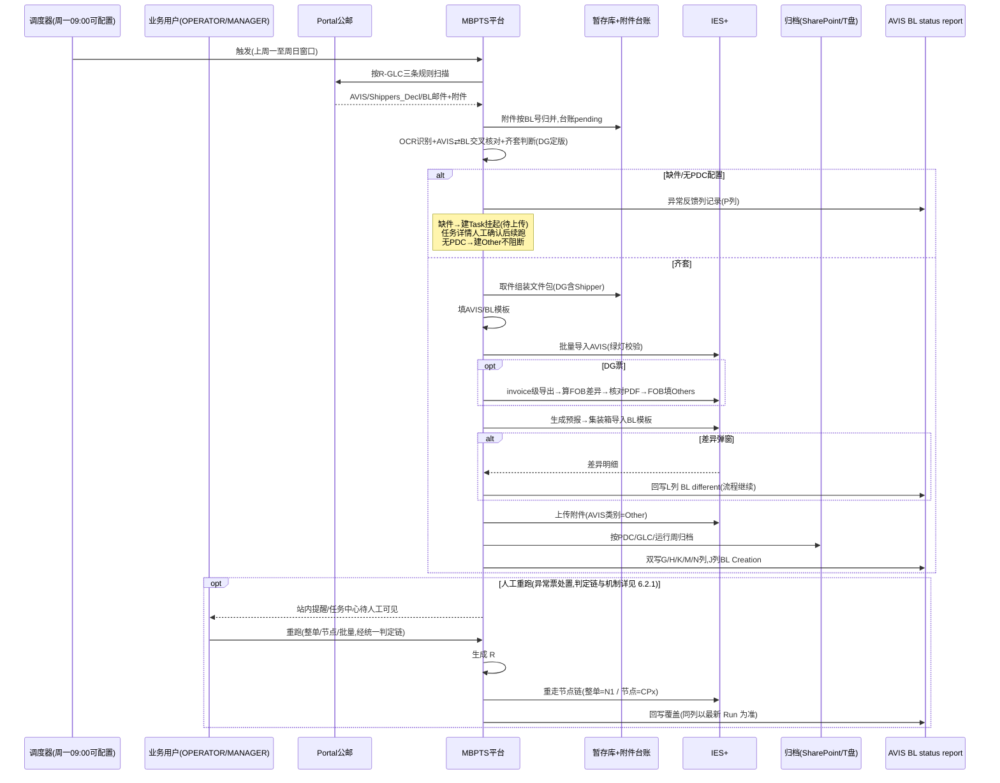
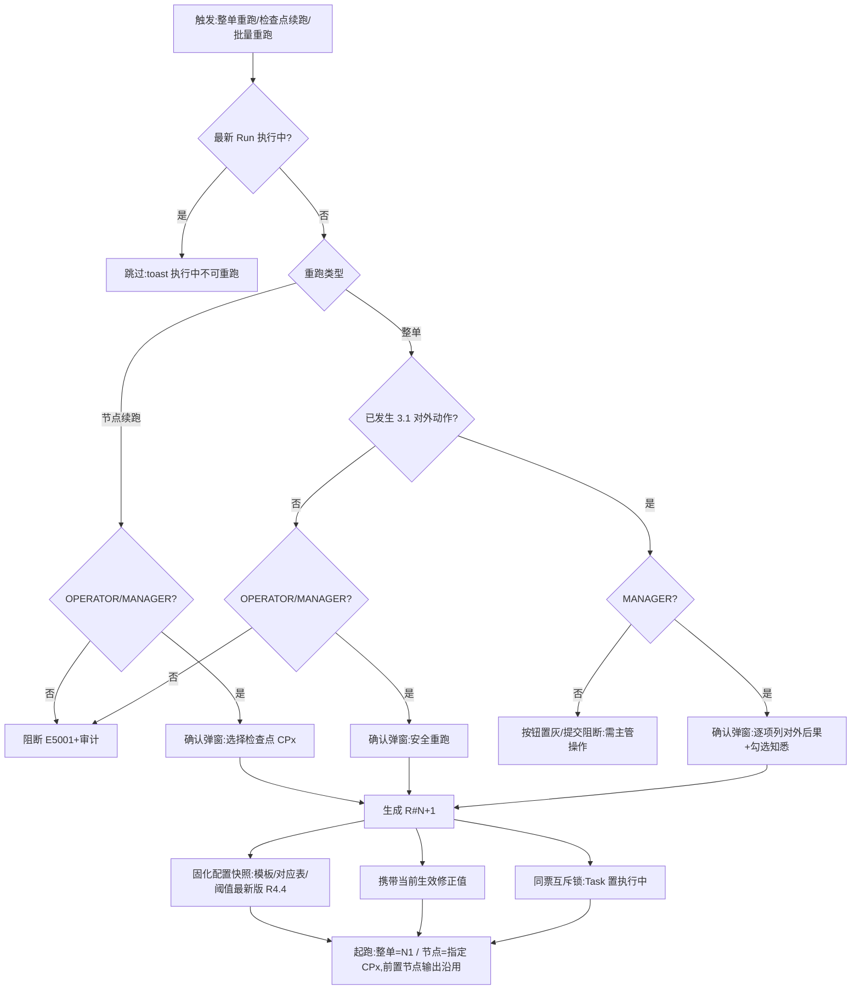
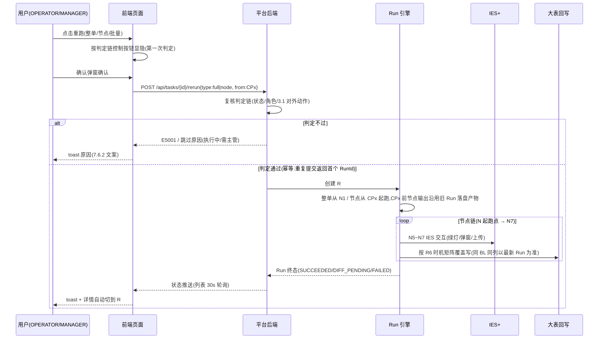

# MBPTS UC34 Case 2 · GLC 线:欧线(OOCL)AVIS / BL 自动化 — 产品需求文档

## 文档信息

| 项目 | 内容 |
|------|------|
| **文档名称** | UC34 Case 2 · GLC 线(欧线 OOCL)AVIS/BL 自动化 PRD |
| **版本** | v1.2.4(主时序图补人工重跑分支) |
| **创建日期** | 2026-09-29 |
| **最后更新** | 2026-10-08 |
| **负责人** | BA(SCM-IE / Import Operations 对接) |
| **审核人** | 待审核 |
| **密级** | 内部 |

**文档用途**:定义 MBPTS 平台 UC34 Case 2 中 **GLC 欧线(船公司 OOCL)** 进口提单(AVIS/Shipper/BL)处理自动化的产品需求,作为开发与验收依据。MBUSI 美线需求见独立文档《UC34-Case2-MBUSI_PRD》。

**关联文档**:
- [PRD 审查报告](./UC34-Case2-GLC_PRD_审查报告.md)(P01~P23 诊断与修订落点)
- [需求澄清文档](./UC34-Case2_需求澄清文档.md)(Q1~Q14 全部已澄清)
- [设计说明书](./设计说明书.md)
- [MBUSI 线 PRD](./UC34-Case2-MBUSI_PRD.md)
- 原型基线:`C:\MBPTS\case2页面demo\`
- 业务依据:`【MBPTS-UC34】case 2:AVIS_BL_Automation_BRD_0920`、`【MBPTS-UC34】Case 2:GLC&MBUSI梳理.docx`、`【UC34-Case2】GLC_MBUSI_业务流程图_20260927.html`

---

## 版本历史

| 版本号 | 修订日期 | 修订人 | 修订内容 | 状态 |
|--------|---------|--------|---------|------|
| v1.0.0 | 2026-09-29 | BA | 初版(由双线版拆分为单线文档) | 草稿 |
| v1.1.0 | 2026-09-29 | BA | 深度审查修订:2 处口径冲突修复;状态映射/回写时机/交叉核对/字段级设计/对外动作清单新增;缺件挂起闭环补齐;权限矩阵补行;平台能力分析新增 | 草稿 |
| v1.1.1 | 2026-09-30 | BA | 实物表单核对:R4.1 数据源修正(AVIS 模板前 5 列取自 gvShipLog 而非 AVIS);MBZ 改 1..n;FOB 公式列核实;两模板逐列取数位置细化;OPEN 增至 20 项 | 草稿 |
| v1.1.2 | 2026-09-30 | BA | GLC 真实票 400759 全套实物核对:AVIS 模板来源双口径并列(OPEN-G21);F-08 字段不存在(Arrival=港名);BL 模板 B/C 列口径修正(OPEN-G22);OPEN-G17/G18 获实物佐证;OPEN 增至 22 项 | 草稿 |
| v1.1.3 | 2026-09-30 | BA | 实现层补充:新增 7.4 节点实现规格(7 节点×输入/子步骤/输出/检查点/失败处理+3 道闸口);明确 Task 创建时机(收单即建);新增 OCR 置信度阈值待确认(OPEN-G23);第十一部分显式列出概要设计必须回答的 3 项技术决策 | 草稿(含 23 项 OPEN 待确认) |
| v1.2.0 | 2026-10-08 | BA | 页面级实质性扩写(Demo 仅作形态参照,设计以业务流程为准):7.3.1~7.3.7 每页补齐进入条件/展示与查询字段表(含字段业务原因)/按钮显示条件×角色矩阵/触发后系统处理与反馈/空态异常;任务中心新增运行周/PDC/DG 筛选(OPEN-G24)与异常摘要列;工作台新增调度信息条与「立即补跑本周批次」(OPEN-G25);任务详情补齐头部按钮状态×角色矩阵、缺件处理区字段、修正-重跑联动;配置中心补齐对应表行级维护与生效语义;6.3 新增 J13/J14 跳转;8.2 新增 /api/schedule/trigger 与"页面-操作-接口映射"表;OPEN 增至 25 项 | 草稿(含 25 项 OPEN 待确认) |
| v1.2.1 | 2026-10-08 | BA | 新增 7.5 性能与数据量级预期:7.5.1 业务量级基线(周 100 票/峰值 300 票假设,挂 OPEN-G8;单票 OCR 页数、MBZ 行数、存储年增 ~50GB 等均标注实物依据);7.5.2 分页面性能验收口径;7.5.3 节点单票耗时预算+峰值批量测算(**结论:RPA 串/并行均无法满足 <2h,D1 须优先 IES 接口通道**,已回写 D1 决策要求);7.5.4 超限降级策略(新增"IES 并发会话上限"待确认,并入 D1);第十部分非功能需求交叉引用 7.5 | 草稿(含 25 项 OPEN 待确认) |
| v1.2.2 | 2026-10-08 | BA | 页面设计细节规格(8 项全量):新增 7.6 通用规格——7.6.1 六个表单控件规格(控件/默认值/校验时机/错误文案/字段联动)、7.6.2 全局文案表(术语约束:重跑/续跑/补跑/补传)、7.6.3 权限×状态×操作总矩阵(接口级鉴权基准)、7.6.4 数据展示规范(欧式小数/日期/状态色)、7.6.5 边界并发场景(防重/并发修正/补传竞争/Session);④三条关键交互序列(S1 补传→续跑、S2 修正→重跑、S3 批量重跑)落入 7.3.2/7.3.3;⑦Run 对比视图(OPEN-G26)落入 7.3.3,并补回 Run 切换区描述;⑧附录 A-1 Demo 与最终设计偏差对照表;修复 v1.2.1 误删的"第八部分"标题;OPEN 增至 27 项(G26/G27) | 草稿(含 27 项 OPEN 待确认) |
| v1.2.3 | 2026-10-08 | BA | 新增 6.2.1 重跑交互时序与判定流程:统一判定链流程图(执行中跳过/类型分支/3.1 对外动作 MANAGER 门槛/快照+修正值+互斥锁)、mermaid 时序图(前端显隐+后端复核双判定、幂等返回首个 RunId)、8 条时序关键点(快照时点/修正携带/检查点输出沿用/同票互斥/批量逐票独立/终态重置/回写覆盖边界);R7 新增 R7.5 引用;新增 OPEN-G28(L 列重跑后覆盖清空口径);OPEN 增至 28 项 | 草稿(含 28 项 OPEN 待确认) |
| v1.2.4 | 2026-10-08 | BA | 6.2 主时序图末尾补简化"人工重跑"分支(提醒→用户触发→R#N+1→重走节点链→回写覆盖,标注判定链详见 6.2.1),主图获得完整性、复杂度不爆炸 | 草稿(含 28 项 OPEN 待确认) |

---

# 第一部分:产品概述

## 1.1 产品定义

**产品名称**:MBPTS UC34 Case 2 · GLC 线 — 欧线(OOCL)AVIS / BL 自动化

**所属系统**:MBPTS AI Quick Win 平台(UC34)

**功能定位**:将 GLC 欧线进口提单处理——公邮收单(AVIS/Shipper/BL)、按 PDC 归档建夹、AVIS/BL 导入模板填写、IES+ 导入、DG 票 FOB Charges 处理、状态回写——从全人工转为"平台自动化 + 异常人工协同"。

**使用端**:PC Web

**交付版本**:v1.2.0

## 1.2 产品愿景

业务老师每周只处理 GLC 线的异常票(无配置/缺 AVIS/差异),其余票全部自动完成;每票全程可追溯、可审计、可受控重跑。

## 1.3 核心价值

| 价值维度 | 价值描述 | 受益人群 |
|---------|--------|---------|
| 效率 | 每周批量自动处理 GLC 提单,单票端到端自动化率 ≥80% | 进口运营 |
| 质量 | AVIS⇄BL 交叉核对 + FOB 差异公式核对,异常票 100% 识别不漏 | 进口运营/关务 |
| 合规 | 全程证据留痕(WORM)、修正留痕、审计可查 | 审计/管理层 |
| 可维护 | PDC 对应表、AVIS/BL 模板、邮件规则、调度均配置化 | 业务老师/平台管理员 |

## 1.4 产品范围

### 包含范围

| 模块 | 功能描述 |
|------|--------|
| GLC 邮件监听与统一收单 | 监听 Portal 公邮,按主题分类 AVIS / Shippers_Decl / Bill of landing;附件按 BL 号入暂存库 + 附件台账 |
| GLC 齐套与归档 | PDC 配置表映射(未命中建 Other,不阻断)、跨周按 BL 号归并的齐套判断、缺件(含缺 AVIS)挂起与人工确认闭环 |
| GLC 模板与 IES 导入 | AVIS 模板(7 列)/ BL 模板(9 列)填写;IES+ 批量导入 AVIS;生成预报;集装箱信息导入 BL 模板 |
| DG 分支处理 | 齐套判断时以是否归并到 Shippers_Decl 定版 DG;FOB Charges 差异计算、发票 PDF 核对、FOB 填入 Others;文件夹加 DG 后缀 |
| 附件上传与回写 | IES+ 上传 AVIS(类别 Other)/Shipper/BL;按回写时机矩阵回写大表 D/E/F/G/H/J/K/L/M/N/P 列(平台台账为主,双写) |
| 任务管理 | 工作台 GLC 统计、任务中心、任务详情(Run 切换、字段修正留痕、缺件处理、PDF 原文定位、证据、重跑) |
| 规则与配置 | R-GLC-AVIS / R-GLC-SHIPPER / R-GLC-BL 三条监听规则;AVIS/BL 模板与 PDC/IES Port 对应表版本管理 |

### 不包含范围(后续迭代 / 其他文档)

- MBUSI 美线(见《UC34-Case2-MBUSI_PRD》)
- 治理运营台、权限中心、提醒中心、上传中心的平台级完整需求(仅简述引用)
- 源系统改造(IES+、公邮系统);未匹配单证的线下业务处理
- IES+ 交互的技术实现选型(UI 自动化或接口通道,留待概要设计)

---

# 第二部分:业务背景与目标

## 2.1 业务问题

1. **全人工、强重复**:每周人工在 Portal 公邮分别搜索"AVIS"、"Shippers_Decl"、"Bill of landing",下载附件、按 PDC 建文件夹归档、对照 PDF 逐字段抄录 AVIS/BL 两张导入模板、登录 IES+ 逐票导入并生成预报/台账。
2. **跨周时差易漏**:BL 较 AVIS 晚 2~3 周到邮,人工跨周匹配易漏;找不到 AVIS 的提单靠人工记录与确认。
3. **DG 票处理靠经验**:需识别 Shippers_Decl 判定 DG、导出发票算 FOB 差异、逐张核对发票 PDF 后填入 Others。
4. **差异与回写靠手抄**:IES 差异弹窗靠人工抄录回写大表 L 列;G/H/J/K/M/N/P 各列人工登记。

## 2.2 业务目标与成功指标

| 目标 | 描述 | 优先级 |
|------|------|--------|
| 提效 | GLC 线提单处理自动化,业务只处理异常票 | P0 |
| 保质 | 异常票(无 PDC 配置/缺件/差异)100% 识别并转人工 | P0 |
| 可审计 | 全链路证据与操作留痕,每票可查可重跑 | P1 |

| 指标 | 目标值 | 测量方法 |
|------|-------|---------|
| 单票端到端自动化率 | ≥80%(建议值,待业务确认 OPEN-G1) | 无需人工介入完成票数 / 总票数 |
| 异常票识别率 | 100% 不漏 | 抽查运行周台账 |
| 异常票单票人工耗时 | ≤5 分钟(建议值) | 任务详情操作日志计时 |
| 每周批量运行完成时间 | <2 小时(建议值;周票数量级【待确认 OPEN-G8】) | 调度起止时间 |

---

# 第三部分:用户角色与权限

四角色,身份与授权由 Alice 管理(权限中心只读查询)。★ = 在初版基础上补充的权限点:

| 功能 | OPERATOR 业务操作员 | MANAGER 业务主管 | ADMIN 平台管理员 | AUDITOR 审计员 |
|------|:---:|:---:|:---:|:---:|
| 工作台/任务中心查看 | ✓ | ✓ | ✓ | ✓(只读) |
| 字段修正(留痕) | ✓ | — | — | — |
| 安全重跑(整单/节点/批量) | ✓ | ✓ | — | — |
| 对外动作后整单重跑(见 3.1 清单) | — | ✓ | — | — |
| 缺件补传 | ✓ | ✓ | — | — |
| ★ 挂起确认(继续等待/标记无效) | ✓ | ✓ | — | — |
| ★ 新建任务(手动建票) | ✓ | ✓ | — | — |
| 列表导出 | — | ✓ | — | — |
| GLC 规则编辑/发布/dry-run | — | — | ✓ | — |
| ★ GLC 规则/配置中心查看 | ✓ | ✓ | ✓ | ✓(只读) |
| GLC 模板/对应表/调度配置 | — | — | ✓ | — |
| ★ 归档浏览/文件下载 | ✓ | ✓ | ✓ | ✓(只读) |
| 审计日志/证据查询 | — | — | ✓ | ✓ |

**职责分离**:主管无字段修正权,操作员无对外确认权;UC34 全场景修正仅留痕、无人工审批节点。

> 注:本矩阵新增权限点需同步 Alice 登记【待确认 OPEN-G15】。

## 3.1 GLC 对外/不可逆动作清单

以下动作发生后,**整单重跑**视为"不可逆重跑",仅 MANAGER 可触发,触发前弹确认(说明已发生的对外后果):

| # | 对外动作 | 发生节点 | 之后再整单重跑的后果 |
|---|---------|---------|---------------------|
| 1 | IES 附件上传并保存(AVIS/Shipper/BL) | 节点 7 | IES 中需人工核查是否产生重复附件 |
| 2 | 预报已生成 | 节点 6 | IES 中可能产生重复预报,需人工核查 |
| 3 | FOB 已填入 Others 并保存(DG 票) | 节点 5a | 发票金额已被修改,重跑按新值再算 |

**节点级重跑不受此限**(OPERATOR 可发起);尚未发生上述动作的整单重跑按"安全重跑"处理(OPERATOR/MANAGER 均可)。

---

# 第四部分:术语定义

| 术语 | 说明 |
|------|------|
| AVIS | OOCL 到货通知单 PDF(样例 3 页,业务标注版);含 Shippers Ref.(=AVIS No.)、Consignee 行 Customer code、Departure/Arrival(**港名**)、Estimated date of arrival、Flight No./Vessel Name、MBZ 明细表(含合计行件数/体积/重量,欧式逗号小数)、Container-No(带空格)/Typ/Seal-No/Loading Point;**一个 AVIS 可含多集装箱** |
| BL / 提单 | Bill of Lading(OOCL SEA WAYBILL,可多页+附件清单);**SEA WAYBILL NO. 自带 "OOLU" 前缀**(BOOKING NO. 无前缀);EXPORT REFERENCES 区 "SHPR REF" = AVIS No. |
| Shipper / Shippers_Decl | 危险品申报单(发件人 mbox-006-gsp-lsa-vds2@mercedes-benz.com);**齐套判断时能否归并到该文件是 DG 定版标准**,基本与 AVIS 同天到邮 |
| DG | Dangerous Goods 危险品货物;DG 票需处理 FOB Charges,文件夹命名追加 DG 后缀 |
| PDC | 货物目的地仓,由 AVIS 中 Customer code 经可配置对应表映射 |
| 大表 / AVIS BL status report | 业务状态跟踪表(线下协作视图);平台双写回写 D/E/F/G/H/J/K/L/M/N/P 列 |
| IES+ | 进口管理系统:发票信息、批量导入 AVIS、预报、集装箱信息、台账、文档上传 |
| 齐套 | 本票 AVIS + BL(DG 票另加 Shipper)均按 BL 号归并到手 |
| 暂存库 / 附件台账 | 命中邮件附件按 BL 号归并的暂存区及登记台账(pending/processed) |
| Task / Run | 任务(票粒度=BL 号)/ 执行实例(不可变,重跑生成 R#N+1) |
| MBZ / BOL | IES+ 发票查询单号(=gvShipLog M 列 BOL,**一箱可多个**)/ 提单号 |
| gvShipLog / ShipLogInfo | IES+ Shipping log 查询导出(16 列),**AVIS 导入模板口径 B 前 5 列的数据源**(列结构实物已核实) |
| FOB Charges | DG 票需在 IES 发票 Others 中补填的费用,差异公式见 R5.2 |
| WORM | Write Once Read Many,证据防篡改存储 |
| 平台台账 | 任务中心列表即平台台账视图(主),大表为线下协作视图(双写) |

---

# 第五部分:用户故事

### US-G01:每周定时批量自动处理(GLC)

**作为** 业务操作员
**在** 每周一 09:00(调度可配置)定时任务运行后
**于** 工作台 / 任务中心
**我想要** 查看 GLC 线上一周(周一至周日)的自动处理结果总览
**以便于** 只把注意力投向"待人工处理"的票

**验收标准**:
- AC1: 系统按可配置调度时间(默认每周一 09:00)自动触发 GLC 流程,数据窗口为上周一至周日。
- AC2: 工作台 GLC 组展示总任务数/已完成/执行中/待人工处理 4 张统计卡,以 BL No. 为票粒度;点击带参跳任务中心。**口径定义**:待人工处理 = 待上传 ∪ 有差异 ∪ 失败(聚合快捷口径,不互斥);统计按"最新 Run 状态"计数。
- AC3: 每票生成 Task 与 R#1,节点轨迹完整(7 节点,见 7.3.3)。

**异常/边缘场景**:
- E1: 调度时间恰逢系统维护 → 支持手动触发补跑,数据窗口不变(去重防重)。
- E2: 当周公邮无 GLC 新邮件 → 正常结束,统计卡显示 0 票,不报错。

---

### US-G02:统一收单与齐套判断

**作为** 平台(自动执行)
**在** 每周批量运行时
**于** 邮件监听 / 暂存库
**我想要** 按三条规则扫描公邮、把附件按 BL 号归并入暂存库,并判断每票是否齐套
**以便于** AVIS 与 BL 的 2~3 周到邮时差不影响后续自动处理

**验收标准**:
- AC1: 按主题「AVIS」/「Shippers_Decl」/「Bill of landing」分类收单;E 列记 AVIS No.;Shipper 命中仅**登记**(DG 在齐套判断时定版,见 R3.4)。
- AC2: 附件一律先按 BL 号入暂存库并写附件台账(pending);同 BL 重复邮件保留最新版。
- AC3: 齐套 = AVIS + BL 均归并到手(DG 票另需 Shipper),跨周归并;齐套票进入文件组装。
- AC4: Customer code 查 PDC 配置表;未命中建 Other 文件夹、异常反馈列记录,**流程不阻断**(R2.1 为准)。

**异常/边缘场景**:
- E1: 缺 AVIS 的 BL → **创建 Task(状态=待上传/WAIT_INPUT)**,单列一行、P 列记"未找到对应 AVIS,请确认是否漏发";人工在**任务详情缺件处理区**执行 补传 AVIS / 确认继续等待 / 标记无效(见 7.3.3、R3.3)。
- E2: 邮件附件无法解析出 BL 号 → 记异常并转人工,不入暂存库主流程。

---

### US-G03:DG 票 FOB Charges 处理

**作为** 平台(自动执行)+ 业务操作员(异常核对)
**在** AVIS 导入成功且该票判定为 DG 时
**于** IES+ 发票信息
**我想要** 系统自动导出发票、按公式计算 FOB 差异、核对发票 PDF 后把 FOB 填入 Others 保存
**以便于** DG 票费用完整、金额以系统为准

**验收标准**:
- AC1: DG 判定以**齐套判断时是否归并到 Shippers_Decl** 为准(R3.4);DG 票文件夹命名追加 DG 后缀,Shipper 重命名 shippers_Decl_BL 归档。
- AC2: 按 invoice 级模板全部导出,差异公式 `FOB = Total − Goods − Packing − Insurance − Freight − DGR`,差异≠0 即需处理。
- AC3: 找到发票 PDF 且金额不一致时,**以 IES 导出 FOB 值为准**并在异常反馈列记录;核对无误后将 FOB charge 填入 Others 保存。
- AC4: 未找到发票 PDF 时按 Excel 差异值填写,并在异常反馈记"未找到 xxx 发票"。

**异常/边缘场景**:
- E1: 多张发票存在差异 → 逐张处理,全部填完后保存。
- E2: 导出文件为空/格式变更 → 记异常转人工,不臆造差异值。
- E3: FOB 已保存后发现 DG 误判 → 修正 DG 标识(F-10)+ 整单重跑;因 FOB 已写 IES,整单重跑按对外动作处理,仅 MANAGER 可触发(见 3.1)。

---

### US-G04:差异票字段修正与重跑

**作为** 业务操作员
**在** 某票 Run 状态为"有差异(DIFF_PENDING)"时
**于** 任务详情页
**我想要** 对照 PDF 原文逐字段核对识别结果,行内修正错误字段(留痕)后重跑
**以便于** 不改源文件即可让系统携带修正值完成后续节点

**验收标准**:
- AC1: 差异票在任务中心和详情页头部均有标识,横幅可一键定位差异字段(金色高亮)。
- AC2: "当前识别数据"展示字段名/值/来源(OCR/规则)/置信度/质量等级;点击"定位"跳到原文预览对应页。
- AC3: 行内修正记录修正人/时间/原值/新值,仅留痕不审批;重跑生成 R#N+1 并携带修正值,历史 Run 只读。
- AC4: 差异票头部按钮为「定位差异」「整单重跑」;如需重新上传材料,按钮名称为「补传/重新上传文件」,**语义为修正材料,不改变状态机中"待上传"的缺件含义**。

**异常/边缘场景**:
- E1: 修正值为空或格式非法(校验规则见 8.0 字段表"取值/校验"列)→ 阻断保存并行内红字提示。
- E2: 非 OPERATOR 角色尝试修正 → 无入口(E5001),符合职责分离。

---

### US-G05:IES 差异弹窗捕获与回写

**作为** 平台(自动执行)
**在** 集装箱信息导入 BL 模板后出现差异弹窗时
**于** IES+ / 回写通道
**我想要** 完整捕获差异内容并回写大表 L 列「BL different」
**以便于** 业务在线下核对差异时有完整依据

**验收标准**:
- AC1: 差异弹窗内容完整捕获(字段级:接口值 vs 提单值,如 G.W/QTY/VOL),回写 L 列。
- AC2: **记录差异后流程继续**(定版口径,替代原"转人工"处理,见 8.3 E3001/E3003):继续上传 AVIS(类别 Other)/Shipper(DG)/BL 附件并保存;本票完成后任务终态置"有差异(DIFF_PENDING)",待业务线下核对,不视为失败。
- AC3: 无差异时系统提示"导入成功,生成台账成功"。
- AC4: PDF 均上传成功回写 H/K/N 列 = Y;本票全部完成回写 J 列「BL Creation」;AVIS 导入成功回写 G 列(写入时机矩阵见 R6)。

**异常/边缘场景**:
- E1: 差异弹窗无法解析 → 截图存证据 + 记异常转人工(此场景属"捕获失败",任务置失败,与"捕获成功"的不阻断区分)。
- E2: 大表回写失败 → 入回写队列重试并告警(E5002)。

---

### US-G06:GLC 规则与模板维护

**作为** 平台管理员
**在** 业务调整邮件口径或 IES 模板格式时
**于** 邮件中心 / 配置中心
**我想要** 修改 GLC 三条监听规则(dry-run 验证)、上传新版 AVIS/BL 模板、维护 PDC 与 IES Port 对应表
**以便于** 业务变更无需改代码发版

**验收标准**:
- AC1: 规则支持监听邮箱、发件人白名单(`*@域名`)、主题/正文关键词、附件数量区间、附件角色(avis/shipper_decl/bl + 正则 + 必需/多份)、流程绑定(case-2-glc / case-2-glc-dg)、去重键、优先级、启停。
- AC2: dry-run 对样本邮件真实匹配并展示命中/未命中原因,不产生任务。
- AC3: AVIS 模板(7 列)/ BL 模板(9 列)上传校验扩展名 + ≤20MB,版本+1,历史可查。
- AC4: PDC-Customer Code、IES Port 对应表在线维护;调度时间可配置(默认周一 09:00)。**生效语义**:对保存后新建的 Run 生效;执行中 Run 使用启动时快照(建议方案,【待确认 OPEN-G7】)。

**异常/边缘场景**:
- E1: 规则校验失败(正则错误/必需角色缺失)→ 阻断保存(E1001)并定位错误段。
- E2: 模板版本与流程不兼容 → 阻断并提示回退(E2002)。

---

# 第六部分:业务流程

## 6.1 整体流程(To-Be)— 跨职能泳道流程图

泳道:触发与人工 / MBPTS 平台 / IES+ 系统 / 邮件·归档·大表。节点编号与 2026-09-27 版业务流程图一致。


> **源文件**:[UC34-Case2_业务流程图.drawio](./UC34-Case2_业务流程图.drawio)(draw.io 打开,GLC 页)

### 分阶段说明

| 阶段 | 节点 | 说明 |
|------|------|------|
| 触发 | T01 | 每周一 09:00(可配置),处理上周一至周日 |
| 统一收单 | R01→R02 | 扫描公邮按主题分类(AVIS/Shippers_Decl/Bill of landing);附件按 BL 号入暂存库+台账;E 列记 AVIS No.;Shipper 命中仅登记 |
| 归档判断 | D01→E01 | Customer code 查 PDC 配置表;**未命中建 Other 文件夹并记异常,流程不阻断**(R2.1) |
| 齐套判断 | D02→E02→H01 | AVIS 与 BL 按 BL 号跨周归并;**DG 在此定版(R3.4)**;不齐→建 Task 挂起(待上传/WAIT_INPUT)、单列一行、P 列记"未找到对应 AVIS,请确认是否漏发",任务详情缺件处理区人工确认(R3.3) |
| 文件准备 | R05→R06 | 取件组装文件包(DG 含 Shipper + 两模板);填 AVIS 模板(字段均取自 AVIS)与 BL 模板(Container Type 单位改 `'`) |
| IES 导入 | R07→D03 | **查 Shipping log(gvShipLog,取 AVIS 模板前 5 列数据源)→** 发票信息查 MBZ → 批量导入 AVIS → 绿灯后上传 → 回写 G 列;DG 分支按 R3.4 定版结果 |
| DG 分支 | R08→D04→R09/E03→R10 | invoice 级导出算 FOB 差异;找到 PDF 核对(不一致以 IES 导出值为准并记录);未找到按差异值填并记"未找到 xxx 发票";FOB 填入 Others 保存 |
| 预报与 BL | R11→R12→D05 | 全选发票生成预报(信息取自提单,港口经 IES Port 表,船名航次直接 COPY)→ 集装箱信息导入 BL 模板 → 差异弹窗判断 |
| 差异与上传 | E04→R13 | **差异回写 L 列 BL different,流程不阻断(US-G05 定版)**;上传 AVIS(类别 Other)/Shipper/BL 附件并保存;终态按是否有差异标记"有差异"或"已完成" |
| 输出 | O01/O02/O03 | 生成台账成功;回写 H/K/N=Y、J 列 BL Creation;周归档文件夹齐备可查 |

### 归档结构(GLC)

```
<归档根(默认 SharePoint,可配置 T 盘)>
└─ <PDC(由 Customer code 映射;未命中为 Other)>
   └─ GLC
      └─ <运行周(按系统运行时间)>
         └─ Shippers Ref + OOLU + BL No. + ETA <YYYY.MM.DD> [+ DG]
            ├─ AVIS 原件 PDF
            ├─ BL_OOLU<BL号>.pdf
            ├─ shippers_Decl_BL(仅 DG 票)
            ├─ AVIS 导入模板(已填写)
            └─ BL 导入模板(已填写)
```

> ETA 缺失时文件夹命名处理【待确认 OPEN-G5】。

## 6.2 系统交互时序



## 6.2.1 重跑交互时序与判定流程(整单/节点/批量)

> 三个重跑入口(任务详情「整单重跑」/「检查点续跑」、任务中心「批量重跑」)**统一走同一条判定链**;前端按判定链控制按钮显隐,后端在提交时复核(防状态在点击后已变化)。

### 判定流程



### 时序图



### 时序关键点(开发实现基准)

| # | 时点/机制 | 规则 |
|---|----------|------|
| 1 | 双重判定时点 | 按钮显隐在**页面渲染时**按判定链计算;提交时后端**复核同一判定链**(两时点间状态可能已变,如他人已重跑) |
| 2 | 配置快照时点 | R#N+1 创建瞬间固化模板/对应表/阈值(R4.4),Run 内不变;因此"补配置后重跑生效"(J12 闭环) |
| 3 | 修正值携带 | 创建 R#N+1 时读取该票**当前生效修正版本**写入新 Run;历史 Run 的修正记录只读留存,不重复累计 |
| 4 | 检查点输出沿用 | 从 CPx 起跑时,CPx 之前节点的产物(已填模板、绿灯记录、证据)沿用旧 Run 落盘文件,不重新生成;CPx 及之后节点全部重算 |
| 5 | 同票互斥与幂等(R7.1) | 同 BL 同一时刻只允许一个执行中 Run;执行中到达的重跑请求:列表批量=跳过计数,接口重复提交=返回首个 RunId;不产生重复文件夹/IES 上传/回写行 |
| 6 | 批量重跑 | 逐票独立走完整判定链,单票失败/跳过不影响其他票;汇总 toast"已重跑 X 票 / 跳过 Y 票" |
| 7 | 终态重置 | 新 Run 终态按本次执行重新判定(G1~G3、R5.4);原"有差异"票重跑无差异→SUCCEEDED,任务离开待人工聚合口径 |
| 8 | 回写覆盖边界 | 同 BL 同列覆盖写(R6);**新 Run 未再出现差异弹窗时,L 列是否覆盖清空**【待确认 OPEN-G28,建议覆盖清空以保持"以最新 Run 为准"语义一致】 |

## 6.3 页面跳转与业务闭环

| 编号 | 从 | 操作 | 到 | 携带数据 | 状态/权限变化 | 用户下一步 |
|------|----|------|----|---------|--------------|-----------|
| J1 | 工作台 | 点"总任务数"卡 | 任务中心 | `line=glc` | 无 | 浏览全量票 |
| J2 | 工作台 | 点"已完成"卡 | 任务中心 | `line=glc&status=succeeded` | 无 | 抽查完成票 |
| J3 | 工作台 | 点"执行中"卡 | 任务中心 | `line=glc&status=running` | 无 | 观察进度 |
| J4 | 工作台 | 点"待人工处理"卡 | 任务中心 | `line=glc&status=manual`(待上传∪有差异∪失败) | 无 | 处置异常票(主路径) |
| J5 | 任务中心 | 行点击 | 任务详情 | taskId(默认当前生效 Run) | 无 | 核对/修正/重跑 |
| J6 | 任务详情 | 重跑(整单/节点/批量) | 任务详情 | 新 R#N+1 | 异常态→执行中;历史 Run 只读 | 观察新 Run |
| J7 | 任务详情 | 补传/确认继续等待/标记无效 | 任务详情 | 补传附件 / 确认记录 | 待上传→执行中 / 不变 / 已关闭 | 观察续跑 |
| J8 | 任务详情 | 查看归档位置 | 归档浏览 | 归档路径(票文件夹) | 无(只读) | 下载/核对原件 |
| J9 | 提醒中心 | 点提醒 | 任务详情 | taskId + RunId | 提醒置已读 | 处置异常 |
| J10 | 邮件中心 | 规则行"编辑" | 规则编辑器 | ruleId | 编辑态(ADMIN) | 修改/dry-run |
| J11 | 规则编辑器 | 保存后返回 | 邮件中心 | 规则版本+1 | 对新邮件生效;执行中 Run 快照不受影响 | 观察下轮命中 |
| J12 | 任务详情 | 异常记录"PDC 未命中"→去维护 | 配置中心 | 定位 PDC 对应表 | 配置对新 Run 生效 | 补配置后可重跑 |
| J13 | 任务中心 | 「新建任务」提交成功 | 任务详情 | 新 taskId(R#1,从节点 2 起跑) | 无 | 观察 OCR 与后续节点 |
| J14 | 工作台 | 「立即补跑本周批次」确认 | 任务中心 | `line=glc&source=manual-trigger` | 新增票建 Task+R#1;重复票跳过 | 观察补跑结果 |

**闭环验证**:调度触发 → 任务中心出现新票 → (异常)提醒 → J9 任务详情 → J7/J6 处置 → 新 Run → 已完成 → J8 归档可查 → 大表回写完成。缺件挂起确认环路由 J7 承载,无断点;收单空窗由 J14 手动补跑兜底;配置类异常由 J12 回到配置中心根治。

---

# 第七部分:功能设计

## 7.1 功能清单

| 编号 | 功能 | 优先级 | 原型/截图 |
|------|------|--------|----------|
| F-G01 | 工作台 GLC 总览 | P0 | [index.png](./images/index.png) |
| F-G02 | 任务中心(GLC 筛选/批量重跑/导出/新建) | P0 | [tasks.png](./images/tasks.png) |
| F-G03 | 任务详情(Run 切换/节点轨迹,GLC 7 节点) | P0 | [task-detail.png](./images/task-detail.png) |
| F-G04 | 字段修正留痕 + PDF 原文定位 | P0 | [task-detail.png](./images/task-detail.png) |
| F-G05 | 节点证据预览(WORM) | P1 | [task-detail.png](./images/task-detail.png) |
| F-G06 | GLC 邮件监听规则(3 条) | P0 | [rules.png](./images/rules.png) |
| F-G07 | 规则编辑器(三段式 + dry-run) | P0 | [rule-edit.png](./images/rule-edit.png) |
| F-G08 | 配置中心(AVIS/BL 模板、PDC/IES Port 表、调度) | P0 | [config.png](./images/config.png) |
| F-G09 | 归档浏览(GLC 目录) | P1 | [sharepoint.png](./images/sharepoint.png) |
| F-G10 | 站内提醒(平台引用) | P1 | [notify.png](./images/notify.png) |
| F-G11 | 任务详情缺件处理区(补传/确认等待/标记无效) | P0 | 需在 task-detail 原型补区 |

## 7.2 核心业务规则(GLC)

### R1 收单规则
- R1.1 邮件按主题关键词分类:「AVIS」/「Shippers_Decl」/「Bill of landing」;Shipper 发件人 mbox-006-gsp-lsa-vds2@mercedes-benz.com,基本与 AVIS 同天到邮。
- R1.2 命中附件**一律先按 BL 号入暂存库并写附件台账**(pending),匹配成功即处理;同 BL 重复邮件**保留最新版**。
- R1.3 E 列记 AVIS No.;Shipper 命中**仅登记到附件台账**(角色 shipper_decl),**DG 判定不在收单时下结论**,统一在齐套判断定版(R3.4);M 列在 DG 定版后回写。

### R2 归档规则
- R2.1 PDC 由 Customer code 查配置表;**未命中建 Other 文件夹**并在异常反馈列记录,**流程不阻断**(本规则为准,原 E4003 的"PDC 缺失转人工"废止)。
- R2.2 票文件夹命名:`Shippers Ref + OOLU + BL No. + ETA <YYYY.MM.DD>`,DG 票追加 `DG`(示例:`527452 OOLU2036726960 ETA 2026.08.17 DG`);ETA 缺失处理【待确认 OPEN-G5】。
- R2.3 重命名:BL → `BL_OOLU<BL号>`(提单号加 "OOLU" 前缀);Shipper → `shippers_Decl_BL`。
- R2.4 归档根为配置项,默认 SharePoint,兼容 T 盘过渡。

### R3 齐套与挂起规则
- R3.1 齐套 = AVIS + BL 均按 BL 号归并(DG 票另需 Shipper);**BL 与 AVIS 有 2~3 周时差,必须跨周归并**。
- R3.2 缺件(缺 AVIS/BL/Shipper):**创建 Task,状态=待上传(WAIT_INPUT)**,单列一行、P 列记"未找到对应 AVIS,请确认是否漏发",该票挂起。
- R3.3 挂起票人工闭环(任务详情缺件处理区,角色 OPERATOR/MANAGER):
  - ① **补传缺失附件**:上传校验(类型/大小/BL 号一致性)→ 入暂存 → 自动触发续跑,状态→执行中;
  - ② **确认继续等待**:二次确认后保持挂起,下轮调度继续参与归并;
  - ③ **标记无效**:必填原因 → 任务关闭(终态,留痕);是否可撤销及撤销角色【待确认 OPEN-G11】(建议仅 MANAGER)。
- R3.4 **DG 定版**:齐套判断时按"是否归并到 Shippers_Decl"定版 DG,回写 M 列;此后 DG 票走 5a 分支。若定版后 Shipper 晚到(误判非 DG)或反查发现误判,纠正路径 = OPERATOR 修正 DG 标识(F-10)→ 重跑(涉及已保存 FOB 时按对外动作,仅 MANAGER,见 3.1)。

### R4 模板规则
- R4.1 AVIS 模板(7 列)取数来源存在**双口径,以业务确认为准(OPEN-G21)**,实现按可配置数据源设计:
  - **口径 A(GLC 实物 AVIS 标注版)**:7 列**全部取自 AVIS PDF**——Shippers Ref. / MBZ 列(全行)/ Container-No(**去空格**)/ Typ / Seal-No / 合计行体积(**÷1000**,欧式逗号小数)/ 合计行重量;
  - **口径 B(NAM 样本模板注释)**:前 5 列取自 **gvShipLog 导出**(D/M/J/K/L 列),VOL/Load 取自提单 PDF (19)/(20);
  - 两口径 VOL/Load 实物数值一致(27.111 / 6179.1),可互为交叉核对(R4.5);
  - 大表 D 列从 AVIS 读 "Arrival"(**目的港名**,样例 SHANGHAI)、F 列读 "Estimated date of arrival"(R6 矩阵不变)。
- R4.2 BL 模板(9 列)字段取自 BL PDF(逐列来源见 8.0.3);**Container Type 解析自提单 DESCRIPTION OF GOODS(18)区**(如 "4x40HC CONTAINERS" → `40'`),**单位改 `'`**。
- R4.3 预报信息取自提单;港口经 **IES Port 对应表**转换;船名航次直接 COPY。
- R4.4 模板版本化;**生效语义**:Run 启动时快照本次执行所用模板版本与对应表版本,Run 内不变;新 Run 用最新版【待确认 OPEN-G7】。
- R4.5 **AVIS⇄BL 交叉核对规则**:

| 核对字段 | 规则 | 不一致后果 |
|---------|------|-----------|
| Container No.(F-11) | 完全一致 | 字段质量等级降为"差"(金色)+ 任务置"有差异",**暂停在节点 4 待人工**,不自动进入 IES 导入 |
| Seal Number(F-13) | 完全一致 | 同上 |
| Container VOL(F-14) | 数值容差 ±0.5 m³【待确认 OPEN-G13】 | 同上 |
| Container Load(F-15) | 数值容差 ±50 KG【待确认 OPEN-G13】 | 同上 |
| BL No.(F-04) | 归一后一致(OOLU 前缀归一) | 无法归并 → 按缺件处理(R3.2) |
| Package Qty(F-16)【勾稽项】 | 提单 PDF "NO. of PKGS.(17)" = gvShipLog 同箱 N 列合计(样本勾稽一致);另 = AVIS 合计行件数(400759 票三者均为 68) | 不一致 → 字段质量降级 + 任务置"有差异"【容差待确认 OPEN-G13】 |
| Container VOL/Load(F-14/F-15)【勾稽项】 | AVIS 合计行(÷1000)= 提单 MEASUREMENT(20)/GROSS WEIGHT(19)(400759 票两来源一致:27.111 m³ / 6179.1 KG) | 不一致 → 字段质量降级 + 任务置"有差异"【容差 OPEN-G13】 |

### R5 IES 执行规则
- R5.1 **绿灯后方可上传**;必填校验不过不上传;MBZ 复制到查询栏(空格系统自动加)。
- R5.2 DG 票 FOB 公式:`FOB = Total − Goods − Packing − Insurance − Freight − DGR`,**差异≠0 即处理**。(发票导出表列已核实 — Total=P「Total amount」、Goods=I「Goods value」、Packing=J「Packing fee」、Insurance=L「Insurance」、Freight=M「Freight Charge」、DGR=N「DGR Fee」;**FOB 填入 O 列「Others」**;注意 K 列「Charge to Airport」不参与扣减,样本中差异恰等于 K 值。导出表另有 AA 列「price difference」,是否可直接读取替代手工计算【待确认 OPEN-G20】。)
- R5.3 有 PDF 但金额不一致**以 IES 导出 FOB 值为准**并记异常;未找到发票按差异值填并记"未找到 xxx 发票";全部涉及 FOB 的费用填完后保存。
- R5.4 差异弹窗**完整捕获**回写 L 列「BL different」;**回写后流程继续**(上传附件、归档、完成),任务终态置"有差异"待业务线下核对;仅"弹窗无法解析"才转人工(任务置失败)。
- R5.5 附件类别:AVIS 选 **Other**;Shipper/BL 类别【待确认 OPEN-G9】;全部传完再保存。

### R6 回写规则(平台台账为主,双写大表)— 时机矩阵

| 列 | 内容 | 写入节点 | 值来源 | 失败处理 |
|----|------|---------|--------|---------|
| E | AVIS No. | 节点 1 收单 | F-01 | E5002 入队重试+告警 |
| M | DG 标记 | 节点 3 齐套判断(R3.4 定版) | F-10 | 同上 |
| D | Arrival(目的港名) | 节点 4 OCR 完成 | F-05(AVIS "Arrival" 港名,实物已核实,OPEN-G12) | 同上 |
| F | ETA | 节点 4 OCR 完成 | F-07 | 同上 |
| G | AVIS 上传成功 | 节点 5 绿灯上传后 | 成功标记 | 同上 |
| L | BL different | 节点 6 差异弹窗捕获后 | 弹窗字段级明细(接口值 vs 提单值) | 同上 |
| H/K/N | 三类 PDF 上传成功=Y | 节点 7 各类上传成功后 | 成功标记;列与文件对应关系【待确认 OPEN-G14】(推断 H=AVIS、K=Shipper、N=BL) | 同上 |
| J | BL Creation | 节点 7 本票全部完成 | 完成标记 | 同上 |
| P | 异常情况反馈 | 任意节点异常时 | 异常描述(如"未找到对应 AVIS,请确认是否漏发""未找到 xxx 发票") | 同上 |

**重跑回写语义**:同一 BL 同一列**覆盖写**(以最新 Run 为准),不产生重复行(R7.1)。任务中心列表即平台台账视图(主),大表为线下协作视图。

### R7 重跑规则
- R7.1 重跑**不得产生重复**行/文件夹/上传。
- R7.2 Run 不可变;整单/节点/批量重跑生成 R#N+1,**携带人工修正值**;执行中任务跳过。
- R7.3 失败票支持从明确检查点受控续跑。
- R7.4 发生对外动作(3.1 清单)后的**整单重跑**仅 MANAGER 可触发,弹确认提示已发生的对外后果;节点级重跑不受限。
- R7.5 重跑的统一判定链、时序与互斥/幂等机制见 6.2.1(前端显隐+后端复核双判定;同票互斥;检查点输出沿用;终态重置)。

### R8 权限与审计规则
- R8.1 四角色职责分离:主管无字段修正权,操作员无对外确认权。
- R8.2 修正仅留痕不审批,写入当前生效版本。
- R8.3 全操作审计;证据(trigger/process/operation)带 hash,**WORM 防篡改**。
- R8.4 邮箱/路径/重试/等待时间**不得硬编码**;凭证安全存储且不入日志。

---

## 7.3 原型及交互规则说明

### 7.3.1 工作台 GLC 总览(F-G01)

**页面名称**:工作台 | **用户角色**:全部角色(AUDITOR 只读) | **进入条件**:登录后默认落地页,无前置数据依赖

**页面目标**:异常分拣入口——让业务 10 秒内判断"本周 GLC 有没有要我处理的票",并承载批次级操作(手动补跑)。

**功能说明**:页面只回答三个问题:①本周跑了多少票;②多少票要我处理;③下次什么时候跑/要不要现在补跑。**不提供票级操作**(票级处置一律进任务中心),避免工作台退化成第二个列表页。


**展示字段**(每个字段须回答"为什么存在、来源、谁用、影响什么"):

| # | 字段 | 口径/取值 | 数据来源 | 为什么需要(业务原因) |
|---|------|----------|---------|---------------------|
| 1 | 数据窗口标签 | "数据窗口:YYYY.MM.DD ~ YYYY.MM.DD(上周一至周日)" | 调度配置 | BL 与 AVIS 有 2~3 周时差,业务必须知道统计覆盖哪个数据窗口,防止与"自然周"理解错位导致误判漏票 |
| 2 | 统计卡:总任务数 | 窗口内 GLC 去重后 BL 号数(票粒度,按最新 Run 状态计数) | GET /api/workbench/summary?line=glc | 周工作量基线,业务与线下大表对总数 |
| 3 | 统计卡:已完成 | 最新 Run = SUCCEEDED 的票数 | 同上 | 自动化成果口径(自动化率指标分子,OPEN-G1) |
| 4 | 统计卡:执行中 | 最新 Run = PENDING ∪ RUNNING | 同上 | 判断"批次还在跑,先别介入" |
| 5 | 统计卡:待人工处理 | 待上传 ∪ 有差异 ∪ 失败(聚合快捷口径,不互斥) | 同上 | **核心分拣口径**:业务每周一第一件事就是看这张卡,决定本周工作量 |
| 6 | 调度信息条 | 上次运行:YYYY.MM.DD HH:mm(结果);下次运行:每周一 09:00(可配置) | 调度器状态 | 调度恰逢维护/失败时(US-G01 E1),业务能自行判断是否需要手动补跑,不必找平台查 |

**按钮与操作**:

| 按钮/操作 | 显示条件 | 点击触发 | 系统处理 | 结果与反馈 |
|----------|---------|---------|---------|-----------|
| 统计卡点击 | 恒可用 | 带参跳任务中心(J1~J4,见 6.3) | — | 任务中心按对应筛选展示,顶部显示来源 banner +「清除工作台筛选」 |
| 「立即补跑本周批次」 | OPERATOR/MANAGER 可见;MANAGER 以下及 AUDITOR 隐藏 | 弹确认窗(显示数据窗口、窗口内已存在票数、去重说明) | POST /api/schedule/trigger(line=glc,窗口=上周一至周日);同窗口已归并 BL 号去重跳过(防重,E4002 口径) | toast"已触发:新增 X 票 / 跳过 Y 票(重复)";自动跳任务中心(来源=手动触发,J14) |
| 侧栏导航 | 全部角色 | 页面切换:工作台→任务中心→上传中心→邮件中心→配置中心→Share Point | — | AUDITOR 进入各页均为只读 |

**空态与异常**:
- 当周公邮无 GLC 新邮件(US-G01 E2):4 卡显示 0/0/0/0,调度信息条显示"上次运行成功(0 票)",不报错、不产生告警。
- 统计接口失败:卡片显示 "--" + 重试图标,点击重试仅刷新统计区,不阻断导航与补跑入口。
- 调度信息条显示"上次运行失败"时,信息条变红并给出失败原因摘要 + 跳任务中心(状态=失败)链接。

---

### 7.3.2 任务中心(F-G02)

**页面名称**:任务中心 | **用户角色**:全部角色(操作按角色控制) | **进入条件**:侧栏直达,或工作台/提醒带参跳入(J1~J4、J9、J14)

**页面目标**:GLC 票统一台账视图(即平台台账,替代线下 AVIS BL status report 的日常查询职能)+ 异常票批量处置入口。

**功能说明**:任务=业务单据(票粒度=BL 号),状态取最新 Run。


**查询与筛选区**(设计原则:每个筛选条件=业务实际查票习惯的一种入口,须回答"谁会用它、查什么"):

| # | 控件 | 取值/输入规则 | 为什么需要(业务原因) |
|---|------|--------------|---------------------|
| 1 | 状态 chip ×7 | 全部/执行中(PENDING∪RUNNING)/**待人工处理(聚合:待上传∪有差异∪失败,不互斥)**/待上传(WAIT_INPUT)/有差异(DIFF_PENDING)/失败(FAILED)/已完成(SUCCEEDED) | 异常分拣主路径:业务周一按"待人工处理"过票;"待上传"专盯缺 AVIS 挂起票(R3.2);"有差异"专盯 IES 差异回写票(US-G05) |
| 2 | 关键词搜索 | 支持任务编号 / BL 号(可不带 OOLU 前缀,系统按 F-04 规则归一)/ AVIS No. 模糊匹配 | 业务跨系统对单时手里通常只有 BL 号或 AVIS 号(大表 E 列对账习惯);不要求用户记 OOLU 前缀 |
| 3 | 来源筛选 | 全部/定时调度/手动创建/手动触发 | 自动化率统计口径(OPEN-G1):区分系统自动产出票与人工干预票 |
| 4 | 运行周筛选【新增,OPEN-G24】 | 下拉:最近 8 个运行周(按调度批次 BatchId) | 业务按周对账、归档目录按运行周组织(R2.2);跨周归并时需回看"上周挂起的票本周是否齐套" |
| 5 | PDC 筛选【新增,OPEN-G24】 | 下拉:PDC 对应表值域 ∪ Other | 业务按目的仓分工,各仓负责人只看自己的票;"Other"单独可筛 = PDC 未命中票的专项清理入口(R2.1→J12 补配置) |
| 6 | DG 筛选【新增,OPEN-G24】 | 全部/仅 DG/仅非 DG | DG 票有 FOB Charges 额外动作(节点 5a),关务专项核查时按 DG 过滤 |

**列表字段**(列|含义|来源|为什么展示):

| 列 | 含义 | 数据来源 | 为什么展示 |
|----|------|---------|-----------|
| 勾选框 | 批量重跑选择 | — | 批量处置入口(见下方"批量重跑"按钮规则) |
| 任务编号 | T-\<BL号\>,副行显示 BL No. | Task | 票唯一锚点 |
| AVIS No. | 大表 E 列同值 | F-01 | 业务对照线下大表时的主键习惯,免进详情 |
| PDC / DG | PDC 值;DG 票显示 DG tag | F-03 / F-10 | 按仓分工与 DG 票识别,不进详情即可见 |
| case | AVIS 与 BL 创建(GLC) | Task.caseId | 多 Case 平台下区分流程归属 |
| 触发来源 | 定时调度/手动创建/手动触发 | Task | 自动化率口径 |
| 状态(当前执行) | 最新 Run 状态映射(8.1 状态机) | Run | 异常分拣核心 |
| 当前环节 | 最新 Run 当前/失败节点名(如"N5 导入 AVIS 模板") | NodeExecution | 不进详情即可定位卡点 |
| 执行次数 | Run 数量 | Task | ≥3 次=反复失败票,重点关注 |
| 最近执行开始 / 耗时 | 最新 Run 起止 | Run | 观察单票耗时是否异常(IES 交互变慢的早期信号) |
| 异常摘要 | 本票最近一条异常描述截断(如"未找到对应 AVIS,请确认是否漏发") | P 列回写记录/节点异常 | 业务扫列表即知异常原因,减少逐票点入 |

**按钮与操作**:

| 按钮 | 显示条件 | 触发与系统处理 | 结果与反馈 |
|------|---------|---------------|-----------|
| 「新建任务」 | OPERATOR/MANAGER | 弹表单:BL 号(必填,格式【OPEN-G10】)+ AVIS PDF(必传)+ BL / Shipper(可选;传 Shipper 则 F-10=Y)。校验:附件 PDF ≤20MB;BL 号已存在 → E4002 提示并给"跳已有任务"链接 | 提交建 Task+R#1,**从节点 2(OCR)起跑**(跳过收单);跳任务详情观察(J13) |
| 「批量重跑」 | 勾选 ≥1 行 | 确认弹窗列出勾选清单并**逐行标注可重跑性**:执行中票=自动跳过;已发生 3.1 对外动作的票=仅 MANAGER 可整单重跑(OPERATOR 勾选时该行置灰并注明"已发生对外动作,需主管操作",R7.4) | 确认后每票生成 R#N+1(整单);toast"已重跑 X 票 / 跳过 Y 票";列表刷新 |
| 「导出列表」 | 仅 MANAGER | GET /api/export/tasks.csv(**当前筛选条件生效**) | CSV=列表列+最近 Run 状态/耗时;**不含修正明细**(修正留痕查任务详情) |
| 行点击 | 全部角色 | 跳任务详情(J5,默认当前生效 Run) | — |
| 「清除工作台筛选」banner | 仅从工作台带参进入时显示 | 清除 URL 参数恢复全量列表 | — |

**关键交互序列(④):S3 批量重跑**:

| 步 | 用户操作 | 界面反馈 | 系统处理 | 状态变化 |
|---|---------|---------|---------|---------|
| 1 | 勾选 ≥1 行 | 批量条滑出(已选 N 项) | 前端记录勾选 | 不变 |
| 2 | 点「批量重跑」 | 确认弹窗逐行标注可重跑性(可重跑/跳过-执行中/需主管) | 逐票预检状态与 3.1 对外动作 | 不变 |
| 3 | 点「确认重跑」 | 按钮禁用+loading | 逐票 POST /rerun{type:full},执行中自动跳过 | 各票生成 R#N+1→执行中 |
| 4 | — | toast"已重跑 X 票 / 跳过 Y 票(执行中)" | 列表刷新 | — |

**排序与分页**:默认排序 = 待人工类(待上传 > 失败 > 有差异)优先,其余按"最近执行开始"倒序;20 条/页。

**空态与异常**:
- 无任务:空态+"本周暂无 GLC 任务,可前往工作台手动补跑"引导;筛选无结果:空态+"清除筛选"。
- 重跑失败:toast 错误码+原因(E5001 权限不足/E4002 重复)。
- 列表加载失败:空态+「重试」按钮,筛选条件保留不丢失。

---

### 7.3.3 任务详情(F-G03/G04/G05/F-G11)

**页面名称**:任务详情 | **用户角色**:全部角色(修正/重跑/缺件处理按角色控制) | **进入条件**:任务中心行点击(J5)/提醒点击(J9)/新建任务提交后(J13);前置:taskId 必传,runId 可选(默认当前生效 Run)

**页面目标**:单票全生命周期"处置台"——核对、修正、补件、重跑、取证一页完成(承载"异常票单票人工耗时 ≤5 分钟"指标)。

**功能说明**:Run 切换、GLC 7 节点轨迹、识别字段核对与修正、缺件处理、PDF 原文定位、证据预览、重跑。


**头部信息区字段**(全部只读,处置前先确认"是不是这票"):

| 字段 | 来源 | 为什么展示 |
|------|------|-----------|
| 任务号(T-BL号)+ 返回任务中心 | Task | 定位与返回;返回时保留任务中心筛选条件 |
| case · BL/HAWB · AVIS No. · PDC · DG tag | Task / F-01 / F-03 / F-10 | 票身份五要素 |
| 触发来源 · 命中规则 | Task / MailRule | 区分调度产出与人工补录;排查收单问题时定位是哪条规则命中的 |
| 当前状态 · 当前执行 R#n · 执行次数 · 最近起止耗时 | Run / Task | 状态机可视;执行次数多=反复失败预警 |

**头部操作按钮(状态 × 角色条件矩阵)**:

| 状态 | 按钮 | 显示条件 | 触发与系统处理 | 结果与反馈 |
|------|------|---------|---------------|-----------|
| 待上传 WAIT_INPUT | 「补传文件」 | OPERATOR/MANAGER | 弹上传窗,按缺失角色(avis/bl/shipper)分槽位;逐个校验:PDF、≤20MB、**BL 号一致性**(解析上传件 BL 号与 F-04 比对);POST /api/tasks/{id}/attachments | 校验通过→入暂存+台账(pending)→自动从 G1 续跑,状态→执行中;校验失败→槽位行内红字原因,不入暂存 |
| 待上传 | 「确认继续等待」 | OPERATOR/MANAGER | 二次确认弹窗(文案:"BL 与 AVIS 通常有 2~3 周时差,下轮调度将继续尝试归并");POST /api/tasks/{id}/hold-confirm(action=wait) | 状态不变,操作日志留痕;下周一调度继续参与归并 |
| 待上传 | 「标记无效」 | OPERATOR/MANAGER | 弹窗**必填原因**(下拉:重复到邮/业务取消/测试数据/其他+备注);POST hold-confirm(action=invalid) | 任务关闭(终态,留痕);是否可撤销【OPEN-G11】 |
| 有差异 DIFF_PENDING | 「定位差异」 | 全部角色 | 页面滚动至"当前识别数据"区金色字段并闪烁高亮 | — |
| 有差异 | 「整单重跑」 | OPERATOR/MANAGER(涉 3.1 对外动作时仅 MANAGER) | 见下方"整单重跑通用规则";POST /api/tasks/{id}/rerun{type:full} | R#N+1,携带当前生效修正值 |
| 失败 FAILED | 「检查点续跑」 | OPERATOR/MANAGER | 弹窗选择续跑检查点(默认=失败节点最近 CP,如 N5 失败默认 CP5;可选更早 CP);POST /rerun{type:node,from:CPx} | R#N+1 从指定检查点起跑,前置节点输出沿用 |
| 失败 | 「整单重跑」 | 同"有差异"行 | 同上 | R#N+1 从 N1 起跑 |
| 已完成 SUCCEEDED | 「整单重跑」 | **仅 MANAGER**(已完成票必然已发生 3.1 对外动作,R7.4) | 确认弹窗逐项列出已发生对外后果(IES 重复附件/重复预报风险,3.1 清单) | R#N+1 |
| 任意状态 | 「查看归档位置」 | 全部角色 | 带票归档路径跳 Share Point(J8,只读) | — |
| 执行中 | —(无任何操作按钮) | — | 执行中不可重跑/修正,仅可观察 | — |

**整单重跑通用规则**:未发生 3.1 动作=安全重跑(OPERATOR/MANAGER 均可);已发生=仅 MANAGER 且确认弹窗显式列出后果;重跑携带当前生效修正值(R7.2);新 Run 使用启动时最新配置快照(R4.4)。

**关键交互序列(④,步|用户操作|界面反馈|系统处理|状态变化)**:

S1 补传→自动续跑(待上传票主路径):

| 步 | 用户操作 | 界面反馈 | 系统处理 | 状态变化 |
|---|---------|---------|---------|---------|
| 1 | 点「补传文件」 | 弹窗按缺失角色分槽位 | 读取缺失清单 | 不变 |
| 2 | 选择文件 | 槽位即时校验(类型/大小) | 前端预检 | 不变 |
| 3 | 点「确认补传」 | 按钮禁用+loading | BL 号一致性解析 → 入暂存+台账 pending | 不变 |
| 4 | — | toast"补传成功,已自动续跑" | 重走 G1 齐套判断 | 齐套→执行中;仍缺→保持挂起+刷新缺失清单(toast"已接收,仍缺 {角色}") |

S2 修正→重跑(差异票主路径):

| 步 | 用户操作 | 界面反馈 | 系统处理 | 状态变化 |
|---|---------|---------|---------|---------|
| 1 | 点「定位差异」 | 滚动至金色字段闪高亮 | — | 不变 |
| 2 | 行内修正→「保存并留痕」 | 校验通过后 toast"修正已留痕,需重跑后生效"+引导条 | POST correct,记录修正人/时间/原值/新值 | 不变(修正值写入当前生效版本) |
| 3 | 点「整单重跑」 | 确认弹窗(安全/对外两态) | POST rerun{type:full} | DIFF_PENDING→执行中 |
| 4 | — | 自动切到 R#N+1 轨迹 | 新 Run 携带修正值+新配置快照 | 旧 Run 只读 |

**Run 切换区**:R#1、R#2…chip 横排;历史 Run 只读(显示"正在查看 R#x"指示条+「切回当前执行 →」按钮);仅当前生效 Run 可修正/重跑/补传。

**Run 对比视图(⑦,新增【待确认 OPEN-G26 是否纳入一期】)**:回答业务重跑后第一个问题——"这次和上次差在哪"。入口=Run 切换区「对比」按钮;任选两个 Run(默认当前 vs 上一 Run)→ 字段级对比表:字段 | R#N 值 | R#N+1 值 | 变化(高亮) | 变化来源(人工修正/重新识别/配置版本差异);节点级差异摘要(各节点两次执行的成/败对比);对比结果可导出(并入导出权限,仅 MANAGER)。

**GLC 节点编排(7 节点)**:
1. 下载 AVIS / Shipper / BL(每周一 09:00,上周一至周日,Portal 公邮)
2. OCR 识别(AVIS 2 页 + BL,字段 17 项,**AVIS⇄BL 交叉核对 R4.5**)
3. 写入 AVIS 模板(7 列)
4. 写入 BL 模板(9 列)
5. 导入 AVIS 模板(IES+ **查 Shipping log(gvShipLog)→** 批量导入 AVIS;DG 票含 FOB Charges 核对,节点 5a)
6. 导入 BL 模板(生成预报 + 集装箱信息导入 → 生成台账;差异弹窗捕获回写 L 列,不阻断)
7. 上传原始文件(AVIS/Shipper/BL,按 R6 时机矩阵回写大表)

**节点轨迹区交互**:左侧节点列表点击切换节点面板;面板展示:节点状态/起止/耗时/输入摘要/输出摘要/检查点(CP 编号)/失败错误码。失败节点标红并显示可续跑检查点;差异相关节点(N2 核对、N6 弹窗)标金;挂起节点标灰"等待输入"。

**页面分区 × 状态差异**:

| 分区 | 待上传(WAIT_INPUT) | 有差异(DIFF_PENDING) | 失败(FAILED) | 已完成(SUCCEEDED) |
|------|--------------------|---------------------|-------------|------------------|
| 头部操作 | 「补传文件」「确认继续等待」「标记无效」 | 「定位差异」「整单重跑」 | 「检查点续跑」「整单重跑」 | 「整单重跑」(仅 MANAGER,R7.4) |
| 横幅 | 缺件横幅:列缺失附件角色(avis/bl/shipper) | 差异横幅:一键定位金色字段 | 失败横幅:失败节点+错误码 | 无 |
| 节点轨迹 | 挂起节点标灰"等待输入" | 差异节点标金 | 失败节点标红,显示检查点 | 全绿 |
| 当前识别数据 | 只读 | 可行内修正(OPERATOR) | 只读 | 只读 |
| 缺件处理区 | 展示(见下) | 不展示 | 不展示 | 不展示 |
| 证据区 | 可见 | 可见 | 可见 | 可见 |

**当前识别数据区(F-G04,解析节点 N2 工作区)**:
- 字段表:8.0.1(F-01~F-17);展示列=字段名/当前值/来源(OCR|规则)/置信度/质量等级/「定位」/「修正」。
- 「定位」:右侧原文预览自动切到对应文档 tab、跳到对应页并框选高亮(如 F-04→BL 第 1 页 SEA WAYBILL NO. 区;F-02→AVIS Consignee 行)。
- 「修正」:仅 OPERATOR + 当前生效 Run + 状态=有差异 时可用;点击行内编辑→按 8.0.1"取值/校验"列实时校验(非法→红字阻断保存)→「保存并留痕」记录修正人/时间/原值/新值(POST /api/runs/{runId}/fields/{fieldId}/correct)。**修正不自动生效**,保存后提示"修正已留痕,需重跑后生效",并引导点击「整单重跑」。
- 质量等级:高=无标色/中=蓝/**低=金色高亮**(置信度<阈值 OPEN-G23,或交叉核对不一致 R4.5)。

**PDF 原文预览区**:多文档 tab(AVIS/BL/Shipper,按暂存库实有文件出 tab);翻页/缩放/「下载附件」。

**缺件处理区(F-G11,状态=待上传时展示)**:

| 元素 | 内容 | 说明 |
|------|------|------|
| 缺失清单 | 行=缺失附件角色 + 期望文件名规则(取命中 MailRule 的附件角色正则)+ 已等待时长(自首封同 BL 邮件到邮起算) | 让业务判断"是真漏发还是时差未到" |
| 补传槽位 | 每个缺失角色一个上传槽(PDF ≤20MB,BL 号一致性校验) | 补传即续跑,无需再点重跑 |
| 操作按钮 | 「补传文件」「确认继续等待」「标记无效」 | 语义见头部操作矩阵(R3.3) |

**步骤证据区(F-G05)**:email/ocr/screen/table/file 五类,内联预览,WORM 标注(hash);IES 差异弹窗截图(E3003)与绿灯截图证据也在此区。

**触发历史/操作日志**:**兄弟任务 = 同 BL 号跨周归并的相关票,支撑 2~3 周时差追溯**;15 天热力图=观察调度稳定性;任务级全操作留痕(修正/补传/确认/重跑/导出)。

**异常提示**:修正格式非法 → 行内红字阻断;补传校验失败 → 槽位红字原因;续跑失败 → toast E3002;非当前 Run 尝试操作 → 无入口(历史只读)。

### 7.3.4 GLC 邮件规则与编辑器(F-G06/G07)

**页面名称**:邮件中心 / 规则编辑器 | **用户角色**:查看=全部;编辑/发布/启停/dry-run=ADMIN | **进入条件**:侧栏"邮件中心";编辑从规则行「编辑」进入(J10)

**页面目标**:不改代码调整 GLC 收单口径,dry-run 发布前自证规则正确。


**GLC 预置规则**:

| 规则 | 监听要素 | 绑定流程 | 说明 |
|------|---------|---------|------|
| R-GLC-AVIS | 主题含「AVIS」 | case-2-glc | AVIS 收单 |
| R-GLC-SHIPPER | 主题含「Shippers_Decl」,发件人 mbox-006-gsp-lsa-vds2@mercedes-benz.com | case-2-glc-dg | **DG 判定要素**(定版在齐套,R3.4) |
| R-GLC-BL | 主题含「Bill of Landing」 | case-2-glc | BL 收单(与 AVIS 有 2~3 周时差) |

**规则列表字段**(列|含义|为什么展示):

| 列 | 含义 | 为什么展示 |
|----|------|-----------|
| 规则(名称+ID+主题关键词) | R-GLC-AVIS 等 | 业务报障"邮件没收到"时,先核对规则口径 |
| 监听邮箱 | ie-import 等 | 确认监听的是不是正确的公邮 |
| 优先级 | 数值 + ▲▼ 调整 | 一封邮件同时命中多条规则时的裁决顺序(如主题同时含 AVIS 与其他关键词) |
| 绑定流程 | case-2-glc / case-2-glc-dg | 规则→流程追溯 |
| 累计命中 | 累计命中邮件数 | **健康度信号**:Shipper 规则长期 0 命中=发件人/主题口径可能已变更,需主动排查(RSK-G4) |
| 启用 | switch | 船公司切换期可暂停收单 |
| 操作 | 编辑 / 试运行 | ADMIN |

**列表区操作**:

| 操作 | 显示条件 | 触发与反馈 |
|------|---------|-----------|
| 「+ 新建规则」 | ADMIN | 进入规则编辑器(空表单) |
| 「编辑」 | ADMIN | 进入规则编辑器(回显当前版本,J10) |
| 「试运行」 | ADMIN | dry-run 弹窗:选择样本邮件 → 逐条件展示命中/未命中原因,**不产生任务**;样本不可用 → toast E1002 |
| 启用 switch | ADMIN | 即时生效,**不影响已建任务**;关闭启用中规则需二次确认("停用期间到邮将不收单") |
| 优先级 ▲▼ | ADMIN | 即时生效 |

**规则编辑器字段表**(三段式;每字段回答"为什么存在"):

| 段 | 字段 | 必填 | 取值/校验 | 业务原因 |
|----|------|:---:|---------|---------|
| ① 基本信息与筛选条件 | 规则名称 | 是 | 唯一 | 业务可辨识(R-GLC-AVIS) |
| ① | 监听邮箱 | 是 | 下拉(ie-import/ie-export/asn@mb.cn) | GLC 三条均监听 Portal 公邮 |
| ① | 发件人白名单 | 否 | `;` 分隔,支持 `*@域名` | Shipper 规则必须锁定 mbox-006-gsp-lsa-vds2@mercedes-benz.com(R1.1),防伪造申报单混入 |
| ① | 收件人包含(To/Cc) | 否 | 文本 | 抄送口径细分场景预留 |
| ① | 主题包含关键词 / 正文关键词 | 是(主题) | 文本 | 「AVIS」/「Shippers_Decl」/「Bill of landing」分类依据(R1.1) |
| ① | 附件数量下限/上限 | 否 | 下限 ≤ 上限 | 防空附件邮件误入收单 |
| ② 附件要求(可增删行) | 附件角色 | 是 | avis/shipper_decl/bl/shipping_log | 入暂存库的角色标签;**齐套判断按角色归并(R3.1)** |
| ② | 文件名规则(正则) | 是 | 正则语法校验,错误→E1001 | 附件角色识别依据 |
| ② | 类型 | 是 | PDF/Excel/图片/不限 | 收单质量控制 |
| ② | 必需/可选 | 是 | 至少一条必需 | 必需角色缺失=邮件不算完整命中 |
| ② | 单份/多份 | 是 | 单份/多份 | Shipper 申报单可多张(400759 票为 27 页多份合一,附录B) |
| ③ 流程绑定 | 绑定流程 | 是 | case-2-glc / case-2-glc-dg | Shipper 命中绑 dg 流程,但 **DG 定版仍在齐套判断(R3.4)**,此处仅是归并入口 |
| ③ | 汇聚策略 | 是 | 首命中放行/全命中 | 多规则命中时的汇聚方式 |
| ③ | 关联 OCR Schema | 是 | avis_pdf / oocl_bl / shippers_decl | 决定 N2 用哪套字段 Schema 识别 |
| ③ | 去重键 | 是 | BL 号 | 同 BL 重复邮件保留最新版(R1.2) |
| ③ | 优先级 / 启用状态 | 是 | 数值 / 开关 | 同列表区 |

**保存与反馈**:保存校验失败(正则错误/必需角色缺失/下限>上限)→ 阻断(E1001)并红字定位错误段;保存成功→规则版本+1 返回邮件中心(J11),**对新邮件生效,执行中 Run 快照不受影响**(R4.4);取消有改动时二次确认。

---

### 7.3.5 配置中心 GLC 部分(F-G08)

**页面名称**:配置中心 | **用户角色**:查看=全部;维护=ADMIN | **进入条件**:侧栏"配置中心";或任务详情异常记录"PDC 未命中"→「去维护」带参跳入(J12,自动定位 PDC 对应表)

**页面目标**:GLC 线所有"会变的业务口径"配置化——模板、对应表、调度,业务变更不发版。


**配置项清单**(配置项|业务用途|为什么需要它存在):

| 配置项 | 内容 | 为什么需要(业务原因) |
|--------|------|---------------------|
| AVIS 导入模板 | 7 列:AVIS/Shipping Log No.、MBZ/BOL、Container No.、Container Type、Seal Number、Container VOL(m³)、Container Load(KG);IES+「批量导入 AVIS」用(映射见 8.0.2) | IES 模板格式调整时只换模板不改代码(RSK-G3) |
| BL 导入模板 | 9 列:No.、Shipping log No./AVIS No.、HAWB/BL No.、Container No.、Container Type、Seal No.、Package Qty、Container Load(KG)、Container VOL(m³);IES+「集装箱信息」导入用(映射见 8.0.3) | 同上 |
| IES Port 对应表 | 英文港口名 ↔ IES 港口名称 | 生成预报时港口名转换(R4.3);新航线/新港口只需加一行 |
| PDC-Customer Code 对应表 | Customer code → PDC 映射 | 归档目录层级与按仓分工口径(F-02→F-03);未命中建 Other(R2.1);**是"PDC 未命中"异常票的根治入口** |
| 调度配置 | 触发时间(默认每周一 09:00)+ 数据窗口(固定上周一至周日) | 业务节奏调整(如改周二跑)不发版 |

**各配置项操作**:

| 配置项 | 操作 | 校验/规则 | 生效语义 |
|--------|------|----------|---------|
| AVIS/BL 模板 | 「查看」:抽屉展示当前文件/版本/用途 + **模板列结构表**(列 A/B/C…×字段名,即 8.0.2/8.0.3 映射);「上传」:选择文件替换;「历史版本」:列表查看/下载历史版本,「恢复此版本」生成新版本号(不覆盖历史,留痕) | 扩展名 xlsx + ≤20MB(E2001);模板版本与流程兼容性校验(E2002 阻断并提示回退);上传成功版本+1 | 对保存后新建的 Run 生效;执行中 Run 用启动时快照(R4.4) |
| PDC / IES Port 对应表 | 在线行级维护:新增行/行内编辑/删除(二次确认);键列唯一性实时校验,**键重复行内阻断**;保存前差异预览(新增 X/修改 Y/删除 Z) | 键非空;PDC 键=Customer code 格式(`CN\d{6}`,与 F-02 一致) | 同上(Run 快照) |
| 调度配置 | 时间选择器(周几+时分);展示"下次触发:YYYY.MM.DD HH:mm"预览 | 仅 ADMIN;修改二次确认 | **对下次触发生效**;不影响已排队的本次执行 |

**异常提示**:E2001/E2002 → 上传区红字;对应表键重复 → 行内阻断;保存冲突(他人已改)→ 提示刷新后重试。

**预留区**:共享盘监听配置(平台能力,本线不使用,只读置灰展示)。

---

### 7.3.6 归档浏览 GLC 目录(F-G09)

**页面名称**:Share Point | **用户角色**:全部角色(**只读**:浏览/搜索/下载/复制路径;无编辑/删除/上传) | **进入条件**:侧栏"Share Point",或任务详情「查看归档位置」带路径跳入(J8)

**页面目标**:让业务不按平台任务、而按**熟悉的线下文件夹习惯**(PDC→周→票)找原件与已填模板,用于与 IES/大表交叉核对和审计取证。


**页面元素与交互**:

| 元素 | 内容 | 交互与业务原因 |
|------|------|---------------|
| 目录树 | `<归档根>\<PDC>\GLC\<运行周>\<票文件夹>` 四级(命名规则 R2.2,DG 票带 DG 后缀) | 与业务线下归档习惯一致;按 PDC 分工的人直接进自己的仓目录 |
| 面包屑 + 「↑」返回 | 当前路径可点击跳级 | 跨周对比时快速切换 |
| 目录内搜索 | 当前文件夹内按文件名过滤(支持 BL 号/AVIS No. 片段) | 票文件夹名含 Shippers Ref+BL 号(R2.2),搜号即定位票 |
| 文件列表列 | 名称(图标区分文件夹/xlsx/PDF)/修改日期/类型/大小(文件夹显示"N 个文件") | 核对"这票文件齐不齐"(齐套票文件夹应有 4~5 个文件,见 6.1) |
| 文件抽屉 | 行点击文件→抽屉:所在文件夹/类型/大小/修改时间 + 预览 + 「下载」「复制路径」 | 下载=取证;复制路径=贴给同事/IT 排障 |
| 底部统计 | "N 个项目 / 共 N 个文件" | 周归档完整性速查 |
| J8 带参跳入 | URL 携带票文件夹路径 → 自动展开目录树并定位 | 从任务详情一键到归档,闭环取证 |

**异常提示**:归档根不可达 → 空态提示联系 ADMIN 检查归档根配置(R2.4);搜索无结果 → 提示"当前目录内无匹配文件"。

---

### 7.3.7 平台能力引用(F-G10)

| 页面 | 截图 | 本线使用方式 |
|------|------|------------|
| 提醒中心 | [notify.png](./images/notify.png) | GLC 任务成功/异常自动生成站内提醒,点击跳任务详情(J9);不外发邮件 |
| 治理运营台 | [govern.png](./images/govern.png) | DAG 监控、审计日志、证据总量(WORM) |
| 权限中心 | [rbac.png](./images/rbac.png) | 四角色只读查询;身份与授权由 Alice 管理 |
| 上传中心 | [dim-tables.png](./images/dim-tables.png) | 空态(暂不涉及),平台能力预留 |

**GLC 提醒类型与模板**(提醒中心,站内,不外发邮件):

| 触发事件 | 提醒标题模板 | 接收角色 | 点击行为 |
|---------|-------------|---------|---------|
| 缺件挂起(E4001) | "GLC 任务待上传:{BL号} 缺少 {角色} 附件" | OPERATOR | 跳任务详情缺件处理区(J9),提醒置已读 |
| 识别有差异(G2/E3001) | "GLC 任务有差异:{BL号},请核对{N}个字段" | OPERATOR | 跳任务详情,自动定位差异字段 |
| 节点失败(E3002/E3003) | "GLC 任务失败:{BL号} @ {节点},可检查点续跑" | OPERATOR | 跳任务详情失败节点 |
| 周批次完成 | "GLC 本周批次完成:共 X 票,待人工 Y 票" | OPERATOR/MANAGER | 跳工作台 |
| 大表回写持续失败(E5002) | "大表回写重试中:{BL号} {列}" | ADMIN | 跳治理运营台 |

操作:「全部已读」;未读高亮;提醒不产生票级状态变化,仅是 J9 入口。

---

## 7.4 节点实现规格(GLC 7 节点)

> 回答"平台怎么实现":每票在平台上的执行被拆解为 7 节点 ×(输入→子步骤→输出→检查点→失败处理),节点间设 3 道闸口。**检查点(CP)是"失败续跑/节点级重跑"的落点**(R7.3)。

### 7.4.1 票与任务的创建时机(先约定)

- **Task 创建时机 = 收单即建**:节点 1 每归并出一个 BL 号(去重后)即创建 Task+R#1(票不存在则无 Task);**齐套判断只是状态闸口**(G1),不是建票条件——缺件票同样有 Task,状态=待上传(WAIT_INPUT),在任务中心"待上传"chip 可见可处置(R3.2/R3.3)。
- 一个 Run 内节点严格按 1→7 顺序执行;任一节点失败 → Run=FAILED,可从最近检查点续跑;节点级重跑=从指定节点重跑后续链(R7.2)。
- 配置快照(R4.4):模板版本/对应表版本/阈值在 Run 启动时固化。

### 7.4.2 节点规格表

| 节点 | 输入 | 子步骤 | 输出 | 检查点 | 失败处理 |
|------|------|--------|------|--------|---------|
| **N1 下载收单**(AVIS/Shipper/BL) | 调度触发(BatchId+窗口=上周一至周日)/手动触发;R-GLC 三条规则 | 1.1 按规则扫描公邮 → 1.2 主题分类(AVIS/Shippers_Decl/Bill of landing) → 1.3 附件按 BL 号归一入暂存库+台账(pending;同 BL 保留最新版) → 1.4 回写 E 列(AVIS No.) → 1.5 逐 BL 建/更新 Task | AttachmentLedger(pending)、Task+R#1、email 证据 | CP1 已扫描邮件清单(断点续扫,防重) | 公邮不可达→整节点按配置重试(指数退避)→FAILED+调度告警;单邮件解析不出 BL 号→记异常转人工(US-G02 E2),**不阻断其他邮件** |
| **N2 OCR 识别+交叉核对** | 闸口 G1 放行的齐套票暂存文件 | 2.1 取件组装文件包(DG 含 Shipper) → 2.2 OCR(AVIS 全页+BL 全页含附件清单页;16 字段,箱×MBZ 展开) → 2.3 AVIS⇄BL 交叉核对(R4.5) → 2.4 回写 D 列(港名)/F 列(ETA) | FieldResult×16(来源/置信度/质量等级/原文定位)、ocr 证据 | CP2 OCR 原始结果落盘 | OCR 服务异常→重试→FAILED;**任一字段置信度<阈值(建议 0.85,OPEN-G23)或核对不一致 → Run=DIFF_PENDING,停在 G2 待人工,不进 N3** |
| **N3 写 AVIS 模板** | FieldResult(N2 通过或人工修正后);模板快照 | 3.1 按口径配置(OPEN-G21)取数 → 3.2 按 箱×MBZ 展开填 7 列(去空格/欧式小数/`'` 单位规则) → 3.3 存入票文件夹 | 已填 AVIS 模板 xlsx、table 证据 | CP3 模板文件生成 | 模板版本与流程不兼容→E2002 转配置中心;字段缺失致必填列空→记异常,Run=DIFF_PENDING 转人工修正 |
| **N4 写 BL 模板** | 同上 | 4.1 解析提单 (16) 区(箱号/封号/箱型 40HQ→40',OPEN-G18 建议规则) → 4.2 填 9 列 → 4.3 存入票文件夹 | 已填 BL 模板 xlsx | CP4 模板文件生成 | 同 N3;(16) 区解析失败→记异常转人工 |
| **N5 导入 AVIS 模板**(IES) | 两模板;IES 会话 | 5.1 查 Shipping log(gvShipLog;口径 B 取数/口径 A 互核) → 5.2 查 MBZ 发票信息(R5.1) → 5.3 批量导入 AVIS → 5.4 等绿灯 → 5.5 绿灯后上传 → 5.6 回写 G 列;**DG 票进 5a**:invoice 级导出→FOB 公式(R5.2)→核对 PDF→FOB 填 Others(O 列)→保存 | IES 导入结果、screen 证据、绿灯记录 | CP5 绿灯通过(续跑从此后) | 红灯/必填校验不过→FAILED 转人工(不臆改);IES 超时→E3002 检查点续跑;5a 导出为空/格式变更→FAILED 转人工(US-G03 E2) |
| **N6 导入 BL 模板**(IES) | N5 完成;BL 模板 | 6.1 全选发票生成预报(港口经 IES Port 表;船名航次 COPY) → 6.2 集装箱信息导入 BL 模板 → 6.3 **差异弹窗捕获→回写 L 列(不阻断,R5.4)** → 6.4 生成台账 | 预报、台账、差异记录 | CP6 预报已生成(**此后整单重跑=对外动作,R7.4**) | 弹窗无法解析→截图存证+E3003,FAILED 转人工;其他 IES 失败→E3002 检查点续跑 |
| **N7 上传原始文件+归档** | N6 完成;暂存原件 | 7.1 IES 上传 AVIS(类别 Other)/Shipper(仅 DG)/BL → 7.2 全部传完保存(R5.5) → 7.3 回写 H/K/N=Y → 7.4 按 `<归档根>\<PDC>\GLC\<运行周>\` 归档(命名 R2.2,DG 后缀) → 7.5 回写 J 列 → 7.6 台账 pending→processed;有差异记录时终态置 DIFF_PENDING,否则 SUCCEEDED | 归档文件包、回写完成、file 证据 | CP7 各类附件上传完成 | 上传失败→E3002 检查点续跑;归档根不可达→入队重试+告警(不影响 IES 侧已保存事实);回写失败→E5002 入队重试 |

### 7.4.3 节点间闸口(3 道)

| 闸口 | 位置 | 判断 | 不放行后果 |
|------|------|------|-----------|
| **G1 齐套+DG 定版** | N1→N2 | AVIS+BL 归并到手(DG 另需 Shipper);PDC 映射(未命中建 Other 不阻断);DG 在此定版(R3.4) | 缺件 → Run=WAIT_INPUT,任务详情缺件处理区人工处置(R3.3) |
| **G2 质量闸口** | N2→N3 | 全部字段置信度≥阈值(OPEN-G23)且交叉核对通过(R4.5) | Run=DIFF_PENDING,OPERATOR 修正后节点级重跑(从 N2/N3) |
| **G3 绿灯闸口** | N5 内 | IES 批量导入绿灯(R5.1) | 不上传;FAILED 转人工 |

---

## 7.5 性能与数据量级预期(GLC)

> 本节回答"每个功能在多大数据量下、多快算达标"。分两层:**7.5.1 业务量级假设**(标【假设】,最终以 OPEN-G8 业务确认为准,确认后只改假设不改设计)与 **7.5.2~7.5.4 设计容量与性能预算**(开发/测试验收按此执行,按峰值假设设计)。

### 7.5.1 业务数据量级基线(设计输入假设)

| 对象 | 单票量级 | 周量级【假设】 | 年累计【假设】 | 依据 |
|------|---------|--------------|--------------|------|
| GLC 票(BL 号) | — | **100 票/周,峰值 300 票/周**【待确认 OPEN-G8】 | ~5,200 票(峰值 ~15,600) | 欧线周班轮经验值,待业务给实际量级 |
| 收单邮件 | 2~3 封/票(AVIS+BL,DG 票+Shipper) | ~300 封 | ~15,600 封 | R1.1 三条规则 |
| 暂存附件 | 3 个 PDF/票:AVIS ~3 页、BL 4~10 页、Shipper(DG)可达 27 页 | ~300 个文件,~3,000 页 | — | 400759 票实物(附录B) |
| OCR 识别页数 | 10~40 页/票(DG 票取高值) | ~3,000 页(峰值 ~12,000 页) | — | 同上 |
| AVIS 模板行数 | 箱×MBZ 展开;**单箱可达 68 个 MBZ**,一个 AVIS 可含多箱 → 单票数十~数百行 | ~10,000 行 | — | 400759 票:68 行×1 箱;AVIS 397611 多箱注释 |
| 识别字段(FieldResult) | 16~17 字段/票(箱明细字段按箱展开) | ~5,000 条 | ~26 万条 | 8.0.1 |
| 大表回写 | 最多 11 列×次数/票(R6 矩阵) | ~1,100 次写入 | ~5.7 万次 | R6 |
| 归档存储 | 5~15 MB/票(含原件+两模板+证据) | ~1 GB/周 | **~50 GB/年** | 票据 PDF 体积经验值 |
| 站内提醒 | 1~3 条/票 | ~300 条 | ~15,600 条 | 7.3.7 提醒模板 |
| 任务中心列表 | — | — | 年 ~1.5 万行(含历史),三年 ~5 万行 | 列表分页设计前提 |

### 7.5.2 页面性能预期(验收口径)

| 页面/操作 | 性能指标 | 数据规模前提 |
|----------|---------|-------------|
| 工作台统计卡加载 | ≤2s | 单线年累计 1.5 万票 |
| 工作台「立即补跑」触发响应 | 确认后 ≤1s 返回受理(toast 计数异步刷新) | 触发为异步受理,不等批次跑完 |
| 任务中心列表(含 6 项筛选+搜索) | 首屏 ≤2s,翻页 ≤1s | 1.5 万行,20 条/页;BL 号归一搜索走索引 |
| 任务中心导出 CSV | ≤1.5 万行 ≤30s;超限转异步生成+提醒下载 | 仅 MANAGER,当前筛选生效 |
| 任务详情加载(Run/节点/字段/证据清单) | ≤3s | 单票字段 ≤数百行(箱×MBZ 展开),证据 ≤50 条 |
| PDF 原文预览(单页渲染/「定位」跳转) | ≤2s/页 | Shipper 27 页大文件不整本加载,分页拉取 |
| 字段修正保存(留痕) | ≤1s | 行级写 |
| 补传文件上传 | ≤20MB 文件 ≤30s 完成校验(含 BL 号一致性解析) | 逐槽位 |
| 规则 dry-run | ≤10s/样本邮件 | 单封真实匹配 |
| 配置中心模板上传/对应表保存 | ≤10s / ≤2s | ≤20MB / 对应表 ≤1,000 行 |

### 7.5.3 节点单票耗时预算与周批量预算(验收口径)

> 约束:周批量总时长 <2 小时(第十部分非功能需求)。下表按峰值 300 票测算,**这是 D1(IES 交互方式)选型的量化依据**。

| 节点 | 单票耗时预算 | 说明 |
|------|-------------|------|
| N1 下载收单 | 全量扫描+归并 ≤15 分钟(非按票) | ~300 封邮件,逐封下载附件 |
| N2 OCR+交叉核对 | ≤2 分钟/票 | 10~40 页/票;OCR 服务可横向扩容,不构成瓶颈 |
| N3/N4 写两模板 | ≤10 秒/票 | 纯计算 |
| N5 导入 AVIS(IES) | **3~5 分钟/票**(UI 自动化口径) | 查 gvShipLog→查 MBZ→批量导入→等绿灯;DG 票+5a 导出/核对/填 Others 再加 2~3 分钟 |
| N6 导入 BL(IES) | **2~4 分钟/票** | 生成预报+集装箱导入+差异弹窗捕获 |
| N7 上传+归档+回写 | **1~2 分钟/票** | 3 个附件上传+归档写入+回写队列 |

**批量时长测算(峰值 300 票)**:

| 执行方式 | IES 段(N5+N6+N7)总耗时 | 结论 |
|---------|----------------------|------|
| 串行(1 会话) | 300 票 × 6~11 分钟 ≈ **30~55 小时** | ❌ 远超 2 小时,不可行 |
| 并行 4 会话 | ≈ 7.5~14 小时 | ❌ 仍不可行 |
| 并行 8 会话 | ≈ 3.8~7 小时 | ❌ 不达标 |
| **IES 接口通道(批量 API)** | 预计分钟级~1 小时内 | ✅ 唯一可达标路径 |

**结论(写入 D1 决策要求)**:在峰值假设下,**UI 自动化(RPA)无论并行度如何都无法满足 <2 小时预算,D1 概要设计必须优先评估 IES 接口通道**;若最终业务量确认远低于峰值(如 ≤30 票/周),RPA+4 并行可作为过渡方案。此测算随 OPEN-G8 确认后更新。

### 7.5.4 超限与降级策略

| 场景 | 策略 |
|------|------|
| 周票量超峰值假设 | 调度按票切片执行+进度可视(任务中心"执行中"计数);不阻断,仅告警提示评估扩容 |
| OCR 服务排队 | N2 入队,节点面板显示"排队中";OCR  worker 水平扩展 |
| 列表/导出超阈值 | 列表强制分页(不分页接口禁出全量);导出 >1.5 万行转异步 |
| 归档存储增长 | 每年 ~50 GB;归档根容量监控纳入治理运营台,超 80% 告警 ADMIN |
| IES 会话失效/限流 | N5~N7 检查点挂起重试(E3002),并发会话数做配置项,不超 IES 允许上限【待确认:IES 并发会话上限,并入 D1】 |

---

## 7.6 页面设计通用规格(全部页面适用)

> 各页特有设计见 7.3.x;本节为横向统一规格,页面引用不重复描述。目标:开发仅凭本节+7.3.x 即可实现,无需猜测控件行为与文案。

### 7.6.1 表单控件规格(①)

**(a) 新建任务弹窗(任务中心「新建任务」)**:

| 字段 | 控件 | 默认值/占位符 | 校验时机 | 校验规则与错误文案 | 字段联动 |
|------|------|--------------|---------|-------------------|---------|
| 线路 | 下拉 | 默认 GLC(本线文档口径) | 提交时 | 必选 | 决定 caseId 与后续流程 |
| BL 号 | 输入框 | 占位:"如 OOLU2038969910,可不带前缀" | **失焦即查**:格式归一(自动补 OOLU)+存在性预检 | 格式【OPEN-G10】;已存在→即时黄条"BL 号 {no} 已存在任务,[点击跳转]"(E4002) | 归一后作为去重键 |
| AVIS 文件 | 上传槽(必传) | 占位:"AVIS PDF,≤20MB" | 选择即校验 | 仅 PDF ≤20MB;不符→槽位红字 | — |
| BL 文件 | 上传槽(可选) | 同上 | 选择即校验 | 同上 | — |
| Shipper 文件 | 上传槽(可选) | 同上 | 选择即校验 | 同上 | **选择后 DG 标识自动置 Y** |
| DG 标识 | 只读 tag | 由 Shipper 槽决定 | — | 不可手改(防误判,R3.4 口径) | — |
| 提交按钮 | 主按钮 | "创建并执行" | — | 提交中禁用+loading(防重) | 成功→建 Task+R#1 从 N2 起跑,跳详情(J13) |

**(b) 补传弹窗(任务详情「补传文件」)**:每个缺失角色一个槽位,槽位标题=角色+期望文件名规则;选择即校验类型/大小;「确认补传」提交时做 **BL 号一致性解析**,不符→槽位红字"文件 BL 号与本票不符";**允许部分补传**(只提交已补槽位):提交后系统重新走 G1 齐套判断,仍缺→保持挂起并刷新缺失清单,齐套→自动续跑。提交中按钮禁用防重。

**(c) 批量重跑确认弹窗(任务中心)**:清单列=任务号/当前状态/可重跑性标注(可重跑/跳过-执行中/需主管-已发生对外动作);行可移除;「确认重跑」仅在剩余 ≥1 张可重跑票时激活;提交中禁用;结果 toast 见 7.6.2。

**(d) 整单重跑确认弹窗(任务详情,已发生 3.1 对外动作)**:逐项列出已发生对外动作(动作/发生节点/时间)+后果说明;须勾选"已知悉上述后果"才激活「确认重跑」;仅 MANAGER 可见此按钮(R7.4)。

**(e) 标记无效弹窗(任务详情)**:原因下拉(重复到邮/业务取消/测试数据/其他);选"其他"时备注必填;提交时校验,成功 toast"任务已关闭"。

**(f) 规则编辑器**:三段式字段定义见 7.3.4;控件补充:附件要求为行内可增删表格;正则字段**失焦即时校验**并红字定位;dry-run 样本选择器=下拉(最近 50 封样本邮件);保存按钮提交中禁用。

### 7.6.2 全局文案规格表(②)

**术语约束**(全平台统一,禁止混用):**重跑**=生成 R#N+1(整单/节点);**续跑**=从检查点继续;**补跑**=手动触发整个批次(工作台);**补传**=缺件时上传附件。

| 场景 | 标准文案 |
|------|---------|
| 批量重跑结果 | "已重跑 X 票 / 跳过 Y 票(执行中)" |
| 补传成功 | "补传成功,已自动续跑" / 部分补传:"已接收,仍缺 {角色} 附件,继续挂起" |
| 修正保存 | "修正已留痕,需重跑后生效" |
| 确认继续等待 | "已记录,下轮调度将继续尝试归并" |
| 标记无效 | "任务已关闭" |
| 手动补跑触发 | "已触发:新增 X 票 / 跳过 Y 票(重复)" |
| 任务中心空态 | "本周暂无 GLC 任务,可前往工作台手动补跑" |
| 筛选无结果 | "无匹配任务,试试清除筛选" |
| 权限不足 | "当前角色无权执行此操作"(E5001) |
| 通用错误 toast 格式 | "{错误码} {一句话原因}"(技术细节折叠) |
| 重跑类确认弹窗标题 | 整单="确认整单重跑(将生成 R#{N+1})";节点="确认从 {节点} 续跑" |

### 7.6.3 权限 × 状态 × 操作总矩阵(③)

> 前端按矩阵渲染按钮,后端按矩阵做接口级鉴权(越权一律 E5001+审计)。状态前提列=按钮可见的任务状态条件。

| 操作 | OPERATOR | MANAGER | ADMIN | AUDITOR | 状态前提 |
|------|:---:|:---:|:---:|:---:|---------|
| 查看(工作台/列表/详情/归档) | ✓ | ✓ | ✓ | ✓ 只读 | 任意 |
| 字段修正(留痕) | ✓ | — | — | — | 仅 DIFF_PENDING + 当前生效 Run |
| 补传/确认等待/标记无效 | ✓ | ✓ | — | — | 仅 WAIT_INPUT |
| 检查点续跑 | ✓ | ✓ | — | — | 仅 FAILED |
| 整单重跑(安全) | ✓ | ✓ | — | — | 非执行中且未发生 3.1 动作 |
| 整单重跑(对外动作后) | — | ✓ | — | — | 已发生 3.1(含 SUCCEEDED) |
| 批量重跑 | ✓(对外票自动剔除) | ✓ | — | — | 逐行校验 |
| 新建任务 | ✓ | ✓ | — | — | — |
| 手动补跑(工作台) | ✓【OPEN-G25】 | ✓ | — | — | — |
| 导出列表 | — | ✓ | — | — | — |
| 规则编辑/启停/dry-run | — | — | ✓ | — | — |
| 模板/对应表/调度维护 | — | — | ✓ | — | — |
| 执行中任务的任何写操作 | — | — | — | — | 执行中=只读 |

### 7.6.4 数据展示规范(⑤)

| 项 | 规范 |
|----|------|
| 日期时间 | 页面展示 `YYYY.MM.DD HH:mm`;源数据为欧式 `DD.MM.YYYY`(AVIS ETA 等)入库即转标准格式;**CSV 导出一律 `YYYY-MM-DD`** |
| 数字 | 体积 m³ 保留 3 位小数、重量 KG 保留 1 位;**欧式逗号小数源数据(如 27,111)解析后以标准格式 27.111 存储与展示**;千分位不额外加逗号(避免与欧式源混淆) |
| 金额(FOB 等) | 2 位小数 + 币别(来源发票导出) |
| BL 号 | 一律展示带 OOLU 前缀全号;搜索框接受无前缀输入(自动归一) |
| 空值 | 一律显示 "--"(不显示 null/undefined/空白) |
| 超长文本 | 异常摘要等列 ≤30 字截断 + tooltip 全文 |
| 状态色 | 执行中=蓝 / 待上传=橙 / 有差异=金 / 失败=红 / 已完成=绿(全局一致) |
| 质量等级 | 高=无色 / 中=蓝 tag / 低=金色高亮(与差异定位色一致) |

### 7.6.5 边界与并发场景(⑥)

| 场景 | 系统行为 |
|------|---------|
| 按钮防重 | 所有提交类按钮点击后即禁用+loading 至响应返回;后端幂等(重跑/补传/修正重复提交返回首次处理结果,不生成重复 Run/记录) |
| 并发修正同一字段 | 提交时校验该字段当前生效版本;若已被他人修正→阻断并提示"该字段已被 {人} 于 {时间} 修正,请刷新查看最新值"【策略待确认 OPEN-G27,建议版本校验】 |
| 补传与调度归并竞争 | 同 BL 归并/齐套判断按 BL 号加锁;若人工补传时该件恰已到邮→提示"该附件已到邮,无需补传",以先入库者为准 |
| Session 过期 | 弹登录提示;未提交的表单内容前端本地缓存,重新登录后回填 |
| 列表状态过期 | 任务中心执行中票行每 30s 轮询刷新;其余操作后即时刷新 |
| IES 会话中断 | 用户侧可见=任务 FAILED(E3002)+失败节点红标,走检查点续跑 |
| 大 PDF 预览 | >20 页文件分页拉取,「定位」跳转只渲染目标页,不整本加载 |

---

# 第八部分:数据需求

## 8.0 字段级设计

> 原则:每个字段都必须能回答"为什么存在、数据从哪里来、谁使用它、它影响什么"。

### 8.0.1 识别字段(17 项,任务详情"当前识别数据"区)

> F-11~F-17 按 AVIS/BL 模板列反推补全,以供应商 OCR Schema 终稿确认为准【待确认 OPEN-G6】。所有字段为 Run 级数据;修正仅 OPERATOR、仅当前生效 Run、留痕不审批。

| # | 字段 | 类型 | 必填 | 来源 | 可编辑 | 取值/校验 | 业务原因(为什么存在) | 影响(它改变什么) |
|---|------|------|:---:|------|:---:|---------|---------------------|------------------|
| F-01 | AVIS No.(Shippers Ref) | 文本 | 是 | AVIS PDF(OCR) | ✓ | 非空 | 票身份标识;回写 E 列;归档文件夹名前段 | E 列、文件夹命名、归并辅助键 |
| F-02 | Customer code | 文本 | 是 | **AVIS "Consignee" 行右侧代码**(样例 CN819505;与发票导出 T 列 Customer account no 同格式) | ✓ | `CN\d{6}`(样例推断) | PDC 映射输入键 | F-03 值;未命中→Other+异常记录 |
| F-03 | PDC | 文本 | 是 | 规则(F-02 查对应表) | ✗ | 对应表值域 ∪ Other | 归档目录层级;业务按仓分工口径 | 归档路径 |
| F-04 | AWB/B/L No. | 文本 | 是 | **提单 "SEA WAYBILL NO."**(自带 OOLU 前缀,样例 OOLU2038969910);AVIS "AWB / B/L No." 为同号**无前缀**(样例 2038969910),从 AVIS 取时需补 "OOLU" | ✓ | `^OOLU\d{10}$`(样例推断) | IES 登记提单号;票粒度主键 | Task 编号、暂存归并键、去重键 |
| F-05 | Port (Arrival) | 文本 | 是 | **AVIS "Arrival" 字段**(**目的港名**,样例 SHANGHAI) | ✓ | 英文港口名 | 预报到港;**大表 D 列填此港名**(OPEN-G12 实物证据) | D 列、预报内容 |
| F-06 | Departure | 文本 | 是 | AVIS "Departure"(样例 ROTTERDAM);BL "PORT OF LOADING" 同值 | ✓ | 英文港口名 | 预报起运港(经 IES Port 表转换) | 预报内容 |
| F-07 | ETA Date | 日期 | 是 | AVIS "Estimated date of arrival"(样例 29.09.2026,DD.MM.YYYY) | ✓ | 日期;展示 YYYY.MM.DD | 回写 F 列;文件夹名 ETA 段 | F 列、文件夹命名;缺失处理 OPEN-G5 |
| F-08 | ~~Arrival Date~~【已删除】 | — | — | **AVIS 上不存在"实际到港日期"字段**;"Arrival"为港名(F-05) | — | — | 原"回写 D 列实际到港"系误读;D 列填港名(F-05) | 17 字段实为 16 项【待供应商确认 OPEN-G6】 |
| F-09 | Vessel Name / Voyage | 文本 | 是 | AVIS "Flight No. / Vessel Name"(样例 OOCL SWEDEN);**航次在 BL**(样例 OOCL SWEDEN **008 E**) | ✓ | 非空 | 预报直接 COPY(R4.3) | 预报内容 |
| F-10 | DG 标识 | 布尔 | 是 | 规则(齐套时 Shipper 归并,R3.4) | ✓ | Y/N | DG 分支总开关;M 列;DG 后缀 | 节点 5a 走否、命名后缀、Shipper 上传 |
| F-11 | Container No.【双来源】 | 文本 | 是 | **口径 A:AVIS "Container-No"**(带空格,样例 `OOLU 6750777`,**去空格写入**,业务注释明示);口径 B:gvShipLog J 列;BL 模板另取提单 (16) 区 | ✓ | 4 字母+7 位(样例 OOLU6750777) | AVIS 模板第 3 列、BL 模板第 4 列;交叉核对 | 模板填写、IES 导入 |
| F-12 | Container Type【双来源】 | 文本 | 是 | **口径 A:AVIS "Typ"**(样例 40',直接可用);口径 B:gvShipLog K 列;BL 模板另取提单 (18) 区解析(40HQ→40') | ✓ | 单位 `"`→`'`(R4.2) | AVIS 模板第 4 列、BL 模板第 5 列 | 模板填写 |
| F-13 | Seal Number【双来源】 | 文本 | 是 | **口径 A:AVIS "Seal-No"**(样例 OOLKVL0458);口径 B:gvShipLog L 列;BL 模板另取提单 (16) 区 | ✓ | 非空 | AVIS 模板第 5 列、BL 模板第 6 列;交叉核对 | 模板填写 |
| F-14 | Container VOL (m³)【双来源】 | 数值 | 是 | **口径 A:AVIS 合计行体积 ÷1000**(样例 27,111→27.111,**欧式逗号小数**,业务注释"除以 1000");口径 B:提单 MEASUREMENT(20) | ✓ | ≥0;欧式小数解析 | AVIS 模板第 6 列、BL 模板第 9 列;交叉核对(容差 OPEN-G13) | 模板填写 |
| F-15 | Container Load (KG)【双来源】 | 数值 | 是 | **口径 A:AVIS 合计行重量**(样例 6.179,1→6179.1);口径 B:提单 GROSS WEIGHT(19)(OPEN-G17 实物已验证) | ✓ | ≥0;欧式小数解析 | AVIS 模板第 7 列、BL 模板第 8 列;交叉核对(容差 OPEN-G13) | 模板填写 |
| F-16 | Package Qty【已核实】 | 数值 | 是 | 提单 PDF "NO. of PKGS.(17)";**勾稽:= gvShipLog 同箱 N 列合计**(R4.5) | ✓ | ≥1 整数 | BL 模板第 7 列 | BL 模板填写 |
| F-17 | MBZ(发票查询号) | 文本(**1..n**) | 是 | **口径 A:AVIS MBZ 列(全行导入**,业务注释明示**)**;口径 B:gvShipLog M 列(BOL);**规模实例:400759 票单箱 68 个 MBZ**(10 位,6535 开头) | ✗ | 非空;AVIS 模板行粒度=箱×MBZ;**一个 AVIS 可含多集装箱**(业务注释,参考 AVIS 397611) | 导入 AVIS 前的发票查询输入(R5.1) | 节点 5 发票信息查询、AVIS 模板行数(单票可达数十行) |

**字段间依赖关系**:
- F-02 → F-03:Customer code 变更 → PDC 自动重算(对新 Run 生效)。
- F-04 为主归并键,F-01 辅助校验。
- F-10=Y → 节点 5a 必走;修正 F-10 → 重跑按新值分支(误判纠正路径 R3.4)。
- F-11/F-13/F-14/F-15 任一交叉核对不一致 → 字段质量降级 + 任务置"有差异",暂停在节点 4(R4.5)。

### 8.0.2 AVIS 导入模板(7 列)字段映射(双口径并列,以 OPEN-G21 确认为准)

| 模板列 | 口径 A:AVIS PDF(GLC 实物标注) | 口径 B:gvShipLog + 提单(NAM 样本注释) | 说明 |
|--------|------------------------------|----------------------------------------|------|
| AVIS/Shipping Log No. | AVIS "Shippers Ref."(400759) | gvShipLog D 列(Booking Number) | 票标识 |
| MBZ/BOL | AVIS MBZ 列(全部行,单箱可达 68 行) | gvShipLog M 列(BOL) | IES 匹配键;行粒度=箱×MBZ |
| Container No. | AVIS "Container-No",**去空格**(OOLU 6750777→OOLU6750777) | gvShipLog J 列(Container) | |
| Container Type | AVIS "Typ"(40') | gvShipLog K 列(Container Type) | 单位 `'` |
| Seal Number | AVIS "Seal-No"(OOLKVL0458) | gvShipLog L 列(Seal Number) | |
| Container VOL (m³) | AVIS 合计行体积 **÷1000**(27,111→27.111,欧式小数) | 提单 PDF MEASUREMENT(20) | 两来源实物数值一致,可互核(R4.5) |
| Container Load (KG) | AVIS 合计行重量(6.179,1→6179.1) | 提单 PDF GROSS WEIGHT(19) | 同上 |

> 口径 A 依据:`Avis_400759.pdf`(GLC 业务标注版,逐字段标注"填入模板中字段 xxx");口径 B 依据:`Shipping Log.xlsx` 注释行。**两口径均来自业务实物,冲突未决(OPEN-G21),开发按"数据源可配置"设计。**注意:一个 AVIS 可含多集装箱(业务注释,参考 AVIS 397611),模板生成须按 箱×MBZ 二维展开。

### 8.0.3 BL 导入模板(9 列)字段映射(按实物模板注释核实)

| 模板列 | 取值来源 | 说明 |
|--------|---------|------|
| No. | 序号(系统生成) | 行号 |
| Shipping log No./AVIS No. | **= F-01 AVIS No.**(GLC 实物=400759;在提单上对应 EXPORT REFERENCES 区 "SHPR REF 400759") | 与 AVIS 模板关联键;NAM 注释"取 DOCUMENT NO(5)"与 GLC 实物不一致(OPEN-G22) |
| HAWB/BL No. | **= F-04,提单 "SEA WAYBILL NO."**(自带 OOLU 前缀,样例 OOLU2038969910) | 与 B 列**不同值**(GLC 实物 B=400759、C=OOLU2038969910) |
| Container No. | **提单 PDF "MARKS AND NUMBERS / (16)"区** | 与 Seal 同源,需拆分(OPEN-G18) |
| Container Type | **提单 PDF "DESCRIPTION OF GOODS (18)"区解析**(如 "4x40HC CONTAINERS" → `40'`) | 单位 `'` |
| Seal No. | **提单 PDF "MARKS AND NUMBERS / (16)"区** | |
| Package Qty | **提单 PDF "NO. of PKGS. / (17)"** | 勾稽 gvShipLog 同箱 N 列合计(R4.5) |
| Container Load (KG) | **提单 PDF GROSS WEIGHT / (19)字段** | BL.xlsx 注释误写为 MEASUREMENT(20),与自身数据矛盾(OPEN-G17) |
| Container VOL (m³) | **提单 PDF MEASUREMENT / (20)字段** | BL.xlsx 注释误写为 GROSS WEIGHT(19)(OPEN-G17) |

## 8.1 数据模型(逻辑模型,GLC 相关实体)

| 实体 | 说明 | 关键字段 |
|------|------|---------|
| MailRule 邮件规则 | GLC 三条监听规则 | id、监听邮箱、发件人白名单、主题关键词、附件区间、附件角色[]、绑定流程、去重键、优先级、启停 |
| AttachmentLedger 附件台账 | 暂存登记(key=BL号) | BL 号(归一)、角色(avis/shipper_decl/bl)、文件名、来源邮件、接收时间、状态(pending/processed)、版本 |
| StagingFile 暂存文件 | 暂存库引用 | BL 号、类型、路径、hash |
| Task 任务 | 业务单据(票粒度) | 任务号(T-BL号)、caseId(case-2-glc)、BL/HAWB、触发来源、当前状态、当前 Run 号 |
| Run 执行实例 | 一次执行(不可变) | Run 号、起因、状态、起止、耗时、携带修正版本、**配置快照版本(R4.4)** |
| NodeExecution 节点执行 | GLC 7 节点轨迹 | Run id、节点序号/名称、状态、起止、输出摘要 |
| FieldResult 字段结果 | 识别+修正(17 字段,8.0.1) | 字段名、原值、来源、置信度、质量等级、修正值/人/时间、原文定位 |
| Evidence 证据 | WORM 留痕 | 类型/子类型、路径、hash、Run/节点关联 |
| ConfigTemplate 模板配置 | AVIS/BL 模板 | 配置项、当前文件、版本、状态、列定义 |
| RefTable 对应表 | PDC / IES Port | 类型、键、值、备注、版本 |
| ShipLogInfo 船运日志 | IES Shipping log 查询结果(gvShipLog 导出,AVIS 模板主要数据源) | Ship Log File ID、Vessel Name、Voyage、Booking Number、Departure/Arrival Port、**PDC**、ETA、ETD、Container、Container Type、Seal Number、**BOL(=MBZ,1..n)**、Package Qty、Created、Last Update(共 16 列,列结构按实物导出核实) |
| WritebackRecord 回写记录 | 大表双写 | BL 号、列(D/E/F/G/H/J/K/L/M/N/P)、值、时间、结果 |
| Notification / AuditLog | 提醒 / 审计 | 见平台定义 |

**状态机(Task-Run 映射)**:

- Run:PENDING → RUNNING → SUCCEEDED / DIFF_PENDING / WAIT_INPUT / FAILED
- Task 状态 = 最新 Run 状态映射:

| Task 展示状态(任务中心 chip) | 最新 Run 状态 | 含义 | 允许的人工动作 |
|------------------------------|--------------|------|---------------|
| 执行中 | PENDING / RUNNING | 自动执行中 | 不可重跑(跳过);可查看 |
| 待上传 | WAIT_INPUT | 缺件挂起(含缺 AVIS) | 补传/确认等待/标记无效(R3.3) |
| 有差异 | DIFF_PENDING | OCR 核对不一致 / IES 差异已回写 L 列 | 字段修正+重跑(OPERATOR) |
| 失败 | FAILED | 节点失败(含弹窗捕获失败) | 检查点续跑/整单重跑 |
| 已完成 | SUCCEEDED | 全部完成(含"已完成但有 L 列差异记录"外的票) | 整单重跑(MANAGER,R7.4) |
| 待人工处理(聚合 chip) | WAIT_INPUT ∪ DIFF_PENDING ∪ FAILED | 快捷筛选口径,非独立状态 | — |

- AttachmentLedger:pending → processed

## 8.2 API 接口(平台前后端,GLC 相关)

| 接口 | 方法 | 说明 |
|------|------|------|
| /api/workbench/summary?line=glc | GET | GLC 统计卡(含待人工处理=待上传∪有差异∪失败 合计) |
| /api/tasks | GET/POST | 任务列表(line=glc,status 支持 manual 聚合)/ 新建 GLC 任务(BL 号+附件,7.3.2) |
| /api/tasks/{id} | GET | 任务详情(Runs/节点/字段/证据/缺件信息) |
| /api/tasks/{id}/rerun | POST | 重跑(full/node/batch;对外动作后 full 需 MANAGER,R7.4) |
| /api/runs/{runId}/fields/{fieldId}/correct | POST | 字段修正留痕(仅 OPERATOR) |
| /api/tasks/{id}/attachments | POST | 缺件补传(解除 WAIT_INPUT,自动续跑) |
| /api/tasks/{id}/hold-confirm | POST | 挂起确认(继续等待/标记无效+原因)(R3.3) |
| /api/rules、/api/rules/{id}、/toggle、/dry-run | GET/POST/PUT | GLC 规则管理 |
| /api/configs、/api/configs/{id}/versions | GET/POST | AVIS/BL 模板版本 |
| /api/ref-tables/{type} | GET/PUT | pdc / ies-port 对应表 |
| /api/staging/{blNo}、/resume | GET/POST | 暂存查询 / 挂起确认续跑(与 hold-confirm 配合) |
| /api/writeback?blNo= | GET | 回写状态 |
| /api/archive/tree、/files | GET | GLC 归档浏览(只读) |
| /api/export/tasks.csv | GET | 导出(MANAGER;字段=列表列+最近 Run 状态/耗时) |
| /api/schedule/trigger | POST | 工作台手动补跑(line=glc,窗口=上周一至周日,同窗口去重;OPERATOR/MANAGER) |

**页面-操作-接口映射**(开发可直接按表实现前后端联动):

| 页面 | 用户操作 | 调用接口 | 触发时机 | 关键业务逻辑(后端) |
|------|---------|---------|---------|---------------------|
| 工作台 | 进入页面 | GET /api/workbench/summary?line=glc | 页面加载 | 4 口径统计(待人工处理=聚合不互斥,按最新 Run) |
| 工作台 | 「立即补跑本周批次」 | POST /api/schedule/trigger | 点击确认后 | 同窗口 BL 号去重;返回新增/跳过计数 |
| 任务中心 | 筛选/搜索/翻页 | GET /api/tasks | 条件变更即查 | status=manual 走聚合口径;BL 号归一(补 OOLU 前缀)后匹配 |
| 任务中心 | 「新建任务」提交 | POST /api/tasks | 表单校验通过后 | 建 Task+R#1,从 N2 起跑;BL 已存在→E4002 |
| 任务中心 | 「批量重跑」确认 | POST /api/tasks/{id}/rerun{type:full}(逐票) | 确认弹窗后 | 执行中跳过;3.1 对外动作票校验 MANAGER(R7.4) |
| 任务中心 | 「导出列表」 | GET /api/export/tasks.csv | 点击 | 当前筛选生效;仅 MANAGER |
| 任务详情 | 进入/切 Run | GET /api/tasks/{id} | 页面加载、Run chip 切换 | 历史 Run 只读标记 |
| 任务详情 | 字段「修正」保存 | POST /api/runs/{runId}/fields/{fieldId}/correct | 行内校验通过后 | 仅 OPERATOR+当前 Run+DIFF_PENDING;留痕不审批;修正写入当前生效版本 |
| 任务详情 | 「补传文件」 | POST /api/tasks/{id}/attachments | 逐槽位校验通过后 | PDF/≤20MB/BL 号一致性;入暂存→自动 G1 续跑 |
| 任务详情 | 「确认继续等待」/「标记无效」 | POST /api/tasks/{id}/hold-confirm | 二次确认/必填原因后 | wait=保持挂起;invalid=任务关闭(留痕) |
| 任务详情 | 「整单重跑」/「检查点续跑」 | POST /api/tasks/{id}/rerun{type:full|node,from:CPx} | 确认弹窗后 | 生成 R#N+1,携带修正值与新配置快照 |
| 邮件中心 | 启停/优先级 | PUT /api/rules/{id}、/toggle | 即时 | 不影响已建任务 |
| 规则编辑器 | dry-run | POST /api/rules/dry-run | 选样本后 | 真实匹配逐条件返回,不产生任务 |
| 规则编辑器 | 保存 | PUT /api/rules/{id} | 校验通过后 | 版本+1,对新邮件生效;E1001 阻断 |
| 配置中心 | 模板上传/恢复版本 | POST /api/configs/{id}/versions | 校验通过后 | E2001/E2002;版本+1 |
| 配置中心 | 对应表保存 | PUT /api/ref-tables/{type} | 差异预览确认后 | 键唯一校验;Run 快照语义(R4.4) |
| 归档浏览 | 浏览/搜索/下载 | GET /api/archive/tree、/files | 页面交互 | 只读;J8 路径定位 |
| 提醒中心 | 点击提醒 | (无新接口,前端跳 J9) | 点击 | 提醒置已读 |

**IES+ 侧能力要求**(实现不限定):I1 发票查询(MBZ);I2 批量导入 AVIS(绿灯校验);I3 invoice 级导出(导出列已核实,含 Others/price difference,见 R5.2);I4 发票附件下载/修改(FOB 填 Others);I5 生成预报;I6 集装箱导入 BL 模板(**差异弹窗可完整捕获**);I7 文档上传(类别含 Other);**I8 Shipping log 查询导出(gvShipLog 16 列,AVIS 模板口径 B 前 5 列数据源)**。

## 8.3 错误码

| 错误码 | 含义 | 触发入口 | 页面提示文案(建议) |
|--------|------|---------|-------------------|
| E1001 | 规则校验失败(正则/附件角色缺失),阻断保存 | 规则编辑器保存 | "规则校验未通过:{字段}——{原因},请修正后保存" |
| E1002 | dry-run 样本邮件不可用 | 规则编辑器 dry-run | "样本邮件不可用,请先在邮件中心选择有效样本" |
| E2001 | 模板上传校验失败(扩展名/>20MB) | 配置中心上传 | "文件不符合要求:仅支持 {格式} 且 ≤20MB" |
| E2002 | 模板版本与流程不兼容 | 配置中心上传 | "模板版本与当前流程不兼容,请回退至 v{n} 或联系平台" |
| E3001 | IES 差异弹窗捕获成功(不再是"转人工") | 节点 6 | 回写 L 列,流程继续;任务终态标记"有差异",不产生阻断提示 |
| E3002 | IES 上传失败/超时,支持检查点重试 | 节点 5/7 | "IES 交互失败:{节点},可检查点续跑;已自动告警" |
| E3003 | 差异弹窗无法解析,截图存证转人工(承接原 E3001 的转人工场景) | 节点 6 | "差异弹窗解析失败,已存证并转人工处理"(任务置失败) |
| E4001 | 暂存缺件(缺 AVIS/BL/Shipper),任务挂起 WAIT_INPUT | 节点 3 | 任务中心"待上传";详情缺件横幅:"缺少 {角色} 附件,请补传或确认" |
| E4002 | 重复 BL(去重命中),跳过并记录 | 收单/新建任务 | "BL 号 {no} 已存在任务,点击跳转查看" |
| E4003 | ETA 缺失,文件夹命名无法生成 | 节点 3/归档 | 处理口径【待确认 OPEN-G5】;原"PDC 缺失转人工"已废止(R2.1) |
| E5001 | 权限不足,拒绝 + 审计 | 全局 | "当前角色无权执行此操作" |
| E5002 | 大表回写失败,入队重试 + 告警 | 回写通道 | "大表回写失败,已入队自动重试;管理员请关注告警" |

---

# 第九部分:平台能力分析

| 需求 | 所需平台能力 | 现有能力 | 结论 | 差距与新增/改造 |
|------|-------------|---------|:---:|--------------|
| 每周定时触发/手动补跑 | 调度器(cron 可配置) | 平台调度 | 复用+小改造 | 补跑同窗口去重入口 |
| 公邮监听分类 | 邮件规则引擎 | 邮件中心(白名单/关键词/附件角色/dry-run) | 复用+配置 | GLC 三条规则预置数据 |
| 附件暂存与跨周归并 | 暂存库+附件台账 | AttachmentLedger/StagingFile | 复用+小改造 | "保留最新版"覆盖策略 |
| PDF 字段识别 | OCR+字段 Schema | 平台 OCR(置信度/质量等级) | 复用+新增配置 | **GLC 17 字段 Schema 建模(8.0.1)** |
| AVIS⇄BL 交叉核对 | 字段级比对引擎 | 无 | **新增** | 核对规则 R4.5、容差、质量降级、DIFF_PENDING 置位;影响节点 4 与任务详情 |
| IES+ 交互 | UI 自动化或接口通道 | 选型留待概要设计 | **新增(选型待定)** | I1~I7;I6 差异弹窗完整捕获为硬性要求 |
| FOB 差异计算 | 公式引擎 | 无 | **新增(小)** | 公式固定(R5.2),可规则配置化 |
| 大表回写 | 回写通道+队列重试 | E5002 入队重试已设计 | 复用+扩展 | R6 时机矩阵埋点(9 个写入点) |
| 文件归档 | SharePoint/T 盘写入 | 归档根配置项 | 复用+配置 | 目录创建与命名规则 R2.2 |
| 证据留痕 | WORM+hash | 平台证据体系(R8.3) | 复用 | GLC 各节点证据类型接入 |
| 身份与权限 | RBAC 四角色 | Alice 管理,权限中心只读 | 复用 | 新增权限点同步 Alice(OPEN-G15) |
| 站内提醒 | 提醒中心 | 成功/异常提醒 | 复用 | GLC 提醒模板(缺件/差异/失败/完成) |
| 状态机与重跑 | Task/Run/检查点 | Run 不可变、R#N+1、检查点续跑 | 复用+配置 | GLC 7 节点编排注册 |
| 配置版本快照 | 配置中心版本化 | 模板版本化 | 扩展 | Run 启动快照语义(R4.4,OPEN-G7) |

**结论**:平台底座(调度/规则引擎/暂存/OCR/证据/提醒/RBAC)均可复用;**新增能力 3 处**:①AVIS⇄BL 交叉核对(节点 4);②IES+ 交互通道(I1~I7,概要设计选型);③FOB 公式计算(小)。**扩展 2 处**:回写埋点、配置快照语义。

---

# 第十部分:非功能性需求

| 类别 | 指标 | 要求 |
|------|------|------|
| 性能 | 周批量时长 | GLC 线批量 <2 小时(建议值;周票量级【待确认 OPEN-G8】);峰值测算与可达性结论见 7.5.3 |
| 性能 | 页面响应 | 首屏 <2s;任务列表万级分页流畅;分页面/操作指标见 7.5.2 |
| 可靠性 | 续跑 | 失败票检查点续跑;重跑去重 100%;调度失败告警 |
| 安全 | 凭证 | 安全存储,不出现于日志 |
| 安全 | 权限/审计 | RBAC 四角色(第三部分矩阵);全操作审计;证据 WORM |
| 兼容性 | 浏览器 | Chrome / Edge 主流版本(PC Web) |
| 可配置 | 配置化 | 调度时间、邮箱、路径、重试、等待时间、模板、对应表均不硬编码 |
| 可审计 | 留痕 | 每票保留源文件、输出、时间戳、状态、错误详情 |

---

# 第十一部分:约束与假设

| 约束 | 说明 |
|------|------|
| 触发口径 | 每周一 09:00(可配置),数据窗口固定为上周一至周日 |
| DG 判定 | 仅以"齐套判断时是否归并到 Shippers_Decl"为准(R3.4),不做内容级危险品识别 |
| 差异不阻断 | IES 差异弹窗捕获成功即回写 L 列并继续流程;仅捕获失败转人工(US-G05 定版) |
| PDC 未命中不阻断 | 建 Other 文件夹+异常记录,流程继续(R2.1 定版) |
| 大表双写 | 平台台账(任务中心)为主,按 R6 时机矩阵同步回写 AVIS BL status report |
| 修正无审批 | UC34 全场景修正仅留痕,不设人工审批节点 |
| 对外动作受控 | 3.1 清单动作后的整单重跑仅 MANAGER(R7.4) |
| IES+ 实现 | 交互方式不限定,绿灯校验与差异弹窗捕获为硬性能力要求 |

## 概要设计必须回答的 3 项技术决策

> 以下 3 项为 PRD 范围外(概要设计/技术选型),但**直接阻塞本流程实现**,评审时须显式排期,不得视为"已包含":

| 编号 | 技术决策 | 阻塞点 | 决策内容要求 |
|------|---------|--------|-------------|
| D1 | **IES+ 交互方式**(RPA/UI 自动化 vs 接口通道) | N5/N6/N7 全部 IES 子步骤;**峰值测算(7.5.3)显示 RPA 无论并行度均无法满足 <2h 批量预算,接口通道优先**;IES 并发会话上限待确认 | 绿灯检测机制、差异弹窗捕获机制(I6 硬性要求)、上传保存确认、会话与凭证管理、超时与重试策略、并发能力 |
| D2 | **大表回写通道** | R6 时机矩阵 9 个写入点 | AVIS BL status report 的存放位置与写入接口、并发/锁策略(平台双写 vs 人工编辑冲突)、E5002 重试队列实现 |
| D3 | **归档写入通道** | N7 子步骤 7.4 | SharePoint 写入方式(Graph API/挂载)、T 盘过渡兼容、目录创建与权限、归档失败重试 |

| 假设 | 说明 |
|------|------|
| 公邮接入 | 平台可读取 Portal 公邮(OOCL 的 AVIS/BL、Shippers_Decl 均到达该公邮) |
| 大表可写 | AVIS BL status report 具备平台回写通道 |
| 身份体系 | Alice 提供四角色授权与数据范围;新增权限点可登记(OPEN-G15) |

---

# 第十二部分:风险与待确认

## 风险

| 编号 | 风险 | 等级 | 应对 |
|------|------|------|------|
| RSK-G1 | BL 与 AVIS 2~3 周时差导致齐套误判 | 中 | 跨周按 BL 号归并 + 挂起 + 任务详情缺件确认闭环(R3.2/R3.3) |
| RSK-G2 | OCR 识别错误流入 IES(AVIS/BL 字段) | 高 | 置信度分级 + 低置信强制人工修正 + AVIS⇄BL 交叉核对(R4.5) |
| RSK-G3 | IES+ 页面/模板变更导致导入失败 | 中 | 模板版本化 + 检查点续跑 + 失败告警 |
| RSK-G4 | DG 判定依赖 Shipper 到邮及时性(Shipper 晚于 AVIS 时当轮误判非 DG) | 中 | DG 定版在齐套判断(R3.4);Shipper 先到时按 BL 归并;误判可修正 F-10 后重跑(涉 FOB 已保存按对外动作 R7.4) |
| RSK-G5 | 归档根迁移(T 盘→SharePoint)中断 | 低 | 配置切换 + 历史目录保持可读 |
| RSK-G6 | 差异不阻断后,"有差异"票无人跟进积压 | 中 | 终态置"有差异"进入待人工聚合口径(统计卡 J4);提醒中心通知;建议业务每周清理【待确认:是否需超期提醒 OPEN-G16】 |

## 待确认

| 编号 | 问题 | 影响 | 状态 |
|------|------|------|------|
| OPEN-G1 | 成功指标建议值(≥80% 自动化率等)需业务确认 | 验收口径 | 待业务确认 |
| OPEN-G2 | PDC-Customer Code 对应表初始数据 | 配置初始化 | 待业务提供 |
| OPEN-G3 | AVIS/BL 模板最终版本与字段映射终稿 | 配置初始化 | 供应商待确认项 |
| OPEN-G4 | 测试账号、权限、样本文件、IES+ 测试环境 | 测试就绪 | 供应商待确认项 |
| OPEN-G5 | ETA(F-07)缺失时:挂起转人工 / 用 Arrival 兜底 / 文件夹省略 ETA 段? | 归档与 E4003 | 待业务确认 |
| OPEN-G6 | F-11~F-17 以供应商 OCR Schema 终稿确认 | 字段级设计 | 供应商待确认项 |
| OPEN-G7 | 配置生效语义:Run 启动快照(建议)/ 实时读取 | 执行一致性 | 待平台确认 |
| OPEN-G8 | GLC 线每周票数量级与峰值 | 性能指标依据 | 待业务提供 |
| OPEN-G9 | Shipper/BL 在 IES 的上传类别 | IES 上传参数 | 待业务确认 |
| OPEN-G10 | 手动新建任务 BL 号格式校验规则 | 表单校验 | 待业务确认 |
| OPEN-G11 | "标记无效"是否可撤销、撤销角色(建议仅 MANAGER) | 缺件闭环 | 待业务确认 |
| OPEN-G12 | 大表 D 列取 Arrival 日期(F-08)还是 Port(Arrival)(F-05)。**实物证据:AVIS "Arrival" 为目的港名(SHANGHAI),AVIS 上无到港日期字段 → D 列应填港名(F-05),F-08 已删除** | 回写口径 | 待业务确认关闭 |
| OPEN-G13 | 交叉核对数值容差(建议 VOL ±0.5m³、Load ±50KG) | R4.5 核对规则 | 待业务确认 |
| OPEN-G14 | 大表 H/K/N 列与 AVIS/Shipper/BL 对应关系(推断 H=AVIS、K=Shipper、N=BL) | 回写口径 | 待业务确认 |
| OPEN-G15 | 新增权限点(第三部分 ★ 行)同步 Alice 登记 | 权限落地 | 待平台确认 |
| OPEN-G16 | "有差异"票是否需超期未处理提醒 | 差异闭环 | 待业务确认 |
| OPEN-G17 | BL.xlsx 模板注释 H/I 来源疑反:注释写 Load←MEASUREMENT(20)、VOL←GROSS WEIGHT(19),与自身数据矛盾;**经真实 BL(OOLU2038969910)验证:GROSS WEIGHT=6179.100KGS、MEASUREMENT=27.111CBM,PRD 按 Load←(19)、VOL←(20) 编写正确** | BL 模板取数 | 实物已验证,待业务关闭 |
| OPEN-G18 | 提单 PDF "MARKS AND NUMBERS / (16)"区同时含箱号与封号,拆分规则。**已获真实格式样本**:`OOLU6750777  /OOLKVL0458   /     68 PACKAGES      /FCL/FCL /40HQ/6179.100KGS` → 建议规则:按 "/" 分段(箱号/封号/件数/装载方式/箱型/毛重),箱型 40HQ→40' 映射 | BL 模板 Container No./Seal No. 取数 | 有建议规则,待业务确认 |
| OPEN-G19 | gvShipLog 自带 PDC(G 列)/ETA(H 列)/Vessel/Voyage(B/C 列),与"AVIS Customer code 映射 PDC""AVIS ETA"形成双来源:以哪个为准、是否互为核对 | PDC/ETA 口径、预报取数 | 待业务确认 |
| OPEN-G20 | 发票导出 AA 列「price difference」是否系统已算好差异、可直接读取替代公式计算 | FOB 差异实现 | 待业务/供应商确认 |
| OPEN-G21 | **AVIS 模板前 5 列数据源双口径**:GLC 实物标注=AVIS PDF 全 7 列;NAM 实物注释=gvShipLog 前 5 列+提单 2 列。以哪个为准(按线区分?历史习惯?),VOL/Load 两来源一致可互核 | 模板取数口径(核心) | 待业务确认 |
| OPEN-G22 | BL 模板 B 列(Shipping log No./AVIS No.)口径:GLC 实物=AVIS No.(400759);NAM 注释=与 C 列同取 DOCUMENT NO(5)。以哪个为准 | BL 模板取数 | 待业务确认 |
| OPEN-G23 | OCR 置信度"低"的阈值(G2 质量闸口触发金色高亮+DIFF_PENDING 的数值):建议 0.85 | 质量闸口实现 | 待业务/供应商确认 |
| OPEN-G24 | 任务中心新增筛选(运行周/PDC/DG,7.3.2 筛选区 #4~#6)是否纳入一期:按仓分工与按周对账是业务实际习惯,建议纳入 | 列表查询设计 | 待业务确认 |
| OPEN-G25 | 工作台「立即补跑本周批次」按钮:是否允许 OPERATOR 触发,还是仅 MANAGER(当前设计=OPERATOR/MANAGER 均可,同窗口去重防重) | 批次级操作权限 | 待业务确认 |
| OPEN-G26 | Run 对比视图(7.3.3)是否纳入一期:业务重跑后核对"两次差在哪"的高价值功能,建议纳入 | 任务详情范围 | 待业务确认 |
| OPEN-G27 | 并发修正同一字段的冲突策略:建议版本校验+提示刷新(7.6.5);备选=后写覆盖(留痕可追溯) | 修正并发 | 待平台确认 |
| OPEN-G28 | 重跑后新 Run 未再出现差异弹窗时,大表 L 列(BL different)是否覆盖清空:建议覆盖清空,与"同列以最新 Run 为准"语义一致(6.2.1 关键点 #8) | 回写口径 | 待业务确认 |

---

# 附录

## 附录A:原型与截图清单(GLC)

原型基线目录:`C:\MBPTS\case2页面demo\`

| 页面 | 原型文件 | 截图 |
|------|---------|------|
| 工作台 | index.html | [index.png](./images/index.png) |
| 任务中心 | tasks.html | [tasks.png](./images/tasks.png) |
| 任务详情(GLC 差异票) | task-detail.html | [task-detail.png](./images/task-detail.png) |
| 邮件中心 | rules.html | [rules.png](./images/rules.png) |
| 规则编辑器 | rule-edit.html | [rule-edit.png](./images/rule-edit.png) |
| 配置中心 | config.html | [config.png](./images/config.png) |
| Share Point | sharepoint.html | [sharepoint.png](./images/sharepoint.png) |
| 业务流程图 | — | [业务流程图_GLC.png](./images/业务流程图_GLC.png)、[drawio 源文件](./UC34-Case2_业务流程图.drawio)(GLC 页) |

> 原型缺口:任务详情需补"缺件处理区"(F-G11)与"已完成态整单重跑(MANAGER)"按钮态。

## 附录A-1:Demo 与最终设计偏差对照表(⑧)

> 用途:UI 开发对照基准,**禁止照抄 Demo**。类型:新增=Demo 没有;差异=Demo 有但行为不同;不采用=Demo 有但本线不做。

| 页面 | 项 | Demo 形态 | 最终设计(本 PRD) | 类型 |
|------|----|----------|------------------|------|
| 工作台 | 调度信息条 + 「立即补跑本周批次」 | 无(仅 4 统计卡) | 见 7.3.1(OPEN-G25) | 新增 |
| 任务中心 | 运行周/PDC/DG 筛选 | 无(仅 chip+来源+搜索) | 见 7.3.2 筛选区 #4~#6(OPEN-G24) | 新增 |
| 任务中心 | 异常摘要列 | 无 | 列表展示 P 列最近异常截断 | 新增 |
| 任务中心 | 批量重跑确认弹窗 | 有弹窗 | 增加逐行可重跑性标注(执行中跳过/需主管),文案按 7.6.2 | 差异 |
| 任务详情 | 缺件处理区(F-G11) | 无 | 缺失清单+补传槽位+三操作,见 7.3.3 | 新增 |
| 任务详情 | 已完成态「整单重跑」 | 无按钮态 | 仅 MANAGER,对外后果确认弹窗(7.6.1d) | 新增 |
| 任务详情 | Run 对比视图 | 无 | 见 7.3.3(OPEN-G26) | 新增 |
| 任务详情 | 修正后引导 | 保存即完 | toast"需重跑后生效"+重跑引导条(S2) | 差异 |
| 邮件中心 | 邮件模板区/外发审计 | 有 | **GLC 线不外发邮件**(仅站内提醒),模板区仅作平台能力展示 | 不采用 |
| 配置中心 | 共享盘监听区 | 置灰展示 | 保留为平台预留,本线不使用 | 一致 |
| 配置中心 | 历史版本恢复 | 仅版本号 | 增加历史版本列表+「恢复此版本」(7.3.5) | 差异 |
| 全局 | 表单校验时机/防重/文案 | 演示级 | 按 7.6 通用规格执行 | 差异 |

## 附录B:实物表单(核对依据)

目录:`C:\MBPTS\Case2_所需表单\`

| 文件 | 说明 |
|------|------|
| `Shipping Log.xlsx` | **AVIS 导入模板填写样例**(7 列,第 2 行为业务取数注释:前 5 列取自 gvShipLog D/M/J/K/L 列,VOL/Load 取自提单 (20)/(19)) |
| `BL.xlsx` | **BL 导入模板填写样例**(9 列,第 2 行为取数注释:提单 PDF 字段 (5)/(16)/(17)/(18)/(19)/(20);H/I 注释疑反,OPEN-G17) |
| `导入模板-Shipping Log.xlsx` / `导入模板-Shipping Log(1).xlsx` | AVIS 模板空白表头(与样例 7 列一致) |
| `Shipping log information_NAM8646083.xlsx` | **gvShipLog 实物导出**(16 列:A Ship Log File ID … P Last Update;含 PDC/ETA/Vessel/Voyage;一箱多 MBZ 多行) |
| `发票_20260929163548.xlsx` | **invoice 级导出实物**(27 列:I Goods / J Packing / K Charge to Airport / L Insurance / M Freight / N DGR / O Others / P Total / R HAWB-BL / AA price difference),FOB 公式输入已核实 |
| `HAWB_NAM8646083.pdf` | 提单 PDF 业务标注版(标注"对应生成预报界面的"取数位置) |

**GLC 真实票 400759 全套(`新建文件夹\`,核对依据)**:

| 文件 | 说明 |
|------|------|
| `Avis_400759.pdf` | **AVIS 业务标注版**(3 页):Shippers Ref.=400759、Consignee=CN819505、AWB/B/L No.=2038969910(无前缀)、Departure=ROTTERDAM、Arrival=SHANGHAI、ETA=29.09.2026、Vessel=OOCL SWEDEN、MBZ 明细 68 行+合计行、Container-No=OOLU 6750777(带空格)、Typ=40'、Seal-No=OOLKVL0458、Loading Point=GERMERSHEIM;逐字段标注模板填入位置 |
| `AVIS.xlsx` | AVIS 模板填写实物(69 行:68 MBZ × 1 箱) |
| `BL (1).xlsx` | BL 模板填写实物(B=400759、C=OOLU2038969910、G=68、H=6179.1、I=27.111) |
| `BL_OOLU2038969910.PDF` | **真实 OOCL SEA WAYBILL**(4 页+附件清单):BOOKING NO.=2038969910、WAYBILL=OOLU2038969910、SHPR REF 400759、ROTTERDAM→SHANGHAI、OOCL SWEDEN 008 E、(16) 区格式样本、TOTAL 68 PACKAGES/6179.100KGS/27.111CBM |
| `Shippers_Decl_400759.pdf` | **DG 证据实物**(27 页 IMO 申报单多份合一):UN 3268 Safety devices(安全气囊类)、参考号 400759+箱号、签字 Germersheim 04/08/2026 |

> 注:第一批实物样本为 NAM 票(Savannah→Huangpu),模板结构与 GLC 流程通用;400759 票为 GLC 欧线真实票(Rotterdam→Shanghai,DG)。两批样本在 AVIS 模板取数口径上存在差异,见 OPEN-G21/G22。

## 附录C:相关文档

| 文档 | 说明 |
|------|------|
| [PRD 审查报告](./UC34-Case2-GLC_PRD_审查报告.md) | 深度审查依据(P01~P23 诊断、流程/页面/字段/平台能力分析) |
| `【MBPTS-UC34】case 2:AVIS_BL_Automation_BRD_0920.docx/.md` | GLC 欧线 BRD(原始逐步截图流程) |
| `【MBPTS-UC34】Case 2:GLC&MBUSI梳理.docx` | 双线操作梳理(GLC 部分) |
| `【UC34-Case2】GLC_MBUSI_业务流程图_20260927.html` | 业务侧流程图(含 2026-09-27 设计确认点) |
| [需求澄清文档](./UC34-Case2_需求澄清文档.md) | Q1~Q14 澄清记录 |
| [设计说明书](./设计说明书.md) | Stage 2 设计全文 |
| [MBUSI 线 PRD](./UC34-Case2-MBUSI_PRD.md) | 美线独立文档 |

---

**文档版本**:V1.2.4 | **编写日期**:2026-10-08 | **审核人**:待审核
