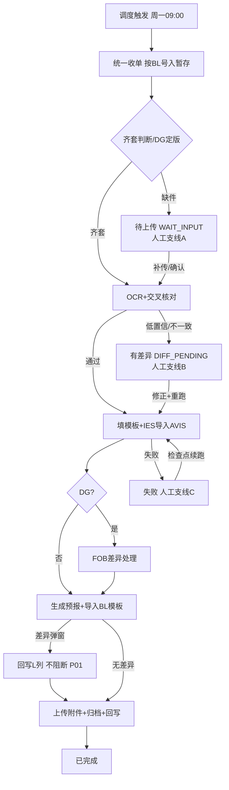

# UC34 Case 2 · GLC 线 PRD(v1.0.0)深度审查报告

| 项目 | 内容 |
|------|------|
| 审查对象 | `UC34-Case2-GLC_PRD.md` v1.0.0(2026-09-29) |
| 审查日期 | 2026-09-29 |
| 审查人 | BA(PRD Reviewer 流程) |
| 审查产出 | 本报告 + 修订版 PRD:`UC34-Case2-GLC_PRD_修订版.md`(已迭代至 v1.1.1,含实物表单核对修订) |
| 审查标准 | 开发人员仅依据 PRD 即可理解业务规则、页面行为与实现边界 |

**审查原则(全程适用)**:

1. 业务逻辑与页面设计不可分离:每条业务规则必须能映射到具体页面行为(显隐/禁用/提示/状态变化)。
2. 字段存在性原则:**每一个字段都必须能回答"为什么存在、数据从哪里来、谁使用它、它影响什么"**,不允许"为了展示而展示"。
3. 页面闭环原则:用户从哪里进入 → 做什么 → 产生什么结果 → 下一步去哪 → 数据如何变化 → 后续角色如何继续处理,必须成链。
4. 不擅自创造业务规则:原需求有歧义处统一标记 **【待确认】**,不编造。

---

# 1. PRD 问题诊断

> 严重度:**阻断** = 开发无法动手;**高** = 开发需自行假设,大概率返工;**中** = 影响完整性/一致性;**低** = 表述优化。

| 编号 | 严重度 | 所在位置 | 问题描述 | 对开发的影响 | 修订处理(v1.1.0) |
|------|--------|---------|---------|-------------|------------------|
| P01 | **阻断** | US-G05 AC2 vs 8.3 E3001 | **同一事件两种处理口径**:US-G05 说差异弹窗"回写 L 列后流程继续上传附件";E3001 说差异"捕获 → L 列 → 转人工"。开发无法判断差异后流程是继续还是中断 | IES 导入节点的主分支逻辑无法编码 | 统一为:**差异不阻断流程**——捕获回写 L 列、流程继续上传,任务终态置"有差异"待业务线下核对;E3001 语义改写,删除"转人工" |
| P02 | **阻断** | R2.1 vs 8.3 E4003 | **PDC 未命中处理冲突**:R2.1 说"未命中建 Other 文件夹、记异常、流程继续";E4003 说"PDC/ETA 缺失转人工" | 归档判断节点分支无法编码 | 以 R2.1 为准:Customer code 未命中 → Other + 异常记录,**不阻断**;E4003 拆分,PDC 部分删除;**ETA 缺失如何处理【待确认 OPEN-G5】** |
| P03 | 高 | 8.1 状态机 vs 7.3.2 筛选 chip | Task 状态与 Run 状态**映射关系未定义**;任务中心 7 个筛选 chip(全部/执行中/待人工处理/待上传/有差异/失败/已完成)与 Run 五态对应关系缺失;"待人工处理"与其他 chip 是否互斥不明 | 列表筛选与统计接口口径无法确定 | 新增 **Task-Run 状态映射表**(v1.1.0 §8.1);定义"待人工处理"= 待上传 ∪ 有差异 ∪ 失败 的聚合快捷筛选 |
| P04 | 高 | R3.2 / US-G02 E1 / 8.2 `/staging/{blNo}/resume` | **缺 AVIS 挂起票没有页面承载**:规则说"挂起,人工确认后再跑",接口有 resume,但没有任何页面说明人工在哪里确认、确认什么(继续等 AVIS / 按现有件强跑 / 标记无效)、确认后状态如何变化 | 挂起-确认-续跑闭环断裂,接口无前端入口 | v1.1.0 明确:**挂起票同样创建 Task(状态=待上传/WAIT_INPUT)**,任务详情提供"缺件处理"区,支持 补传缺失件 / 确认继续等待 / 标记无效 三操作 |
| P05 | 高 | 7.3.1 统计卡 | 工作台 4 张统计卡中"待人工处理"口径未定义(是否含待上传、有差异、失败) | 统计接口 `/api/workbench/summary` 返回结构无法定 | 定义口径:待人工处理 = 待上传 + 有差异 + 失败 合计;卡片点击带参跳转见 §5 |
| P06 | 高 | 第三部分权限矩阵 | 权限矩阵缺行:①新建任务(7.3.2 功能点 4)无角色定义;②挂起确认续跑;③归档文件下载;④邮件规则/配置中心的**查看**权限(非 ADMIN 是否可见) | 前端按钮显隐、后端鉴权无依据 | 补 4 行:新建任务=OPERATOR/MANAGER;挂起确认=OPERATOR/MANAGER;归档下载=全部角色(只读);规则/配置查看=全部角色、编辑=ADMIN |
| P07 | 高 | 第三部分"不可逆重跑/对外动作确认" | MANAGER 有"不可逆重跑/对外动作确认"权,但 GLC 场景中**哪些动作算对外/不可逆没有清单**;IES 已上传保存、预报已生成后再整单重跑的业务后果未说明 | 重跑按钮的二次确认逻辑、MANAGER 权限点落空 | 定义 GLC 对外动作清单:IES 附件已保存 / 预报已生成 后的**整单重跑**需 MANAGER 触发;节点级重跑不受限 |
| P08 | 高 | 7.3.3 字段表 | **17 项识别字段只有列举,无字段级定义**(类型/必填/来源/取值/校验/业务原因/影响);AVIS 模板 7 列、BL 模板 9 列与 17 字段的**映射关系缺失**;17 项只点名 10 项,其余 7 项未列 | OCR Schema、修正校验、模板填写逻辑全部需开发自行假设 | 新增 **§4 字段级设计**:17 字段全表 + 模板列映射表 + 大表回写时机矩阵;未点名字段按模板列反推并标注【待确认 OPEN-G6】 |
| P09 | 高 | R6 回写规则 | 大表 12 列**只有内容清单,无写入时机/触发节点/失败语义**;D/E/F 列是收单时写还是 OCR 后写不明 | 回写通道的调用点无法埋 | 新增回写时机矩阵:列 × 写入节点 × 写入值 × 失败处理(E5002 入队重试) |
| P10 | 高 | 7.3.3 节点 2 | "AVIS⇄BL 交叉核对"只有一句话:核对哪些字段、容差规则、不一致后果均未定义 | OCR 节点的核心质量逻辑无法编码 | 新增交叉核对规则表:核对字段(Container No./Seal/VOL/Load 等)、不一致 → 字段质量等级降级 + 任务置"有差异"待人工 |
| P11 | 中 | R1.3 / RSK-G4 | **DG 判定时机矛盾**:R1.3 收单时"命中 Shipper 即判 DG 写 M 列",但 Shipper 可能晚到,当轮误判非 DG 后已按非 DG 走完 IES 导入,纠正路径只说"人工修正后重跑",而 DG 标识是否在可修正字段内未明确 | DG 分支触发点、M 列写入时机、误判纠正流无法落地 | DG 判定**在齐套判断节点定版**(收单时仅登记);DG 标识列入 17 项可修正字段;误判纠正 = 修正 DG 标识 → 整单重跑 → 走 DG 分支 |
| P12 | 中 | 7.3.2 功能点 4 | "新建任务:选择 GLC 线路手动建票"仅一句:输入什么(BL 号?附件?)、是否要求 AVIS 已收、走哪条流程、与调度去重关系均未定义 | 新建任务表单与后端校验无法设计 | 补交互定义:输入 BL 号 + 必传 AVIS(可选 BL/Shipper)→ 校验 BL 号格式与重复 → 建 Task + R#1 从节点 2 起走 |
| P13 | 中 | 7.3.2 功能点 3 | 导出 CSV 的字段范围、是否含修正留痕、导出走哪个数据视图未定义 | 导出接口出参无法定 | 定义导出字段 = 任务中心列表列 + 最近 Run 状态/耗时;不含修正明细(修正留痕查任务详情) |
| P14 | 中 | 7.3.6 归档浏览 | 文件抽屉"下载/复制路径"的角色范围未定义;页面是平台内嵌浏览还是跳 SharePoint 不明 | 前端实现方式与权限点不明 | 明确:平台内嵌只读浏览,全部角色可看可下载;不提供编辑/删除/上传 |
| P15 | 中 | 7.3.5 "即时生效" | 对应表/模板"即时生效"与**执行中 Run 的一致性**未定义:Run 中途改配置,用旧值还是新值 | 配置读取时机(快照 or 实时)影响执行正确性 | 建议:**Run 启动时快照**本次执行用的模板版本与对应表版本,Run 内不变;新 Run 用最新版。【待确认 OPEN-G7】 |
| P16 | 中 | 8.3 错误码 | 错误码只有含义,**无页面提示文案与出现入口映射** | 前端异常提示各自发挥,验收无依据 | v1.1.0 各页面交互补"异常提示";错误码表补"触发入口/页面文案"两列 |
| P17 | 中 | 全文 | **平台能力未做复用/扩展/新增判断**:OCR、规则引擎、调度、WORM、Alice、回写通道、暂存库、IES 通道哪些现成、哪些要新建,全文无结论 | 开发工作量评估与技术方案无边界 | 新增 **§6 平台能力分析** → 落入 v1.1.0 |
| P18 | 中 | 2.2 / 9 | **每周票数量级未给出**,性能指标(<2h、万级分页)无业务依据 | 批量调度与资源估算无输入 | 【待确认 OPEN-G8】请业务提供周票量与峰值 |
| P19 | 中 | US-G04 vs 7.3.2 chip | "待上传"语义两处混用:chip"待上传(缺件)"指 WAIT_INPUT;US-G04 差异票头部也有"上传文件"按钮,易被理解为同一状态 | 状态命名冲突,筛选与详情页口径打架 | 统一:状态"待上传"仅指缺件 WAIT_INPUT;差异票头部按钮改为"补传/重新上传文件",语义为修正材料而非状态 |
| P20 | 低 | US-G04 E1 | "修正值格式非法"无各字段格式规则 | 行内修正校验规则无法写 | 字段级设计表补"取值/校验"列(日期格式、数值、枚举、BL 号正则等) |
| P21 | 低 | 7.3.3 功能点 7 | "兄弟任务、15 天热力图"业务价值未说明(违反字段存在性原则) | 可能被当作纯 UI 装饰砍掉或做错 | 补说明:兄弟任务用于跨周归并追溯(同 BL 的 AVIS 票与 BL 票互查);热力图用于观察调度稳定性 |
| P22 | 低 | R5.5 | 只写"AVIS 类别选 Other",Shipper/BL 上传类别未写 | IES 上传参数不完整 | 【待确认 OPEN-G9】Shipper/BL 在 IES 的上传类别 |
| P23 | 低 | R6 "平台台账为主,双写" | "平台台账"的用户可见视图未指明 | 台账视图与任务中心关系不明 | 明确:任务中心列表即平台台账视图;大表为线下协作视图,平台向其回写 |

**诊断小结**:v1.0.0 骨架完整(角色/规则/流程/接口/错误码齐备),但存在 **2 处阻断级口径冲突(P01/P02)** 与 **7 处高严重度缺口**(状态映射、挂起确认、权限缺行、字段级设计、回写时机、交叉核对、对外动作清单),均在 v1.1.0 中修订或显式标记【待确认】。

---

# 2. 业务流程梳理

## 2.1 主流程(自动线)

| # | 角色 | 触发条件 | 操作 | 系统处理 | 数据变化 | 状态变化 | 下一步 |
|---|------|---------|------|---------|---------|---------|--------|
| 1 | 调度器 | 每周一 09:00(可配置) | 触发 GLC 批量 | 锁定数据窗口=上周一至周日 | 生成本轮 BatchId | — | 2 |
| 2 | 平台 | 批量触发 | 按 R-GLC-AVIS/SHIPPER/BL 扫公邮 | 主题分类;附件按 BL 号归一入暂存库;同 BL 保留最新版 | AttachmentLedger +N(pending);E 列记 AVIS No.;M 列登记 Shipper 命中 | — | 3 |
| 3 | 平台 | 收单完成 | 按 BL 号跨周归并,逐票建 Task+R#1 | Customer code→PDC 映射(未命中→Other+异常记录,不阻断);齐套判断(AVIS+BL,DG 另需 Shipper);**DG 判定在此定版(P11)** | Task/R#1/NodeExecution 创建 | 齐套→执行中;缺件→**待上传(WAIT_INPUT)** | 4 / 支线 A |
| 4 | 平台 | 齐套 | OCR 识别(AVIS+BL,17 字段)+ AVIS⇄BL 交叉核对 | 低置信/核对不一致字段金色标记(规则见 §4.5) | FieldResult 写入;回写 D/F 列 | 不一致→有差异(DIFF_PENDING);无→继续 | 5 / 支线 B |
| 5 | 平台 | OCR 通过 | 填 AVIS 模板(7 列)/BL 模板(9 列);查 MBZ;IES 批量导入 AVIS,绿灯后上传 | 模板按 Run 快照版本填写(P15) | 回写 G 列 | 失败→失败(FAILED) | 6(DG 票先 5a) |
| 5a | 平台 | DG 票 | invoice 级导出→FOB 差异公式→核对发票 PDF→FOB 填 Others 保存 | 不一致以 IES 导出值为准并记录;未找到 PDF 按差异值填并记录 | 异常记录;发票修改留痕 | 导出异常→失败转人工 | 6 |
| 6 | 平台 | AVIS 导入完成 | 生成预报(港口经 IES Port 表)→集装箱信息导入 BL 模板 | 差异弹窗**完整捕获** | **回写 L 列(差异不阻断,P01)** | 有差异→任务标记有差异,流程继续 | 7 |
| 7 | 平台 | 导入完成 | 上传 AVIS(类别 Other)/Shipper(DG)/BL 附件并保存;按 PDC/GLC/运行周归档 | 归档文件夹命名含 DG 后缀 | 回写 H/K/N=Y、J 列;台账生成 | →已完成(SUCCEEDED) | 结束 |
| — | 平台 | 任意节点异常 | 记异常反馈(P 列)+ 站内提醒 + 审计 | 证据(trigger/process/operation)WORM 落盘 | WritebackRecord/AuditLog | →对应异常态 | 人工支线 |

## 2.2 人工支线(异常闭环)

| 支线 | 入口 | 角色 | 操作 | 系统处理 | 状态变化 | 下一步 |
|------|------|------|------|---------|---------|--------|
| A 缺件处理(含缺 AVIS 挂起票,P04) | 提醒 / 任务中心 chip"待上传" → 任务详情 | OPERATOR/MANAGER | ①补传缺失附件 ②确认继续等待 ③标记无效(必填原因) | ①补传件入暂存校验→自动续跑 ②保持挂起至下轮归并 ③任务关闭留痕 | 待上传→执行中 / 不变 / 已关闭 | 主流程对应检查点 |
| B 差异修正 | 提醒 / chip"有差异" → 任务详情 → 横幅定位 | OPERATOR | 对照 PDF 原文行内修正(留痕)→ 节点/整单重跑 | 修正写当前生效版本;重跑生成 R#N+1 携带修正值 | 有差异→执行中 | 主流程节点 5 起 |
| C 失败重跑 | 任务中心 / 任务详情 | OPERATOR(节点级);MANAGER(对外动作后整单重跑,P07) | 检查点续跑 / 整单重跑 / 批量重跑 | 去重防重;执行中跳过 | 失败→执行中 | 对应检查点 |
| D 无 PDC 配置 | 任务详情异常记录 | ADMIN | 维护 PDC 对应表;(可选)OPERATOR 重跑改归档位置 | 新配置对**新 Run** 生效(P15 快照) | 不阻断,任务可已完成 | 配置中心 |



---

# 3. 页面逻辑梳理

> 每页回答:页面目标 / 使用角色 / 进入条件 / 内容与字段(含业务含义)/ 操作与条件 / 系统反馈 / 状态变化 / 下一步。字段级明细见 §4,页面跳转见 §5。

## 3.1 工作台(F-G01)

- **页面目标**:让业务在 10 秒内判断"本周 GLC 有没有要我处理的票"——它是异常分拣入口,不是报表页。
- **角色**:全部(AUDITOR 只读)。
- **进入条件**:登录默认页;侧栏"工作台"。
- **内容与字段**:

| 元素 | 业务含义(为什么存在) | 数据来源 |
|------|---------------------|---------|
| 总任务数卡 | 本周票量基线;骤降为 0 可早期发现公邮接入故障 | Task 按 case-2-glc + 本周 BatchId 计数 |
| 已完成卡 | 自动化成效直观呈现(KPI 自动化率分子) | 最新 Run=SUCCEEDED 计数 |
| 执行中卡 | 告知"还有票在跑",避免重复人工干预 | 最新 Run=PENDING/RUNNING 计数 |
| 待人工处理卡 | **核心入口**,聚合 待上传+有差异+失败(P05 口径),承载"业务只看异常"愿景 | 三态合计 |

- **操作**:点击卡片 → 带参跳任务中心(§5 J1~J4)。
- **异常**:统计接口失败 → 卡片显示 "--" + 重试图标,不阻断导航。
- **下一步**:任务中心。

## 3.2 任务中心(F-G02)

- **页面目标**:GLC 票统一台账视图(即"平台台账",P23)+ 批量处置入口。
- **角色**:全部;新建/重跑=OPERATOR/MANAGER,导出=MANAGER,AUDITOR 全只读。
- **进入条件**:工作台卡片带参 / 侧栏 / 提醒跳入(带 taskId)。
- **列表字段**(逐列业务原因见 §4.4):任务编号、case、触发来源、状态、执行次数、最近执行开始、当前环节。
- **筛选 chip 与状态映射(P03 修订)**:

| chip | 对应最新 Run 状态 | 说明 |
|------|------------------|------|
| 执行中 | PENDING / RUNNING | |
| 待人工处理(聚合) | WAIT_INPUT ∪ DIFF_PENDING ∪ FAILED | 快捷筛选,与其他 chip 不互斥(P05) |
| 待上传 | WAIT_INPUT | 缺件(含缺 AVIS 挂起票,P04) |
| 有差异 | DIFF_PENDING | OCR 核对不一致 / IES 差异已回写 L 列 |
| 失败 | FAILED | |
| 已完成 | SUCCEEDED | |

- **操作与条件**:

| 操作 | 角色 | 条件 | 系统反馈 | 状态变化 |
|------|------|------|---------|---------|
| 新建任务(P12) | OPERATOR/MANAGER | BL 号必填(格式【待确认 OPEN-G10】)+ 必传 AVIS、可选 BL/Shipper;BL 号已存在时提示并跳已有任务 | 建 Task+R#1,从节点 2 起跑 | 无→执行中 |
| 批量重跑 | OPERATOR/MANAGER | 勾选票非执行中;执行中自动跳过并 toast 说明 | 逐票生成 R#N+1 | 异常态→执行中 |
| 导出 CSV(P13) | MANAGER | 当前筛选结果 | 下载;字段=列表列+最近 Run 状态/耗时,不含修正明细 | 不变 |
| 行点击 | 全部 | — | 跳任务详情(当前生效 Run) | 不变 |

- **异常提示**:重跑失败 → toast 错误码+原因(E5001/E4002);列表加载失败 → 空态+重试。

## 3.3 任务详情(F-G03/G04/G05)

- **页面目标**:单票全生命周期"处置台"——核对、修正、补件、重跑、取证一页完成(承载"异常票单票人工耗时 ≤5 分钟"指标)。
- **角色**:全部;修正仅 OPERATOR;对外动作后整单重跑需 MANAGER(P07);AUDITOR 只读+证据可查。
- **进入条件**:任务中心行点击 / 提醒点击(带 taskId)/ 兄弟任务互链。
- **页面分区 × 状态差异**:

| 分区 | 待上传(WAIT_INPUT) | 有差异(DIFF_PENDING) | 失败(FAILED) | 已完成(SUCCEEDED) |
|------|--------------------|---------------------|-------------|------------------|
| 头部操作 | 「补传文件」「确认继续等待」「标记无效」 | 「定位差异」「整单重跑」 | 「检查点续跑」「整单重跑」 | 「整单重跑」(仅 MANAGER,P07) |
| 横幅 | 缺件横幅:列缺失附件角色(avis/bl/shipper) | 差异横幅:一键定位金色字段 | 失败横幅:失败节点+错误码 | 无 |
| 节点轨迹(7 节点) | 挂起节点标灰"等待输入" | 差异节点标金 | 失败节点标红,显示检查点 | 全绿 |
| 当前识别数据 | 只读 | 可行内修正(OPERATOR) | 只读 | 只读 |
| 证据区 | 可见 | 可见 | 可见 | 可见 |

- **缺件处理区(P04 新增)**:列出缺失附件角色 →「补传文件」上传(校验类型/大小/BL 号一致性)→ 上传成功自动触发续跑;「确认继续等待」二次确认后保持挂起(下轮调度继续归并);「标记无效」必填原因 → 任务关闭(终态,留痕,仅 MANAGER 可撤销【待确认 OPEN-G11】)。
- **字段修正(US-G04)**:行内编辑 → 格式校验(§4 取值列)→ 保存记录 修正人/时间/原值/新值 → 仅留痕不审批;非 OPERATOR 无入口(E5001)。
- **Run 切换**:R#1、R#2…历史只读;仅当前生效 Run 可修正/重跑。
- **兄弟任务/热力图(P21)**:兄弟任务=同 BL 号跨周归并的相关票(AVIS 票与 BL 票互查,支撑 2~3 周时差追溯);15 天热力图=该 case 每日执行密度,用于观察调度稳定性。
- **异常提示**:修正格式非法 → 行内红字阻断(E 类文案见 v1.1.0 §8.3);补传校验失败 → 提示原因;续跑失败 → toast E3002。

## 3.4 邮件中心 + 规则编辑器(F-G06/G07)

- **页面目标**:让 ADMIN 不改代码即可调整 GLC 收单口径(三条规则),并通过 dry-run 在发布前自证规则正确。
- **角色**:查看=全部(P06);编辑/发布/启停/dry-run=ADMIN。
- **进入条件**:侧栏"邮件中心"→ 规则行「编辑」。
- **内容**:规则列表(规则名/监听邮箱/优先级/绑定流程/累计命中/启停);编辑器三段式(筛选条件段 / 附件要求段 / 流程绑定段)。
- **操作与条件**:

| 操作 | 条件 | 系统反馈 | 状态变化 |
|------|------|---------|---------|
| 保存规则 | 正则合法 + 必需附件角色齐备 | 校验失败阻断(E1001)并定位错误段 | 版本+1 |
| dry-run | 已有样本邮件 | 展示命中/未命中原因,不产生任务(E1002 样本不可用时提示) | 不变 |
| 启停 | — | 即时生效;停用后新邮件不再匹配,**不影响已建任务** | 不变 |

- **GLC 预置三条规则**(维持 v1.0.0):R-GLC-AVIS / R-GLC-SHIPPER(DG 判定要素)/ R-GLC-BL。
- **异常提示**:E1001 保存阻断红字定位;E1002 toast。

## 3.5 配置中心(F-G08)

- **页面目标**:GLC 模板与对应表的版本化维护,业务变更免发版。
- **角色**:查看=全部;维护=ADMIN。
- **内容**:AVIS 模板(7 列)/ BL 模板(9 列)/ IES Port 对应表 / PDC-Customer Code 对应表 / 调度配置。
- **操作与条件**:上传模板(扩展名+≤20MB 校验,E2001;版本不兼容阻断 E2002)→ 版本+1,历史可查;对应表在线编辑即时生效——**生效语义:对保存后新建的 Run 生效,执行中 Run 用启动时快照(P15,OPEN-G7)**;调度时间修改对下次触发生效。
- **异常提示**:E2001/E2002 上传区红字;对应表键重复 → 行内阻断。

## 3.6 归档浏览(F-G09)

- **页面目标**:审计与业务自查时按目录找到任一票的归档证据(对应合规价值)。
- **角色**:全部(P06/P14);**只读**:浏览/搜索/下载/复制路径,无编辑/删除/上传。
- **进入条件**:侧栏"Share Point";或任务详情证据区"查看归档位置"带路径跳入。
- **内容**:目录树 `<归档根>\<PDC>\GLC\<运行周>\<票文件夹>` + 面包屑 + 目录内搜索;文件列表(名称/修改日期/类型/大小);文件抽屉(元信息+下载/复制路径)。
- **异常**:归档根不可达 → 空态提示联系 ADMIN(配置项检查)。

## 3.7 平台引用页(F-G10)

- 提醒中心:成功/异常自动生成站内提醒,点击跳任务详情(带 taskId);不外发邮件。
- 治理运营台:DAG 监控、审计日志、证据总量(WORM)——ADMIN/AUDITOR。
- 权限中心:四角色只读查询;身份与授权由 Alice 管理,平台不自建用户体系。
- 上传中心:GLC 线空态预留。

---

# 4. 字段级设计

> 核心原则:**每个字段都必须能回答"为什么存在、数据从哪里来、谁使用它、它影响什么"。**

## 4.1 识别字段(17 项,任务详情"当前识别数据"区)

> v1.0.0 仅点名 10 项;F-11~F-17 按 AVIS/BL 模板列反推补全,标注 **【待确认 OPEN-G6】** 以供应商 OCR Schema 终稿为准。所有字段均为 Run 级数据,修正仅 OPERATOR、仅当前生效 Run、留痕不审批。

| # | 字段 | 类型 | 必填 | 来源 | 可编辑 | 取值/校验 | 业务原因(为什么存在) | 影响(它改变什么) |
|---|------|------|:---:|------|:---:|---------|---------------------|------------------|
| F-01 | AVIS No.(Shippers Ref) | 文本 | 是 | AVIS PDF(OCR) | ✓ | 非空 | 票的身份标识之一;回写大表 E 列;归档文件夹名前段 | E 列回写、文件夹命名、与 BL 票归并的辅助键 |
| F-02 | Customer code | 文本 | 是 | AVIS PDF(OCR) | ✓ | 非空 | PDC 映射的输入键——决定票归档到哪个仓 | PDC 字段值;未命中→Other+异常记录(R2.1) |
| F-03 | PDC | 文本 | 是 | 规则(F-02 查对应表) | ✗(改 F-02 重算) | 对应表值域 ∪ Other | 归档目录层级;业务按仓分工的口径 | 归档路径 `<PDC>\GLC\...` |
| F-04 | AWB/B/L No. | 文本 | 是 | BL PDF(OCR) | ✓ | 数字串;系统自动补 "OOLU" 前缀 | IES 登记的提单号;票粒度主键(BL 号归一) | Task 编号 T-BL号、暂存归并键、去重键 |
| F-05 | Port (Arrival) | 文本 | 是 | AVIS PDF(OCR) | ✓ | 英文港口名 | 回写大表 D 列"Arrival";预报到港 | D 列回写、预报内容 |
| F-06 | Departure | 文本 | 是 | BL PDF(OCR) | ✓ | 英文港口名 | 预报起运港;经 IES Port 表转换 | 预报内容 |
| F-07 | ETA Date | 日期 | 是 | AVIS PDF "Estimated date of arrival"(OCR) | ✓ | 日期;展示 YYYY.MM.DD | 回写 F 列;归档文件夹名 "ETA YYYY.MM.DD" 段 | F 列回写、文件夹命名;**缺失处理【待确认 OPEN-G5】** |
| F-08 | Arrival Date | 日期 | 是 | AVIS PDF "Arrival"(OCR) | ✓ | 日期 | 回写大表 D 列(实际到港) | D 列回写 |
| F-09 | Vessel Name / Voyage(船名航次) | 文本 | 是 | BL PDF(OCR) | ✓ | 非空 | 预报时**直接 COPY**(R4.3),不做转换 | 预报内容 |
| F-10 | DG 标识 | 布尔 | 是 | 规则(齐套时是否归并到 Shipper,P11) | ✓ | Y/N | DG 分支总开关;M 列回写;文件夹 DG 后缀 | 走不走 FOB Charges 分支(节点 5a)、命名后缀、Shipper 上传 |
| F-11 | Container No.【待确认】 | 文本 | 是 | BL/AVIS(OCR) | ✓ | 箱号格式(4 字母+7 位)【待确认】 | AVIS 模板第 3 列、BL 模板第 4 列;交叉核对字段 | 两张模板填写、IES 导入 |
| F-12 | Container Type【待确认】 | 文本 | 是 | BL/AVIS(OCR) | ✓ | 单位由 `"` 改 `'`(R4.2) | AVIS 模板第 4 列、BL 模板第 5 列 | 模板填写 |
| F-13 | Seal Number【待确认】 | 文本 | 是 | BL/AVIS(OCR) | ✓ | 非空 | AVIS 模板第 5 列、BL 模板第 6 列;交叉核对字段 | 模板填写 |
| F-14 | Container VOL (m³)【待确认】 | 数值 | 是 | BL/AVIS(OCR) | ✓ | ≥0 数值 | AVIS 模板第 6 列、BL 模板第 9 列;交叉核对(容差见 §4.5) | 模板填写 |
| F-15 | Container Load (KG)【待确认】 | 数值 | 是 | BL/AVIS(OCR) | ✓ | ≥0 数值 | AVIS 模板第 7 列、BL 模板第 8 列;交叉核对 | 模板填写 |
| F-16 | Package Qty【待确认】 | 数值 | 是 | BL(OCR) | ✓ | ≥1 整数 | BL 模板第 7 列 | BL 模板填写 |
| F-17 | MBZ(发票查询号)【待确认】 | 文本 | 是 | IES 查询(节点 5) | ✗ | 非空 | 导入 AVIS 前的发票查询输入(R5.1) | 节点 5 发票信息查询 |

**字段间依赖关系**(开发必须实现):

- F-02 → F-03:Customer code 变更 → PDC 自动重算;重算结果变化 → 归档路径变化(仅对新 Run 生效)。
- F-04 是 F-01 的归并伙伴:暂存库以 F-04(BL 号归一)为主键,F-01(AVIS No.)辅助校验。
- F-10=DG → 节点 5a 必走;F-10 修正为 Y → 重跑时补走 5a;修正为 N → 跳过 5a。
- F-11/F-13/F-14/F-15 为 AVIS⇄BL 交叉核对字段(§4.5):任一不一致 → 该字段质量等级降级 + 任务置"有差异"。
- F-07/F-08 → 大表 F/D 列;F-05 → 大表 D 列语义补充【待确认:D 列取 Arrival 还是 Port(Arrival),v1.0.0 R4.1 写"Arrival 填 D 列"按日期理解,见 OPEN-G12】。

## 4.2 AVIS 导入模板(7 列)字段映射

| 模板列 | 取值来源 | 说明 |
|--------|---------|------|
| AVIS/Shipping Log No. | F-01 | 票标识 |
| MBZ/BOL | F-17 / F-04 | 发票查询号或提单号(IES 匹配键) |
| Container No. | F-11 | |
| Container Type | F-12 | 单位 `'` |
| Seal Number | F-13 | |
| Container VOL (m³) | F-14 | |
| Container Load (KG) | F-15 | |

## 4.3 BL 导入模板(9 列)字段映射

| 模板列 | 取值来源 | 说明 |
|--------|---------|------|
| No. | 序号(系统生成) | 行号 |
| Shipping log No./AVIS No. | F-01 | 与 AVIS 模板关联键 |
| HAWB/BL No. | F-04(含 OOLU 前缀) | |
| Container No. | F-11 | |
| Container Type | F-12 | 单位 `'` |
| Seal No. | F-13 | |
| Package Qty | F-16 | |
| Container Load (KG) | F-15 | |
| Container VOL (m³) | F-14 | |

## 4.4 任务中心列表字段(逐列业务原因)

| 列 | 类型 | 来源 | 业务原因 | 影响 |
|----|------|------|---------|------|
| 任务编号(T-BL号) | 文本 | 系统生成 | 票的唯一锚点,沟通与检索口径 | 点击进详情 |
| case | 枚举 | Task.caseId | GLC/MBUSI 多线共存时的区分 | 筛选 |
| 触发来源 | 枚举 | Task | 区分 定时调度/手动创建/手动触发,用于自动化率统计口径 | 筛选、KPI |
| 状态(当前执行) | 枚举 | 最新 Run 状态映射(§3.2) | **异常分拣核心**,决定该票要不要人管 | chip 筛选、统计卡 |
| 执行次数 | 数值 | Task.RunCount | 识别"反复失败的票"(≥3 次需重点关注) | 排序参考 |
| 最近执行开始 | 时间 | 最新 Run | 判断处理时效 | 排序 |
| 当前环节 | 文本 | 最新 Run 当前节点 | 不进详情即可定位票卡在哪 | 展示 |

## 4.5 AVIS⇄BL 交叉核对规则(P10 新增)

| 核对字段 | 规则 | 不一致后果 |
|---------|------|-----------|
| Container No.(F-11) | 完全一致 | 字段质量等级降为"差"(金色)+ 任务置"有差异",**不自动继续 IES 导入**,待人工修正或确认 |
| Seal Number(F-13) | 完全一致 | 同上 |
| Container VOL(F-14) | 数值容差 ±0.5 m³【待确认 OPEN-G13】 | 同上 |
| Container Load(F-15) | 数值容差 ±50 KG【待确认 OPEN-G13】 | 同上 |
| BL No.(F-04) | 归一后一致(OOLU 前缀归一) | 无法归并 → 按缺件处理(WAIT_INPUT) |

## 4.6 大表回写时机矩阵(P09 新增)

| 列 | 内容 | 写入节点 | 写入值来源 | 失败处理 |
|----|------|---------|-----------|---------|
| E | AVIS No. | 节点 1 收单 | F-01 | E5002 入队重试+告警 |
| M | DG 标记 | 节点 3 齐套判断(P11:定版在齐套,非收单) | F-10 | 同上 |
| D | Arrival | 节点 4 OCR 完成 | F-08(日期,OPEN-G12) | 同上 |
| F | ETA | 节点 4 OCR 完成 | F-07 | 同上 |
| G | AVIS 上传成功 | 节点 5 绿灯上传后 | 固定成功标记 | 同上 |
| L | BL different | 节点 6 差异弹窗捕获后(P01:回写后继续) | 弹窗字段级明细(接口值 vs 提单值) | 同上 |
| H/K/N | 三类 PDF 上传成功=Y | 节点 7 各类上传成功后 | 成功标记;**列与文件对应关系【待确认 OPEN-G14】**(推断 H=AVIS、K=Shipper、N=BL) | 同上 |
| J | BL Creation | 节点 7 本票全部完成 | 完成标记 | 同上 |
| P | 异常情况反馈 | 任意节点异常时 | 异常描述(如"未找到对应 AVIS,请确认是否漏发""未找到 xxx 发票") | 同上 |

**重跑时的回写语义**:重跑对同一 BL 的同一列执行**覆盖写**(以最新 Run 结果为准),不产生重复行(R7.1)。

---

# 5. 页面之间的业务关系

## 5.1 跳转链路总览

```
工作台 ──J1~J4──> 任务中心 ──J5──> 任务详情 ──J6──> 任务详情(新 Run,自循环)
                      ▲               │J7 补传/确认续跑        │J8 查看归档
                      │               ▼                        ▼
提醒中心 ──J9─────────┘         (系统续跑,状态变化)      归档浏览(Share Point)
邮件中心 ──J10──> 规则编辑器(dry-run)──J11──> 邮件中心
任务详情(异常记录:PDC 未命中)──J12──> 配置中心(对应表维护)
```

## 5.2 跳转明细表

| 编号 | 从 | 操作 | 到 | 携带数据 | 状态/权限变化 | 用户下一步 |
|------|----|------|----|---------|--------------|-----------|
| J1 | 工作台 | 点"总任务数"卡 | 任务中心 | `line=glc` | 无 | 浏览全量票 |
| J2 | 工作台 | 点"已完成"卡 | 任务中心 | `line=glc&status=succeeded` | 无 | 抽查完成票 |
| J3 | 工作台 | 点"执行中"卡 | 任务中心 | `line=glc&status=running` | 无 | 观察进度 |
| J4 | 工作台 | 点"待人工处理"卡 | 任务中心 | `line=glc&status=manual`(=待上传∪有差异∪失败,P05) | 无 | **处置异常票(主路径)** |
| J5 | 任务中心 | 行点击 | 任务详情 | taskId(默认当前生效 Run) | 无 | 核对/修正/重跑 |
| J6 | 任务详情 | 重跑(整单/节点/批量) | 任务详情 | 新 R#N+1 | 异常态→执行中;历史 Run 变只读 | 观察新 Run 节点轨迹 |
| J7 | 任务详情 | 补传/确认继续等待/标记无效 | 任务详情 | 补传附件 / 确认记录 | 待上传→执行中 / 不变 / 已关闭 | 观察续跑或离开 |
| J8 | 任务详情 | "查看归档位置" | 归档浏览 | 归档路径(票文件夹) | 无(只读) | 下载/核对原件 |
| J9 | 提醒中心 | 点提醒 | 任务详情 | taskId + RunId | 提醒置已读 | 处置异常 |
| J10 | 邮件中心 | 规则行"编辑" | 规则编辑器 | ruleId | 进入编辑态(ADMIN) | 修改/dry-run |
| J11 | 规则编辑器 | 保存/dry-run 后返回 | 邮件中心 | 规则版本+1 | 对新邮件生效;执行中 Run 快照不受影响(P15) | 观察下轮命中 |
| J12 | 任务详情 | 异常记录"PDC 未命中"→ 去维护 | 配置中心 | 定位 PDC-Customer Code 表 | 配置对新 Run 生效 | 补配置后可重跑改归档 |

## 5.3 业务闭环验证(完整链路)

调度触发 → 任务中心出现新票 → (异常)提醒 → J9 任务详情 → J7/J6 处置 → 新 Run → 已完成 → J8 归档可查 → 大表回写完成。**闭环成立**;v1.0.0 中断裂的"缺 AVIS 挂起确认"环路由 J7 补齐(P04)。

---

# 6. 平台能力分析(P17 新增)

| 需求 | 所需平台能力 | 现有能力 | 是否满足 | 差距 | 需要新增/改造 |
|------|-------------|---------|:---:|------|--------------|
| 每周定时触发 | 调度器(cron 可配置) | 平台调度(US-G01 已有"调度可配置") | 复用 | 需支持"手动补跑同窗口去重" | 配置项 + 补跑入口(小改造) |
| 公邮监听分类 | 邮件规则引擎 | 邮件中心规则引擎(白名单/关键词/附件角色/dry-run 已设计) | 复用+配置 | GLC 三条规则预置数据 | 配置初始化(OPEN-G2 同类) |
| 附件暂存与跨周归并 | 暂存库 + 附件台账 | 已有 AttachmentLedger/StagingFile 设计 | 复用 | "保留最新版"覆盖策略需确认实现 | 小改造 |
| PDF 字段识别 | OCR + 字段 Schema | 平台 OCR(17 字段、置信度、质量等级已在原型) | 复用 | GLC 的 17 字段 Schema 与交叉核对规则(§4.5)需建模 | **新增**:GLC OCR Schema + 核对规则配置 |
| AVIS⇄BL 交叉核对 | 字段级比对引擎 | 无明确现有能力 | **新增** | 容差规则、质量降级、DIFF_PENDING 置位 | **新增能力**,影响节点 4 与任务详情 |
| IES+ 交互 | RPA/UI 自动化或接口通道 | 技术选型留待概要设计(v1.0.0 范围外) | 待选型 | I1~I7 七项能力要求已列;**差异弹窗完整捕获(I6)是硬性要求** | **新增**(概要设计决策项) |
| FOB 差异计算 | 公式引擎 | 无 | **新增** | 公式固定(R5.2),可硬编码为规则配置 | **新增**(小) |
| 大表回写 | 回写通道 + 队列重试 | E5002 已设计"入队重试+告警" | 复用+扩展 | §4.6 时机矩阵的埋点 | 扩展 |
| 文件归档 | SharePoint/T 盘写入 | 归档根为配置项 | 复用+配置 | 目录创建、命名规则(R2.2)实现 | 配置+小改造 |
| 证据留痕 | WORM 存储 + hash | 平台证据体系(trigger/process/operation,R8.3) | 复用 | GLC 各节点证据类型接入 | 配置 |
| 身份与权限 | RBAC 四角色 | Alice 管理,权限中心只读 | 复用 | P06 补充的权限点需登记到 Alice | 配置(权限点清单同步 Alice)【待确认 OPEN-G15】 |
| 站内提醒 | 提醒中心 | 已有(成功/异常提醒) | 复用 | GLC 提醒模板(缺件/差异/失败/完成) | 配置 |
| 状态机与重跑 | Task/Run/检查点 | 已有(Run 不可变、R#N+1、检查点续跑) | 复用 | GLC 7 节点编排注册 | 配置 |
| 配置版本快照 | 配置中心版本化 | 模板版本化已有 | 扩展 | **Run 启动快照语义(P15)需实现** | 扩展(OPEN-G7) |

**结论**:平台底座(调度/规则引擎/暂存/OCR/证据/提醒/RBAC)均可复用;**需新增的能力集中在 3 处**:①AVIS⇄BL 交叉核对规则引擎(节点 4);②IES+ 交互通道(概要设计选型,I1~I7);③FOB 公式计算(小)。另有 2 处扩展:回写埋点、配置快照语义。

---

# 7. 修订落点与遗留待确认

## 7.1 修订落点(→ v1.1.0)

| 诊断编号 | 落入 v1.1.0 章节 |
|---------|------------------|
| P01 | US-G05 修订 + R5.4 + 错误码 E3001 改写 |
| P02 | R2.1 维持 + E4003 拆分 + OPEN-G5 |
| P03/P05 | §8.1 状态映射表 + 7.3.1/7.3.2 口径定义 |
| P04 | R3.3 新增 + 7.3.3 缺件处理区 + US-G02 E1 修订 |
| P06 | 第三部分权限矩阵补 4 行 |
| P07 | 第三部分"对外动作清单"+ R7.4 新增 |
| P08/P20 | 新增第八部分"字段级设计"(本文 §4 落入) |
| P09 | R6 改回写时机矩阵 |
| P10 | R4.5 新增交叉核对规则 |
| P11 | R1.3 修订(收单仅登记)+ R3.4 DG 定版 + F-10 可修正 |
| P12/P13 | 7.3.2 交互补全 |
| P14 | 7.3.6 修订(只读+全角色) |
| P15 | R4.4 修订 + OPEN-G7 |
| P16 | §8.3 错误码表补列 |
| P17 | 新增第九部分"平台能力分析" |
| P19 | 状态命名统一(7.3.2/US-G04) |
| P21 | 7.3.3 功能点 7 补说明 |
| P22 | OPEN-G9 |
| P23 | R6 注记 |

## 7.2 遗留待确认汇总(v1.1.0 第十一部分同步)

| 编号 | 问题 | 来源 |
|------|------|------|
| OPEN-G1~G4 | 沿用 v1.0.0(指标值/PDC 初始数据/模板终稿/测试环境) | 原 PRD |
| OPEN-G5 | ETA(F-07)缺失时:挂起转人工 or 用 Arrival 兜底 or 文件夹省略 ETA 段? | P02 |
| OPEN-G6 | 17 字段中 F-11~F-17 以供应商 OCR Schema 终稿确认 | P08 |
| OPEN-G7 | 配置生效语义:Run 启动快照(建议)or 实时读取 | P15 |
| OPEN-G8 | GLC 线每周票数量级与峰值(性能指标依据) | P18 |
| OPEN-G9 | Shipper/BL 在 IES 的上传类别(AVIS=Other 已确认) | P22 |
| OPEN-G10 | 手动新建任务的 BL 号格式校验规则 | P12 |
| OPEN-G11 | "标记无效"是否允许撤销、谁可撤销(建议仅 MANAGER) | §3.3 |
| OPEN-G12 | 大表 D 列取 Arrival 日期(F-08)还是 Port(Arrival)(F-05) | §4.1 |
| OPEN-G13 | 交叉核对数值容差(建议 VOL ±0.5m³、Load ±50KG) | §4.5 |
| OPEN-G14 | 大表 H/K/N 列与 AVIS/Shipper/BL 的对应关系(推断 H=AVIS、K=Shipper、N=BL) | §4.6 |
| OPEN-G15 | P06 新增权限点需同步 Alice 登记 | §6 |

---

**报告结束**。修订版完整 PRD 见 `UC34-Case2-GLC_PRD_修订版.md`(2026-09-30 已按实物表单核对迭代至 v1.1.1)。
