# MBPTS UC34 Case 2 · MBUSI 线:美线(CMA CGM)Shipping Log / BL 自动化 — 产品需求文档

## 文档信息

| 项目 | 内容 |
|------|------|
| **文档名称** | UC34 Case 2 · MBUSI 线Shipping Log/BL 自动化 PRD |
| **版本** | v1.0.0 |
| **创建日期** | 2026-09-29 |
| **最后更新** | 2026-10-08 |
| **负责人** | BA(SCM-IE / Import Operations 对接) |
| **密级** | 内部 |

**文档用途**:定义 MBPTS 平台 UC34 Case 2 中 **MBUSI 美线(船公司 CMA CGM)** 进口提单(Shipping Log/BL)处理自动化的产品需求,作为开发与验收依据。GLC 欧线需求见独立文档《UC34-Case2-GLC_PRD_修订版》。本 PRD 继承 MBUSI 正式 BRD(BRD-MBUSI-BL-002 V3)的 BR/FR/AC 基线。

**修订说明(v1.2.0)**:依据《UC34-Case2-MBUSI_PRD_审查报告》(P01~P23)修订,**框架与内容直接对齐 GLC 修订版终态(v1.2.4)**,不重走版本迭代路径。原 v1.0.0 保留不改动。核心内容:①统一"IES 差异不阻断流程"口径(P01);②补齐漏数票"挂起-补登-续跑"的 Task 承载与页面闭环(P02);③字段级设计(§8.0)、Task-Run 状态映射(§8.1)、gvShipLog 登记映射与大表回写时机矩阵(§8.0.4/R6);④重跑交互时序与统一判定链(6.2.1)、页面跳转闭环(6.3);⑤页面级交互扩写(7.3.x:字段业务原因/按钮×角色矩阵/交互序列/空态异常);⑥节点实现规格(7.4:10 节点×输入/子步骤/输出/检查点/失败处理+3 道闸口);⑦性能与数据量级预期(7.5);⑧页面设计通用规格(7.6);⑨平台能力分析(第九部分)、概要设计 4 项技术决策(第十一部分)、Demo 偏差对照表(附录 A-1);⑩OPEN 待确认增至 M23。

**关联文档**:
- [审查报告](./UC34-Case2-MBUSI_PRD_审查报告.md)(P01~P23 诊断,本版修订依据)
- [需求澄清文档](./UC34-Case2_需求澄清文档.md)(Q1~Q14 全部已澄清)
- [设计说明书](./设计说明书.md)
- [GLC 线 PRD(修订版)](./UC34-Case2-GLC_PRD_修订版.md)
- 原型基线:`C:\MBPTS\case2页面demo\`
- 业务依据:`【MBPTS-UC34】case 2:MBUSI_Shipping_Log_BL_Automation_BRD_0920.docx`(BRD-MBUSI-BL-002 V3)、`【MBPTS-UC34】Case 2:GLC&MBUSI梳理.docx`、`【UC34-Case2】GLC_MBUSI_业务流程图_20260927.html`

---

## 版本历史

| 版本号 | 修订日期 | 修订人 | 修订内容 | 状态 |
|--------|---------|--------|---------|------|
| v1.0.0 | 2026-09-29 | MBPTS项目组 | 初版| 草稿 |

---

# 第一部分:产品概述

## 1.1 产品定义

**产品名称**:MBPTS UC34 Case 2 · MBUSI 线 — 美线(CMA CGM)Shipping Log / BL 自动化

**所属系统**:MBPTS AI Quick Win 平台(UC34)

**功能定位**:将 MBUSI 美线进口提单处理——美国 Central Warehouse 网站大表导出、新增提单登记、CMA CGM 提单邮件匹配、Shipping Log/BL 模板填写、SharePoint 归档、IES+ 导入与差异处理——从全人工转为"平台自动化 + 异常人工协同"。

**使用端**:PC Web

**交付版本**:v1.1.0

## 1.2 产品愿景

每周新增提单自动登记、自动匹配提单邮件、自动完成 IES 台账;漏数票挂起不丢,补登后自动续跑;业务只处理差异与漏数。

## 1.3 核心价值

| 价值维度 | 价值描述 | 受益人群 |
|---------|--------|---------|
| 效率 | 每周批量自动处理美线提单,单票端到端自动化率 ≥80% | 进口运营 |
| 防漏 | 邮件提单与大表双向对碰,美表漏数 100% 识别并挂起可续跑 | 进口运营 |
| 合规 | 归档四件套齐备、证据 WORM、修正留痕、审计可查 | 审计/管理层 |
| 可维护 | Shipping Log/BL 模板、IES Port 对应表、邮件规则、调度均配置化 | 业务老师/平台管理员 |

## 1.4 产品范围

### 包含范围(对齐 BRD-MBUSI-BL-002 §2 In Scope)

| 模块 | 功能描述 |
|------|--------|
| 大表导出与新增登记 | Central Warehouse 网站导出 gvShipLog;按 created 筛上周新增;登记 AVIS BL status report 美线 sheet;每票行集拆分为 `Shipping log information_<BL>.xlsx` |
| 邮件取单与匹配 | 监听标题含「CMA CGM - 海运提单(Seaway Bill)可供使用」的邮件;附件按 BL 号入暂存库 + 台账 pending;与大表 Booking Number 精确匹配 |
| 漏数挂起与续跑 | 未匹配票不删不处理,台账保持 pending,**建挂起 Task 可跟踪**;美表补登(created 更新不回溯)后下轮捕获,从台账取回附件续跑;亦可在任务详情手动确认续跑 |
| 模板填写 | Shipping Log 模板(基础字段取自网站导出,VOL/Load 取自 BL);BL 模板(字段取自 BL PDF) |
| 归档 | 四类文件归档 SharePoint(根路径可配置):BL 导入模板 / Shipping Log / 单票 Excel / 邮件 BL PDF |
| IES 导入与差异 | 批量导入 Shipping Log → 全选生成预报(港口经 IES Port 表转换)→ 集装箱导入 BL 模板 → 差异弹窗记 BL different(**有差异不生成台账,流程继续**)→ 上传 BL PDF |
| 任务管理 | 工作台 MBUSI 统计、任务中心、任务详情(Run 切换、字段修正留痕、PDF 原文定位、证据、重跑、漏数处理) |
| 规则与配置 | R-MBUSI-BL 监听规则;Shipping Log/BL 模板与 IES Port 对应表版本管理;调度与网站导出通道配置 |

### 不包含范围(对齐 BRD §2 Out of Scope)

- GLC 欧线(见《UC34-Case2-GLC_PRD_修订版》)
- 源系统改造(Central Warehouse 网站、IES+、公邮系统)
- 未匹配 BL 的业务线下处理(平台只记录异常并转人工;删除 IES 旧预报为人工动作)
- 治理运营台、权限中心、提醒中心的平台级完整需求(仅简述引用)
- IES+ 交互与网站导出的技术实现选型(UI 自动化或接口通道,留待概要设计,与 GLC D1 同决策)

---

# 第二部分:业务背景与目标

## 2.1 业务问题

1. **双线数据源、人工对碰**:每周需登录美国 Central Warehouse 网站导出 gvShipLog、按 created 筛新增、登记大表;再到公邮按标题搜 CMA CGM 提单邮件,逐票与大表 Booking Number 对碰。
2. **美表漏数难追踪**:收到提单 PDF 但大表未登记(漏数)时,人工易遗漏;补登后 created 更新不回溯,需要机制保证下轮能捕获续跑。
3. **模板字段两处来源**:Shipping Log 基础字段来自网站导出,Container VOL(m³)/Load(KG) 必须取自提单,人工对照 PDF 抄录易错。
4. **差异处理靠手抄**:IES 差异弹窗靠人工抄录回写 BL different;有差异时 IES 不生成台账,需人工跟进。

## 2.2 业务目标与成功指标

| 目标 | 描述 | 优先级 |
|------|------|--------|
| 提效 | 美线提单处理自动化,业务只处理异常票 | P0 |
| 防漏 | 漏数票 100% 识别挂起,补登后可自动续跑 | P0 |
| 可审计 | 全链路证据与操作留痕,每票可查可重跑 | P1 |

| 指标 | 目标值 | 测量方法 |
|------|-------|---------|
| 单票端到端自动化率 | ≥80%(建议值,待业务确认 OPEN-M1) | 无需人工介入完成票数 / 总票数 |
| 漏数票识别率 | 100% 不漏 | 抽查运行周台账与暂存库 |
| 异常票单票人工耗时 | ≤5 分钟(建议值) | 任务详情操作日志计时 |
| 每周批量运行完成时间 | <2 小时(建议值;量级依据 OPEN-M8) | 调度起止时间 |

---

# 第三部分:用户角色与权限

四角色,身份与授权由 Alice 管理(权限中心只读查询)。

| 功能 | OPERATOR 业务操作员 | MANAGER 业务主管 | ADMIN 平台管理员 | AUDITOR 审计员 |
|------|:---:|:---:|:---:|:---:|
| 工作台/任务中心查看 | ✓ | ✓ | ✓ | ✓(只读) |
| 字段修正(留痕) | ✓ | — | — | — |
| 安全重跑(节点级/批量) | ✓ | ✓ | — | — |
| 漏数票确认续跑 / 缺件补传 / 手动触发 | ✓ | ✓ | — | — |
| 标记无效 / 撤销标记无效 | ✓(标记) | ✓(标记+撤销,OPEN-M13) | — | — |
| 不可逆重跑 / 对外动作确认(见 3.1) | — | ✓ | — | — |
| 新建任务 | ✓ | ✓ | — | — |
| 手动补跑(工作台) | ✓【OPEN-M18】 | ✓ | — | — |
| 上传补登子表(上传中心) | ✓ | ✓ | — | — |
| 列表导出 | — | ✓ | — | — |
| 归档浏览/下载/复制路径 | ✓ | ✓ | ✓ | ✓(只读) |
| MBUSI 规则/配置中心**查看** | ✓ | ✓ | ✓ | ✓(只读) |
| MBUSI 规则编辑/发布 | — | — | ✓ | — |
| MBUSI 模板/对应表/调度/导出通道配置 | — | — | ✓ | — |
| 审计日志/证据查询 | — | — | ✓ | ✓ |

**职责分离**:主管无字段修正权,操作员无对外确认权;UC34 全场景修正仅留痕、无人工审批节点。

## 3.1 MBUSI 对外/不可逆动作清单(P05)

以下动作发生后,该票的**整单重跑**视为"对外动作后重跑",仅 MANAGER 可触发(需二次确认并填原因,留痕):

| # | 对外/不可逆动作 | 判定时点 | 之后整单重跑的后果说明 |
|---|----------------|---------|----------------------|
| 1 | IES 台账已生成(节点 9 无差异成功) | 节点 9 完成 | 重跑可能在 IES 产生重复台账/预报,须先线下删除旧预报(走支线 E 三步) |
| 2 | BL PDF 已上传 IES 并保存(节点 10) | 节点 10 完成 | 重跑可能重复上传文档,须人工确认 IES 侧文档状态 |

- **节点级重跑**(节点 7 之前的检查点续跑)不受限,OPERATOR 即可。
- 差异票(IES 未生成台账)的整单重跑不属于对外动作后重跑,OPERATOR/MANAGER 均可。
- 已完成票必然已发生 #1/#2,故已完成态「整单重跑」仅 MANAGER。

---

# 第四部分:术语定义

| 术语 | 说明 |
|------|------|
| gvShipLog | 美国 Central Warehouse 网站(Customer Information > Shipments > MB China)导出的 Shipping Log 大表 Excel,默认文件名 gvShipLog;16 列结构见 §8.0.4 |
| Booking Number | gvShipLog D 列,即 BL 号,匹配键 |
| created | gvShipLog O 列创建日期;新增口径 = created 在上周一至周日;**补登会更新 created 且不回溯** |
| CMA CGM Seaway Bill | 美线提单邮件,标题含「CMA CGM - 海运提单(Seaway Bill)可供使用」,原发件人 website-noreply@cma-cgm.com,由业务配置自动 Forward 至平台公邮 |
| Shipping Log 模板 | IES 批量导入用 7 列表;基础字段取自网站导出,Container VOL(m³)/Load(KG) 取自 BL |
| BL 模板 / BL Excel | 集装箱信息导入用 9 列表,字段取自 BL PDF |
| 单票 Excel | `Shipping log information_<BL>.xlsx`,该 BL 在 gvShipLog 的全部行原样子集(含表头,一 BL 多箱多行) |
| 大表 / AVIS BL status report | 业务状态跟踪表美线 sheet;平台双写回写;完整列定义待终稿(OPEN-M12) |
| IES+ | 进口管理系统:发票信息、批量导入 shipping log、预报、集装箱信息、台账、文档上传 |
| 漏数 | 收到提单邮件但大表未登记该 BL(美表漏数) |
| 缺件 | 大表已登记该 BL 但 BL PDF 未到(邮件未收)或必填字段缺失 |
| 暂存库 / 附件台账 | 命中邮件附件按 BL 号归并的暂存区及登记台账(pending/processed,同 BL 留最新版) |
| Task / Run | 任务(票粒度=BL 号)/ 执行实例(不可变,重跑生成 R#N+1) |
| 漏数挂起票 | 邮件有 PDF、大表无登记而建起的 Task,状态=待上传(WAIT_INPUT),挂起原因=漏数 |
| 归档四件套 | BL 导入模板 / Shipping Log / 单票 Excel / 邮件 BL PDF |
| WORM | Write Once Read Many,证据防篡改存储 |
| 批量级节点 | 每轮批量执行一次的节点(节点 1-2:导出/筛新增/登记/拆分),结果关联到本轮各票 |
| 票级节点 | 逐票执行的节点(节点 3-10) |
| 重跑 / 续跑 / 补跑 / 补传 | **重跑**=生成 R#N+1(整单/节点);**续跑**=从检查点继续;**补跑**=手动触发整个批次(工作台);**补传**=缺件时上传附件(全平台术语约束,禁止混用) |

---

# 第五部分:用户故事

### US-M01:每周定时批量自动处理(MBUSI)

**作为** 业务操作员
**在** 每周一(默认 09:00,可配置,默认值 OPEN-M9)定时任务运行后
**于** 工作台 / 任务中心
**我想要** 查看 MBUSI 线上一周(周一至周日)的自动处理结果总览
**以便于** 只把注意力投向"待人工处理"的票

**验收标准**:
- AC1: 系统按可配置调度时间自动触发 MBUSI 流程,数据窗口为上周一至周日。
- AC2: 工作台 MBUSI 组展示总任务数/已完成/执行中/待人工处理 4 张统计卡,以 BL No. 为票粒度;点击带参跳任务中心(`line=mbusi&status=`);"待人工处理"=待上传∪有差异∪失败(P03)。
- AC3: 每票生成 Task 与 R#1,节点轨迹完整(10 节点,N1-N2 批量级,见 7.3.3/7.4)。
- AC4: 工作台展示调度信息条(上次/下次运行),支持「立即补跑本周批次」(同窗口去重,J14)。

**异常/边缘场景**:
- E1: 调度时间恰逢系统维护 → 支持手动触发补跑,数据窗口不变(去重防重)。
- E2: 当周无新增提单且无提单邮件 → 正常结束,统计卡显示 0 票。

---

### US-M02:大表导出、新增登记与拆分子表

**作为** 平台(自动执行)
**在** 每周批量运行时
**于** Central Warehouse 网站 / 大表
**我想要** 自动导出 gvShipLog、筛出上周新增提单并登记到大表美线 sheet、把每票行集单独存为 Excel
**以便于** 后续邮件匹配与模板填写有权威数据源

**验收标准**:
- AC1: 按配置的导出通道执行(P18):`website_export` 模式=自动打开 Customer Information > Shipments > MB China 并 Export to Excel(默认名 gvShipLog);`file_pickup` 模式=从业务指定的 T 盘/SharePoint 位置读取(需就位校验:文件名/时间窗,OPEN-M16)。
- AC2: 按 O 列 created 筛上周一至周日新增,登记到 AVIS BL status report 美线 sheet(登记列映射见 §8.0.4);D 列 booking number 即 BL 号;**防重**:已登记 BL 不重复登记。
- AC3: 每个提单对应的**行集**(一 BL 多箱多行,P20)原样单独保存为 `Shipping log information_<BL>.xlsx`(含表头),按 PDC 存入对应目录(GLC/MBUSI 子目录区分线路);**登记成功即建 Task+R#1(P08)**。

**异常/边缘场景**:
- E1: 网站导出失败 / file_pickup 未就位 → 不更新大表、记录错误,重试后升级告警(E4005,BRD §8 Export failure)。
- E2: 重复 BL → 不创建重复行/文件夹/上传(E4002,BRD §8 Duplicate BL)。
- E3: PDC/ETA 缺失 → 不创建不明确文件夹,转人工(E4003,BRD §8)。

---

### US-M03:提单邮件匹配与漏数挂起续跑

**作为** 平台(自动执行)+ 业务操作员(漏数跟进)
**在** 收到 CMA CGM 提单邮件时
**于** 邮件监听 / 暂存库 / 任务详情
**我想要** 系统自动把附件按 BL 号入暂存库、与大表已登记 BL 精确匹配;未匹配票建挂起 Task,美表补登后下轮自动续跑(或手动确认续跑)
**以便于** 漏数票不丢、不重、无需人工盯办

**验收标准**:
- AC1: 按邮件标题含「CMA CGM - 海运提单(Seaway Bill)可供使用」监听(仅按标题搜索);附件一律先按 BL 号(提取口径 OPEN-M6)入暂存库、台账记 pending;同 BL 重复邮件保留最新版(以平台接收时间判定,R2.3)。
- AC2: 匹配成功(大表已登记该 BL)→ 继续创建 BL:下载提单重命名 `BL_<BL号>` 存入对应文件夹。
- AC3: 未匹配(漏数)→ 不删除不处理,台账保持 pending,**建漏数挂起 Task**(状态=待上传,挂起原因=漏数,P02),进异常反馈;补登更新 created(不回溯)后,下轮筛选捕获,从台账取回附件续跑;任务详情"漏数处理区"支持 确认续跑 / 继续等待 / 标记无效(见 7.3.3)。
- AC4: 补登后若 IES 已有旧预报:按 BRD 异常流程(支线 E),人工删除预报并确认 Shipping Log 已更新后,经**上传中心**上传指定提单+时间维度的子表(自动存至对应 PDC 目录),手动触发重跑。

**异常/边缘场景**:
- E1: 多轮未补登 → 保持 pending,每轮异常反馈可见,不自动删除。
- E2: 大表已登记但邮件未到(缺件)→ 挂起原因=缺件,走缺件处理区(补传/等待/标记无效,E4001)。

---

### US-M04:模板填写与归档四件套

**作为** 平台(自动执行)
**在** 匹配成功后
**于** 暂存库 / 归档区
**我想要** 自动填写 Shipping Log 与 BL 模板,并把四类文件归档 SharePoint
**以便于** IES 导入与业务取证都有齐套文件

**验收标准**:
- AC1: BL 模板据 BL PDF 提取字段填写并保存(9 列,映射见 §8.0.3)。
- AC2: Shipping Log 基础字段取自 gvShipLog 行集(7 列,映射见 §8.0.2),Container VOL(m³)/Load(KG) 自 BL 回填(来源优先级 OPEN-M10:建议以已校验 BL Excel 为准)。
- AC3: 归档四类文件至 Portal 的 SharePoint(根路径可配置):①BL 导入模板 ②Shipping Log ③单票 Excel ④邮件附件 BL PDF;目录层级 `<归档根>\<PDC>\MBUSI\<运行周>\<<BL> ETA <YYYY.MM.DD>>`。
- AC4: 必填字段缺失时不上传不完整模板,转人工(FR-03)。

**异常/边缘场景**:
- E1: BL PDF 字段提取失败(版式变更)→ 低置信标注,转人工修正后重跑。
- E2: 归档根不可写 → 记错误告警,文件保留暂存库,支持重试。

---

### US-M05:IES 导入、差异捕获与上传(P01 修订)

**作为** 平台(自动执行)
**在** 模板齐备后
**于** IES+
**我想要** 自动完成批量导入 Shipping Log、生成预报、集装箱导入 BL 模板,并完整捕获差异弹窗
**以便于** 台账自动生成;差异票流程不中断、有完整记录,业务线下核对

**验收标准**:
- AC1: 进口管理-发票信息按 BOL(gvShipLog M 列,F-07)查询 → 批量导入 Shipping Log(**绿灯后上传**)。
- AC2: 全选发票生成预报;预报信息来源于提单,港口经 **IES Port 对应表**转换。
- AC3: 进口预报按提单号查询 → 修改 → 集装箱信息导入 BL Excel → 绿灯后上传。
- AC4: 无差异:提示"生成台账成功"。有差异:**IES 不生成台账**,差异弹窗内容完整捕获,回写「BL different」(与 GLC 一致),**记录后流程继续(P01)**:上传 BL PDF(选择文件类别,类别 OPEN-M14)并保存;任务终态置"有差异(DIFF_PENDING)",待业务线下核对后修正重跑(US-M06)。

**异常/边缘场景**:
- E1: 差异弹窗无法解析 → 截图存证据 + 记异常转人工。
- E2: 集装箱信息差异需线下确认 → 转人工处理流程(删除旧预报 → 确认子表更新 → 手动触发重跑,见 US-M03 AC4)。

---

### US-M06:差异票字段修正与重跑

**作为** 业务操作员
**在** 某票 Run 状态为"有差异(DIFF_PENDING)"时
**于** 任务详情页
**我想要** 对照 BL PDF 原文逐字段核对识别结果,行内修正错误字段(留痕)后重跑
**以便于** 不改源文件即可让系统携带修正值完成后续节点

**验收标准**:
- AC1: 差异票在任务中心和详情页头部均有标识,横幅可一键定位差异字段(金色高亮)。
- AC2: "当前识别数据"展示字段名/值/来源(OCR/规则/gvShipLog)/置信度/质量等级;点击"定位"跳到原文预览对应页。
- AC3: 行内修正记录修正人/时间/原值/新值,仅留痕不审批;重跑生成 R#N+1 并携带修正值,历史 Run 只读。

**异常/边缘场景**:
- E1: 修正值为空或格式非法(校验规则见 §8.0.1 取值列)→ 阻断保存并提示。
- E2: 非 OPERATOR 角色尝试修正 → 无入口(E5001),符合职责分离。

---

### US-M07:MBUSI 规则与模板维护

**作为** 平台管理员
**在** 业务调整邮件口径或 IES 模板格式时
**于** 邮件中心 / 配置中心
**我想要** 修改 R-MBUSI-BL 监听规则(dry-run 验证)、上传新版 Shipping Log/BL 模板、维护 IES Port 对应表
**以便于** 业务变更无需改代码发版

**验收标准**:
- AC1: 规则支持监听邮箱、发件人白名单(`*@域名`)、主题关键词(默认「CMA CGM - 海运提单(Seaway Bill)可供使用」)、附件数量区间、附件角色(bl/shipping_log + 正则 + 必需/多份)、流程绑定(case-2-mbusi)、去重键(BL 号)、优先级、启停。
- AC2: dry-run 对样本邮件真实匹配并展示命中/未命中原因,不产生任务。
- AC3: Shipping Log 模板(7 列)/ BL 模板(9 列)上传校验扩展名 + ≤20MB,版本+1,历史可查。
- AC4: IES Port 对应表在线维护即时生效(**对新建 Run 生效,执行中 Run 用启动时快照**,R4.4);调度时间与网站导出通道可配置。

**异常/边缘场景**:
- E1: 规则校验失败 → 阻断保存(E1001)。
- E2: 模板版本与流程不兼容 → 阻断并提示回退(E2002)。

---

# 第六部分:业务流程

## 6.1 整体流程(To-Be)— 跨职能泳道流程图

泳道:触发 / MBPTS 平台 / IES+ 系统 / 外部系统·邮件·归档·大表。节点编号与 2026-09-27 版业务流程图一致。

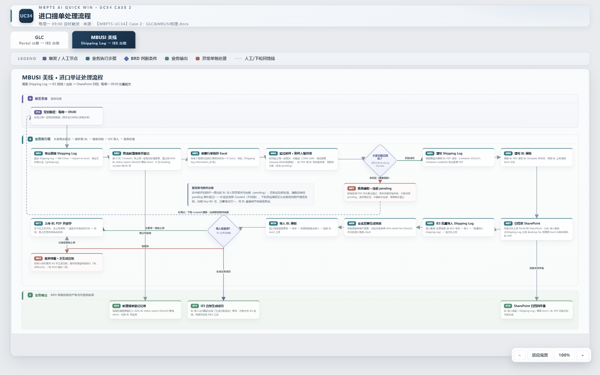

> **源文件**:[UC34-Case2_业务流程图.drawio](./UC34-Case2_业务流程图.drawio)(draw.io 打开,MBUSI 页)

### 分阶段说明

| 阶段 | 节点 | 说明 |
|------|------|------|
| 触发 | T11 | 每周一(默认 09:00 可配置,OPEN-M9),处理上周一至周日 |
| 大表导出登记(批量级) | M01→M02→M03 | 导出 gvShipLog → 按 created 筛上周新增 → 登记大表美线 sheet(D 列 booking number 即 BL 号,列映射 §8.0.4)→ 每票行集单独存 `Shipping log information_<BL>.xlsx`;**登记即建 Task(P08)** |
| 邮件取单 | M04→DM1 | 监控标题含「CMA CGM - 海运提单(Seaway Bill)可供使用」;附件按 BL 号入暂存库、台账 pending;与大表 Booking Number 精确匹配 |
| 漏数挂起 | ME1 | 收到 PDF 但大表无登记:不删不处理、台账 pending、**建挂起 Task**、进异常反馈;补登 created 更新(不回溯)后下轮捕获自动续跑,或任务详情手动确认续跑 |
| 模板填写 | M05→M06 | Shipping Log 基础字段取自网站导出,VOL/Load 取自 BL;BL 模板据 BL PDF 填写保存 |
| 归档 | M07 | 四类文件归档 SharePoint:BL 导入模板 / Shipping Log / 单票 Excel / 邮件 BL PDF |
| IES 导入 | M08→M09→M10 | 批量导入 Shipping Log → 全选发票生成预报(港口经 IES Port 表)→ 集装箱信息导入 BL 模板 |
| 差异与上传 | DM2→ME2→M11 | 有差异 IES 不生成台账,差异记 BL different,**流程继续(P01)**;上传 BL PDF 并保存;任务终态置"有差异" |
| 输出 | O11/O12/O13 | 生成台账成功;归档四件套齐备可查;大表新增登记可查询 |

### 归档结构(MBUSI)

```
<归档根(默认 SharePoint,可配置 T 盘)>
└─ <PDC>
   └─ MBUSI
      └─ <运行周(按系统运行时间)>
         └─ <BL No.> ETA <YYYY.MM.DD>(示例:NAM8646083 ETA 2026.10.05)
            ├─ BL 导入模板(已填写)
            ├─ Shipping Log(已填写)
            ├─ Shipping log information_<BL>.xlsx(单票 Excel)
            └─ BL_<BL号>.pdf(邮件附件提单)
```

## 6.2 系统交互时序

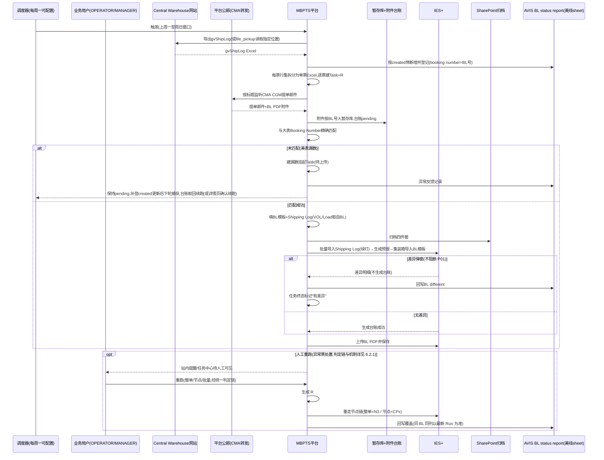

## 6.2.1 重跑交互时序与判定流程(整单/节点/批量)

> 三个重跑入口(任务详情「整单重跑」/「检查点续跑」、任务中心「批量重跑」)**统一走同一条判定链**;前端按判定链控制按钮显隐,后端在提交时复核(防状态在点击后已变化)。

### 判定流程

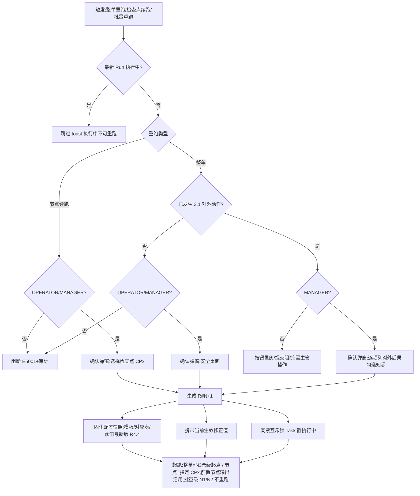

### 时序图

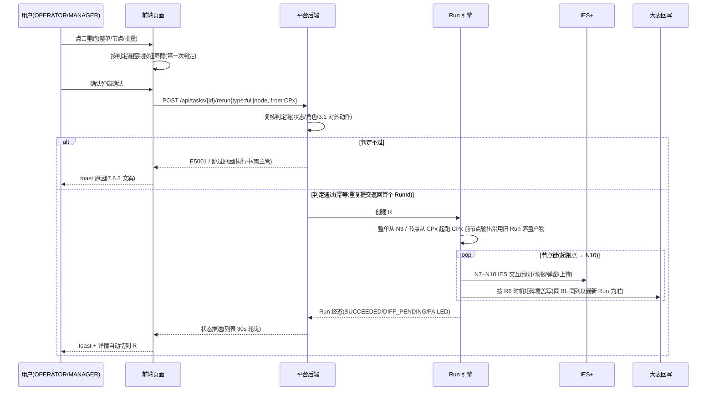

### 时序关键点(开发实现基准)

| # | 时点/机制 | 规则 |
|---|----------|------|
| 1 | 双重判定时点 | 按钮显隐在**页面渲染时**按判定链计算;提交时后端**复核同一判定链**(两时点间状态可能已变,如他人已重跑) |
| 2 | 配置快照时点 | R#N+1 创建瞬间固化模板/对应表/阈值(R4.4),Run 内不变;因此"补配置后重跑生效"(J11 闭环) |
| 3 | 修正值携带 | 创建 R#N+1 时读取该票**当前生效修正版本**写入新 Run;历史 Run 的修正记录只读留存,不重复累计 |
| 4 | 检查点输出沿用 | 从 CPx 起跑时,CPx 之前节点的产物(gvShipLog 行集、已填模板、绿灯记录、证据)沿用旧 Run 落盘文件,不重新生成;CPx 及之后节点全部重算;**批量级 N1/N2 产物(gvShipLog、登记结果)对全部票级 Run 共享沿用** |
| 5 | 同票互斥与幂等(R7.1) | 同 BL 同一时刻只允许一个执行中 Run;执行中到达的重跑请求:列表批量=跳过计数,接口重复提交=返回首个 RunId;不产生重复文件夹/IES 上传/回写行 |
| 6 | 批量重跑 | 逐票独立走完整判定链,单票失败/跳过不影响其他票;汇总 toast"已重跑 X 票 / 跳过 Y 票" |
| 7 | 终态重置 | 新 Run 终态按本次执行重新判定(G1~G3、R5.2);原"有差异"票重跑无差异→SUCCEEDED,任务离开待人工聚合口径 |
| 8 | 回写覆盖边界 | 同 BL 同列覆盖写(R6);**新 Run 未再出现差异弹窗时,「BL different」列是否覆盖清空**【待确认 OPEN-M21,建议覆盖清空以保持"以最新 Run 为准"语义一致】 |

## 6.3 页面跳转与业务闭环

### 跳转链路总览

```
工作台 ──J1~J4──> 任务中心 ──J5──> 任务详情 ──J6──> 任务详情(新 Run,自循环)
                      ▲               │J7 补传/确认续跑/标记无效   │J8 查看归档
                      │               ▼                            ▼
提醒中心 ──J9─────────┘         (系统续跑,状态变化)          归档浏览(Share Point)
邮件中心 ──J10──> 规则编辑器(dry-run)──J11──> 邮件中心
上传中心 ──J12──> (补登子表上传成功)──> 任务详情(手动触发重跑)
```

### 跳转明细表

| 编号 | 从 | 操作 | 到 | 携带数据 | 状态/权限变化 | 用户下一步 |
|------|----|------|----|---------|--------------|-----------|
| J1 | 工作台 | 点"总任务数"卡 | 任务中心 | `line=mbusi` | 无 | 浏览全量票 |
| J2 | 工作台 | 点"已完成"卡 | 任务中心 | `line=mbusi&status=succeeded` | 无 | 抽查完成票 |
| J3 | 工作台 | 点"执行中"卡 | 任务中心 | `line=mbusi&status=running` | 无 | 观察进度 |
| J4 | 工作台 | 点"待人工处理"卡 | 任务中心 | `line=mbusi&status=manual`(=待上传∪有差异∪失败) | 无 | **处置异常票(主路径)** |
| J5 | 任务中心 | 行点击 | 任务详情 | taskId(默认当前生效 Run) | 无 | 核对/修正/续跑 |
| J6 | 任务详情 | 重跑(整单/节点/批量) | 任务详情 | 新 R#N+1 | 异常态→执行中;历史 Run 变只读 | 观察新 Run 节点轨迹 |
| J7 | 任务详情 | 补传/确认续跑/继续等待/标记无效 | 任务详情 | 补传附件 / 确认记录 | 待上传→执行中 / 不变 / 已关闭 | 观察续跑或离开 |
| J8 | 任务详情 | "查看归档位置" | 归档浏览 | 归档路径(票文件夹) | 无(只读) | 下载/核对原件 |
| J9 | 提醒中心 | 点提醒 | 任务详情 | taskId + RunId | 提醒置已读 | 处置异常 |
| J10 | 邮件中心 | 规则行"编辑" | 规则编辑器 | ruleId | 进入编辑态(ADMIN) | 修改/dry-run |
| J11 | 规则编辑器 | 保存/dry-run 后返回 | 邮件中心 | 规则版本+1 | 对新邮件生效;执行中 Run 快照不受影响(R4.4) | 观察下轮命中 |
| J12 | 上传中心 | 补登子表上传成功 | 任务详情 | BL 号 + 子表路径 | 子表落 PDC 目录;可手动触发重跑 | 触发重跑(支线 E) |
| J13 | 任务中心 | 「新建任务」提交成功 | 任务详情 | 新 taskId(R#1,从 N3 起跑) | 无 | 观察模板填写与后续节点 |
| J14 | 工作台 | 「立即补跑本周批次」确认 | 任务中心 | `line=mbusi&source=manual-trigger` | 新增票建 Task+R#1;重复票跳过(E4002) | 观察补跑结果 |

**业务闭环验证**:调度触发 → 大表登记建票 → 邮件匹配 → (异常)提醒 → J9 任务详情 → J7/J6 处置 → 新 Run → 已完成 → J8 归档可查 → 大表回写完成。漏数挂起确认续跑环路由 J7 承载,补登子表上传环路由 J12 承载,收单空窗由 J14 手动补跑兜底,**闭环成立**。

---

# 第七部分:功能设计

## 7.1 功能清单

| 编号 | 功能 | 优先级 | 原型/截图 |
|------|------|--------|----------|
| F-M01 | 工作台 MBUSI 总览 | P0 | [index.png](./images/index.png) |
| F-M02 | 任务中心(MBUSI 筛选/批量重跑/导出/新建) | P0 | [tasks.png](./images/tasks.png) |
| F-M03 | 任务详情(Run 切换/节点轨迹,MBUSI 10 节点) | P0 | [task-detail-mbusi.png](./images/task-detail-mbusi.png) |
| F-M04 | 字段修正留痕 + PDF 原文定位 | P0 | [task-detail-mbusi.png](./images/task-detail-mbusi.png) |
| F-M05 | 漏数票挂起与续跑(漏数处理区) | P0 | [task-detail-mbusi.png](./images/task-detail-mbusi.png) |
| F-M06 | MBUSI 邮件监听规则 | P0 | [rules.png](./images/rules.png) |
| F-M07 | 规则编辑器(三段式 + dry-run) | P0 | [rule-edit.png](./images/rule-edit.png) |
| F-M08 | 配置中心(Shipping Log/BL 模板、IES Port 表、调度、导出通道) | P0 | [config.png](./images/config.png) |
| F-M09 | 归档浏览(MBUSI 目录,四件套) | P1 | [sharepoint.png](./images/sharepoint.png) |
| F-M10 | 站内提醒(平台引用) | P1 | [notify.png](./images/notify.png) |
| F-M11 | 上传中心(漏数补登子表上传) | P0 | [dim-tables.png](./images/dim-tables.png) |

## 7.2 核心业务规则(MBUSI)

> 对齐 BRD-MBUSI-BL-002 §5 Business Rules(BR-01~10)与 §8 异常控制。

### R1 大表与登记规则
- R1.1 按配置的导出通道执行(P18):website_export=打开 Customer Information > Shipments > MB China 并 Export to Excel(BR-01);file_pickup=读取业务指定位置(就位校验,OPEN-M16)。导出失败不更新大表并记录,重试后升级(E4005)。
- R1.2 按 **O 列 created** 识别上周新增并与大表防重(BR-02);D 列 booking number 即 BL 号;登记列映射见 §8.0.4(OPEN-M12)。
- R1.3 每个 BL **行集**(一 BL 多箱多行)原样单独保存为 `Shipping log information_<BL>.xlsx`(含表头,BR-03);按 PDC 建文件夹,命名 `<BL> ETA <YYYY.MM.DD>`(BR-04);文件按 PDC 存入对应目录,GLC/MBUSI 子目录区分线路;PDC/ETA 缺失不建夹转人工(E4003)。
- R1.4 **登记成功即建 Task+R#1**(票创建时机,P08);节点 1-2 为批量级,结果以输出摘要关联到本轮各票。

### R2 邮件匹配规则
- R2.1 仅按邮件标题含「CMA CGM - 海运提单(Seaway Bill)可供使用」搜索(发件过滤已取消,业务配置自动 Forward 至平台公邮)(BR-05)。
- R2.2 **与大表精确匹配 BL 号后方可继续**;未匹配按漏数处理(R3),记录异常(BR-06)。
- R2.3 附件一律先按 BL 号(提取口径 OPEN-M6)入暂存库、台账 pending;**同 BL 重复邮件保留最新版,以平台接收时间戳判定(P23)**,台账记版本号。

### R3 漏数与续跑规则(P02 修订)
- R3.1 漏数票:**不删除不处理**,台账保持 pending,进异常反馈。
- R3.2 补登会更新 created 且**不回溯**,下轮按 created 筛选可捕获;捕获后从台账取回附件续跑(从节点 5 起,附件已在暂存)。
- R3.3 漏数/集装箱差异的线下处理(BRD §异常流程,支线 E):人工删除 IES 已生成预报 → 确认 Shipping Log 已更新至子表 → 上传中心上传指定提单+时间维度子表(自动存储至对应 PDC 目录)→ 数据齐备后手动触发重跑。
- R3.4 **漏数票同样创建 Task**(BL 号票粒度,数据仅有暂存 BL PDF),状态=待上传(WAIT_INPUT),挂起原因=漏数;任务详情"漏数处理区"提供:①确认续跑(系统复核大表已登记该 BL,未登记则提示阻断)②继续等待(保持 pending 至下轮自动捕获)③标记无效(必填原因,终态留痕,撤销仅 MANAGER,OPEN-M13)。
- R3.5 **缺件票**(大表已登记、BL PDF 未到或必填字段缺失):状态=待上传(WAIT_INPUT),挂起原因=缺件;任务详情"缺件处理区"提供:①补传 BL PDF(校验类型/大小/BL 号一致性,通过后自动从 N4 续跑)②确认继续等待③标记无效(同 R3.4③)。

### R4 模板规则
- R4.1 BL 重命名 `BL_<BL号>.pdf` 保存,并复制 Shipping Log 与 BL 模板入票文件夹(BR-07)。
- R4.2 Shipping Log 基础字段取自网站导出;**Container VOL(m³)/Load(KG) 取自 BL**——以已校验的 BL Excel 为准(建议),BL PDF 为 OCR 原始来源(BR-08;优先级 OPEN-M10)。
- R4.3 BL 模板字段取自 BL PDF;预报信息取自提单,港口经 **IES Port 对应表**转换(BR-10)。
- R4.4 模板/对应表版本化,新版上传即生效;**生效语义:Run 启动时快照本次执行用的模板版本与对应表版本,Run 内不变;新 Run 用最新版**(P12,OPEN-M7)。

### R5 IES 执行规则(P01 修订)
- R5.1 **绿灯后方可上传**(BR-09,AC-06);必填校验不过不上传不完整模板(FR-03)。
- R5.2 差异弹窗**完整捕获**回写「BL different」(与 GLC 一致);**有差异 IES 不生成台账;差异不阻断流程**——捕获回写后继续上传 BL PDF 并保存,任务终态置"有差异(DIFF_PENDING)"待业务线下核对(依据 BRD §13 step15);仅"弹窗无法解析"才转人工(E3003,任务置失败)。
- R5.3 附件上传选择文件类别(BL PDF 类别 OPEN-M14),全部传完再保存。

### R6 回写规则(平台台账为主,双写大表)— 时机矩阵(P07)
- R6.1 新增提单登记入大表美线 sheet(列映射 §8.0.4,可查询,O13)。
- R6.2 差异内容回写「BL different」(节点 9 捕获后);台账生成状态、异常反馈列按 §8.0.4 时机矩阵双写(列定义待 OPEN-M12)。
- R6.3 回写失败入队重试+告警(E5002);**重跑对同一 BL 同一列覆盖写**,不产生重复行(R7.1)。
- R6.4 "平台台账"的用户可见视图=任务中心列表;大表为线下协作视图,平台向其回写。

### R7 重跑规则
- R7.1 重跑**不得产生重复**行/文件夹/上传(FR-02)。
- R7.2 Run 不可变;整单/节点/批量重跑生成 R#N+1,**携带人工修正值**;执行中任务跳过。
- R7.3 失败票支持从明确检查点受控续跑(FR-05)。
- R7.4 **对外动作后整单重跑仅 MANAGER**(清单见 3.1):IES 台账已生成 / BL PDF 已上传保存;节点级重跑(节点 7 前)不受限。
- R7.5 重跑的统一判定链、时序与互斥/幂等机制见 6.2.1(前端显隐+后端复核双判定;同票互斥;检查点输出沿用;终态重置;整单起点=N3,批量级 N1/N2 不重跑;漏数续跑从 N4 起,附件已在暂存)。

### R8 权限与审计规则
- R8.1 四角色职责分离:主管无字段修正权,操作员无对外确认权。
- R8.2 修正仅留痕不审批,写入当前生效版本。
- R8.3 全操作审计;证据(trigger/process/operation)带 hash,**WORM 防篡改**;每票保留源文件/输出/时间戳/状态/错误详情(FR-04)。
- R8.4 邮箱/路径/重试/等待时间**不得硬编码**(FR-01);凭证安全存储且不入日志(FR-06);上传前必填校验(FR-03)。

---

## 7.3 原型及交互规则说明

### 7.3.1 工作台 MBUSI 总览(F-M01)

**页面名称**:工作台 | **用户角色**:全部角色(AUDITOR 只读) | **进入条件**:登录后默认落地页,无前置数据依赖

**页面目标**:异常分拣入口——让业务 10 秒内判断"本周 MBUSI 有没有要我处理的票",并承载批次级操作(手动补跑)。

**功能说明**:页面只回答三个问题:①本周跑了多少票;②多少票要我处理;③下次什么时候跑/要不要现在补跑。**不提供票级操作**(票级处置一律进任务中心),避免工作台退化成第二个列表页。

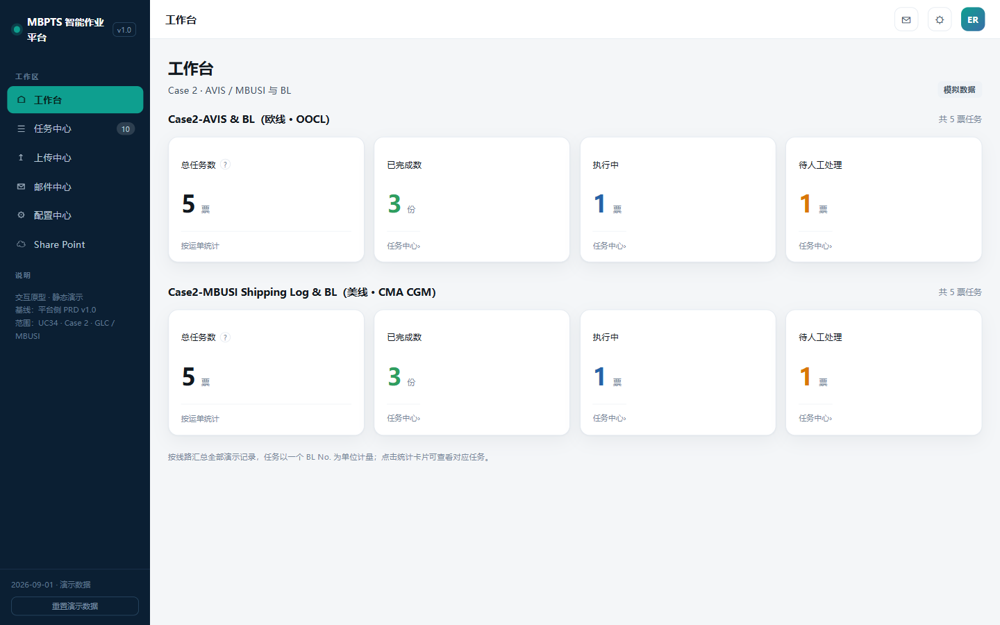

**展示字段**(每个字段须回答"为什么存在、来源、谁用、影响什么"):

| # | 字段 | 口径/取值 | 数据来源 | 为什么需要(业务原因) |
|---|------|----------|---------|---------------------|
| 1 | 数据窗口标签 | "数据窗口:YYYY.MM.DD ~ YYYY.MM.DD(上周一至周日)" | 调度配置 | 漏数补登存在跨周捕获(R3.2),业务必须知道统计覆盖哪个数据窗口,防止与"自然周"理解错位导致误判漏票 |
| 2 | 统计卡:总任务数 | 窗口内 MBUSI 去重后 BL 号数(票粒度,按最新 Run 状态计数) | GET /api/workbench/summary?line=mbusi | 周工作量基线,业务与线下大表对总数;骤降为 0 可早期发现网站导出/公邮接入故障 |
| 3 | 统计卡:已完成 | 最新 Run = SUCCEEDED 的票数 | 同上 | 自动化成果口径(自动化率指标分子,OPEN-M1) |
| 4 | 统计卡:执行中 | 最新 Run = PENDING ∪ RUNNING | 同上 | 判断"批次还在跑,先别介入" |
| 5 | 统计卡:待人工处理 | 待上传 ∪ 有差异 ∪ 失败(聚合快捷口径,不互斥) | 同上 | **核心分拣口径**:业务每周一第一件事就是看这张卡,决定本周工作量 |
| 6 | 调度信息条 | 上次运行:YYYY.MM.DD HH:mm(结果);下次运行:每周一 09:00(可配置,OPEN-M9) | 调度器状态 | 调度恰逢维护/失败时(US-M01 E1),业务能自行判断是否需要手动补跑,不必找平台查 |

**按钮与操作**:

| 按钮/操作 | 显示条件 | 点击触发 | 系统处理 | 结果与反馈 |
|----------|---------|---------|---------|-----------|
| 统计卡点击 | 恒可用 | 带参跳任务中心(J1~J4,见 6.3) | — | 任务中心按对应筛选展示,顶部显示来源 banner +「清除工作台筛选」 |
| 「立即补跑本周批次」 | OPERATOR/MANAGER 可见【OPEN-M18】;ADMIN/AUDITOR 隐藏 | 弹确认窗(显示数据窗口、窗口内已存在票数、去重说明) | POST /api/schedule/trigger(line=mbusi,窗口=上周一至周日);同窗口已登记 BL 号去重跳过(防重,E4002 口径) | toast"已触发:新增 X 票 / 跳过 Y 票(重复)";自动跳任务中心(来源=手动触发,J14) |
| 侧栏导航 | 全部角色 | 页面切换:工作台→任务中心→上传中心→邮件中心→配置中心→Share Point | — | AUDITOR 进入各页均为只读 |

**空态与异常**:
- 当周无新增提单且无提单邮件(US-M01 E2):4 卡显示 0/0/0/0,调度信息条显示"上次运行成功(0 票)",不报错、不产生告警。
- 统计接口失败:卡片显示 "--" + 重试图标,点击重试仅刷新统计区,不阻断导航与补跑入口。
- 调度信息条显示"上次运行失败"(如 E4005 导出失败):信息条变红并给出失败原因摘要 + 跳任务中心(状态=失败)链接。

---

### 7.3.2 任务中心(F-M02)

**页面名称**:任务中心 | **用户角色**:全部角色(操作按角色控制) | **进入条件**:侧栏直达,或工作台/提醒带参跳入(J1~J4、J9、J14)

**页面目标**:MBUSI 票统一台账视图(即平台台账,替代线下 AVIS BL status report 的日常查询职能)+ 异常票批量处置入口;漏数挂起票在此可见可处置。

**功能说明**:任务=业务单据(票粒度=BL 号),状态取最新 Run。

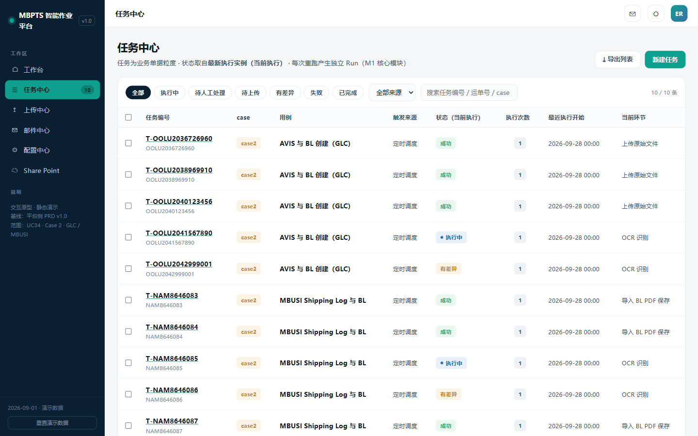

**查询与筛选区**(设计原则:每个筛选条件=业务实际查票习惯的一种入口,须回答"谁会用它、查什么"):

| # | 控件 | 取值/输入规则 | 为什么需要(业务原因) |
|---|------|--------------|---------------------|
| 1 | 状态 chip ×7 | 全部/执行中(PENDING∪RUNNING)/**待人工处理(聚合:待上传∪有差异∪失败,不互斥)**/待上传(WAIT_INPUT)/有差异(DIFF_PENDING)/失败(FAILED)/已完成(SUCCEEDED) | 异常分拣主路径:业务周一按"待人工处理"过票;"待上传"专盯缺件与漏数挂起票(R3.4/R3.5);"有差异"专盯 IES 差异回写票(US-M05) |
| 2 | 关键词搜索 | 支持任务编号 / BL 号 / Shipping Log No. 模糊匹配(按 OPEN-M6 归一规则处理输入) | 业务跨系统对单时手里通常只有 BL 号或 Shipping Log No.(大表对账习惯) |
| 3 | 来源筛选 | 全部/定时调度/手动创建/手动触发 | 自动化率统计口径(OPEN-M1):区分系统自动产出票与人工干预票 |
| 4 | 运行周筛选【新增,OPEN-M17】 | 下拉:最近 8 个运行周(按调度批次 BatchId) | 业务按周对账、归档目录按运行周组织(BR-04);漏数票跨周捕获时需回看"上周挂起的票本周是否补登" |
| 5 | PDC 筛选【新增,OPEN-M17】 | 下拉:gvShipLog PDC 值域 | 业务按目的仓分工,各仓负责人只看自己的票 |
| 6 | 挂起原因筛选【新增,OPEN-M17】 | 全部/缺件/漏数(仅对待上传状态生效) | 缺件(等 BL 邮件)与漏数(等大表补登)处置动作不同(R3.4 vs R3.5),业务需分开盯办 |

**列表字段**(列|含义|来源|为什么展示):

| 列 | 含义 | 数据来源 | 为什么展示 |
|----|------|---------|-----------|
| 勾选框 | 批量重跑选择 | — | 批量处置入口(见下方"批量重跑"按钮规则) |
| 任务编号 | T-\<BL号\>,副行显示 BL No. | Task | 票唯一锚点 |
| Shipping Log No. | 大表 E 列同值 | F-02 | 业务对照线下大表时的主键习惯,免进详情 |
| PDC | PDC 值 | F-03 | 按仓分工识别,不进详情即可见 |
| case | MBUSI Shipping Log 与 BL | Task.caseId | 多 Case 平台下区分流程归属 |
| 触发来源 | 定时调度/手动创建/手动触发 | Task | 自动化率口径 |
| 状态(当前执行) | 最新 Run 状态映射(8.1 状态机) | Run | 异常分拣核心 |
| 挂起原因 | 缺件/漏数(仅待上传态有值) | Run/异常记录 | 两条支线处置动作不同,列表级区分 |
| 当前环节 | 最新 Run 当前/失败节点名(如"N7 导入 Shipping Log") | NodeExecution | 不进详情即可定位卡点 |
| 执行次数 | Run 数量 | Task | ≥3 次=反复失败票,重点关注 |
| 最近执行开始 / 耗时 | 最新 Run 起止 | Run | 观察单票耗时是否异常(IES 交互变慢的早期信号) |
| 异常摘要 | 本票最近一条异常描述截断(如"已收提单但大表未登记") | 异常反馈列回写记录/节点异常 | 业务扫列表即知异常原因,减少逐票点入 |

**按钮与操作**:

| 按钮 | 显示条件 | 触发与系统处理 | 结果与反馈 |
|------|---------|---------------|-----------|
| 「新建任务」 | OPERATOR/MANAGER | 弹表单(7.6.1a):BL 号(必填,格式【OPEN-M11】,失焦查重+查大表登记状态)+ BL PDF(可选;不传则暂存已有自动关联,无附件则建票即挂待上传-缺件)。校验:BL 号已存在 → E4002 提示并给"跳已有任务"链接;大表未登记 → 提示"大表未登记该 BL,将按漏数挂起流程处理" | 提交建 Task+R#1,**从节点 3(票级起点)起跑**(大表已登记);跳任务详情观察(J13) |
| 「批量重跑」 | 勾选 ≥1 行 | 确认弹窗列出勾选清单并**逐行标注可重跑性**:执行中票=自动跳过;已发生 3.1 对外动作的票=仅 MANAGER 可整单重跑(OPERATOR 勾选时该行置灰并注明"已发生对外动作,需主管操作",R7.4) | 确认后每票生成 R#N+1(整单,从 N3 起跑);toast"已重跑 X 票 / 跳过 Y 票";列表刷新 |
| 「导出列表」 | 仅 MANAGER | GET /api/export/tasks.csv(**当前筛选条件生效**) | CSV=列表列+最近 Run 状态/耗时;**不含修正明细**(修正留痕查任务详情) |
| 行点击 | 全部角色 | 跳任务详情(J5,默认当前生效 Run) | — |
| 「清除工作台筛选」banner | 仅从工作台带参进入时显示 | 清除 URL 参数恢复全量列表 | — |

**关键交互序列:S3 批量重跑**:

| 步 | 用户操作 | 界面反馈 | 系统处理 | 状态变化 |
|---|---------|---------|---------|---------|
| 1 | 勾选 ≥1 行 | 批量条滑出(已选 N 项) | 前端记录勾选 | 不变 |
| 2 | 点「批量重跑」 | 确认弹窗逐行标注可重跑性(可重跑/跳过-执行中/需主管) | 逐票预检状态与 3.1 对外动作 | 不变 |
| 3 | 点「确认重跑」 | 按钮禁用+loading | 逐票 POST /rerun{type:full},执行中自动跳过 | 各票生成 R#N+1→执行中 |
| 4 | — | toast"已重跑 X 票 / 跳过 Y 票(执行中)" | 列表刷新 | — |

**排序与分页**:默认排序 = 待人工类(待上传 > 失败 > 有差异)优先,其余按"最近执行开始"倒序;20 条/页。

**空态与异常**:
- 无任务:空态+"本周暂无 MBUSI 任务,可前往工作台手动补跑"引导;筛选无结果:空态+"清除筛选"。
- 重跑失败:toast 错误码+原因(E5001 权限不足/E4002 重复)。
- 列表加载失败:空态+「重试」按钮,筛选条件保留不丢失。

---

### 7.3.3 任务详情(F-M03/M04/M05/F-M12)

**页面名称**:任务详情 | **用户角色**:全部角色(修正/重跑/缺件·漏数处理按角色控制) | **进入条件**:任务中心行点击(J5)/提醒点击(J9)/新建任务提交后(J13)/上传中心上传成功后(J12);前置:taskId 必传,runId 可选(默认当前生效 Run)

**页面目标**:单票全生命周期"处置台"——核对、修正、补件、续跑、取证一页完成(承载"异常票单票人工耗时 ≤5 分钟"指标);**漏数挂起票的确认续跑在本页完成**。

**功能说明**:Run 切换、MBUSI 10 节点轨迹、识别字段核对与修正、缺件/漏数处理、PDF 原文定位、证据预览、重跑。

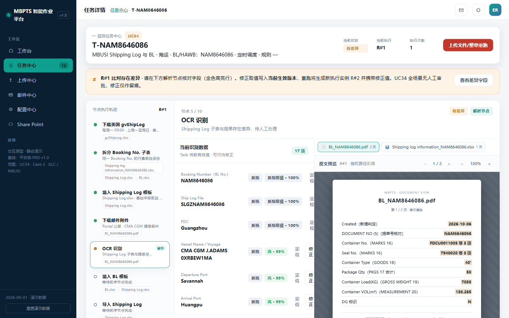

**头部信息区字段**(全部只读,处置前先确认"是不是这票"):

| 字段 | 来源 | 为什么展示 |
|------|------|-----------|
| 任务号(T-BL号)+ 返回任务中心 | Task | 定位与返回;返回时保留任务中心筛选条件 |
| case · BL No. · Shipping Log No. · PDC · ETA | Task / F-01 / F-02 / F-03 / F-04 | 票身份五要素 |
| 触发来源 · 命中规则 | Task / MailRule | 区分调度产出与人工补录;排查收单问题时定位是哪条规则命中的 |
| 当前状态 · 挂起原因 · 当前执行 R#n · 执行次数 · 最近起止耗时 | Run / Task | 状态机可视;挂起原因决定处置区形态;执行次数多=反复失败预警 |

**头部操作按钮(状态 × 角色条件矩阵)**:

| 状态 | 按钮 | 显示条件 | 触发与系统处理 | 结果与反馈 |
|------|------|---------|---------------|-----------|
| 待上传-缺件 | 「补传文件」 | OPERATOR/MANAGER | 弹上传窗(BL PDF 槽位);校验:PDF、≤20MB、**BL 号一致性**(解析上传件 BL 号与 F-01 比对);POST /api/tasks/{id}/attachments | 校验通过→入暂存+台账(pending)→自动从 N4 续跑,状态→执行中;校验失败→槽位行内红字原因,不入暂存 |
| 待上传-缺件 | 「确认继续等待」 | OPERATOR/MANAGER | 二次确认弹窗(文案:"下轮调度将继续尝试匹配提单邮件");POST /api/tasks/{id}/hold-confirm(action=wait) | 状态不变,操作日志留痕;下轮调度继续参与匹配 |
| 待上传-漏数 | 「确认续跑」 | OPERATOR/MANAGER | **系统复核大表已登记该 BL**:已登记→从台账取回附件立即续跑(从 N4 起);未登记→阻断提示"大表未登记该 BL,请先补登";POST /api/staging/{blNo}/resume | 复核通过→状态→执行中;阻断→状态不变+提示 |
| 待上传-漏数 | 「继续等待」 | OPERATOR/MANAGER | 二次确认弹窗(文案:"补登后 created 更新,下轮调度将自动捕获续跑");POST hold-confirm(action=wait) | 状态不变,保持 pending 至下轮自动捕获 |
| 待上传(两类) | 「标记无效」 | OPERATOR/MANAGER | 弹窗**必填原因**(下拉:重复到邮/业务取消/测试数据/其他+备注);POST hold-confirm(action=invalid) | 任务关闭(终态,留痕);撤销仅 MANAGER【OPEN-M13】 |
| 有差异 DIFF_PENDING | 「定位差异」 | 全部角色 | 页面滚动至"当前识别数据"区金色字段并闪烁高亮 | — |
| 有差异 | 「整单重跑」 | OPERATOR/MANAGER(涉 3.1 对外动作时仅 MANAGER) | 见下方"整单重跑通用规则";POST /api/tasks/{id}/rerun{type:full} | R#N+1,携带当前生效修正值 |
| 失败 FAILED | 「检查点续跑」 | OPERATOR/MANAGER | 弹窗选择续跑检查点(默认=失败节点最近 CP,如 N7 失败默认 CP7;可选更早 CP);POST /rerun{type:node,from:CPx} | R#N+1 从指定检查点起跑,前置节点输出沿用 |
| 失败 | 「整单重跑」 | 同"有差异"行 | 同上 | R#N+1 从 N3 起跑 |
| 已完成 SUCCEEDED | 「整单重跑」 | **仅 MANAGER**(已完成票必然已发生 3.1 对外动作,R7.4) | 确认弹窗逐项列出已发生对外后果(IES 重复台账/重复文档风险,3.1 清单) | R#N+1 |
| 任意状态 | 「查看归档位置」 | 全部角色 | 带票归档路径跳 Share Point(J8,只读) | — |
| 执行中 | —(无任何操作按钮) | — | 执行中不可重跑/修正,仅可观察 | — |

**整单重跑通用规则**:未发生 3.1 动作=安全重跑(OPERATOR/MANAGER 均可);已发生=仅 MANAGER 且确认弹窗显式列出后果;重跑携带当前生效修正值(R7.2);新 Run 使用启动时最新配置快照(R4.4);整单起点=N3,批量级 N1/N2 不重跑(6.2.1)。

**关键交互序列**:

S1 补传→自动续跑(缺件票主路径):

| 步 | 用户操作 | 界面反馈 | 系统处理 | 状态变化 |
|---|---------|---------|---------|---------|
| 1 | 点「补传文件」 | 弹窗 BL PDF 槽位+期望文件名规则 | 读取缺失清单 | 不变 |
| 2 | 选择文件 | 槽位即时校验(类型/大小) | 前端预检 | 不变 |
| 3 | 点「确认补传」 | 按钮禁用+loading | BL 号一致性解析 → 入暂存+台账 pending | 不变 |
| 4 | — | toast"补传成功,已自动续跑" | 从 N4 起跑(匹配复核→OCR) | 待上传→执行中 |

S2 修正→重跑(差异票主路径):

| 步 | 用户操作 | 界面反馈 | 系统处理 | 状态变化 |
|---|---------|---------|---------|---------|
| 1 | 点「定位差异」 | 滚动至金色字段闪高亮 | — | 不变 |
| 2 | 行内修正→「保存并留痕」 | 校验通过后 toast"修正已留痕,需重跑后生效"+引导条 | POST correct,记录修正人/时间/原值/新值 | 不变(修正值写入当前生效版本) |
| 3 | 点「整单重跑」 | 确认弹窗(安全/对外两态) | POST rerun{type:full} | DIFF_PENDING→执行中 |
| 4 | — | 自动切到 R#N+1 轨迹 | 新 Run 携带修正值+新配置快照 | 旧 Run 只读 |

S4 漏数确认续跑(漏数票主路径):

| 步 | 用户操作 | 界面反馈 | 系统处理 | 状态变化 |
|---|---------|---------|---------|---------|
| 1 | 查看漏数横幅+暂存附件信息 | 展示 BL PDF 接收时间、已等待轮次 | 读暂存台账 | 不变 |
| 2 | (线下补登大表后)点「确认续跑」 | 按钮禁用+loading | 复核大表登记状态 | 不变 |
| 3a | 复核通过 | toast"已确认,开始续跑" | 台账取回附件,从 N4 起跑 | 待上传→执行中 |
| 3b | 复核未通过(大表仍无登记) | 阻断提示"大表未登记该 BL,请先补登" | 无 | 不变 |

**Run 切换区**:R#1、R#2…chip 横排;历史 Run 只读(显示"正在查看 R#x"指示条+「切回当前执行 →」按钮);仅当前生效 Run 可修正/重跑/补传。

**Run 对比视图(新增【待确认 OPEN-M19 是否纳入一期】)**:回答业务重跑后第一个问题——"这次和上次差在哪"。入口=Run 切换区「对比」按钮;任选两个 Run(默认当前 vs 上一 Run)→ 字段级对比表:字段 | R#N 值 | R#N+1 值 | 变化(高亮) | 变化来源(人工修正/重新识别/配置版本差异);节点级差异摘要(各节点两次执行的成/败对比);对比结果可导出(并入导出权限,仅 MANAGER)。

**MBUSI 节点编排(10 节点;N1-N2 批量级,N3-N10 票级,实现规格见 7.4)**:
1. 下载美国 gvShipLog(Central Warehouse 导出/指定位置读取)【批量】
2. 筛新增+登记大表+拆分 Booking No. 子表【批量】
3. 填 Shipping Log 模板基础字段(VOL/Load 待 BL 回填)
4. 下载邮件附件(CMA CGM 提单)+ G1 匹配
5. OCR 识别(BL PDF,集装箱明细)
6. 填 BL 模板并回填 Shipping Log
7. 导入 Shipping Log(IES+ 批量导入,G3 绿灯)
8. 生成预报(港口经 IES Port 对应表)
9. 导入 BL 模板(集装箱台账;差异弹窗捕获)
10. 导入 BL PDF 保存(状态报告回写;归档四件套)

**节点轨迹区交互**:左侧节点列表点击切换节点面板;面板展示:节点状态/起止/耗时/输入摘要/输出摘要/检查点(CP 编号)/失败错误码;批量级节点(N1/N2)标注"批量·本轮共享"并链接 BatchRun 输出摘要。失败节点标红并显示可续跑检查点;差异相关节点(N5 置信度、N9 弹窗)标金;挂起节点标灰"等待输入"。

**页面分区 × 状态差异**:

| 分区 | 待上传-缺件 | 待上传-漏数 | 有差异(DIFF_PENDING) | 失败(FAILED) | 已完成(SUCCEEDED) |
|------|------------|------------|---------------------|-------------|------------------|
| 头部操作 | 「补传文件」「确认继续等待」「标记无效」 | 「确认续跑」「继续等待」「标记无效」 | 「定位差异」「整单重跑」 | 「检查点续跑」「整单重跑」 | 「整单重跑」(仅 MANAGER,R7.4) |
| 横幅 | 缺件横幅:缺 BL PDF/必填字段 | 漏数横幅:"已收提单邮件,大表未登记,等待补登;补登后下轮自动捕获续跑,或可手动确认续跑" | 差异横幅:一键定位金色字段 | 失败横幅:失败节点+错误码 | 无 |
| 节点轨迹 | 挂起节点标灰"等待输入" | 节点 4 起标灰,显示暂存已收附件信息 | 差异节点标金 | 失败节点标红,显示检查点 | 全绿 |
| 当前识别数据 | 只读 | 只读(仅暂存附件元信息) | 可行内修正(OPERATOR) | 只读 | 只读 |
| 缺件/漏数处理区 | 缺件处理区(F-M12) | 漏数处理区(F-M05) | 不展示 | 不展示 | 不展示 |
| 证据区 | 可见 | 可见(含暂存 BL PDF) | 可见 | 可见 | 可见 |

**当前识别数据区(F-M04,解析节点 N5 工作区)**:
- 字段表:8.0.1(F-01~F-15);展示列=字段名/当前值/来源(OCR|规则|gvShipLog)/置信度/质量等级/「定位」/「修正」。
- 「定位」:右侧原文预览自动切到对应文档 tab、跳到对应页并框选高亮(如 F-08→BL 集装箱明细区)。
- 「修正」:仅 OPERATOR + 当前生效 Run + 状态=有差异 时可用;点击行内编辑→按 8.0.1"取值/校验"列实时校验(非法→红字阻断保存)→「保存并留痕」记录修正人/时间/原值/新值(POST /api/runs/{runId}/fields/{fieldId}/correct)。**修正不自动生效**,保存后提示"修正已留痕,需重跑后生效",并引导点击「整单重跑」。
- 质量等级:高=无标色/中=蓝/**低=金色高亮**(置信度<阈值【建议 0.85,OPEN-M22】)。

**PDF 原文预览区**:多文档 tab(BL PDF/单票 Excel 转视图,按暂存库实有文件出 tab);翻页/缩放/「下载附件」。

**缺件处理区(F-M12,状态=待上传-缺件时展示)**:

| 元素 | 内容 | 说明 |
|------|------|------|
| 缺失清单 | 行=缺失附件角色(bl)+ 期望文件名规则(取命中 MailRule 的附件角色正则)+ 已等待时长(自该 BL 大表登记起算) | 让业务判断"是邮件真没到还是延迟" |
| 补传槽位 | BL PDF 上传槽(PDF ≤20MB,BL 号一致性校验) | 补传即续跑,无需再点重跑 |
| 操作按钮 | 「补传文件」「确认继续等待」「标记无效」 | 语义见头部操作矩阵(R3.5) |

**漏数处理区(F-M05,状态=待上传-漏数时展示)**:

| 元素 | 内容 | 说明 |
|------|------|------|
| 暂存附件信息 | 已收 BL PDF 文件名/接收时间/暂存版本(R2.3 保留最新版) | 证明"船公司已发提单,是大表漏登" |
| 补登指引 | 文案:"请在线下大表(AVIS BL status report 美线 sheet)补登该 BL;补登后 created 更新,下轮调度(每周一)自动捕获续跑;补登完成后也可点击「确认续跑」立即执行" | 业务自助闭环,无需找平台 |
| 操作按钮 | 「确认续跑」「继续等待」「标记无效」 | 语义见头部操作矩阵(R3.4) |

**步骤证据区**:email/ocr/screen/table/file 五类,内联预览,WORM 标注(hash);IES 差异弹窗截图(E3003)与绿灯截图证据也在此区。

**触发历史/操作日志**:**兄弟任务 = 同 BL 号跨周归并的相关票(漏数挂起票与补登后正式票互查,支撑漏数追溯)**;15 天热力图=该 case 每日执行密度,观察调度稳定性;任务级全操作留痕(修正/补传/确认/重跑/导出)。

**异常提示**:修正格式非法 → 行内红字阻断;补传校验失败 → 槽位红字原因;续跑失败 → toast E3002;确认续跑时大表未登记 → 阻断提示;非当前 Run 尝试操作 → 无入口(历史只读)。

---

### 7.3.4 MBUSI 邮件规则与编辑器(F-M06/M07)

**页面名称**:邮件中心 / 规则编辑器 | **用户角色**:查看=全部;编辑/发布/启停/dry-run=ADMIN | **进入条件**:侧栏"邮件中心";编辑从规则行「编辑」进入(J10)

**页面目标**:不改代码调整 MBUSI 收单口径,dry-run 发布前自证规则正确。

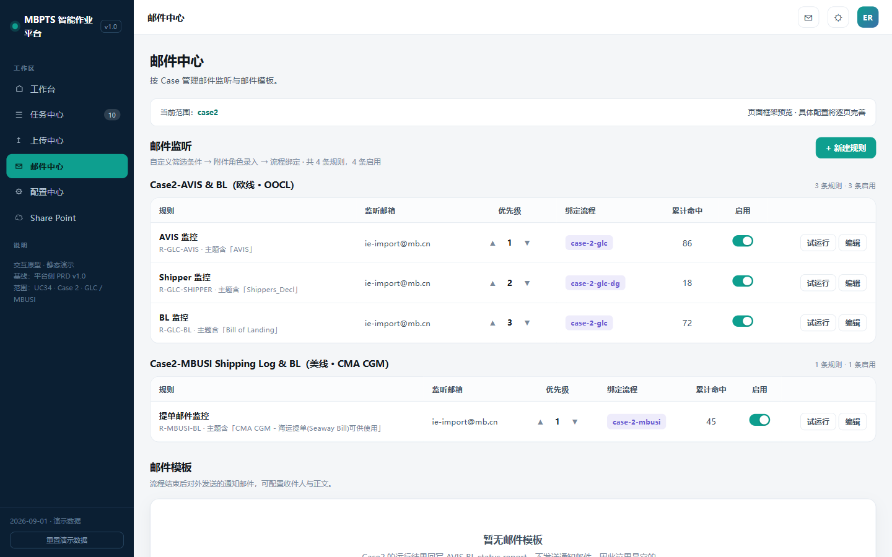

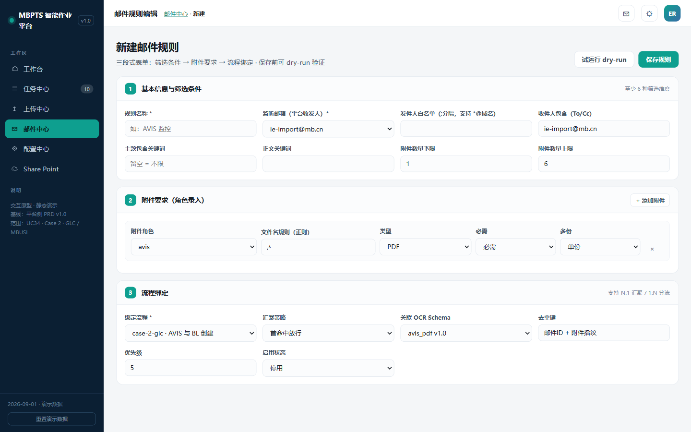

**MBUSI 预置规则**:

| 规则 | 监听要素 | 绑定流程 | 说明 |
|------|---------|---------|------|
| R-MBUSI-BL | 主题含「CMA CGM - 海运提单(Seaway Bill)可供使用」(样本发件人 website-noreply@cma-cgm.com) | case-2-mbusi | 仅按标题搜索;业务配置自动 Forward 至平台公邮 |

**规则列表字段**(列|含义|为什么展示):

| 列 | 含义 | 为什么展示 |
|----|------|-----------|
| 规则(名称+ID+主题关键词) | R-MBUSI-BL | 业务报障"邮件没收到"时,先核对规则口径 |
| 监听邮箱 | 平台公邮 | 确认监听的是不是正确的公邮 |
| 优先级 | 数值 + ▲▼ 调整 | 一封邮件同时命中多条规则时的裁决顺序 |
| 绑定流程 | case-2-mbusi | 规则→流程追溯 |
| 累计命中 | 累计命中邮件数 | **健康度信号**:规则长期 0 命中=转发配置/主题口径可能已变更,需主动排查 |
| 启用 | switch | 船公司切换期可暂停收单 |
| 操作 | 编辑 / 试运行 | ADMIN |

**列表区操作**:

| 操作 | 显示条件 | 触发与反馈 |
|------|---------|-----------|
| 「+ 新建规则」 | ADMIN | 进入规则编辑器(空表单) |
| 「编辑」 | ADMIN | 进入规则编辑器(回显当前版本,J10) |
| 「试运行」 | ADMIN | dry-run 弹窗:选择样本邮件 → 逐条件展示命中/未命中原因,**不产生任务**;样本不可用 → toast E1002 |
| 启用 switch | ADMIN | 即时生效,**不影响已建任务**;关闭启用中规则需二次确认("停用期间到邮将不收单") |
| 优先级 ▲▼ | ADMIN | 即时生效 |

**规则编辑器字段表**(三段式;每字段回答"为什么存在"):

| 段 | 字段 | 必填 | 取值/校验 | 业务原因 |
|----|------|:---:|---------|---------|
| ① 基本信息与筛选条件 | 规则名称 | 是 | 唯一 | 业务可辨识(R-MBUSI-BL) |
| ① | 监听邮箱 | 是 | 下拉(平台公邮清单) | MBUSI 监听平台公邮(CMA 转发落地) |
| ① | 发件人白名单 | 否 | `;` 分隔,支持 `*@域名` | 样本发件人 website-noreply@cma-cgm.com 仅作参考;**MBUSI 仅按标题搜索(R2.1)**,白名单留作兜底加固 |
| ① | 收件人包含(To/Cc) | 否 | 文本 | 抄送口径细分场景预留 |
| ① | 主题包含关键词 / 正文关键词 | 是(主题) | 文本 | 「CMA CGM - 海运提单(Seaway Bill)可供使用」分类依据(R2.1) |
| ① | 附件数量下限/上限 | 否 | 下限 ≤ 上限 | 防空附件邮件误入收单 |
| ② 附件要求(可增删行) | 附件角色 | 是 | bl / shipping_log | 入暂存库的角色标签;**G1 匹配按角色归并** |
| ② | 文件名规则(正则) | 是 | 正则语法校验,错误→E1001 | 附件角色识别与 **BL 号提取(OPEN-M6)** 依据 |
| ② | 类型 | 是 | PDF/Excel/图片/不限 | 收单质量控制 |
| ② | 必需/可选 | 是 | 至少一条必需 | 必需角色缺失=邮件不算完整命中 |
| ② | 单份/多份 | 是 | 单份/多份 | 同 BL 多附件场景预留 |
| ③ 流程绑定 | 绑定流程 | 是 | case-2-mbusi | 规则→流程入口 |
| ③ | 汇聚策略 | 是 | 首命中放行/全命中 | 多规则命中时的汇聚方式 |
| ③ | 关联 OCR Schema | 是 | cma_cgm_bl | 决定 N5 用哪套字段 Schema 识别 |
| ③ | 去重键 | 是 | BL 号 | 同 BL 重复邮件保留最新版(R2.3) |
| ③ | 优先级 / 启用状态 | 是 | 数值 / 开关 | 同列表区 |

**保存与反馈**:保存校验失败(正则错误/必需角色缺失/下限>上限)→ 阻断(E1001)并红字定位错误段;保存成功→规则版本+1 返回邮件中心(J11),**对新邮件生效,执行中 Run 快照不受影响**(R4.4);取消有改动时二次确认。

---

### 7.3.5 配置中心 MBUSI 部分(F-M08)

**页面名称**:配置中心 | **用户角色**:查看=全部;维护=ADMIN | **进入条件**:侧栏"配置中心"

**页面目标**:MBUSI 线所有"会变的业务口径"配置化——模板、对应表、调度、导出通道,业务变更不发版。

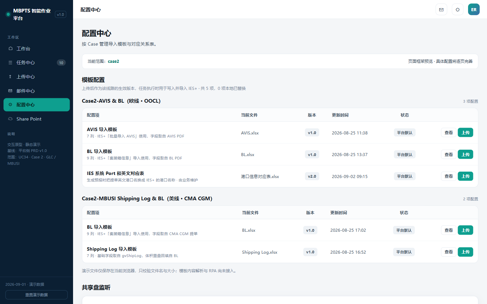

**配置项清单**(配置项|内容|为什么需要它存在):

| 配置项 | 内容 | 为什么需要(业务原因) |
|--------|------|---------------------|
| Shipping Log 导入模板 | 7 列:AVIS/Shipping Log No.、MBZ/BOL、Container No.、Container Type、Seal Number、Container VOL(m³)、Container Load(KG);IES+「批量导入 Shipping Log」用(映射见 8.0.2) | IES 模板格式调整时只换模板不改代码(RSK-M4) |
| BL 导入模板 | 9 列:No.、Shipping log No./AVIS No.、HAWB/BL No.、Container No.、Container Type、Seal No.、Package Qty、Container Load(KG)、Container VOL(m³);IES+「集装箱信息」导入用(映射见 8.0.3) | 同上 |
| IES Port 对应表 | 英文港口名 ↔ IES 港口名称(参照 AVIS detail list Sheet2 港口信息 sheet) | 生成预报时港口名转换(R4.3);新港口只需加一行 |
| 调度配置 | 触发时间(默认每周一 09:00,OPEN-M9)+ 数据窗口(固定上周一至周日) | 业务节奏调整(如改周二跑)不发版 |
| 网站导出通道(D4) | website_export(自动导出)/ file_pickup(指定 T 盘/SharePoint 位置读取+就位校验规则,OPEN-M16) | 网站权限不可控(BRD §13 明示"可下载报告放到指定位置"),权限受限时业务自助切通道,不发版 |

**各配置项操作**:

| 配置项 | 操作 | 校验/规则 | 生效语义 |
|--------|------|----------|---------|
| Shipping Log/BL 模板 | 「查看」:抽屉展示当前文件/版本/用途 + **模板列结构表**(列 A/B/C…×字段名,即 8.0.2/8.0.3 映射);「上传」:选择文件替换;「历史版本」:列表查看/下载历史版本,「恢复此版本」生成新版本号(不覆盖历史,留痕) | 扩展名 xlsx + ≤20MB(E2001);模板版本与流程兼容性校验(E2002 阻断并提示回退);上传成功版本+1 | 对保存后新建的 Run 生效;执行中 Run 用启动时快照(R4.4) |
| IES Port 对应表 | 在线行级维护:新增行/行内编辑/删除(二次确认);键列唯一性实时校验,**键重复行内阻断**;保存前差异预览(新增 X/修改 Y/删除 Z) | 键非空 | 同上(Run 快照) |
| 调度配置 | 时间选择器(周几+时分);展示"下次触发:YYYY.MM.DD HH:mm"预览 | 仅 ADMIN;修改二次确认 | **对下次触发生效**;不影响已排队的本次执行 |
| 导出通道 | 下拉切换 + 通道参数(网站 URL/凭证引用 或 拾取路径/文件名规则/时间窗);修改二次确认 | file_pickup 模式必填路径与就位校验规则 | **对下轮批量生效** |

**异常提示**:E2001/E2002 → 上传区红字;对应表键重复 → 行内阻断;保存冲突(他人已改)→ 提示刷新后重试。

**预留区**:共享盘监听配置(平台能力,本线不使用,只读置灰展示)。

---

### 7.3.6 归档浏览 MBUSI 目录(F-M09)

**页面名称**:Share Point | **用户角色**:全部角色(**只读**:浏览/搜索/下载/复制路径;无编辑/删除/上传) | **进入条件**:侧栏"Share Point",或任务详情「查看归档位置」带路径跳入(J8)

**页面目标**:让业务不按平台任务、而按**熟悉的线下文件夹习惯**(PDC→MBUSI→周→票)找原件与已填模板,用于与 IES/大表交叉核对和审计取证。

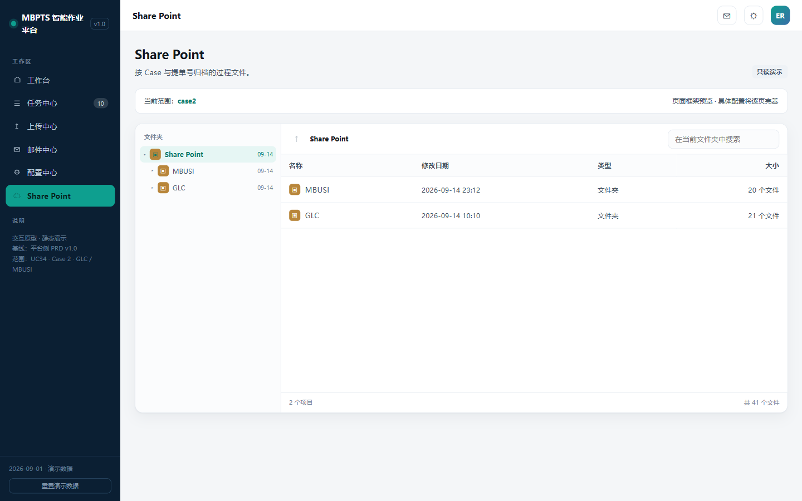

**页面元素与交互**:

| 元素 | 内容 | 交互与业务原因 |
|------|------|---------------|
| 目录树 | `<归档根>\<PDC>\MBUSI\<运行周>\<<BL> ETA <YYYY.MM.DD>>` 五级(命名规则 R1.3/BR-04) | 与业务线下归档习惯一致(T 盘现状沿用);按 PDC 分工的人直接进自己的仓目录 |
| 面包屑 + 「↑」返回 | 当前路径可点击跳级 | 跨周对比时快速切换 |
| 目录内搜索 | 当前文件夹内按文件名过滤(支持 BL 号片段) | 票文件夹名含 BL 号,搜号即定位票 |
| 文件列表列 | 名称(图标区分文件夹/xlsx/PDF)/修改日期/类型/大小(文件夹显示"N 个文件") | 核对"这票文件齐不齐"(齐套票文件夹应有 4 个文件=归档四件套,见 6.1) |
| 文件抽屉 | 行点击文件→抽屉:所在文件夹/类型/大小/修改时间 + 预览 + 「下载」「复制路径」 | 下载=取证;复制路径=贴给同事/IT 排障 |
| 底部统计 | "N 个项目 / 共 N 个文件" | 周归档完整性速查 |
| J8 带参跳入 | URL 携带票文件夹路径 → 自动展开目录树并定位 | 从任务详情一键到归档,闭环取证 |

**异常提示**:归档根不可达 → 空态提示联系 ADMIN 检查归档根配置;搜索无结果 → 提示"当前目录内无匹配文件"。

---

### 7.3.7 平台能力引用(F-M10)与上传中心(F-M11)

| 页面 | 截图 | 本线使用方式 |
|------|------|------------|
| 提醒中心 | [notify.png](./images/notify.png) | MBUSI 任务成功/异常(含漏数挂起、缺件)自动生成站内提醒,点击跳任务详情(J9);不外发邮件 |
| 治理运营台 | [govern.png](./images/govern.png) | DAG 监控、审计日志、证据总量(WORM);ADMIN/AUDITOR |
| 权限中心 | [rbac.png](./images/rbac.png) | 四角色只读查询;身份与授权由 Alice 管理 |
| 上传中心(F-M11) | [dim-tables.png](./images/dim-tables.png) | **漏数补登子表上传**(见下) |

**上传中心 · 漏数补登子表上传(F-M11,支撑支线 E / US-M03 AC4)**:

| 元素 | 内容 | 说明 |
|------|------|------|
| 上传表单 | BL 号(必填)+ 时间维度(运行周,必填)+ 子表文件(xlsx,≤20MB) | BRD 异常流程第 2 步的"指定提单+时间维度 Shipping Log 子表" |
| 服务端校验 | 文件格式/模板列结构校验;BL 号与子表内容一致性校验 | 校验失败拒绝并提示原因(7.6.2 文案) |
| 系统处理 | 上传成功→自动存至对应 PDC 目录(`<PDC>\MBUSI\<运行周>\`)→ toast 引导跳任务详情手动触发重跑(J12) | 子表落盘是手动重跑的数据前提(R3.3) |
| 前置动作(线下) | ①删除 IES 已生成旧预报 ②确认 Shipping Log 已更新至子表 | 线下人工动作,平台仅提供入口与记录,不做线上校验 |

**MBUSI 提醒类型与模板**(提醒中心,站内,不外发邮件):

| 触发事件 | 提醒标题模板 | 接收角色 | 点击行为 |
|---------|-------------|---------|---------|
| 缺件挂起(E4001) | "MBUSI 任务待上传:{BL号} 缺少 BL 提单附件" | OPERATOR | 跳任务详情缺件处理区(J9),提醒置已读 |
| 漏数挂起(E4004) | "MBUSI 漏数挂起:{BL号} 已收提单但大表未登记" | OPERATOR | 跳任务详情漏数处理区(J9) |
| 识别有差异(G2/E3001) | "MBUSI 任务有差异:{BL号},请核对{N}个字段" | OPERATOR | 跳任务详情,自动定位差异字段 |
| 节点失败(E3002/E3003) | "MBUSI 任务失败:{BL号} @ {节点},可检查点续跑" | OPERATOR | 跳任务详情失败节点 |
| 周批次完成 | "MBUSI 本周批次完成:共 X 票,待人工 Y 票" | OPERATOR/MANAGER | 跳工作台 |
| 大表回写持续失败(E5002) | "大表回写重试中:{BL号} {列}" | ADMIN | 跳治理运营台 |
| 导出失败(E4005) | "MBUSI 本周批量未启动:gvShipLog 导出失败" | OPERATOR/MANAGER/ADMIN | 跳工作台(调度信息条变红) |

操作:「全部已读」;未读高亮;提醒不产生票级状态变化,仅是 J9 入口。

---

## 7.4 节点实现规格(MBUSI 10 节点)

> 回答"平台怎么实现":每票在平台上的执行被拆解为 10 节点 ×(输入→子步骤→输出→检查点→失败处理),节点间设 3 道闸口。**检查点(CP)是"失败续跑/节点级重跑"的落点**(R7.3)。

### 7.4.1 票与任务的创建时机(先约定)

- **Task 创建时机 = 大表新增登记即建**:节点 2 每登记一个 BL 号(去重后)即创建 Task+R#1;**匹配只是状态闸口**(G1),不是建票条件——漏数挂起票(邮件先到、大表未登记)同样建 Task,状态=待上传(WAIT_INPUT,挂起原因=漏数),在任务中心"待上传"chip 可见可处置(R3.4)。
- **节点分级**:N1/N2 为**批量级**,每轮批量执行一次,挂在 BatchRun 上,产物(gvShipLog、登记结果、单票 Excel)对本轮全部票级 Run 共享;N3~N10 为**票级**,挂在各票 Run 上,严格按 3→10 顺序执行。**单票重跑/新建任务不触发 N1/N2**(R7.5)。
- 任一节点失败 → Run=FAILED,可从最近检查点续跑;节点级重跑=从指定节点重跑后续链(R7.2)。
- 配置快照(R4.4):模板版本/对应表版本/阈值在 Run 启动时固化。

### 7.4.2 节点规格表

| 节点 | 输入 | 子步骤 | 输出 | 检查点 | 失败处理 |
|------|------|--------|------|--------|---------|
| **N1 下载 gvShipLog**【批量】 | 调度触发(BatchId+窗口=上周一至周日)/手动补跑(J14);导出通道配置(D4) | 1.1 读通道配置 → website_export:登录网站→Customer Information > Shipments > MB China→Export to Excel;file_pickup:就位校验(文件名/时间窗,OPEN-M16) → 1.2 解析 16 列(§8.0.4) → 1.3 原始文件落盘 | GvShipLogRecord 行集、原始 Excel、table 证据 | CP1 导出文件落盘(断点续导,防重) | 网站不可达/登录失败/文件未就位→按配置重试(指数退避)→E4005:本轮批量 FAILED+调度告警,**不更新大表** |
| **N2 筛新增+登记+拆分**【批量】 | N1 行集;大表已登记 BL 清单 | 2.1 按 O 列 created∈窗口筛新增 → 2.2 与大表防重(已登记→E4002 跳过) → 2.3 PDC/ETA 校验(缺失→E4003 转人工不建夹) → 2.4 登记大表美线 sheet(列映射 §8.0.4) → 2.5 行集拆分单票 Excel 入 `<PDC>\MBUSI\<运行周>\` → 2.6 逐 BL 建 Task+R#1 | 大表登记记录、单票 Excel、Task+R#1 | CP2 登记完成清单(断点续登,防重) | 大表不可写→E5002 入队重试+告警;单票拆分失败→记异常,**不阻断其他票** |
| **N3 填 Shipping Log 基础字段** | 本票 gvShipLog 行集;模板快照(R4.4) | 3.1 按 §8.0.2 映射填前 5 列(AVIS/Shipping Log No.~Seal Number;箱级展开) → 3.2 VOL/Load 留空待回填 → 3.3 存入票文件夹 | Shipping Log(待回填版)、table 证据 | CP3 基础字段已填 | 模板版本与流程不兼容→E2002 转配置中心;gvShipLog 必填列空→记异常转人工 |
| **N4 下载邮件附件+G1 匹配** | 本票 BL 号;暂存台账 | 4.1 按 R-MBUSI-BL 监听/接收 CMA CGM 邮件 → 4.2 BL 号提取(OPEN-M6)入暂存+台账 pending(同 BL 留最新版 R2.3) → 4.3 **G1 匹配闸口**:与大表已登记 BL 精确匹配(BR-06) → 4.4 匹配成功:下载重命名 `BL_<BL号>.pdf` 入票文件夹,台账 pending→processed | BL PDF、email 证据、暂存版本记录 | CP4 BL PDF 入票文件夹 | 未匹配(漏数)→E4004:建/更新漏数挂起 Task(WAIT_INPUT-漏数),不删不处理;大表有登记但邮件未到→WAIT_INPUT-缺件(E4001);单邮件解析不出 BL 号→记异常转人工,不阻断其他邮件 |
| **N5 OCR 识别** | CP4 放行的 BL PDF;OCR Schema(cma_cgm_bl) | 5.1 OCR 集装箱明细+预报要素(F-05/F-06/F-08~F-14,箱级展开) → 5.2 置信度评估与质量分级 | FieldResult×箱级行(来源/置信度/质量等级/原文定位)、ocr 证据 | CP5 OCR 原始结果落盘 | OCR 服务异常→重试→FAILED;**任一字段置信度<阈值(建议 0.85,OPEN-M22)→ Run=DIFF_PENDING,停在 G2 待人工,不进 N6** |
| **N6 填 BL 模板+回填 Shipping Log** | FieldResult(N5 通过或人工修正后);gvShipLog 行集;模板快照 | 6.1 按 §8.0.3 填 BL 模板 9 列 → 6.2 VOL/Load 回填 Shipping Log(来源优先级 OPEN-M10:建议以已校验 BL Excel 为准) → 6.3 必填校验(FR-03) → 6.4 两模板存票文件夹 | BL 模板 xlsx、Shipping Log(完整版) | CP6 两模板齐备 | 必填缺失→E4001 挂起转人工(不上传不完整模板);模板版本不兼容→E2002 |
| **N7 导入 Shipping Log**(IES) | 两模板;IES 会话 | 7.1 进口管理-发票信息按 BOL(F-07)查询 → 7.2 批量导入 Shipping Log → 7.3 **G3 等绿灯** → 7.4 绿灯后上传(R5.1) | IES 导入结果、screen 证据、绿灯记录 | CP7 绿灯通过(续跑从此后) | 红灯/必填校验不过→FAILED 转人工(不臆改);IES 超时→E3002 检查点续跑 |
| **N8 生成预报**(IES) | N7 完成 | 8.1 全选发票 → 8.2 点击生成预报 → 8.3 填预报信息(来源提单;港口经 IES Port 对应表转换) | 预报、screen 证据 | CP8 预报已生成(**此后整单重跑=对外动作,3.1#1**) | 港口对应表未命中→记异常转人工(不自动放行);IES 失败→E3002 检查点续跑 |
| **N9 导入 BL 模板+差异捕获**(IES) | N8 完成;BL 模板 | 9.1 进口预报按提单号查询→修改 → 9.2 集装箱信息导入 BL Excel → 9.3 **差异弹窗完整捕获→回写 BL different(不阻断,R5.2)**;无差异→生成台账成功 → 9.4 回写台账状态列 | 预报+台账(无差异)/差异记录+弹窗截图 | CP9 导入与差异捕获完成(台账生成=3.1#1 对外动作) | 弹窗无法解析→截图存证+E3003,FAILED 转人工;其他 IES 失败→E3002 检查点续跑 |
| **N10 上传 BL PDF+归档+回写** | N9 完成;暂存原件 | 10.1 IES 上传 BL PDF(选择文件类别,类别 OPEN-M14)→ 全部传完保存(R5.3)(**保存=3.1#2 对外动作**) → 10.2 按 `<归档根>\<PDC>\MBUSI\<运行周>\<<BL> ETA <YYYY.MM.DD>>` 归档四件套 → 10.3 回写完成列 → 10.4 台账 pending→processed;有差异记录时终态置 DIFF_PENDING,否则 SUCCEEDED | 归档文件包、回写完成、file 证据 | CP10 上传保存完成 | 上传失败→E3002 检查点续跑;归档根不可达→入队重试+告警(不影响 IES 侧已保存事实);回写失败→E5002 入队重试 |

### 7.4.3 节点间闸口(3 道)

| 闸口 | 位置 | 判断 | 不放行后果 |
|------|------|------|-----------|
| **G1 匹配闸口** | N4 内 | 提单 BL 号与大表已登记 BL 精确匹配(BR-06) | 未匹配 → Run=WAIT_INPUT(漏数挂起),任务详情漏数处理区人工处置(R3.4);补登捕获后从 N4 续跑 |
| **G2 质量闸口** | N5→N6 | 全部字段置信度≥阈值(建议 0.85,OPEN-M22) | Run=DIFF_PENDING,OPERATOR 修正后节点级重跑(从 N5/N6) |
| **G3 绿灯闸口** | N7 内 | IES 批量导入绿灯(R5.1) | 不上传;FAILED 转人工 |

---

## 7.5 性能与数据量级预期(MBUSI)

> 本节回答"每个功能在多大数据量下、多快算达标"。分两层:**7.5.1 业务量级假设**(标【假设】,最终以 OPEN-M8 业务确认为准,确认后只改假设不改设计)与 **7.5.2~7.5.4 设计容量与性能预算**(开发/测试验收按此执行,按峰值假设设计)。

### 7.5.1 业务数据量级基线(设计输入假设)

| 对象 | 单票量级 | 周量级【假设】 | 年累计【假设】 | 依据 |
|------|---------|--------------|--------------|------|
| MBUSI 票(BL 号) | — | **50 票/周,峰值 150 票/周**【待确认 OPEN-M8】 | ~2,600 票(峰值 ~7,800) | 美线周航班经验值,待业务给实际量级 |
| 收单邮件 | 1 封/票(CMA CGM 提单,同 BL 重复保留最新版) | ~50~150 封 | ~7,800 封 | R2.1 单规则 |
| 暂存附件 | 1 个 PDF/票(CMA CGM BL,4~10 页) | ~150 个文件,~1,500 页 | — | 提单常规页数经验值 |
| OCR 识别页数 | ~10 页/票 | ~1,500 页(峰值 ~4,500 页) | — | 同上 |
| 单票 Excel 行数 | 行数=箱数(一 BL 多箱多行) | ~数百行 | — | BR-03 行集 |
| 识别字段(FieldResult) | 15 字段/票(箱明细字段按箱展开) | ~2,250 条 | ~12 万条 | 8.0.1 |
| 大表回写 | 最多 4 类写入点×次数/票(R6 矩阵) | ~600 次写入 | ~3.1 万次 | R6 |
| 归档存储 | 5~15 MB/票(含原件+两模板+单票 Excel+证据) | ~1 GB/周 | **~50 GB/年** | 票据 PDF 体积经验值 |
| 站内提醒 | 1~3 条/票 | ~450 条 | ~23,000 条 | 7.3.7 提醒模板 |
| 任务中心列表 | — | — | 年 ~8 千行(含历史),三年 ~2.5 万行 | 列表分页设计前提 |

### 7.5.2 页面性能预期(验收口径)

| 页面/操作 | 性能指标 | 数据规模前提 |
|----------|---------|-------------|
| 工作台统计卡加载 | ≤2s | 单线年累计 8 千票 |
| 工作台「立即补跑」触发响应 | 确认后 ≤1s 返回受理(toast 计数异步刷新) | 触发为异步受理,不等批次跑完 |
| 任务中心列表(含 6 项筛选+搜索) | 首屏 ≤2s,翻页 ≤1s | 8 千行,20 条/页;BL 号归一搜索走索引 |
| 任务中心导出 CSV | ≤8 千行 ≤30s;超限转异步生成+提醒下载 | 仅 MANAGER,当前筛选生效 |
| 任务详情加载(Run/节点/字段/证据清单) | ≤3s | 单票字段 ≤数百行(箱级展开),证据 ≤50 条 |
| PDF 原文预览(单页渲染/「定位」跳转) | ≤2s/页 | 大文件不整本加载,分页拉取 |
| 字段修正保存(留痕) | ≤1s | 行级写 |
| 补传文件上传 | ≤20MB 文件 ≤30s 完成校验(含 BL 号一致性解析) | 逐槽位 |
| 规则 dry-run | ≤10s/样本邮件 | 单封真实匹配 |
| 配置中心模板上传/对应表保存 | ≤10s / ≤2s | ≤20MB / 对应表 ≤1,000 行 |

### 7.5.3 节点单票耗时预算与周批量预算(验收口径)

> 约束:周批量总时长 <2 小时(第十部分非功能需求)。下表按峰值 150 票测算,**这是 D1(IES 交互方式)选型的量化依据**。

| 节点 | 单票耗时预算 | 说明 |
|------|-------------|------|
| N1/N2 导出+登记(批量) | 全量 ≤20 分钟(非按票) | 1 次网站导出 + 全量筛选/登记/拆分 |
| N3/N6 写两模板 | ≤10 秒/票 | 纯计算 |
| N4 邮件匹配+下载 | ≤30 秒/票 | ~150 封邮件扫描归并(批量摊销) |
| N5 OCR 识别 | ≤1 分钟/票 | ~10 页/票;OCR 服务可横向扩容,不构成瓶颈 |
| N7 导入 Shipping Log(IES) | **3~5 分钟/票**(UI 自动化口径) | 查 BOL→批量导入→等绿灯 |
| N8 生成预报(IES) | **1~2 分钟/票** | 全选发票+填预报信息 |
| N9 导入 BL(IES) | **2~4 分钟/票** | 集装箱导入+差异弹窗捕获 |
| N10 上传+归档+回写 | **1~2 分钟/票** | 附件上传+归档写入+回写队列 |

**批量时长测算(峰值 150 票)**:

| 执行方式 | IES 段(N7+N8+N9+N10)总耗时 | 结论 |
|---------|--------------------------|------|
| 串行(1 会话) | 150 票 × 7~13 分钟 ≈ **17.5~32.5 小时** | ❌ 远超 2 小时,不可行 |
| 并行 4 会话 | ≈ 4.4~8.1 小时 | ❌ 仍不可行 |
| 并行 8 会话 | ≈ 2.2~4.1 小时 | ❌ 不达标 |
| **IES 接口通道(批量 API)** | 预计分钟级~1 小时内 | ✅ 唯一可达标路径 |

**结论(写入 D1 决策要求,与 GLC 同口径)**:在峰值假设下,**UI 自动化(RPA)无论并行度如何都无法满足 <2 小时预算,D1 概要设计必须优先评估 IES 接口通道**;若最终业务量确认远低于峰值(如 ≤15 票/周),RPA+4 并行可作为过渡方案。此测算随 OPEN-M8 确认后更新。

### 7.5.4 超限与降级策略

| 场景 | 策略 |
|------|------|
| 周票量超峰值假设 | 调度按票切片执行+进度可视(任务中心"执行中"计数);不阻断,仅告警提示评估扩容 |
| OCR 服务排队 | N5 入队,节点面板显示"排队中";OCR worker 水平扩展 |
| 列表/导出超阈值 | 列表强制分页(不分页接口禁出全量);导出 >8 千行转异步 |
| 归档存储增长 | 每年 ~50 GB;归档根容量监控纳入治理运营台,超 80% 告警 ADMIN |
| IES 会话失效/限流 | N7~N10 检查点挂起重试(E3002),并发会话数做配置项,不超 IES 允许上限【待确认:IES 并发会话上限,并入 D1】 |
| 网站导出通道不可用 | file_pickup 兜底(D4);E4005 告警后业务放指定位置,手动补跑(J14)恢复 |

---

## 7.6 页面设计通用规格(全部页面适用)

> 各页特有设计见 7.3.x;本节为横向统一规格,页面引用不重复描述。目标:开发仅凭本节+7.3.x 即可实现,无需猜测控件行为与文案。

### 7.6.1 表单控件规格

**(a) 新建任务弹窗(任务中心「新建任务」)**:

| 字段 | 控件 | 默认值/占位符 | 校验时机 | 校验规则与错误文案 | 字段联动 |
|------|------|--------------|---------|-------------------|---------|
| 线路 | 下拉 | 默认 MBUSI(本线文档口径) | 提交时 | 必选 | 决定 caseId 与后续流程 |
| BL 号 | 输入框 | 占位:"输入提单号(Booking Number)" | **失焦即查**:归一(OPEN-M6)+存在性预检+大表登记状态预检 | 格式【OPEN-M11】;已存在→即时黄条"BL 号 {no} 已存在任务,[点击跳转]"(E4002);大表未登记→黄条"大表未登记该 BL,将按漏数挂起流程处理" | 归一后作为去重键 |
| BL 文件 | 上传槽(可选) | 占位:"BL PDF,≤20MB;不传则自动关联暂存已有附件" | 选择即校验 | 仅 PDF ≤20MB;不符→槽位红字 | 不传且暂存无附件→建票即挂待上传-缺件 |
| 提交按钮 | 主按钮 | "创建并执行" | — | 提交中禁用+loading(防重) | 成功→建 Task+R#1 从 N3 起跑,跳详情(J13) |

**(b) 补传弹窗(任务详情「补传文件」,缺件票)**:BL PDF 单槽位,槽位标题=角色+期望文件名规则(取命中 MailRule 附件角色正则);选择即校验类型/大小;「确认补传」提交时做 **BL 号一致性解析**,不符→槽位红字"文件 BL 号与本票不符";提交成功后从 N4 自动续跑。提交中按钮禁用防重。

**(c) 批量重跑确认弹窗(任务中心)**:清单列=任务号/当前状态/可重跑性标注(可重跑/跳过-执行中/需主管-已发生对外动作);行可移除;「确认重跑」仅在剩余 ≥1 张可重跑票时激活;提交中禁用;结果 toast 见 7.6.2。

**(d) 整单重跑确认弹窗(任务详情,已发生 3.1 对外动作)**:逐项列出已发生对外动作(动作/发生节点/时间)+后果说明;须勾选"已知悉上述后果"才激活「确认重跑」;仅 MANAGER 可见此按钮(R7.4)。

**(e) 标记无效弹窗(任务详情)**:原因下拉(重复到邮/业务取消/测试数据/其他);选"其他"时备注必填;提交时校验,成功 toast"任务已关闭"。

**(f) 漏数确认续跑阻断提示(任务详情)**:「确认续跑」复核大表未登记时,弹阻断提示"大表未登记该 BL,请先在线下大表补登;补登后下轮调度将自动捕获,或补登完成后再点此按钮"。

**(g) 规则编辑器**:三段式字段定义见 7.3.4;控件补充:附件要求为行内可增删表格;正则字段**失焦即时校验**并红字定位;dry-run 样本选择器=下拉(最近 50 封样本邮件);保存按钮提交中禁用。

**(h) 上传中心补登子表表单(上传中心)**:字段=BL 号(必填,失焦归一+查暂存/任务存在性)/ 时间维度-运行周(必填,下拉最近 8 周)/ 子表文件(xlsx ≤20MB,选择即校验);提交时服务端校验模板列结构与 BL 号一致性;成功 toast"子表已上传并存入 {PDC} 目录,请前往任务详情触发重跑"+跳转链接(J12)。

### 7.6.2 全局文案规格表

**术语约束**(全平台统一,禁止混用):**重跑**=生成 R#N+1(整单/节点);**续跑**=从检查点继续;**补跑**=手动触发整个批次(工作台);**补传**=缺件时上传附件。

| 场景 | 标准文案 |
|------|---------|
| 批量重跑结果 | "已重跑 X 票 / 跳过 Y 票(执行中)" |
| 补传成功 | "补传成功,已自动续跑" |
| 修正保存 | "修正已留痕,需重跑后生效" |
| 确认继续等待(缺件) | "已记录,下轮调度将继续尝试匹配提单邮件" |
| 漏数继续等待 | "已记录,补登后下轮调度将自动捕获续跑" |
| 漏数确认续跑成功 | "已确认,开始续跑" |
| 漏数确认续跑阻断 | "大表未登记该 BL,请先补登" |
| 标记无效 | "任务已关闭" |
| 手动补跑触发 | "已触发:新增 X 票 / 跳过 Y 票(重复)" |
| 补登子表上传成功 | "子表已上传并存入 {PDC} 目录,请前往任务详情触发重跑" |
| 任务中心空态 | "本周暂无 MBUSI 任务,可前往工作台手动补跑" |
| 筛选无结果 | "无匹配任务,试试清除筛选" |
| 权限不足 | "当前角色无权执行此操作"(E5001) |
| 通用错误 toast 格式 | "{错误码} {一句话原因}"(技术细节折叠) |
| 重跑类确认弹窗标题 | 整单="确认整单重跑(将生成 R#{N+1})";节点="确认从 {节点} 续跑" |

### 7.6.3 权限 × 状态 × 操作总矩阵

> 前端按矩阵渲染按钮,后端按矩阵做接口级鉴权(越权一律 E5001+审计)。状态前提列=按钮可见的任务状态条件。

| 操作 | OPERATOR | MANAGER | ADMIN | AUDITOR | 状态前提 |
|------|:---:|:---:|:---:|:---:|---------|
| 查看(工作台/列表/详情/归档/规则/配置) | ✓ | ✓ | ✓ | ✓ 只读 | 任意 |
| 字段修正(留痕) | ✓ | — | — | — | 仅 DIFF_PENDING + 当前生效 Run |
| 补传/确认等待/标记无效(缺件) | ✓ | ✓ | — | — | 仅 WAIT_INPUT-缺件 |
| 漏数确认续跑/继续等待/标记无效 | ✓ | ✓ | — | — | 仅 WAIT_INPUT-漏数 |
| 撤销标记无效 | — | ✓【OPEN-M13】 | — | — | 已关闭 |
| 检查点续跑 | ✓ | ✓ | — | — | 仅 FAILED |
| 整单重跑(安全) | ✓ | ✓ | — | — | 非执行中且未发生 3.1 动作 |
| 整单重跑(对外动作后) | — | ✓ | — | — | 已发生 3.1(含 SUCCEEDED) |
| 批量重跑 | ✓(对外票自动剔除) | ✓ | — | — | 逐行校验 |
| 新建任务 | ✓ | ✓ | — | — | — |
| 手动补跑(工作台) | ✓【OPEN-M18】 | ✓ | — | — | — |
| 上传补登子表(上传中心) | ✓ | ✓ | — | — | — |
| 导出列表 | — | ✓ | — | — | — |
| 规则编辑/启停/dry-run | — | — | ✓ | — | — |
| 模板/对应表/调度/导出通道维护 | — | — | ✓ | — | — |
| 执行中任务的任何写操作 | — | — | — | — | 执行中=只读 |

### 7.6.4 数据展示规范

| 项 | 规范 |
|----|------|
| 日期时间 | 页面展示 `YYYY.MM.DD HH:mm`;**CSV 导出一律 `YYYY-MM-DD`** |
| 数字 | 体积 m³ 保留 3 位小数、重量 KG 保留 1 位;千分位不额外加逗号 |
| BL 号 | 一律展示全号(Booking Number 原样);搜索框接受模糊输入,按归一规则处理(去空格/大小写,OPEN-M6) |
| 空值 | 一律显示 "--"(不显示 null/undefined/空白) |
| 超长文本 | 异常摘要等列 ≤30 字截断 + tooltip 全文 |
| 状态色 | 执行中=蓝 / 待上传=橙 / 有差异=金 / 失败=红 / 已完成=绿(全局一致) |
| 质量等级 | 高=无色 / 中=蓝 tag / 低=金色高亮(与差异定位色一致) |
| 挂起原因 tag | 缺件=橙 outlined / 漏数=橙 filled(待上传态内区分) |

### 7.6.5 边界与并发场景

| 场景 | 系统行为 |
|------|---------|
| 按钮防重 | 所有提交类按钮点击后即禁用+loading 至响应返回;后端幂等(重跑/补传/修正重复提交返回首次处理结果,不生成重复 Run/记录) |
| 并发修正同一字段 | 提交时校验该字段当前生效版本;若已被他人修正→阻断并提示"该字段已被 {人} 于 {时间} 修正,请刷新查看最新值"【策略待确认 OPEN-M20,建议版本校验】 |
| 补传与邮件到达竞争 | 同 BL 匹配/归并按 BL 号加锁;若人工补传时该件恰已到邮→提示"该附件已到邮,无需补传",以先入库者为准 |
| 漏数补登与调度捕获竞争 | 手动「确认续跑」与下轮调度自动捕获幂等:先到者触发续跑,后到者因"执行中"跳过(6.2.1 关键点 #5),不产生重复 Run |
| Session 过期 | 弹登录提示;未提交的表单内容前端本地缓存,重新登录后回填 |
| 列表状态过期 | 任务中心执行中票行每 30s 轮询刷新;其余操作后即时刷新 |
| IES 会话中断 | 用户侧可见=任务 FAILED(E3002)+失败节点红标,走检查点续跑 |
| 大 PDF 预览 | >20 页文件分页拉取,「定位」跳转只渲染目标页,不整本加载 |

---

# 第八部分:数据需求

## 8.0 字段级设计(P06/P07 新增)

> 核心原则:**每个字段都必须能回答"为什么存在、数据从哪里来、谁使用它、它影响什么"。**

### 8.0.1 识别字段(F-01~F-15,任务详情"当前识别数据"区)

> 标注【待确认】项以供应商 OCR Schema 与大表模板终稿为准(OPEN-M6/M12)。所有字段均为 Run 级数据,修正仅 OPERATOR、仅当前生效 Run、留痕不审批。容器类字段(F-08~F-13)为**箱级行结构**(一 BL 多箱多行,行数=gvShipLog 该 BL 行集行数)。

| # | 字段 | 类型 | 必填 | 来源 | 可编辑 | 取值/校验 | 业务原因(为什么存在) | 影响(它改变什么) |
|---|------|------|:---:|------|:---:|---------|---------------------|------------------|
| F-01 | Booking No.(BL 号) | 文本 | 是 | gvShipLog D 列;暂存侧提取口径【待确认 OPEN-M6】 | ✓ | 非空;归一规则(去空格/前缀)【待确认】 | 票粒度主键;大表防重键;暂存归并键;BR-06 精确匹配键 | Task 编号 T-BL号、暂存归并、去重、文件夹命名 `<BL> ETA …` |
| F-02 | Shipping Log No.【待确认】 | 文本 | 是 | gvShipLog A 列 Ship Log File ID(Q28 实测)【待确认 OPEN-M12】 | ✓ | 非空 | Shipping Log 模板第 1 列、BL 模板第 2 列关联键;大表登记 E 列(初版注) | 两模板填写、大表登记 |
| F-03 | PDC | 文本 | 是 | gvShipLog G 列(Q28) | ✓ | 非空 | 归档目录层级;业务按仓分工口径;GLC/MBUSI 子目录区分 | 归档路径 `<PDC>\MBUSI\…`;缺失→E4003 不建夹转人工 |
| F-04 | ETA | 日期 | 是 | gvShipLog H 列(Q28) | ✓ | 日期;展示 YYYY.MM.DD | 归档文件夹名 "ETA YYYY.MM.DD" 段(BR-04) | 文件夹命名;缺失→E4003 转人工 |
| F-05 | Departure Port | 文本 | 是 | gvShipLog E 列(Q28)/ BL PDF | ✓ | 英文港口名 | 预报起运港;经 IES Port 表转换 | 预报内容 |
| F-06 | Arrival Port | 文本 | 是 | gvShipLog F 列(Q28)/ BL PDF | ✓ | 英文港口名 | 预报到港;经 IES Port 表转换;大表登记 D 列(初版注) | 预报内容、大表登记 |
| F-07 | BOL(发票查询号)【待确认】 | 文本 | 是 | gvShipLog M 列(Q28) | ✗ | 非空 | IES 发票信息查询输入(按 BOL 查询) | 节点 7 发票查询 |
| F-08 | Container No. | 文本 | 是 | gvShipLog J 列 / BL PDF(OCR) | ✓ | 箱号格式(4 字母+7 位)【待确认】 | Shipping Log 模板第 3 列、BL 模板第 4 列;箱级行键 | 两张模板填写、IES 导入 |
| F-09 | Container Type | 文本 | 是 | gvShipLog K 列(加 `'`)/ BL PDF | ✓ | 单位由 `"` 改 `'` | Shipping Log 模板第 4 列、BL 模板第 5 列 | 模板填写 |
| F-10 | Seal No. | 文本 | 是 | gvShipLog L 列 / BL PDF(OCR) | ✓ | 非空 | Shipping Log 模板第 5 列、BL 模板第 6 列 | 模板填写 |
| F-11 | Package Qty | 数值 | 是 | gvShipLog N 列 / BL PDF(OCR) | ✓ | ≥1 整数 | BL 模板第 7 列 | BL 模板填写 |
| F-12 | Container VOL (m³) | 数值 | 是 | BL PDF(OCR)→ BL Excel(优先级 OPEN-M10) | ✓ | ≥0 数值 | Shipping Log 模板第 6 列、BL 模板第 9 列;**网站导出无此值,必须从提单获取(BR-08)** | 两模板填写;回填 Shipping Log |
| F-13 | Container Load (KG) | 数值 | 是 | 同 F-12 | ✓ | ≥0 数值 | Shipping Log 模板第 7 列、BL 模板第 8 列;同 BR-08 | 同 F-12 |
| F-14 | 船名/航次(Vessel/Voyage)【待确认】 | 文本 | 否 | BL PDF(OCR) | ✓ | 非空 | 预报信息来源于提单(BR-10),预报界面要素 | 预报内容 |
| F-15 | created(创建日期) | 日期 | 是 | gvShipLog O 列 | ✗ | 日期 | 新增判定口径;漏数补登后 update 不回溯,是下轮捕获的依据(R3.2) | 数据窗口筛选;漏数续跑触发 |

**字段间依赖关系**(开发必须实现):

- F-01 是全链主键:暂存归并、大表防重、Task 编号、文件夹命名均以其归一值为准。
- F-03/F-04 → 归档路径与文件夹命名;任一缺失 → E4003 不建不明确文件夹,转人工(BRD §8)。
- F-08 为箱级行键:F-08~F-13 按箱成行;行数 = gvShipLog 该 BL 行集行数。
- F-12/F-13 依赖节点顺序:必须先完成 BL 模板填写(节点 6 前半)才能回填 Shipping Log(节点 6 后半)——节点 3"VOL/Load 待 BL 回填"留口即因此。
- F-05/F-06 → IES Port 对应表转换;未命中 → 异常记录转人工(不自动放行)。
- F-15 只用于窗口判定与漏数捕获,不进入任何模板。

### 8.0.2 Shipping Log 导入模板(7 列)字段映射

| 模板列 | 取值来源 | 说明 |
|--------|---------|------|
| AVIS/Shipping Log No. | F-02 | 票标识(美线无 AVIS,取 Shipping Log No.)【待确认 OPEN-M12】 |
| MBZ/BOL | F-07 / F-01 | 发票查询号或提单号(IES 匹配键) |
| Container No. | F-08 | 箱级行 |
| Container Type | F-09 | 单位 `'` |
| Seal Number | F-10 | |
| Container VOL (m³) | F-12 | 自 BL 回填(BR-08) |
| Container Load (KG) | F-13 | 自 BL 回填(BR-08) |

### 8.0.3 BL 导入模板(9 列)字段映射

| 模板列 | 取值来源 | 说明 |
|--------|---------|------|
| No. | 序号(系统生成) | 行号 |
| Shipping log No./AVIS No. | F-02 | 与 Shipping Log 模板关联键 |
| HAWB/BL No. | F-01 | |
| Container No. | F-08 | |
| Container Type | F-09 | 单位 `'` |
| Seal No. | F-10 | |
| Package Qty | F-11 | |
| Container Load (KG) | F-13 | |
| Container VOL (m³) | F-12 | |

### 8.0.4 gvShipLog 列结构、大表登记映射 与 回写时机矩阵

**gvShipLog 16 列(初版 Q28 样本实测底稿)**:A Ship Log File ID(→F-02)/ D Booking Number(→F-01)/ E Departure Port(→F-05)/ F Arrival Port(→F-06)/ G PDC(→F-03)/ H ETA(→F-04)/ I ETD / J Container(→F-08)/ K Container Type(→F-09,加 `'`)/ L Seal(→F-10)/ M BOL(→F-07)/ N Package Qty(→F-11)/ O Created(→F-15)/ P Last Update。

**登记映射(节点 2,新增登记时写入大表美线 sheet)【待确认 OPEN-M12,以大表模板终稿为准】**:

| 大表美线 sheet 列(推断) | 写入内容 | 来源 |
|------------------------|---------|------|
| C 列 | PDC | F-03 |
| D 列 | Port(到港) | F-06 |
| E 列 | Shipping Log No. | F-02 |
| G 列 | ETA | F-04 |
| BL Number 列 | Booking Number | F-01(BR-06 匹配键) |

**回写时机矩阵(平台台账为主,双写大表)**:

| 列 | 内容 | 写入节点 | 写入值来源 | 失败处理 |
|----|------|---------|-----------|---------|
| BL different | IES 集装箱导入差异明细 | 节点 9 差异弹窗捕获后(回写后继续,P01) | 弹窗字段级明细 | E5002 入队重试+告警 |
| 台账生成状态列【待确认 OPEN-M12】 | 台账生成成功/有差异 | 节点 9 完成 | 节点结果 | 同上 |
| 异常反馈列【待确认 OPEN-M12】 | 异常描述(如"收到提单但大表未登记""PDC/ETA 缺失") | 任意节点异常时 | 异常描述 | 同上 |
| 新增登记行 | 见上"登记映射" | 节点 2 | gvShipLog 行集 | 同上 |

### 8.0.5 任务中心列表字段(逐列业务原因)

| 列 | 类型 | 来源 | 业务原因 | 影响 |
|----|------|------|---------|------|
| 任务编号(T-BL号) | 文本 | 系统生成 | 票的唯一锚点,沟通与检索口径 | 点击进详情 |
| case | 枚举 | Task.caseId | GLC/MBUSI 多线共存时的区分 | 筛选 |
| 触发来源 | 枚举 | Task | 区分 定时调度/手动创建/手动触发,用于自动化率统计口径 | 筛选、KPI |
| 状态(当前执行) | 枚举 | 最新 Run 状态映射(§8.1) | **异常分拣核心**,决定该票要不要人管 | chip 筛选、统计卡 |
| 挂起原因 | 枚举 | Run/异常记录 | 区分 缺件(等 BL 邮件)/ 漏数挂起(等大表补登),两条支线处置动作不同 | 待上传 chip 内二级区分 |
| 执行次数 | 数值 | Task.RunCount | 识别"反复失败的票"(≥3 次需重点关注) | 排序参考 |
| 最近执行开始 | 时间 | 最新 Run | 判断处理时效 | 排序 |
| 当前环节 | 文本 | 最新 Run 当前节点 | 不进详情即可定位票卡在哪 | 展示 |

## 8.1 数据模型(逻辑模型,MBUSI 相关实体)

| 实体 | 说明 | 关键字段 |
|------|------|---------|
| MailRule 邮件规则 | R-MBUSI-BL | id、监听邮箱、发件人白名单、主题关键词、附件区间、附件角色[]、绑定流程、去重键、优先级、启停 |
| AttachmentLedger 附件台账 | 暂存登记(key=BL号) | BL 号(归一)、角色(bl/shipping_log)、文件名、来源邮件、接收时间、状态(pending/processed)、版本(同 BL 留最新,接收时间判定) |
| StagingFile 暂存文件 | 暂存库引用 | BL 号、类型、路径、hash |
| GvShipLogRecord 大表记录 | gvShipLog 行(含行集归并) | Booking Number(BL 号)、created、PDC、ETA、行数据原文、登记状态 |
| Task 任务 | 业务单据(票粒度=BL 号,含漏数挂起票) | 任务号(T-BL号)、caseId(case-2-mbusi)、BL/HAWB、触发来源、当前状态、当前 Run 号、挂起原因(缺件/漏数) |
| Run 执行实例 | 一次执行(不可变) | Run 号、起因、状态、起止、耗时、携带修正版本、配置快照版本 |
| NodeExecution 节点执行 | MBUSI 10 节点轨迹(节点 1-2 批量级) | Run id、节点序号/名称、级别(批量/票)、状态、起止、输出摘要 |
| FieldResult 字段结果 | 识别+修正(F-01~F-15,容器字段箱级行) | 字段名、原值、来源(OCR/规则/gvShipLog)、置信度、质量等级、修正值/人/时间、原文定位 |
| Evidence 证据 | WORM 留痕 | 类型/子类型、路径、hash、Run/节点关联 |
| ConfigTemplate 模板配置 | Shipping Log/BL 模板 | 配置项、当前文件、版本、状态、列定义 |
| RefTable 对应表 | IES Port | 英文港口名、IES 港口名称、备注、版本 |
| WritebackRecord 回写记录 | 大表双写(登记+回写,覆盖写) | BL 号、列、值、时间、结果 |
| BatchRun 批量运行 | 每轮调度(批量级节点载体) | BatchId、数据窗口、导出通道、起止、结果摘要 |

**状态机**:
- Task:执行中 → 已完成 / 有差异(待人工)/ 待上传(缺件·漏数)/ 失败 →(人工处理+重跑)→ 执行中;标记无效 → 已关闭(终态)
- Run:PENDING → RUNNING → SUCCEEDED / DIFF_PENDING / WAIT_INPUT / FAILED
- AttachmentLedger:pending → processed(漏数票可多轮保持 pending,被下轮调度捕获)

**Task-Run 状态映射表(任务中心 chip 口径,P03)**:

| Task 展示状态(任务中心 chip) | 最新 Run 状态 | 含义 | 允许的人工动作 |
|------------------------------|--------------|------|---------------|
| 执行中 | PENDING / RUNNING | 自动执行中 | 不可重跑(跳过);可查看 |
| 待上传 | WAIT_INPUT | 缺件挂起(等 BL 邮件)/ 漏数挂起(等大表补登),以挂起原因区分 | 缺件:补传/确认等待/标记无效(R3.5);漏数:确认续跑/继续等待/标记无效(R3.4) |
| 有差异 | DIFF_PENDING | OCR 低置信(G2)/ IES 差异已回写 BL different | 字段修正+重跑(OPERATOR) |
| 失败 | FAILED | 节点失败(含弹窗捕获失败 E3003) | 检查点续跑/整单重跑 |
| 已完成 | SUCCEEDED | 全部完成 | 整单重跑(仅 MANAGER,R7.4) |
| 待人工处理(聚合 chip) | WAIT_INPUT ∪ DIFF_PENDING ∪ FAILED | 快捷筛选口径,非独立状态;工作台"待人工处理"卡同口径 | — |

**票创建时机约定(P08)**:Task 创建时机=大表新增登记成功(节点 2);漏数挂起票创建时机=邮件附件入暂存且当轮匹配失败;新建任务=手动创建。节点 1-2 为批量级,挂在 BatchRun 上,执行结果以输出摘要关联到本轮各票;票级节点 3-10 挂在各票 Run 上。

## 8.2 API 接口(平台前后端,MBUSI 相关)

| 接口 | 方法 | 说明 |
|------|------|------|
| /api/workbench/summary?line=mbusi | GET | MBUSI 统计卡(待人工处理=待上传∪有差异∪失败) |
| /api/tasks | GET/POST | 任务列表(line=mbusi)/ 新建 MBUSI 任务(BL 号校验) |
| /api/tasks/{id} | GET | 任务详情(Runs/节点/字段/证据/挂起原因) |
| /api/tasks/{id}/rerun | POST | 重跑(full/node/batch;full 对外动作后需 MANAGER) |
| /api/runs/{runId}/fields/{fieldId}/correct | POST | 字段修正留痕 |
| /api/tasks/{id}/attachments | POST | 缺件补传(BL PDF 校验) |
| /api/rules、/api/rules/{id}、/toggle、/dry-run | GET/POST/PUT | MBUSI 规则管理 |
| /api/configs、/api/configs/{id}/versions | GET/POST | Shipping Log/BL 模板版本 |
| /api/ref-tables/ies-port | GET/PUT | IES Port 对应表 |
| /api/staging/{blNo}、/resume | GET/POST | 暂存查询 / 漏数票确认续跑(复核大表已登记) |
| /api/tasks/{id}/hold-confirm | POST | 挂起确认(继续等待/标记无效+原因)(R3.4/R3.5) |
| /api/upload/shipping-log-sub | POST | 漏数补登子表上传(F-M11,指定提单+时间维度,落 PDC 目录) |
| /api/schedule/trigger | POST | 工作台手动补跑(line=mbusi,窗口=上周一至周日,同窗口去重;OPERATOR/MANAGER) |
| /api/writeback?blNo= | GET | 回写状态 |
| /api/archive/tree、/files | GET | MBUSI 归档浏览(只读) |
| /api/export/tasks.csv | GET | 导出(MANAGER;字段=列表列+最近 Run 状态/耗时) |

**页面-操作-接口映射**(开发可直接按表实现前后端联动):

| 页面 | 用户操作 | 调用接口 | 触发时机 | 关键业务逻辑(后端) |
|------|---------|---------|---------|---------------------|
| 工作台 | 进入页面 | GET /api/workbench/summary?line=mbusi | 页面加载 | 4 口径统计(待人工处理=聚合不互斥,按最新 Run) |
| 工作台 | 「立即补跑本周批次」 | POST /api/schedule/trigger | 点击确认后 | 同窗口 BL 号去重;返回新增/跳过计数 |
| 任务中心 | 筛选/搜索/翻页 | GET /api/tasks | 条件变更即查 | status=manual 走聚合口径;BL 号归一(OPEN-M6)后匹配 |
| 任务中心 | 「新建任务」提交 | POST /api/tasks | 表单校验通过后 | 建 Task+R#1,从 N3 起跑;BL 已存在→E4002;大表未登记→按漏数挂起 |
| 任务中心 | 「批量重跑」确认 | POST /api/tasks/{id}/rerun{type:full}(逐票) | 确认弹窗后 | 执行中跳过;3.1 对外动作票校验 MANAGER(R7.4) |
| 任务中心 | 「导出列表」 | GET /api/export/tasks.csv | 点击 | 当前筛选生效;仅 MANAGER |
| 任务详情 | 进入/切 Run | GET /api/tasks/{id} | 页面加载、Run chip 切换 | 历史 Run 只读标记 |
| 任务详情 | 字段「修正」保存 | POST /api/runs/{runId}/fields/{fieldId}/correct | 行内校验通过后 | 仅 OPERATOR+当前 Run+DIFF_PENDING;留痕不审批;修正写入当前生效版本 |
| 任务详情 | 「补传文件」 | POST /api/tasks/{id}/attachments | 槽位校验通过后 | PDF/≤20MB/BL 号一致性;入暂存→自动 N4 续跑 |
| 任务详情 | 「确认续跑」(漏数) | POST /api/staging/{blNo}/resume | 点击后 | **复核大表已登记**→台账取回附件从 N4 起跑;未登记→阻断提示 |
| 任务详情 | 「确认继续等待」/「标记无效」 | POST /api/tasks/{id}/hold-confirm | 二次确认/必填原因后 | wait=保持挂起;invalid=任务关闭(留痕) |
| 任务详情 | 「整单重跑」/「检查点续跑」 | POST /api/tasks/{id}/rerun{type:full|node,from:CPx} | 确认弹窗后 | 生成 R#N+1,携带修正值与新配置快照 |
| 邮件中心 | 启停/优先级 | PUT /api/rules/{id}、/toggle | 即时 | 不影响已建任务 |
| 规则编辑器 | dry-run | POST /api/rules/dry-run | 选样本后 | 真实匹配逐条件返回,不产生任务 |
| 规则编辑器 | 保存 | PUT /api/rules/{id} | 校验通过后 | 版本+1,对新邮件生效;E1001 阻断 |
| 配置中心 | 模板上传/恢复版本 | POST /api/configs/{id}/versions | 校验通过后 | E2001/E2002;版本+1 |
| 配置中心 | 对应表保存 | PUT /api/ref-tables/ies-port | 差异预览确认后 | 键唯一校验;Run 快照语义(R4.4) |
| 上传中心 | 补登子表上传 | POST /api/upload/shipping-log-sub | 服务端校验通过后 | 子表落 PDC 目录;引导 J12 手动重跑 |
| 归档浏览 | 浏览/搜索/下载 | GET /api/archive/tree、/files | 页面交互 | 只读;J8 路径定位 |
| 提醒中心 | 点击提醒 | (无新接口,前端跳 J9) | 点击 | 提醒置已读 |

**IES+ 侧能力要求**(实现不限定,概要设计选型,与 GLC D1 同决策):I1 发票查询(BOL);I2 批量导入 Shipping Log(绿灯校验);I5 生成预报;I6 集装箱导入 BL 模板(**差异弹窗可完整捕获**,有差异不生成台账);I7 文档上传(BL PDF,类别选择,类别 OPEN-M14)。

**外部系统能力要求**:Central Warehouse 网站 MB China 导出 Excel(website_export 模式),或业务放指定 T 盘/SharePoint 位置由平台读取(file_pickup 模式,就位校验 OPEN-M16)。

## 8.3 错误码(P13 补"触发入口/页面文案"列)

| 错误码 | 含义 | 触发入口 | 页面文案(建议) |
|--------|------|---------|---------------|
| E1001 | 规则校验失败(正则/附件角色缺失),阻断保存 | 规则编辑器保存 | "规则校验未通过:{错误段}-{原因},请修正后保存" |
| E1002 | dry-run 样本邮件不可用 | 规则编辑器 dry-run | "样本邮件不可用,请先配置样本" |
| E2001 | 模板上传校验失败(扩展名/>20MB) | 配置中心上传 | "模板校验失败:仅支持 xlsx 且 ≤20MB" |
| E2002 | 模板版本与流程不兼容 | 配置中心上传 | "模板版本与当前流程不兼容,请回退至 v{N}" |
| E3001 | IES 导入差异(弹窗),已捕获回写 BL different,**流程继续**(不生成台账,任务终态"有差异")(P01 改写) | 节点 9 | "IES 差异已记录并回写 BL different;本票未生成台账,流程已继续,请线下核对后修正重跑" |
| E3002 | IES 上传失败/超时,支持检查点重试 | 节点 7/9/10 | "IES 交互失败:{节点},可检查点续跑;已自动告警" |
| E3003 | 差异弹窗无法解析,截图存证转人工(承接原 E3001 的转人工场景) | 节点 9 | "差异弹窗解析失败,已存证并转人工处理"(任务置失败) |
| E4001 | 暂存缺件(缺 BL PDF/必填缺失),任务挂起 WAIT_INPUT | 节点 4/6 | "等待 BL 提单邮件/必填字段缺失,已挂起;可补传或继续等待" |
| E4002 | 重复 BL(去重命中),跳过并记录 | 节点 2/新建任务 | "BL 号已存在,已跳过{并跳转到已有任务}" |
| E4003 | PDC/ETA 缺失,不建不明确文件夹,转人工 | 节点 2 | "PDC/ETA 缺失,未创建归档目录,请补全后重跑" |
| E4004 | 美表漏数(邮件有 PDF 但大表无登记),挂起 pending 待补登 | 节点 4 匹配 | "已收提单但大表未登记,漏数挂起;补登后下轮自动续跑,或确认续跑" |
| E4005 | gvShipLog 导出失败/未就位,不更新大表,重试后升级告警 | 节点 1 | "大表导出失败(通道:{website_export/file_pickup}),本轮批量未启动,已告警" |
| E5001 | 权限不足,拒绝 + 审计 | 全局 | "当前角色无此操作权限" |
| E5002 | 大表回写失败,入队重试 + 告警 | 回写通道 | "大表回写失败,已入队自动重试" |

---

# 第九部分:平台能力分析(P14 新增)

| 需求 | 所需平台能力 | 现有能力 | 是否满足 | 差距 | 需要新增/改造 |
|------|-------------|---------|:---:|------|--------------|
| 每周定时触发 | 调度器(cron 可配置) | 平台调度(US-M01) | 复用 | 手动补跑同窗口去重 | 配置项+补跑入口(小改造) |
| Central Warehouse 网站导出 | 导出通道(UI 自动化/文件拾取双模式,P18) | 无 | **新增** | website_export 需登录态与导出自动化;file_pickup 需就位校验;凭证安全存储(FR-06) | **新增**(概要设计选型) |
| 公邮监听 | 邮件规则引擎 | 邮件中心规则引擎(关键词/附件角色/dry-run) | 复用+配置 | R-MBUSI-BL 预置 | 配置初始化 |
| 附件暂存与跨周归并 | 暂存库+附件台账 | AttachmentLedger/StagingFile | 复用 | "保留最新版"覆盖策略(R2.3);漏数 pending 多轮保留 | 小改造 |
| BL PDF 字段识别 | OCR+字段 Schema | 平台 OCR(置信度/质量等级) | 复用 | CMA CGM 版式 Schema(§8.0.1)需建模 | **新增**:MBUSI OCR Schema 配置 |
| BL 号提取(暂存归并键) | 文件名正则/PDF 内容提取 | 无 | **新增** | 提取口径未定(OPEN-M6) | **新增**(小,依赖 OPEN-M6) |
| IES+ 交互 | RPA/UI 自动化或接口通道 | 待概要设计选型 | 待选型 | I1/I2/I5/I6/I7;**差异弹窗完整捕获(I6)硬性要求** | **新增**(与 GLC D1 同决策) |
| 大表登记与回写 | 回写通道+队列重试 | E5002 入队重试+告警 | 复用+扩展 | §8.0.4 登记/回写埋点;美线 sheet 列定义(OPEN-M12) | 扩展(与 GLC D2 同决策) |
| 文件归档 | SharePoint/T 盘写入 | 归档根配置项 | 复用+配置 | 目录创建与命名(BR-04);GLC/MBUSI 子目录 | 配置+小改造(与 GLC D3 同决策) |
| 证据留痕 | WORM 存储+hash | 平台证据体系(R8.3) | 复用 | MBUSI 各节点证据接入 | 配置 |
| 身份与权限 | RBAC 四角色 | Alice 管理,权限中心只读 | 复用 | 新增权限点登记 Alice(OPEN-M15) | 配置 |
| 站内提醒 | 提醒中心 | 已有 | 复用 | MBUSI 提醒模板(缺件/漏数/差异/失败/完成) | 配置 |
| 状态机与重跑 | Task/Run/检查点 | Run 不可变、R#N+1、检查点续跑 | 复用 | 10 节点编排注册(节点 1-2 批量级,P08) | 配置+小改造 |
| 配置版本快照 | 配置中心版本化 | 模板版本化已有 | 扩展 | Run 启动快照语义(R4.4)需实现 | 扩展(OPEN-M7) |

**结论**:平台底座均可复用;**新增能力集中在 3 处**:①Central Warehouse 网站导出通道(节点 1);②IES+ 交互通道(与 GLC D1 同一决策);③BL 号提取+MBUSI OCR Schema(小)。2 处扩展:大表回写埋点、配置快照语义——与 GLC 线同口径,可合并实施。

---

# 第十部分:非功能性需求

| 类别 | 指标 | 要求 |
|------|------|------|
| 性能 | 周批量时长 | MBUSI 线批量 <2 小时(建议值,含双线合计口径;量级依据 OPEN-M8) |
| 性能 | 页面响应 | 首屏 <2s;任务列表万级分页流畅 |
| 可靠性 | 续跑 | 失败票检查点续跑;漏数票 pending 多轮保留;重跑去重 100%;调度失败告警 |
| 安全 | 凭证 | 安全存储,不出现于日志(FR-06);网站导出账号凭证同口径 |
| 安全 | 权限/审计 | RBAC 四角色;全操作审计;证据 WORM |
| 兼容性 | 浏览器 | Chrome / Edge 主流版本(PC Web) |
| 可配置 | 配置化 | 调度时间、邮箱、路径、重试、等待时间、模板、对应表、导出通道均不硬编码(FR-01) |
| 可审计 | 留痕 | 每票保留源文件、输出、时间戳、状态、错误详情(FR-04) |

---

# 第十一部分:约束与假设

| 约束 | 说明 |
|------|------|
| 触发口径 | 每周一(默认 09:00 可配置,OPEN-M9),数据窗口固定为上周一至周日 |
| 匹配前置 | 船公司 BL 必须匹配大表已登记 BL 号后方可处理(BR-06) |
| 漏数处理边界 | 未匹配 BL 的业务解决(补登、删旧预报)为线下人工动作,平台提供 pending 挂起 + 漏数处理区 + 续跑通道 |
| 大表双写 | 平台台账为主,必须同步回写 AVIS BL status report 美线 sheet(覆盖写) |
| IES+ 实现 | 交互方式不限定,绿灯校验与差异弹窗捕获为硬性能力要求 |
| 网站导出 | 导出通道配置化(website_export/file_pickup),双模式同口径异常(E4005) |
| BRD 基线 | BRD 需求与原始逐步截图流程共同构成实施基线,任何部分均不得删除(BRD §文档原则) |

## 概要设计必须回答的 4 项技术决策

> 以下 4 项为 PRD 范围外(概要设计/技术选型),但**直接阻塞本流程实现**,评审时须显式排期,不得视为"已包含":

| 编号 | 技术决策 | 阻塞点 | 决策内容要求 |
|------|---------|--------|-------------|
| D1 | **IES+ 交互方式**(RPA/UI 自动化 vs 接口通道,与 GLC D1 同一决策) | N7/N8/N9/N10 全部 IES 子步骤;**峰值测算(7.5.3)显示 RPA 无论并行度均无法满足 <2h 批量预算,接口通道优先**;IES 并发会话上限待确认 | 绿灯检测机制、差异弹窗捕获机制(I6 硬性要求)、上传保存确认、会话与凭证管理、超时与重试策略、并发能力 |
| D2 | **大表登记与回写通道**(与 GLC D2 同一决策) | R6 时机矩阵写入点(节点 2 登记+节点 9/异常回写) | AVIS BL status report 的存放位置与写入接口、并发/锁策略(平台双写 vs 人工编辑冲突)、E5002 重试队列实现 |
| D3 | **归档写入通道**(与 GLC D3 同一决策) | N10 子步骤 10.2 | SharePoint 写入方式(Graph API/挂载)、T 盘过渡兼容、目录创建与权限、归档失败重试 |
| D4 | **Central Warehouse 导出通道**(MBUSI 特有) | N1 全部子步骤 | website_export 的登录态/凭证管理(FR-06)与导出操作自动化方式,或 file_pickup 的就位校验与监听机制;两模式切换语义(7.3.5) |

| 假设 | 说明 |
|------|------|
| 网站权限 | Central Warehouse 网站导出权限可用;若涉及权限问题,业务下载报告放到指定 T 盘/SharePoint 位置(BRD §13) |
| 邮件转发 | 业务配置 CMA CGM 提单邮件自动 Forward 至平台公邮,平台仅按标题搜索 |
| 大表可写 | AVIS BL status report 具备平台回写通道 |
| 身份体系 | Alice 提供四角色授权与数据范围 |

---

# 第十二部分:风险与待确认

## 风险

| 编号 | 风险 | 等级 | 应对 |
|------|------|------|------|
| RSK-M1 | 美表漏数补登不回溯,漏数票滞留 | 中 | 台账 pending + 挂起 Task + 下轮 created 捕获续跑(R3)+ 每轮异常可见 + 手动确认续跑 |
| RSK-M2 | gvShipLog 网站导出权限/版式变更 | 中 | file_pickup 指定位置读取兜底(P18);导出失败告警(E4005) |
| RSK-M3 | CMA CGM 提单 PDF 版式变更导致字段提取失败 | 高 | 置信度分级 + 低置信强制人工修正 + 模板化 OCR Schema |
| RSK-M4 | IES+ 页面/模板变更导致导入失败 | 中 | 模板版本化 + 检查点续跑 + 失败告警 |
| RSK-M5 | 归档根迁移(T 盘→SharePoint)中断 | 低 | 配置切换 + 历史目录保持可读 |
| RSK-M6 | 差异票"不阻断继续上传"后业务未线下核对,IES 侧长期无台账 | 中 | 任务终态"有差异"进入待人工处理聚合;每轮提醒可见;线下核对后修正重跑闭环(US-M06) |

## 待确认

| 编号 | 问题 | 影响 | 状态 |
|------|------|------|------|
| OPEN-M1 | 成功指标建议值(≥80% 自动化率等)需业务确认 | 验收口径 | 待业务确认 |
| OPEN-M2 | 最终邮箱清单、路径、模板版本和字段映射 | 配置初始化 | 供应商待确认项(BRD §11) |
| OPEN-M3 | 经批准的重试、重跑、覆盖及通知规则 | 运维规则 | 供应商待确认项(BRD §11) |
| OPEN-M4 | 测试账号、权限、样本文件及 IES+ 测试环境 | 测试就绪 | 供应商待确认项(BRD §11) |
| OPEN-M5 | 所有支持界面的截图和 UI 元素定位验证 | 实现选型后 | 供应商待确认项(BRD §11) |
| OPEN-M6 | 暂存 BL 号提取口径:附件文件名正则(建议优先)/邮件正文/PDF 内容 OCR 兜底;归一规则(去空格、前缀) | 暂存归并与去重正确性 | 待业务/供应商确认 |
| OPEN-M7 | 配置生效语义:Run 启动快照(建议,同 GLC OPEN-G7)or 实时读取 | 执行一致性 | 待确认 |
| OPEN-M8 | MBUSI 线每周票数量级与峰值 | 性能指标依据、调度资源 | 待业务提供 |
| OPEN-M9 | 调度默认时间:08:00(初版)/ 09:00(v1.0.0)/ BRD"以系统为准" | 调度配置默认值 | 待业务定夺 |
| OPEN-M10 | VOL/Load 回填来源优先级:已校验 BL Excel(建议)or BL PDF 直取 | 节点 6 取值逻辑 | 待业务确认 |
| OPEN-M11 | 手动新建任务的 BL 号格式校验规则 | 新建任务表单校验 | 待业务确认 |
| OPEN-M12 | 大表美线 sheet 完整列定义与登记列映射终稿(底稿=Q28 实测,沿用初版 OI-C2B-1) | 登记/回写列位 | 待业务提供大表模板 |
| OPEN-M13 | "标记无效"是否允许撤销、谁可撤销(建议仅 MANAGER,同 GLC OPEN-G11) | 任务终态语义 | 待确认 |
| OPEN-M14 | BL PDF 在 IES 上传的文件类别 | 节点 10 上传参数 | 待业务确认 |
| OPEN-M15 | 新增权限点(新建任务/归档下载/规则配置查看等)需同步 Alice 登记 | 权限落地 | 待平台确认 |
| OPEN-M16 | file_pickup 模式启用条件、路径配置与就位校验规则 | 节点 1 兜底通道 | 待业务/供应商确认 |
| OPEN-M17 | 任务中心新增筛选(运行周/PDC/挂起原因,7.3.2 筛选区 #4~#6)是否纳入一期:按仓分工与按周对账是业务实际习惯,建议纳入 | 列表查询设计 | 待业务确认 |
| OPEN-M18 | 工作台「立即补跑本周批次」按钮:是否允许 OPERATOR 触发,还是仅 MANAGER(当前设计=OPERATOR/MANAGER 均可,同窗口去重防重) | 批次级操作权限 | 待业务确认 |
| OPEN-M19 | Run 对比视图(7.3.3)是否纳入一期:业务重跑后核对"两次差在哪"的高价值功能,建议纳入 | 任务详情范围 | 待业务确认 |
| OPEN-M20 | 并发修正同一字段的冲突策略:建议版本校验+提示刷新(7.6.5);备选=后写覆盖(留痕可追溯) | 修正并发 | 待平台确认 |
| OPEN-M21 | 重跑后新 Run 未再出现差异弹窗时,大表「BL different」列是否覆盖清空:建议覆盖清空,与"同列以最新 Run 为准"语义一致(6.2.1 关键点 #8) | 回写口径 | 待业务确认 |
| OPEN-M22 | OCR 置信度"低"的阈值(G2 质量闸口触发金色高亮+DIFF_PENDING 的数值):建议 0.85(同 GLC OPEN-G23) | 质量闸口实现 | 待业务/供应商确认 |
| OPEN-M23 | "有差异"票是否需超期未处理提醒(防差异不阻断后积压,RSK-M6) | 差异闭环 | 待业务确认 |

---

# 附录

## 附录A:原型与截图清单(MBUSI)

原型基线目录:`C:\MBPTS\case2页面demo\`

| 页面 | 原型文件 | 截图 |
|------|---------|------|
| 工作台 | index.html | [index.png](./images/index.png) |
| 任务中心 | tasks.html | [tasks.png](./images/tasks.png) |
| 任务详情(MBUSI 漏数/差异票) | task-detail.html | [task-detail-mbusi.png](./images/task-detail-mbusi.png) |
| 邮件中心 | rules.html | [rules.png](./images/rules.png) |
| 规则编辑器 | rule-edit.html | [rule-edit.png](./images/rule-edit.png) |
| 配置中心 | config.html | [config.png](./images/config.png) |
| Share Point | sharepoint.html | [sharepoint.png](./images/sharepoint.png) |
| 业务流程图 | — | [业务流程图_MBUSI.png](./images/业务流程图_MBUSI.png)、[drawio 源文件](./UC34-Case2_业务流程图.drawio)(MBUSI 页) |

> 原型缺口:任务详情需补"缺件处理区"(F-M12)、"漏数处理区"(F-M05)与"已完成态整单重跑(MANAGER)"按钮态;工作台需补"调度信息条+立即补跑"区;上传中心需补"漏数补登子表上传"表单(F-M11)。

## 附录A-1:Demo 与最终设计偏差对照表

> 用途:UI 开发对照基准,**禁止照抄 Demo**。类型:新增=Demo 没有;差异=Demo 有但行为不同;不采用=Demo 有但本线不做。

| 页面 | 项 | Demo 形态 | 最终设计(本 PRD) | 类型 |
|------|----|----------|------------------|------|
| 工作台 | 调度信息条 + 「立即补跑本周批次」 | 无(仅统计卡) | 见 7.3.1(OPEN-M18) | 新增 |
| 任务中心 | 运行周/PDC/挂起原因筛选 | 无(仅 chip+来源+搜索) | 见 7.3.2 筛选区 #4~#6(OPEN-M17) | 新增 |
| 任务中心 | 挂起原因列 + 异常摘要列 | 无 | 列表展示挂起原因 tag + 最近异常截断 | 新增 |
| 任务中心 | 批量重跑确认弹窗 | 有弹窗 | 增加逐行可重跑性标注(执行中跳过/需主管),文案按 7.6.2 | 差异 |
| 任务详情 | 缺件处理区(F-M12) | 无 | 缺失清单+补传槽位+三操作,见 7.3.3 | 新增 |
| 任务详情 | 漏数处理区(F-M05) | 无 | 暂存附件信息+补登指引+确认续跑,见 7.3.3 | 新增 |
| 任务详情 | 已完成态「整单重跑」 | 无按钮态 | 仅 MANAGER,对外后果确认弹窗(7.6.1d) | 新增 |
| 任务详情 | Run 对比视图 | 无 | 见 7.3.3(OPEN-M19) | 新增 |
| 任务详情 | 修正后引导 | 保存即完 | toast"需重跑后生效"+重跑引导条(S2) | 差异 |
| 邮件中心 | 邮件模板区/外发审计 | 有 | **MBUSI 线不外发邮件**(仅站内提醒),模板区仅作平台能力展示 | 不采用 |
| 配置中心 | 网站导出通道配置 | 无 | 见 7.3.5(D4,OPEN-M16) | 新增 |
| 配置中心 | 历史版本恢复 | 仅版本号 | 增加历史版本列表+「恢复此版本」(7.3.5) | 差异 |
| 上传中心 | 漏数补登子表上传(F-M11) | 空态 | 启用,见 7.3.7(支线 E) | 新增 |
| 全局 | 表单校验时机/防重/文案 | 演示级 | 按 7.6 通用规格执行 | 差异 |

## 附录B:BRD 追溯对照

| BRD 条目 | 本 PRD 落点 |
|----------|------------|
| BR-01 导出 Excel | US-M02 AC1 / R1.1(双通道,P18) |
| BR-02 created 识别+防重 | US-M02 AC2 / R1.2 |
| BR-03 按 BL 拆分保存 | US-M02 AC3 / R1.3(行集原样子集,P20) |
| BR-04 PDC+ETA 建夹 | R1.3 / 6.1 归档结构 |
| BR-05 搜索指定发件人 BL 邮件 | US-M03 AC1 / R2.1(已调整为仅标题搜索+自动 Forward) |
| BR-06 精确匹配后方可继续 | US-M03 AC2 / R2.2 |
| BR-07 保存 BL+复制模板 | US-M04 / R4.1 |
| BR-08 VOL/Load 取自 BL | US-M04 AC2 / R4.2(优先级 OPEN-M10) |
| BR-09 批量导入 Shipping Log | US-M05 AC1 / R5.1 |
| BR-10 预报+集装箱导入 | US-M05 AC2/AC3 / R4.3 |
| FR-01~06 | R7/R8、第十部分 |
| AC-01~08 | 各 US 验收标准(US-M02~M05) |
| §8 异常与控制 | US-M02/M03/M05 异常场景、§8.3 错误码 |
| §13 逐步截图流程 | 第六部分流程、7.3.3 节点编排;step6 登记列映射→§8.0.4(OPEN-M12);step15 差异后继续→R5.2(P01);异常流程→R3.3 支线 E |

## 附录B-1:实物表单(核对依据,待业务提供)

> MBUSI 线尚无实物样本入库(GLC 线实物在 `C:\MBPTS\Case2_所需表单\`)。以下样本到位后可按 GLC 路径做实物核对迭代,一举关闭 OPEN-M6/M10/M12/M14/M22 等多项待确认:

| 待提供样本 | 用途 | 关闭的 OPEN |
|-----------|------|------------|
| gvShipLog 实物导出(最近一周) | 核实 16 列结构与大表登记列映射(§8.0.4 底稿=Q28 实测) | OPEN-M12 |
| CMA CGM 提单 PDF(真实票,含多箱) | 核实 BL 号位置/格式(暂存提取口径)、集装箱明细区版式、预报要素位置 | OPEN-M6、OPEN-M22(阈值标定样本) |
| Shipping Log / BL 两个导入模板(填写样例+空白表头) | 核实 7 列/9 列映射与 VOL/Load 来源优先级 | OPEN-M10 |
| AVIS BL status report 美线 sheet(大表模板) | 核实登记列映射、BL different/台账状态/异常反馈列位 | OPEN-M12 |
| IES 上传文件类别清单 | 核实 BL PDF 上传类别 | OPEN-M14 |

## 附录C:相关文档

| 文档 | 说明 |
|------|------|
| `【MBPTS-UC34】case 2:MBUSI_Shipping_Log_BL_Automation_BRD_0920.docx` | MBUSI 正式 BRD(BRD-MBUSI-BL-002 V3) |
| `【MBPTS-UC34】Case 2:GLC&MBUSI梳理.docx` | 双线操作梳理(MBUSI 部分) |
| `【UC34-Case2】GLC_MBUSI_业务流程图_20260927.html` | 业务侧流程图(含 2026-09-27 设计确认点) |
| [需求澄清文档](./UC34-Case2_需求澄清文档.md) | Q1~Q14 澄清记录 |
| [设计说明书](./设计说明书.md) | Stage 2 设计全文 |
| [GLC 线 PRD(修订版)](./UC34-Case2-GLC_PRD_修订版.md) | 欧线独立文档(同口径定版来源) |
| [MBUSI 审查报告](./UC34-Case2-MBUSI_PRD_审查报告.md) | 本版修订依据(P01~P23) |
| `UC34 PRD初版/PRD_Case2b_美线MBUSI_ShippingLog_BL自动化.md` | 0921 初版(Q28 gvShipLog 16 列实测底稿来源) |

---

**文档版本**:V1.2.0 | **修订日期**:2026-10-08 | **审核人**:待审核
