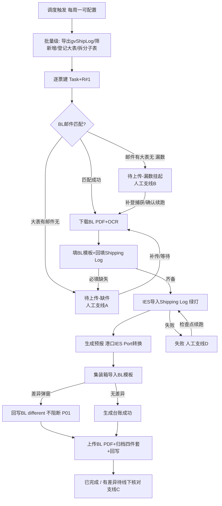

# UC34 Case 2 · MBUSI 线 PRD(v1.0.0)深度审查报告

| 项目 | 内容 |
|------|------|
| 审查对象 | `UC34-Case2-MBUSI_PRD.md` v1.0.0(2026-09-29) |
| 审查日期 | 2026-10-08 |
| 审查人 | BA(PRD Reviewer 流程,与 GLC 线同一流程) |
| 审查产出 | 本报告 + 修订版 PRD:`UC34-Case2-MBUSI_PRD_修订版.md`(v1.2.0,不改原 v1.0.0) |
| 审查标准 | 开发人员仅依据 PRD 即可理解业务规则、页面行为与实现边界 |
| 对照基线 | BRD-MBUSI-BL-002 V3(含 §13 逐步截图流程)、PRD 初版 Case2b(0921,Q28 实测)、GLC 线审查报告与修订版定版口径 |

**审查原则(全程适用,与 GLC 一致)**:

1. 业务逻辑与页面设计不可分离:每条业务规则必须能映射到具体页面行为(显隐/禁用/提示/状态变化)。
2. 字段存在性原则:**每一个字段都必须能回答"为什么存在、数据从哪里来、谁使用它、它影响什么"**,不允许"为了展示而展示"。
3. 页面闭环原则:用户从哪里进入 → 做什么 → 产生什么结果 → 下一步去哪 → 数据如何变化 → 后续角色如何继续处理,必须成链。
4. 不擅自创造业务规则:原需求有歧义处统一标记 **【待确认】**,不编造。
5. 双线口径一致:GLC 已定版的口径(差异不阻断、Run 快照、状态映射等)直接继承,不另起炉灶。

---

# 1. PRD 问题诊断

> 严重度:**阻断** = 开发无法动手;**高** = 开发需自行假设,大概率返工;**中** = 影响完整性/一致性;**低** = 表述优化。

| 编号 | 严重度 | 所在位置 | 问题描述 | 对开发的影响 | 修订处理(v1.2.0) |
|------|--------|---------|---------|-------------|------------------|
| P01 | **阻断** | US-M05 AC4 vs 8.3 E3001 | **同一事件两种处理口径**(与 GLC P01 同型):US-M05 说差异"记录后继续:上传 BL PDF 并保存";E3001 说差异"捕获 → BL different → 转人工(不生成台账)"。开发无法判断差异后流程是继续还是中断 | IES 导入节点的主分支逻辑无法编码 | 统一为:**差异不阻断流程**——捕获回写 BL different、流程继续上传 BL PDF,任务终态置"有差异"待业务线下核对;E3001 语义改写,删除"转人工"。依据:BRD §13 step15"有差异…需要填写到 BL different,然后往下拉上传文件";与 GLC P01 定版一致 |
| P02 | 高 | R3 / US-M03 AC3 vs 7.3.2 chip / 7.3.7 上传中心 | **漏数票(邮件有 PDF、大表无登记)没有 Task 承载与页面闭环**:①漏数票是否建 Task 未定义——chip"待人工处理"筛的是 Task,若漏数票只有 AttachmentLedger 记录则无前端载体;②`/api/staging/{blNo}/resume` 有接口但无任何页面说明谁、在哪里、确认什么后触发续跑;③7.3.7 说上传中心"空态(暂不涉及)",而 US-M03 AC4/R3.3 说"经平台上传指定提单+时间维度子表"——同一入口一处说空态、一处说要上传,口径冲突 | 漏数"挂起-补登-续跑"核心闭环(P0 防漏价值)断裂,接口无前端入口 | v1.2.0 明确:**漏数票同样创建 Task**(BL 号为票粒度,数据仅有暂存 BL PDF),状态=待上传(WAIT_INPUT,子类型=漏数挂起);任务详情提供"漏数处理"区:①确认续跑(补登完成后)②继续等待 ③标记无效;上传中心启用"漏数补登子表上传"入口(与 US-M03 AC4 对齐,不再空态) |
| P03 | 高 | 8.1 状态机 vs 7.3.2 筛选 chip | **Task 状态与 Run 状态映射关系未定义**:任务中心 7 个 chip 与 Run 六态(PENDING/RUNNING/SUCCEEDED/DIFF_PENDING/WAIT_INPUT/FAILED)对应关系缺失;"待人工处理"是否聚合其他 chip、是否含漏数挂起票不明 | 列表筛选与统计接口口径无法确定 | 新增 **Task-Run 状态映射表**(v1.2.0 §8.1);定义"待人工处理"= 待上传 ∪ 有差异 ∪ 失败 的聚合快捷筛选(漏数挂起票归入待上传);工作台统计卡同口径 |
| P04 | 高 | 第三部分权限矩阵 | 权限矩阵缺行:①新建任务(7.3.2 功能点 4)无角色定义;②归档浏览的下载/复制路径;③邮件规则/配置中心的**查看**权限(非 ADMIN 是否可见) | 前端按钮显隐、后端鉴权无依据 | 补 3 行:新建任务=OPERATOR/MANAGER;归档下载=全部角色(只读);规则/配置查看=全部角色、编辑=ADMIN |
| P05 | 高 | 第三部分"不可逆重跑/对外动作确认" | MANAGER 有"不可逆重跑/对外动作确认"权,但 MBUSI 场景中**哪些动作算对外/不可逆没有清单**:IES 台账已生成、BL PDF 已上传保存后再整单重跑的业务后果未说明(IES 侧是否产生重复台账/重复文档) | 重跑按钮的二次确认逻辑、MANAGER 权限点落空 | 定义 MBUSI 对外动作清单:IES 台账已生成 / BL PDF 已上传保存 后的**整单重跑**需 MANAGER 触发;节点级重跑不受限(节点 7 之前) |
| P06 | 高 | 7.3.3 字段表 / 7.3.5 模板列 | **识别字段只有列举,无字段级定义**(类型/必填/来源/取值/校验/业务原因/影响);Shipping Log 7 列、BL 9 列与识别字段的**映射关系缺失**;**BL 号的提取来源未定义**——"附件按 BL 号入暂存库"的 BL 号是从附件文件名、邮件正文还是 PDF 内容取得,全文未说,而它正是暂存归并键与去重键 | OCR Schema、修正校验、模板填写、暂存归并逻辑全部需开发自行假设 | 新增 **§8.0 字段级设计**:识别字段全表 + 两个模板列映射表 + 字段依赖关系;BL 号提取口径标【待确认 OPEN-M6】(建议:附件文件名正则优先,PDF 内容 OCR 兜底归一) |
| P07 | 高 | R1.2 / R6 / 6.1 | **gvShipLog → 大表美线 sheet 的登记列映射缺失**:BRD §13 step6 明确"填写对应关系如下"(截图基线,不得删除),但 PRD 只有"D 列 booking number 即 BL 号"一句,其余列(PDC/ETA/Port/Shipping Log No. 等写入大表哪些列)未落 PRD;大表回写也只有内容清单,无写入时机/触发节点/失败语义 | 登记与回写通道的调用点无法埋,列位只能猜 | 新增 **登记列映射表**(以初版 Q28 实测 16 列为底稿,全部标【待确认 OPEN-M12】以大表模板终稿为准)+ **回写时机矩阵**(列 × 写入节点 × 写入值 × 失败处理 E5002) |
| P08 | 高 | 7.3.3 节点编排(10 节点) | **批量级节点与票级节点混排**:节点 1(下载 gvShipLog)、节点 2(拆分子表)是每轮一次的全量动作,却编排在票粒度 Task 的节点轨迹里;**票的创建时机**(大表登记时?邮件匹配时?)与单票重跑/新建任务的**起始节点**未定义——单票重跑难道重跑全量导出? | Task/Run 模型与节点轨迹实现无法对应,重跑逻辑无法编码 | v1.2.0 明确:**Task 创建时机=大表新增登记即建**(节点 1-2 标记为批量级,执行结果以输出摘要关联到本轮各票);票级节点为 3-10;单票重跑从失败/指定检查点起,整单重跑从节点 3 起;漏数挂起票补登捕获后从节点 4(下载附件已在暂存,实际从节点 5)续跑 |
| P09 | 中 | 7.3.2 功能点 4 | "新建任务:选择 MBUSI 线路手动建票"仅一句:输入什么(BL 号?附件?)、是否要求大表已登记/暂存已有 PDF、与去重的关系均未定义 | 新建任务表单与后端校验无法设计 | 补交互定义:输入 BL 号(格式【待确认 OPEN-M11】)→ 校验重复 → 若暂存已有该 BL 附件直接关联,无附件则建票即挂待上传 |
| P10 | 中 | 7.3.2 功能点 3 | 导出 CSV 的字段范围、是否含修正留痕、导出走哪个数据视图未定义 | 导出接口出参无法定 | 定义导出字段 = 任务中心列表列 + 最近 Run 状态/耗时;不含修正明细(修正留痕查任务详情) |
| P11 | 中 | 7.3.6 归档浏览 | 文件抽屉"下载/复制路径"的角色范围未定义;页面是平台内嵌浏览还是跳 SharePoint 不明 | 前端实现方式与权限点不明 | 明确:平台内嵌只读浏览,全部角色可看可下载;不提供编辑/删除/上传 |
| P12 | 中 | 7.3.5 "即时生效" | 对应表/模板"即时生效"与**执行中 Run 的一致性**未定义:Run 中途改配置,用旧值还是新值 | 配置读取时机(快照 or 实时)影响执行正确性 | 沿用 GLC P15 定版:**Run 启动时快照**本次执行用的模板版本与对应表版本,Run 内不变;新 Run 用最新版。【待确认 OPEN-M7】 |
| P13 | 中 | 8.3 错误码 | 错误码只有含义,**无页面提示文案与出现入口映射** | 前端异常提示各自发挥,验收无依据 | v1.2.0 各页面交互补"异常提示";错误码表补"触发入口/页面文案"两列 |
| P14 | 中 | 全文 | **平台能力未做复用/扩展/新增判断**:网站导出通道(RPA?)、邮件监听、暂存库、OCR、IES 通道、回写通道、归档哪些现成、哪些要新建,全文无结论 | 开发工作量评估与技术方案无边界 | 新增 **第九部分 平台能力分析** → 落入 v1.2.0 |
| P15 | 中 | 2.2 / 9 | **每周票数量级未给出**,性能指标(<2h)无业务依据 | 批量调度与资源估算无输入 | 【待确认 OPEN-M8】请业务提供周票量与峰值 |
| P16 | 中 | 7.3.3 头部操作 vs 7.3.2 chip | "待上传"语义两处混用:chip"待上传"指缺件/漏数挂起(WAIT_INPUT);7.3.3 差异票头部也有"上传文件"按钮,易被理解为同一状态 | 状态命名冲突,筛选与详情页口径打架 | 统一:状态"待上传"仅指缺件/漏数挂起 WAIT_INPUT;差异票头部按钮改为"补传/重新上传文件",语义为修正材料而非状态(沿用 GLC P19 定版) |
| P17 | 中 | US-M01 AC1 / 7.3.5 调度 | **调度默认时间口径不一**:BRD §13"每周一早上 run(具体运行时间以系统为准)";初版(0921)写 08:00(Q30);本 PRD 写 09:00 | 调度配置默认值与验收口径不一 | 维持"可配置"不变,默认值标【待确认 OPEN-M9】请业务定夺 |
| P18 | 中 | US-M02 AC1 | **网站导出双通道判定逻辑未定义**:"自动导出;如权限受限,支持从指定 T 盘/SharePoint 读取"——系统如何判定权限受限(导出失败即切换?预先配置?)两条路的配置项、优先级、文件就位校验未定义 | 节点 1 的实现分支无法编码 | 明确:导出通道为配置项(website_export / file_pickup);file_pickup 模式需配置文件就位校验(文件名/时间窗),未就位按 E4005 处理。启用条件与路径【待确认 OPEN-M16】 |
| P19 | 低 | R4.2 | VOL/Load 双来源("BL Excel 或 BL PDF")优先级未定义;BRD §13 step10 同样两可 | 回填取值来源不确定 | 建议:以已校验的 BL Excel(BL 模板填写结果)为准,PDF 为 OCR 原始来源;【待确认 OPEN-M10】 |
| P20 | 低 | US-M02 AC3 / BR-03 | "每个提单对应的行单独保存"——**一个 BL 对应 gvShipLog 多行(行集,多箱)的归并结构未说明**;单票 Excel 内容(哪些列、是否原样行集)未定义 | 拆分逻辑与单票 Excel 结构无法编码 | 明确:单票 Excel=该 BL 在 gvShipLog 的全部行原样子集(含表头);行数=箱数,供节点 6 容器行级回填 |
| P21 | 低 | US-M06 E1 | "修正值格式非法"无各字段格式规则 | 行内修正校验规则无法写 | 字段级设计表补"取值/校验"列(日期格式、数值、枚举、BL 号正则等) |
| P22 | 低 | 7.3.3 功能点 7 | "兄弟任务、15 天热力图"业务价值未说明(违反字段存在性原则) | 可能被当作纯 UI 装饰砍掉或做错 | 补说明:兄弟任务用于跨周归并追溯(同 BL 漏数挂起票与补登后正式票互查);热力图用于观察调度稳定性 |
| P23 | 低 | R2.3 | "同 BL 重复邮件保留最新版"的**版本判定依据**(接收时间?邮件 UID?)未定义 | 暂存覆盖策略实现不确定 | 明确:以邮件接收时间(平台收件时间戳)为准,后到覆盖先到,台账记版本号 |

**诊断小结**:v1.0.0 骨架完整(角色/规则/流程/接口/错误码齐备,BRD 追溯表齐全),但存在 **1 处阻断级口径冲突(P01,与 GLC 同型)** 与 **7 处高严重度缺口**(漏数票闭环 P02、状态映射 P03、权限缺行 P04、对外动作清单 P05、字段级设计 P06、登记/回写映射 P07、节点编排 P08),均在 v1.2.0 中修订或显式标记【待确认】。

---

# 2. 业务流程梳理

## 2.1 主流程(自动线)

| # | 角色 | 触发条件 | 操作 | 系统处理 | 数据变化 | 状态变化 | 下一步 |
|---|------|---------|------|---------|---------|---------|--------|
| 1 | 调度器 | 每周一(默认 09:00 可配置,OPEN-M9) | 触发 MBUSI 批量 | 锁定数据窗口=上周一至周日 | 生成本轮 BatchId | — | 2 |
| 2 | 平台 | 批量触发 | 【批量级】导出 gvShipLog(website_export 模式;file_pickup 模式读指定位置,P18) | 导出失败→不更新大表、记错误、重试后升级(E4005) | GvShipLogRecord +N | 失败→本轮批量失败告警 | 3 |
| 3 | 平台 | 导出成功 | 【批量级】按 O 列 created 筛上周新增,与大表防重;登记大表美线 sheet(列映射 §4.4);每 BL 行集拆分为 `Shipping log information_<BL>.xlsx` | 已登记 BL 跳过(E4002);PDC/ETA 缺失→不建夹转人工(E4003) | 大表美线 sheet 登记;单票 Excel 落盘;**逐票建 Task+R#1(票创建时机=登记即建,P08)** | Task→执行中 | 4 |
| 4 | 平台 | 持续(收单) | 按标题监听 CMA CGM 提单邮件;附件按 BL 号(提取口径 OPEN-M6)入暂存库、台账 pending;同 BL 留最新版(P23) | 与大表已登记 BL **精确匹配**(BR-06) | AttachmentLedger +N(pending) | 匹配成功→5;未匹配→支线 B(漏数挂起,P02) | 5 / 支线 B |
| 5 | 平台 | 匹配成功 | 下载提单重命名 `BL_<BL号>.pdf` 入票文件夹;OCR 识别(BL PDF,集装箱明细) | 低置信字段金色标记(置信度阈值见 GLC OPEN-G23 同口径) | FieldResult 写入 | 低置信→字段质量降级(不置差异,MBUSI 无交叉核对规则) | 6 |
| 6 | 平台 | OCR 完成 | 填 BL 模板(9 列,取自 BL PDF);Shipping Log 基础字段取自 gvShipLog 行集,VOL/Load 自 BL 回填(来源优先级 OPEN-M10);必填校验(FR-03) | 必填缺失→不上传不完整模板,转人工(E4001 变体) | 模板文件落盘 | 缺件→待上传(WAIT_INPUT) | 7 / 支线 A |
| 7 | 平台 | 模板齐备 | IES 发票信息按 BOL(gvShipLog M 列)查询 → 批量导入 Shipping Log(**绿灯后上传**,R5.1) | 导入失败/超时→检查点重试(E3002) | IES Shipping Log 导入记录 | 失败→FAILED | 8 |
| 8 | 平台 | 导入成功 | 全选发票生成预报;预报信息来源于提单,港口经 IES Port 对应表转换 | — | IES 预报生成 | — | 9 |
| 9 | 平台 | 预报完成 | 集装箱信息导入 BL 模板 → 差异弹窗**完整捕获** | 有差异:**IES 不生成台账**,差异内容回写 BL different,**流程继续(P01)**;无差异:生成台账成功 | WritebackRecord(BL different) | 有差异→任务标记"有差异"(不中断) | 10 |
| 10 | 平台 | 导入完成 | 上传 BL PDF(选择文件类别,类别【待确认 OPEN-M14】)并保存;归档四件套至 `<归档根>\<PDC>\MBUSI\<运行周>\<<BL> ETA <YYYY.MM.DD>>`;回写大表台账状态/异常反馈列(时机矩阵 §4.4) | 归档不可写→记错误告警,文件留暂存可重试 | 归档四件套;回写记录 | →已完成(SUCCEEDED);有差异票终态=有差异待线下核对 | 结束 |
| — | 平台 | 任意节点异常 | 记异常反馈 + 站内提醒 + 审计 | 证据(trigger/process/operation)WORM 落盘 | WritebackRecord/AuditLog | →对应异常态 | 人工支线 |

## 2.2 人工支线(异常闭环)

| 支线 | 入口 | 角色 | 操作 | 系统处理 | 状态变化 | 下一步 |
|------|------|------|------|---------|---------|--------|
| A 缺件处理(大表已登记、BL PDF 未到/必填缺失) | 提醒 / chip"待上传" → 任务详情 | OPERATOR/MANAGER | ①补传 BL PDF ②确认继续等待 ③标记无效(必填原因) | ①补传件入暂存校验(BL 号一致性)→自动续跑 ②保持挂起至下轮 ③任务关闭留痕 | 待上传→执行中 / 不变 / 已关闭 | 主流程节点 5 起 |
| B 漏数挂起(邮件有 PDF、大表无登记,P02) | 提醒 / chip"待上传" → 任务详情(漏数处理区) | OPERATOR/MANAGER | ①确认续跑(线下补登完成后)②继续等待 ③标记无效(必填原因,撤销规则 OPEN-M13) | ②每轮调度按 created 捕获补登→自动从台账取回附件续跑;①人工确认后立即触发续跑 | 待上传(漏数)→执行中 / 不变 / 已关闭 | 主流程节点 5 起(附件已在暂存) |
| C 差异修正(IES 差异已回写 BL different / OCR 低置信) | 提醒 / chip"有差异" → 任务详情 → 横幅定位 | OPERATOR | 对照 BL PDF 原文行内修正(留痕)→ 节点/整单重跑 | 修正写当前生效版本;重跑生成 R#N+1 携带修正值 | 有差异→执行中 | 主流程对应检查点 |
| D 失败重跑 | 任务中心 / 任务详情 | OPERATOR(节点级);MANAGER(对外动作后整单重跑,P05) | 检查点续跑 / 整单重跑 / 批量重跑 | 去重防重(R7.1);执行中跳过 | 失败→执行中 | 对应检查点 |
| E 漏数/集装箱差异线下三步(US-M03 AC4 / BRD 异常流程) | 上传中心(补登子表上传入口,P02 修订) | OPERATOR | 线下删 IES 旧预报 → 确认子表已更新 → 平台上传"指定提单+时间维度"子表 → 手动触发重跑 | 子表自动存至对应 PDC 目录;重跑去重 | 异常态→执行中 | 主流程节点 3 起 |



---

# 3. 页面逻辑梳理

> 每页回答:页面目标 / 使用角色 / 进入条件 / 内容与字段(含业务含义)/ 操作与条件 / 系统反馈 / 状态变化 / 下一步。字段级明细见 §4,页面跳转见 §5。

## 3.1 工作台(F-M01)

- **页面目标**:让业务在 10 秒内判断"本周 MBUSI 有没有要我处理的票"——它是异常分拣入口,不是报表页。
- **角色**:全部(AUDITOR 只读)。
- **进入条件**:登录默认页;侧栏"工作台"。
- **内容与字段**:

| 元素 | 业务含义(为什么存在) | 数据来源 |
|------|---------------------|---------|
| 总任务数卡 | 本周票量基线;骤降为 0 可早期发现网站导出/公邮接入故障 | Task 按 case-2-mbusi + 本周 BatchId 计数 |
| 已完成卡 | 自动化成效直观呈现(KPI 自动化率分子) | 最新 Run=SUCCEEDED 计数 |
| 执行中卡 | 告知"还有票在跑",避免重复人工干预 | 最新 Run=PENDING/RUNNING 计数 |
| 待人工处理卡 | **核心入口**,聚合 待上传(含漏数挂起)+有差异+失败(P03 口径),承载"业务只看异常"愿景 | 三态合计 |

- **操作**:点击卡片 → 带参跳任务中心(§5 J1~J4)。
- **异常**:统计接口失败 → 卡片显示 "--" + 重试图标,不阻断导航。
- **下一步**:任务中心。

## 3.2 任务中心(F-M02/F-M05)

- **页面目标**:MBUSI 票统一台账视图(即"平台台账")+ 批量处置入口;漏数挂起票在此可见可处置(P02)。
- **角色**:全部;新建/重跑=OPERATOR/MANAGER,导出=MANAGER,AUDITOR 全只读。
- **进入条件**:工作台卡片带参 / 侧栏 / 提醒跳入(带 taskId)。
- **列表字段**(逐列业务原因见 §4.5):任务编号、case、触发来源、状态、执行次数、最近执行开始、当前环节。
- **筛选 chip 与状态映射(P03 修订)**:

| chip | 对应最新 Run 状态 | 说明 |
|------|------------------|------|
| 执行中 | PENDING / RUNNING | |
| 待人工处理(聚合) | WAIT_INPUT ∪ DIFF_PENDING ∪ FAILED | 快捷筛选,与其他 chip 不互斥 |
| 待上传 | WAIT_INPUT | 缺件(大表有、邮件无)∪ 漏数挂起(邮件有、大表无,P02);列表以"挂起原因"列区分 |
| 有差异 | DIFF_PENDING | IES 差异已回写 BL different / OCR 低置信待核对 |
| 失败 | FAILED | |
| 已完成 | SUCCEEDED | |

- **操作与条件**:

| 操作 | 角色 | 条件 | 系统反馈 | 状态变化 |
|------|------|------|---------|---------|
| 新建任务(P09) | OPERATOR/MANAGER | BL 号必填(格式【待确认 OPEN-M11】);BL 号已存在时提示并跳已有任务;暂存已有该 BL 附件则自动关联 | 建 Task+R#1;无附件→直接挂待上传(支线 A) | 无→执行中/待上传 |
| 批量重跑 | OPERATOR/MANAGER | 勾选票非执行中;执行中自动跳过并 toast 说明 | 逐票生成 R#N+1 | 异常态→执行中 |
| 导出 CSV(P10) | MANAGER | 当前筛选结果 | 下载;字段=列表列+最近 Run 状态/耗时,不含修正明细 | 不变 |
| 行点击 | 全部 | — | 跳任务详情(当前生效 Run) | 不变 |

- **异常提示**:重跑失败 → toast 错误码+原因(E5001/E4002);列表加载失败 → 空态+重试。

## 3.3 任务详情(F-M03/M04)

- **页面目标**:单票全生命周期"处置台"——核对、修正、补件、续跑、取证一页完成(承载"异常票单票人工耗时 ≤5 分钟"指标);**漏数挂起票的确认续跑在本页完成(P02)**。
- **角色**:全部;修正仅 OPERATOR;对外动作后整单重跑需 MANAGER(P05);AUDITOR 只读+证据可查。
- **进入条件**:任务中心行点击 / 提醒点击(带 taskId)/ 兄弟任务互链。
- **页面分区 × 状态差异**:

| 分区 | 待上传-缺件(WAIT_INPUT) | 待上传-漏数挂起(P02) | 有差异(DIFF_PENDING) | 失败(FAILED) | 已完成(SUCCEEDED) |
|------|------------------------|---------------------|---------------------|-------------|------------------|
| 头部操作 | 「补传文件」「确认继续等待」「标记无效」 | 「确认续跑」「继续等待」「标记无效」 | 「定位差异」「补传/重新上传文件」「整单重跑」 | 「检查点续跑」「整单重跑」 | 「整单重跑」(仅 MANAGER,P05) |
| 横幅 | 缺件横幅:缺 BL PDF/必填字段 | 漏数横幅:"已收提单邮件,大表未登记,等待补登;补登后下轮自动捕获续跑,或可手动确认续跑" | 差异横幅:一键定位金色字段 | 失败横幅:失败节点+错误码 | 无 |
| 节点轨迹(10 节点,节点 1-2 标批量级) | 挂起节点标灰"等待输入" | 节点 4 起标灰,显示暂存已收附件信息 | 差异节点标金 | 失败节点标红,显示检查点 | 全绿 |
| 当前识别数据 | 只读 | 只读(仅暂存附件元信息) | 可行内修正(OPERATOR) | 只读 | 只读 |
| 证据区 | 可见 | 可见(含暂存 BL PDF) | 可见 | 可见 | 可见 |

- **缺件处理区(支线 A)**:「补传文件」上传 BL PDF(校验类型/大小/BL 号一致性)→ 成功自动触发续跑;「确认继续等待」二次确认后保持挂起;「标记无效」必填原因 → 任务关闭(终态,留痕,仅 MANAGER 可撤销【待确认 OPEN-M13】)。
- **漏数处理区(支线 B,P02 新增)**:展示暂存已收 BL PDF 与接收时间;「确认续跑」= 业务已线下补登大表,点击后立即触发续跑(系统复核大表已登记该 BL,未登记则提示并阻断);「继续等待」= 保持 pending 至下轮调度按 created 自动捕获;「标记无效」同支线 A。
- **字段修正(US-M06)**:行内编辑 → 格式校验(§4.1 取值列)→ 保存记录 修正人/时间/原值/新值 → 仅留痕不审批;非 OPERATOR 无入口(E5001)。
- **Run 切换**:R#1、R#2…历史只读;仅当前生效 Run 可修正/重跑。
- **兄弟任务/热力图(P22)**:兄弟任务=同 BL 号跨周归并的相关票(漏数挂起票与补登后正式票互查,支撑漏数追溯);15 天热力图=该 case 每日执行密度,用于观察调度稳定性。
- **异常提示**:修正格式非法 → 行内红字阻断(文案见 v1.2.0 §8.3);补传校验失败 → 提示原因;续跑失败 → toast E3002;确认续跑时大表仍未登记 → 提示"大表未登记该 BL,请先补登"。

## 3.4 邮件中心 + 规则编辑器(F-M06/M07)

- **页面目标**:让 ADMIN 不改代码即可调整 MBUSI 收单口径(R-MBUSI-BL),并通过 dry-run 在发布前自证规则正确。
- **角色**:查看=全部(P04);编辑/发布/启停/dry-run=ADMIN。
- **进入条件**:侧栏"邮件中心"→ 规则行「编辑」。
- **内容**:规则列表(规则名/监听邮箱/优先级/绑定流程/累计命中/启停);编辑器三段式(筛选条件段 / 附件要求段 / 流程绑定段)。
- **操作与条件**:

| 操作 | 条件 | 系统反馈 | 状态变化 |
|------|------|---------|---------|
| 保存规则 | 正则合法 + 必需附件角色齐备 | 校验失败阻断(E1001)并定位错误段 | 版本+1 |
| dry-run | 已有样本邮件 | 展示命中/未命中原因,不产生任务(E1002 样本不可用时提示) | 不变 |
| 启停 | — | 即时生效;停用后新邮件不再匹配,**不影响已建任务** | 不变 |

- **MBUSI 预置规则**(维持 v1.0.0):R-MBUSI-BL,主题含「CMA CGM - 海运提单(Seaway Bill)可供使用」,仅按标题搜索,业务配置自动 Forward 至平台公邮。
- **异常提示**:E1001 保存阻断红字定位;E1002 toast。

## 3.5 配置中心(F-M08)

- **页面目标**:MBUSI 模板与对应表的版本化维护,业务变更免发版。
- **角色**:查看=全部(P04);维护=ADMIN。
- **内容**:Shipping Log 模板(7 列)/ BL 模板(9 列)/ IES Port 对应表 / 调度配置 / 网站导出通道配置(P18)。
- **操作与条件**:上传模板(扩展名+≤20MB 校验,E2001;版本不兼容阻断 E2002)→ 版本+1,历史可查;对应表在线编辑即时生效——**生效语义:对保存后新建的 Run 生效,执行中 Run 用启动时快照(P12,OPEN-M7)**;调度时间修改对下次触发生效;导出通道(website_export/file_pickup)切换对下轮批量生效。
- **异常提示**:E2001/E2002 上传区红字;对应表键重复 → 行内阻断。

## 3.6 归档浏览(F-M09)

- **页面目标**:审计与业务自查时按目录找到任一票的归档证据(对应合规价值)。
- **角色**:全部(P04/P11);**只读**:浏览/搜索/下载/复制路径,无编辑/删除/上传。
- **进入条件**:侧栏"Share Point";或任务详情证据区"查看归档位置"带路径跳入。
- **内容**:目录树 `<归档根>\<PDC>\MBUSI\<运行周>\<<BL> ETA <YYYY.MM.DD>>` + 面包屑 + 目录内搜索;文件列表(名称/修改日期/类型/大小);文件抽屉(元信息+下载/复制路径);票文件夹内容=归档四件套。
- **异常**:归档根不可达 → 空态提示联系 ADMIN(配置项检查)。

## 3.7 平台引用页(F-M10)

- 提醒中心:成功/异常(含漏数挂起、缺件)自动生成站内提醒,点击跳任务详情(带 taskId);不外发邮件。
- 治理运营台:DAG 监控、审计日志、证据总量(WORM)——ADMIN/AUDITOR。
- 权限中心:四角色只读查询;身份与授权由 Alice 管理,平台不自建用户体系。
- **上传中心(P02 修订,不再空态)**:启用"漏数补登子表上传"入口——上传"指定提单+时间维度"Shipping Log 子表,服务端校验格式后自动存至对应 PDC 目录,支撑支线 E 手动重跑(US-M03 AC4 / BRD 异常流程)。

---

# 4. 字段级设计

> 核心原则:**每个字段都必须能回答"为什么存在、数据从哪里来、谁使用它、它影响什么"。**

## 4.1 识别字段(任务详情"当前识别数据"区)

> 字段清单以 v1.0.0(7.3.3)+ 两个模板列 + 初版 Q28 实测反推补全;标注 **【待确认】** 项以供应商 OCR Schema 与大表模板终稿为准(OPEN-M6/M12)。所有字段均为 Run 级数据,修正仅 OPERATOR、仅当前生效 Run、留痕不审批。容器类字段(F-08~F-13)为**箱级行结构**(一 BL 多箱多行,P20)。

| # | 字段 | 类型 | 必填 | 来源 | 可编辑 | 取值/校验 | 业务原因(为什么存在) | 影响(它改变什么) |
|---|------|------|:---:|------|:---:|---------|---------------------|------------------|
| F-01 | Booking No.(BL 号) | 文本 | 是 | gvShipLog D 列;暂存侧提取口径【待确认 OPEN-M6】 | ✓ | 非空;归一规则(去空格/前缀)【待确认】 | 票粒度主键;大表防重键;暂存归并键;BR-06 精确匹配键 | Task 编号 T-BL号、暂存归并、去重、文件夹命名 `<BL> ETA …` |
| F-02 | Shipping Log No.【待确认】 | 文本 | 是 | gvShipLog A 列 Ship Log File ID(Q28 实测)【待确认 OPEN-M12】 | ✓ | 非空 | Shipping Log 模板第 1 列、BL 模板第 2 列的关联键;大表登记列(初版注:大表 E 列写 Shipping Log No) | 两模板填写、大表登记 |
| F-03 | PDC | 文本 | 是 | gvShipLog G 列(Q28) | ✓ | 非空 | 归档目录层级;业务按仓分工口径;子目录区分 GLC/MBUSI | 归档路径 `<PDC>\MBUSI\…`;缺失→E4003 不建夹转人工(BRD §8) |
| F-04 | ETA | 日期 | 是 | gvShipLog H 列(Q28) | ✓ | 日期;展示 YYYY.MM.DD | 归档文件夹名 "ETA YYYY.MM.DD" 段(BR-04) | 文件夹命名;缺失→E4003 转人工 |
| F-05 | Departure Port | 文本 | 是 | gvShipLog E 列(Q28)/ BL PDF | ✓ | 英文港口名 | 预报起运港;经 IES Port 表转换 | 预报内容 |
| F-06 | Arrival Port | 文本 | 是 | gvShipLog F 列(Q28)/ BL PDF | ✓ | 英文港口名 | 预报到港;经 IES Port 表转换;大表登记列(初版注:大表 D 列 Port) | 预报内容、大表登记 |
| F-07 | BOL(发票查询号)【待确认】 | 文本 | 是 | gvShipLog M 列(Q28) | ✗ | 非空 | IES 发票信息查询输入(US-M05 AC1 按 BOL 查询) | 节点 7 发票查询 |
| F-08 | Container No. | 文本 | 是 | gvShipLog J 列 / BL PDF(OCR) | ✓ | 箱号格式(4 字母+7 位)【待确认】 | Shipping Log 模板第 3 列、BL 模板第 4 列;箱级行键 | 两张模板填写、IES 导入 |
| F-09 | Container Type | 文本 | 是 | gvShipLog K 列(加 `'`,Q28)/ BL PDF | ✓ | 单位由 `"` 改 `'` | Shipping Log 模板第 4 列、BL 模板第 5 列 | 模板填写 |
| F-10 | Seal No. | 文本 | 是 | gvShipLog L 列 / BL PDF(OCR) | ✓ | 非空 | Shipping Log 模板第 5 列、BL 模板第 6 列 | 模板填写 |
| F-11 | Package Qty | 数值 | 是 | gvShipLog N 列 / BL PDF(OCR) | ✓ | ≥1 整数 | BL 模板第 7 列 | BL 模板填写 |
| F-12 | Container VOL (m³) | 数值 | 是 | BL PDF(OCR)→ BL Excel(优先级 OPEN-M10) | ✓ | ≥0 数值 | Shipping Log 模板第 6 列、BL 模板第 9 列;**网站导出无此值,必须从提单获取(BR-08)** | 两模板填写;回填 Shipping Log |
| F-13 | Container Load (KG) | 数值 | 是 | 同 F-12 | ✓ | ≥0 数值 | Shipping Log 模板第 7 列、BL 模板第 8 列;同 BR-08 | 同 F-12 |
| F-14 | 船名/航次(Vessel/Voyage)【待确认】 | 文本 | 否 | BL PDF(OCR) | ✓ | 非空 | 预报信息来源于提单(BR-10),预报界面要素之一 | 预报内容 |
| F-15 | created(创建日期) | 日期 | 是 | gvShipLog O 列 | ✗ | 日期 | 新增判定口径(上周一至周日);漏数补登后 update 不回溯,是下轮捕获的依据(R3.2) | 数据窗口筛选;漏数续跑触发 |

**字段间依赖关系**(开发必须实现):

- F-01 是全链主键:暂存归并、大表防重、Task 编号、文件夹命名均以其归一值为准。
- F-03/F-04 → 归档路径与文件夹命名;任一缺失 → E4003 不建不明确文件夹,转人工(BRD §8)。
- F-08 为箱级行键:F-08~F-13 按箱成行;行数 = gvShipLog 该 BL 行集行数(P20)。
- F-12/F-13 依赖节点顺序:必须先完成 BL 模板填写(节点 6 前半)才能回填 Shipping Log(节点 6 后半)——这是节点 3"填 Shipping Log(VOL/Load 待 BL 回填)"留口的原因。
- F-05/F-06 → IES Port 对应表转换;未命中 → 异常记录转人工(不自动放行)。
- F-15 只用于窗口判定与漏数捕获,不进入任何模板。

## 4.2 Shipping Log 导入模板(7 列)字段映射

| 模板列 | 取值来源 | 说明 |
|--------|---------|------|
| AVIS/Shipping Log No. | F-02 | 票标识(美线无 AVIS,取 Shipping Log No.)【待确认 OPEN-M12】 |
| MBZ/BOL | F-07 / F-01 | 发票查询号或提单号(IES 匹配键) |
| Container No. | F-08 | 箱级行 |
| Container Type | F-09 | 单位 `'` |
| Seal Number | F-10 | |
| Container VOL (m³) | F-12 | 自 BL 回填(BR-08) |
| Container Load (KG) | F-13 | 自 BL 回填(BR-08) |

## 4.3 BL 导入模板(9 列)字段映射

| 模板列 | 取值来源 | 说明 |
|--------|---------|------|
| No. | 序号(系统生成) | 行号 |
| Shipping log No./AVIS No. | F-02 | 与 Shipping Log 模板关联键 |
| HAWB/BL No. | F-01 | |
| Container No. | F-08 | |
| Container Type | F-09 | 单位 `'` |
| Seal No. | F-10 | |
| Package Qty | F-11 | |
| Container Load (KG) | F-13 | |
| Container VOL (m³) | F-12 | |

## 4.4 gvShipLog → 大表登记映射 与 回写时机矩阵(P07 新增)

> gvShipLog 16 列以初版 Q28 样本实测为底稿;**登记列映射与大表美线 sheet 完整列定义【待确认 OPEN-M12】** 以大表模板终稿为准(BRD §11 供应商待确认项;初版 OI-C2B-1 沿用)。

**gvShipLog 列结构(Q28 实测底稿)**:A Ship Log File ID(→F-02)/ D Booking Number(→F-01)/ E Departure Port(→F-05)/ F Arrival Port(→F-06)/ G PDC(→F-03)/ H ETA(→F-04)/ I ETD / J Container(→F-08)/ K Container Type(→F-09,加 `'`)/ L Seal(→F-10)/ M BOL(→F-07)/ N Package Qty(→F-11)/ O Created(→F-15)/ P Last Update。

**登记映射(节点 3,新增登记时写入)【待确认 OPEN-M12】**:

| 大表美线 sheet 列(推断) | 写入内容 | 来源 |
|------------------------|---------|------|
| C 列 | PDC | F-03 |
| D 列 | Port(到港) | F-06 |
| E 列 | Shipping Log No. | F-02 |
| G 列 | ETA | F-04 |
| BL Number 列 | Booking Number | F-01(BR-06 匹配键) |

**回写时机矩阵(平台台账为主,双写大表)**:

| 列 | 内容 | 写入节点 | 写入值来源 | 失败处理 |
|----|------|---------|-----------|---------|
| BL different | IES 集装箱导入差异明细 | 节点 9 差异弹窗捕获后(P01:回写后继续) | 弹窗字段级明细 | E5002 入队重试+告警 |
| 台账生成状态列【待确认 OPEN-M12】 | 台账生成成功/有差异 | 节点 9 完成 | 节点结果 | 同上 |
| 异常反馈列【待确认 OPEN-M12】 | 异常描述(如"收到提单但大表未登记""PDC/ETA 缺失") | 任意节点异常时 | 异常描述 | 同上 |
| 新增登记行 | 见上"登记映射" | 节点 3 | gvShipLog 行集 | 同上 |

**重跑时的回写语义**:重跑对同一 BL 的同一列执行**覆盖写**(以最新 Run 结果为准),不产生重复行(R7.1)。

## 4.5 任务中心列表字段(逐列业务原因)

| 列 | 类型 | 来源 | 业务原因 | 影响 |
|----|------|------|---------|------|
| 任务编号(T-BL号) | 文本 | 系统生成 | 票的唯一锚点,沟通与检索口径 | 点击进详情 |
| case | 枚举 | Task.caseId | GLC/MBUSI 多线共存时的区分 | 筛选 |
| 触发来源 | 枚举 | Task | 区分 定时调度/手动创建/手动触发,用于自动化率统计口径 | 筛选、KPI |
| 状态(当前执行) | 枚举 | 最新 Run 状态映射(§3.2) | **异常分拣核心**,决定该票要不要人管 | chip 筛选、统计卡 |
| 挂起原因 | 枚举 | Run/异常记录 | 区分 缺件(等 BL 邮件)/ 漏数挂起(等大表补登),两条支线处置动作不同 | 待上传 chip 内的二级区分 |
| 执行次数 | 数值 | Task.RunCount | 识别"反复失败的票"(≥3 次需重点关注) | 排序参考 |
| 最近执行开始 | 时间 | 最新 Run | 判断处理时效 | 排序 |
| 当前环节 | 文本 | 最新 Run 当前节点 | 不进详情即可定位票卡在哪 | 展示 |

---

# 5. 页面之间的业务关系

## 5.1 跳转链路总览

```
工作台 ──J1~J4──> 任务中心 ──J5──> 任务详情 ──J6──> 任务详情(新 Run,自循环)
                      ▲               │J7 补传/确认续跑/标记无效   │J8 查看归档
                      │               ▼                            ▼
提醒中心 ──J9─────────┘         (系统续跑,状态变化)          归档浏览(Share Point)
邮件中心 ──J10──> 规则编辑器(dry-run)──J11──> 邮件中心
上传中心 ──J12──> (补登子表上传成功)──> 任务详情(手动触发重跑)
```

## 5.2 跳转明细表

| 编号 | 从 | 操作 | 到 | 携带数据 | 状态/权限变化 | 用户下一步 |
|------|----|------|----|---------|--------------|-----------|
| J1 | 工作台 | 点"总任务数"卡 | 任务中心 | `line=mbusi` | 无 | 浏览全量票 |
| J2 | 工作台 | 点"已完成"卡 | 任务中心 | `line=mbusi&status=succeeded` | 无 | 抽查完成票 |
| J3 | 工作台 | 点"执行中"卡 | 任务中心 | `line=mbusi&status=running` | 无 | 观察进度 |
| J4 | 工作台 | 点"待人工处理"卡 | 任务中心 | `line=mbusi&status=manual`(=待上传∪有差异∪失败,P03) | 无 | **处置异常票(主路径)** |
| J5 | 任务中心 | 行点击 | 任务详情 | taskId(默认当前生效 Run) | 无 | 核对/修正/续跑 |
| J6 | 任务详情 | 重跑(整单/节点/批量) | 任务详情 | 新 R#N+1 | 异常态→执行中;历史 Run 变只读 | 观察新 Run 节点轨迹 |
| J7 | 任务详情 | 补传/确认续跑/继续等待/标记无效 | 任务详情 | 补传附件 / 确认记录 | 待上传→执行中 / 不变 / 已关闭 | 观察续跑或离开 |
| J8 | 任务详情 | "查看归档位置" | 归档浏览 | 归档路径(票文件夹) | 无(只读) | 下载/核对原件 |
| J9 | 提醒中心 | 点提醒 | 任务详情 | taskId + RunId | 提醒置已读 | 处置异常 |
| J10 | 邮件中心 | 规则行"编辑" | 规则编辑器 | ruleId | 进入编辑态(ADMIN) | 修改/dry-run |
| J11 | 规则编辑器 | 保存/dry-run 后返回 | 邮件中心 | 规则版本+1 | 对新邮件生效;执行中 Run 快照不受影响(P12) | 观察下轮命中 |
| J12 | 上传中心 | 补登子表上传成功 | 任务详情 | BL 号 + 时间维度子表路径 | 子表落 PDC 目录;可手动触发重跑 | 触发重跑(支线 E) |

## 5.3 业务闭环验证(完整链路)

调度触发 → 大表登记 → 任务中心出现新票 → 邮件匹配 → (异常:缺件/漏数/差异/失败)提醒 → J9 任务详情 → J7/J6 处置 → 新 Run → 已完成 → J8 归档可查 → 大表回写完成。**闭环成立**;v1.0.0 中断裂的"漏数挂起确认续跑"环路由 J7(漏数处理区)补齐(P02),"补登子表上传"环路由 J12 补齐(上传中心启用)。

---

# 6. 平台能力分析(P14 新增)

| 需求 | 所需平台能力 | 现有能力 | 是否满足 | 差距 | 需要新增/改造 |
|------|-------------|---------|:---:|------|--------------|
| 每周定时触发 | 调度器(cron 可配置) | 平台调度(US-M01 已有"调度可配置") | 复用 | 需支持"手动补跑同窗口去重" | 配置项 + 补跑入口(小改造) |
| Central Warehouse 网站导出 | 网站导出通道(UI 自动化 / 文件拾取双模式,P18) | 无 | **新增** | website_export 模式需登录态与导出操作自动化;file_pickup 模式需就位校验 | **新增**(概要设计选型;凭证安全存储 FR-06) |
| 公邮监听 | 邮件规则引擎 | 邮件中心规则引擎(关键词/附件角色/dry-run 已设计) | 复用+配置 | R-MBUSI-BL 预置数据;发件人白名单仅需兜底 | 配置初始化 |
| 附件暂存与跨周归并 | 暂存库 + 附件台账 | 已有 AttachmentLedger/StagingFile 设计 | 复用 | "保留最新版"覆盖策略(P23)需确认实现;漏数票 pending 多轮保留 | 小改造 |
| BL PDF 字段识别 | OCR + 字段 Schema | 平台 OCR(置信度、质量等级已在原型) | 复用 | CMA CGM 提单版式的字段 Schema(§4.1)需建模 | **新增**:MBUSI OCR Schema 配置 |
| BL 号提取(暂存归并键) | 文件名正则 / PDF 内容提取 | 无明确现有能力 | **新增** | 提取口径未定(OPEN-M6) | **新增**(小,依赖 OPEN-M6) |
| IES+ 交互 | RPA/UI 自动化或接口通道 | 技术选型留待概要设计(v1.0.0 范围外) | 待选型 | I1/I2/I5/I6/I7 五项能力要求已列;**差异弹窗完整捕获(I6)是硬性要求** | **新增**(概要设计决策项,与 GLC D1 同决策) |
| 大表登记与回写 | 回写通道 + 队列重试 | E5002 已设计"入队重试+告警" | 复用+扩展 | §4.4 登记/回写时机矩阵的埋点;大表美线 sheet 列定义(OPEN-M12) | 扩展(与 GLC D2 同决策) |
| 文件归档 | SharePoint/T 盘写入 | 归档根为配置项 | 复用+配置 | 目录创建、命名规则(BR-04)实现;GLC/MBUSI 子目录区分 | 配置+小改造(与 GLC D3 同决策) |
| 证据留痕 | WORM 存储 + hash | 平台证据体系(trigger/process/operation,R8.3) | 复用 | MBUSI 各节点证据类型接入 | 配置 |
| 身份与权限 | RBAC 四角色 | Alice 管理,权限中心只读 | 复用 | P04 补充的权限点需登记到 Alice | 配置(权限点清单同步 Alice)【待确认 OPEN-M15】 |
| 站内提醒 | 提醒中心 | 已有(成功/异常提醒) | 复用 | MBUSI 提醒模板(缺件/漏数挂起/差异/失败/完成) | 配置 |
| 状态机与重跑 | Task/Run/检查点 | 已有(Run 不可变、R#N+1、检查点续跑) | 复用 | MBUSI 10 节点编排注册(节点 1-2 批量级标记,P08) | 配置+小改造 |
| 配置版本快照 | 配置中心版本化 | 模板版本化已有 | 扩展 | **Run 启动快照语义(P12)需实现** | 扩展(OPEN-M7,与 GLC 同口径) |

**结论**:平台底座(调度/规则引擎/暂存/OCR/证据/提醒/RBAC)均可复用;**需新增的能力集中在 3 处**:①Central Warehouse 网站导出通道(节点 1);②IES+ 交互通道(概要设计选型,I1/I2/I5/I6/I7,与 GLC D1 同一决策);③BL 号提取与 MBUSI OCR Schema(小)。另有 2 处扩展:大表回写埋点、配置快照语义——均与 GLC 线同决策口径,可合并实施。

---

# 7. 修订落点与遗留待确认

## 7.1 修订落点(→ v1.2.0)

| 诊断编号 | 落入 v1.2.0 章节 |
|---------|------------------|
| P01 | US-M05 修订 + R5.2 修订 + 错误码 E3001 改写 |
| P02 | R3.4 新增 + 7.3.3 漏数处理区 + 7.3.7 上传中心启用 + US-M03 修订 |
| P03 | §8.1 状态映射表 + 7.3.1/7.3.2 口径定义 |
| P04 | 第三部分权限矩阵补 3 行 |
| P05 | 第三部分新增"3.1 MBUSI 对外/不可逆动作清单" + R7.4 新增 |
| P06/P21 | 新增 §8.0 字段级设计(识别字段全表 + 模板列映射 + OPEN-M6) |
| P07 | §8.0.4 登记映射 + R6 改回写时机矩阵 |
| P08 | 7.3.3 节点编排加注批量级/票级 + §8.1 票创建时机约定 + R7.5 重跑起点 |
| P09/P10 | 7.3.2 交互补全 |
| P11 | 7.3.6 修订(只读+全角色) |
| P12 | R4.4 修订 + OPEN-M7 |
| P13 | §8.3 错误码表补列 |
| P14 | 新增第九部分"平台能力分析" |
| P15 | OPEN-M8 |
| P16 | 状态命名统一(7.3.2/7.3.3) |
| P17 | OPEN-M9 |
| P18 | US-M02 AC1 修订 + 配置中心导出通道配置 + OPEN-M16 |
| P19 | R4.2 修订 + OPEN-M10 |
| P20 | R1.3 修订(单票 Excel=行集原样子集) |
| P22 | 7.3.3 功能点 7 补说明 |
| P23 | R2.3 修订(接收时间判定) |

## 7.2 遗留待确认汇总(v1.2.0 第十二部分同步)

| 编号 | 问题 | 来源 |
|------|------|------|
| OPEN-M1~M5 | 沿用 v1.0.0(指标值/邮箱路径模板终稿/重试规则/测试环境/UI 定位验证) | 原 PRD |
| OPEN-M6 | 暂存 BL 号提取口径:附件文件名正则(建议优先)/ 邮件正文 / PDF 内容 OCR 兜底?归一规则(去空格、前缀)? | P06 |
| OPEN-M7 | 配置生效语义:Run 启动快照(建议,同 GLC OPEN-G7)or 实时读取 | P12 |
| OPEN-M8 | MBUSI 线每周票数量级与峰值(性能指标依据,同 GLC OPEN-G8) | P15 |
| OPEN-M9 | 调度默认时间:08:00(初版 Q30)/ 09:00(v1.0.0)/ BRD"以系统为准" | P17 |
| OPEN-M10 | VOL/Load 回填来源优先级:已校验 BL Excel(建议)or BL PDF 直取 | P19 |
| OPEN-M11 | 手动新建任务的 BL 号格式校验规则 | P09 |
| OPEN-M12 | 大表美线 sheet 完整列定义与登记列映射终稿(底稿=Q28 实测,沿用初版 OI-C2B-1) | P07 |
| OPEN-M13 | "标记无效"是否允许撤销、谁可撤销(建议仅 MANAGER,同 GLC OPEN-G11) | §3.3 |
| OPEN-M14 | BL PDF 在 IES 上传的文件类别(同 GLC OPEN-G9 同类问题) | §2.1 节点 10 |
| OPEN-M15 | P04 新增权限点需同步 Alice 登记(同 GLC OPEN-G15) | §6 |
| OPEN-M16 | file_pickup 模式的启用条件、路径配置与就位校验规则 | P18 |

---

**报告结束**。修订版完整 PRD 见 `UC34-Case2-MBUSI_PRD_修订版.md`(v1.2.0,2026-10-08),**框架与内容已直接对齐 GLC 修订版终态(v1.2.4)**:6.2.1 重跑判定链、7.3 页面级交互、7.4 节点实现规格、7.5 性能测算、7.6 页面通用规格、概要设计 4 项技术决策、附录 A-1 均已包含。剩余迭代路径只有一条:**MBUSI 实物表单/真实票核对**(gvShipLog 样本、CMA CGM BL、两个模板、大表美线 sheet,清单见修订版附录 B-1),样本到位后可一举关闭 OPEN-M6/M10/M12/M14/M22 等多项待确认。
