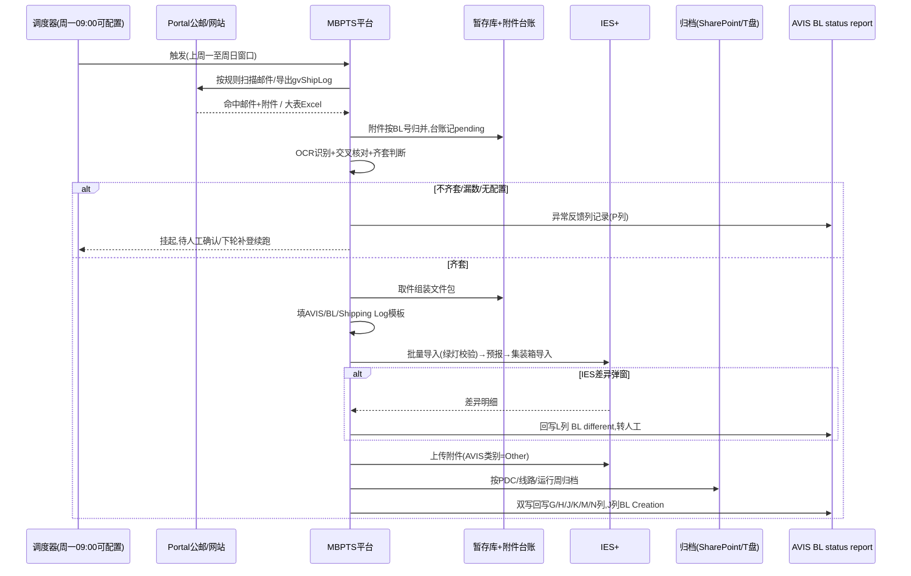
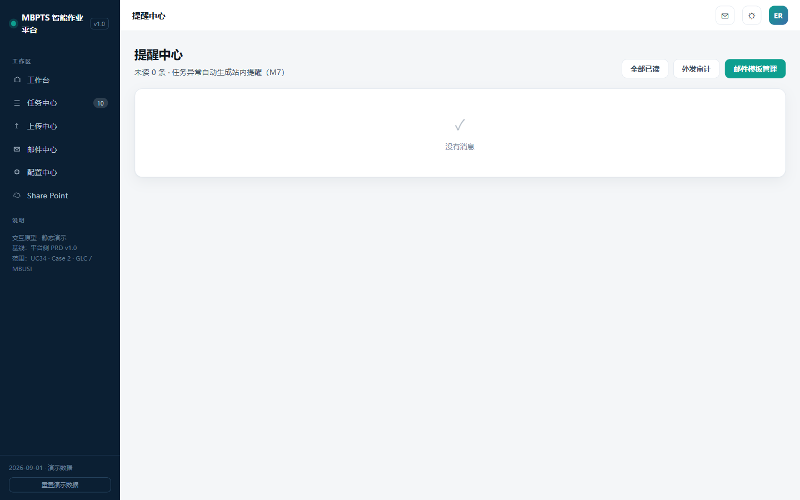
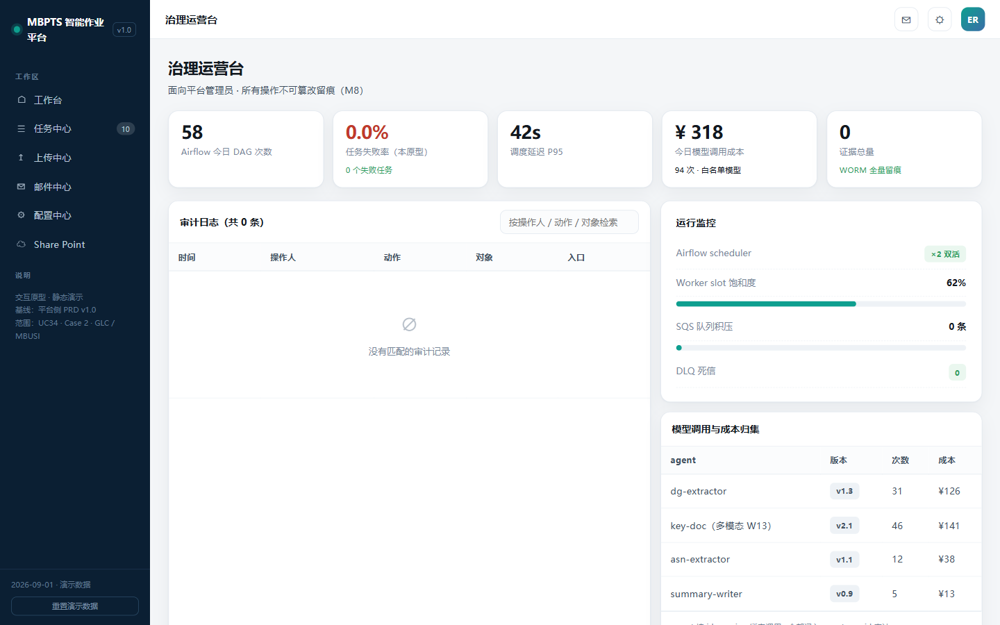
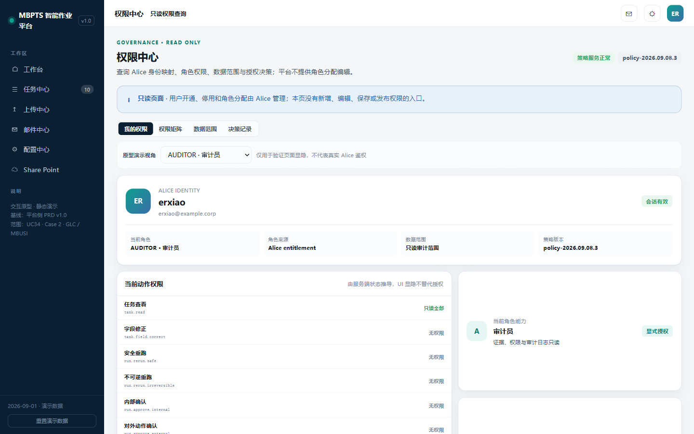
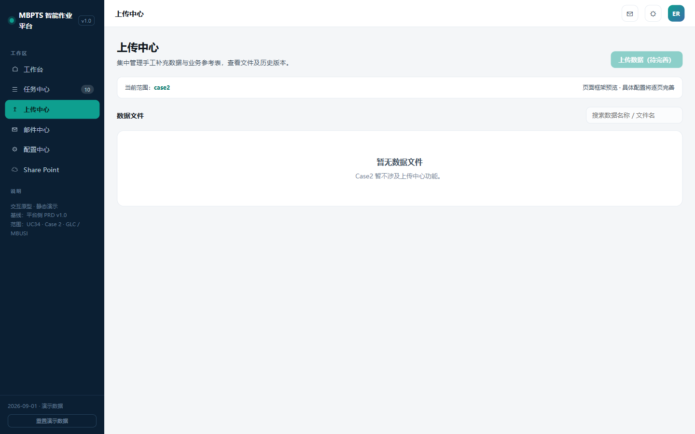

# MBPTS UC34 Case 2:GLC / MBUSI 进口提单(AVIS/BL)自动化 — 产品需求文档

## 文档信息

| 项目 | 内容 |
|------|------|
| **文档名称** | UC34 Case 2 GLC / MBUSI 进口提单自动化 PRD |
| **版本** | v1.0.0 |
| **创建日期** | 2026-09-28 |
| **最后更新** | 2026-09-28 |
| **负责人** | BA(SCM-IE / Import Operations 对接) |
| **审核人** | 待审核 |
| **密级** | 内部 |

**文档用途**:定义 MBPTS 平台 UC34 Case 2(GLC 欧线 / MBUSI 美线进口提单处理自动化)的产品需求,覆盖业务范围、业务流程、功能设计、数据需求与非功能性需求,作为开发与验收依据。

**关联文档**:
- [需求澄清文档](./UC34-Case2_需求澄清文档.md)(Q1~Q14 全部已澄清)
- [设计说明书](./设计说明书.md)
- [需求 Plan](./requirements_plan.md) / [设计 Plan](./design_plan.md)
- 原型基线:`C:\MBPTS\case2页面demo\`(13 页高保真可交互原型)
- 业务依据:`【MBPTS-UC34】case 2:AVIS_BL_Automation_BRD_0920`、`【MBPTS-UC34】case 2:MBUSI_Shipping_Log_BL_Automation_BRD_0920`(BRD-MBUSI-BL-002 V3)、`【MBPTS-UC34】Case 2:GLC&MBUSI梳理`

---

## 版本历史

| 版本号 | 修订日期 | 修订人 | 修订内容 | 状态 |
|--------|---------|--------|---------|------|
| v1.0.0 | 2026-09-28 | BA | 初版(Stage 1/2 已审批) | 草稿 |

---

# 第一部分:产品概述

## 1.1 产品定义

**产品名称**:MBPTS UC34 Case 2 — GLC / MBUSI 进口提单(AVIS/BL)自动化

**所属系统**:MBPTS AI Quick Win 平台(UC34)

**功能定位**:将 GLC 欧线(OOCL)与 MBUSI 美线(CMA CGM)的进口提单处理——公邮收单、归档建夹、模板填写、IES+ 导入、差异处理、状态回写——从全人工转为"平台自动化 + 异常人工协同"。

**使用端**:PC Web

**交付版本**:v1.0.0

## 1.2 产品愿景

业务老师每周只处理异常票,其余全部自动完成;每一票全程可追溯、可审计、可受控重跑。

## 1.3 核心价值

| 价值维度 | 价值描述 | 受益人群 |
|---------|--------|---------|
| 效率 | 每周批量自动处理两线提单,单票端到端自动化率 ≥80% | 进口运营 |
| 质量 | OCR + 交叉核对 + 差异捕获,异常票 100% 识别不漏 | 进口运营/关务 |
| 合规 | 全程证据留痕(WORM)、修正留痕、审计可查 | 审计/管理层 |
| 可维护 | PDC 对应表、导入模板、邮件规则、调度均配置化,业务自维护 | 业务老师/平台管理员 |

## 1.4 产品范围

### 包含范围

| 模块 | 功能描述 |
|------|--------|
| 邮件监听与统一收单 | 按线路规则监听 Portal 公邮,附件按 BL 号入暂存库 + 附件台账(pending/processed) |
| GLC 线自动处理 | 齐套判断 → 组装文件包 → 填 AVIS/BL 模板 → IES+ 导入 AVIS → DG 分支(FOB Charges)→ 生成预报 → 导入 BL → 上传附件 → 回写 |
| MBUSI 线自动处理 | gvShipLog 筛新增登记 → 拆单子表 → 邮件取 BL → 填 Shipping Log/BL 模板 → SharePoint 归档 → IES+ 导入 → 差异处理 |
| 工作台 / 任务中心 / 任务详情 | 双线统计、状态筛选、Task×Run 管理、整单/节点/批量重跑、字段修正留痕、PDF 原文定位、证据预览 |
| 异常处理与人工协同 | Other 文件夹、缺 AVIS 挂起、美表漏数 pending、IES 差异回写 BL different、缺件补传、人工确认续跑 |
| 邮件中心 + 规则编辑器 | 监听规则 CRUD、附件角色录入、流程绑定、dry-run 试运行 |
| 配置中心 | PDC-Customer Code 对应表、IES Port 对应表、AVIS/BL/Shipping Log 模板版本管理、调度配置 |
| 归档与证据 | 归档根可配置(默认 SharePoint,兼容 T 盘),节点证据 WORM 留痕 |
| 状态回写与提醒 | 平台台账为主 + 双写 AVIS BL status report;站内提醒(不发通知邮件) |

### 不包含范围(后续迭代 / 平台侧)

- 治理运营台、权限中心(RBAC)、提醒中心、上传中心的平台级完整需求(本 PRD 仅简述引用,见 7.3.7)
- 源系统改造(IES+、美国 Central Warehouse 网站、公邮系统)
- 未匹配 BL 的业务线下处理(平台只记录异常并转人工)
- UC26、UC64 及 Case 1/3/4/5(平台按 caseId 扩展)
- IES+ 交互的技术实现选型(UI 自动化或接口通道,留待概要设计)

---

# 第二部分:业务背景与目标

## 2.1 业务问题

1. **全人工、强重复**:GLC/MBUSI 两线每周需人工搜索公邮下载 AVIS/Shipper/BL、按 PDC 建文件夹归档、对照 PDF 逐字段抄录三张导入模板、登录 IES+ 逐票导入并生成预报/台账。
2. **跨周时差易漏**:BL 较 AVIS 晚 2~3 周到邮,人工跨周匹配易漏;美表(Shipping Log)存在漏数,补登后 created 更新不回溯,人工难以追踪。
3. **差异处理靠经验**:DG 票 FOB Charges 需手工导表算差异、逐张核对发票 PDF;IES 差异弹窗靠人工抄录回写大表。
4. **不可追溯**:人工操作无留痕,出错无法定位环节,也无法受控重跑。

## 2.2 业务目标与成功指标

| 目标 | 描述 | 优先级 |
|------|------|--------|
| 提效 | 两线提单处理自动化,业务只处理异常票 | P0 |
| 保质 | 异常票(无配置/缺件/差异/漏数)100% 识别并转人工 | P0 |
| 可审计 | 全链路证据与操作留痕,每票可查可重跑 | P1 |

| 指标 | 目标值 | 测量方法 |
|------|-------|---------|
| 单票端到端自动化率 | ≥80%(建议值,待业务确认) | 无需人工介入完成票数 / 总票数 |
| 异常票识别率 | 100% 不漏 | 抽查运行周台账 |
| 异常票单票人工耗时 | ≤5 分钟(建议值) | 任务详情操作日志计时 |
| 每周批量运行完成时间 | <2 小时(建议值) | 调度起止时间 |

---

# 第三部分:用户角色与权限

四角色,身份与授权由 Alice 管理(权限中心只读查询)。

| 功能 | OPERATOR 业务操作员 | MANAGER 业务主管 | ADMIN 平台管理员 | AUDITOR 审计员 |
|------|:---:|:---:|:---:|:---:|
| 工作台/任务中心查看 | ✓ | ✓ | ✓ | ✓(只读) |
| 字段修正(留痕) | ✓ | — | — | — |
| 安全重跑(整单/节点/批量) | ✓ | ✓ | — | — |
| 不可逆重跑 / 对外动作确认 | — | ✓ | — | — |
| 缺件补传 | ✓ | ✓ | — | — |
| 列表导出 | — | ✓ | — | — |
| 邮件规则编辑/发布 | — | — | ✓ | — |
| 模板/对应表/调度配置 | — | — | ✓ | — |
| 审计日志/证据查询 | — | — | ✓ | ✓ |

**职责分离**:主管无字段修正权,操作员无对外确认权;UC34 全场景修正仅留痕、无人工审批节点。

---

# 第四部分:术语定义

| 术语 | 说明 |
|------|------|
| AVIS | 船公司(OOCL)到货通知单 PDF,含 AVIS No.(Shippers Ref)、Customer code、ETA 等 |
| BL / 提单 | Bill of Lading;GLC 线 BL 号前需加 "OOLU" 前缀 |
| Shipper / Shippers_Decl | 危险品申报单;**能否搜到该文件是 DG 货物判定标准** |
| DG | Dangerous Goods 危险品货物;DG 票需处理 FOB Charges 并给文件夹加 DG 后缀 |
| PDC | 货物目的地仓,由 AVIS 中 Customer code 经配置表映射 |
| gvShipLog | 美国 Central Warehouse 网站导出的 Shipping Log 大表 Excel |
| 大表 / AVIS BL status report | 业务状态跟踪表(Sheet3),GLC/MBUSI 分 sheet;平台双写回写 G/H/J/K/L/M/N/P 列 |
| IES+ | 进口管理系统:发票信息、批量导入、预报、集装箱信息、台账、文档上传 |
| Task / Run | 任务(业务单据,票粒度=BL 号)/ 执行实例(不可变,重跑生成 R#N+1) |
| 暂存库 / 附件台账 | 命中邮件附件按 BL 号归并的暂存区及其登记台账(pending/processed) |
| 齐套 | 本票 AVIS + BL(DG 票另加 Shipper)均按 BL 号归并到手 |
| WORM | Write Once Read Many,证据防篡改存储 |
| MBZ / BOL | IES+ 发票查询单号 / 提单号查询字段 |

---

# 第五部分:用户故事

### US-001:每周定时批量自动处理

**作为** 业务操作员
**在** 每周一 09:00(调度时间可配置)定时任务运行后
**于** 工作台 / 任务中心
**我想要** 查看 GLC/MBUSI 两线上一周(周一至周日)的自动处理结果总览
**以便于** 只把注意力投向"待人工处理"的票

**验收标准**:
- AC1: 系统按可配置调度时间(默认每周一 09:00)自动触发两线流程,处理窗口为上周一至周日。
- AC2: 工作台按线路展示总任务数/已完成/执行中/待人工处理 4 张统计卡,以 BL No. 为票粒度。
- AC3: 点击统计卡跳转任务中心并带上线路+状态筛选。
- AC4: 每票生成 Task 与 R#1,节点轨迹完整(GLC 7 节点 / MBUSI 10 节点)。

**异常/边缘场景**:
- E1: 调度时间恰逢系统维护 → 支持手动触发补跑,数据窗口不变(去重防重,R7.1)。
- E2: 当周公邮无任何新邮件 → 正常结束,工作台显示 0 票,不报错。

---

### US-002:差异票字段修正与重跑

**作为** 业务操作员
**在** 某票 Run 状态为"有差异(DIFF_PENDING)"时
**于** 任务详情页
**我想要** 对照 PDF 原文逐字段核对识别结果,对错误字段行内修正(留痕),然后重跑该票
**以便于** 不改源文件即可让系统携带修正值完成后续节点

**验收标准**:
- AC1: 差异票在任务中心和详情页头部均有标识,横幅展示差异说明,可一键定位差异字段(金色高亮)。
- AC2: "当前识别数据"展示字段名/值/来源(OCR/规则)/置信度/质量等级;低置信字段突出显示。
- AC3: 点击"定位"在原文预览中跳到对应 PDF 页;行内修正记录修正人/时间/原值/新值,仅留痕不审批。
- AC4: 重跑生成 R#N+1 并携带修正值;历史 Run 只读不可变。

**异常/边缘场景**:
- E1: 修正值为空或格式非法 → 阻断保存并提示。
- E2: 非 OPERATOR 角色尝试修正(如主管)→ 无入口(E5001),符合职责分离。

---

### US-003:缺件票补传与挂起解除

**作为** 业务操作员
**在** 某票因缺件(如 AVIS 未到)处于"待上传(WAIT_INPUT)"时
**于** 任务详情页
**我想要** 查看缺少哪些必需附件,人工补传后让流程继续
**以便于** 不必整单重来

**验收标准**:
- AC1: 缺件票横幅列出缺失的附件角色(avis/shipper_decl/bl/shipping_log)。
- AC2: 补传后系统校验附件角色齐全,自动生成新 Run 续跑。
- AC3: GLC 缺 AVIS 票:单列一行,P 列记"未找到对应 AVIS,请确认是否漏发",人工确认后再跑。

**异常/边缘场景**:
- E1: 补传文件类型/命名不符角色正则 → 拒收并提示期望格式。
- E2: 同 BL 重复上传 → 保留最新版(附件台账 R1.3)。

---

### US-004:邮件监听规则配置与试运行

**作为** 平台管理员
**在** 业务调整邮件口径(如更换发件人、主题关键词)时
**于** 邮件中心 / 规则编辑器
**我想要** 修改监听规则并先用 dry-run 对样本邮件验证命中效果
**以便于** 不发版、不产生任务即可安全上线规则变更

**验收标准**:
- AC1: 规则支持监听邮箱、发件人白名单(支持 `*@域名`)、To/Cc、主题/正文关键词、附件数量区间。
- AC2: 附件要求按角色录入(avis/shipper_decl/bl/shipping_log + 文件名正则 + 必需/多份)。
- AC3: 流程绑定支持 case-2-glc / case-2-glc-dg / case-2-mbusi,含汇聚策略、OCR Schema、去重键、优先级、启停。
- AC4: dry-run 对样本邮件真实匹配并展示命中/未命中原因,不产生任务;规则保存后下次调度生效。

**异常/边缘场景**:
- E1: 规则字段校验失败(正则错误/必需角色缺失)→ 阻断保存(E1001)。
- E2: 多规则同时命中一票 → 按优先级与去重键归并,不重复建任务。

---

### US-005:导入模板与对应表维护

**作为** 平台管理员
**在** IES+ 模板格式变更或 PDC/港口映射调整时
**于** 配置中心
**我想要** 上传新版模板 / 维护 PDC-Customer Code 与 IES Port 对应表
**以便于** 业务变更无需改代码

**验收标准**:
- AC1: 模板按线路分组管理(AVIS 7 列、BL 9 列、Shipping Log 7 列、IES Port 对应表),上传校验扩展名与 ≤20MB,版本 +1,历史可查。
- AC2: 对应表维护后立即生效;Customer code 未命中时建 Other 文件夹并记异常(R2.1),不阻断流程。
- AC3: 调度时间(默认每周一 09:00)可配置。

**异常/边缘场景**:
- E1: 模板版本与流程不兼容 → 阻断并提示回退(E2002)。
- E2: 对应表误删在用映射 → 受影响票走 Other 文件夹 + 异常反馈,可修复后重跑。

---

### US-006:美表漏数票挂起与续跑(MBUSI)

**作为** 业务操作员
**在** 平台收到 CMA CGM 提单邮件但美国大表未登记该 BL 时
**于** 任务中心 / 任务详情
**我想要** 看到该票以 pending 挂起并进入异常反馈,待美表补登记后在下一轮自动续跑
**以便于** 漏数票不丢、不重、无需人工盯办

**验收标准**:
- AC1: 邮件附件一律先按 BL 号入暂存库、台账记 pending;未匹配大表的票不删除不处理。
- AC2: 美表补登会更新 created 字段(不回溯),下一轮按 created 筛选捕获后,从台账取回附件续跑。
- AC3: 补登后若 IES 已有旧预报,按 BRD 异常流程由人工删除预报并线下确认后,经平台手动触发重跑。

**异常/边缘场景**:
- E1: 多轮仍未补登 → 保持 pending,每轮在异常反馈中可见,不 escalating 删除。
- E2: 同 BL 收到新版提单邮件 → 台账保留最新版(R1.3)。

---

### US-007:归档浏览与取证

**作为** 业务操作员 / 审计员
**在** 需要回溯某票的原始文件与过程证据时
**于** SharePoint 归档页 / 任务详情证据区
**我想要** 按目录层级浏览归档文件、查看节点级证据
**以便于** 快速取证与核对

**验收标准**:
- AC1: 归档层级 `<归档根>\<PDC>\<GLC|MBUSI>\<运行周>\<票文件夹>`,归档根默认 SharePoint、可配置 T 盘。
- AC2: GLC 票文件夹内含 AVIS、BL、Shipper(DG)原件及填好的 AVIS/BL 模板;MBUSI 含 BL 模板/Shipping Log/单票 Excel/BL PDF 四件套。
- AC3: 节点证据(email/ocr/screen/table/file)可内联预览,标注 WORM 防篡改。

**异常/边缘场景**:
- E1: PDC/ETA 缺失 → 不创建不明确文件夹,转人工(E4003)。
- E2: 归档根切换(T 盘→SharePoint)→ 历史目录保持可读,新票写入新根。

---

### US-008:主管审批导出与审计

**作为** 业务主管 / 审计员
**在** 周度复盘或审计检查时
**于** 任务中心 / 治理运营台
**我想要** 导出任务清单、检索审计日志与证据
**以便于** 复核自动化质量与合规性

**验收标准**:
- AC1: 任务列表可按当前筛选导出 CSV(仅 MANAGER)。
- AC2: 审计日志记录时间/操作人/动作/对象/入口,可检索;证据带 hash 防篡改。
- AC3: 治理运营台展示 DAG 运行、失败率、调度延迟、模型调用成本、证据总量。

**异常/边缘场景**:
- E1: 越权导出(操作员)→ 拒绝并审计记录(E5001)。
- E2: 审计检索时间跨度过大 → 分页 + 时间窗限制提示。

---

# 第六部分:业务流程

## 6.1 整体流程(To-Be)— 跨职能泳道流程图

泳道:触发与人工 / MBPTS 平台 / IES+ 系统 / 邮件·归档·大表。节点编号与 2026-09-27 版业务流程图一致。

**GLC 欧线(OOCL):**

**MBUSI 美线(CMA CGM):**

> **源文件**:[UC34-Case2_业务流程图.drawio](./UC34-Case2_业务流程图.drawio)(draw.io 打开编辑,GLC/MBUSI 两页)

### 分阶段说明

- **GLC**:触发(T01)→ 统一收单(R01/R02)→ 配置判断(D01/E01)→ 齐套判断(D02/E02/H01)→ 组装与填模板(R05/R06)→ IES 导入 AVIS(R07)→ DG 分支(D03/R08/D04/R09/E03/R10)→ 预报与 BL 导入(R11/R12/D05/E04)→ 附件上传(R13)→ 输出(O01 台账 / O02 回写 / O03 归档)。详见设计说明书 1.2。
- **MBUSI**:触发(T11)→ 大表导出登记(M01/M02/M03)→ 邮件取单与匹配(M04/DM1)→ 漏数挂起(ME1)→ 填模板(M05/M06)→ 归档(M07)→ IES 导入(M08/M09/M10)→ 差异处理(DM2/ME2)→ 上传保存(M11)→ 输出(O11/O12/O13)。详见设计说明书 1.3。

## 6.2 系统交互时序

---

# 第七部分:功能设计

## 7.1 功能清单

原型基线:`C:\MBPTS\case2页面demo\`(本地打开对应 HTML 可交互)。

| 编号 | 功能 | 优先级 | 原型/截图 |
|------|------|--------|----------|
| F001 | 工作台双线总览 | P0 | [index.png](./images/index.png) |
| F002 | 任务中心(筛选/批量重跑/导出/新建) | P0 | [tasks.png](./images/tasks.png) |
| F003 | 任务详情(Run 切换/节点轨迹) | P0 | [task-detail.png](./images/task-detail.png) |
| F004 | 字段修正留痕 + PDF 原文定位 | P0 | [task-detail.png](./images/task-detail.png) |
| F005 | 节点证据预览(WORM) | P1 | [task-detail-mbusi.png](./images/task-detail-mbusi.png) |
| F006 | 邮件监听规则管理 | P0 | [rules.png](./images/rules.png) |
| F007 | 规则编辑器(三段式 + dry-run) | P0 | [rule-edit.png](./images/rule-edit.png) |
| F008 | 配置中心(模板/对应表/调度) | P0 | [config.png](./images/config.png) |
| F009 | SharePoint 归档浏览 | P1 | [sharepoint.png](./images/sharepoint.png) |
| F010 | 站内提醒 | P1 | [notify.png](./images/notify.png) |
| F011 | 治理运营台(平台引用) | P2 | [govern.png](./images/govern.png) |
| F012 | 权限中心(平台引用,只读) | P2 | [rbac.png](./images/rbac.png) |

## 7.2 核心业务规则

### R1 收单规则
- R1.1 邮件按主题关键词分类:GLC 线「AVIS」/「Shippers_Decl」/「Bill of landing」;MBUSI 线「CMA CGM - 海运提单(Seaway Bill)可供使用」。
- R1.2 命中附件**一律先按 BL 号入暂存库并写附件台账**(pending),匹配成功即处理。
- R1.3 台账 key=BL 号(格式归一);**同 BL 重复邮件保留最新版**。
- R1.4 GLC:E 列记 AVIS No.;M 列记 Shipper(**命中 Shipper 即判 DG**)。

### R2 归档规则
- R2.1 PDC 由 Customer code 查配置表;**未命中建 Other 文件夹**并记异常,流程继续。
- R2.2 命名:GLC `Shippers Ref + OOLU + BL No. + ETA <YYYY.MM.DD> [+ DG]`;MBUSI `<BL> ETA <YYYY.MM.DD>`。
- R2.3 重命名:BL → `BL_<BL号>`;Shipper → `shippers_Decl_BL`。
- R2.4 归档根为配置项,默认 SharePoint,兼容 T 盘。

### R3 齐套与挂起规则
- R3.1 GLC 齐套 = AVIS + BL 均按 BL 号归并(DG 票另需 Shipper);**BL 与 AVIS 有 2~3 周时差,必须跨周归并**。
- R3.2 缺 AVIS:单列一行、P 列记"未找到对应 AVIS,请确认是否漏发"、挂起,人工确认后再跑。
- R3.3 MBUSI 漏数:**不删除不处理**,台账保持 pending;补登 created 更新不回溯,下轮捕获后从台账取回续跑。

### R4 模板规则
- R4.1 AVIS 模板字段**均取自 AVIS**;BL 模板字段取自 BL,**Container Type 单位改 `'`**。
- R4.2 Shipping Log 基础字段取自 gvShipLog,**VOL(m³)/Load(KG) 取自 BL**。
- R4.3 预报信息取自提单;港口经 **IES Port 对应表**转换;船名航次直接 COPY。
- R4.4 模板版本化,新版上传即生效,历史可查。

### R5 IES 执行规则
- R5.1 **绿灯后方可上传**;必填校验不过不上传。
- R5.2 DG 票 FOB 公式:`FOB = Total − Goods − Packing − Insurance − Freight − DGR`,**差异≠0 即处理**。
- R5.3 有 PDF 但金额不一致**以 IES 导出值为准**并记异常;未找到发票按差异值填并记"未找到 xxx 发票"。
- R5.4 差异弹窗**完整捕获**回写 L 列;MBUSI 有差异**不生成台账**。
- R5.5 附件类别:AVIS 选 **Other**;全部传完再保存。

### R6 回写规则(平台台账为主,双写大表)
| 列 | 内容 |
|----|------|
| E | AVIS No. |
| G | AVIS 上传成功 |
| H/K/N | 三类 PDF 上传成功 = Y |
| J | BL Creation(本票完成) |
| L | BL different(差异内容) |
| M | DG 标记(Shipper) |
| P | 异常情况反馈 |

### R7 重跑规则
- R7.1 重跑**不得产生重复**行/文件夹/上传。
- R7.2 Run 不可变;整单/节点/批量重跑生成 R#N+1,**携带人工修正值**;执行中任务跳过。
- R7.3 失败票支持从明确检查点受控续跑;美表漏数补登后下轮自动续跑。

### R8 权限与审计规则
- R8.1 四角色职责分离:主管无字段修正权,操作员无对外确认权。
- R8.2 修正仅留痕不审批,写入当前生效版本。
- R8.3 全操作审计;证据(trigger/process/operation)带 hash,**WORM 防篡改**。
- R8.4 邮箱/路径/重试/等待时间**不得硬编码**;凭证安全存储且不入日志。

---

## 7.3 原型及交互规则说明

> 原型基线为 `case2页面demo\` 高保真原型;截图取自静态演示态。

### 7.3.1 工作台(F001)

**页面名称**:工作台 | **用户角色**:全部角色

**功能说明**:Case 2 总览,按 GLC(欧线·OOCL)/ MBUSI(美线·CMA CGM)分组展示每周处理概况,是异常票的入口。

**前置条件**:用户已被授予 case-2 数据范围。

**功能原型图**

**页面操作说明**

| # | 功能点 | 功能描述&操作说明 |
|---|--------|----------------|
| 1 | 统计卡 ×4/线路 | 总任务数/已完成/执行中/待人工处理,以 BL No. 为票粒度;点击带参跳任务中心(`from=workbench&mode=&status=`) |
| 2 | 侧栏导航 | 工作台→任务中心→上传中心→邮件中心→配置中心→Share Point;任务中心徽标=当前任务数 |
| 3 | 顶栏 | 提醒铃铛(未读红点)、主题切换、用户头像 |

**页面显示字段说明**

| 字段 | 类型 | 必填 | 可编辑 | 填写方式 | 备注 |
|------|------|------|--------|---------|------|
| 线路分组 | 文本 | — | 否 | 系统生成 | GLC 欧线·OOCL / MBUSI 美线·CMA CGM |
| 统计数值 | 数字 | — | 否 | 系统汇总 | 实时统计 |

---

### 7.3.2 任务中心(F002)

**页面名称**:任务中心 | **用户角色**:全部角色(操作按角色控制)

**功能说明**:两线任务的统一列表,任务=业务单据(票粒度),状态取最新 Run。

**功能原型图**

**页面操作说明**

| # | 功能点 | 功能描述&操作说明 |
|---|--------|----------------|
| 1 | 状态筛选 chip | 全部/执行中/待人工处理/待上传/有差异/失败/已完成 |
| 2 | 来源筛选 | 定时调度/手动创建/手动触发 |
| 3 | 搜索 | 按任务编号/BL No. 检索 |
| 4 | 导出列表 | CSV 导出(仅 MANAGER) |
| 5 | 新建任务 | 选择线路(GLC/MBUSI),手动建票 |
| 6 | 批量重跑 | 勾选后批量生成 R#N+1;执行中任务自动跳过 |
| 7 | 行点击 | 进入任务详情 |

**页面显示字段说明**

| 字段 | 类型 | 必填 | 可编辑 | 填写方式 | 备注 |
|------|------|------|--------|---------|------|
| 任务编号 | 文本 | — | 否 | 系统生成(T-BL号) | 含 BL No. |
| case / 用例 | 文本 | — | 否 | 系统生成 | AVIS 与 BL 创建(GLC)/ MBUSI Shipping Log 与 BL |
| 触发来源 | 枚举 | — | 否 | 系统生成 | 定时调度/手动创建/手动触发 |
| 状态(当前执行) | 枚举 | — | 否 | 最新 Run 状态 | 见 8.1 状态机 |
| 执行次数 | 数字 | — | 否 | Run 数量 | |
| 最近执行开始 | 时间 | — | 否 | 系统记录 | |
| 当前环节 | 文本 | — | 否 | 当前节点名 | |

---

### 7.3.3 任务详情(F003/F004/F005)

**页面名称**:任务详情 | **用户角色**:全部角色(修正/重跑按角色控制)

**功能说明**:单票全生命周期视图:Run 切换、节点轨迹、识别字段核对与修正、PDF 原文定位、证据预览、重跑。严格区分 Task(单据)与 Run(执行实例)。

**功能原型图**

**页面操作说明**

| # | 功能点 | 功能描述&操作说明 |
|---|--------|----------------|
| 1 | 头部操作 | 失败时「整单重跑」;有差异时「上传文件/整单重跑」 |
| 2 | 三层横幅 | 待上传缺件(列缺失角色)/ R#N 有差异(可定位差异字段)/ R#N 失败 |
| 3 | Run 切换 | R#1、R#2…历史只读;当前生效版本可操作 |
| 4 | 节点轨迹 | 左轨节点列表(GLC 7 / MBUSI 10 节点)+ 右侧工作区 |
| 5 | 当前识别数据 | 字段名/值/来源/置信度/质量等级;低置信金色高亮;**行内修正留痕**(修正仅留痕,写入当前生效版本) |
| 6 | PDF 原文定位 | 字段行「定位」→ 原文预览跳对应页;预览支持翻页/缩放 |
| 7 | 步骤证据 | email/ocr/screen/table/file 五类,内联预览,WORM 标注 |
| 8 | 触发历史 | 同 Case 兄弟任务、15 天热力图、成功率、平均耗时 |
| 9 | 操作日志 | 任务级全操作留痕 |

**节点编排**:
- GLC(7):下载 AVIS/Shipper/BL → OCR 识别(AVIS⇄BL 交叉核对)→ 写 AVIS 模板 → 写 BL 模板 → 导入 AVIS 模板(DG 含 FOB 核对)→ 导入 BL 模板(预报+集装箱+台账)→ 上传原始文件(回写大表)。
- MBUSI(10):下载 gvShipLog → 拆分 Booking No. 子表 → 填 Shipping Log → 下载邮件附件 → OCR 识别 → 填 BL 模板并回填 Shipping Log → 导入 Shipping Log → 生成预报 → 导入 BL 模板 → 导入 BL PDF 保存。

**页面显示字段说明**(当前识别数据区)

| 字段 | 类型 | 必填 | 可编辑 | 填写方式 | 备注 |
|------|------|------|--------|---------|------|
| 字段名 | 文本 | — | 否 | OCR Schema | 如 AVIS No.、Customer code、PDC、AWB/B/L No.、ETA |
| 当前有效值 | 文本 | 是 | 是(OPERATOR) | OCR/规则+人工修正 | 修正留痕 |
| 来源 | 枚举 | — | 否 | 系统 | OCR / 规则 |
| 置信度 | 百分比 | — | 否 | 模型输出 | 低置信高亮 |
| 质量等级 | 枚举 | — | 否 | 系统判定 | 高/中/低 |
| 原文定位 | 操作 | — | — | 页码+坐标 | 跳原文预览 |

---

### 7.3.4 邮件中心与规则编辑器(F006/F007)

**页面名称**:邮件中心 / 规则编辑器 | **用户角色**:ADMIN(其他角色只读)

**功能说明**:管理四条监听规则与邮件模板;编辑器三段式配置 + dry-run 试运行。

**功能原型图**

**页面操作说明**

| # | 功能点 | 功能描述&操作说明 |
|---|--------|----------------|
| 1 | 规则列表 | 按线路分组:规则、监听邮箱、优先级、绑定流程、累计命中、启用开关 |
| 2 | 新建/编辑 | 进入规则编辑器 |
| 3 | 试运行 dry-run | 对样本邮件真实匹配,展示命中/未命中原因,不产生任务 |
| 4 | 邮件模板区 | Case 2 空态(结果回写大表,不发通知邮件) |
| 5 | 筛选条件段 | 规则名、监听邮箱、发件人白名单(`*@域名`)、To/Cc、主题/正文关键词、附件数量上下限 |
| 6 | 附件要求段 | 角色(avis/shipper_decl/bl/shipping_log)+ 文件名正则 + 类型 + 必需/多份 |
| 7 | 流程绑定段 | case-2-glc / case-2-glc-dg / case-2-mbusi、汇聚策略、OCR Schema、去重键、优先级、启停 |

**预置规则**:R-GLC-AVIS(主题 AVIS)、R-GLC-SHIPPER(Shippers_Decl,发件人 mbox-006-gsp-lsa-vds2@mercedes-benz.com,DG 判定)、R-GLC-BL(Bill of Landing)、R-MBUSI-BL(CMA CGM Seaway Bill,发件人 website-noreply@cma-cgm.com)。

**页面显示字段说明**(规则编辑器)

| 字段 | 类型 | 必填 | 可编辑 | 填写方式 | 备注 |
|------|------|------|--------|---------|------|
| 规则名 | 文本 | 是 | 是 | 手输 | |
| 监听邮箱 | 邮箱 | 是 | 是 | 选择 | 如 ie-import@mb.cn |
| 发件人白名单 | 文本 | 否 | 是 | 手输 | 支持 `*@域名` |
| 主题关键词 | 文本 | 是 | 是 | 手输 | 如 AVIS |
| 附件数量区间 | 数字×2 | 否 | 是 | 手输 | min~max |
| 附件角色 | 列表 | 是 | 是 | 逐条录入 | 角色+正则+必需+多份 |
| 绑定流程 | 枚举 | 是 | 是 | 选择 | 3 个流程 |
| 去重键 | 文本 | 是 | 是 | 手输 | 默认 BL 号 |
| 优先级 | 数字 | 是 | 是 | 手输 | 多规则命中时裁决 |
| 启用 | 开关 | — | 是 | 点击 | |

---

### 7.3.5 配置中心(F008)

**页面名称**:配置中心 | **用户角色**:ADMIN

**功能说明**:导入模板与对应表的版本化管理;调度配置;共享盘监听(平台预留,Case 2 置灰)。

**功能原型图**

**页面操作说明**

| # | 功能点 | 功能描述&操作说明 |
|---|--------|----------------|
| 1 | 模板配置 | 按线路分组;查看/上传(扩展名 + ≤20MB 校验,版本+1) |
| 2 | 对应表维护 | PDC-Customer Code、IES Port 对应表在线维护,即时生效 |
| 3 | 调度配置 | 每周一 09:00,可修改 |
| 4 | 共享盘监听 | Case 2 走邮件监听,字段留空置灰(平台能力预留) |

**配置项清单**:AVIS 导入模板(7 列)、BL 导入模板(9 列,GLC/MBUSI 各一)、Shipping Log 导入模板(7 列)、IES Port 对应表、PDC-Customer Code 对应表。

**页面显示字段说明**

| 字段 | 类型 | 必填 | 可编辑 | 填写方式 | 备注 |
|------|------|------|--------|---------|------|
| 配置项 | 文本 | — | 否 | 系统预置 | |
| 当前文件 | 文件 | 是 | 是 | 上传 | 扩展名校验 |
| 版本 | 数字 | — | 否 | 自动 +1 | 历史可查 |
| 更新时间 | 时间 | — | 否 | 系统记录 | |
| 状态 | 枚举 | — | 否 | 系统判定 | 生效/历史 |

---

### 7.3.6 SharePoint 归档浏览(F009)

**页面名称**:Share Point | **用户角色**:全部角色

**功能说明**:过程文件归档的只读浏览与取证入口。

**功能原型图**

**页面操作说明**

| # | 功能点 | 功能描述&操作说明 |
|---|--------|----------------|
| 1 | 目录树 | 层级:`<归档根>\<PDC>\<GLC\|MBUSI>\<运行周>\<票文件夹>` |
| 2 | 文件列表 | 名称/修改日期/类型/大小;面包屑;目录内搜索 |
| 3 | 文件抽屉 | 元信息 + 下载/复制路径 |

**备注**:归档根默认 SharePoint,可配置 T 盘过渡(Q4);票文件夹命名与内容清单见 R2 与 7.2。

---

### 7.3.7 平台能力引用(F010/F011/F012)

| 页面 | 截图 | 本 Case 使用方式 |
|------|------|----------------|
| 提醒中心 |  | 任务成功/异常自动生成站内提醒,点击跳任务详情;未读红点;Case 2 不外发邮件 |
| 治理运营台 |  | DAG 监控、审计日志、模型调用成本、证据总量(WORM) |
| 权限中心 |  | 四角色只读查询;身份与授权由 Alice 管理 |
| 上传中心 |  | Case 2 空态("暂不涉及"),按钮 disabled,平台能力预留 |

---

# 第八部分:数据需求

## 8.1 数据模型(逻辑模型)

| 实体 | 说明 | 关键字段 |
|------|------|---------|
| MailRule 邮件规则 | 监听规则 | id、线路、监听邮箱、发件人白名单、主题/正文关键词、附件区间、附件角色[]、绑定流程、去重键、优先级、启停 |
| AttachmentLedger 附件台账 | 暂存登记(key=BL号) | BL 号(归一)、角色、文件名、来源邮件、接收时间、状态(pending/processed)、版本 |
| StagingFile 暂存文件 | 暂存库引用 | BL 号、类型、路径、hash |
| Task 任务 | 业务单据(票粒度) | 任务号(T-BL号)、caseId、线路、BL/HAWB、触发来源、当前状态、当前 Run 号 |
| Run 执行实例 | 一次执行(不可变) | Run 号、起因、状态、起止、耗时、携带修正版本 |
| NodeExecution 节点执行 | 节点轨迹 | Run id、节点序号/名称、状态、起止、输出摘要 |
| FieldResult 字段结果 | 识别+修正 | 字段名、原值、来源、置信度、质量等级、修正值/人/时间、原文定位 |
| Evidence 证据 | WORM 留痕 | 类型/子类型、路径、hash、Run/节点关联 |
| ConfigTemplate 模板配置 | 模板/对应表文件 | 配置项、线路、当前文件、版本、状态、列定义 |
| RefTable 对应表 | PDC / IES Port | 类型、键、值、备注、版本 |
| WritebackRecord 回写记录 | 大表双写 | BL 号、列(G/H/J/K/L/M/N/P)、值、时间、结果 |
| Notification 站内提醒 | 成功/异常提醒 | 类型、标题、关联任务、已读 |
| AuditLog 审计日志 | 全操作留痕 | 时间、操作人、动作、对象、入口 |

**关系**:MailRule 1─n AttachmentLedger;Task 1─n Run 1─n NodeExecution 1─n FieldResult/Evidence;Task n─1 AttachmentLedger(BL 号);Task 1─n WritebackRecord。

**状态机**:
- Task:执行中 → 已完成 / 有差异(待人工)/ 待上传(缺件)/ 失败 →(人工处理+重跑)→ 执行中
- Run:PENDING → RUNNING → SUCCEEDED / DIFF_PENDING / WAIT_INPUT / FAILED
- AttachmentLedger:pending → processed(pending 可被下轮调度重新捕获)

## 8.2 API 接口(平台前后端)

| 接口 | 方法 | 说明 |
|------|------|------|
| /api/workbench/summary | GET | 工作台统计卡(line) |
| /api/tasks | GET | 任务列表(status/src/keyword/line) |
| /api/tasks | POST | 新建任务(line、blNo、attachments[]) |
| /api/tasks/{id} | GET | 任务详情(含 Runs/节点/字段/证据) |
| /api/tasks/{id}/rerun | POST | 重跑(scope=full/node/batch) |
| /api/runs/{runId}/fields/{fieldId}/correct | POST | 字段修正留痕 |
| /api/runs/{runId}/evidence | GET | 证据列表/预览 |
| /api/tasks/{id}/attachments | POST | 缺件补传(解除 WAIT_INPUT) |
| /api/rules | GET/POST | 规则列表/新建 |
| /api/rules/{id} | PUT | 规则编辑 |
| /api/rules/{id}/toggle | POST | 启停 |
| /api/rules/{id}/dry-run | POST | 试运行(不产生任务) |
| /api/configs | GET | 模板配置查询 |
| /api/configs/{id}/versions | POST | 上传新版本(≤20MB) |
| /api/ref-tables/{type} | GET/PUT | 对应表查询/维护(pdc/ies-port) |
| /api/staging/{blNo} | GET | 暂存与台账查询 |
| /api/staging/{blNo}/resume | POST | 挂起票人工确认续跑 |
| /api/writeback | GET | 回写状态查询(blNo) |
| /api/archive/tree、/api/archive/files | GET | 归档浏览 |
| /api/notifications、/api/notifications/read | GET/POST | 提醒列表/已读 |
| /api/audit | GET | 审计检索 |
| /api/export/tasks.csv | GET | 任务列表导出(MANAGER) |

**IES+ 侧能力要求**(实现不限定):I1 发票查询(MBZ/BOL);I2 批量导入 AVIS/Shipping Log(绿灯校验);I3 invoice 级导出;I4 发票附件下载/修改(FOB 填 Others);I5 生成预报;I6 集装箱导入 BL 模板(**差异弹窗可完整捕获**,有差异不生成台账);I7 文档上传(类别含 Other)。

## 8.3 错误码

| 错误码 | 含义 |
|--------|------|
| E1001 | 规则校验失败(正则/附件角色缺失),阻断保存 |
| E1002 | dry-run 样本邮件不可用 |
| E2001 | 模板上传校验失败(扩展名/>20MB) |
| E2002 | 模板版本与流程不兼容 |
| E3001 | IES 导入差异(弹窗),捕获 → L 列 → 转人工 |
| E3002 | IES 上传失败/超时,支持检查点重试 |
| E4001 | 暂存缺件(不齐套),任务挂起 WAIT_INPUT |
| E4002 | 重复 BL(去重命中),跳过并记录 |
| E4003 | PDC/ETA 缺失,不建不明确文件夹,转人工 |
| E5001 | 权限不足,拒绝 + 审计 |
| E5002 | 大表回写失败,入队重试 + 告警 |

---

# 第九部分:非功能性需求

| 类别 | 指标 | 要求 |
|------|------|------|
| 性能 | 周批量时长 | 双线合计 <2 小时(建议值) |
| 性能 | 页面响应 | 首屏 <2s;任务列表万级分页流畅 |
| 可靠性 | 续跑 | 失败票检查点续跑;重跑去重 100%;调度失败告警 |
| 安全 | 凭证 | 安全存储,不出现于日志 |
| 安全 | 权限/审计 | RBAC 四角色;全操作审计;证据 WORM |
| 兼容性 | 浏览器 | Chrome / Edge 主流版本(PC Web) |
| 可配置 | 配置化 | 调度时间、邮箱、路径、重试、等待时间、模板、对应表均不硬编码 |
| 可审计 | 留痕 | 每票保留源文件、输出、时间戳、状态、错误详情 |

---

# 第十部分:约束与假设

| 约束 | 说明 |
|------|------|
| 触发口径 | 每周一 09:00(可配置),数据窗口固定为上周一至周日 |
| 大表双写 | 平台台账为主,必须同步回写 AVIS BL status report 保持业务习惯 |
| 修正无审批 | UC34 全场景修正仅留痕,不设人工审批节点 |
| IES+ 实现 | 交互方式不限定,但绿灯校验与差异弹窗捕获为硬性能力要求 |
| 归档根 | 默认 SharePoint,T 盘为兼容过渡 |

| 假设 | 说明 |
|------|------|
| 公邮接入 | 平台可读取 Portal 公邮(MBUSI 提单邮件由业务配置自动 Forward 至平台公邮) |
| 权限接入 | 美国 Central Warehouse 网站导出权限可用(否则业务下载放指定位置) |
| 大表可写 | AVIS BL status report 具备平台回写通道 |
| 身份体系 | Alice 提供四角色授权与数据范围 |

---

# 第十一部分:风险与待确认

## 风险

| 编号 | 风险 | 等级 | 应对 |
|------|------|------|------|
| RSK-1 | BL 与 AVIS 2~3 周时差导致齐套判断错误 | 中 | 跨周按 BL 号归并 + 挂起机制(R3.1/R3.2) |
| RSK-2 | 美表漏数补登不回溯,漏数票滞留 | 中 | 台账 pending + 下轮 created 捕获续跑(R3.3)+ 异常可见 |
| RSK-3 | IES+ 页面/模板变更导致导入失败 | 中 | 模板版本化 + 检查点续跑 + 失败告警 |
| RSK-4 | OCR 识别错误流入 IES | 高 | 置信度分级 + 低置信强制人工修正 + 交叉核对 |
| RSK-5 | 归档根迁移(T 盘→SharePoint)中断 | 低 | 配置切换 + 历史目录保持可读 |

## 待确认

| 编号 | 问题 | 影响 | 状态 |
|------|------|------|------|
| OPEN-1 | 成功指标建议值(≥80% 自动化率等)需业务确认 | 验收口径 | 待业务确认(Q5) |
| OPEN-2 | 邮箱清单、路径、模板版本、字段映射终稿 | 配置初始化 | 供应商待确认项(MBUSI BRD §11) |
| OPEN-3 | 重试/重跑/覆盖/通知规则的批准口径 | 运维规则 | 供应商待确认项 |
| OPEN-4 | 测试账号、权限、样本文件、IES+ 测试环境 | 测试就绪 | 供应商待确认项 |

---

# 附录

## 附录A:原型与截图清单

原型基线目录:`C:\MBPTS\case2页面demo\`

| 页面 | 原型文件 | 截图 |
|------|---------|------|
| 工作台 | index.html | [index.png](./images/index.png) |
| 任务中心 | tasks.html | [tasks.png](./images/tasks.png) |
| 任务详情 | task-detail.html | [task-detail.png](./images/task-detail.png)、[task-detail-mbusi.png](./images/task-detail-mbusi.png) |
| 邮件中心 | rules.html | [rules.png](./images/rules.png) |
| 规则编辑器 | rule-edit.html | [rule-edit.png](./images/rule-edit.png) |
| 配置中心 | config.html | [config.png](./images/config.png) |
| Share Point | sharepoint.html | [sharepoint.png](./images/sharepoint.png) |
| 提醒中心 | notify.html | [notify.png](./images/notify.png) |
| 上传中心(空态) | dim-tables.html | [dim-tables.png](./images/dim-tables.png) |
| 权限中心 | rbac.html | [rbac.png](./images/rbac.png) |
| 治理运营台 | govern.html | [govern.png](./images/govern.png) |
| 业务流程图 | — | [业务流程图_GLC.png](./images/业务流程图_GLC.png)、[业务流程图_MBUSI.png](./images/业务流程图_MBUSI.png)、[drawio 源文件](./UC34-Case2_业务流程图.drawio) |

## 附录B:相关文档

| 文档 | 说明 |
|------|------|
| `【MBPTS-UC34】case 2:AVIS_BL_Automation_BRD_0920.docx/.md` | GLC 欧线 BRD(原始逐步截图流程) |
| `【MBPTS-UC34】case 2:MBUSI_Shipping_Log_BL_Automation_BRD_0920.docx` | MBUSI 正式 BRD(BRD-MBUSI-BL-002 V3):BR-01~10 / FR-01~06 / AC-01~08 |
| `【MBPTS-UC34】Case 2:GLC&MBUSI梳理.docx` | 双线操作梳理(自用版) |
| `【UC34-Case2】GLC_MBUSI_业务流程图_20260927.html` | 业务侧流程图(含 2026-09-27 设计确认点) |
| [需求澄清文档](./UC34-Case2_需求澄清文档.md) | Q1~Q14 澄清记录 |
| [设计说明书](./设计说明书.md) | Stage 2 设计全文 |

---

**文档版本**:V1.0.0 | **编写日期**:2026-09-28 | **审核人**:待审核
