# MBPTS UC34 Case 5：ASN 自动创建（MBPLAP / X-entry）— 产品需求文档

## 文档信息

| 项目 | 内容 |
|------|------|
| **文档名称** | UC34 Case 5：ASN 自动创建（MBPLAP / X-entry 双支线）产品需求文档 |
| **版本** | v1.0.1 |
| **创建日期** | 2026-09-29 |
| **最后更新** | 2026-09-29 |
| **负责人** | BA |
| **审核人** | 待评审 |
| **密级** | 内部 |

**文档用途**：定义 UC34 Case 5「ASN 自动创建」场景的产品需求，覆盖 MBPLAP（定时批量）与 X-entry（邮件触发）两条支线，供开发、测试与业务评审使用。

**关联文档**：
- [需求澄清文档](./UC34-Case5_需求澄清文档.md)（Q1–Q4 已澄清）
- [需求 Plan](./requirements_plan.md) / [设计 Plan](./design_plan.md)
- 业务流程图源文件：[UC34-Case5_业务流程图.html](./UC34-Case5_业务流程图.html)（双支线泳道图，浏览器打开）
- 页面原型：`case5页面demo\`（9 页静态 demo，见附录A）
- BRD 基线：`【MBPTS-UC34】Case 5_ASN 自动创建_BRD_0922_Xentry&MBPLAP.docx`（全量版）、`【MBPTS-UC34】case 5：ASN自动创建_0927.docx`（梳理版）
- 历史初版：`UC34 PRD初版\PRD_Case5_ASN自动创建.md` v1.0.0（2026-09-21）

---

## 版本历史

| 版本号 | 修订日期 | 修订人 | 修订内容 | 状态 |
|--------|---------|--------|---------|------|
| v1.0.0 | 2026-09-29 | BA | 基于 0922/0927 BRD、0928 业务流程图与新版页面原型（case5页面demo）重写；Stage 1 澄清 Q1–Q4 闭环；Stage 2 设计审批通过 | 评审中 |
| v1.0.1 | 2026-09-29 | BA | 交叉自检修正：US-002 区分 BRD 能力与 demo 现状；Portal 公邮地址/20MB/PO 与 ID No. 位数/归档目录结构标注出处（BRD 未定义项）；第八部分标注为设计稿；E1/E3 异常场景与 RSK-4 标注来源 | 评审中 |

---

# 第一部分：产品概述

## 1.1 产品定义

**产品名称**：UC34 Case 5 — ASN 自动创建（MBPLAP / X-entry 双支线）

**所属系统**：MBPTS 智能作业平台（PTS Portal，UC34 进口单证自动化）

**功能定位**：按两条支线自动组装 **DSS 导入模板（9 个必填字段）**，供业务导入 DSS 创建 ASN（Advance Shipping Notice，预发货通知）：

- **MBPLAP 支线**：每日 12:00 / 17:00 定时触发，以分单号（HAWB/BL No.）为单位，IES+ 两级导出（进口预报清单 → PN 级发票信息）→ 按合并键加总 → 生成 DSS 模板；
- **X-entry 支线**：Portal 公邮（asn@mb.cn）邮件触发，以运单号（AWB No.）为单位，报关代理送货邮件 + IMS PO 邮件 → 诊断仪大表查询 → PO 缺失硬阻断转人工 → 多 Item 顺次收货拆行 → 生成 DSS 模板。

**使用端**：PC Web Portal（工作台 / 任务中心 / 任务详情 / 上传中心 / 邮件中心 / 配置中心 / SharePoint / 提醒中心）

**交付版本**：v1.0.0

## 1.2 产品愿景

让 ASN 创建从「人工跨系统导表、手工合并、逐票填报」变为「平台自动出模板、人工只处理例外」，IO 同事从重复劳动转向异常处理。

## 1.3 核心价值

| 价值维度 | 价值描述 | 受益人群 |
|---------|--------|---------|
| 效率 | MBPLAP 每日两窗定时自动出模板，替代人工 IES+ 两级导出与手工合并加总 | IO（进口操作） |
| 准确 | X-entry 多 Item 顺次收货拆行由系统计算，避免人工查诊断仪大表算错数量 | IO |
| 可控 | PO 缺失硬阻断可见、人工补录后续跑；收货记录自动/手工并列可查 | IO / BU |
| 合规 | 触发/过程/操作三类证据留痕，修正留痕可追溯，产出文件归档可查 | BU / 审计 |

## 1.4 产品范围

### 包含范围

| 模块 | 功能描述 |
|------|--------|
| MBPLAP 定时支线 | 12:00/17:00 定时触发（17:00 剔除 12:00 已运行分单号）；IES+ 预报批量导出 → 发票 PN 级导出 → 合并加总 → DSS 模板「提单号_发票号」 |
| MBPLAP 手动触发 | 按分单号或 Pre-alert creation 日期批量查询筛选并重新提交，随下一次定时任务一起运行 |
| X-entry 邮件支线 | 公邮监控报关代理送货邮件 + IMS PO 邮件；AWB→诊断仪大表取 PN/QTY/ID No.；ID No.→MBPTS PO；PO 空硬阻断；顺次收货拆行；DSS 模板「PN_日期」 |
| 任务中心 | 任务（票）列表、状态机、手动创建、批量重跑、导出 CSV |
| 任务详情 | Task/Run 分层、节点执行轨迹、字段识别面板（定位/修正留痕）、原文预览、整单/节点重跑、触发历史 |
| 上传中心 | 进口发票补传、手工收货录入、ID No. 补录、收货记录查询（自动+手工）、提交记录 |
| 邮件中心 | 监听规则管理（启停/优先级/试运行 dry-run）、规则编辑（附件角色/汇聚策略/OCR Schema） |
| 配置中心 | DSS 导入模板版本管理（9 列结构查看/上传替换） |
| SharePoint 归档 | 已完成票产出文件归档浏览（诊断仪大表 / MBPLAP\<时间戳> / X-entry\<时间戳>） |
| 提醒中心 | 待人工处理/执行成功提醒，点击跳转任务详情 |

### 不包含范围（后续迭代 / 平台侧）

- DSS/SPM 系统侧任何动作：模板导入 DSS、EDI 下发、导入结果回传判定（均人工）；平台与 DSS/SPM **零集成**，产出到模板文件 + Portal 下载/SharePoint 归档为止；
- 「触发开票通知单时按发票号核对收货数量和价格」环节（Q2=A：属 DSS/SPM 侧人工动作，不纳入本期）；
- 旧货 / GLC 补货的收货（GR）——仅新货收货，判定逻辑同 Case 4；
- 邮件通知业务方（Case5 结果为模板文件在 Portal 下载，不发通知邮件；邮件模板能力平台保留）。

---

# 第二部分：业务背景与目标

## 2.1 业务问题

1. **MBPLAP**：人工每日两次在 IES+ 做两级导出（进口预报 → 发票 PN 级清单），再按「相同发票号 + 相同 Order No. + 相同 Part No.」手工合并加总，逐票填写 9 字段 DSS 导入模板并重命名，重复度高、易错；
2. **X-entry**：收到报关代理送货邮件后，人工拿运单号查诊断仪大表找 PN/QTY/ID No.，再反查 MBPTS PO 与 IMS 的 PO 邮件；同一 Material 对应多个 Item No. 时需人工「顺次收货」拆分数量，极易算错；PO 缺失时流程停滞无人感知；
3. **收货记录不透明**：自动收货与线下手工收货分散，BU 无法统一查询每个 PO 的已收/剩余情况。

## 2.2 业务目标与成功指标

| 目标 | 描述 | 优先级 |
|------|------|--------|
| MBPLAP 定时自动出模板 | 每日 12:00/17:00 两个窗口自动生成，当日完成 | P0 |
| X-entry 邮件触发自动出模板 | 从邮件到达到模板产出可接受半天时延 | P0 |
| PO 阻断可见可续 | PO 缺失→任务级阻断提醒→人工补录 ID No.→随下次运行续跑 | P0 |
| 收货记录可查 | 自动与手工收货并列查询，每 PO 已收/订购/剩余可搜索 | P0 |

| 指标 | 目标值 | 测量方法 |
|------|-------|---------|
| 定时窗口准点率 | 目标值随项目层 Open Item 确定 | 调度日志 |
| 模板一次导入 DSS 通过率 | 目标值随 UAT 确定 | DSS 侧反馈 |
| 人工干预率（阻断票占比） | 逐期下降 | 任务状态分布统计 |

---

# 第三部分：用户角色与权限

| 功能 | IO（进口操作） | 配置维护者 | BU / 主管 | 德勤（运维） |
|------|---------|---------|---------|---------|
| 工作台 / 任务中心监控、手动创建、批量重跑 | ✔ | 只读 | 只读 | ✔ |
| 任务详情（字段修正留痕、整单/节点重跑） | ✔ | 只读 | 只读 | ✔ |
| 上传中心（发票补传 / 手工收货录入 / ID No. 补录） | ✔ | — | 手工收货录入 | — |
| 收货记录查询 | ✔ | — | ✔（搜索查看） | 只读 |
| 邮件规则管理与编辑、试运行 | — | ✔ | — | 协助 |
| DSS 模板配置（版本替换） | — | ✔ | — | 协助 |
| SharePoint 归档浏览 | ✔ | ✔ | ✔ | 只读 |
| 提醒中心 | ✔ | ✔ | ✔ | ✔ |

---

# 第四部分：术语定义

| 术语 | 说明 |
|------|------|
| ASN | Advance Shipping Notice，预发货通知；本场景中由 DSS 根据导入模板创建 |
| DSS 导入模板 | 9 字段 Excel：ASN Number / Vendor BP Number / Delivery date / SPM Part Number / Quantity / Unit / SPM PO Number / SPM PO Item Number / ETA date |
| 分单号（HAWB/BL No.） | MBPLAP 支线的业务单据粒度（一票=一个分单号），如 PKLA01579315 |
| 运单号（AWB No.） | X-entry 支线的业务单据粒度，来自报关代理送货邮件附件 |
| IES+ | 进口管理系统，提供「进口预报」与「发票信息」两级导出 |
| 诊断仪大表 | Star D orders 系列维度表（业务定期上传）；关键列：D=Part No.、F=Qty、J=ID No.、M=MBPTS PO（顶部灰色区）、N=AWB No. |
| ID No. | 诊断仪大表 J 列（order to GSP），用于反查 MBPTS PO |
| 报关代理送货邮件 | Fullcome 邮件；监控条件：发件人 @bjfcl.com 且标题含「快件签收单」，附快件签收单 Excel |
| Portal 公邮 | X-entry 接收邮箱。BRD 仅写「Portal 公邮」未给地址；demo 演示取值为 **asn@mb.cn**，正式地址待定 |
| IMS PO 邮件 | IMS 同事发送的 PO 邮件，标题/正文含 PO 号，附 SPM 截屏（含 Item Number 列） |
| 顺次收货 | 同 Material 多 Item 时从第一行 Item No. 起按剩余量顺次消耗（例：QTY 100 → Item100×20 + Item200×80 两行） |
| WAIT_INPUT | 任务挂起态：送货邮件已到但 PO 邮件未到，等齐后续跑 |
| 票 / 任务（Task） | 业务单据粒度的处理单元；一次处理过程为一个执行实例（Run） |

---

# 第五部分：用户故事

### US-001：MBPLAP 定时支线自动生成 DSS 模板

**作为** 系统
**在** 每日 12:00 / 17:00
**于** IES+ 与平台调度
**我想要** 自动导出当日预报清单与 PN 级发票信息并产出 DSS 导入模板
**以便于** 业务直接下载导入 DSS，无需人工两级导表与合并加总。

**验收标准**：
- AC1：按「Supplier=MBPLAP ∧ Pre-alert creation=执行当日」批量导出进口预报清单，取 HAWB No.（分单号）；
- AC2：17:00 运行时先剔除 12:00 已成功运行的分单号，不重复处理；
- AC3：将 HAWB No. 批量粘贴至 IES+ 发票信息查询，按「PN 级别模板全部导出」Excel；
- AC4：按映射生成模板：ASN=Invoice No.(A 列)；Vendor BP=191110510（固定值）；Delivery date=Invoice date(M 列)；SPM PN=Part Number(H 列)；**Quantity=AE 列按「相同发票号+相同 Order No.+相同 Part No.」合并加总**；Unit=PC（固定值）；PO=Order No.(Z 列)；PO Item 置空（DSS supplier EDI 方案）；ETA=Pre-alert creation+1 自然日；
- AC5：模板文件以「提单号_发票号」命名（Q1=A），Portal 可下载并归档 SharePoint `MBPLAP\<YYYYMMDD_HHmm>\`。

**异常/边缘场景**：
- E1：当日无新增预报 → 台账记录「当日无数据」，以成功终态结束，不报错（源自历史初版决议，BRD 未明确，建议 UAT 验证）；
- E2：发票导出清单中 Order No. 缺失（0922 BRD 备注由 Case 3 导入模板补充）→ 该行记入异常 Remark，不阻塞其他行（源自历史初版）。

---

### US-002：MBPLAP 手动批量重提交

**作为** IO
**在** 定时窗口之外需要补跑/重跑时
**于** 任务中心
**我想要** 按分单号或 Pre-alert creation 日期批量查询筛选并重新提交
**以便于** 补跑漏票，且与下一次定时任务一起运行、不干扰在途任务。

**验收标准**：
- AC1：任务中心提供手动触发入口，支持按分单号或 Pre-alert creation 日期批量查询筛选并重新提交（0922 BRD 口径；当前 demo 新建任务弹窗仅演示「选线路创建」，批量筛选 UI 待原型补充）；
- AC2：手动提交的任务进入待运行队列，**随下一次定时运行一并执行**（Q3=A）；
- AC3：执行中的任务不重复触发（沿用平台防并发机制，批量重跑时自动跳过执行中任务）。

**异常/边缘场景**：
- E1：手动提交与定时任务撞票 → 按分单号去重，仅保留一个待运行实例。

---

### US-003：X-entry 邮件触发自动生成 DSS 模板

**作为** 系统
**在** Portal 公邮收到报关代理送货邮件与 IMS PO 邮件时
**于** 邮件监听与诊断仪大表
**我想要** 由 AWB 找到 PN/QTY/ID No.、再由 ID No. 找到 MBPTS PO，按映射生成 DSS 模板
**以便于** 不再人工查大表与互查邮件。

**验收标准**：
- AC1：送货邮件监控条件：发件人后缀 @bjfcl.com ∧ 标题含「快件签收单」（条件可配置，发件人变更保持灵活）；代理/IMS **直接发送 Portal 公邮 asn@mb.cn**（Q4=A），不做转发；触发到跑完可接受半天时延；
- AC2：按邮件附件运单号查诊断仪大表：PN(D 列)、QTY(F 列，多行加总)、ID No.(J 列，各行一致)；
- AC3：按 ID No. 查大表顶部灰色区 M 列 MBPTS PO；
- AC4：按 PO 号搜索 IMS PO 邮件（标题/正文均含 PO 号），取 SPM 截屏 Item Number 列（一 ITEM 一 SN 一行）；
- AC5：按映射生成模板：ASN=进口发票 Our delivery note number（按 AWB 查系统库）；Vendor BP=191110260；Shipment Date=进口发票 Document date；PN/Qty=大表 D/F 列；PO=PO 邮件或大表 DPTS PO 列；ETA=Fullcome 邮件日期+1 自然日；Unit=PC；
- AC6：模板以「PN_日期」命名（Q1=A），Portal 可下载并归档 SharePoint `X-entry\<YYYYMMDD_HHmm>\`（含进口发票与报关代理附件原件）；
- AC7：仅新货收货；旧货/GLC 补货不 GR（判定逻辑同 Case 4）。

**异常/边缘场景**：
- E1：送货邮件先到、PO 邮件未到 → 任务挂 WAIT_INPUT，到齐后续跑（送货邮件为主触发）；
- E2：系统库查不到进口发票 → 任务标记缺失原因，引导到上传中心补传后整单重跑；
- E3：邮件 Quantity ≥ 大表筛选后 QTY 加总（BRD 注明不会发生小于的情况），**无需额外 Qty 校验**；若出现小于 → Remark 记疑并转人工（兜底策略源自历史初版，BRD 未定义）。

---

### US-004：PO 缺失硬阻断与人工补录续跑

**作为** IO
**在** 诊断仪大表 M 列 MBPTS PO 为空时
**于** 提醒中心 / 任务详情 / 上传中心
**我想要** 收到阻断提醒，补录 ID No. 后让该票随下次运行继续
**以便于** 例外票不被遗漏、恢复路径清晰。

**验收标准**：
- AC1：大表灰色区 M 列 MBPTS PO 为空 → 本票报错并阻断（硬阻断），生成提醒与待办，附件等证据保留；
- AC2：上传中心提供「录入 ID No.」入口（4~8 位数字校验，与当前值相同则拒绝）；补录写入字段当前生效值并留痕；
- AC3：补录后该票随下一次运行续跑（0927 梳理版口径）；
- AC4：任务详情可查看阻断原因与补录记录。

**异常/边缘场景**：
- E1：长时间未补录 → 提醒持续未读，任务停留待人工处理状态，可导出清单跟进。

---

### US-005：多 Item 顺次收货拆行与收货记录查询

**作为** 系统 / BU
**在** 同一 Material 对应多个 Item No. 或存在线下手工收货时
**于** X-entry 支线与上传中心
**我想要** 系统按顺次收货自动拆行，并让自动与手工收货记录统一可查
**以便于** 数量拆分准确、每 PO 收货进度透明。

**验收标准**：
- AC1：同 Material 多 Item 时从第一行 Item No. 及 Quantity 顺次收货，拆多行模板（示例：大表 QTY 总 100，Item100 剩 20 → 生成 Item100/QTY20 与 Item200/QTY80 两行）；
- AC2：前台默认不展示每 PO 已收/剩余明细，但 BU 可在 Portal 搜索查看；
- AC3：BU 线下手工收货后，可在上传中心手工录入 PO 号（10 位）、Part No.、线下已收货数量（带联想与校验）；
- AC4：收货记录页自动（RPA）与手工（MANUAL）并列展示，含每 PO 已收/订购/剩余汇总；手工数量按顺次收货规则摊销到 Item；支持导出 Excel；
- AC5：手工行 source=MANUAL，**不覆盖**同日自动行。

**异常/边缘场景**：
- E1：手工补录与自动记录同日冲突 → 两行并列保留，来源区分，不互相覆盖。

---

### US-006：任务监控与重跑

**作为** IO
**在** 日常监控与异常处理时
**于** 工作台 / 任务中心 / 任务详情
**我想要** 按双支线查看任务状态分布，按票下钻执行轨迹，并整单或从节点重跑
**以便于** 快速定位与恢复异常票。

**验收标准**：
- AC1：工作台按 MBPLAP / X-entry 两条线路分组展示：总任务数（票）、已完成、执行中、待人工处理；点击卡片下钻任务中心（带线路与状态范围横幅）；
- AC2：任务中心列：任务编号（附 HAWB/AWB 号）/ 用例 / 触发来源 / 状态（当前执行）/ 执行次数 / 最近执行开始 / 当前环节；支持状态 chips、来源、关键字筛选与 CSV 导出；
- AC3：任务详情区分 Task 与 Run（R#1/R#2…），默认看当前执行，历史 Run 只读可切换；
- AC4：节点执行轨迹展示每节点状态与证据；解析节点内联字段面板：当前值、来源（系统/规则/OCR）、置信度、定位（跳原文高亮）、修正（行内编辑，留痕，自下次执行生效，跨 Run 继承）；
- AC5：支持整单重跑与「从此节点重跑」，均生成新 Run（R#N+1）并携带修正值；执行中的任务不可并发重跑。

**异常/边缘场景**：
- E1：重跑期间再次点击 → 防并发提示；E2：历史 Run 尝试编辑 → 只读拦截。

---

### US-007：邮件监听规则管理与试运行

**作为** 配置维护者
**在** 报关代理变更或监控条件需调整时
**于** 邮件中心 / 规则编辑
**我想要** 维护监听规则并对样本邮件试运行验证命中
**以便于** 规则调整安全生效、不影响存量任务。

**验收标准**：
- AC1：规则按线路分组管理：名称/监听邮箱/优先级/绑定流程/累计命中/启停；启停提示「不影响存量任务」；
- AC2：Case5 X-entry 内置两条规则：R-XE-FULLCOME（@bjfcl.com ∧ 主题「快件签收单」∧ 附件角色 pod：快件签收单 Excel）与 R-XE-PO（标题/正文含 PO 号 ∧ 附件角色 spm_screenshot：图片多份）；
- AC3：规则编辑三段式：筛选条件（发件人白名单支持 `*@域名`、收件人、主题/正文关键词、附件数量上下限）、附件要求（角色/文件名正则/类型/必需/单多份，可增删行）、流程绑定（绑定流程/汇聚策略：首命中放行或全命中凑齐必需附件/关联 OCR Schema/去重键/优先级）；
- AC4：试运行 dry-run：对样本邮件真实匹配，展示命中/未命中/未触发原因；保存前可 dry-run；
- AC5：校验：名称必填、至少一条附件且至少一条必需、附件数量下限 ≤ 上限。

**异常/边缘场景**：
- E1：dry-run 全未命中 → 展示逐条未触发原因，辅助修正条件。

---

### US-008：DSS 模板配置与归档取证

**作为** 配置维护者 / BU
**在** DSS 模板版本更新或事后取证时
**于** 配置中心 / SharePoint
**我想要** 管理模板版本并浏览归档产出文件
**以便于** 模板变更可追溯、产出可下载取证。

**验收标准**：
- AC1：配置中心按线路展示 DSS 导入模板（.xlsx），支持查看 9 列列结构抽屉与上传替换（校验扩展名与 ≤20MB，版本+1，状态「已替换」）；
- AC2：SharePoint 只读浏览：根目录诊断仪大表（唯一一份）；`MBPLAP\<YYYYMMDD_HHmm>\DSS 模板`；`X-entry\<YYYYMMDD_HHmm>\DSS 模板+进口发票+报关代理附件`；仅归档已完成票产出；
- AC3：共享盘监听功能在 Case5 置灰（本场景走定时+邮件触发，不从共享盘抓取）。

**异常/边缘场景**：
- E1：上传非 .xlsx 或超 20MB → 拦截并提示。

---

# 第六部分：业务流程

## 6.1 整体流程（To-Be）— 双支线泳道流程图

> 源文件：[UC34-Case5_业务流程图.html](./UC34-Case5_业务流程图.html)（浏览器打开，MBPLAP / X-entry 双 tab，可缩放、支持 A3 打印）

**MBPLAP 支线（定时批量 12:00 / 17:00）**

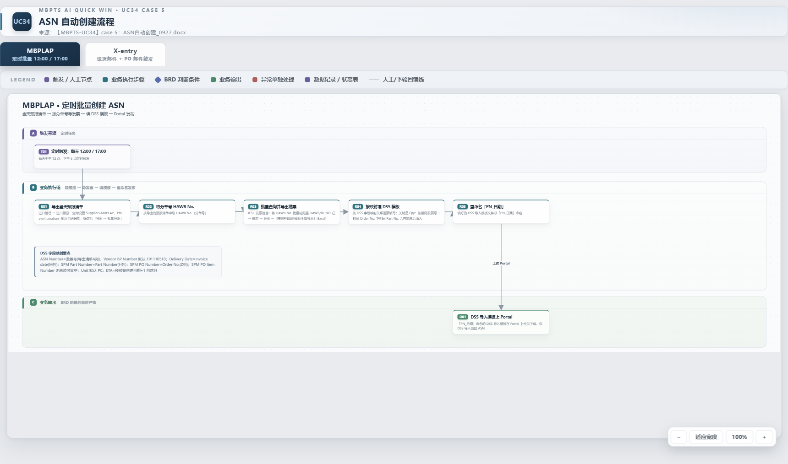

**X-entry 支线（送货邮件 + PO 邮件触发）**

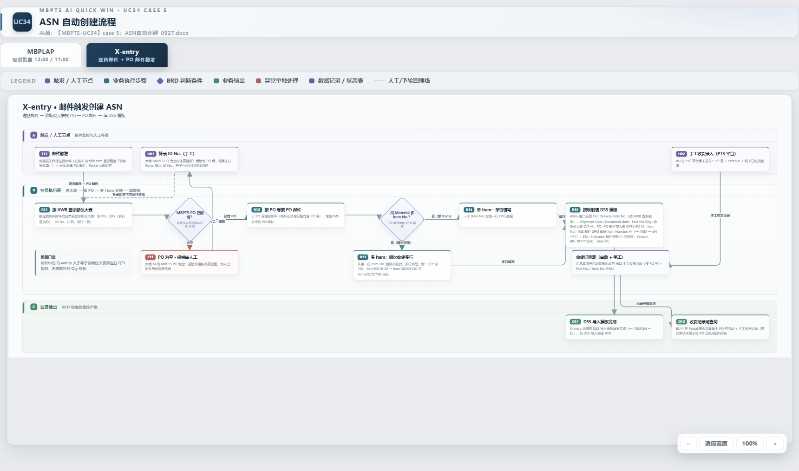

### 分阶段说明

**MBPLAP（票 = 分单号 HAWB/BL No.）**

1. **A 触发**：每日 12:00/17:00 定时（17:00 剔除 12:00 已运行分单号）；手动批量重提交随下次定时运行；
2. **B 执行链**：R01 进口预报批量导出（Supplier=MBPLAP ∧ Pre-alert creation=当日）→ R02 取分单号 → R03 发票信息按 PN 级模板导出 → R04 按映射填模板（Qty 合并加总为关键）→ R05 重命名「提单号_发票号」；
3. **C 输出**：模板发布 Portal 可下载，归档 SharePoint。

**X-entry（票 = 运单号 AWB No.）**

1. **A 触发/人工**：公邮监控送货邮件（@bjfcl.com ∧「快件签收单」）+ IMS PO 邮件；两个人工节点：H01 补录 ID No.、H02 手工收货录入；
2. **B 执行链**：R11 按 AWB 查大表（PN/QTY 加总/ID No.）→ D11 判断 MBPTS PO 已回填（空→E11 报错转人工阻断→H01→下次运行续跑）→ R12 按 PO 号搜 PO 邮件 → D12 判断多 Item（是→R13 顺次收货多行；否→R14 单行）→ R15 按映射填模板；
3. **C 输出**：O11 模板「PN_日期」发布；G01 收货记录表（自动+手工）→ O12 Portal 可查询。

## 6.2 系统交互时序

**MBPLAP 定时支线**

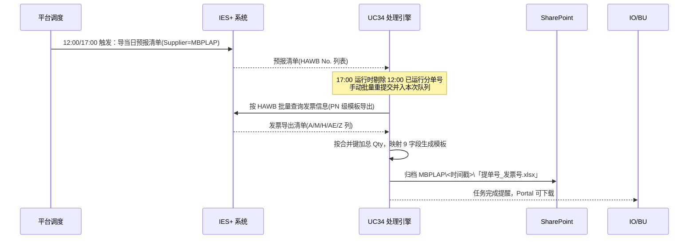

**X-entry 邮件支线**

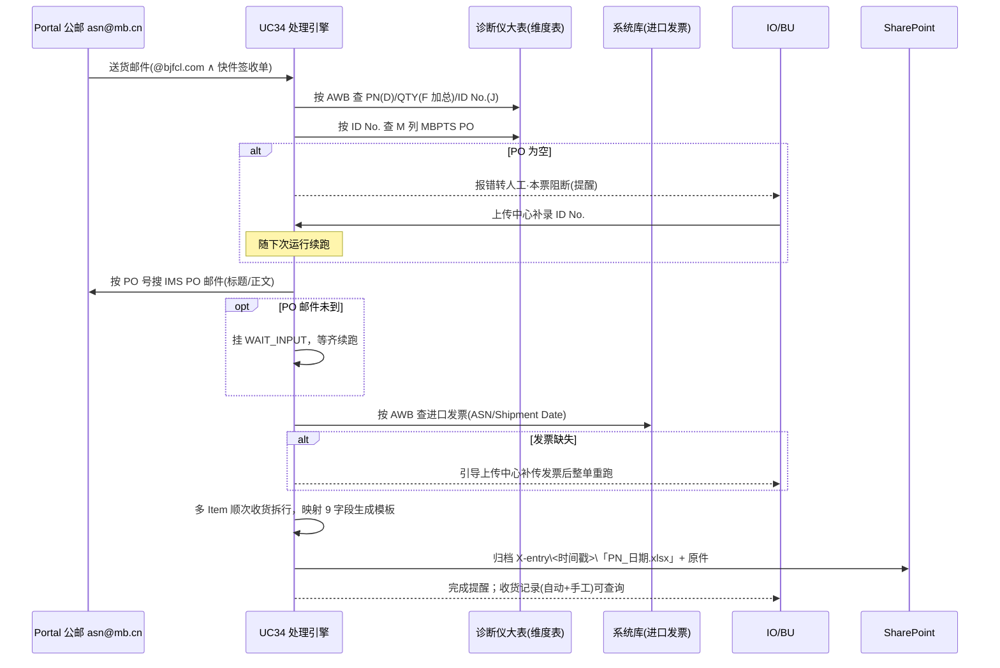

---

# 第七部分：功能设计

## 7.1 功能清单

| 编号 | 功能 | 优先级 | 原型（demo） |
|------|------|--------|------|
| F01 | 工作台（双支线统计与下钻） | P1 | `case5页面demo\index.html` |
| F02 | 任务中心（列表/手动创建/批量重跑/导出） | P0 | `case5页面demo\tasks.html` |
| F03 | 任务详情（节点轨迹/字段面板/重跑/触发历史） | P0 | `case5页面demo\task-detail.html` |
| F04 | 上传中心（发票补传/手工收货/ID No. 补录/收货记录） | P0 | `case5页面demo\dim-tables.html` |
| F05 | 邮件中心（监听规则/试运行） | P1 | `case5页面demo\rules.html` |
| F06 | 邮件规则编辑（条件/附件角色/流程绑定） | P1 | `case5页面demo\rule-edit.html` |
| F07 | 配置中心（DSS 模板版本管理） | P1 | `case5页面demo\config.html` |
| F08 | SharePoint 归档浏览 | P1 | `case5页面demo\sharepoint.html` |
| F09 | 提醒中心 | P1 | `case5页面demo\notify.html` |

## 7.2 核心业务规则

### R1：触发规则
- R1.1：MBPLAP 每日 **12:00 / 17:00** 定时触发；**17:00 运行前剔除 12:00 已成功运行的分单号**；
- R1.2：保留手动触发入口：按分单号或 Pre-alert creation 日期批量查询筛选重新提交，**随下一次定时任务一起运行**（Q3=A）；
- R1.3：X-entry 由 Portal 公邮 **asn@mb.cn** 邮件触发（Q4=A：代理/IMS 直发公邮，不转发）；送货邮件为主触发，PO 邮件未到 → 任务挂 WAIT_INPUT，到齐续跑；
- R1.4：X-entry 从触发到跑完可接受**半天时延**。

### R2：MBPLAP 字段映射规则
| DSS 字段 | 来源 | 规则 |
|---|---|---|
| ASN Number | 发票导出清单 A 列 Invoice No. | 默认发票号 |
| Vendor BP Number | 固定值 | **191110510** |
| Delivery date | 发票导出清单 M 列 Invoice date | — |
| SPM Part Number | 发票导出清单 H 列 Part Number | DSS 侧会转换 SPM PN 格式 |
| Quantity | 发票导出清单 AE 列 | **按相同发票号+相同 Order No.+相同 Part No. 合并加总** |
| Unit | 固定值 | PC |
| SPM PO Number | 发票导出清单 Z 列 Order No. | Case 3 导入模板补充 Order No. |
| SPM PO Item Number | 无来源 | **置空**（DSS supplier EDI 方案） |
| ETA date | 计算 | Pre-alert creation date **+1 自然日** |

### R3：X-entry 字段映射规则
| DSS 字段 | 来源 | 规则 |
|---|---|---|
| ASN Number | 进口发票（按 AWB 查系统库） | Our delivery note number |
| Vendor BP Number | 固定值 | **191110260** |
| Shipment/Delivery Date | 进口发票 | Document date |
| SPM Part Number | 诊断仪大表 | Part No.（D 列） |
| Quantity | 诊断仪大表 | Qty（F 列，多行加总） |
| Unit | 固定值 | PC |
| SPM PO Number | IMS PO 邮件 或 大表 DPTS PO 列 | 优先 PO 邮件 |
| SPM PO Item Number | IMS PO 邮件 SPM 截屏 | Item Number 列（一 ITEM 一 SN 一行） |
| ETA date | Fullcome 邮件 | 邮件日期 **+1 自然日** |

### R4：阻断与人工补录规则
- R4.1：大表灰色区 M 列 MBPTS PO 为空 → **本票硬阻断**、报错转人工、生成提醒；证据保留；
- R4.2：人工在上传中心**补录 ID No.**（4~8 位数字，demo 校验口径，BRD 未定义位数），写入字段当前生效值并留痕，该票**随下一次运行续跑**；
- R4.3：系统库查不到进口发票 → 任务标记缺失，引导上传中心**补传发票**（PDF 单文件 ≤20MB，建议 AWB 命名；大小限制为 demo 口径），补传后**整单重跑**取 ASN/Shipment Date。

### R5：顺次收货规则
- R5.1：同 Material 多 Item 时，从第一行 Item No. 起按剩余量**顺次收货**，拆多行模板；
- R5.2：示例：大表 QTY 总 100，Item100 剩 20 未收 → 生成「Item100/QTY20」「Item200/QTY80」两行；
- R5.3：邮件 Quantity ≥ 大表 QTY 加总，**不做额外 Qty 校验**（BRD 原注）。

### R6：命名与归档规则
- R6.1：MBPLAP 模板命名「**提单号_发票号**」；X-entry 模板命名「**PN_日期**」（Q1=A）；
- R6.2：SharePoint 归档结构：根目录诊断仪大表（唯一）；`MBPLAP\<YYYYMMDD_HHmm>\`、`X-entry\<YYYYMMDD_HHmm>\`（含发票与报关代理附件原件，保持原名）；仅归档已完成票产出。（BRD 未定义归档目录，此结构为业务确认口径，见 demo `data.js` 注释）

### R7：收货记录规则
- R7.1：自动（RPA）与手工（MANUAL）收货记录并列展示，**手工行不覆盖自动行**；
- R7.2：手工录入三字段：PO 号、Part No.、线下已收货数量（0922 BRD 口径；demo 校验为 PO 10 位数字、Part No. 5~20 位字母数字、数量 1~99999 整数，位数规则待业务确认）；手工数量按顺次收货摊销到 Item；
- R7.3：前台默认不展示每 PO 已收/剩余明细，BU 可搜索查看并导出 Excel。

### R8：留痕与审计规则
- R8.1：UC34 全场景**无人工审批**；字段修正仅作留痕（old→new，记录修正人与时间），自下次执行生效并跨 Run 继承；
- R8.2：触发/过程/操作三类证据留痕（WORM 防篡改），含来源文档定位（文档+页码高亮）。

## 7.3 原型及交互规则说明

> 原型基线：`case5页面demo\` 9 页静态 demo（侧栏标注「范围：UC34 · Case 5 · MBPLAP / X-entry」）；截图由 Puppeteer 从原型实时截取。

---

### 7.3.1 工作台（F01）

**用户角色**：IO / BU / 德勤

**功能说明**：Case5 总览页，按 MBPLAP / X-entry 两条线路分组展示任务统计，作为异常处理的入口。

**前置条件**：登录 Portal，进入 UC34 Case 5 工作区。

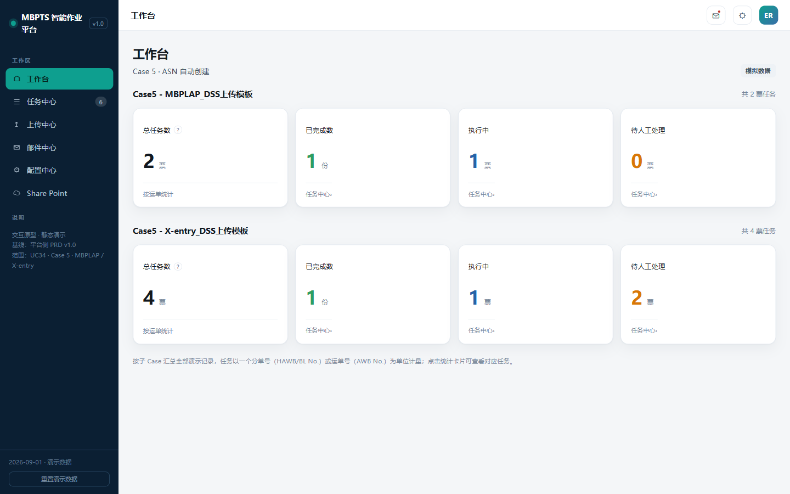

**页面操作说明**

| # | 功能点 | 功能描述&操作说明 |
|---|--------|----------------|
| 1 | 线路统计卡 | 每条线路展示：总任务数（票，悬停说明计量口径）、已完成、执行中、待人工处理 |
| 2 | 卡片下钻 | 点击「已完成/执行中/待人工处理」跳任务中心并携带线路+状态范围 |

**页面显示字段说明**

| 字段 | 类型 | 必填 | 可编辑 | 填写方式 | 备注 |
|------|------|------|--------|---------|------|
| 总任务数 | 数字 | — | 否 | 系统统计 | 票=一个 HAWB/BL No. 或 AWB No. |
| 已完成 / 执行中 / 待人工处理 | 数字 | — | 否 | 系统统计 | 点击下钻 |

---

### 7.3.2 任务中心（F02）

**用户角色**：IO（操作）/ 配置维护者、BU、德勤（只读）

**功能说明**：任务（票）列表。任务=业务单据粒度，状态取最新执行实例（Run）；支持手动创建、批量重跑与导出。

**前置条件**：无（侧栏「任务中心」入口，徽标显示待人工处理数）。

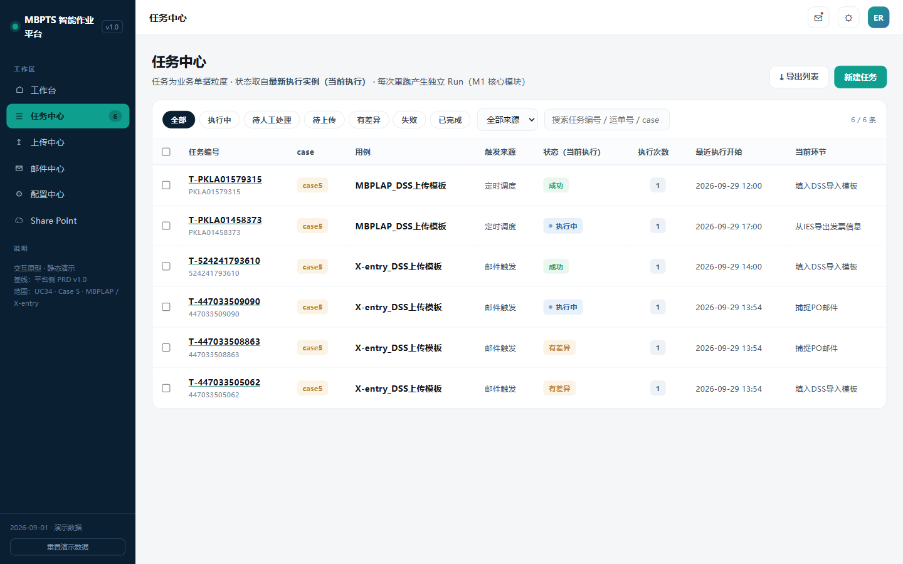

**页面操作说明**

| # | 功能点 | 功能描述&操作说明 |
|---|--------|----------------|
| 1 | 状态筛选 chips | 全部/执行中/待人工处理/待上传/有差异/失败/已完成 |
| 2 | 来源筛选 | 定时调度/邮件触发/手动创建/手动触发 |
| 3 | 关键字搜索 | 任务编号 / 运单号 / case / 用例 |
| 4 | 新建任务 | 弹窗选线路（MBPLAP/X-entry）创建；手动批量按分单号或 Pre-alert 日期提交后随下次定时运行（R1.2） |
| 5 | 批量重跑 | 勾选任务 → 确认弹窗 → 逐票生成新 Run；执行中的跳过 |
| 6 | 导出列表 | CSV 下载（含 HAWB/AWB、线路等列） |
| 7 | 行点击 | 进入任务详情；来自工作台的下钻显示范围横幅，可清除 |

**页面显示字段说明**

| 字段 | 类型 | 必填 | 可编辑 | 填写方式 | 备注 |
|------|------|------|--------|---------|------|
| 任务编号 | 文本 | — | 否 | 系统生成 | T-XXX，附 HAWB/AWB 号 |
| 用例 | 枚举 | — | 否 | 系统 | MBPLAP_DSS上传模板 / X-entry_DSS上传模板 |
| 触发来源 | 枚举 | — | 否 | 系统 | 定时调度/邮件触发/手动创建/手动触发 |
| 状态（当前执行） | 枚举 | — | 否 | 系统 | CREATED/DISPATCHED/RUNNING/WAIT_INPUT/DIFF_PENDING/FAILED/SUCCEEDED |
| 执行次数 / 最近执行开始 / 当前环节 | 文本 | — | 否 | 系统 | — |

---

### 7.3.3 任务详情（F03）

**用户角色**：IO（操作）/ 其他角色只读

**功能说明**：单票处理全貌。严格区分 Task（业务单据）与 Run（执行实例），默认展示当前执行，历史 Run 只读；承载字段识别、原文定位、修正留痕与重跑。

**前置条件**：从任务中心行点击或提醒中心跳转进入。

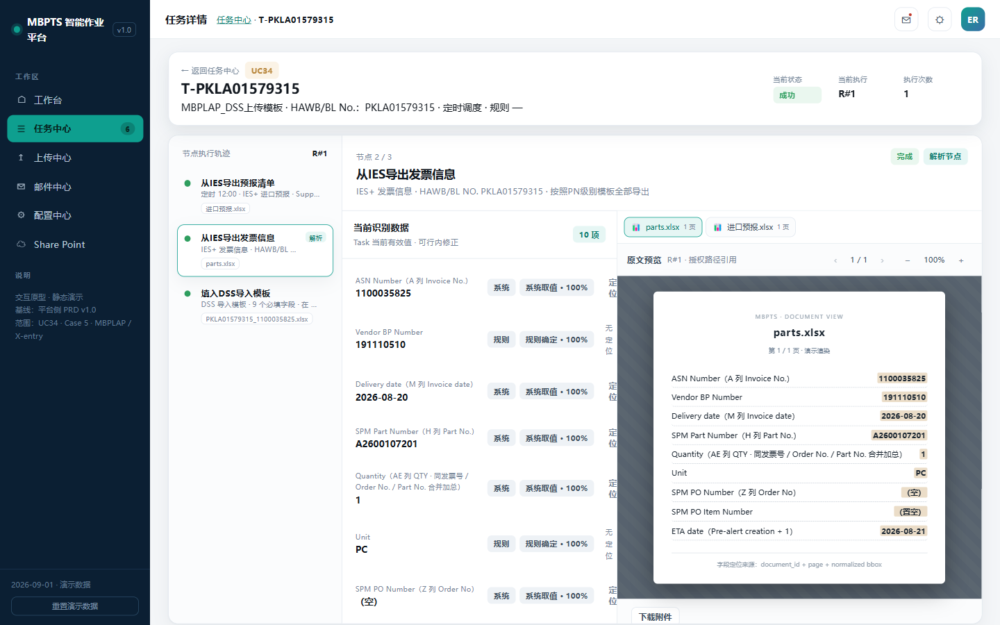

**页面操作说明**

| # | 功能点 | 功能描述&操作说明 |
|---|--------|----------------|
| 1 | 状态横幅 | 待上传（缺件清单+去上传）/ 有差异（金色高亮）/ 执行失败（红色原因）分态展示 |
| 2 | Run 切换 | R#1/R#2 芯片切换；历史只读；可切回当前执行 |
| 3 | 节点执行轨迹 | 左节点轨 + 右工作区；节点状态 ok/run/fail/review/queued |
| 4 | 字段面板 | 解析节点内联「当前识别数据」：值/来源/置信度/定位（跳原文高亮）/修正（行内编辑，留痕，自下次执行生效，跨 Run 继承） |
| 5 | 原文预览 | 多文档 tabs（诊断仪大表/IMS 邮件/进口发票 PDF/报关代理邮件），翻页/缩放/下载 |
| 6 | 重跑 | 「整单重跑」或失败节点「从此节点重跑」→ 新 Run 携带修正值；执行中防并发 |
| 7 | 差异处理 | MBPLAP 无需上传（IES+ 系统导出）；X-entry 缺发票/ID No. 时引导跳上传中心对应入口 |
| 8 | 触发历史 | 同 Case 兄弟任务累计次数/成功率/平均耗时 + 15 天热力 + 最近 8 条 |

**页面显示字段说明（MBPLAP 示例）**

| 字段 | 类型 | 必填 | 可编辑 | 填写方式 | 备注 |
|------|------|------|--------|---------|------|
| ASN Number | 文本 | 是 | 可修正 | 系统取值（A 列 Invoice No.） | 修正留痕 old→new |
| Vendor BP Number | 文本 | 是 | 可修正 | 规则确定 191110510 | — |
| Delivery date | 日期 | 是 | 可修正 | 系统取值（M 列） | — |
| SPM Part Number | 文本 | 是 | 可修正 | 系统取值（H 列） | — |
| Quantity | 数字 | 是 | 可修正 | 系统取值（AE 列合并加总） | 合并键见 R2 |
| Unit / SPM PO Number / SPM PO Item Number / ETA date | 文本 | 是 | 可修正 | 系统/规则 | PO Item 置空；ETA=Pre-alert+1 |

---

### 7.3.4 上传中心（F04）

**用户角色**：IO / BU（手工收货录入）

**功能说明**：系统无法自动取得数据的统一人工入口，Case5 全部为 X-entry 场景；并提供收货记录查询。

**前置条件**：存在待人工处理任务（或 BU 主动录入手工收货）。

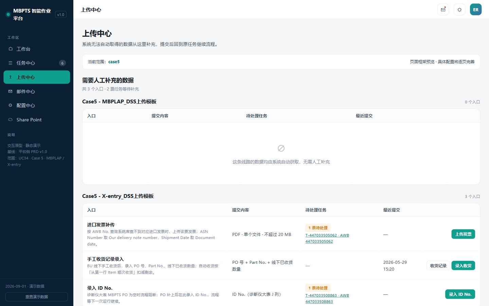

**页面操作说明**

| # | 功能点 | 功能描述&操作说明 |
|---|--------|----------------|
| 1 | 进口发票补传 | PDF 单文件 ≤20MB，建议 AWB 命名；关联待处理任务；提交后整单重跑取 ASN/Shipment Date |
| 2 | 手工收货记录录入 | PO 号（10 位）+ Part No. + 线下已收货数量；PO 带联想；提交计入收货记录（source=MANUAL） |
| 3 | 录入 ID No. | 4~8 位数字；与当前值相同拒绝；写入字段当前生效值并留痕，任务随下次运行续跑 |
| 4 | 收货记录抽屉 | 自动+手工合并表（时间/来源/PO/Item/Part No./数量）+ 每 PO 已收/订购/剩余汇总；手工按顺次收货摊销 |
| 5 | 提交记录 | 提交时间/入口/内容/关联任务/操作人/处理结果；类型 chips + 搜索 |
| 6 | 待处理联动 | 提交成功弹窗可「返回任务」直跳任务详情 |

**页面显示字段说明**

| 字段 | 类型 | 必填 | 可编辑 | 填写方式 | 备注 |
|------|------|------|--------|---------|------|
| 发票文件 | 文件 | 是（补传时） | 是 | 上传 | PDF ≤20MB |
| PO 号 | 文本 | 是 | 是 | 手输+联想 | 10 位 |
| Part No. | 文本 | 是 | 是 | 手输 | — |
| 线下已收货数量 | 数字 | 是 | 是 | 手输 | 正整数 |
| ID No. | 文本 | 是 | 是 | 手输 | 4~8 位数字 |

---

### 7.3.5 邮件中心（F05）

**用户角色**：配置维护者

**功能说明**：邮件监听规则管理与邮件模板。Case5 仅 X-entry 有两条监听规则；邮件模板为空态（结果不发通知邮件）。

**前置条件**：配置维护者权限。

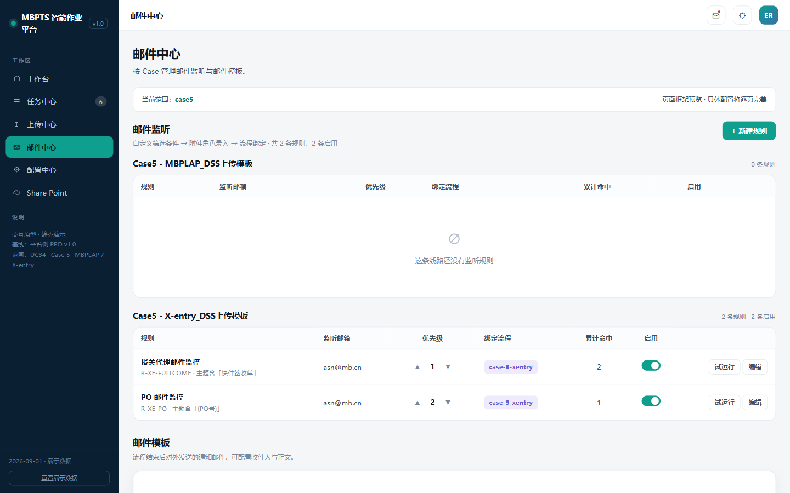

**页面操作说明**

| # | 功能点 | 功能描述&操作说明 |
|---|--------|----------------|
| 1 | 规则列表 | 按线路分组：规则/监听邮箱/优先级/绑定流程/累计命中/启停/操作 |
| 2 | 启停开关 | 提示「不影响存量任务」 |
| 3 | 优先级调整 | 同线路内 ▲▼ 交换 |
| 4 | 试运行 dry-run | 对样本邮件真实匹配，弹窗展示命中/未命中/未触发原因 |
| 5 | 新建/编辑 | 跳规则编辑页 |
| 6 | 邮件模板 | Case5 空态展示「结果为 DSS 导入模板在 Portal 下载，不发通知邮件」 |

**内置规则**

| 规则 | 监听邮箱 | 条件 | 附件角色 | 绑定流程 |
|------|---------|------|---------|---------|
| R-XE-FULLCOME 报关代理邮件监控 | asn@mb.cn | 发件人 `*@bjfcl.com` ∧ 主题含「快件签收单」∧ 附件 1-9 个 | pod（Excel，`^快件签收单.*\.xlsx$`） | case-5-xentry |
| R-XE-PO PO 邮件监控 | asn@mb.cn | 主题/正文含 PO 号 | spm_screenshot（图片、多份） | case-5-xentry |

---

### 7.3.6 邮件规则编辑（F06）

**用户角色**：配置维护者

**功能说明**：三段式规则编辑表单：筛选条件、附件要求（角色录入）、流程绑定。

**前置条件**：从邮件中心「新建/编辑」进入。

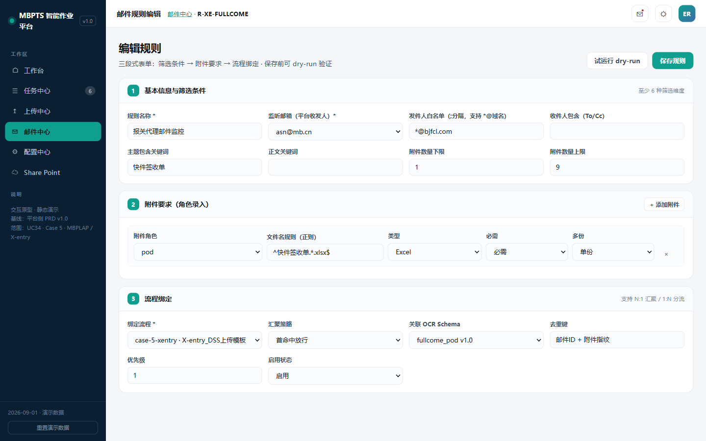

**页面操作说明**

| # | 功能点 | 功能描述&操作说明 |
|---|--------|----------------|
| 1 | 基本信息与筛选条件 | 规则名称、监听邮箱、发件人白名单（支持 `*@域名`）、收件人包含（To/Cc）、主题/正文关键词、附件数量上下限 |
| 2 | 附件要求 | 可增删行：附件角色/文件名正则/类型（PDF/Excel/图片/不限）/必需或可选/单份或多份 |
| 3 | 流程绑定 | 绑定流程（线路自动推导）、汇聚策略（首命中放行/全命中凑齐必需附件）、关联 OCR Schema、去重键、优先级、启用状态 |
| 4 | 保存 | 校验：名称必填、至少一条附件且至少一条必需、下限≤上限；保存前可 dry-run |

---

### 7.3.7 配置中心（F07）

**用户角色**：配置维护者

**功能说明**：DSS 导入模板版本管理；共享盘监听在 Case5 置灰。

**前置条件**：配置维护者权限。

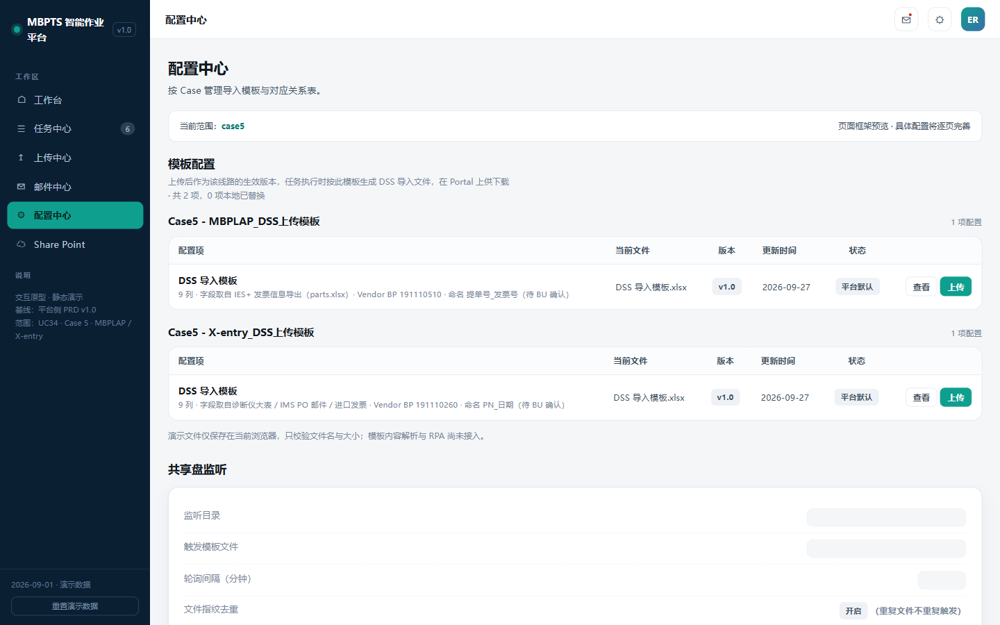

**页面操作说明**

| # | 功能点 | 功能描述&操作说明 |
|---|--------|----------------|
| 1 | 模板配置表 | 按线路分组：配置项/当前文件/版本/更新时间/状态/操作 |
| 2 | 查看 | 抽屉展示 9 列列结构（DSS_TEMPLATE_COLS） |
| 3 | 上传替换 | 校验 .xlsx 与 ≤20MB；成功后版本+1、状态「已替换」 |
| 4 | 共享盘监听 | 字段留空置灰、保存禁用（Case5 走定时+邮件触发） |

---

### 7.3.8 SharePoint 归档浏览（F08）

**用户角色**：IO / BU / 配置维护者

**功能说明**：云文档式只读浏览归档产出。

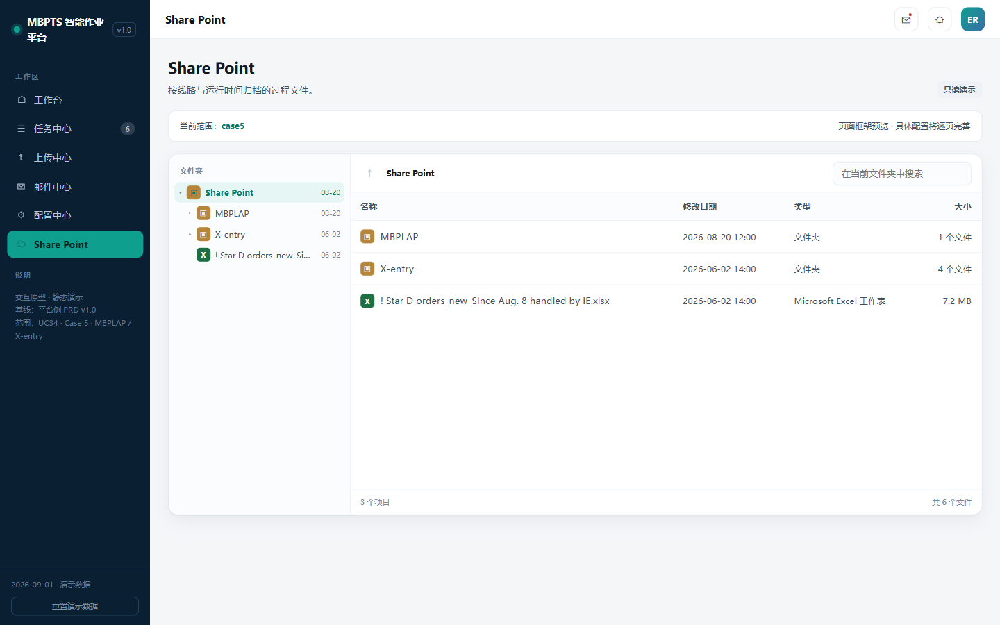

**页面操作说明**

| # | 功能点 | 功能描述&操作说明 |
|---|--------|----------------|
| 1 | 目录树+列表 | 左树右表（名称/修改日期/类型/大小）+ 面包屑 + 当前文件夹搜索 |
| 2 | 文件预览 | 点击开抽屉：元信息 + 下载/复制路径 |
| 3 | 归档结构 | 根目录诊断仪大表（唯一）；`MBPLAP\<YYYYMMDD_HHmm>\DSS 模板`；`X-entry\<YYYYMMDD_HHmm>\DSS 模板+进口发票+报关代理附件` |

---

### 7.3.9 提醒中心（F09）

**用户角色**：全部角色

**功能说明**：阻断与完成提醒的统一收件箱。

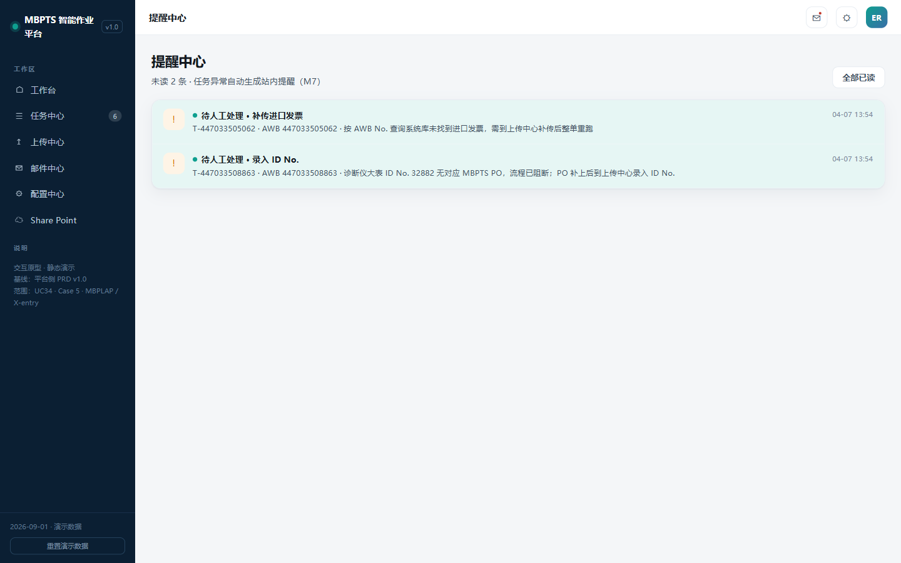

**页面操作说明**

| # | 功能点 | 功能描述&操作说明 |
|---|--------|----------------|
| 1 | 未读计数 | 头部未读数 + 「全部已读」 |
| 2 | 提醒列表 | 图标/标题/描述/时间；典型：X-entry 待人工处理（PO 阻断/发票缺失）、任务执行成功 |
| 3 | 点击跳转 | 标记已读并跳任务详情 |

---

# 第八部分：数据需求

> **出处说明**：本部分表结构、API 与错误码为本次 PRD 的设计稿（源文档未定义），供开发评审确认；其中错误码段 424340x / 400340x 沿袭历史初版，409340x 为本次新增。

## 8.1 数据模型（逻辑模型）

### uc34_task（任务/票，新增）
| 字段名 | 类型 | 说明 |
|--------|------|------|
| id | string | 任务编号 T-XXX |
| case_id / line | string | case-5；mbplap / xentry |
| waybill | string | 分单号 HAWB/BL No. 或运单号 AWB No. |
| src | enum | 定时调度/邮件触发/手动创建/手动触发 |
| need | enum | 无 / invoice（缺发票）/ idno（缺 PO） |
| status | enum | 由最新 Run 推导（CREATED/DISPATCHED/RUNNING/WAIT_INPUT/DIFF_PENDING/FAILED/SUCCEEDED） |

### uc34_run（执行实例，新增）
| 字段名 | 类型 | 说明 |
|--------|------|------|
| task_id / run_no | string/int | 所属任务与 R#N |
| cause | enum | 触发原因（定时/邮件/手动/重跑） |
| status / started_at / duration | — | 执行状态与耗时 |
| nodes | json | 节点轨迹（名称/状态/证据/附件/错误） |

### uc34_field_extract（字段抽取与修正留痕，新增）
| 字段名 | 类型 | 说明 |
|--------|------|------|
| run_id / field_key | string | 所属执行与 DSS 字段键 |
| value / source | string/enum | 当前值；系统/规则/OCR |
| confidence / quality | number/enum | 置信度与质量标签 |
| locator | json | 原文定位（docIndex+page+bbox） |
| delta | json | 修正留痕 old→new（操作人/时间） |
| carried | bool | 是否继承自上次执行修正值 |

### uc34_mail_rule（邮件监听规则，新增）
| 字段名 | 类型 | 说明 |
|--------|------|------|
| id / line / mailbox | string | R-XE-FULLCOME 等；xentry；asn@mb.cn |
| criteria | json | from/to/subj/body/附件数量上下限 |
| attachments | json | 角色/正则/类型/必需/多份 |
| flow / agg_policy / ocr_schema | string | 绑定流程/汇聚策略/OCR Schema |
| priority / enabled / hits | int/bool/int | 优先级/启停/累计命中 |

### uc34_receipt_record（收货记录，新增）
| 字段名 | 类型 | 说明 |
|--------|------|------|
| po / item / part_no | string | PO、Item、零件号 |
| qty / source | int/enum | 数量；rpa / manual |
| awb / asn / task_id | string | 关联运单、ASN、任务 |
| created_at / operator | — | 时间与操作人（手工行） |

### uc34_manual_upload（人工补录记录，新增）
kind(invoice/receipt/idno)、content、task_id、operator、result、created_at

### uc34_config_item（配置项，新增）
line、type(dss_template/dim_table/vendor_fix)、file、version、status、updated_at

### uc34_evidence / uc34_notify / uc34_audit_log（证据/提醒/审计，新增）
证据：task_id、type(trigger/process/operation)、hash、files；提醒：link、read；审计：actor、action、detail、time。

**索引建议**：task(line+status)、task(waybill)、receipt(po+part_no)、receipt(awb)、upload(task_id)、notify(read)。

## 8.2 API 接口（平台前后端）

| 接口 | 方法 | 说明 |
|------|------|------|
| /api/uc34/tasks | GET | 任务列表（状态/来源/关键字/线路/日期筛选） |
| /api/uc34/tasks/{id} | GET | 任务详情（当前 Run+节点+字段+证据+触发历史） |
| /api/uc34/tasks | POST | 手动创建/批量重提交（分单号或 Pre-alert 日期批量，随下次定时运行） |
| /api/uc34/tasks/{id}/rerun | POST | 整单重跑 / 节点重跑（携带修正值，防并发） |
| /api/uc34/uploads | GET/POST | 上传中心三入口提交（invoice/receipt/idno）+ 提交记录查询 |
| /api/uc34/receipts | GET | 收货记录查询（PO/PN 搜索，自动+手工，导出 Excel） |
| /api/uc34/mail-rules | GET/POST/PUT | 规则管理（启停/优先级/编辑） |
| /api/uc34/mail-rules/{id}/dry-run | POST | 规则试运行 |
| /api/uc34/config-items | GET/POST | DSS 模板查看/上传替换（版本+1） |
| /api/uc34/sharepoint/tree | GET | 归档目录浏览/文件下载 |
| /api/uc34/notifications | GET/PUT | 提醒列表/标记已读 |

## 8.3 错误码

| 错误码 | 含义 |
|--------|------|
| 4243401 | 诊断仪大表未就绪/未上传 |
| 4243402 | 系统库进口发票查询失败 |
| 4243403 | SharePoint 归档不可达 |
| 4003401 | 补录参数不全或格式错误（PO 非 10 位 / ID No. 非 4~8 位数字） |
| 4003402 | 发票补传文件非法（非 PDF 或 >20MB） |
| 4093401 | 任务执行中，禁止并发重跑 |
| 4093402 | 补录值与当前生效值相同 |

---

# 第九部分：非功能性需求

| 类别 | 指标 | 要求 |
|------|------|------|
| 性能 | 定时准点性 | 12:00/17:00 准点触发，当日窗口内完成 |
| 性能 | 邮件触发时延 | X-entry 从邮件到达到模板产出 ≤ 半天（BRD 口径） |
| 性能 | 拆行计算 | 多 Item 顺次收货 O(n) |
| 可用性 | 批次隔离 | 单票失败不阻塞同批次其他票；节点级断点续跑 |
| 安全 | 留痕 | 证据 WORM 防篡改；字段修正留痕；操作审计 |
| 安全 | 权限 | 四角色（IO/配置维护者/BU/德勤）按第三部分矩阵控制 |
| 兼容性 | 浏览器/文件 | PC Chrome/Edge；上传 PDF/Excel ≤20MB |

---

# 第十部分：约束与假设

| 约束 | 说明 |
|------|------|
| 平台边界 | 产出 = DSS 导入模板文件 + Portal 下载/SharePoint 归档；与 DSS/SPM 零集成（Q2=A 维持边界） |
| 供应商固定值 | Vendor BP 当前固定 191110510（MBPLAP）/ 191110260（X-entry），配置可改 |
| 诊断仪大表 | 由业务定期上传维度表维护（与 Case 4 合并），根目录唯一 |
| 文件限制 | 上传文件 ≤20MB（PDF/Excel）（demo 口径，BRD 未定义，待业务确认） |

| 假设 | 说明 |
|------|------|
| 邮件直发 | 报关代理与 IMS 同事直接发送 Portal 公邮（Q4=A）；公邮地址 demo 演示取值为 asn@mb.cn，正式地址以上线配置为准 |
| IMS 邮件格式 | PO 号在邮件正文（后续要求标题也带 PO 号，BRD 原注） |
| Qty 口径 | 邮件 Quantity ≥ 大表筛选后 QTY 加总，无需额外校验（BRD 原注） |
| 收货范围 | 仅新货收货；旧货/GLC 补货不 GR（判定同 Case 4） |

---

# 第十一部分：风险与待确认

## 风险

| 编号 | 风险 | 等级 | 应对 |
|------|------|------|------|
| RSK-1 | 报关代理/IMS 邮件格式不稳定（主题、附件命名变化） | 中 | 监控条件可配置 + dry-run 验证；UAT 期观察 |
| RSK-2 | DSS 模板列结构改版导致映射失效 | 中 | 模板版本化配置（F07），列结构抽屉可核对 |
| RSK-3 | 诊断仪大表人工维护延迟（M 列 PO 回填不及时） | 中 | 硬阻断+提醒机制保证可见；统计阻断率 |
| RSK-4 | IES+ 导出模板（预报/发票 PN 级）列位置变化 | 低 | 建议映射按列名优先、列号兜底（技术方案，待开发评审）；异常 Remark |

## 待确认（Open Items）

| 编号 | 问题 | 影响 | 状态 |
|------|------|------|------|
| OI-C5-1 | 定时窗口准点率等指标目标值 | NFR 量化 | OPEN（随项目层） |
| OI-C5-2 | PO 阻断人工补录的 SLA | 运营指标 | OPEN（业务内部） |
| OI-C5-3 | 邮件 Quantity < 大表加总的兜底流程是否需固化（BRD 注明不会发生） | 异常路径 | OPEN（暂按 Remark+转人工） |

---

# 附录

## 附录A：原型与截图清单

| 页面 | 原型文件（工作区） | 截图 |
|------|------|------|
| 工作台 | `case5页面demo\index.html` | [proto-01-工作台.png](./images/proto-01-工作台.png) |
| 任务中心 | `case5页面demo\tasks.html` | [proto-02-任务中心.png](./images/proto-02-任务中心.png) |
| 任务详情 | `case5页面demo\task-detail.html` | [proto-03-任务详情.png](./images/proto-03-任务详情.png) |
| 上传中心 | `case5页面demo\dim-tables.html` | [proto-04-上传中心.png](./images/proto-04-上传中心.png) |
| 邮件中心 | `case5页面demo\rules.html` | [proto-05-邮件中心.png](./images/proto-05-邮件中心.png) |
| 规则编辑 | `case5页面demo\rule-edit.html` | [proto-06-规则编辑.png](./images/proto-06-规则编辑.png) |
| 配置中心 | `case5页面demo\config.html` | [proto-07-配置中心.png](./images/proto-07-配置中心.png) |
| SharePoint | `case5页面demo\sharepoint.html` | [proto-08-SharePoint.png](./images/proto-08-SharePoint.png) |
| 提醒中心 | `case5页面demo\notify.html` | [proto-09-提醒中心.png](./images/proto-09-提醒中心.png) |
| 业务流程图 | [UC34-Case5_业务流程图.html](./UC34-Case5_业务流程图.html) | [flow-01-MBPLAP.png](./images/flow-01-MBPLAP.png) / [flow-02-Xentry.png](./images/flow-02-Xentry.png) |

## 附录B：相关文档

| 文档 | 说明 |
|------|------|
| `【MBPTS-UC34】Case 5_ASN 自动创建_BRD_0922_Xentry&MBPLAP.docx` | BRD 全量版（0922），数据映射基线 |
| `【MBPTS-UC34】BRD梳理（自用版）\case 5：ASN自动创建_0927.docx` | BRD 梳理版（0927），流程图事实源 |
| `【MBPTS-UC34】业务流程图_0928\[【UC34-Case5】...20260927.html` | 业务流程图（0928） |
| `docs\Case2_PRD\UC34-Case2_PRD.md` | 同项目 Case 2 PRD（格式参考） |
| `UC34 PRD初版\PRD_Case5_ASN自动创建.md` | 历史初版 v1.0.0（0921），决议沿用 |
| [需求澄清文档](./UC34-Case5_需求澄清文档.md) | Q1–Q4 澄清记录 |

---

**文档版本**：v1.0.1 | **编写日期**：2026-09-29 | **审核人**：待评审
