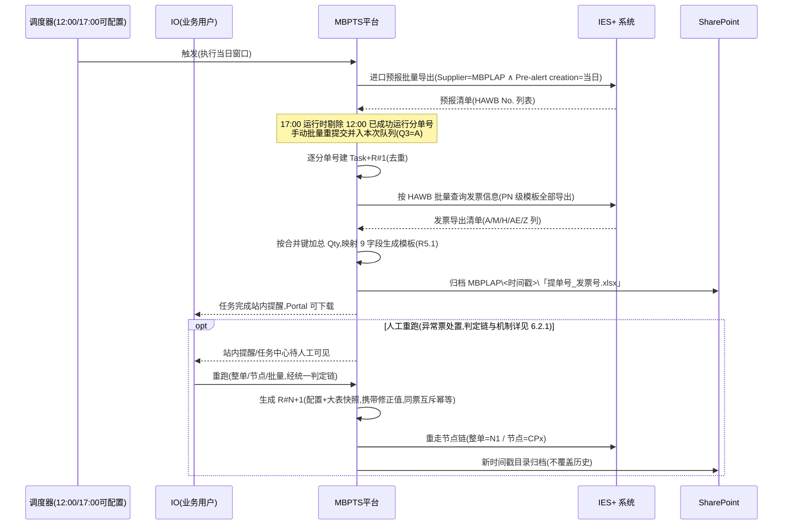
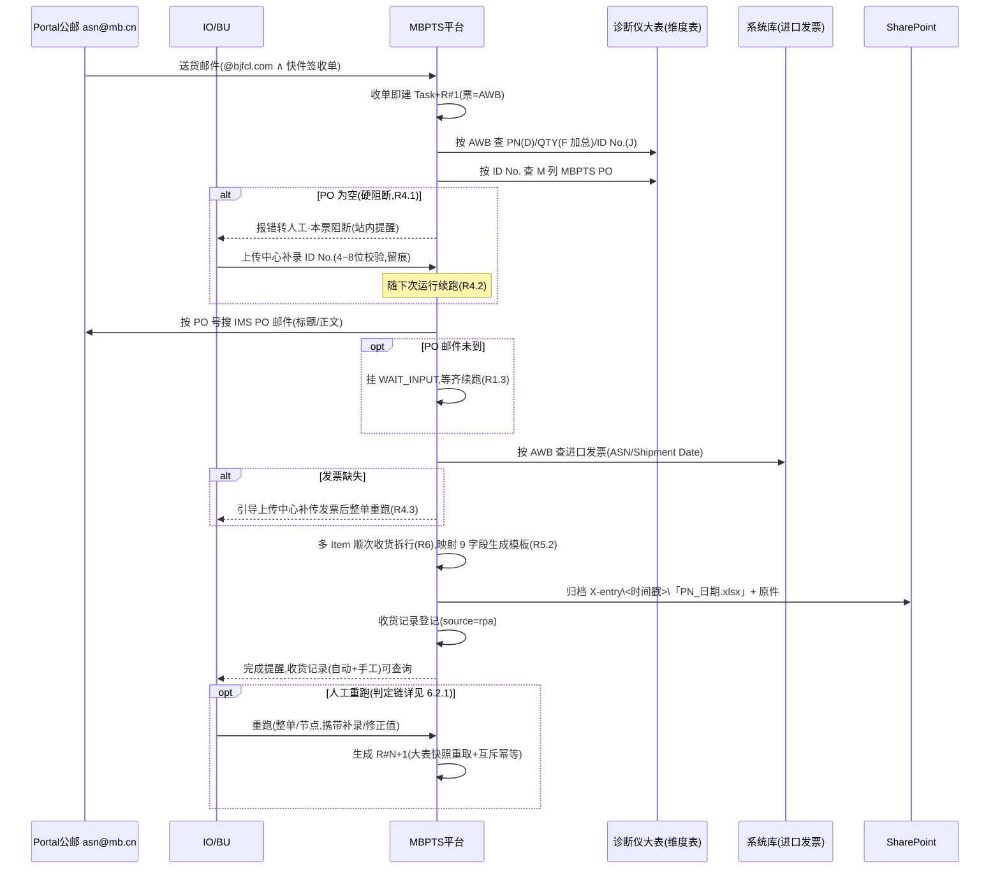
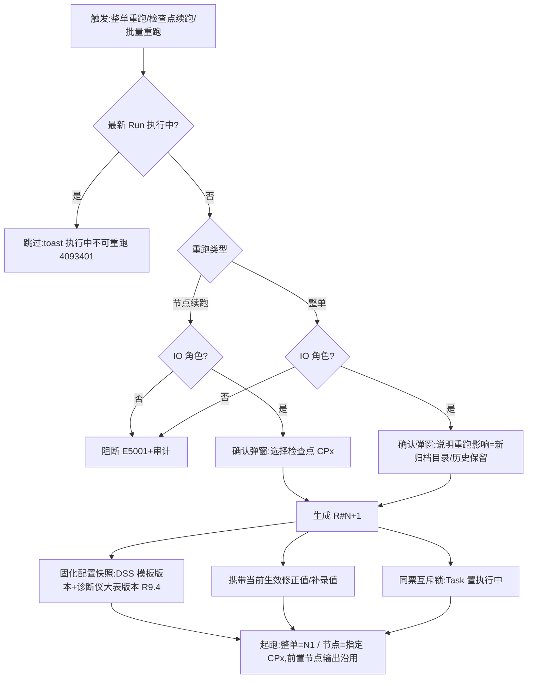

# MBPTS UC34 Case 5：ASN 自动创建(MBPLAP / X-entry 双支线)— 产品需求文档(修订版)

## 文档信息

| 项目 | 内容 |
|------|------|
| **文档名称** | UC34 Case 5 · ASN 自动创建(MBPLAP / X-entry 双支线)PRD |
| **版本** | v2.0.0(按 Case2 GLC v1.2.4 终态框架一次性对齐) |
| **创建日期** | 2026-09-29 |
| **最后更新** | 2026-10-09 |
| **负责人** | BA(SCM-IE / Import Operations 对接) |
| **审核人** | 待审核 |
| **密级** | 内部 |

**文档用途**:定义 MBPTS 平台 UC34 Case 5「ASN 自动创建」场景的产品需求,覆盖 **MBPLAP(定时批量)** 与 **X-entry(邮件触发)** 两条支线,作为开发与验收依据。

**关联文档**:
- [需求澄清文档](./UC34-Case5_需求澄清文档.md)(Q1~Q4 全部已澄清;沿用决议见该文档"零、项目背景信息")
- [需求 Plan](./requirements_plan.md) / [设计 Plan](./design_plan.md)
- 业务流程图源文件:[UC34-Case5_业务流程图.html](./UC34-Case5_业务流程图.html)(双支线泳道图,浏览器打开)
- 原型基线:`C:\MBPTS\case5页面demo\`(9 页静态 demo,见附录A)
- 业务依据:`【MBPTS-UC34】Case 5_ASN 自动创建_BRD_0922_Xentry&MBPLAP.docx`(全量版)、`【MBPTS-UC34】case 5:ASN自动创建_0927.docx`(梳理版)、`【UC34-Case5】ASN自动创建_业务流程图_20260927.html`
- 历史初版:`UC34 PRD初版\PRD_Case5_ASN自动创建.md` v1.0.0(2026-09-21,已确认决议沿用)
- 框架模板:`docs\Case2_PRD\UC34-Case2-GLC_PRD_修订版.md` v1.2.4(本版文档架构基准)
- 原 PRD:`docs\Case5_PRD\UC34-Case5_PRD.md` v1.0.1(**本文档不改动原文件**)

---

## 版本历史

| 版本号 | 修订日期 | 修订人 | 修订内容 | 状态 |
|--------|---------|--------|---------|------|
| v1.0.0 | 2026-09-29 | BA | 基于 0922/0927 BRD、0928 业务流程图与新版页面原型重写;Stage 1 澄清 Q1–Q4 闭环;Stage 2 设计审批通过 | 评审中 |
| v1.0.1 | 2026-09-29 | BA | 交叉自检修正:US-002 区分 BRD 能力与 demo 现状;Portal 公邮地址/20MB/PO 与 ID No. 位数/归档目录结构标注出处;第八部分标注为设计稿;E1/E3 与 RSK-4 标注来源 | 评审中 |
| v2.0.0 | 2026-10-09 | BA | **框架对齐(非业务变更)**:按 Case2 GLC v1.2.4 终态框架一次性对齐——新增 3.1 对外动作清单(结论:本 Case 无对外系统写入);6.2.1 重跑判定链;6.3 页面跳转闭环 J1~J14;7.3 页面级扩写(每页补齐进入条件/字段表含业务原因/按钮×角色矩阵/系统处理与反馈/空态异常);新增 7.4 节点实现规格(MBPLAP 6 节点+X-entry 7 节点+3 道闸口)、7.5 性能与数据量级(假设挂 OPEN)、7.6 通用规格(控件/文案/权限×状态×操作总矩阵/展示规范/边界并发);8.0 字段级设计(DSS 9 字段×双支线+诊断仪大表列口径);8.2 补"页面-操作-接口映射"与 IES+ 能力要求;新增第九部分平台能力分析;第十一部分显式列出概要设计 3 项技术决策 D1~D3;OPEN 重编号为 OPEN-A1~A18(含原 OI-C5-1~3)。**业务规则与 v1.0.1 口径不变,四项关键决策(命名两式/平台边界/手动批量+剔除/邮件直发)全部保留** | 草稿(含 18 项 OPEN 待确认) |

---

# 第一部分:产品概述

## 1.1 产品定义

**产品名称**:MBPTS UC34 Case 5 — ASN 自动创建(MBPLAP / X-entry 双支线)

**所属系统**:MBPTS AI Quick Win 平台(PTS Portal,UC34 进口单证自动化)

**功能定位**:按两条支线自动组装 **DSS 导入模板(9 个必填字段)**,供业务导入 DSS 创建 ASN(Advance Shipping Notice,预发货通知);**平台产出到模板文件 + Portal 下载/SharePoint 归档为止,与 DSS/SPM 零集成**(Q2=A)。

- **MBPLAP 支线**:每日 12:00 / 17:00 定时触发,以分单号(HAWB/BL No.)为单位,IES+ 两级导出(进口预报清单 → PN 级发票信息)→ 按合并键加总 → 生成 DSS 模板「提单号_发票号」;
- **X-entry 支线**:Portal 公邮(asn@mb.cn)邮件触发,以运单号(AWB No.)为单位,报关代理送货邮件 + IMS PO 邮件 → 诊断仪大表查询 → PO 缺失硬阻断转人工 → 多 Item 顺次收货拆行 → 生成 DSS 模板「PN_日期」。

**使用端**:PC Web Portal(工作台 / 任务中心 / 任务详情 / 上传中心 / 邮件中心 / 配置中心 / SharePoint / 提醒中心)

**交付版本**:v2.0.0

## 1.2 产品愿景

让 ASN 创建从「人工跨系统导表、手工合并、逐票填报」变为「平台自动出模板、人工只处理例外」;IO 同事从重复劳动转向异常处理,每票全程可追溯、可审计、可受控重跑。

## 1.3 核心价值

| 价值维度 | 价值描述 | 受益人群 |
|---------|--------|---------|
| 效率 | MBPLAP 每日两窗定时自动出模板,替代人工 IES+ 两级导出与手工合并加总 | IO(进口操作) |
| 准确 | X-entry 多 Item 顺次收货拆行由系统计算,避免人工查诊断仪大表算错数量 | IO |
| 可控 | PO 缺失硬阻断可见、人工补录后续跑;收货记录自动/手工并列可查 | IO / BU |
| 合规 | 触发/过程/操作三类证据留痕(WORM)、修正留痕可追溯、产出文件归档可查 | BU / 审计 |
| 可维护 | DSS 模板、邮件监听规则、诊断仪大表均配置化/版本化 | 配置维护者 |

## 1.4 产品范围

### 包含范围

| 模块 | 功能描述 |
|------|--------|
| MBPLAP 定时支线 | 12:00/17:00 定时触发(17:00 剔除 12:00 已成功运行分单号);IES+ 预报批量导出 → 发票 PN 级导出 → 合并加总 → DSS 模板「提单号_发票号」 |
| MBPLAP 手动触发 | 按分单号或 Pre-alert creation 日期批量查询筛选并重新提交,随下一次定时任务一起运行(Q3=A) |
| X-entry 邮件支线 | 公邮监控报关代理送货邮件 + IMS PO 邮件;AWB→诊断仪大表取 PN/QTY/ID No.;ID No.→MBPTS PO;PO 空硬阻断;顺次收货拆行;DSS 模板「PN_日期」 |
| 任务管理 | 工作台双支线统计、任务中心(手动创建/批量重跑/导出)、任务详情(Run 切换、字段修正留痕、节点轨迹、证据、重跑) |
| 上传中心 | 进口发票补传、手工收货录入、ID No. 补录、收货记录查询(自动+手工)、提交记录 |
| 规则与配置 | R-XE-FULLCOME / R-XE-PO 两条监听规则(dry-run);DSS 导入模板版本管理;诊断仪大表维度表维护(与 Case 4 合并) |
| 归档与提醒 | SharePoint 归档浏览(只读);站内提醒(阻断/完成),点击跳任务详情 |

### 不包含范围(后续迭代 / 平台侧)

- DSS/SPM 系统侧任何动作:模板导入 DSS、EDI 下发、导入结果回传判定(均人工);平台与 DSS/SPM **零集成**,产出到模板文件 + Portal 下载/SharePoint 归档为止;
- 「触发开票通知单时按发票号核对收货数量和价格」环节(Q2=A:属 DSS/SPM 侧人工动作,不纳入本期);
- 旧货 / GLC 补货的收货(GR)——仅新货收货,判定逻辑同 Case 4;
- 邮件通知业务方(Case5 结果为模板文件在 Portal 下载,不发通知邮件;邮件模板能力平台保留);
- 治理运营台、权限中心的平台级完整需求(仅简述引用);
- 源系统改造(IES+、公邮系统、DSS/SPM);IES+ 交互的技术实现选型(RPA 或接口通道,留待概要设计,见 D1)。

---

# 第二部分:业务背景与目标

## 2.1 业务问题

1. **MBPLAP 全人工两级导表**:人工每日两次在 IES+ 做两级导出(进口预报 → 发票 PN 级清单),再按「相同发票号 + 相同 Order No. + 相同 Part No.」手工合并加总,逐票填写 9 字段 DSS 导入模板并重命名,重复度高、易错;
2. **X-entry 跨系统互查靠人**:收到报关代理送货邮件后,人工拿运单号查诊断仪大表找 PN/QTY/ID No.,再反查 MBPTS PO 与 IMS 的 PO 邮件;同一 Material 对应多个 Item No. 时需人工「顺次收货」拆分数量,极易算错;PO 缺失时流程停滞无人感知;
3. **收货记录不透明**:自动收货与线下手工收货分散,BU 无法统一查询每个 PO 的已收/订购/剩余情况。

## 2.2 业务目标与成功指标

| 目标 | 描述 | 优先级 |
|------|------|--------|
| MBPLAP 定时自动出模板 | 每日 12:00/17:00 两个窗口自动生成,当日完成 | P0 |
| X-entry 邮件触发自动出模板 | 从邮件到达到模板产出可接受半天时延 | P0 |
| PO 阻断可见可续 | PO 缺失→任务级阻断提醒→人工补录 ID No.→随下次运行续跑 | P0 |
| 收货记录可查 | 自动与手工收货并列查询,每 PO 已收/订购/剩余可搜索 | P0 |

| 指标 | 目标值 | 测量方法 |
|------|-------|---------|
| 定时窗口准点率 | 目标值随项目层确定【待确认 OPEN-A1】 | 调度日志 |
| 模板一次导入 DSS 通过率 | 目标值随 UAT 确定【待确认 OPEN-A1】 | DSS 侧反馈 |
| 人工干预率(阻断票占比) | 逐期下降(建议值) | 任务状态分布统计 |
| PO 阻断补录 SLA | 目标值待定【待确认 OPEN-A2】 | 提醒与补录时间差 |

---

# 第三部分:用户角色与权限

四角色为 Case5 业务角色;与平台 RBAC 四角色(OPERATOR/MANAGER/ADMIN/AUDITOR,Alice 管理)的映射关系【待确认 OPEN-A10】。★ = 在 v1.0.1 基础上补充的权限点:

| 功能 | IO(进口操作) | 配置维护者 | BU / 主管 | 德勤(运维) |
|------|:---:|:---:|:---:|:---:|
| 工作台/任务中心查看 | ✓ | ✓ | ✓(只读) | ✓(只读) |
| 手动创建任务 / 手动批量重提交 | ✓ | — | — | — |
| 批量重跑 / 整单重跑 / 节点续跑 | ✓ | — | — | — |
| 字段修正(留痕) | ✓ | — | — | — |
| ★ 挂起确认(继续等待/标记无效) | ✓ | — | — | — |
| 上传中心:发票补传 / ID No. 补录 | ✓ | — | — | — |
| 上传中心:手工收货录入 | ✓ | — | ✓ | — |
| 收货记录查询 / 导出 | ✓ | — | ✓(搜索查看) | ✓(只读) |
| 列表导出 CSV | ✓ | — | — | — |
| 邮件规则编辑/启停/dry-run | — | ✓ | — | 协助 |
| DSS 模板/诊断仪大表/调度配置 | — | ✓ | — | 协助 |
| ★ 规则/配置中心查看 | ✓ | ✓ | ✓(只读) | ✓(只读) |
| ★ SharePoint 归档浏览/下载 | ✓ | ✓ | ✓ | ✓(只读) |
| 提醒中心 | ✓ | ✓ | ✓ | ✓ |
| 审计日志/证据查询 | — | — | — | ✓ |

**职责分离**:修正仅留痕、无人工审批节点(UC34 全场景统一,R10.1);配置类操作(规则/模板/大表)与业务操作(修正/补录/重跑)分离,BU 唯一写权限为手工收货录入。

> 注:本矩阵与平台 RBAC 角色的映射需同步 Alice 登记【待确认 OPEN-A10】。

## 3.1 Case5 对外/不可逆动作清单

> 与 GLC 框架同节设置。**结论:本 Case 平台边界内无对外系统写入动作**——平台与 DSS/SPM 零集成(Q2=A),产出为模板文件;SharePoint 归档按 `<支线>\<YYYYMMDD_HHmm>\` 时间戳目录**追加写入、不覆盖历史**;模板导入 DSS 为业务人工动作,不在平台内发生。

| # | 动作 | 发生节点 | 重跑后的影响 |
|---|------|---------|-------------|
| 1 | DSS 模板生成并发布(Portal 可下载) | MBPLAP N5 / X-entry N6 | 重跑生成新模板文件,按新时间戳目录归档;历史目录保留,业务以最新目录为准 |
| 2 | SharePoint 归档写入 | MBPLAP N6 / X-entry N7 | 新 Run 写新时间戳目录,不覆盖、不产生重复文件(R9.1);同批次内重跑是否覆盖同目录文件【待确认 OPEN-A15,建议覆盖同票同名文件】 |
| 3 | 收货记录登记(source=rpa) | X-entry N7 | 重跑按 AWB+PO+Item 去重,不产生重复收货行(R8.2) |

**因无对外不可逆后果,整单重跑不设主管(MANAGER 类角色)门槛,IO 即可触发**(建议方案,【待确认 OPEN-A13】);节点级续跑同样 IO 可发起。判定链见 6.2.1。

---

# 第四部分:术语定义

| 术语 | 说明 |
|------|------|
| ASN | Advance Shipping Notice,预发货通知;本场景中由 DSS 根据导入模板创建(平台不导入) |
| DSS 导入模板 | 9 字段 Excel:ASN Number / Vendor BP Number / Delivery date / SPM Part Number / Quantity / Unit / SPM PO Number / SPM PO Item Number / ETA date |
| 分单号(HAWB/BL No.) | MBPLAP 支线的业务单据粒度(一票=一个分单号),如 PKLA01579315 |
| 运单号(AWB No.) | X-entry 支线的业务单据粒度,来自报关代理送货邮件附件 |
| IES+ | 进口管理系统,提供「进口预报」与「发票信息」两级导出(MBPLAP 数据源) |
| 进口预报 / Pre-alert creation | IES+ 预报清单及其创建日期;MBPLAP 触发筛选条件(Supplier=MBPLAP ∧ Pre-alert creation=执行当日),ETA=该日期+1 自然日 |
| 诊断仪大表 | Star D orders 系列维度表(业务定期上传,与 Case 4 合并维护);关键列:D=Part No.、F=Qty、J=ID No.、M=MBPTS PO(顶部灰色区)、N=AWB No. |
| ID No. | 诊断仪大表 J 列(order to GSP),用于反查 MBPTS PO;人工补录入口校验 4~8 位数字(demo 口径,OPEN-A6) |
| 报关代理送货邮件 / Fullcome 邮件 | 监控条件:发件人 @bjfcl.com 且标题含「快件签收单」,附快件签收单 Excel |
| Portal 公邮 | X-entry 接收邮箱。BRD 仅写「Portal 公邮」未给地址;demo 演示取值为 **asn@mb.cn**,正式地址【待确认 OPEN-A4】 |
| IMS PO 邮件 | IMS 同事发送的 PO 邮件,标题/正文含 PO 号,附 SPM 截屏(含 Item Number 列,一 ITEM 一 SN 一行) |
| 顺次收货 | 同 Material 多 Item 时从第一行 Item No. 起按剩余量顺次消耗(例:QTY 100 → Item100×20 + Item200×80 两行) |
| 收货记录 | 自动(source=rpa)与手工(source=manual)收货的登记与查询视图;每 PO 已收/订购/剩余 |
| WAIT_INPUT | 任务挂起态:送货邮件已到但 PO 邮件未到(等齐续跑);或 PO 缺失/发票缺失待人工处置 |
| Task / Run | 任务(票粒度:MBPLAP=分单号,X-entry=运单号)/ 执行实例(不可变,重跑生成 R#N+1) |
| WORM | Write Once Read Many,证据防篡改存储 |
| 大表快照 | Run 启动时固化的诊断仪大表版本,Run 内不变(配置快照语义,R9.4) |

---

# 第五部分:用户故事

### US-A01:MBPLAP 定时支线自动生成 DSS 模板

**作为** 平台(自动执行)
**在** 每日 12:00 / 17:00(调度可配置)
**于** IES+ 与平台调度
**我想要** 自动导出当日预报清单与 PN 级发票信息并产出 DSS 导入模板
**以便于** 业务直接下载导入 DSS,无需人工两级导表与合并加总

**验收标准**:
- AC1: 按「Supplier=MBPLAP ∧ Pre-alert creation=执行当日」批量导出进口预报清单,取 HAWB No.(分单号);每归集一个分单号即创建 Task+R#1(建票时机=预报导出登记即建,见 7.4.1)。
- AC2: 17:00 运行时先剔除 12:00 已成功运行的分单号,不重复处理(R1.1)。
- AC3: 将 HAWB No. 批量粘贴至 IES+ 发票信息查询,按「PN 级别模板全部导出」Excel。
- AC4: 按映射生成模板(R5.1):ASN=Invoice No.(A 列);Vendor BP=191110510(固定值);Delivery date=Invoice date(M 列);SPM PN=Part Number(H 列);**Quantity=AE 列按「相同发票号+相同 Order No.+相同 Part No.」合并加总**;Unit=PC(固定值);PO=Order No.(Z 列);PO Item 置空(DSS supplier EDI 方案);ETA=Pre-alert creation+1 自然日。
- AC5: 模板文件以「提单号_发票号」命名(Q1=A),Portal 可下载并归档 SharePoint `MBPLAP\<YYYYMMDD_HHmm>\`。

**异常/边缘场景**:
- E1: 当日无新增预报 → 台账记录「当日无数据」,以成功终态结束,不报错(源自历史初版决议,BRD 未明确,建议 UAT 验证)。
- E2: 发票导出清单中 Order No. 缺失(0922 BRD 备注由 Case 3 导入模板补充)→ 该行记入异常 Remark,不阻塞其他行(源自历史初版)。

---

### US-A02:MBPLAP 手动批量重提交

**作为** IO
**在** 定时窗口之外需要补跑/重跑时
**于** 任务中心
**我想要** 按分单号或 Pre-alert creation 日期批量查询筛选并重新提交
**以便于** 补跑漏票,且与下一次定时任务一起运行、不干扰在途任务

**验收标准**:
- AC1: 任务中心提供手动触发入口,支持按分单号或 Pre-alert creation 日期批量查询筛选并重新提交(0922 BRD 口径;当前 demo 新建任务弹窗仅演示「选线路创建」,批量筛选 UI 待原型补充,见附录 A-1【OPEN-A11】)。
- AC2: 手动提交的任务进入待运行队列,**随下一次定时运行一并执行**(Q3=A)。
- AC3: 执行中的任务不重复触发(平台防并发,批量重跑自动跳过执行中任务,R9.2)。

**异常/边缘场景**:
- E1: 手动提交与定时任务撞票 → 按分单号去重,仅保留一个待运行实例(4093403)。

---

### US-A03:X-entry 邮件触发自动生成 DSS 模板

**作为** 平台(自动执行)
**在** Portal 公邮收到报关代理送货邮件与 IMS PO 邮件时
**于** 邮件监听与诊断仪大表
**我想要** 由 AWB 找到 PN/QTY/ID No.、再由 ID No. 找到 MBPTS PO,按映射生成 DSS 模板
**以便于** 不再人工查大表与互查邮件

**验收标准**:
- AC1: 送货邮件监控条件:发件人后缀 @bjfcl.com ∧ 标题含「快件签收单」(条件可配置);代理/IMS **直接发送 Portal 公邮 asn@mb.cn**(Q4=A),不做转发;触发到跑完可接受半天时延(R1.4)。
- AC2: 送货邮件为主触发:**收单即建 Task+R#1**(7.4.1);按邮件附件运单号查诊断仪大表:PN(D 列)、QTY(F 列,多行加总)、ID No.(J 列,各行一致)。
- AC3: 按 ID No. 查大表顶部灰色区 M 列 MBPTS PO。
- AC4: 按 PO 号搜索 IMS PO 邮件(标题/正文均含 PO 号),取 SPM 截屏 Item Number 列(一 ITEM 一 SN 一行)。
- AC5: 按映射生成模板(R5.2):ASN=进口发票 Our delivery note number(按 AWB 查系统库);Vendor BP=191110260;Shipment Date=进口发票 Document date;PN/Qty=大表 D/F 列;PO=PO 邮件或大表 M 列;PO Item=SPM 截屏 Item Number;ETA=Fullcome 邮件日期+1 自然日;Unit=PC。
- AC6: 模板以「PN_日期」命名(Q1=A),Portal 可下载并归档 SharePoint `X-entry\<YYYYMMDD_HHmm>\`(含进口发票与报关代理附件原件,保持原名)。
- AC7: 仅新货收货;旧货/GLC 补货不 GR(判定逻辑同 Case 4)。

**异常/边缘场景**:
- E1: 送货邮件先到、PO 邮件未到 → 任务挂 WAIT_INPUT,到齐后续跑(R1.3)。
- E2: 系统库查不到进口发票 → 任务标记缺失原因,引导到上传中心补传后整单重跑(R4.3)。
- E3: 邮件 Quantity ≥ 大表筛选后 QTY 加总(BRD 注明不会发生小于的情况),**无需额外 Qty 校验**;若出现小于 → Remark 记疑并转人工(兜底策略源自历史初版,BRD 未定义【OPEN-A3】)。

---

### US-A04:PO 缺失硬阻断与人工补录续跑

**作为** IO
**在** 诊断仪大表 M 列 MBPTS PO 为空时
**于** 提醒中心 / 任务详情 / 上传中心
**我想要** 收到阻断提醒,补录 ID No. 后让该票随下次运行继续
**以便于** 例外票不被遗漏、恢复路径清晰

**验收标准**:
- AC1: 大表灰色区 M 列 MBPTS PO 为空 → 本票报错并**硬阻断**(状态=待上传/WAIT_INPUT,缺失类型=idno),生成站内提醒与待办,附件等证据保留(R4.1)。
- AC2: 上传中心提供「录入 ID No.」入口(4~8 位数字校验,与当前值相同则拒绝 4093402);补录写入字段当前生效值并留痕。
- AC3: 补录后该票**随下一次运行续跑**(0927 梳理版口径,R4.2);补录的生效语义=写入当前生效修正值,由下次 Run 携带(6.2.1 关键点 #3)。
- AC4: 任务详情可查看阻断原因与补录记录。

**异常/边缘场景**:
- E1: 长时间未补录 → 提醒持续未读,任务停留待人工处理状态,可导出清单跟进;补录 SLA【待确认 OPEN-A2】。

---

### US-A05:多 Item 顺次收货拆行与收货记录查询

**作为** 平台(自动执行)/ BU(手工录入与查询)
**在** 同一 Material 对应多个 Item No. 或存在线下手工收货时
**于** X-entry 支线与上传中心
**我想要** 系统按顺次收货自动拆行,并让自动与手工收货记录统一可查
**以便于** 数量拆分准确、每 PO 收货进度透明

**验收标准**:
- AC1: 同 Material 多 Item 时从第一行 Item No. 及 Quantity 顺次收货,拆多行模板(R6;示例:大表 QTY 总 100,Item100 剩 20 → 生成「Item100/QTY20」与「Item200/QTY80」两行)。
- AC2: 前台默认不展示每 PO 已收/剩余明细,但 BU 可在 Portal 搜索查看。
- AC3: BU 线下手工收货后,可在上传中心手工录入 PO 号(10 位)、Part No.、线下已收货数量(带联想与校验)。
- AC4: 收货记录页自动(RPA)与手工(MANUAL)并列展示,含每 PO 已收/订购/剩余汇总;手工数量按顺次收货规则摊销到 Item;支持导出 Excel。
- AC5: 手工行 source=MANUAL,**不覆盖**同日自动行(R8.1)。

**异常/边缘场景**:
- E1: 手工补录与自动记录同日冲突 → 两行并列保留,来源区分,不互相覆盖。
- E2: 手工录入 PO 与 Part No. 不匹配(联想无结果)→ 行内红字阻断提交(4003403)。

---

### US-A06:任务监控与重跑

**作为** IO
**在** 日常监控与异常处理时
**于** 工作台 / 任务中心 / 任务详情
**我想要** 按双支线查看任务状态分布,按票下钻执行轨迹,并整单或从节点重跑
**以便于** 快速定位与恢复异常票

**验收标准**:
- AC1: 工作台按 MBPLAP / X-entry 两条线路分组展示:总任务数(票)、已完成、执行中、待人工处理;点击卡片下钻任务中心(带线路与状态范围横幅);**口径定义**:待人工处理 = 待上传 ∪ 有差异 ∪ 失败(聚合快捷口径,不互斥);统计按"最新 Run 状态"计数。
- AC2: 任务中心列:任务编号(附 HAWB/AWB 号)/ 用例 / 触发来源 / 状态(当前执行)/ 执行次数 / 最近执行开始 / 当前环节 / 异常摘要;支持状态 chips、来源、关键字、线路筛选与 CSV 导出。
- AC3: 任务详情区分 Task 与 Run(R#1/R#2…),默认看当前执行,历史 Run 只读可切换。
- AC4: 节点执行轨迹展示每节点状态与证据;解析节点内联字段面板:当前值、来源(系统/规则/OCR)、置信度、定位(跳原文高亮)、修正(行内编辑,留痕,自下次执行生效,跨 Run 继承)。
- AC5: 支持整单重跑与「从此节点重跑」,均生成新 Run(R#N+1)并携带修正值;执行中的任务不可并发重跑(4093401)。

**异常/边缘场景**:
- E1: 重跑期间再次点击 → 防并发提示;E2: 历史 Run 尝试编辑 → 只读拦截(无入口)。

---

### US-A07:邮件监听规则管理与试运行

**作为** 配置维护者
**在** 报关代理变更或监控条件需调整时
**于** 邮件中心 / 规则编辑
**我想要** 维护监听规则并对样本邮件试运行验证命中
**以便于** 规则调整安全生效、不影响存量任务

**验收标准**:
- AC1: 规则按线路分组管理:名称/监听邮箱/优先级/绑定流程/累计命中/启停;启停提示「不影响存量任务」。
- AC2: Case5 X-entry 内置两条规则:R-XE-FULLCOME(@bjfcl.com ∧ 主题「快件签收单」∧ 附件角色 pod:快件签收单 Excel)与 R-XE-PO(标题/正文含 PO 号 ∧ 附件角色 spm_screenshot:图片多份)。
- AC3: 规则编辑三段式:筛选条件(发件人白名单支持 `*@域名`、收件人、主题/正文关键词、附件数量上下限)、附件要求(角色/文件名正则/类型/必需/单多份,可增删行)、流程绑定(绑定流程/汇聚策略/关联 OCR Schema/去重键/优先级)。
- AC4: 试运行 dry-run:对样本邮件真实匹配,展示命中/未命中/未触发原因;保存前可 dry-run;**不产生任务**。
- AC5: 校验:名称必填、至少一条附件且至少一条必需、附件数量下限 ≤ 上限。

**异常/边缘场景**:
- E1: dry-run 全未命中 → 展示逐条未触发原因,辅助修正条件。
- E2: 规则校验失败(正则错误/必需角色缺失)→ 阻断保存并定位错误段。

---

### US-A08:DSS 模板配置与归档取证

**作为** 配置维护者 / BU
**在** DSS 模板版本更新或事后取证时
**于** 配置中心 / SharePoint
**我想要** 管理模板版本并浏览归档产出文件
**以便于** 模板变更可追溯、产出可下载取证

**验收标准**:
- AC1: 配置中心按线路展示 DSS 导入模板(.xlsx),支持查看 9 列列结构抽屉与上传替换(校验扩展名与 ≤20MB,版本+1,状态「已替换」);**生效语义**:对保存后新建的 Run 生效,执行中 Run 使用启动时快照(建议方案,【待确认 OPEN-A16】)。
- AC2: SharePoint 只读浏览:根目录诊断仪大表(唯一一份);`MBPLAP\<YYYYMMDD_HHmm>\DSS 模板`;`X-entry\<YYYYMMDD_HHmm>\DSS 模板+进口发票+报关代理附件`;仅归档已完成票产出。
- AC3: 共享盘监听功能在 Case5 置灰(本场景走定时+邮件触发,不从共享盘抓取)。

**异常/边缘场景**:
- E1: 上传非 .xlsx 或超 20MB → 拦截并提示(4003402)。

---

# 第六部分:业务流程

## 6.1 整体流程(To-Be)— 双支线泳道流程图

泳道:触发与人工 / MBPTS 平台 / IES+ 系统 / 邮件·大表·归档。节点编号与 2026-09-27 版业务流程图一致。

**MBPLAP 支线(定时批量 12:00 / 17:00)**


**X-entry 支线(送货邮件 + PO 邮件触发)**


> **源文件**:[UC34-Case5_业务流程图.html](./UC34-Case5_业务流程图.html)(浏览器打开,MBPLAP / X-entry 双 tab,可缩放、支持 A3 打印)

### 分阶段说明

**MBPLAP(票 = 分单号 HAWB/BL No.)**

| 阶段 | 节点 | 说明 |
|------|------|------|
| 触发 | T01 | 每日 12:00/17:00 定时(可配置);**17:00 剔除 12:00 已成功运行分单号**(R1.1);手动批量重提交随下次定时运行(Q3=A) |
| 预报导出 | R01→R02 | IES+ 进口预报批量导出(Supplier=MBPLAP ∧ Pre-alert creation=当日)→ 取分单号,**逐分单号建 Task+R#1(建票时机=登记即建)**;当日无数据→台账记录、成功终态(US-A01 E1) |
| 发票导出 | R03 | HAWB 批量粘贴查询,发票信息按 PN 级模板全部导出 |
| 模板生成 | R04→R05 | 按合并键(同发票号+同 Order No.+同 Part No.)加总 Qty,映射 9 字段(R5.1);Order No. 缺失行记 Remark 不阻塞(US-A01 E2);命名「提单号_发票号」(Q1=A) |
| 输出 | O01 | 模板发布 Portal 可下载;归档 SharePoint `MBPLAP\<YYYYMMDD_HHmm>\` |

**X-entry(票 = 运单号 AWB No.)**

| 阶段 | 节点 | 说明 |
|------|------|------|
| 触发 | T11 | 公邮 asn@mb.cn 监控:送货邮件(@bjfcl.com ∧「快件签收单」)**主触发,收单即建 Task**;IMS PO 邮件按 PO 号归并;PO 邮件未到→挂 WAIT_INPUT 等齐续跑(R1.3);两个人工节点:H01 补录 ID No.、H02 手工收货录入 |
| 大表查询 | R11 | 按 AWB 查诊断仪大表:PN(D 列)、QTY(F 列多行加总)、ID No.(J 列) |
| PO 判定 | D11→E11/H01 | ID No.→大表灰色区 M 列 MBPTS PO;**空→硬阻断转人工(挂起+提醒)→H01 上传中心补录 ID No.→随下次运行续跑**(R4.1/R4.2) |
| PO 邮件与发票 | R12 | 按 PO 号搜 PO 邮件(标题/正文),SPM 截屏取 Item Number 列;系统库按 AWB 查进口发票(缺失→引导补传后整单重跑,R4.3) |
| 拆行与模板 | D12→R13/R14→R15 | 多 Item→顺次收货多行拆行(R6);单 Item→单行;映射 9 字段(R5.2),命名「PN_日期」(Q1=A) |
| 输出 | O11/O12 | 模板发布 Portal 可下载;归档 `X-entry\<YYYYMMDD_HHmm>\`(含原件);G01 收货记录表(自动+手工)→ Portal 可查询 |

### 归档结构(Case5)

```
<归档根(SharePoint)>
├─ 诊断仪大表(唯一一份,业务定期上传维护,与 Case 4 合并)
├─ MBPLAP
│  └─ <YYYYMMDD_HHmm(批次时间戳)>
│     └─ 提单号_发票号.xlsx(DSS 模板,逐票)
└─ X-entry
   └─ <YYYYMMDD_HHmm(批次时间戳)>
      ├─ PN_日期.xlsx(DSS 模板,逐票)
      ├─ 进口发票原件(保持原名)
      └─ 报关代理附件原件(保持原名)
```

> 归档目录结构为业务确认口径(BRD 未定义,见 demo `data.js` 注释);仅归档已完成票产出(R7.2)。

## 6.2 系统交互时序

**MBPLAP 定时支线**



**X-entry 邮件支线**



## 6.2.1 重跑交互时序与判定流程(整单/节点/批量)

> 三个重跑入口(任务详情「整单重跑」/「检查点续跑」、任务中心「批量重跑」)**统一走同一条判定链**;前端按判定链控制按钮显隐,后端在提交时复核(防状态在点击后已变化)。与 GLC 差异:Case5 无 3.1 对外动作门槛(OPEN-A13),判定链不含"对外后果"分支。

### 判定流程



### 时序关键点(开发实现基准)

| # | 时点/机制 | 规则 |
|---|----------|------|
| 1 | 双重判定时点 | 按钮显隐在**页面渲染时**按判定链计算;提交时后端**复核同一判定链**(两时点间状态可能已变,如他人已重跑) |
| 2 | 配置快照时点 | R#N+1 创建瞬间固化 DSS 模板版本与**诊断仪大表版本**(R9.4),Run 内不变;因此"大表更新后重跑生效"(OPEN-A9) |
| 3 | 修正/补录值携带 | 创建 R#N+1 时读取该票**当前生效修正版本**(含 ID No. 补录值)写入新 Run;历史 Run 的修正记录只读留存,不重复累计 |
| 4 | 检查点输出沿用 | 从 CPx 起跑时,CPx 之前节点的产物(已导出清单、已填模板、证据)沿用旧 Run 落盘文件,不重新生成;CPx 及之后节点全部重算 |
| 5 | 同票互斥与幂等(R9.2) | 同票同一时刻只允许一个执行中 Run;执行中到达的重跑请求:列表批量=跳过计数,接口重复提交=返回首个 RunId;不产生重复模板/归档目录/收货记录 |
| 6 | 批量重跑 | 逐票独立走完整判定链,单票失败/跳过不影响其他票;汇总 toast"已重跑 X 票 / 跳过 Y 票" |
| 7 | 终态重置 | 新 Run 终态按本次执行重新判定(闸口 G1~G3);原"待上传"票补录后重跑成功→SUCCEEDED,任务离开待人工聚合口径 |
| 8 | 归档不覆盖边界 | 新 Run 一律写**新时间戳目录**,历史目录保留只读;同批次内重跑同票是否覆盖同名文件【待确认 OPEN-A15,建议覆盖以保持"以最新 Run 为准"语义一致】 |

## 6.3 页面跳转与业务闭环

| 编号 | 从 | 操作 | 到 | 携带数据 | 状态/权限变化 | 用户下一步 |
|------|----|------|----|---------|--------------|-----------|
| J1 | 工作台 | 点"总任务数"卡 | 任务中心 | `line=mbplap` 或 `line=xentry` | 无 | 浏览全量票 |
| J2 | 工作台 | 点"已完成"卡 | 任务中心 | `line&status=succeeded` | 无 | 抽查完成票 |
| J3 | 工作台 | 点"执行中"卡 | 任务中心 | `line&status=running` | 无 | 观察进度 |
| J4 | 工作台 | 点"待人工处理"卡 | 任务中心 | `line&status=manual`(待上传∪有差异∪失败) | 无 | 处置异常票(主路径) |
| J5 | 任务中心 | 行点击 | 任务详情 | taskId(默认当前生效 Run) | 无 | 核对/修正/重跑 |
| J6 | 任务详情 | 重跑(整单/节点) | 任务详情 | 新 R#N+1 | 异常态→执行中;历史 Run 只读 | 观察新 Run |
| J7 | 任务详情/提醒 | PO 阻断/发票缺失→「去处理」 | 上传中心 | taskId + 缺失类型(idno/invoice),自动定位对应 Tab | 无 | 补录/补传(J13) |
| J8 | 任务详情 | 查看归档位置 | SharePoint 归档 | 归档路径(票文件) | 无(只读) | 下载/核对模板与原件 |
| J9 | 提醒中心 | 点提醒 | 任务详情 | taskId + RunId | 提醒置已读 | 处置异常 |
| J10 | 邮件中心 | 规则行"编辑" | 规则编辑器 | ruleId | 编辑态(配置维护者) | 修改/dry-run |
| J11 | 规则编辑器 | 保存后返回 | 邮件中心 | 规则版本+1 | 对新邮件生效;执行中 Run 快照不受影响 | 观察下轮命中 |
| J12 | 任务中心 | 「新建任务」/手动批量重提交 | 待运行队列 | 分单号/Pre-alert 日期清单 | 新建 Task(状态=排队) | 随下次定时运行,观察执行 |
| J13 | 上传中心 | 补录 ID No./补传发票/手工收货提交成功 | 任务详情(「返回任务」) | taskId + 提交记录 | 补录票→待下次运行续跑;补传票→整单重跑→执行中 | 观察续跑/重跑 |
| J14 | 上传中心 | 收货记录查询 | 收货记录抽屉 | PO/PN 搜索条件 | 无(只读,BU 可导出) | 搜索/导出 Excel |

**闭环验证**:定时/邮件触发 → 任务中心出现新票 → (异常)提醒 → J9 任务详情 → J7 上传中心处置 → J13 返回详情续跑/重跑 → 已完成 → J8 归档可查。PO 阻断环路由 J7→J13 承载,无断点;手动补票由 J12 兜底(随下次定时);配置类变更由 J10/J11 回到邮件中心/配置中心根治。

---

# 第七部分:功能设计

## 7.1 功能清单

| 编号 | 功能 | 优先级 | 原型/截图 |
|------|------|--------|----------|
| F-A01 | 工作台(双支线统计与下钻+调度信息条) | P1 | [proto-01-工作台.png](./images/proto-01-工作台.png) |
| F-A02 | 任务中心(线路筛选/新建任务/手动批量/批量重跑/导出) | P0 | [proto-02-任务中心.png](./images/proto-02-任务中心.png) |
| F-A03 | 任务详情(Run 切换/节点轨迹/字段面板/缺件引导) | P0 | [proto-03-任务详情.png](./images/proto-03-任务详情.png) |
| F-A04 | 字段修正留痕 + 原文定位 | P0 | [proto-03-任务详情.png](./images/proto-03-任务详情.png) |
| F-A05 | 上传中心(发票补传/手工收货录入/ID No. 补录) | P0 | [proto-04-上传中心.png](./images/proto-04-上传中心.png) |
| F-A06 | 收货记录查询(自动+手工,已收/订购/剩余,导出) | P0 | [proto-04-上传中心.png](./images/proto-04-上传中心.png) |
| F-A07 | 邮件监听规则(2 条)+ 规则编辑器(dry-run) | P1 | [proto-05-邮件中心.png](./images/proto-05-邮件中心.png)、[proto-06-规则编辑.png](./images/proto-06-规则编辑.png) |
| F-A08 | 配置中心(DSS 模板版本/诊断仪大表/调度) | P1 | [proto-07-配置中心.png](./images/proto-07-配置中心.png) |
| F-A09 | SharePoint 归档浏览(只读) | P1 | [proto-08-SharePoint.png](./images/proto-08-SharePoint.png) |
| F-A10 | 站内提醒(阻断/完成) | P1 | [proto-09-提醒中心.png](./images/proto-09-提醒中心.png) |
| F-A11 | 节点证据预览(WORM) | P1 | [proto-03-任务详情.png](./images/proto-03-任务详情.png) |

## 7.2 核心业务规则(Case5)

### R1 触发规则
- R1.1:MBPLAP 每日 **12:00 / 17:00** 定时触发(调度可配置);**17:00 运行前剔除 12:00 已成功运行的分单号**;数据窗口=执行当日(Pre-alert creation=当日)。
- R1.2:保留手动触发入口:按分单号或 Pre-alert creation 日期批量查询筛选重新提交,**随下一次定时任务一起运行**(Q3=A);手动提交与定时撞票按分单号去重(4093403)。
- R1.3:X-entry 由 Portal 公邮 **asn@mb.cn** 邮件触发(Q4=A:代理/IMS 直发公邮,不转发);**送货邮件为主触发**(收单即建票),PO 邮件未到 → 任务挂 WAIT_INPUT,到齐续跑。
- R1.4:X-entry 从触发到跑完可接受**半天时延**。

### R2 收单与归并规则(X-entry)
- R2.1:送货邮件监控条件:发件人 `*@bjfcl.com` ∧ 主题含「快件签收单」∧ 附件 1~9 个(条件均可配置,F-A07);命中附件(快件签收单 Excel)入暂存并**收单即建 Task**(票=AWB No.)。
- R2.2:IMS PO 邮件按**主题/正文含 PO 号**归并到对应 AWB 票;去重键=AWB No.;同 AWB 重复邮件保留最新版。
- R2.3:附件角色:pod(快件签收单 Excel,`^快件签收单.*\.xlsx$`)/ spm_screenshot(图片,多份);附件解析不出 AWB 号 → 记异常转人工,不入主流程。
- R2.4:PO 邮件仅归并、不单独建票;无送货邮件的孤立 PO 邮件暂存待归并,超期未归并→提醒排查【处理口径建议:超 24h 提醒,待确认 OPEN-A17】。

### R3 数据查询规则
- R3.1:诊断仪大表列口径:D=Part No.、F=Qty(多行加总)、J=ID No.(各行一致)、M=MBPTS PO(顶部灰色区,按 ID No. 反查)、N=AWB No.;**以列名匹配优先、列号兜底**(防列位置变化,RSK-A4)。
- R3.2:大表由业务定期上传维护(与 Case 4 合并),根目录唯一;**Run 启动时固化大表版本快照**,Run 内不变(R9.4);大表未就绪/未上传 → 4243401,本批次转人工。
- R3.3:系统库进口发票按 AWB 查询(取 Our delivery note number / Document date);查询失败 → 4243402;查不到 → 标记缺失(invoice),引导上传中心补传(R4.3)。
- R3.4:MBPLAP IES 两级导出:预报导出(Supplier=MBPLAP ∧ Pre-alert creation=当日)→ 发票信息 PN 级全部导出(HAWB 批量粘贴查询);导出列以列名匹配优先、列号兜底(OPEN-A12)。

### R4 阻断与人工补录规则
- R4.1:大表灰色区 M 列 MBPTS PO 为空 → **本票硬阻断**、报错转人工(状态=待上传/WAIT_INPUT,缺失类型=idno)、生成站内提醒;证据保留。
- R4.2:人工在上传中心**补录 ID No.**(4~8 位数字,demo 校验口径,BRD 未定义位数【OPEN-A6】;与当前值相同则拒绝 4093402),写入字段当前生效值并留痕,该票**随下一次运行续跑**。
- R4.3:系统库查不到进口发票 → 任务标记缺失(invoice),引导上传中心**补传发票**(PDF 单文件 ≤20MB,建议 AWB 命名;大小限制为 demo 口径【OPEN-A5】),补传后**整单重跑**取 ASN/Shipment Date。
- R4.4:PO 邮件未到 → 挂 WAIT_INPUT 等齐(R1.3);人工可在任务详情执行「确认继续等待」/「标记无效」(必填原因,任务关闭留痕)。

### R5 字段映射规则(DSS 模板 9 字段)
- R5.1 MBPLAP 映射:

| DSS 字段 | 来源 | 规则 |
|---|---|---|
| ASN Number | 发票导出清单 A 列 Invoice No. | 默认发票号 |
| Vendor BP Number | 固定值 | **191110510**(配置可改) |
| Delivery date | 发票导出清单 M 列 Invoice date | — |
| SPM Part Number | 发票导出清单 H 列 Part Number | DSS 侧会转换 SPM PN 格式 |
| Quantity | 发票导出清单 AE 列 | **按相同发票号+相同 Order No.+相同 Part No. 合并加总** |
| Unit | 固定值 | PC |
| SPM PO Number | 发票导出清单 Z 列 Order No. | 缺失行记 Remark 不阻塞(US-A01 E2;Case 3 导入模板补充) |
| SPM PO Item Number | 无来源 | **置空**(DSS supplier EDI 方案) |
| ETA date | 计算 | Pre-alert creation date **+1 自然日** |

- R5.2 X-entry 映射:

| DSS 字段 | 来源 | 规则 |
|---|---|---|
| ASN Number | 进口发票(按 AWB 查系统库) | Our delivery note number |
| Vendor BP Number | 固定值 | **191110260**(配置可改) |
| Shipment/Delivery Date | 进口发票 | Document date |
| SPM Part Number | 诊断仪大表 | Part No.(D 列) |
| Quantity | 诊断仪大表 | Qty(F 列,多行加总) |
| Unit | 固定值 | PC |
| SPM PO Number | IMS PO 邮件 或 大表 M 列 | 优先 PO 邮件 |
| SPM PO Item Number | IMS PO 邮件 SPM 截屏 | Item Number 列(一 ITEM 一 SN 一行) |
| ETA date | Fullcome 邮件 | 邮件日期 **+1 自然日** |

### R6 顺次收货规则
- R6.1:同 Material 多 Item 时,从第一行 Item No. 起按剩余量**顺次收货**,拆多行模板。
- R6.2:示例:大表 QTY 总 100,Item100 剩 20 未收 → 生成「Item100/QTY20」「Item200/QTY80」两行。
- R6.3:邮件 Quantity ≥ 大表 QTY 加总,**不做额外 Qty 校验**(BRD 原注);出现小于 → Remark 记疑并转人工(兜底【OPEN-A3】)。
- R6.4:手工收货数量按同一顺次规则摊销到 Item(R8.3)。

### R7 命名与归档规则
- R7.1:MBPLAP 模板命名「**提单号_发票号**」;X-entry 模板命名「**PN_日期**」(Q1=A)。
- R7.2:SharePoint 归档:根目录诊断仪大表(唯一);`MBPLAP\<YYYYMMDD_HHmm>\`、`X-entry\<YYYYMMDD_HHmm>\`(含发票与报关代理附件原件,保持原名);**仅归档已完成票产出**;按时间戳目录追加,不覆盖历史(6.2.1 关键点 #8)。
- R7.3:模板发布=Portal 可下载;发布与归档均在票终态前完成,任一步失败按节点失败处理(4243403 归档不可达→入队重试+告警)。

### R8 收货记录规则
- R8.1:自动(source=rpa)与手工(source=manual)收货记录并列展示,**手工行不覆盖自动行**;同日冲突两行并列保留。
- R8.2:自动行在 X-entry N7 按模板行登记(PO+Item+PN+Qty+AWB+ASN+Task);重跑按 AWB+PO+Item 去重,不产生重复行(6.2.1 关键点 #5)。
- R8.3:手工录入三字段:PO 号(10 位)、Part No.、线下已收货数量(demo 校验:PO 10 位数字、Part No. 5~20 位字母数字、数量 1~99999 整数,位数规则【OPEN-A6】);手工数量按顺次收货摊销到 Item;PO 带联想,PO 与 PN 不匹配→行内阻断(4003403)。
- R8.4:前台默认不展示每 PO 已收/剩余明细,BU 可搜索查看并导出 Excel;每 PO 已收/订购/剩余汇总的"订购量"数据源【待确认 OPEN-A14,建议=PO 邮件 SPM 截屏 Quantity 汇总】。

### R9 重跑规则
- R9.1:重跑**不得产生重复**模板/归档目录/收货记录行。
- R9.2:Run 不可变;整单/节点/批量重跑生成 R#N+1,**携带当前生效修正值/补录值**;执行中任务跳过(4093401);同票互斥、接口幂等(6.2.1 关键点 #5)。
- R9.3:失败票支持从明确检查点受控续跑(CP 见 7.4);手动批量重提交**不立即执行**,随下次定时运行(Q3=A,与"重跑"语义区分:重提交=排队补票,重跑=已建票生成 R#N+1)。
- R9.4:配置快照:Run 启动时固化 DSS 模板版本 + 诊断仪大表版本 + 规则版本,Run 内不变;新 Run 用最新版【待确认 OPEN-A16】。
- R9.5:本 Case 无对外动作门槛,整单重跑 IO 即可触发(3.1,【待确认 OPEN-A13】);判定链见 6.2.1。

### R10 留痕与审计规则
- R10.1:UC34 全场景**无人工审批**;字段修正仅作留痕(old→new,记录修正人与时间),自下次执行生效并跨 Run 继承。
- R10.2:触发/过程/操作三类证据留痕(WORM 防篡改,带 hash),含来源文档定位(文档+页码高亮)。
- R10.3:邮箱/路径/重试/等待时间/固定值(Vendor BP)**不得硬编码**,均配置化;凭证安全存储且不入日志。

---

## 7.3 原型及交互规则说明

> 原型基线:`case5页面demo\` 9 页静态 demo(侧栏标注「范围:UC34 · Case 5 · MBPLAP / X-entry」)。Demo 仅作形态参照,设计以业务流程为准;偏差见附录 A-1。

### 7.3.1 工作台(F-A01)

**页面名称**:工作台 | **用户角色**:全部角色(BU/德勤只读) | **进入条件**:登录 Portal 进入 UC34 Case 5 工作区,无前置数据依赖

**页面目标**:异常分拣入口——让 IO 10 秒内判断"今天两条支线有没有要我处理的票",并承载批次运行信息(两窗口调度)。

**功能说明**:页面只回答三个问题:①今天/本轮跑了多少票;②多少票要我处理;③下次什么时候跑。**不提供票级操作**(票级处置一律进任务中心)。


**展示字段**(每个字段须回答"为什么存在、来源、谁用、影响什么"):

| # | 字段 | 口径/取值 | 数据来源 | 为什么需要(业务原因) |
|---|------|----------|---------|---------------------|
| 1 | 线路分组 | MBPLAP / X-entry 两组统计卡 | 调度配置 | 两条支线触发方式与处理节奏完全不同(定时 vs 邮件),IO 分工与排查均按线路进行 |
| 2 | 统计卡:总任务数 | 窗口内去重票数(MBPLAP=分单号,X-entry=AWB,按最新 Run 状态计数) | GET /api/uc34/workbench/summary | 工作量基线,与业务预期对数 |
| 3 | 统计卡:已完成 | 最新 Run = SUCCEEDED 的票数 | 同上 | 自动化成果口径(人工干预率指标分母) |
| 4 | 统计卡:执行中 | 最新 Run = CREATED ∪ DISPATCHED ∪ RUNNING | 同上 | 判断"批次还在跑,先别介入";MBPLAP 含手动批量排队票(12:00 前排队的票在 12:00 前显示执行中) |
| 5 | 统计卡:待人工处理 | 待上传 ∪ 有差异 ∪ 失败(聚合快捷口径,不互斥) | 同上 | **核心分拣口径**:PO 阻断/发票缺失/PO 邮件未到票都在此,IO 上岗第一件事 |
| 6 | 调度信息条【新增,附录 A-1】 | MBPLAP:上次运行 12:00/17:00(结果);下次运行:每日 12:00/17:00(可配置)。X-entry:常驻监听中 | 调度器状态 | 调度恰逢维护/失败时,IO 能自行判断是否需要走手动批量(J12),不必找平台查 |

**按钮与操作**:

| 按钮/操作 | 显示条件 | 点击触发 | 系统处理 | 结果与反馈 |
|----------|---------|---------|---------|-----------|
| 统计卡点击 | 恒可用 | 带参跳任务中心(J1~J4,见 6.3) | — | 任务中心按对应筛选展示,顶部显示来源 banner +「清除工作台筛选」 |
| 侧栏导航 | 全部角色 | 页面切换:工作台→任务中心→上传中心→邮件中心→配置中心→SharePoint | — | BU/德勤进入各页均为只读(手工收货录入除外,见第三部分矩阵) |

**空态与异常**:
- 当日无新增预报(US-A01 E1):MBPLAP 卡组显示 0 票,调度信息条显示"上次运行成功(0 票,当日无数据)",不报错、不产生告警。
- 统计接口失败:卡片显示 "--" + 重试图标,点击重试仅刷新统计区,不阻断导航。
- 调度信息条显示"上次运行失败"时,信息条变红并给出失败原因摘要 + 跳任务中心(状态=失败)链接。

---

### 7.3.2 任务中心(F-A02)

**页面名称**:任务中心 | **用户角色**:全部角色(操作按角色控制) | **进入条件**:侧栏直达,或工作台/提醒带参跳入(J1~J4、J9)

**页面目标**:Case5 票统一台账视图(双支线)+ 异常票批量处置入口 + 手动批量重提交入口(R1.2)。

**功能说明**:任务=业务单据(票粒度:MBPLAP=分单号,X-entry=AWB),状态取最新 Run;侧栏徽标显示待人工处理数。


**查询与筛选区**(每个筛选条件=业务实际查票习惯的一种入口):

| # | 控件 | 取值/输入规则 | 为什么需要(业务原因) |
|---|------|--------------|---------------------|
| 1 | 线路筛选 | 全部 / MBPLAP / X-entry | 两支线异常类型与处置路径完全不同(剔除逻辑/补录 vs 等邮件),处置按线路分批 |
| 2 | 状态 chip ×7 | 全部/执行中(CREATED∪DISPATCHED∪RUNNING)/**待人工处理(聚合:待上传∪有差异∪失败)**/待上传(WAIT_INPUT)/有差异(DIFF_PENDING)/失败(FAILED)/已完成(SUCCEEDED) | 异常分拣主路径;"待上传"专盯 PO 阻断/缺发票/等 PO 邮件三类挂起票(以异常摘要列区分) |
| 3 | 关键词搜索 | 支持任务编号 / 分单号(HAWB)/ 运单号(AWB)/ PO 号模糊匹配 | 业务跨系统对单时手里通常只有运单号或 PO 号 |
| 4 | 来源筛选 | 全部/定时调度/邮件触发/手动创建/手动触发 | 人工干预率口径:区分系统自动产出票与人工干预票 |

**列表字段**(列|含义|来源|为什么展示):

| 列 | 含义 | 数据来源 | 为什么展示 |
|----|------|---------|-----------|
| 勾选框 | 批量重跑选择 | — | 批量处置入口 |
| 任务编号 | T-\<票号\>,副行显示 HAWB/AWB | Task | 票唯一锚点 |
| 用例 | MBPLAP_DSS上传模板 / X-entry_DSS上传模板 | Task.caseId | 多 Case 平台下区分流程归属 |
| 触发来源 | 定时调度/邮件触发/手动创建/手动触发 | Task | 人工干预率口径 |
| 状态(当前执行) | 最新 Run 状态映射(8.1 状态机,7 态) | Run | 异常分拣核心 |
| 当前环节 | 最新 Run 当前/失败节点名(如"N4 PO 邮件与 Item 提取") | NodeExecution | 不进详情即可定位卡点 |
| 执行次数 | Run 数量 | Task | ≥3 次=反复失败票,重点关注 |
| 最近执行开始 / 耗时 | 最新 Run 起止 | Run | 观察单票耗时是否异常(IES 导出/大表查询变慢的早期信号) |
| 异常摘要【新增,附录 A-1】 | 本票最近一条异常描述截断(如"M 列 MBPTS PO 为空,请补录 ID No.""系统库未查到进口发票") | 节点异常/need 字段 | IO 扫列表即知异常类型(idno/invoice/po_mail),决定走上传中心还是等待 |

**按钮与操作**:

| 按钮 | 显示条件 | 触发与系统处理 | 结果与反馈 |
|------|---------|---------------|-----------|
| 「新建任务」 | IO | 弹表单:线路(必选,MBPLAP/X-entry)+ 票号(分单号/AWB,必填)+ 附件(按线路:X-entry 可附快件签收单 Excel/发票 PDF)。校验:票号已存在 → 4093403 提示并给"跳已有任务"链接 | 提交建 Task;X-entry 立即从 N2 起跑(跳过收单);**MBPLAP 进入待运行队列,随下次定时运行**(R1.2/R9.3);跳任务详情观察(J12) |
| 「手动批量重提交」(MBPLAP)【UI 待补,OPEN-A11】 | IO | 弹窗:按分单号清单(多行粘贴)或 Pre-alert creation 日期范围查询筛选 → 勾选提交;执行中票自动剔除 | 进待运行队列,**随下一次定时运行**(Q3=A);toast"已排队 X 票 / 跳过 Y 票(重复或执行中)" |
| 「批量重跑」 | 勾选 ≥1 行 | 确认弹窗列出勾选清单并**逐行标注可重跑性**:执行中票=自动跳过 | 确认后每票生成 R#N+1(整单,6.2.1);toast"已重跑 X 票 / 跳过 Y 票";列表刷新 |
| 「导出列表」 | IO | GET /api/uc34/export/tasks.csv(**当前筛选条件生效**) | CSV=列表列+最近 Run 状态/耗时;**不含修正明细**(修正留痕查任务详情) |
| 行点击 | 全部角色 | 跳任务详情(J5,默认当前生效 Run) | — |
| 「清除工作台筛选」banner | 仅从工作台带参进入时显示 | 清除 URL 参数恢复全量列表 | — |

**关键交互序列(S3 批量重跑)**:

| 步 | 用户操作 | 界面反馈 | 系统处理 | 状态变化 |
|---|---------|---------|---------|---------|
| 1 | 勾选 ≥1 行 | 批量条滑出(已选 N 项) | 前端记录勾选 | 不变 |
| 2 | 点「批量重跑」 | 确认弹窗逐行标注可重跑性(可重跑/跳过-执行中) | 逐票预检状态 | 不变 |
| 3 | 点「确认重跑」 | 按钮禁用+loading | 逐票 POST /rerun{type:full},执行中自动跳过(4093401) | 各票生成 R#N+1→执行中 |
| 4 | — | toast"已重跑 X 票 / 跳过 Y 票(执行中)" | 列表刷新 | — |

**排序与分页**:默认排序 = 待人工类(待上传 > 失败 > 有差异)优先,其余按"最近执行开始"倒序;20 条/页。

**空态与异常**:
- 无任务:空态+"当前线路暂无任务"引导;筛选无结果:空态+"清除筛选"。
- 重跑失败:toast 错误码+原因(E5001 权限不足/4093401 执行中/4093403 重复)。
- 列表加载失败:空态+「重试」按钮,筛选条件保留不丢失。

---

### 7.3.3 任务详情(F-A03/A04/A11)

**页面名称**:任务详情 | **用户角色**:全部角色(修正/重跑/处置按角色控制) | **进入条件**:任务中心行点击(J5)/提醒点击(J9)/上传中心「返回任务」(J13);前置:taskId 必传,runId 可选(默认当前生效 Run)

**页面目标**:单票全生命周期"处置台"——核对、修正、引导补录、重跑、取证一页完成。

**功能说明**:Run 切换、支线节点轨迹(MBPLAP 6 节点 / X-entry 7 节点,见 7.4)、识别字段核对与修正、缺件引导、原文预览、证据预览、重跑、触发历史。


**头部信息区字段**(全部只读,处置前先确认"是不是这票"):

| 字段 | 来源 | 为什么展示 |
|------|------|-----------|
| 任务号(T-票号)+ 返回任务中心 | Task | 定位与返回;返回时保留任务中心筛选条件 |
| 用例 · HAWB/AWB · PO 号(如已得) | Task / F 字段 | 票身份要素;PO 号是 X-entry 后续所有查询的锚点 |
| 触发来源 · 命中规则 | Task / MailRule | 区分调度/邮件/手动产出;排查收单问题时定位是哪条规则命中的 |
| 当前状态 · 当前执行 R#n · 执行次数 · 最近起止耗时 | Run / Task | 状态机可视;执行次数多=反复失败预警 |

**头部操作按钮(状态 × 角色条件矩阵)**:

| 状态 | 按钮 | 显示条件 | 触发与系统处理 | 结果与反馈 |
|------|------|---------|---------------|-----------|
| 待上传 WAIT_INPUT(缺 idno/invoice) | 「去处理」 | IO | 带 taskId+缺失类型跳上传中心对应 Tab(J7):idno→「录入 ID No.」;invoice→「进口发票补传」 | 提交成功后可「返回任务」(J13);补录票随下次运行续跑(R4.2);补传票整单重跑(R4.3) |
| 待上传(等 PO 邮件) | 「确认继续等待」 | IO | 二次确认弹窗(文案:"送货邮件已到,PO 邮件通常在稍后到达,到齐后将自动续跑");POST hold-confirm(action=wait) | 状态不变,操作日志留痕;PO 邮件到邮归并后自动续跑 |
| 待上传(等 PO 邮件) | 「标记无效」 | IO | 弹窗**必填原因**(下拉:重复到邮/业务取消/测试数据/其他+备注);POST hold-confirm(action=invalid) | 任务关闭(终态,留痕);是否可撤销【待确认 OPEN-A13 一并确认】 |
| 有差异 DIFF_PENDING | 「定位差异」 | 全部角色 | 页面滚动至"当前识别数据"区金色字段并闪烁高亮 | — |
| 有差异 | 「整单重跑」 | IO(无对外门槛,3.1) | 确认弹窗(说明重跑影响:新归档目录/历史保留);POST /api/uc34/tasks/{id}/rerun{type:full} | R#N+1,携带当前生效修正值 |
| 失败 FAILED | 「检查点续跑」 | IO | 弹窗选择续跑检查点(默认=失败节点最近 CP);POST /rerun{type:node,from:CPx} | R#N+1 从指定检查点起跑,前置节点输出沿用 |
| 失败 | 「整单重跑」 | IO | 同上 | R#N+1 从 N1 起跑 |
| 已完成 SUCCEEDED | 「整单重跑」 | IO(3.1 无门槛,OPEN-A13) | 确认弹窗(说明将生成新模板与新归档目录,历史保留) | R#N+1 |
| 任意状态 | 「查看归档位置」 | 全部角色(仅已完成票有产出) | 带票归档路径跳 SharePoint(J8,只读) | — |
| 执行中 | —(无任何操作按钮) | — | 执行中不可重跑/修正,仅可观察 | — |

**整单重跑通用规则**:Case5 无对外动作门槛(3.1),IO 即可整单重跑;重跑携带当前生效修正值(R9.2);新 Run 使用启动时最新配置+大表快照(R9.4)。

**关键交互序列**:

S1 补录 ID No.→续跑(PO 阻断票主路径):

| 步 | 用户操作 | 界面反馈 | 系统处理 | 状态变化 |
|---|---------|---------|---------|---------|
| 1 | 详情点「去处理」 | 跳上传中心「录入 ID No.」Tab,自动关联本票 | 读取阻断信息(AWB/ID No. 当前值) | 不变 |
| 2 | 输入新 ID No. | 即时校验(4~8 位数字;与当前值相同→红字 4093402) | 前端预检 | 不变 |
| 3 | 点「提交」 | 按钮禁用+loading | 写入字段当前生效值+留痕(修正人/时间/原值/新值) | 不变(生效值更新) |
| 4 | 点「返回任务」 | 回任务详情 | 登记"待下次运行续跑" | 票停留待上传,下次运行自动重跑(R4.2) |

S2 补传发票→整单重跑(发票缺失票主路径):

| 步 | 用户操作 | 界面反馈 | 系统处理 | 状态变化 |
|---|---------|---------|---------|---------|
| 1 | 详情点「去处理」 | 跳上传中心「进口发票补传」Tab | 读取缺失信息(AWB) | 不变 |
| 2 | 选择发票 PDF | 即时校验(仅 PDF ≤20MB,建议 AWB 命名) | 前端预检 | 不变 |
| 3 | 点「提交」 | toast"补传成功,已触发整单重跑" | 发票入系统库+证据;POST /rerun{type:full} | 待上传→执行中 |
| 4 | — | 自动切到 R#N+1 轨迹 | 新 Run 携带补传发票,重走 N5 起节点链 | 旧 Run 只读 |

**Run 切换区**:R#1、R#2…chip 横排;历史 Run 只读(显示"正在查看 R#x"指示条+「切回当前执行 →」按钮);仅当前生效 Run 可修正/重跑/处置。

**支线节点编排**(详见 7.4):
- MBPLAP 6 节点:N1 触发与预报导出 → N2 分单号归集建票 → N3 发票 PN 级导出 → N4 合并加总与模板填写 → N5 模板命名发布 → N6 归档与台账。
- X-entry 7 节点:N1 邮件监听收单 → N2 诊断仪大表查询 → N3 MBPTS PO 判定 → N4 PO 邮件与 Item 提取 → N5 进口发票查询 → N6 顺次收货拆行与模板填写 → N7 发布归档与收货登记。

**节点轨迹区交互**:左侧节点列表点击切换节点面板;面板展示:节点状态(ok/run/fail/review/queued)/起止/耗时/输入摘要/输出摘要/检查点(CP 编号)/失败错误码。失败节点标红并显示可续跑检查点;阻断节点(N3 PO 判定/N5 发票查询)标橙;挂起节点标灰"等待输入"。

**页面分区 × 状态差异**:

| 分区 | 待上传(WAIT_INPUT) | 有差异(DIFF_PENDING) | 失败(FAILED) | 已完成(SUCCEEDED) |
|------|--------------------|---------------------|-------------|------------------|
| 头部操作 | 「去处理」/「确认继续等待」/「标记无效」 | 「定位差异」「整单重跑」 | 「检查点续跑」「整单重跑」 | 「整单重跑」「查看归档位置」 |
| 横幅 | 阻断横幅:缺失类型(idno/invoice/po_mail)+引导 | 差异横幅:一键定位金色字段 | 失败横幅:失败节点+错误码 | 无 |
| 节点轨迹 | 挂起节点标灰"等待输入" | 差异节点标金 | 失败节点标红,显示检查点 | 全绿 |
| 当前识别数据 | 只读 | 可行内修正(IO) | 只读 | 只读 |
| 证据区 | 可见 | 可见 | 可见 | 可见 |

**当前识别数据区(F-A04)**:
- 字段表:8.0.1(DSS 9 字段+关键过程字段);展示列=字段名/当前值/来源(系统|规则|OCR)/置信度/质量等级/「定位」/「修正」。
- 「定位」:右侧原文预览自动切到对应文档 tab 并高亮(如 X-entry 的 PN→诊断仪大表 D 列区域;PO Item→SPM 截屏;ASN→进口发票 PDF)。
- 「修正」:仅 IO + 当前生效 Run + 状态=有差异 时可用;点击行内编辑→按 8.0.1"取值/校验"列实时校验(非法→红字阻断保存)→「保存并留痕」记录修正人/时间/原值/新值。**修正不自动生效**,保存后提示"修正已留痕,需重跑后生效",并引导点击「整单重跑」。
- 质量等级:高=无标色/中=蓝/**低=金色高亮**(置信度<阈值或勾稽不一致,如大表 QTY 加总与邮件 Quantity 关系异常 R6.3)。

**原文预览区**:多文档 tab(诊断仪大表/IMS 邮件/进口发票 PDF/报关代理邮件/IES 导出清单,按实有文件出 tab);翻页/缩放/「下载附件」。

**步骤证据区(F-A11)**:email/ocr/table/file/screen 五类,内联预览,WORM 标注(hash);IES 导出文件、大表查询结果快照、SPM 截屏识别结果均在此区。

**触发历史/操作日志**:同 Case 兄弟任务累计次数/成功率/平均耗时 + 15 天热力图(观察调度与邮件触发稳定性)+ 最近 8 条;任务级全操作留痕(修正/补录/补传/确认/重跑/导出)。

**异常提示**:修正格式非法 → 行内红字阻断;补录校验失败 → 槽位红字原因;续跑失败 → toast 错误码;非当前 Run 尝试操作 → 无入口(历史只读)。

---

### 7.3.4 上传中心(F-A05/A06)

**页面名称**:上传中心 | **用户角色**:IO(发票补传/ID No. 补录/手工收货)/ BU(手工收货录入+收货记录查询) | **进入条件**:侧栏直达;或任务详情/提醒带参跳入(J7,自动定位 Tab 并关联任务)

**页面目标**:系统无法自动取得数据的**统一人工入口**(Case5 全部为 X-entry 场景)+ 收货记录统一查询视图。

**功能说明**:三个人工入口 + 收货记录抽屉 + 提交记录。GLC 线此页为空态,Case5 为核心处置页。


**Tab 1:进口发票补传**

| 元素 | 内容 | 系统处理与业务原因 |
|------|------|-------------------|
| 关联任务 | 待处理任务下拉(need=invoice 票),J7 跳入时自动锁定 | 补传必须挂到票,否则系统库无法按 AWB 检索(R3.3) |
| 发票文件 | 上传槽:PDF 单文件 ≤20MB,建议 AWB 命名(demo 口径,OPEN-A5) | 命名建议便于人工核查;系统以关联任务的 AWB 为准入库 |
| 提交 | 校验通过→发票入系统库+证据→**自动触发整单重跑**(R4.3) | 补传即续跑,无需再点重跑(S2) |

**Tab 2:手工收货记录录入**

| 字段 | 控件 | 默认值/占位符 | 校验时机 | 校验规则与错误文案 | 字段联动 |
|------|------|--------------|---------|-------------------|---------|
| PO 号 | 输入框(带联想) | 占位:"10 位 PO 号" | 失焦即查 | 10 位数字(demo 口径,OPEN-A6);联想无匹配→黄条提示可继续但需二次确认 | 联想下拉展示 PO 对应 Part No. 列表 |
| Part No. | 输入框 | 占位:"零件号" | 提交时 | 5~20 位字母数字(demo 口径);**与 PO 不匹配→行内红字阻断(4003403)** | 选定 PO 后过滤可选项 |
| 线下已收货数量 | 数字输入 | 占位:"正整数" | 提交时 | 1~99999 整数(demo 口径) | — |
| 提交按钮 | 主按钮 | "登记收货" | — | 提交中禁用+loading(防重) | 成功→写入收货记录(source=manual),按顺次收货摊销到 Item(R6.4/R8.3);toast"收货已登记" |

**Tab 3:录入 ID No.**

| 元素 | 内容 | 系统处理与业务原因 |
|------|------|-------------------|
| 关联任务 | 待处理任务下拉(need=idno 票),J7 跳入时自动锁定;展示该票 AWB 与当前 ID No. | 补录针对票;当前值可见避免重复录入 |
| ID No. | 输入框:4~8 位数字(demo 口径,OPEN-A6);与当前值相同→拒绝(4093402) | 相同值无意义,防误点 |
| 提交 | 写入字段当前生效值+留痕→票登记"随下次运行续跑"(R4.2) | 生效语义=下次 Run 携带(6.2.1 关键点 #3) |

**收货记录抽屉(F-A06)**:

| 列 | 含义 | 为什么展示 |
|----|------|-----------|
| 时间 | 收货登记时间 | 追溯 |
| 来源 | rpa(自动)/ manual(手工) | R8.1 并列区分;手工行不覆盖自动行 |
| PO / Item / Part No. | 收货定位 | 每 PO 收货进度核对 |
| 数量 | 本次收货数量 | 与订购量比对 |
| 关联运单(AWB)/ ASN / 任务 | 来源追溯 | 从记录跳任务详情取证 |

- 汇总区:每 PO **已收/订购/剩余**(订购量数据源【OPEN-A14】);手工数量已按顺次收货摊销到 Item。
- 搜索:PO/PN 模糊;导出 Excel(BU 可用)。
- 默认不展示每 PO 明细,BU 搜索后展示(R8.4)。

**提交记录**:提交时间/入口(invoice/receipt/idno)/内容摘要/关联任务/操作人/处理结果;类型 chips + 搜索;提交成功弹窗可「返回任务」直跳任务详情(J13)。

**空态与异常**:
- 无待处理任务:关联任务下拉空态"当前无待补录/补传任务",允许 BU 直接使用手工收货录入 Tab。
- 校验失败:各槽位行内红字(4003401/4003402/4003403/4093402),不阻断其他 Tab。
- 提交冲突:同一票已有他人补录→提示"该票已由 {人} 于 {时间} 补录,请刷新"(7.6.5)。

---

### 7.3.5 邮件规则与编辑器(F-A07)

**页面名称**:邮件中心 / 规则编辑器 | **用户角色**:查看=全部;编辑/发布/启停/dry-run=配置维护者 | **进入条件**:侧栏"邮件中心";编辑从规则行「编辑」进入(J10)

**页面目标**:不改代码调整 X-entry 收单口径,dry-run 发布前自证规则正确。


**Case5 预置规则**(MBPLAP 为定时支线,无邮件规则):

| 规则 | 监听要素 | 附件角色 | 绑定流程 | 说明 |
|------|---------|---------|---------|------|
| R-XE-FULLCOME 报关代理邮件监控 | 发件人 `*@bjfcl.com` ∧ 主题含「快件签收单」∧ 附件 1~9 个;监听 asn@mb.cn | pod(Excel,`^快件签收单.*\.xlsx$`,必需,单份) | case-5-xentry | **主触发**:命中即建票(R2.1) |
| R-XE-PO PO 邮件监控 | 主题/正文含 PO 号;监听 asn@mb.cn | spm_screenshot(图片,多份) | case-5-xentry | 归并件:按 PO 号归并到 AWB 票(R2.2) |

**规则列表字段**(列|含义|为什么展示):

| 列 | 含义 | 为什么展示 |
|----|------|-----------|
| 规则(名称+ID+主题关键词) | R-XE-FULLCOME 等 | 业务报障"邮件没收到"时,先核对规则口径 |
| 监听邮箱 | asn@mb.cn | 确认监听的是不是正确的公邮(OPEN-A4) |
| 优先级 | 数值 + ▲▼ 调整 | 一封邮件同时命中多条规则时的裁决顺序 |
| 绑定流程 | case-5-xentry | 规则→流程追溯 |
| 累计命中 | 累计命中邮件数 | **健康度信号**:PO 规则长期 0 命中=IMS 邮件口径可能已变更,需主动排查(RSK-A1) |
| 启用 | switch | 代理切换期可暂停收单 |
| 操作 | 编辑 / 试运行 | 配置维护者 |

**列表区操作**:

| 操作 | 显示条件 | 触发与反馈 |
|------|---------|-----------|
| 「+ 新建规则」 | 配置维护者 | 进入规则编辑器(空表单) |
| 「编辑」 | 配置维护者 | 进入规则编辑器(回显当前版本,J10) |
| 「试运行」 | 配置维护者 | dry-run 弹窗:选择样本邮件 → 逐条件展示命中/未命中/未触发原因,**不产生任务** |
| 启用 switch | 配置维护者 | 即时生效,**不影响存量任务**;关闭需二次确认("停用期间到邮将不收单") |
| 优先级 ▲▼ | 配置维护者 | 即时生效 |

**规则编辑器字段表**(三段式;每字段回答"为什么存在"):

| 段 | 字段 | 必填 | 取值/校验 | 业务原因 |
|----|------|:---:|---------|---------|
| ① 基本信息与筛选条件 | 规则名称 | 是 | 唯一 | 业务可辨识(R-XE-FULLCOME) |
| ① | 监听邮箱 | 是 | 下拉(含 asn@mb.cn) | X-entry 两条均监听 Portal 公邮(Q4=A) |
| ① | 发件人白名单 | 否 | `;` 分隔,支持 `*@域名` | 送货邮件必须锁定 @bjfcl.com(R2.1),代理变更时只改白名单 |
| ① | 收件人包含(To/Cc) | 否 | 文本 | 抄送口径细分场景预留 |
| ① | 主题包含关键词 / 正文关键词 | 是(主题) | 文本 | 「快件签收单」/ PO 号匹配依据 |
| ① | 附件数量下限/上限 | 否 | 下限 ≤ 上限 | 防空附件邮件误入收单(送货邮件 1~9 个) |
| ② 附件要求(可增删行) | 附件角色 | 是 | pod/spm_screenshot/invoice | 入暂存的角色标签;归并按角色(R2.3) |
| ② | 文件名规则(正则) | 是 | 正则语法校验,错误→阻断 | 附件角色识别依据(`^快件签收单.*\.xlsx$`) |
| ② | 类型 | 是 | PDF/Excel/图片/不限 | 收单质量控制(pod=Excel,spm_screenshot=图片) |
| ② | 必需/可选 | 是 | 至少一条必需 | 必需角色缺失=邮件不算完整命中 |
| ② | 单份/多份 | 是 | 单份/多份 | SPM 截屏一 ITEM 一 SN 一行,可多张(多份) |
| ③ 流程绑定 | 绑定流程 | 是 | case-5-xentry | 两条规则均绑 X-entry,主触发与归并由附件角色区分 |
| ③ | 汇聚策略 | 是 | 首命中放行/全命中凑齐必需附件 | 送货邮件=首命中放行(主触发);等齐逻辑在流程内(R1.3) |
| ③ | 关联 OCR Schema | 是 | pod_excel / spm_screenshot | 决定 N4 用哪套 Schema 识别截屏 Item Number 列 |
| ③ | 去重键 | 是 | AWB No. / PO 号 | 重复邮件保留最新版(R2.2) |
| ③ | 优先级 / 启用状态 | 是 | 数值 / 开关 | 同列表区 |

**保存与反馈**:保存校验失败(正则错误/必需角色缺失/下限>上限)→ 阻断并红字定位错误段;保存成功→规则版本+1 返回邮件中心(J11),**对新邮件生效,执行中 Run 快照不受影响**(R9.4);取消有改动时二次确认。

**邮件模板区**:Case5 空态展示「结果为 DSS 导入模板在 Portal 下载,不发通知邮件」(仅作平台能力展示,不采用)。

---

### 7.3.6 配置中心 Case5 部分(F-A08)

**页面名称**:配置中心 | **用户角色**:查看=全部;维护=配置维护者 | **进入条件**:侧栏"配置中心"

**页面目标**:Case5 所有"会变的业务口径"配置化——DSS 模板、诊断仪大表、调度,业务变更不发版。


**配置项清单**(配置项|业务用途|为什么需要它存在):

| 配置项 | 内容 | 为什么需要(业务原因) |
|--------|------|---------------------|
| DSS 导入模板(按线路) | 9 列列结构(8.0.1):ASN/Vendor BP/Delivery date/SPM PN/Quantity/Unit/SPM PO/SPM PO Item/ETA;MBPLAP 与 X-entry 各一份 | DSS 模板列结构改版时只换模板不发版(RSK-A2);列结构抽屉供业务核对 |
| 诊断仪大表(维度表) | 业务定期上传维护(与 Case 4 合并),根目录唯一;列口径 D/F/J/M/N(R3.1) | X-entry 数据底座;版本化支持 Run 快照(R9.4)与"更新后重跑生效" |
| Vendor 固定值 | MBPLAP=191110510 / X-entry=191110260 | 供应商代码变更不改代码(R5.1/R5.2) |
| 调度配置 | MBPLAP 触发时间(默认每日 12:00/17:00)+ 数据窗口(固定执行当日) | 业务节奏调整(如加窗口)不发版;17:00 剔除逻辑为流程内置(R1.1) |

**各配置项操作**:

| 配置项 | 操作 | 校验/规则 | 生效语义 |
|--------|------|----------|---------|
| DSS 模板 | 「查看」:抽屉展示当前文件/版本/用途 + **9 列列结构表**;「上传替换」:选择文件替换;「历史版本」:列表查看/下载,「恢复此版本」生成新版本号(留痕) | 扩展名 xlsx + ≤20MB(4003402);上传成功版本+1、状态「已替换」 | 对保存后新建的 Run 生效;执行中 Run 用启动时快照(R9.4,OPEN-A16) |
| 诊断仪大表 | 「上传新版本」:xlsx;「版本历史」:查看各版本上传时间/操作人/行数;展示当前生效版本 | 必含列校验(D/F/J/M/N 列名),缺列→阻断并提示 | 同上(Run 快照);新上传不影响执行中 Run(OPEN-A9) |
| Vendor 固定值 | 行内编辑,二次确认 | 数字格式 | 对新 Run 生效 |
| 调度配置 | 时间选择器(每日多窗口+时分);展示"下次触发:YYYY.MM.DD HH:mm"预览 | 仅配置维护者;修改二次确认 | **对下次触发生效**;不影响已排队的手动批量队列 |

**异常提示**:4003402 → 上传区红字;缺列 → 阻断提示缺哪些列;保存冲突(他人已改)→ 提示刷新后重试。

**预留区**:共享盘监听配置(平台能力,本 Case 置灰:字段留空、保存禁用;Case5 走定时+邮件触发,不从共享盘抓取)。

---

### 7.3.7 SharePoint 归档浏览(F-A09)

**页面名称**:SharePoint | **用户角色**:全部角色(**只读**:浏览/搜索/下载/复制路径;无编辑/删除/上传) | **进入条件**:侧栏"SharePoint",或任务详情「查看归档位置」带路径跳入(J8)

**页面目标**:让业务按**熟悉的文件夹习惯**(支线→批次时间戳)找模板产出与原件,用于与 DSS/大表交叉核对和审计取证。


**页面元素与交互**:

| 元素 | 内容 | 交互与业务原因 |
|------|------|---------------|
| 目录树 | `根目录:诊断仪大表(唯一)` + `MBPLAP\<YYYYMMDD_HHmm>\` + `X-entry\<YYYYMMDD_HHmm>\` 三级(命名 R7.2) | 与业务线下归档习惯一致;按批次对账时直接进时间戳目录 |
| 面包屑 + 「↑」返回 | 当前路径可点击跳级 | 跨批次对比时快速切换 |
| 目录内搜索 | 当前文件夹内按文件名过滤(支持票号/PN 片段) | 模板文件名含票号/PN(R7.1),搜号即定位票 |
| 文件列表列 | 名称(图标区分文件夹/xlsx/PDF)/修改日期/类型/大小(文件夹显示"N 个文件") | 核对"这批产出齐不齐"(X-entry 批次目录应有模板+发票+代理附件) |
| 文件抽屉 | 行点击文件→抽屉:所在文件夹/类型/大小/修改时间 + 预览 + 「下载」「复制路径」 | 下载=导入 DSS 取件/取证;复制路径=贴给同事/IT 排障 |
| 底部统计 | "N 个项目 / 共 N 个文件" | 批次归档完整性速查 |
| J8 带参跳入 | URL 携带票归档路径 → 自动展开目录树并定位 | 从任务详情一键到归档,闭环取证 |

**异常提示**:归档根不可达 → 空态提示联系配置维护者检查归档配置(4243403 重试中);搜索无结果 → 提示"当前目录内无匹配文件";**仅已完成票产出可见**(处理中票不在此展示,避免业务误拿半成品模板导入 DSS)。

---

### 7.3.8 平台能力引用(F-A10)

| 页面 | 截图 | 本 Case 使用方式 |
|------|------|----------------|
| 提醒中心 | [proto-09-提醒中心.png](./images/proto-09-提醒中心.png) | 阻断/完成自动生成站内提醒,点击跳任务详情(J9);不外发邮件 |
| 治理运营台 | (平台截图) | DAG 监控、审计日志、证据总量(WORM) |
| 权限中心 | (平台截图) | 角色只读查询;身份与授权由 Alice 管理(映射 OPEN-A10) |

**Case5 提醒类型与模板**(提醒中心,站内,不外发邮件):

| 触发事件 | 提醒标题模板 | 接收角色 | 点击行为 |
|---------|-------------|---------|---------|
| PO 缺失硬阻断(R4.1) | "X-entry 任务待处理:{AWB} 大表 M 列 PO 为空,请补录 ID No." | IO | 跳任务详情(J9)/「去处理」跳上传中心(J7) |
| 发票缺失(R4.3) | "X-entry 任务待处理:{AWB} 未查到进口发票,请补传" | IO | 跳上传中心发票补传 Tab(J7) |
| PO 邮件未到挂起超 24h【建议值,待确认 OPEN-A17】 | "X-entry 任务等待中:{AWB} PO 邮件未到已超过 24 小时" | IO | 跳任务详情 |
| 节点失败 | "Case5 任务失败:{票号} @ {节点},可检查点续跑" | IO | 跳任务详情失败节点 |
| 定时批次完成(MBPLAP) | "MBPLAP {12:00/17:00} 批次完成:共 X 票,待人工 Y 票" | IO | 跳工作台 |
| 大表/归档持续失败(4243401/4243403) | "Case5 外部依赖异常:{类型},重试中" | 配置维护者 | 跳治理运营台 |

操作:「全部已读」;未读高亮;提醒不产生票级状态变化,仅是 J9 入口。

---

## 7.4 节点实现规格(Case5)

> 回答"平台怎么实现":每票在平台上的执行被拆解为 节点 ×(输入→子步骤→输出→检查点→失败处理),节点间设 3 道闸口。**检查点(CP)是"失败续跑/节点级重跑"的落点**(R9.3)。

### 7.4.1 票与任务的创建时机(先约定)

- **MBPLAP:Task 创建时机 = 预报导出登记即建**:N2 每归集出一个分单号(去重后)即创建 Task+R#1;当日无数据→批次台账记录「当日无数据」,不产生 Task,批次成功终态(US-A01 E1)。
- **X-entry:Task 创建时机 = 送货邮件收单即建**:N1 命中 R-XE-FULLCOME 即创建 Task+R#1(票=AWB);PO 邮件仅归并不建票(R2.4);**PO 判定/等齐只是状态闸口,不是建票条件**——阻断票同样有 Task,状态=待上传(WAIT_INPUT),在任务中心"待上传"chip 可见可处置(R4)。
- 一个 Run 内节点严格按序执行;任一节点失败 → Run=FAILED,可从最近检查点续跑;节点级重跑=从指定节点重跑后续链(R9.3)。
- 配置快照(R9.4):DSS 模板版本/诊断仪大表版本/规则版本/固定值在 Run 启动时固化。

### 7.4.2 节点规格表(MBPLAP 支线,6 节点)

| 节点 | 输入 | 子步骤 | 输出 | 检查点 | 失败处理 |
|------|------|--------|------|--------|---------|
| **N1 触发与预报导出**(IES) | 调度触发(12:00/17:00,BatchId)/手动批量队列 | 1.1 读取手动批量队列并入(去重) → 1.2 IES 进口预报批量导出(Supplier=MBPLAP ∧ Pre-alert creation=当日) → 1.3 **17:00 窗口剔除 12:00 已成功运行分单号** | 预报清单 Excel、screen/table 证据 | CP1 预报清单落盘(断点续导) | IES 不可达→按配置重试(指数退避)→FAILED+调度告警;导出为空→台账记「当日无数据」,批次成功终态(US-A01 E1) |
| **N2 分单号归集建票** | N1 预报清单 | 2.1 取 HAWB No. 列 → 2.2 去重(同窗口+历史在途) → 2.3 逐分单号建/更新 Task+R#1 | Task 清单、Task+R#1 | CP2 建票完成 | 单票建票冲突(已存在执行中)→跳过该票计数,不阻断批次 |
| **N3 发票 PN 级导出**(IES) | N2 分单号清单 | 3.1 HAWB 批量粘贴至发票信息查询 → 3.2 按「PN 级别模板全部导出」 → 3.3 导出列结构校验(A/M/H/AE/Z 列名) | 发票导出清单 Excel | CP3 发票清单落盘 | 导出失败/超时→FAILED 检查点续跑;**列结构变更→FAILED 转人工(RSK-A4,列名优先/列号兜底 OPEN-A12)** |
| **N4 合并加总与模板填写** | 发票清单;DSS 模板快照 | 4.1 按合并键(同发票号+同 Order No.+同 Part No.)加总 AE 列 Qty → 4.2 映射 9 字段(R5.1;Order No. 缺失行记 Remark 不阻塞) → 4.3 逐票生成模板行 | 合并结果、待发布模板数据、table 证据 | CP4 模板数据生成 | 合并结果为空(全量缺 Order No.)→记异常转人工,不臆造数量 |
| **N5 模板命名发布** | N4 模板数据 | 5.1 逐票生成 xlsx,命名「提单号_发票号」 → 5.2 发布 Portal 可下载 | 模板文件、file 证据 | CP5 模板文件生成 | 命名冲突(同票同批次重跑)→按 OPEN-A15 口径(建议覆盖);文件生成失败→FAILED 续跑 |
| **N6 归档与台账** | N5 模板文件 | 6.1 归档 `MBPLAP\<YYYYMMDD_HHmm>\` → 6.2 批次台账登记(总票/成功/Remark 行) → 6.3 终态判定:全部行正常=SUCCEEDED;有 Remark 行=成功但列表异常摘要可见 | 归档文件包、批次台账 | CP6 归档完成 | 归档不可达→4243403 入队重试+告警(不影响 Portal 已发布事实) |

### 7.4.3 节点规格表(X-entry 支线,7 节点)

| 节点 | 输入 | 子步骤 | 输出 | 检查点 | 失败处理 |
|------|------|--------|------|--------|---------|
| **N1 邮件监听收单** | 公邮监听(R-XE 两条规则) | 1.1 送货邮件命中→解析 AWB → 1.2 附件(pod Excel)入暂存 → 1.3 **收单即建 Task+R#1** → 1.4 PO 邮件按 PO 号归并登记 | AttachmentLedger、Task+R#1、email 证据 | CP1 已处理邮件清单(防重) | 公邮不可达→重试→FAILED+告警;附件解析不出 AWB→记异常转人工(R2.3),不阻断其他邮件 |
| **N2 诊断仪大表查询** | 票 AWB;大表快照 | 2.1 按 AWB(N 列)筛选 → 2.2 取 PN(D 列)/QTY(F 列多行加总)/ID No.(J 列) → 2.3 结果落盘 | 大表查询结果(PN/QTY/ID No.)、table 证据 | CP2 大表结果落盘 | 大表未就绪→4243401 转人工;**AWB 无匹配行→记异常,Run=FAILED 转人工(疑似大表版本滞后,提示检查大表更新)** |
| **N3 MBPTS PO 判定** | ID No.;大表快照 | 3.1 按 ID No. 查灰色区 M 列 MBPTS PO → 3.2 空→**硬阻断**:Run=WAIT_INPUT(need=idno)+提醒(R4.1) | PO 值 / 阻断记录 | CP3 PO 判定完成 | 阻断即节点正常结束(挂起态),不算失败;补录后新 Run 从本节点续跑 |
| **N4 PO 邮件与 Item 提取** | PO 值;归并邮件 | 4.1 按 PO 号搜 PO 邮件(标题/正文) → 4.2 未到→Run=WAIT_INPUT 等齐(R1.3) → 4.3 到→OCR SPM 截屏取 Item Number 列(一 ITEM 一 SN 一行) | PO 邮件证据、Item 清单、ocr 证据 | CP4 Item 清单落盘 | 截屏 OCR 失败/Item 列识别不出→记差异转人工修正(F-A04);邮件有但 PO 号对不上→记异常转人工 |
| **N5 进口发票查询** | 票 AWB;系统库 | 5.1 按 AWB 查进口发票 → 5.2 取 Our delivery note number / Document date | ASN/Shipment Date 值 | CP5 发票数据落盘 | 查询失败→4243402 检查点续跑;**查不到→Run=WAIT_INPUT(need=invoice)+引导补传(R4.3),补传后整单重跑** |
| **N6 顺次收货拆行与模板填写** | N2~N5 全部产物;DSS 模板快照 | 6.1 多 Item 判定 → 6.2 顺次收货拆行(R6) → 6.3 映射 9 字段(R5.2) → 6.4 生成「PN_日期.xlsx」 → 6.5 发布 Portal 可下载 | 模板文件、file 证据 | CP6 模板文件生成 | 勾稽异常(Qty 小于,R6.3)→Remark+转人工;模板生成失败→FAILED 续跑 |
| **N7 发布归档与收货登记** | N6 模板;暂存原件 | 7.1 归档 `X-entry\<YYYYMMDD_HHmm>\`(模板+进口发票+代理附件原件,保持原名) → 7.2 收货记录登记(source=rpa,按模板行) → 7.3 台账 pending→processed → 7.4 终态 SUCCEEDED | 归档文件包、收货记录行、file 证据 | CP7 归档完成 | 归档不可达→4243403 入队重试+告警;收货登记失败→入队重试(不阻断已发布模板) |

### 7.4.4 节点间闸口(3 道)

| 闸口 | 位置 | 判断 | 不放行后果 |
|------|------|------|-----------|
| **G1 数据就绪闸口** | MBPLAP N3→N4;X-entry N2→N3 | MBPLAP:发票导出非空且列结构校验通过;X-entry:大表 AWB 命中且 PN/QTY/ID No. 齐备 | MBPLAP:FAILED 转人工(不臆造);X-entry:FAILED 转人工(提示大表版本) |
| **G2 业务闸口(阻断/等齐)** | X-entry N3/N4/N5 | PO 非空(N3)/ PO 邮件到齐(N4)/ 发票可得(N5) | Run=WAIT_INPUT(need=idno/po_mail/invoice),挂起+提醒,人工处置后续跑(R4) |
| **G3 模板质量闸口** | MBPLAP N4→N5;X-entry N6→N7 | 9 字段必填校验(PO Item 按支线规则允许置空)/ 合并结果非空 / 勾稽无异常(R6.3) | 记差异或 Remark:可人工修正字段→DIFF_PENDING;兜底异常→转人工 |

---

## 7.5 性能与数据量级预期(Case5)

> 本节回答"每个功能在多大数据量下、多快算达标"。分两层:**7.5.1 业务量级假设**(标【假设】,最终以 OPEN-A7/A8 业务确认为准,确认后只改假设不改设计)与 **7.5.2~7.5.4 设计容量与性能预算**(开发/测试验收按此执行,按峰值假设设计)。

### 7.5.1 业务数据量级基线(设计输入假设)

| 对象 | 单票量级 | 日量级【假设】 | 年累计【假设】 | 依据 |
|------|---------|--------------|--------------|------|
| MBPLAP 票(分单号) | — | **20 票/日,峰值 60 票/日**【待确认 OPEN-A7】 | ~7,300 票(峰值 ~21,900) | 每日两窗定时,量级待业务提供 |
| X-entry 票(AWB) | — | **10 票/日,峰值 30 票/日**【待确认 OPEN-A8】 | ~3,650 票 | 邮件触发,量级待业务提供 |
| 收单邮件(X-entry) | 2 封/票(送货+PO 邮件) | ~20 封 | ~7,300 封 | R-XE 两条规则 |
| 暂存附件 | pod Excel 1 个 + SPM 截屏 1~n 张 + 发票 PDF 1 个 | ~50 个文件 | — | R2.3 附件角色 |
| 诊断仪大表 | **10 万行级**【假设,待确认 OPEN-A9】 | 全量查询按 AWB 索引 | 业务定期整表替换 | Star D orders 维度表 |
| IES 导出(MBPLAP) | 预报清单 1 份 + 发票清单 1 份(批量) | 2 份/窗口 ×2 窗口 | ~1,460 份 | R3.4 |
| 识别/映射字段(FieldResult) | 9 字段+过程字段 ~15 项/票 | ~450 条 | ~16 万条 | 8.0.1 |
| 归档存储 | 模板 ~50KB + 原件 1~5MB/票 | ~150 MB/日 | **~40 GB/年**【假设】 | 票据 PDF/截屏体积经验值 |
| 站内提醒 | 1~3 条/票(异常票) | ~30 条 | ~11,000 条 | 7.3.8 提醒模板 |
| 任务中心列表 | — | — | 年 ~1.1 万行(含历史),三年 ~3 万行 | 列表分页设计前提 |

### 7.5.2 页面性能预期(验收口径)

| 页面/操作 | 性能指标 | 数据规模前提 |
|----------|---------|-------------|
| 工作台统计卡加载 | ≤2s | 单 Case 年累计 1.1 万票 |
| 任务中心列表(含 4 项筛选+搜索) | 首屏 ≤2s,翻页 ≤1s | 1.1 万行,20 条/页;票号搜索走索引 |
| 任务中心导出 CSV | ≤1 万行 ≤30s;超限转异步生成+提醒下载 | IO,当前筛选生效 |
| 任务详情加载(Run/节点/字段/证据清单) | ≤3s | 单票字段 ≤数十行,证据 ≤50 条 |
| 原文预览(大表区域/截屏/发票 PDF) | ≤2s/页 | 大表不整表加载,按 AWB 筛选区域渲染 |
| 字段修正/补录保存(留痕) | ≤1s | 行级写 |
| 补传发票上传 | ≤20MB 文件 ≤30s 完成校验入库 | 单槽位 |
| 收货记录查询(PO/PN 搜索) | ≤2s | 收货记录年 ~5 万行【假设】 |
| 规则 dry-run | ≤10s/样本邮件 | 单封真实匹配 |
| 诊断仪大表上传与版本切换 | 10 万行 ≤60s 完成校验生效 | 整表替换,Run 快照语义 |

### 7.5.3 节点耗时预算与窗口预算(验收口径)

> 约束:MBPLAP 当日窗口内完成(12:00 窗结果 17:00 前可用,17:00 窗结果次日 12:00 前可用);X-entry 触发到产出 ≤ 半天(R1.4)。下表按峰值假设测算,**是 D1(IES 交互方式)选型的量化依据**。

**MBPLAP(峰值 60 票/日,两窗口均摊 30 票/窗口)**:

| 节点 | 耗时预算 | 说明 |
|------|---------|------|
| N1 预报导出(IES) | ≤15 分钟/窗口(批量,非按票) | RPA 口径:登录→筛选→导出 |
| N2 归集建票 | ≤1 分钟 | 纯计算 |
| N3 发票 PN 级导出(IES) | **≤30 分钟/窗口**(RPA 口径:批量粘贴→导出) | 本支线 IES 交互主耗时点 |
| N4 合并加总+模板 | ≤10 秒/票 | 纯计算,60 票 ≈ 10 分钟 |
| N5/N6 发布+归档 | ≤1 分钟/票 | 文件生成+归档写入+台账 |

**测算**:RPA 串行 ≈ 15+30+10+60×1 ≈ **115 分钟/窗口**,可在窗口间隔(5 小时)内完成 ✅;峰值 3 倍(180 票/日)时 ≈ 4 小时,仍可达,但余量耗尽。**结论(写入 D1)**:按当前量级假设,RPA 可满足 MBPLAP 窗口预算;**若 OPEN-A7 确认量级超 100 票/日,D1 须评估 IES 接口通道**。此测算随 OPEN-A7 确认后更新。

**X-entry(峰值 30 票/日)**:

| 节点 | 单票耗时预算 | 说明 |
|------|-------------|------|
| N1 收单 | 分钟级(非按票) | 邮件监听常驻 |
| N2 大表查询 | ≤10 秒/票 | 10 万行索引查询 |
| N3/N4/N5 PO 判定+邮件搜索+发票查询 | ≤1 分钟/票 | 搜索+OCR 截屏 |
| N6 拆行+模板 | ≤10 秒/票 | 纯计算+文件生成 |
| N7 归档+收货登记 | ≤30 秒/票 | 文件写入+行登记 |

**测算**:单票端到端 ≤3 分钟,30 票串行 ≤90 分钟,**半天时延(4 小时)余量充足** ✅;人工阻断票(PO 缺失/发票缺失)不计入自动时延,以补录 SLA 单独度量(OPEN-A2)。

### 7.5.4 超限与降级策略

| 场景 | 策略 |
|------|------|
| 日票量超峰值假设 | MBPLAP 按票切片执行+进度可视(任务中心"执行中"计数);不阻断,告警提示评估 IES 接口(D1) |
| 大表上传延迟/版本滞后 | N2 AWB 未命中票 FAILED 转人工并提示"检查大表更新时间";大表版本在详情页可见(快照版本号) |
| IES 会话失效/限流 | N1/N3 检查点挂起重试;并发会话数做配置项,不超 IES 允许上限【待确认:IES 并发会话上限,并入 D1】 |
| 列表/导出超阈值 | 列表强制分页;导出 >1 万行转异步 |
| 归档存储增长 | 每年 ~40 GB【假设】;归档根容量监控纳入治理运营台,超 80% 告警配置维护者 |
| 收货记录增长 | 按 PO+PN 索引;查询强制带筛选条件,禁全量拉取 |

---

## 7.6 页面设计通用规格(全部页面适用)

> 各页特有设计见 7.3.x;本节为横向统一规格,页面引用不重复描述。目标:开发仅凭本节+7.3.x 即可实现,无需猜测控件行为与文案。

### 7.6.1 表单控件规格

**(a) 新建任务弹窗(任务中心「新建任务」)**:

| 字段 | 控件 | 默认值/占位符 | 校验时机 | 校验规则与错误文案 | 字段联动 |
|------|------|--------------|---------|-------------------|---------|
| 线路 | 下拉 | 必选:MBPLAP / X-entry | 提交时 | 必选 | 决定票号语义(分单号/AWB)与后续流程;MBPLAP 提交进队列随下次定时(R1.2),X-entry 立即从 N2 起跑 |
| 票号 | 输入框 | 占位:"分单号(如 PKLA01579315)/ 运单号" | **失焦即查**:存在性预检 | 已存在→即时黄条"票号 {no} 已存在任务,[点击跳转]"(4093403) | 作为去重键 |
| 附件(X-entry 可选) | 上传槽 | 占位:"快件签收单 Excel / 发票 PDF,≤20MB" | 选择即校验 | 类型+≤20MB;不符→槽位红字(4003402) | 附发票→跳过 N5 缺失判定 |
| 提交按钮 | 主按钮 | "创建" | — | 提交中禁用+loading(防重) | 成功→跳详情(J12) |

**(b) 手动批量重提交弹窗(MBPLAP,【UI 待补 OPEN-A11】)**:两种录入方式 tab——①分单号清单(多行文本框粘贴,逐行去重预检);②Pre-alert creation 日期范围(日期选择器,查询展示命中票数);清单列=分单号/当前状态/可提交性标注(可提交/跳过-执行中/跳过-已排队);「确认提交」仅在剩余 ≥1 票时激活;提交中禁用;结果 toast 见 7.6.2。**提交=排队,随下次定时运行(R1.2),不立即执行。**

**(c) 批量重跑确认弹窗(任务中心)**:清单列=任务号/线路/当前状态/可重跑性标注(可重跑/跳过-执行中);行可移除;「确认重跑」仅在剩余 ≥1 张可重跑票时激活;提交中禁用;结果 toast 见 7.6.2。

**(d) 整单重跑确认弹窗(任务详情)**:说明重跑影响(将生成 R#{N+1};新模板按新时间戳目录归档,历史目录保留);无需勾选知悉(无对外后果,3.1);「确认重跑」提交中禁用。

**(e) 标记无效弹窗(任务详情)**:原因下拉(重复到邮/业务取消/测试数据/其他);选"其他"时备注必填;提交时校验,成功 toast"任务已关闭"。

**(f) 上传中心三入口表单**:字段规格见 7.3.4 各 Tab 表;统一规则:关联任务下拉只列 need 匹配的待处理票;J7 跳入自动锁定;提交成功弹窗带「返回任务」(J13)。

**(g) 规则编辑器**:三段式字段定义见 7.3.5;控件补充:附件要求为行内可增删表格;正则字段**失焦即时校验**并红字定位;dry-run 样本选择器=下拉(最近 50 封样本邮件);保存按钮提交中禁用。

### 7.6.2 全局文案规格表

**术语约束**(全 Case 统一,禁止混用):**重跑**=已建票生成 R#N+1(整单/节点);**续跑**=从检查点/阻断点继续;**重提交**=MBPLAP 手动批量排队,随下次定时运行(R1.2);**补录**=上传中心录入 ID No.;**补传**=上传中心上传发票。

| 场景 | 标准文案 |
|------|---------|
| 批量重跑结果 | "已重跑 X 票 / 跳过 Y 票(执行中)" |
| 手动批量重提交 | "已排队 X 票,将随下次 {12:00/17:00} 定时运行 / 跳过 Y 票(重复或执行中)" |
| 补录 ID No. 成功 | "补录成功,该票将随下次运行续跑" |
| 补传发票成功 | "补传成功,已触发整单重跑" |
| 手工收货登记 | "收货已登记" |
| 修正保存 | "修正已留痕,需重跑后生效" |
| 确认继续等待 | "已记录,PO 邮件到齐后将自动续跑" |
| 标记无效 | "任务已关闭" |
| 任务中心空态 | "当前线路暂无任务" |
| 筛选无结果 | "无匹配任务,试试清除筛选" |
| 权限不足 | "当前角色无权执行此操作"(E5001) |
| 通用错误 toast 格式 | "{错误码} {一句话原因}"(技术细节折叠) |
| 重跑类确认弹窗标题 | 整单="确认整单重跑(将生成 R#{N+1})";节点="确认从 {节点} 续跑" |

### 7.6.3 权限 × 状态 × 操作总矩阵

> 前端按矩阵渲染按钮,后端按矩阵做接口级鉴权(越权一律 E5001+审计)。状态前提列=按钮可见的任务状态条件。角色为 Case5 业务角色(平台 RBAC 映射 OPEN-A10)。

| 操作 | IO | 配置维护者 | BU/主管 | 德勤 | 状态前提 |
|------|:---:|:---:|:---:|:---:|---------|
| 查看(工作台/列表/详情/归档/收货记录) | ✓ | ✓ | ✓ 只读 | ✓ 只读 | 任意 |
| 字段修正(留痕) | ✓ | — | — | — | 仅 DIFF_PENDING + 当前生效 Run |
| 去处理(补录 ID No./补传发票) | ✓ | — | — | — | 仅 WAIT_INPUT(need=idno/invoice) |
| 确认等待/标记无效 | ✓ | — | — | — | 仅 WAIT_INPUT |
| 检查点续跑 | ✓ | — | — | — | 仅 FAILED |
| 整单重跑 | ✓ | — | — | — | 非执行中(无对外门槛,3.1) |
| 批量重跑 | ✓ | — | — | — | 逐行校验 |
| 新建任务/手动批量重提交 | ✓ | — | — | — | — |
| 手工收货录入 | ✓ | — | ✓ | — | — |
| 收货记录导出 | ✓ | — | ✓ | — | — |
| 导出列表 CSV | ✓ | — | — | — | — |
| 规则编辑/启停/dry-run | — | ✓ | — | 协助 | — |
| 模板/大表/调度维护 | — | ✓ | — | 协助 | — |
| 执行中任务的任何写操作 | — | — | — | — | 执行中=只读 |

### 7.6.4 数据展示规范

| 项 | 规范 |
|----|------|
| 日期时间 | 页面展示 `YYYY.MM.DD HH:mm`;**CSV 导出一律 `YYYY-MM-DD`**;ETA/邮件日期为自然日口径(+1 自然日,不做工作日推算,R5) |
| 数字 | 数量(Qty)=整数;千分位不加逗号 |
| 票号 | 分单号/AWB 一律展示全号;搜索框支持片段模糊匹配 |
| PO 号 / ID No. | 纯数字展示;ID No. 4~8 位、PO 10 位(demo 口径,OPEN-A6) |
| 空值 | 一律显示 "--"(PO Item 置空为业务规则,展示"置空(EDI)"而非空白,R5.1) |
| 超长文本 | 异常摘要等列 ≤30 字截断 + tooltip 全文 |
| 状态色 | 执行中=蓝 / 待上传=橙 / 有差异=金 / 失败=红 / 已完成=绿(全局一致) |
| 来源标识 | 收货记录:rpa=蓝 tag / manual=紫 tag(并列区分,R8.1) |
| 质量等级 | 高=无色 / 中=蓝 tag / 低=金色高亮(与差异定位色一致) |

### 7.6.5 边界与并发场景

| 场景 | 系统行为 |
|------|---------|
| 按钮防重 | 所有提交类按钮点击后即禁用+loading 至响应返回;后端幂等(重跑/补录/补传/收货登记重复提交返回首次处理结果,不生成重复 Run/记录) |
| 并发补录/修正同一票 | 提交时校验该票/字段当前生效版本;若已被他人处置→阻断并提示"该票已由 {人} 于 {时间} 处置,请刷新查看最新值"【策略建议版本校验】 |
| 补录与定时运行竞争 | 同票按互斥锁(6.2.1 关键点 #5);若补录提交时该票恰被调度拉起→提示"该票正在执行,补录将于下次运行生效"(R4.2 语义) |
| 手动批量与定时撞票 | 分单号去重,仅保留一个待运行实例(US-A02 E1,4093403) |
| 大表上传与 Run 快照竞争 | 执行中 Run 用大表启动快照;新上传版本对之后新建的 Run 生效(R9.4);上传瞬间正在起跑的 Run 以快照点为准 |
| Session 过期 | 弹登录提示;未提交的表单内容前端本地缓存,重新登录后回填 |
| 列表状态过期 | 任务中心执行中票行每 30s 轮询刷新;其余操作后即时刷新 |
| IES 会话中断 | 用户侧可见=任务 FAILED+失败节点红标,走检查点续跑 |
| 大文件预览 | 大表不整表加载(按 AWB 筛选区域);多页 PDF 分页拉取,「定位」跳转只渲染目标页 |

---

# 第八部分:数据需求

## 8.0 字段级设计

> 原则:每个字段都必须能回答"为什么存在、数据从哪里来、谁使用它、它影响什么"。

### 8.0.1 DSS 导入模板字段(9 字段 × 双支线,任务详情"当前识别数据"区)

> 所有字段为 Run 级数据;修正仅 IO、仅当前生效 Run、留痕不审批(R10.1)。DSS 模板列结构以配置中心模板为准(F-A08)。

| # | 字段 | 类型 | 必填 | 来源(MBPLAP / X-entry) | 可编辑 | 取值/校验 | 业务原因(为什么存在) | 影响(它改变什么) |
|---|------|------|:---:|----------------------|:---:|---------|---------------------|------------------|
| F-01 | ASN Number | 文本 | 是 | MBPLAP:发票导出 A 列 Invoice No. / X-entry:进口发票 Our delivery note number(按 AWB 查系统库) | ✓ | 非空 | ASN 单号,DSS 创建主键;MBPLAP 同时用于模板命名(发票号段) | 模板内容、文件命名(R7.1) |
| F-02 | Vendor BP Number | 文本 | 是 | 固定值配置:MBPLAP=**191110510** / X-entry=**191110260** | ✗ | 配置值域 | 供应商标识;变更走配置中心不发版 | 模板内容 |
| F-03 | Delivery date(Shipment Date) | 日期 | 是 | MBPLAP:发票导出 M 列 Invoice date / X-entry:进口发票 Document date | ✓ | 日期;展示 YYYY.MM.DD | 发货/交单日,DSS 必填 | 模板内容 |
| F-04 | SPM Part Number | 文本 | 是 | MBPLAP:发票导出 H 列 Part Number / X-entry:诊断仪大表 D 列 | ✓ | 非空;DSS 侧转换 SPM PN 格式 | 收货零件标识;顺次收货的 Material 锚点(R6) | 模板内容、拆行分组 |
| F-05 | Quantity | 数值 | 是 | MBPLAP:发票导出 AE 列**按合并键加总** / X-entry:大表 F 列**多行加总**后按 Item 拆分 | ✓ | ≥1 整数 | 收货数量;人工最易算错的字段,系统自动化的核心价值 | 模板行数(拆行)、收货记录 |
| F-06 | Unit | 文本 | 是 | 固定值 PC | ✗ | PC | 计量单位 | 模板内容 |
| F-07 | SPM PO Number | 文本 | 是 | MBPLAP:发票导出 Z 列 Order No.(缺失记 Remark 不阻塞) / X-entry:PO 邮件或大表 M 列(优先 PO 邮件) | ✓ | 非空(MBPLAP 允许空+Remark) | 收货归属订单;X-entry 硬阻断判定对象(R4.1) | 模板内容、收货记录汇总键 |
| F-08 | SPM PO Item Number | 文本 | 支线规则 | MBPLAP:**置空**(DSS supplier EDI 方案) / X-entry:SPM 截屏 Item Number 列(一 ITEM 一 SN 一行) | ✓ | MBPLAP 恒空(展示"置空(EDI)");X-entry 非空 | 订单行级收货;X-entry 顺次收货的行载体 | 模板行数、收货记录 Item 维度 |
| F-09 | ETA date | 日期 | 是 | MBPLAP:Pre-alert creation **+1 自然日** / X-entry:Fullcome 邮件日期 **+1 自然日** | ✓ | 日期,自然日推算 | 预计到港日,DSS 必填 | 模板内容 |

**过程字段(不入模板,详情页展示/判定用)**:

| # | 字段 | 支线 | 来源 | 用途 |
|---|------|------|------|------|
| F-10 | 分单号(HAWB/BL No.) | MBPLAP | 预报清单 | 票粒度主键、去重键、模板命名(提单号段) |
| F-11 | 运单号(AWB No.) | X-entry | 送货邮件附件 | 票粒度主键、大表查询键(N 列)、发票查询键 |
| F-12 | ID No. | X-entry | 大表 J 列;**可人工补录(R4.2)** | 反查 MBPTS PO 的键;硬阻断恢复载体 |
| F-13 | Pre-alert creation | MBPLAP | 预报清单 | 触发筛选条件、ETA 计算基准、手动批量筛选维度 |
| F-14 | 邮件 Quantity | X-entry | 送货邮件 | 与大表 QTY 加总的勾稽参照(R6.3,不校验仅兜底) |
| F-15 | 合并键(发票号+Order No.+Part No.) | MBPLAP | 发票导出 A/Z/H 列 | Qty 合并加总分组键(R5.1) |

**字段间依赖关系**:
- F-12 → F-07:补录 ID No. → 新 Run 按新 ID No. 重查 M 列 PO(R4.2)。
- F-07 空(X-entry)→ G2 阻断(待上传/idno);F-07 缺失(MBPLAP)→ Remark 不阻塞。
- F-04+F-08 → F-05 拆分:同 Material 多 Item 时 F-05 按顺次收货拆到各行(R6)。
- F-11 → F-01/F-03:发票补传后新 Run 重取 ASN/Shipment Date(R4.3)。

### 8.0.2 MBPLAP 源数据映射明细(IES 两级导出)

| 导出 | 列 | 字段 | 用途 | 说明 |
|------|----|------|------|------|
| 进口预报清单 | HAWB No. 列 | F-10 分单号 | 建票+发票查询输入+模板命名 | 筛选:Supplier=MBPLAP ∧ Pre-alert creation=当日 |
| 进口预报清单 | Pre-alert creation 列 | F-13 | ETA=+1 自然日;手动批量筛选 | — |
| 发票导出清单(PN 级) | A 列 Invoice No. | F-01 ASN;合并键① | 模板+命名(发票号段) | 模板命名「提单号_发票号」=F-10_F-01 |
| 发票导出清单 | M 列 Invoice date | F-03 Delivery date | 模板 | — |
| 发票导出清单 | H 列 Part Number | F-04;合并键③ | 模板 | — |
| 发票导出清单 | AE 列(数量) | F-05 Quantity | 按合并键加总 | 合并键=A 列+Z 列+H 列 |
| 发票导出清单 | Z 列 Order No. | F-07 PO;合并键② | 模板;缺失行记 Remark 不阻塞(US-A01 E2,Case 3 补充) | — |

> 列位置以列名匹配优先、列号兜底(OPEN-A12);导出列结构以 IES 实物导出核实为准【待确认:IES 两级导出实物样本核对,列入 UAT 准备】。

### 8.0.3 X-entry 源数据映射明细(诊断仪大表/邮件/发票)

| 数据源 | 列/位置 | 字段 | 用途 | 说明 |
|--------|--------|------|------|------|
| 诊断仪大表 | N 列 AWB No. | F-11 查询键 | 按 AWB 筛选行 | 列名匹配优先(R3.1) |
| 诊断仪大表 | D 列 Part No. | F-04 SPM PN | 模板 | — |
| 诊断仪大表 | F 列 Qty | F-05 Quantity | **多行加总**后按 Item 拆分 | — |
| 诊断仪大表 | J 列 ID No. | F-12 | 反查 PO 的键(各行一致);可人工补录 | — |
| 诊断仪大表 | 灰色区 M 列 MBPTS PO | F-07 PO(次优来源) | 硬阻断判定:空→WAIT_INPUT(R4.1) | 按 ID No. 反查 |
| 送货邮件 | 邮件日期 | F-09 ETA 基准 | ETA=邮件日期+1 自然日 | — |
| 送货邮件 | Quantity | F-14 勾稽参照 | 与大表加总的关系兜底(R6.3) | 不做强制校验(BRD 原注) |
| IMS PO 邮件 | 主题/正文 PO 号 | F-07 PO(优先来源) | 归并+查询键 | 优先于大表 M 列(R5.2) |
| IMS PO 邮件 SPM 截屏 | Item Number 列 | F-08 PO Item | 一 ITEM 一 SN 一行;顺次收货行载体 | OCR Schema=spm_screenshot |
| 进口发票(系统库) | Our delivery note number | F-01 ASN | 按 AWB 查得;缺失→补传(R4.3) | — |
| 进口发票(系统库) | Document date | F-03 Shipment Date | 模板 | — |

## 8.1 数据模型(逻辑模型,Case5 相关实体)

> 表结构为设计稿(v1.0.1 已评审基线,本版补充实体关系与状态机映射),供开发评审确认。

| 实体 | 说明 | 关键字段 |
|------|------|---------|
| MailRule 邮件规则 | X-entry 两条监听规则 | id、监听邮箱、发件人白名单、主题/正文关键词、附件区间、附件角色[]、绑定流程、汇聚策略、OCR Schema、去重键、优先级、启停、累计命中 |
| AttachmentLedger 附件台账 | 暂存登记(key=AWB 号) | AWB 号、角色(pod/spm_screenshot/invoice)、文件名、来源邮件、接收时间、状态(pending/processed)、版本 |
| Task 任务 | 业务单据(票粒度) | 任务号(T-票号)、caseId(case-5)、line(mbplap/xentry)、waybill(HAWB/AWB)、触发来源、need(无/invoice/idno)、当前状态、当前 Run 号 |
| Run 执行实例 | 一次执行(不可变) | Run 号、起因(定时/邮件/手动/重跑)、状态、起止、耗时、携带修正版本、**配置快照版本(模板+大表+规则,R9.4)** |
| NodeExecution 节点执行 | 支线节点轨迹 | Run id、节点序号/名称、状态、起止、输出摘要、检查点 |
| FieldResult 字段结果 | 映射+修正(8.0.1 字段) | 字段名、原值、来源(系统/规则/OCR)、置信度、质量等级、修正值/人/时间、原文定位、carried(继承标记) |
| DimTable 诊断仪大表 | 维度表(版本化) | 版本、文件、上传人/时间、行数、状态(当前生效/历史) |
| ReceiptRecord 收货记录 | 自动+手工收货 | PO、Item、Part No.、Qty、source(rpa/manual)、AWB、ASN、task_id、操作人(手工行)、时间 |
| ManualUpload 人工补录记录 | 上传中心三入口 | kind(invoice/receipt/idno)、内容、task_id、操作人、处理结果、时间 |
| ConfigItem 配置项 | DSS 模板/Vendor 固定值 | line、type(dss_template/vendor_fix)、文件、版本、状态 |
| Evidence 证据 | WORM 留痕 | 类型(trigger/process/operation)、路径、hash、Run/节点关联 |
| Notification / AuditLog | 提醒 / 审计 | 见平台定义 |

**状态机(Task-Run 映射,7 态)**:

- Run:CREATED → DISPATCHED → RUNNING → SUCCEEDED / DIFF_PENDING / WAIT_INPUT / FAILED
- Task 状态 = 最新 Run 状态映射:

| Task 展示状态(任务中心 chip) | 最新 Run 状态 | 含义 | 允许的人工动作 |
|------------------------------|--------------|------|---------------|
| 执行中 | CREATED / DISPATCHED / RUNNING | 排队或自动执行中(含手动批量排队票) | 不可重跑(跳过);可查看 |
| 待上传 | WAIT_INPUT | 挂起:PO 阻断(idno)/ 发票缺失(invoice)/ 等 PO 邮件(po_mail) | 去处理(补录/补传)/确认等待/标记无效(R4) |
| 有差异 | DIFF_PENDING | 识别/勾稽不一致待核对 | 字段修正+重跑(IO) |
| 失败 | FAILED | 节点失败 | 检查点续跑/整单重跑 |
| 已完成 | SUCCEEDED | 模板已发布并归档 | 整单重跑(IO,3.1) |
| 待人工处理(聚合 chip) | WAIT_INPUT ∪ DIFF_PENDING ∪ FAILED | 快捷筛选口径,非独立状态 | — |

- AttachmentLedger:pending → processed
- DimTable:新版本上传→当前生效;执行中 Run 用快照版本(R9.4)

## 8.2 API 接口(平台前后端,Case5 相关)

| 接口 | 方法 | 说明 |
|------|------|------|
| /api/uc34/workbench/summary | GET | 双支线统计卡(line=mbplap/xentry;待人工处理=聚合口径) |
| /api/uc34/tasks | GET/POST | 任务列表(状态/来源/关键字/线路筛选;status=manual 走聚合)/ 新建任务与手动批量重提交(分单号或 Pre-alert 日期批量,进队列随下次定时) |
| /api/uc34/tasks/{id} | GET | 任务详情(Runs/节点/字段/证据/need/触发历史) |
| /api/uc34/tasks/{id}/rerun | POST | 整单重跑 / 节点续跑(full/node;携带修正值,防并发 4093401) |
| /api/uc34/tasks/{id}/hold-confirm | POST | 挂起确认(继续等待/标记无效+原因)(R4.4) |
| /api/uc34/runs/{runId}/fields/{fieldId}/correct | POST | 字段修正留痕(仅 IO) |
| /api/uc34/uploads | GET/POST | 上传中心三入口提交(invoice/receipt/idno)+ 提交记录查询 |
| /api/uc34/receipts | GET | 收货记录查询(PO/PN 搜索,自动+手工,导出 Excel) |
| /api/uc34/mail-rules、/{id}、/toggle | GET/POST/PUT | 规则管理(启停/优先级/编辑) |
| /api/uc34/mail-rules/{id}/dry-run | POST | 规则试运行 |
| /api/uc34/config-items、/{id}/versions | GET/POST | DSS 模板/Vendor 固定值查看/上传替换(版本+1) |
| /api/uc34/dim-table、/versions | GET/POST | 诊断仪大表版本查看/上传新版本(必含列校验) |
| /api/uc34/sharepoint/tree、/files | GET | 归档目录浏览/文件下载(只读) |
| /api/uc34/export/tasks.csv | GET | 导出(IO;字段=列表列+最近 Run 状态/耗时) |
| /api/uc34/notifications | GET/PUT | 提醒列表/标记已读 |

**页面-操作-接口映射**(开发可直接按表实现前后端联动):

| 页面 | 用户操作 | 调用接口 | 触发时机 | 关键业务逻辑(后端) |
|------|---------|---------|---------|---------------------|
| 工作台 | 进入页面 | GET /api/uc34/workbench/summary | 页面加载 | 双支线 4 口径统计(待人工=聚合不互斥,按最新 Run) |
| 任务中心 | 筛选/搜索/翻页 | GET /api/uc34/tasks | 条件变更即查 | status=manual 走聚合;票号模糊匹配走索引 |
| 任务中心 | 「新建任务」提交 | POST /api/uc34/tasks | 表单校验通过后 | MBPLAP→排队(随下次定时);X-entry→立即 N2 起跑;票号已存在→4093403 |
| 任务中心 | 「手动批量重提交」 | POST /api/uc34/tasks(批量) | 确认弹窗后 | 去重+执行中剔除;进队列,随下次定时(R1.2) |
| 任务中心 | 「批量重跑」确认 | POST /api/uc34/tasks/{id}/rerun{type:full}(逐票) | 确认弹窗后 | 执行中跳过(4093401);幂等返回首个 RunId |
| 任务中心 | 「导出列表」 | GET /api/uc34/export/tasks.csv | 点击 | 当前筛选生效;仅 IO |
| 任务详情 | 进入/切 Run | GET /api/uc34/tasks/{id} | 页面加载、Run chip 切换 | 历史 Run 只读标记 |
| 任务详情 | 字段「修正」保存 | POST /api/uc34/runs/{runId}/fields/{fieldId}/correct | 行内校验通过后 | 仅 IO+当前 Run+DIFF_PENDING;留痕不审批 |
| 任务详情 | 「去处理」 | (前端跳 J7,无新接口) | 点击 | 带 taskId+need 定位上传中心 Tab |
| 任务详情 | 「确认继续等待」/「标记无效」 | POST /api/uc34/tasks/{id}/hold-confirm | 二次确认/必填原因后 | wait=保持挂起;invalid=任务关闭(留痕) |
| 任务详情 | 「整单重跑」/「检查点续跑」 | POST /api/uc34/tasks/{id}/rerun{type:full/node,from:CPx} | 确认弹窗后 | 生成 R#N+1,携带修正值与新配置+大表快照 |
| 上传中心 | 补录 ID No. 提交 | POST /api/uc34/uploads(kind=idno) | 校验通过后 | 4~8 位/同值拒绝(4093402);写当前生效值;登记随下次续跑 |
| 上传中心 | 补传发票提交 | POST /api/uc34/uploads(kind=invoice) | 校验通过后 | PDF/≤20MB;入系统库→自动整单重跑(R4.3) |
| 上传中心 | 手工收货登记 | POST /api/uc34/uploads(kind=receipt) | 校验通过后 | PO 10 位/PN 匹配(4003403);写收货记录 source=manual;顺次摊销 |
| 上传中心 | 收货记录查询/导出 | GET /api/uc34/receipts | 搜索/导出点击 | 自动+手工并列;每 PO 已收/订购/剩余汇总 |
| 邮件中心 | 启停/优先级 | PUT /api/uc34/mail-rules/{id}、/toggle | 即时 | 不影响已建任务 |
| 规则编辑器 | dry-run | POST /api/uc34/mail-rules/{id}/dry-run | 选样本后 | 真实匹配逐条件返回,不产生任务 |
| 规则编辑器 | 保存 | PUT /api/uc34/mail-rules/{id} | 校验通过后 | 版本+1,对新邮件生效 |
| 配置中心 | 模板上传/恢复版本 | POST /api/uc34/config-items/{id}/versions | 校验通过后 | 4003402;版本+1 |
| 配置中心 | 大表上传新版本 | POST /api/uc34/dim-table/versions | 必含列校验通过后 | 版本+1;Run 快照语义(R9.4) |
| 归档浏览 | 浏览/搜索/下载 | GET /api/uc34/sharepoint/tree、/files | 页面交互 | 只读;J8 路径定位 |
| 提醒中心 | 点击提醒 | (无新接口,前端跳 J9) | 点击 | 提醒置已读 |

**IES+ 侧能力要求**(实现不限定,MBPLAP):I1 进口预报批量导出(支持 Supplier+Pre-alert creation 筛选);I2 发票信息 PN 级全部导出(支持 HAWB 批量粘贴查询);**I3 导出列结构稳定(A/M/H/AE/Z 列名可识别,列名优先/列号兜底 OPEN-A12)**。系统库侧:I4 进口发票按 AWB 查询与入库(补传通道)。

## 8.3 错误码

> 码段沿袭 v1.0.1(424340x/400340x/409340x);4003403/4093403 为本版新增,统一设计稿待开发评审。E5001 为平台通用权限错误码。

| 错误码 | 含义 | 触发入口 | 页面提示文案(建议) |
|--------|------|---------|-------------------|
| 4243401 | 诊断仪大表未就绪/未上传 | X-entry N2/配置中心 | "诊断仪大表未就绪,请检查大表上传状态" |
| 4243402 | 系统库进口发票查询失败 | X-entry N5 | "发票查询服务异常,可检查点续跑;已自动告警" |
| 4243403 | SharePoint 归档不可达 | N6/N7/归档浏览 | "归档服务暂不可用,已入队自动重试" |
| 4003401 | 补录参数不全或格式错误(PO 非 10 位 / ID No. 非 4~8 位数字) | 上传中心提交 | "格式不正确:{字段}——{规则}" |
| 4003402 | 文件非法(非 PDF/xlsx 或 >20MB) | 补传/配置中心上传 | "文件不符合要求:仅支持 {格式} 且 ≤20MB" |
| 4003403 | 手工收货 PO 与 Part No. 不匹配【新增】 | 上传中心手工收货 | "该 Part No. 不属于 PO {no},请核对" |
| 4093401 | 任务执行中,禁止并发重跑 | 重跑/批量重跑 | "任务执行中,暂不可重跑" |
| 4093402 | 补录值与当前生效值相同 | 上传中心 ID No. | "新 ID No. 与当前值相同,无需补录" |
| 4093403 | 重复票号/重复提交(去重命中)【新增】 | 新建任务/手动批量 | "票号 {no} 已存在任务,点击跳转查看" |
| E5001 | 权限不足,拒绝 + 审计 | 全局 | "当前角色无权执行此操作" |

---

# 第九部分:平台能力分析

| 需求 | 所需平台能力 | 现有能力 | 结论 | 差距与新增/改造 |
|------|-------------|---------|:---:|--------------|
| 每日两窗定时触发/手动批量队列 | 调度器(cron 多窗口可配置)+待运行队列 | 平台调度 | 复用+小改造 | 17:00 剔除逻辑;手动批量队列并入窗口(R1.1/R1.2) |
| 公邮监听分类 | 邮件规则引擎 | 邮件中心(白名单/关键词/附件角色/dry-run) | 复用+配置 | X-entry 两条规则预置数据(R-XE-FULLCOME/R-XE-PO) |
| 邮件归并与等齐 | 暂存库+附件台账(按票归并) | AttachmentLedger/StagingFile | 复用+小改造 | PO 邮件按 PO 号归并到 AWB 票;等齐挂起(WAIT_INPUT) |
| 诊断仪大表查询 | 维度表管理(版本化)+按列查询引擎 | 维度表上传(平台预留,Case 4 共用) | **新增** | 大表版本化+快照语义(R9.4);D/F/J/M/N 列名匹配查询;10 万行索引 |
| SPM 截屏 Item 识别 | OCR+字段 Schema(图片) | 平台 OCR(置信度/质量等级) | 复用+新增配置 | spm_screenshot Schema 建模(Item Number 列,一 ITEM 一 SN 一行) |
| 合并加总(MBPLAP) | 分组聚合引擎 | 无 | **新增(小)** | 合并键(发票号+Order No.+PN)分组加总 AE 列;规则固定(R5.1) |
| 顺次收货拆行(X-entry) | 拆行算法 | 无 | **新增(小)** | 按 Item 剩余量顺次消耗(R6);手工数量同规则摊销 |
| IES+ 两级导出 | UI 自动化或接口通道 | 选型留待概要设计(D1) | **新增(选型待定)** | I1~I3;列结构校验为硬性要求 |
| 模板生成与发布 | Excel 生成+Portal 下载 | 文件生成能力 | 复用+配置 | DSS 9 列模板按线路两份;命名规则 R7.1 |
| 文件归档 | SharePoint 写入 | 归档根配置项 | 复用+配置 | 时间戳目录创建;原件保持原名(R7.2) |
| 收货记录 | 记录存储+汇总视图 | 无 | **新增** | ReceiptRecord;rpa/manual 并列;每 PO 已收/订购/剩余 |
| 证据留痕 | WORM+hash | 平台证据体系(R10.2) | 复用 | Case5 各节点证据类型接入 |
| 身份与权限 | RBAC 角色 | Alice 管理,权限中心只读 | 复用 | 业务角色映射登记(OPEN-A10) |
| 站内提醒 | 提醒中心 | 成功/异常提醒 | 复用 | Case5 提醒模板(阻断/缺失/等齐/失败/批次完成) |
| 状态机与重跑 | Task/Run/检查点 | Run 不可变、R#N+1、检查点续跑 | 复用+配置 | 双支线节点编排注册(6+7 节点) |
| 配置版本快照 | 配置中心版本化 | 模板版本化 | 扩展 | Run 启动快照语义(模板+大表+规则,R9.4,OPEN-A16) |

**结论**:平台底座(调度/规则引擎/暂存/OCR/证据/提醒/RBAC)均可复用;**新增能力 4 处**:①诊断仪大表维度表管理与查询(与 Case 4 共用底座);②顺次收货拆行与收货记录;③IES+ 两级导出通道(D1 选型);④合并加总(小)。**扩展 2 处**:Run 配置+大表快照语义、邮件归并等齐机制。

---

# 第十部分:非功能性需求

| 类别 | 指标 | 要求 |
|------|------|------|
| 性能 | 定时窗口 | MBPLAP 12:00/17:00 准点触发(准点率目标 OPEN-A1),当日窗口内完成;峰值测算与可达性结论见 7.5.3 |
| 性能 | 邮件触发时延 | X-entry 从邮件到达到模板产出 ≤ 半天(R1.4,BRD 口径;人工阻断票以补录 SLA 单独度量 OPEN-A2) |
| 性能 | 页面响应 | 首屏 <2s;任务列表万级分页流畅;分页面/操作指标见 7.5.2 |
| 性能 | 拆行计算 | 多 Item 顺次收货 O(n) |
| 可靠性 | 批次隔离 | 单票失败不阻塞同批次其他票;节点级断点续跑;重跑去重 100%;调度失败告警 |
| 安全 | 凭证 | IES/公邮凭证安全存储,不出现于日志 |
| 安全 | 权限/审计 | 角色矩阵(第三部分);全操作审计;证据 WORM |
| 兼容性 | 浏览器/文件 | Chrome / Edge 主流版本(PC Web);上传 PDF/Excel ≤20MB(demo 口径,OPEN-A5) |
| 可配置 | 配置化 | 调度时间、邮箱、监控条件、模板、大表、Vendor 固定值、重试与等待时间均不硬编码(R10.3) |
| 可审计 | 留痕 | 每票保留源文件(邮件/截屏/发票)、产出模板、时间戳、状态、错误详情 |

---

# 第十一部分:约束与假设

| 约束 | 说明 |
|------|------|
| 平台边界 | 产出 = DSS 导入模板文件 + Portal 下载/SharePoint 归档;与 DSS/SPM **零集成**(Q2=A 维持边界) |
| 命名规则 | MBPLAP=「提单号_发票号」、X-entry=「PN_日期」(Q1=A) |
| 触发口径 | MBPLAP 每日 12:00/17:00(可配置),数据窗口=执行当日;17:00 剔除 12:00 已成功运行分单号;手动批量随下次定时(Q3=A) |
| 邮件直发 | 代理/IMS 直接发送 Portal 公邮(Q4=A),不做转发;送货邮件为主触发 |
| 供应商固定值 | Vendor BP 当前固定 191110510(MBPLAP)/ 191110260(X-entry),配置可改 |
| 诊断仪大表 | 由业务定期上传维度表维护(与 Case 4 合并),根目录唯一;Run 用快照(R9.4) |
| 收货范围 | 仅新货收货;旧货/GLC 补货不 GR(判定同 Case 4) |
| Qty 口径 | 邮件 Quantity ≥ 大表筛选后 QTY 加总,无需额外校验(BRD 原注);小于→Remark+转人工(OPEN-A3) |
| 文件限制 | 上传文件 ≤20MB(PDF/Excel)(demo 口径,BRD 未定义,OPEN-A5) |
| 修正无审批 | UC34 全场景修正仅留痕,不设人工审批节点(R10.1) |

## 概要设计必须回答的 3 项技术决策

> 以下 3 项为 PRD 范围外(概要设计/技术选型),但**直接阻塞本流程实现**,评审时须显式排期,不得视为"已包含":

| 编号 | 技术决策 | 阻塞点 | 决策内容要求 |
|------|---------|--------|-------------|
| D1 | **IES+ 交互方式**(RPA/UI 自动化 vs 接口通道) | MBPLAP N1/N3 两级导出;7.5.3 测算显示当前量级假设下 RPA 可达,量级超 100 票/日须接口;IES 并发会话上限待确认 | 导出触发与文件回收机制、列结构校验机制(I3 硬性要求)、会话与凭证管理、超时与重试策略 |
| D2 | **诊断仪大表上传通道与版本管理** | X-entry N2/N3 全部大表查询;Run 快照语义(R9.4) | 大表上传入口(配置中心/共享目录)、整表替换 vs 增量、版本快照存取、与 Case 4 合并维护的冲突处理(同时上传覆盖) |
| D3 | **归档写入通道** | N6/N7 归档子步骤 | SharePoint 写入方式(Graph API/挂载)、时间戳目录创建与权限、归档失败重试(4243403) |

| 假设 | 说明 |
|------|------|
| 公邮接入 | 平台可读取 Portal 公邮(送货邮件/PO 邮件均到达该公邮);正式地址以上线配置为准(OPEN-A4) |
| IMS 邮件格式 | PO 号在邮件正文(后续要求标题也带 PO 号,BRD 原注) |
| 系统库发票 | 进口发票可由其他 Case/渠道进入系统库,按 AWB 可检索;缺失有补传通道(R4.3) |
| 身份体系 | Alice 提供角色授权与数据范围;业务角色映射可登记(OPEN-A10) |

---

# 第十二部分:风险与待确认

## 风险

| 编号 | 风险 | 等级 | 应对 |
|------|------|------|------|
| RSK-A1 | 报关代理/IMS 邮件格式不稳定(主题、附件命名、PO 号位置变化) | 中 | 监控条件可配置+dry-run 验证;累计命中健康度监控(7.3.5);UAT 期观察 |
| RSK-A2 | DSS 模板列结构改版导致映射失效 | 中 | 模板版本化配置(F-A08),列结构抽屉可核对 |
| RSK-A3 | 诊断仪大表人工维护延迟(M 列 PO 回填不及时) | 中 | 硬阻断+提醒机制保证可见;统计阻断率(人工干预率指标);AWB 未命中提示检查大表更新(N2) |
| RSK-A4 | IES+ 导出模板(预报/发票 PN 级)列位置变化 | 低 | 映射按列名优先、列号兜底(OPEN-A12,技术方案待开发评审);列结构校验不过→FAILED 转人工不臆造 |
| RSK-A5 | 诊断仪大表与 Case 4 合并维护,同时上传/口径变更相互影响 | 中 | 版本化+Run 快照隔离(R9.4);上传纳入变更通知(提醒配置维护者);D2 决策覆盖 |
| RSK-A6 | PO 邮件长期未到导致挂起票积压 | 低 | 超 24h 提醒(OPEN-A17);待上传 chip 可视;「标记无效」关闭路径(R4.4) |

## 待确认

| 编号 | 问题 | 影响 | 状态 |
|------|------|------|------|
| OPEN-A1 | 定时窗口准点率、模板一次导入 DSS 通过率等指标目标值 | 验收口径 | 待项目层/UAT 确认(原 OI-C5-1) |
| OPEN-A2 | PO 阻断人工补录的 SLA | 运营指标 | 待业务内部确认(原 OI-C5-2) |
| OPEN-A3 | 邮件 Quantity < 大表加总的兜底流程是否需固化(BRD 注明不会发生) | 异常路径 | 暂按 Remark+转人工(原 OI-C5-3) |
| OPEN-A4 | Portal 公邮正式地址(demo=asn@mb.cn) | 上线配置 | 待平台确认 |
| OPEN-A5 | 上传文件 ≤20MB 口径(demo 校验,BRD 未定义) | 表单校验 | 待业务确认 |
| OPEN-A6 | PO 10 位 / ID No. 4~8 位 / Part No. 5~20 位校验位数(demo 口径) | 表单校验 | 待业务确认 |
| OPEN-A7 | MBPLAP 日票量与峰值(当前假设 20/60 票) | 性能指标依据、D1 选型 | 待业务提供 |
| OPEN-A8 | X-entry 日票量与峰值(当前假设 10/30 票) | 性能指标依据 | 待业务提供 |
| OPEN-A9 | 诊断仪大表更新频率、行数量级(假设 10 万行)、版本生效语义 | 大表设计 | 待业务/平台确认 |
| OPEN-A10 | 四业务角色(IO/配置维护者/BU/德勤)与平台 RBAC(Alice)映射登记 | 权限落地 | 待平台确认 |
| OPEN-A11 | 手动批量重提交 UI(按分单号/Pre-alert 日期筛选)原型缺口,是否纳入一期(0922 BRD 能力,建议纳入) | 任务中心范围 | 待业务确认 |
| OPEN-A12 | IES 导出列映射:列名优先、列号兜底的技术口径 | 导出解析实现 | 待开发评审 |
| OPEN-A13 | 整单重跑不设主管门槛(3.1 无对外动作结论)+「标记无效」是否可撤销 | 重跑权限/缺件闭环 | 待业务确认 |
| OPEN-A14 | 收货记录"订购量"数据源(建议=PO 邮件 SPM 截屏 Quantity 汇总) | 收货汇总口径 | 待业务确认 |
| OPEN-A15 | 同批次内重跑同票,归档目录内同名模板文件是否覆盖(建议覆盖,与"以最新 Run 为准"一致) | 归档语义 | 待业务确认 |
| OPEN-A16 | 配置生效语义:Run 启动快照(建议)/ 实时读取(模板+大表+规则) | 执行一致性 | 待平台确认 |
| OPEN-A17 | PO 邮件未到挂起的超期提醒阈值(建议 24h);孤立 PO 邮件超期处理 | 等齐机制 | 待业务确认 |
| OPEN-A18 | 并发补录/修正同一票的冲突策略(建议版本校验+提示刷新,7.6.5) | 处置并发 | 待平台确认 |

---

# 附录

## 附录A:原型与截图清单

原型基线目录:`C:\MBPTS\case5页面demo\`

| 页面 | 原型文件 | 截图 |
|------|---------|------|
| 工作台 | index.html | [proto-01-工作台.png](./images/proto-01-工作台.png) |
| 任务中心 | tasks.html | [proto-02-任务中心.png](./images/proto-02-任务中心.png) |
| 任务详情 | task-detail.html | [proto-03-任务详情.png](./images/proto-03-任务详情.png) |
| 上传中心 | dim-tables.html | [proto-04-上传中心.png](./images/proto-04-上传中心.png) |
| 邮件中心 | rules.html | [proto-05-邮件中心.png](./images/proto-05-邮件中心.png) |
| 规则编辑 | rule-edit.html | [proto-06-规则编辑.png](./images/proto-06-规则编辑.png) |
| 配置中心 | config.html | [proto-07-配置中心.png](./images/proto-07-配置中心.png) |
| SharePoint | sharepoint.html | [proto-08-SharePoint.png](./images/proto-08-SharePoint.png) |
| 提醒中心 | notify.html | [proto-09-提醒中心.png](./images/proto-09-提醒中心.png) |
| 业务流程图 | [UC34-Case5_业务流程图.html](./UC34-Case5_业务流程图.html) | [flow-01-MBPLAP.png](./images/flow-01-MBPLAP.png)、[flow-02-Xentry.png](./images/flow-02-Xentry.png) |

> 原型缺口:任务中心「手动批量重提交」批量筛选 UI(OPEN-A11);工作台调度信息条(新增,7.3.1);任务详情「去处理」跳上传中心的联动(7.3.3)。

## 附录A-1:Demo 与最终设计偏差对照表

> 用途:UI 开发对照基准,**禁止照抄 Demo**。类型:新增=Demo 没有;差异=Demo 有但行为不同;不采用=Demo 有但本 Case 不做。

| 页面 | 项 | Demo 形态 | 最终设计(本 PRD) | 类型 |
|------|----|----------|------------------|------|
| 工作台 | 调度信息条(上次/下次运行) | 无(仅 4 统计卡×2 线路) | 见 7.3.1 字段 #6 | 新增 |
| 工作台 | 「立即补跑」按钮 | 无 | **不设置**:MBPLAP 手动入口=任务中心批量重提交,随下次定时运行(Q3=A 口径) | 不采用 |
| 任务中心 | 手动批量重提交弹窗(分单号/Pre-alert 日期筛选) | 无(新建弹窗仅选线路) | 见 7.6.1(b)(OPEN-A11) | 新增 |
| 任务中心 | 线路筛选 + 异常摘要列 | 无 | 见 7.3.2 筛选区 #1、列表末列 | 新增 |
| 任务中心 | 批量重跑确认弹窗 | 有弹窗 | 增加逐行可重跑性标注(执行中跳过),文案按 7.6.2 | 差异 |
| 任务详情 | 「去处理」跳上传中心联动 | 有"去上传"提示 | J7 带 taskId+need 自动定位 Tab 并锁定关联任务(7.3.3/S1/S2) | 差异 |
| 任务详情 | 等 PO 邮件挂起操作 | 无按钮态 | 「确认继续等待」「标记无效」(R4.4) | 新增 |
| 任务详情 | 修正后引导 | 保存即完 | toast"需重跑后生效"+重跑引导条(S2 同构) | 差异 |
| 上传中心 | 20MB/PO 10 位/ID No. 4~8 位校验 | demo 口径 | 保留但标注 OPEN-A5/A6 待业务确认 | 一致(待确认) |
| 邮件中心 | 邮件模板区 | 空态展示 | Case5 不发通知邮件,仅平台能力展示 | 一致 |
| 配置中心 | 共享盘监听区 | 置灰展示 | 保留为平台预留,本 Case 不使用 | 一致 |
| 配置中心 | 诊断仪大表版本管理 | 仅当前文件 | 增加版本历史+Run 快照语义(7.3.6,R9.4) | 差异 |
| 全局 | 表单校验时机/防重/文案 | 演示级 | 按 7.6 通用规格执行 | 差异 |

## 附录B:业务资料依据(口径溯源)

| # | 内容 | 出处 |
|---|------|------|
| B1 | DSS 9 字段、双支线映射、合并键、顺次收货示例、手动触发+剔除逻辑、监控条件 | `【MBPTS-UC34】Case 5_ASN 自动创建_BRD_0922_Xentry&MBPLAP.docx`(全量版) |
| B2 | 流程节点(R01~R05/R11~R15/D11/D12/E11/H01/H02/O11/O12/G01)、补录后续跑口径 | `【MBPTS-UC34】case 5:ASN自动创建_0927.docx`(梳理版)+ 0928 业务流程图 |
| B3 | 命名两式(Q1)/平台边界(Q2)/手动批量(Q3)/邮件直发(Q4) | 需求澄清文档 Stage 1,2026-09-29 用户确认 |
| B4 | 公邮地址 asn@mb.cn、20MB、PO 10 位/ID No. 4~8 位/Part No. 5~20 位、归档目录结构 | demo 口径(data.js/config.js/dim-tables.js 注释),BRD 未定义→OPEN-A4/A5/A6 |
| B5 | 当日无数据台账(US-A01 E1)、Qty 兜底(US-A03 E3) | 历史初版决议(0921),建议 UAT 验证 |
| B6 | 数据模型/API/错误码段(4003403/4093403 新增)、RSK-A4 应对、性能假设 | 本版设计稿,待开发评审 |

## 附录C:相关文档

| 文档 | 说明 |
|------|------|
| `【MBPTS-UC34】Case 5_ASN 自动创建_BRD_0922_Xentry&MBPLAP.docx` | BRD 全量版(0922),数据映射基线 |
| `【MBPTS-UC34】BRD梳理(自用版)\case 5:ASN自动创建_0927.docx` | BRD 梳理版(0927),流程图事实源 |
| `【MBPTS-UC34】业务流程图_0928\【UC34-Case5】...20260927.html` | 业务流程图(0928) |
| [需求澄清文档](./UC34-Case5_需求澄清文档.md) | Q1~Q4 澄清记录+沿用决议 |
| [需求 Plan](./requirements_plan.md) / [设计 Plan](./design_plan.md) | Stage 1/2 审批记录 |
| `docs\Case5_PRD\UC34-Case5_PRD.md` v1.0.1 | 原 PRD(本版不改动) |
| `UC34 PRD初版\PRD_Case5_ASN自动创建.md` | 历史初版 v1.0.0(0921),决议沿用 |
| `docs\Case2_PRD\UC34-Case2-GLC_PRD_修订版.md` v1.2.4 | 本版文档架构模板 |

---

**文档版本**:V2.0.0 | **编写日期**:2026-10-09 | **审核人**:待审核
